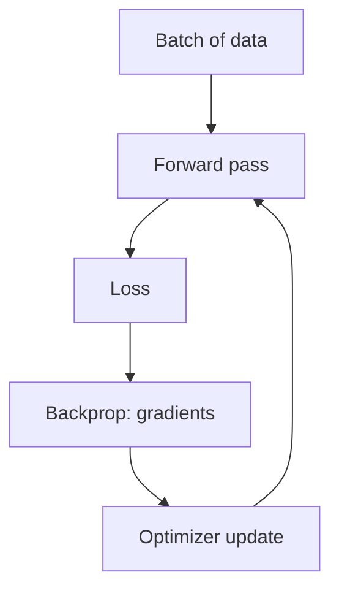

## The training loop

Neural networks learn by minimizing a loss function — a single number that
scores how wrong the model's current predictions are. Every training step
repeats the same four-stage loop, one mini-batch of data at a time:

1. forward pass → compute predictions
2. compute loss
3. backpropagation → compute gradients
4. optimizer step → update weights



Run that loop once for every mini-batch in the training set and you've
completed one **epoch**. A real training run is usually dozens to hundreds of
epochs, with the loss (hopefully) getting smaller each time.

## Backpropagation (intuition)

Backpropagation applies the **chain rule** from calculus to answer one
question for every single weight in the network, no matter how deep: *if I
nudge this weight by a tiny amount, how much does the final loss change?*
Multiply the local derivative of each operation along the path from that
weight to the loss, and you get the answer — that product is the weight's
gradient.

### A tiny worked example

Take the smallest possible case: one input `x`, one weight `w`, one bias `b`,
chained as `x1 = x·w`, `x2 = x1 + b`, and a loss `loss = |y_true − x2|`. With
`x=2`, `w=3`, `b=1`, `y_true=4`, the forward pass gives `x1=6`, `x2=7`, and
`loss=|4−7|=3`. Backpropagation walks that same chain **backward**, computing
one local derivative per edge, then multiplies them along the path from the
loss back to each weight:

```python title="Backprop by hand vs. tf.GradientTape" showLineNumbers{1}
import tensorflow as tf

x, w, b, y_true = 2.0, 3.0, 1.0, 4.0

# forward pass: x1 = x * w, x2 = x1 + b, loss = |y_true - x2|
x1 = x * w                       # 6.0
x2 = x1 + b                      # 7.0
loss_value = abs(y_true - x2)    # 3.0

# chain rule, one edge of the graph at a time
u = y_true - x2
grad_loss_x2 = -1 if u >= 0 else 1   # d|u|/dx2 = -sign(u)
grad_x2_x1 = 1                       # d(x1 + b)/dx1
grad_x2_b = 1                        # d(x1 + b)/db
grad_x1_w = x                        # d(x * w)/dw

grad_loss_w = grad_loss_x2 * grad_x2_x1 * grad_x1_w
grad_loss_b = grad_loss_x2 * grad_x2_b
print("by hand:  dloss/dw =", grad_loss_w, " dloss/db =", grad_loss_b)

# let TensorFlow's autodiff confirm the same numbers
x_t, w_t, b_t = tf.constant(x), tf.Variable(w), tf.Variable(b)
with tf.GradientTape() as tape:
    x1_t = x_t * w_t
    x2_t = x1_t + b_t
    loss_t = tf.abs(y_true - x2_t)

dw, db = tape.gradient(loss_t, [w_t, b_t])
print("autodiff: dloss/dw =", dw.numpy(), " dloss/db =", db.numpy())
```

Both routes agree: `dloss/dw = 2.0` and `dloss/db = 1.0`. That's the entire
idea, just repeated millions of times across every weight and every layer in
a real network — which is exactly why frameworks like TensorFlow implement it
once, generically, as `tf.GradientTape` (or automatically inside
`model.fit()`), instead of every layer author deriving it by hand.

Once every weight has its gradient, adjust it to reduce the loss — that's the
optimizer's job, starting with the simplest one below.

## SGD (Stochastic Gradient Descent)

The plain update rule subtracts the loss gradient from every weight, scaled
by the learning rate `η`:

`θ ← θ − η·∇J(θ)`

In deep learning, "SGD" almost always means **mini-batch** gradient descent
in practice: compute the gradient over the *entire* training set and each
step is accurate but painfully slow (one update per full pass over the data);
compute it from a *single* random instance and each step is nearly free but
wildly noisy. A small mini-batch (say, 32 samples) is the practical middle
ground Keras uses by default — fast per step, only moderately noisy.

```python title="Plain SGD optimizer" showLineNumbers{1}
import tensorflow as tf

optimizer = tf.keras.optimizers.SGD(learning_rate=0.01)
```

Pros:

- simple and well understood — given enough time, it reliably finds a good
  minimum
- cheap per step: no extra state to track beyond the current batch's gradient

Cons:

- can be painfully slow to cross flat stretches of the loss surface (Momentum,
  next, fixes exactly this)
- sensitive to the learning rate: too high and the loss bounces around
  forever without settling; too low and training crawls

## Momentum optimization

Plain SGD takes small, regular steps, so it can be painfully slow to cross a flat
valley. **Momentum optimization** fixes this by remembering previous gradients:
instead of using the gradient directly to update the weights, it accumulates a
*momentum vector* `m`, and uses that to move the weights. Think of a bowling ball
rolling down a slope — it starts slowly, but keeps picking up speed.

`m ← β·m − η·∇J(θ)`
`θ ← θ + m`

The hyperparameter `β` (momentum, typically `0.9`) acts like friction: `0` is
full friction (no momentum, same as plain SGD) and `1` is no friction at all. In
Keras it's just one extra argument to `SGD`:

```python title="Momentum optimizer" showLineNumbers{1}
import tensorflow as tf

optimizer = tf.keras.optimizers.SGD(learning_rate=0.001, momentum=0.9)
```

## Nesterov Accelerated Gradient (NAG)

NAG is a small but nearly-free tweak to momentum: instead of measuring the
gradient at the current position `θ`, it measures it slightly ahead, at
`θ + β·m` — where momentum is already about to carry the weights. Since the
momentum vector usually points roughly toward the optimum, this "look-ahead"
gradient is a little more accurate, and NAG consistently converges faster than
plain momentum:

```python title="Nesterov momentum" showLineNumbers{1}
import tensorflow as tf

optimizer = tf.keras.optimizers.SGD(learning_rate=0.001, momentum=0.9, nesterov=True)
```

## AdaGrad and RMSProp

**AdaGrad** tries to point updates more directly toward the optimum by scaling
down the gradient along steep dimensions faster than along gentle ones — an
*adaptive learning rate*. It accumulates the square of every past gradient, which
solves the "elongated bowl" problem, but the accumulated sum only ever grows, so
the effective learning rate keeps shrinking — often so much that training stops
before it reaches a good solution. AdaGrad is rarely a good choice for deep nets.

**RMSProp** fixes exactly that flaw: instead of accumulating *all* past squared
gradients, it uses exponential decay so it only remembers the most recent ones.

```python title="RMSProp optimizer" showLineNumbers{1}
import tensorflow as tf

optimizer = tf.keras.optimizers.RMSprop(learning_rate=0.001, rho=0.9)
```

## Adam and Nadam

**Adam** ("adaptive moment estimation") combines the two ideas above: it keeps an
exponentially decaying average of past gradients (like momentum) *and* an
exponentially decaying average of past squared gradients (like RMSProp), with a
bias-correction step for the first few iterations. **Nadam** is Adam plus the
Nesterov trick, and it often converges a touch faster still.

Pros:

- usually faster convergence
- strong default choice — the default learning rate `0.001` works well almost
  everywhere

```python title="Adam optimizer" showLineNumbers{1}
import tensorflow as tf

optimizer = tf.keras.optimizers.Adam(learning_rate=0.001, beta_1=0.9, beta_2=0.999)
```

## Putting it in a real training run

```python title="Comparing optimizers on Fashion MNIST" showLineNumbers{1}
import tensorflow as tf

(X_train, y_train), (X_test, y_test) = tf.keras.datasets.fashion_mnist.load_data()
X_train, X_test = X_train / 255.0, X_test / 255.0

def build_model():
    return tf.keras.models.Sequential([
        tf.keras.layers.Flatten(input_shape=[28, 28]),
        tf.keras.layers.Dense(300, activation="relu", kernel_initializer="he_normal"),
        tf.keras.layers.Dense(100, activation="relu", kernel_initializer="he_normal"),
        tf.keras.layers.Dense(10, activation="softmax"),
    ])

optimizers = {
    "sgd": tf.keras.optimizers.SGD(learning_rate=0.01),
    "momentum": tf.keras.optimizers.SGD(learning_rate=0.01, momentum=0.9, nesterov=True),
    "adam": tf.keras.optimizers.Adam(learning_rate=0.001),
}

for name, opt in optimizers.items():
    model = build_model()
    model.compile(loss="sparse_categorical_crossentropy", optimizer=opt, metrics=["accuracy"])
    history = model.fit(X_train, y_train, epochs=3, validation_split=0.1, verbose=0)
    print(name, "final val_accuracy:", round(history.history["val_accuracy"][-1], 4))
```

## Batch size: the other lever besides the optimizer

When a training loop is stuck — loss barely moving, epoch after epoch — it's
tempting to blame the optimizer and start swapping SGD for Adam for Nadam.
Chollet's advice in *Deep Learning with Python* is to check something cheaper
first: the learning rate and the **batch size**. They're the two parameters
that control the gradient descent process most directly, and they're usually
enough on their own to get a stalled run moving again.

A bigger batch means each gradient estimate averages over more samples, so
it's *less noisy* — a more reliable direction to step in, at the cost of more
memory and slower-per-step training:

```python title="Same optimizer, three batch sizes" showLineNumbers{1}
import numpy as np
import tensorflow as tf

np.random.seed(0)
X = np.random.rand(300, 20).astype("float32")
y = (X.sum(axis=1) > 10).astype("float32")

def train(batch_size, epochs=5):
    model = tf.keras.models.Sequential([
        tf.keras.layers.Dense(32, activation="relu", input_shape=(20,)),
        tf.keras.layers.Dense(1, activation="sigmoid"),
    ])
    model.compile(optimizer="adam", loss="binary_crossentropy", metrics=["accuracy"])
    history = model.fit(X, y, epochs=epochs, batch_size=batch_size, verbose=0)
    return history.history["loss"][-1]

for bs in (8, 32, 128):
    print(f"batch_size={bs}: final loss={round(train(bs), 3)}")
```

If lowering the learning rate and raising the batch size still doesn't get
training started, the problem usually isn't the optimizer at all — see
**Vanishing & Exploding Gradients**, next in this phase, for the other common
culprit: a gradient that's already near zero before it even reaches the
optimizer step.

## Visualize it

Every optimizer is trying to reach the bottom of the same loss surface, but they
take very different paths. Plain SGD creeps down step by step, momentum
overshoots and oscillates before settling, and Adam adapts its step size per
dimension to cut almost straight across:

```p5 title="SGD vs Momentum vs Adam on a loss surface" desc="Three optimizers starting from the same point on an elongated bowl-shaped loss surface, leaving a fading trail as they descend to the minimum at very different speeds." height="300"
let paths = [];
let t = 0;
function loss(x, y) { return 0.05 * x * x + 0.9 * y * y; }
function grad(x, y) { return [0.1 * x, 1.8 * y]; }
function reset() {
  paths = [
    { x: -4.2, y: 2.6, m: [0, 0], col: [240, 150, 90], label: "SGD", lr: 0.02, mom: 0, trail: [] },
    { x: -4.2, y: 2.6, m: [0, 0], col: [255, 211, 67], label: "Momentum", lr: 0.02, mom: 0.85, trail: [] },
    { x: -4.2, y: 2.6, s: [0, 0], col: [120, 200, 120], label: "Adam-ish", lr: 0.15, mom: 0, trail: [] },
  ];
  t = 0;
}
function setup() {
  createCanvas(600, 300);
  textFont("monospace");
  reset();
}
function px(x) { return width / 2 + x * 60; }
function py(y) { return height / 2 - 10 + y * 60; }
function runLength() { return 260; }
function envelope() {
  // fade dots/trails in at the start of a run and out at the end, so the
  // loop restart reads as a smooth cut rather than an abrupt teleport
  const fadeFrames = 18, total = runLength();
  if (t < fadeFrames) return t / fadeFrames;
  if (t > total - fadeFrames) return Math.max(0, (total - t) / fadeFrames);
  return 1;
}
function draw() {
  background(13, 17, 23);
  noStroke();
  for (let gx = -5; gx <= 5; gx += 0.25) {
    for (let gy = -2.5; gy <= 2.5; gy += 0.25) {
      const l = loss(gx, gy);
      fill(30 + l * 4, 34 + l * 2, 44, 140);
      rect(px(gx) - 8, py(gy) - 8, 9, 9);
    }
  }
  fill(255, 211, 67);
  ellipse(px(0), py(0), 8, 8);

  const env = envelope();
  for (const p of paths) {
    const [gx, gy] = grad(p.x, p.y);
    if (p.label === "SGD") {
      p.x -= p.lr * gx; p.y -= p.lr * gy;
    } else if (p.label === "Momentum") {
      p.m[0] = p.mom * p.m[0] - p.lr * gx;
      p.m[1] = p.mom * p.m[1] - p.lr * gy;
      p.x += p.m[0]; p.y += p.m[1];
    } else {
      p.s[0] = 0.9 * p.s[0] + 0.1 * gx * gx;
      p.s[1] = 0.9 * p.s[1] + 0.1 * gy * gy;
      p.x -= p.lr * gx / (Math.sqrt(p.s[0]) + 0.15);
      p.y -= p.lr * gy / (Math.sqrt(p.s[1]) + 0.15);
    }
    p.trail.push([p.x, p.y]);
    if (p.trail.length > 14) p.trail.shift();
    for (let i = 0; i < p.trail.length; i++) {
      const [hx, hy] = p.trail[i];
      noStroke();
      fill(p.col[0], p.col[1], p.col[2], (i / p.trail.length) * 140 * env);
      ellipse(px(hx), py(hy), 5, 5);
    }
    fill(p.col[0], p.col[1], p.col[2], 255 * env);
    ellipse(px(p.x), py(p.y), 9, 9);
  }
  let ly = 20;
  for (const p of paths) {
    fill(p.col[0], p.col[1], p.col[2], 255 * env);
    textSize(12);
    textAlign(LEFT, CENTER);
    text(p.label, 14, ly);
    ly += 16;
  }
  t++;
  if (t > runLength()) reset();
}
function mousePressed() { reset(); }
```

## Mini-checkpoint

If training loss oscillates wildly:

- try lowering learning rate.

:::tip[From the book]
Géron's optimizer comparison table (Table 11-2) is a handy cheat sheet: plain
`SGD` has the slowest convergence speed but the best convergence quality;
`SGD(momentum=..., nesterov=True)` is a solid middle ground; `Adagrad` converges
fast but often stops too early; and `RMSProp`, `Adam`, and `Nadam` all converge
fast with good-to-great quality. When in doubt, Adam with its default
`learning_rate=0.001` is the easiest place to start.
:::

import DataCampExercise from "../../../../components/DataCampExercise.astro";

## 🧪 Try It Yourself

### Exercise 1 – Momentum SGD

<DataCampExercise
  lang="python"
  hint={`Pass \`momentum=0.9\` and \`nesterov=True\` to \`tf.keras.optimizers.SGD\`.`}
  code={`# Task: Exercise 1 - Momentum SGD
import tensorflow as tf

optimizer = tf.keras.optimizers.SGD(learning_rate=0.01, ___=0.9, nesterov=True)   # replace ___ with momentum
print("momentum:", optimizer.momentum.numpy())

# ── Expected Output ───────────────────────────────────────────
# momentum: 0.9
# ──────────────────────────────────────────────────────────────`}
  solution={`import tensorflow as tf

optimizer = tf.keras.optimizers.SGD(learning_rate=0.01, momentum=0.9, nesterov=True)
print("momentum:", optimizer.momentum.numpy())`}
  sct={`test_output_contains("momentum: 0.9")
success_msg("Nesterov momentum configured correctly!")`}
  height={140}
/>

### Exercise 2 – Build an Adam Optimizer

<DataCampExercise
  lang="python"
  hint={`Adam is created with \`tf.keras.optimizers.Adam(learning_rate=..., beta_1=..., beta_2=...)\`.`}
  code={`# Task: Exercise 2 - Build an Adam Optimizer
import tensorflow as tf

optimizer = tf.keras.optimizers.___(learning_rate=0.001, beta_1=0.9, beta_2=0.999)   # replace ___ with Adam
print(type(optimizer).__name__)

# ── Expected Output ───────────────────────────────────────────
# Adam
# ──────────────────────────────────────────────────────────────`}
  solution={`import tensorflow as tf

optimizer = tf.keras.optimizers.Adam(learning_rate=0.001, beta_1=0.9, beta_2=0.999)
print(type(optimizer).__name__)`}
  sct={`test_output_contains("Adam")
success_msg("Adam optimizer created!")`}
  height={140}
/>

### Exercise 3 – Compile a Model With RMSProp

<DataCampExercise
  lang="python"
  hint={`Pass the optimizer instance (or the string "rmsprop") to \`model.compile(optimizer=...)\`.`}
  code={`# Task: Exercise 3 - Compile a Model With RMSProp
import tensorflow as tf

model = tf.keras.models.Sequential([
    tf.keras.layers.Dense(10, activation="relu", input_shape=(4,)),
    tf.keras.layers.Dense(1),
])

model.___(loss="mse", optimizer=tf.keras.optimizers.RMSprop(learning_rate=0.001))   # replace ___ with compile
print("optimizer:", model.optimizer.__class__.__name__)

# ── Expected Output ───────────────────────────────────────────
# optimizer: RMSprop
# ──────────────────────────────────────────────────────────────`}
  solution={`import tensorflow as tf

model = tf.keras.models.Sequential([
    tf.keras.layers.Dense(10, activation="relu", input_shape=(4,)),
    tf.keras.layers.Dense(1),
])

model.compile(loss="mse", optimizer=tf.keras.optimizers.RMSprop(learning_rate=0.001))
print("optimizer:", model.optimizer.__class__.__name__)`}
  sct={`test_output_contains("optimizer: RMSprop")
success_msg("Model compiled with RMSProp!")`}
  height={150}
/>

## Next

Continue to **Vanishing & Exploding Gradients** — the optimizer only helps if the
gradient it's following hasn't already vanished on its way back through the network.
