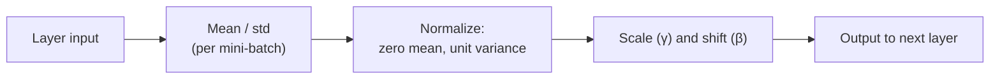

## What you'll learn

- what Batch Normalization actually computes, batch by batch
- why it needs different behavior at training time vs. prediction time
- how to add `BatchNormalization` layers in `tf.keras`, before or after the activation
- the `momentum` hyperparameter, and why BN adds "non-trainable" parameters

## Why BN, if we already fixed initialization?

Good initialization (Glorot/He) and a nonsaturating activation reduce the danger
of vanishing or exploding gradients *at the start* of training — but they don't
guarantee the problem won't come back once training is underway and the weights
have moved. **Batch Normalization** (Ioffe & Szegedy, 2015) solves this directly
by adding a normalizing step inside the network itself, just before or after each
hidden layer's activation function.

For each mini-batch, BN:

1. computes the mean and standard deviation of every input, **across the batch**
2. zero-centers and normalizes each input using those statistics
3. scales and shifts the result with two *learned* parameters per input: `γ`
   (scale) and `β` (shift)



If you add a BN layer as the very first layer of your model, you often don't
even need a separate `StandardScaler` step — BN will approximately standardize
the inputs for you, one batch at a time.

## Training time vs. prediction time

Batch statistics only make sense when you actually have a batch. At prediction
time you might be scoring a single instance, so BN can't compute a mean or
standard deviation from "the batch." Instead, during training it also maintains
a **moving average** of each input's mean and standard deviation, and uses those
frozen, final statistics once training is over. That's why every `BatchNormalization`
layer tracks four parameter vectors:

- `γ` (scale) and `β` (shift) — learned through ordinary backpropagation
- `moving_mean` and `moving_variance` — updated via exponential moving average,
  *not* touched by backpropagation, which is why Keras reports them as
  **non-trainable** parameters

## Adding BatchNormalization in Keras

The most common pattern: one `BatchNormalization` layer right after every hidden
layer (and optionally one as the very first layer):

```python title="Batch Normalization after every hidden layer" showLineNumbers{1}
import tensorflow as tf

model = tf.keras.models.Sequential([
    tf.keras.layers.Flatten(input_shape=[28, 28]),
    tf.keras.layers.BatchNormalization(),
    tf.keras.layers.Dense(300, activation="elu", kernel_initializer="he_normal"),
    tf.keras.layers.BatchNormalization(),
    tf.keras.layers.Dense(100, activation="elu", kernel_initializer="he_normal"),
    tf.keras.layers.BatchNormalization(),
    tf.keras.layers.Dense(10, activation="softmax"),
])

model.summary()
```

There's some debate about whether BN should go *before* or *after* the
activation. To put it before, drop the activation from the `Dense` layer, add a
separate `Activation` layer after the `BatchNormalization`, and — since BN
already has its own shift parameter — drop the `Dense` layer's bias with
`use_bias=False`:

```python title="Batch Normalization before the activation" showLineNumbers{1}
import tensorflow as tf

model = tf.keras.models.Sequential([
    tf.keras.layers.Flatten(input_shape=[28, 28]),
    tf.keras.layers.Dense(300, kernel_initializer="he_normal", use_bias=False),
    tf.keras.layers.BatchNormalization(),
    tf.keras.layers.Activation("elu"),
    tf.keras.layers.Dense(100, kernel_initializer="he_normal", use_bias=False),
    tf.keras.layers.BatchNormalization(),
    tf.keras.layers.Activation("elu"),
    tf.keras.layers.Dense(10, activation="softmax"),
])
```

Checking which parameters of the first BN layer are trainable confirms the split
described above:

```python title="Inspecting a BatchNormalization layer's variables" showLineNumbers{1}
for var in model.layers[1].variables:
    print(var.name, var.trainable)
```

```
batch_normalization/gamma:0 True
batch_normalization/beta:0 True
batch_normalization/moving_mean:0 False
batch_normalization/moving_variance:0 False
```

## The `momentum` hyperparameter

`momentum` controls how quickly the moving averages adapt to new batches. Given a
new batch statistic `v`, BN updates the running average `v̂` with:

`v̂ ← v̂ · momentum + v · (1 − momentum)`

Good values are typically close to `1` — `0.9`, `0.99`, or `0.999` — with more
9s for larger datasets and smaller mini-batches:

```python title="Tuning BN momentum" showLineNumbers{1}
import tensorflow as tf

bn_layer = tf.keras.layers.BatchNormalization(momentum=0.99)
```

## Where this fits in the bigger workflow

In François Chollet's universal workflow of machine learning, "try different
architectures" is one of the standard moves once a model has proven it can
overfit and you've moved on to regularizing and tuning it. Adding
`BatchNormalization` layers is exactly that kind of architecture change: it
doesn't touch your loss function or your data, but it changes how easily the
network trains, which indirectly affects how much regularization (Dropout,
L1/L2, early stopping) you'll actually need on top of it.

## Visualize it

Watch one feature's activations across a mini-batch as training drifts its
mean and spread around — and notice that no matter how wild the raw
distribution gets, the normalized version on the right always snaps back to
a clean, centered shape with mean 0 and standard deviation 1:

```p5 title="A batch's activation distribution, before and after BatchNorm" desc="The raw distribution drifts batch to batch (mean and spread wander); BatchNormalization recenters and rescales it back to mean 0, std 1 every single time." height="280"
let raw = [];
const N = 40;
function setup() {
  createCanvas(600, 280);
  textFont("monospace");
  textAlign(CENTER, CENTER);
  for (let i = 0; i < N; i++) raw.push(randomGaussian());
}
function histogram(values, lo, hi, bins) {
  const counts = new Array(bins).fill(0);
  for (const v of values) {
    let idx = Math.floor(((v - lo) / (hi - lo)) * bins);
    idx = constrain(idx, 0, bins - 1);
    counts[idx]++;
  }
  return counts;
}
function drawHist(counts, x0, x1, baseY, maxH, col) {
  const bins = counts.length;
  const bw = (x1 - x0) / bins;
  const maxCount = Math.max(...counts, 1);
  noStroke();
  fill(col[0], col[1], col[2], 200);
  for (let i = 0; i < bins; i++) {
    const h = (counts[i] / maxCount) * maxH;
    rect(x0 + i * bw + 1, baseY - h, bw - 2, h);
  }
}
function draw() {
  background(13, 17, 23);
  const t = frameCount;

  // simulate a fresh mini-batch drifting away from a nicely-scaled distribution
  const driftMean = 2.4 * Math.sin(t * 0.013);
  const driftStd = 1.6 + 1.0 * Math.sin(t * 0.021 + 1.3);
  const values = raw.map((z) => z * driftStd + driftMean);

  // exactly what a BatchNormalization layer computes for this batch
  const mean = values.reduce((a, b) => a + b, 0) / values.length;
  const variance = values.reduce((a, v) => a + (v - mean) * (v - mean), 0) / values.length;
  const std = Math.sqrt(variance) + 1e-3;
  const normed = values.map((v) => (v - mean) / std);

  const leftX0 = 40, leftX1 = 285, rightX0 = 330, rightX1 = 575;
  const baseY = 225, maxH = 150;

  noStroke();
  fill(200);
  textSize(12);
  text("raw layer output  (drifts batch to batch)", (leftX0 + leftX1) / 2, 18);
  text("after BatchNormalization", (rightX0 + rightX1) / 2, 18);

  stroke(60, 70, 84);
  strokeWeight(1);
  line(leftX0, baseY, leftX1, baseY);
  line(rightX0, baseY, rightX1, baseY);

  drawHist(histogram(values, -7, 7, 16), leftX0, leftX1, baseY, maxH, [240, 150, 90]);
  drawHist(histogram(normed, -3.5, 3.5, 16), rightX0, rightX1, baseY, maxH, [120, 200, 120]);

  noStroke();
  fill(240, 150, 90);
  textSize(11);
  text("mean=" + mean.toFixed(2) + "  std=" + std.toFixed(2), (leftX0 + leftX1) / 2, baseY + 22);
  fill(120, 200, 120);
  text("mean=0.00  std=1.00", (rightX0 + rightX1) / 2, baseY + 22);
}
```

## Mini-checkpoint

Why can Batch Normalization let you use a larger learning rate than usual?

- Because it keeps each layer's inputs consistently scaled, the network becomes
  far less sensitive to the exact weight initialization or to large updates —
  the original paper reported reaching the same accuracy with 14× fewer training
  steps.

:::tip[From the book]
Géron notes a practical trade-off: Batch Normalization adds computation at every
layer, so *each* epoch takes longer wall-clock time to run — but because
convergence is so much faster, you typically need far fewer epochs overall, so
the *total* training time usually still goes down. And once training is done,
it's often possible to fold BN's scale and shift directly into the previous
layer's weights, removing the runtime cost at prediction time entirely.
:::

import DataCampExercise from "../../../../components/DataCampExercise.astro";

## 🧪 Try It Yourself

### Exercise 1 – Add BatchNormalization to a Model

<DataCampExercise
  lang="python"
  hint={`\`tf.keras.layers.BatchNormalization()\` is added as its own layer, with no required arguments.`}
  code={`# Task: Exercise 1 - Add BatchNormalization to a Model
import tensorflow as tf

model = tf.keras.models.Sequential([
    tf.keras.layers.Flatten(input_shape=[28, 28]),
    tf.keras.layers.___(),   # replace ___ with BatchNormalization
    tf.keras.layers.Dense(300, activation="elu"),
])
print(model.layers[1].__class__.__name__)

# ── Expected Output ───────────────────────────────────────────
# BatchNormalization
# ──────────────────────────────────────────────────────────────`}
  solution={`import tensorflow as tf

model = tf.keras.models.Sequential([
    tf.keras.layers.Flatten(input_shape=[28, 28]),
    tf.keras.layers.BatchNormalization(),
    tf.keras.layers.Dense(300, activation="elu"),
])
print(model.layers[1].__class__.__name__)`}
  sct={`test_output_contains("BatchNormalization")
success_msg("BatchNormalization layer added!")`}
  height={150}
/>

### Exercise 2 – Count Trainable BN Parameters

<DataCampExercise
  lang="python"
  hint={`Each BN layer has 4 parameter vectors per input feature: gamma, beta, moving_mean, moving_variance — only 2 of them are trainable.`}
  code={`# Task: Exercise 2 - Count Trainable BN Parameters
import tensorflow as tf

bn = tf.keras.layers.BatchNormalization()
bn.build(input_shape=(None, 300))

trainable = [v for v in bn.variables if v.___]   # replace ___ with trainable
print("trainable vectors:", len(trainable))

# ── Expected Output ───────────────────────────────────────────
# trainable vectors: 2
# ──────────────────────────────────────────────────────────────`}
  solution={`import tensorflow as tf

bn = tf.keras.layers.BatchNormalization()
bn.build(input_shape=(None, 300))

trainable = [v for v in bn.variables if v.trainable]
print("trainable vectors:", len(trainable))`}
  sct={`test_output_contains("trainable vectors: 2")
success_msg("Only gamma and beta are trainable by backprop!")`}
  height={150}
/>

### Exercise 3 – Set the BN Momentum

<DataCampExercise
  lang="python"
  hint={`Pass \`momentum=0.99\` to \`tf.keras.layers.BatchNormalization\`.`}
  code={`# Task: Exercise 3 - Set the BN Momentum
import tensorflow as tf

bn = tf.keras.layers.BatchNormalization(___=0.99)   # replace ___ with momentum
print("momentum:", bn.momentum)

# ── Expected Output ───────────────────────────────────────────
# momentum: 0.99
# ──────────────────────────────────────────────────────────────`}
  solution={`import tensorflow as tf

bn = tf.keras.layers.BatchNormalization(momentum=0.99)
print("momentum:", bn.momentum)`}
  sct={`test_output_contains("momentum: 0.99")
success_msg("Moving averages will now adapt more slowly!")`}
  height={140}
/>

## Next

Continue to **Regularization & Dropout** — with unstable gradients under
control, the next risk for a deep net is simply memorizing the training set.
