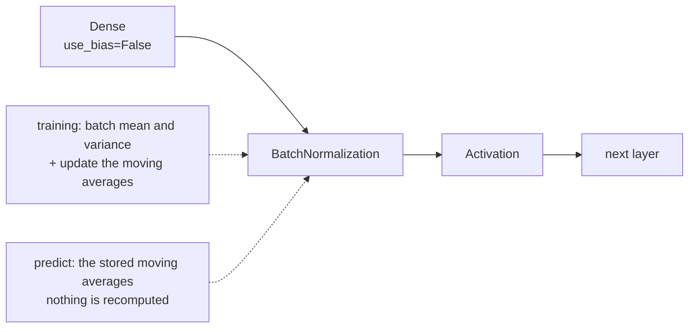

Careful initialisation sets the activation variance to 1 at step zero. Nothing
holds it there once the weights start moving. Batch normalisation gives up on
hoping and simply recomputes the statistics at every layer, on every batch — which
turns out to fix more than it was designed for, and to break in one specific way
worth knowing about.

## What you'll learn

- The four-step BN forward pass, implemented by hand and matched to Keras within
  **1.61e−06**.
- A 10-layer sigmoid network going from **0.1025** accuracy without BN to
  **0.9225** with it.
- Why BN behaves differently in `fit` and `predict`, measured: a moving mean of
  **27.52** against a true mean of **101.56** after three batches.
- What `momentum` costs you: **459 batches** at the default 0.99 to get within 1%,
  and **4,603** at 0.999.
- BN's real practical benefit: at **lr = 1.0** it scored **0.9380** where the same
  network without BN collapsed to **0.3985**.
- The failure case: at **batch size 4** BN was *worse* than no BN (0.8680 against
  0.8830).
- What BN adds to the parameter count, and why half of it is non-trainable.

## What the layer does

For each feature, over the current mini-batch $B$:

$$
\mu_B = \frac{1}{m}\sum_{i=1}^{m} x_i
\qquad
\sigma_B^2 = \frac{1}{m}\sum_{i=1}^{m}(x_i - \mu_B)^2
$$

$$
\hat{x}_i = \frac{x_i - \mu_B}{\sqrt{\sigma_B^2 + \epsilon}}
\qquad
y_i = \gamma \hat{x}_i + \beta
$$

Normalise, then scale and shift by two *learned* parameters. The scale-and-shift is
not decoration: without it the layer would force every activation distribution to
be zero-mean and unit-variance, which is a constraint the network never asked for.
With $\gamma$ and $\beta$ trainable, the network can undo the normalisation
wherever that is what it needs — including recovering the identity exactly.

Implemented by hand on a batch with wildly different feature scales:

| Column | Mean before | Std before | Mean after | Std after |
| --- | --- | --- | --- | --- |
| 0 | −0.4582 | 0.8560 | 0.0000 | 0.9993 |
| 1 | 10.0685 | 3.4553 | −0.0000 | 1.0000 |
| 2 | −3.0483 | 0.1698 | −0.0000 | 0.9831 |
| 3 | **101.5604** | 13.2305 | 0.0000 | 1.0000 |

Maximum difference against `keras.layers.BatchNormalization(training=True)`:
**1.61e−06**. $\gamma$ initialises to 1 and $\beta$ to 0, so an untrained BN layer
*is* exactly the normalisation.

The standard deviations after are 0.9993 and 0.9831 rather than 1.0000 because of
the $\epsilon = 10^{-3}$ in the denominator — it matters most for column 2, whose
variance was only 0.029, so the $\epsilon$ is a noticeable fraction of it.

## The case it was invented for

Ten sigmoid layers of 100 units, SGD at 0.1, twenty epochs, identical seeds:

<Figure
  src="/images/dl/phase-02-training/batch-normalization/bn-depth"
  alt="Two panels. Left: training loss. The no-BN line is perfectly flat at 2.3 for all twenty epochs; the BN line falls from 1.2 to almost zero. Right: validation accuracy. The no-BN line sits at 0.10 the whole time while the BN line jumps from 0.10 to above 0.90 between epochs 3 and 6."
  title="10 sigmoid layers of 100, SGD 0.1"
  caption="Without BN this network never learns anything at all: its loss sits at 2.3056 and its accuracy at 0.1025 for twenty epochs, exactly the ln(10) = 2.3026 signature of a uniform prediction. With BN inserted before each activation, the same architecture and seed reaches 0.9225. Note that BN needed three epochs before anything happened — normalising does not remove the need to warm up."
/>

| | Final training loss | Final validation accuracy |
| --- | --- | --- |
| no BN | 2.3056 | **0.1025** |
| with BN | **0.0210** | **0.9225** |

This is not a marginal improvement; it is the difference between a network and a
random-number generator. Ten stacked sigmoids give a gradient product bounded by
$0.25^{10} \approx 9.5\times 10^{-7}$, as derived on the [vanishing
gradients](/deep-learning/phase-02---training-deep-neural-networks/vanishing--exploding-gradients/)
page. BN resets the scale at every layer, so the product never gets the chance to
collapse.

```python title="BN goes between the linear step and the activation"
keras.layers.Dense(100, use_bias=False),      # BN's beta replaces the bias
keras.layers.BatchNormalization(),
keras.layers.Activation("relu"),
```

`use_bias=False` on the preceding `Dense` is not an optimisation detail: BN
subtracts the batch mean, which removes any constant the bias added. The bias
becomes a parameter with no effect on the output, and $\beta$ does that job
instead.



## Two modes, and the gap between them

BN is one of the few layers that computes something different during `fit` than
during `predict`. In training it uses the current batch's statistics. At inference
there may be no batch — you might be scoring one row — so it uses a running
average accumulated during training.

Measured on a fixed batch, calling the layer three times in training mode and then
once in inference mode:

| Call | Mean of column 3 in the output | `moving_mean[3]` |
| --- | --- | --- |
| training 1 | 0.000000 | 10.156040 |
| training 2 | 0.000000 | 19.296476 |
| training 3 | 0.000000 | 27.522869 |
| **predict** | **10.667809** | 27.522869 |

The true mean of that column is **101.5604**. In training mode the output is
centred by construction — that is what the layer does. In inference mode it
subtracts 27.52 instead of 101.56, so the output is not centred at all, and will
not be until the moving average has caught up.

**This is the source of the classic "my model scores well during training and
badly at predict time" bug.** Nothing is wrong with the model; the moving
statistics have not converged.

### The momentum hyperparameter

$$
\text{moving} \leftarrow \text{momentum} \cdot \text{moving}
+ (1 - \text{momentum}) \cdot \text{batch}
$$

Starting from zero, how long until the estimate reaches within 1% of a true value
of 100?

| `momentum` | After 10 batches | After 50 | After 200 | Batches to reach 99% |
| --- | --- | --- | --- | --- |
| 0.9 | 65.1322 | 99.4846 | 100.0000 | **44** |
| **0.99** (Keras default) | 9.5618 | 39.4994 | 86.6020 | **459** |
| 0.999 | 0.9955 | 4.8794 | 18.1351 | **4,603** |

At the default 0.99 you need roughly 459 optimisation steps before the inference
path is trustworthy. On 8,000 rows at batch 128 that is 63 steps per epoch — so
**seven epochs before the moving statistics are within 1%**. Validate after one
epoch and the result is meaningless.

Lower the momentum for short runs or small datasets; raise it for very long runs
where you want a smoother estimate.

```p5 title="Watch the moving average catch up" desc="The exact recursion Keras uses, drawn for a true value of 100. Drag the momentum slider and see how many batches the inference path needs before it can be trusted." height="330"
let momentum = 0.99;
function setup() {
  createCanvas(600, 330);
  textFont("monospace");
}
function draw() {
  background(13, 17, 23);
  const gx = 60, gy = 50, gw = width - 120, gh = 180;
  const steps = 600;
  const px = (s) => gx + s / steps * gw;
  const py = (v) => gy + gh - v / 110 * gh;
  stroke(60, 70, 84);
  strokeWeight(1);
  line(gx, gy + gh, gx + gw, gy + gh);
  line(gx, gy, gx, gy + gh);
  stroke(255, 211, 67);
  line(gx, py(100), gx + gw, py(100));
  stroke(90, 100, 114);
  strokeWeight(0.8);
  line(gx, py(99), gx + gw, py(99));
  let estimate = 0;
  let reached = null;
  noFill();
  stroke(75, 139, 190);
  strokeWeight(2);
  beginShape();
  vertex(px(0), py(0));
  for (let s = 1; s <= steps; s++) {
    estimate = momentum * estimate + (1 - momentum) * 100;
    if (reached === null && estimate >= 99) reached = s;
    vertex(px(s), py(estimate));
  }
  endShape();
  noStroke();
  fill(230);
  textSize(12);
  textAlign(LEFT, TOP);
  text("moving average of a feature whose true mean is 100", 60, 26);
  fill(255, 211, 67);
  textSize(10);
  textAlign(LEFT, CENTER);
  text("100", gx + gw + 6, py(100));
  fill(150);
  textSize(11);
  textAlign(LEFT, TOP);
  text("momentum = " + momentum.toFixed(4)
    + (Math.abs(momentum - 0.99) < 0.002 ? "   (Keras default)" : ""), 60, 244);
  text("after 600 batches: " + estimate.toFixed(3)
    + "     within 1% after: "
    + (reached === null ? "more than 600" : reached + " batches"), 60, 260);
  fill(90, 100, 114);
  rect(60, 292, 300, 12, 6);
  fill(75, 139, 190);
  ellipse(60 + (momentum - 0.8) / 0.199 * 300, 298, 18, 18);
  fill(150);
  textSize(10);
  textAlign(LEFT, CENTER);
  text("0.8 to 0.999", 376, 298);
}
function mouseDragged() {
  if (mouseY > 280 && mouseY < 316 && mouseX > 50 && mouseX < 370) {
    momentum = Math.max(0.8, Math.min(0.999,
      0.8 + (mouseX - 60) / 300 * 0.199));
  }
}
```

## What BN actually buys on a normal network

Five ReLU layers of 100 — a network that trains perfectly well without help — at
four learning rates:

<Figure
  src="/images/dl/phase-02-training/batch-normalization/bn-learning-rate"
  alt="Grouped bar chart of validation accuracy at learning rates 0.01, 0.1, 0.5 and 1.0, with and without batch normalisation. At 0.01 BN is ahead by 0.08. At 0.1 the two are identical. At 0.5 BN is ahead by 0.04. At 1.0 the no-BN bar collapses to 0.40 while the BN bar holds at 0.94."
  title="5 relu layers of 100 — how much learning rate can it take?"
  caption="At the well-tuned rate of 0.1 the two are exactly equal at 0.9115: BN bought nothing. Its value shows up at the edges — 0.8725 against 0.7900 when the rate is too small, and 0.9380 against 0.3985 when it is ten times too large. BN widens the range of learning rates that work rather than improving the best one."
/>

| Learning rate | no BN | with BN |
| --- | --- | --- |
| 0.01 | 0.7900 | **0.8725** |
| 0.1 | **0.9115** | **0.9115** |
| 0.5 | 0.8945 | 0.9370 |
| 1.0 | **0.3985** | **0.9380** |

At the well-chosen rate the two are *identical to four decimal places*. That is the
honest headline: **BN did not make this network better, it made it harder to
break.** With BN the worst of four learning rates scored 0.8725; without it, 0.3985.
That is why BN lets you use larger rates and shorter schedules — not because it
raises the ceiling.

## Where BN fails: small batches

The statistics come from the batch. A batch of 4 gives a 4-sample estimate of a
mean and variance, which is mostly noise.

<Figure
  src="/images/dl/phase-02-training/batch-normalization/bn-batch-size"
  alt="Line plot of validation accuracy against batch size on a log axis for models with and without BN. At batch 4 the no-BN line is slightly above the BN line; at 16, 64 and 256 the BN line is clearly above, and the gap widens to 0.10 at batch 256."
  title="BN estimates its statistics from the batch it is given"
  caption="At batch 4 BN scored 0.8680 against 0.8830 without it — the only point where BN loses. From batch 16 upward BN is ahead, by 0.019, 0.031 and 0.098. Small-batch training is exactly the regime where LayerNormalization or GroupNormalization are preferred, because neither depends on the batch dimension."
/>

| Batch size | no BN | with BN |
| --- | --- | --- |
| 4 | **0.8830** | 0.8680 |
| 16 | 0.9010 | 0.9200 |
| 64 | 0.8640 | 0.8950 |
| 256 | 0.7240 | 0.8220 |

Two things fall out of that table. BN's advantage *grows* with batch size, because
its estimates get better. And it goes negative at batch 4, because a four-sample
variance is worse than no normalisation at all. If your batch has to be small —
large images, long sequences, memory limits — use `LayerNormalization`, which
normalises across features within each sample and never touches the batch axis.

## The parameter cost

| | Total | Trainable | Non-trainable |
| --- | --- | --- | --- |
| 3 layers, no BN | 99,710 | 99,710 | 0 |
| 3 layers, with BN | 100,610 | 100,010 | **600** |

Each BN layer stores four values per feature: $\gamma$ and $\beta$ are trained,
`moving_mean` and `moving_variance` are not. For three layers of 100 features that
is 600 trainable and 600 non-trainable values, while `use_bias=False` removes 300
biases — so the trainable count rises by 300 and the total by 900.

Those non-trainable values are part of the model's state. **They are saved with the
weights and they must be, or your restored model will normalise with the wrong
statistics.** `model.save` handles this; hand-rolled weight copying often does not.

```p5 title="The measured table, ranked" desc="Click a column to rank every row by it. The bars are that column's values and the highest and lowest are computed from the numbers, not written in." height="254"
let metric = 0;
const COLUMNS = ["Mean before", "Std before", "Std after"];
const ROWS = [
  ["0", -0.4582, 0.856, 0.9993],
  ["1", 10.0685, 3.4553, 1],
  ["2", -3.0483, 0.1698, 0.9831],
  ["3", 101.5604, 13.2305, 1]
];
function setup() {
  createCanvas(620, 254);
  textFont("monospace");
}
function fmt(v) {
  if (v === 0) { return "0"; }
  const a = Math.abs(v);
  if (a >= 1000 || a < 0.001) { return v.toExponential(2); }
  if (a >= 100) { return v.toFixed(1); }
  return v.toFixed(4);
}
function draw() {
  background(13, 17, 23);
  noStroke();
  fill(230);
  textSize(12);
  textAlign(LEFT, TOP);
  text("Batch Normalization", 26, 16);
  let x = 26;
  for (let i = 0; i < COLUMNS.length; i++) {
    const w = COLUMNS[i].length * 6.6 + 16;
    if (i === metric) { fill(255, 211, 67); } else { fill(48, 56, 68); }
    rect(x, 40, w, 22, 4);
    if (i === metric) { fill(13, 17, 23); } else { fill(180); }
    textSize(9);
    text(COLUMNS[i], x + 8, 47);
    x += w + 6;
    if (x > 500) { break; }
  }
  const values = ROWS.map((r) => r[metric + 1]);
  const lo = Math.min(...values);
  const hi = Math.max(...values);
  const span = hi - lo === 0 ? 1 : hi - lo;
  const order = ROWS.slice().sort((a, b) => b[metric + 1] - a[metric + 1]);
  for (let i = 0; i < order.length; i++) {
    const y = 78 + i * 26;
    const v = order[i][metric + 1];
    fill(160);
    textSize(9);
    text(order[i][0], 26, y + 5);
    fill(34, 40, 50);
    rect(230, y, 280, 18, 3);
    const frac = (v - lo) / span;
    if (v === hi) { fill(126, 192, 143); }
    else if (v === lo) { fill(224, 108, 117); }
    else { fill(107, 169, 221); }
    rect(230, y, Math.max(frac * 280, 3), 18, 3);
    fill(225);
    textSize(9);
    text(fmt(v), 518, y + 5);
  }
  const top = order[0];
  const bottom = order[order.length - 1];
  fill(150);
  textSize(9);
  const base = 78 + order.length * 26 + 8;
  text("highest " + COLUMNS[metric] + ": " + top[0] + " at " + fmt(top[1]),
       26, base);
  text("lowest  " + COLUMNS[metric] + ": " + bottom[0] + " at "
       + fmt(bottom[1]), 26, base + 14);
  text("bars are scaled within the chosen column - lowest is not zero", 26,
       base + 30);
}
function mousePressed() {
  let x = 26;
  for (let i = 0; i < COLUMNS.length; i++) {
    const w = COLUMNS[i].length * 6.6 + 16;
    if (mouseX > x && mouseX < x + w && mouseY > 40 && mouseY < 62) {
      metric = i;
    }
    x += w + 6;
  }
}
```

## Pitfalls

- **Validating before the moving statistics converge.** At the default
  `momentum=0.99` that takes 459 batches. Early validation scores can look
  catastrophic for no real reason.
- **Keeping `use_bias=True` before a BN layer.** The bias has no effect — BN
  subtracts the mean — so it is a wasted parameter.
- **Using BN with a batch size below about 16.** Measured, BN lost to no-BN at
  batch 4. Use `LayerNormalization` there.
- **Assuming BN improves the best achievable score.** At the well-tuned learning
  rate here, BN and no-BN tied at 0.9115 exactly.
- **Forgetting the non-trainable weights when copying weights by hand.**
  `moving_mean` and `moving_variance` are model state.
- **Stacking BN and dropout in the same block carelessly.** Dropout changes the
  activation variance that BN just standardised; if you use both, dropout goes
  after BN, and expect to retune both.
- **Fine-tuning with BN layers left trainable on a tiny dataset.** The moving
  statistics get overwritten with estimates from a handful of batches. Freeze them
  or lower the momentum deliberately.

## Recap

- BN normalises each feature over the mini-batch, then applies a learned scale
  $\gamma$ and shift $\beta$ — verified against Keras to 1.61e−06.
- On ten stacked sigmoid layers it took validation accuracy from 0.1025 (a uniform
  prediction) to 0.9225.
- Training mode uses batch statistics; inference mode uses a moving average that
  lags — 27.52 against a true 101.56 after three batches.
- `momentum=0.99` needs 459 batches to get within 1% of the truth; 0.999 needs
  4,603.
- On a network that already trains, BN's benefit is tolerance rather than accuracy:
  identical at lr=0.1, but 0.9380 against 0.3985 at lr=1.0.
- BN loses at batch 4 (0.8680 against 0.8830) and its advantage grows with batch
  size. Small batches want `LayerNormalization`.
- Each BN layer adds four values per feature; two are trainable, two are model
  state that must be saved.

## Next

BN keeps the signal well-scaled. It does not stop a model from memorising its
training set — that needs a different kind of pressure:
[Regularization & Dropout](/deep-learning/phase-02---training-deep-neural-networks/regularization--dropout/).

<Quiz
  questions={[
    {
      q: "Your model reports 0.95 training accuracy but 0.30 when you call predict on the same data, and you are using BatchNormalization. What is the most likely cause?",
      options: [
        "The model is overfitting",
        "The moving statistics have not converged: at momentum=0.99 they need about 459 batches, and until then predict normalises with badly wrong mean and variance estimates",
        "predict applies dropout as well",
        "The data needs rescaling before predict",
      ],
      answer: 1,
      explain: "Measured: after three batches the moving mean was 27.52 against a true 101.56. Train longer, lower the momentum, or both.",
    },
    {
      q: "Why is use_bias=False recommended on a Dense layer immediately followed by BatchNormalization?",
      options: [
        "It makes the layer faster to compute",
        "BN subtracts the batch mean, which cancels any constant the bias added — so the bias cannot affect the output, and BN's own beta parameter plays that role instead",
        "Biases interfere with the gamma parameter",
        "It is required; Keras raises an error otherwise",
      ],
      answer: 1,
      explain: "The bias becomes a parameter with literally no effect. Removing it costs nothing and saves one value per unit.",
    },
    {
      q: "At learning rate 0.1 the network scored 0.9115 both with and without BN, but at 1.0 the scores were 0.9380 and 0.3985. What does that pattern mean?",
      options: [
        "BN only helps at high learning rates and should not be used otherwise",
        "BN's benefit is widening the range of learning rates that work, not raising the best achievable score — it makes training robust rather than better",
        "The lr=0.1 measurement must be wrong",
        "BN removes the need to tune the learning rate at all",
      ],
      answer: 1,
      explain: "That robustness is what lets practitioners use larger rates and shorter schedules, which is a real speed benefit — just not an accuracy one.",
    },
    {
      q: "At batch size 4, BN scored 0.8680 against 0.8830 without it. Why?",
      options: [
        "Small batches make the gradients too noisy for any layer to work",
        "BN estimates the mean and variance from the batch it is given, and a four-sample estimate is mostly noise — so the normalisation injects error rather than removing it",
        "BN requires at least 32 samples by construction",
        "The learning rate was wrong for that batch size",
      ],
      answer: 1,
      explain: "This is the regime where LayerNormalization is preferred: it normalises across features within each sample, so the batch size is irrelevant to it.",
    },
    {
      q: "A BN layer over 100 features adds how many values, and how many of them are trained?",
      options: [
        "100 values, all trained",
        "400 values: gamma and beta (200) are trained, while moving_mean and moving_variance (200) are non-trainable model state that must still be saved with the weights",
        "200 values, all trained",
        "None — BN has no parameters",
      ],
      answer: 1,
      explain: "Forgetting the non-trainable half is a common bug when copying weights by hand: the restored model then normalises with the wrong statistics.",
    },
  ]}
/>

## 🧪 Try It Yourself

<DataCampExercise
  lang="python"
  hint={`Normalise with the batch's own mean and variance, adding epsilon inside the square root for numerical safety. Untrained gamma is 1 and beta is 0.`}
  code={`# Task: Exercise 1 - The BN forward pass by hand
import numpy as np

rng = np.random.RandomState(0)
batch = rng.randn(8, 4) * np.array([1.0, 5.0, 0.2, 20.0]) + np.array([0.0, 10.0, -3.0, 100.0])

print("column stds before are very different:", bool(batch.std(axis=0).max() / batch.std(axis=0).min() > 10))

epsilon = 1e-3
mean = batch.mean(axis=0)
variance = batch.var(axis=0)
normalised = (batch - mean) / np.sqrt(variance + ___)   # replace ___ with epsilon
print("column means after are all zero:", bool(np.allclose(normalised.mean(axis=0), 0, atol=1e-9)))
print("column stds after are all close to one:", bool(np.allclose(normalised.std(axis=0), 1, atol=0.2)))


def batch_norm(x, gamma, beta, eps):
    """Reference version: one column at a time."""
    out = np.empty_like(x)
    for j in range(x.shape[1]):
        col = x[:, j]
        out[:, j] = gamma[j] * (col - col.mean()) / np.sqrt(col.var() + eps) + beta[j]
    return out


reference = batch_norm(batch, np.ones(4), np.zeros(4), epsilon)
print("matches the column-by-column reference:", bool(np.allclose(normalised, reference)))
print("gamma starts at 1 and beta at 0, so the first forward pass is exactly")
print("the normalisation - the scale and shift only matter once trained")`}
  solution={`import numpy as np

rng = np.random.RandomState(0)
batch = rng.randn(8, 4) * np.array([1.0, 5.0, 0.2, 20.0]) + np.array([0.0, 10.0, -3.0, 100.0])

print("column stds before are very different:", bool(batch.std(axis=0).max() / batch.std(axis=0).min() > 10))

epsilon = 1e-3
mean = batch.mean(axis=0)
variance = batch.var(axis=0)
normalised = (batch - mean) / np.sqrt(variance + epsilon)
print("column means after are all zero:", bool(np.allclose(normalised.mean(axis=0), 0, atol=1e-9)))
print("column stds after are all close to one:", bool(np.allclose(normalised.std(axis=0), 1, atol=0.2)))


def batch_norm(x, gamma, beta, eps):
    """Reference version: one column at a time."""
    out = np.empty_like(x)
    for j in range(x.shape[1]):
        col = x[:, j]
        out[:, j] = gamma[j] * (col - col.mean()) / np.sqrt(col.var() + eps) + beta[j]
    return out


reference = batch_norm(batch, np.ones(4), np.zeros(4), epsilon)
print("matches the column-by-column reference:", bool(np.allclose(normalised, reference)))
print("gamma starts at 1 and beta at 0, so the first forward pass is exactly")
print("the normalisation - the scale and shift only matter once trained")`}
  sct={`test_output_contains("column means after are all zero: True", pattern=False)
test_output_contains("column stds after are all close to one: True", pattern=False)
test_output_contains("matches the column-by-column reference: True", pattern=False)
success_msg("Every column ends up with mean 0 and standard deviation about 1 no matter how different their original scales were.")`}
  height={460}
/>

<DataCampExercise
  lang="python"
  hint={`Use the batch's own statistics in training mode and the accumulated moving averages at inference. Watch moving_mean after each call.`}
  code={`# Task: Exercise 2 - Training mode and inference mode differ
import numpy as np


class BatchNorm:
    def __init__(self, features, epsilon=1e-3, momentum=0.9):
        self.eps, self.momentum = epsilon, momentum
        self.moving_mean = np.zeros(features)
        self.moving_var = np.ones(features)

    def __call__(self, x, training):
        if training:
            mean, var = x.mean(axis=0), x.var(axis=0)
            self.moving_mean = self.momentum * self.moving_mean + (1 - self.momentum) * mean
            self.moving_var = self.momentum * self.moving_var + (1 - self.momentum) * var
        else:
            mean, var = self.moving_mean, self.moving_var
        return (x - mean) / np.sqrt(var + self.eps)


rng = np.random.RandomState(0)
batch = rng.randn(8, 4) * np.array([1.0, 5.0, 0.2, 20.0]) + np.array([0.0, 10.0, -3.0, 100.0])

layer = BatchNorm(4)
for step in range(1, 4):
    out = layer(batch, training=___)   # replace ___ with True
    print("train", step, "output column 3 is centred:", bool(abs(out[:, 3].mean()) < 1e-9))
inference = layer(batch, training=False)
true_mean = batch[:, 3].mean()
print("inference output column 3 is NOT centred:", bool(abs(inference[:, 3].mean()) > 1.0))
print("moving mean is still far from the truth:", bool(abs(layer.moving_mean[3] - true_mean) > 0.5 * abs(true_mean)))
print("in training mode the output is centred by construction; at inference it")
print("uses the moving average, which after 3 batches is still far from the truth")`}
  solution={`import numpy as np


class BatchNorm:
    def __init__(self, features, epsilon=1e-3, momentum=0.9):
        self.eps, self.momentum = epsilon, momentum
        self.moving_mean = np.zeros(features)
        self.moving_var = np.ones(features)

    def __call__(self, x, training):
        if training:
            mean, var = x.mean(axis=0), x.var(axis=0)
            self.moving_mean = self.momentum * self.moving_mean + (1 - self.momentum) * mean
            self.moving_var = self.momentum * self.moving_var + (1 - self.momentum) * var
        else:
            mean, var = self.moving_mean, self.moving_var
        return (x - mean) / np.sqrt(var + self.eps)


rng = np.random.RandomState(0)
batch = rng.randn(8, 4) * np.array([1.0, 5.0, 0.2, 20.0]) + np.array([0.0, 10.0, -3.0, 100.0])

layer = BatchNorm(4)
for step in range(1, 4):
    out = layer(batch, training=True)
    print("train", step, "output column 3 is centred:", bool(abs(out[:, 3].mean()) < 1e-9))
inference = layer(batch, training=False)
true_mean = batch[:, 3].mean()
print("inference output column 3 is NOT centred:", bool(abs(inference[:, 3].mean()) > 1.0))
print("moving mean is still far from the truth:", bool(abs(layer.moving_mean[3] - true_mean) > 0.5 * abs(true_mean)))
print("in training mode the output is centred by construction; at inference it")
print("uses the moving average, which after 3 batches is still far from the truth")`}
  sct={`test_output_contains("train 3 output column 3 is centred: True", pattern=False)
test_output_contains("inference output column 3 is NOT centred: True", pattern=False)
test_output_contains("moving mean is still far from the truth: True", pattern=False)
success_msg("Training mode centres every batch by construction. Inference uses the moving averages, which need many batches to catch up.")`}
  height={460}
/>

<DataCampExercise
  lang="python"
  hint={`The update is moving = momentum * moving + (1 - momentum) * batch, starting from zero. Count the steps until the estimate first reaches 99% of the truth.`}
  code={`# Task: Exercise 3 - How long the moving average takes to catch up
true_mean = 100.0
print(f"{'momentum':>10} {'after 10':>12} {'after 50':>12} {'after 200':>12} "
      f"{'batches to 99%':>15}")
for momentum in (0.9, 0.99, 0.999):
    estimate = 0.0
    snapshots = {}
    batches_needed = None
    for step in range(1, 20001):
        estimate = momentum * estimate + (1 - ___) * true_mean
        # replace ___ with momentum
        if step in (10, 50, 200):
            snapshots[step] = estimate
        if batches_needed is None and estimate >= 0.99 * true_mean:
            batches_needed = step
    print(f"{momentum:10.3f} {snapshots[10]:12.4f} {snapshots[50]:12.4f} "
          f"{snapshots[200]:12.4f} {batches_needed:15d}")
print("Keras defaults to momentum=0.99, which needs 459 batches to get within")
print("1% - fine for a long run, badly wrong if you validate after one epoch")

# -- Expected Output -------------------------------------------
#   momentum     after 10     after 50    after 200  batches to 99%
#      0.900      65.1322      99.4846     100.0000              44
#      0.990       9.5618      39.4994      86.6020             459
#      0.999       0.9955       4.8794      18.1351            4603
# Keras defaults to momentum=0.99, which needs 459 batches to get within
# 1% - fine for a long run, badly wrong if you validate after one epoch
# --------------------------------------------------------------`}
  solution={`true_mean = 100.0
print(f"{'momentum':>10} {'after 10':>12} {'after 50':>12} {'after 200':>12} "
      f"{'batches to 99%':>15}")
for momentum in (0.9, 0.99, 0.999):
    estimate = 0.0
    snapshots = {}
    batches_needed = None
    for step in range(1, 20001):
        estimate = momentum * estimate + (1 - momentum) * true_mean
        if step in (10, 50, 200):
            snapshots[step] = estimate
        if batches_needed is None and estimate >= 0.99 * true_mean:
            batches_needed = step
    print(f"{momentum:10.3f} {snapshots[10]:12.4f} {snapshots[50]:12.4f} "
          f"{snapshots[200]:12.4f} {batches_needed:15d}")
print("Keras defaults to momentum=0.99, which needs 459 batches to get within")
print("1% - fine for a long run, badly wrong if you validate after one epoch")`}
  sct={`test_output_contains("0.990       9.5618      39.4994      86.6020             459", pattern=False)
test_output_contains("0.900      65.1322", pattern=False)
success_msg("A momentum of 0.99 needs 459 batches to get within 1% of the true mean, and 0.999 needs 4,603. Validate too early and the statistics are wrong.")`}
  height={460}
/>

<DataCampExercise
  lang="python"
  hint={`Sum the shapes of the trainable weights only. The difference between total and trainable is the moving statistics.`}
  code={`# Task: Exercise 4 - What BN adds to the parameter count
import numpy as np


def make_model(normalise):
    weights = []          # (name, shape, trainable)
    width_in = 784
    for i in range(3):
        weights.append(("kernel", (width_in, 100), True))
        if not normalise:
            weights.append(("bias", (100,), True))
        else:
            weights.append(("gamma", (100,), True))
            weights.append(("beta", (100,), True))
            weights.append(("moving_mean", (100,), False))
            weights.append(("moving_variance", (100,), False))
        width_in = 100
    weights.append(("kernel", (100, 10), True))
    weights.append(("bias", (10,), True))
    return weights


for normalise in (False, True):
    model = make_model(normalise)
    trainable = int(sum(np.prod(shape) for name, shape, t in model if ___))   # replace ___ with t
    total = int(sum(np.prod(shape) for name, shape, t in model))
    print("with BN" if normalise else "no BN", "total", format(total, ","),
          "trainable", format(trainable, ","), "non-trainable", format(total - trainable, ","))
print("each BN layer holds 4 values per feature: gamma and beta are trained,")
print("moving_mean and moving_variance are not")
print("3 layers x 100 features x 2 non-trainable =", 3 * 100 * 2)`}
  solution={`import numpy as np


def make_model(normalise):
    weights = []          # (name, shape, trainable)
    width_in = 784
    for i in range(3):
        weights.append(("kernel", (width_in, 100), True))
        if not normalise:
            weights.append(("bias", (100,), True))
        else:
            weights.append(("gamma", (100,), True))
            weights.append(("beta", (100,), True))
            weights.append(("moving_mean", (100,), False))
            weights.append(("moving_variance", (100,), False))
        width_in = 100
    weights.append(("kernel", (100, 10), True))
    weights.append(("bias", (10,), True))
    return weights


for normalise in (False, True):
    model = make_model(normalise)
    trainable = int(sum(np.prod(shape) for name, shape, t in model if t))
    total = int(sum(np.prod(shape) for name, shape, t in model))
    print("with BN" if normalise else "no BN", "total", format(total, ","),
          "trainable", format(trainable, ","), "non-trainable", format(total - trainable, ","))
print("each BN layer holds 4 values per feature: gamma and beta are trained,")
print("moving_mean and moving_variance are not")
print("3 layers x 100 features x 2 non-trainable =", 3 * 100 * 2)`}
  sct={`test_output_contains("no BN total 99,710 trainable 99,710 non-trainable 0", pattern=False)
test_output_contains("with BN total 100,610 trainable 100,010 non-trainable 600", pattern=False)
success_msg("BN adds 900 parameters here, but 600 of them are moving statistics that gradient descent never touches.")`}
  height={460}
/>

<DataCampExercise
  lang="python"
  hint={`Insert the batch-norm step between the matrix product and the activation, exactly where BatchNormalization sits between Dense and its activation.`}
  code={`# Task: Exercise 5 - BN at depth, where it was invented
import numpy as np

sigmoid = lambda z: 1 / (1 + np.exp(-z))


def batch_norm(z):
    return (z - z.mean(axis=0)) / np.sqrt(z.var(axis=0) + 1e-3)


def deep_forward(normalise, depth=10, seed=0):
    rng = np.random.RandomState(seed)
    a = rng.randn(200, 50)
    for _ in range(depth):
        z = a @ (rng.randn(50, 50) * 0.2)
        if normalise:
            z = ___(z)   # replace ___ with batch_norm
        a = sigmoid(z)
    return a


spread = {}
for label, normalise in (("no BN", False), ("with BN", True)):
    out = deep_forward(normalise)
    spread[label] = float(out.std(axis=0).mean())
    print(label, "activations still differ between examples:", spread[label] > 0.01)
print("without BN the signal has collapsed to a constant:", spread["no BN"] < 0.001)
print("10 sigmoid layers is the case BN was designed for: without it the")
print("gradient never reaches the early layers")`}
  solution={`import numpy as np

sigmoid = lambda z: 1 / (1 + np.exp(-z))


def batch_norm(z):
    return (z - z.mean(axis=0)) / np.sqrt(z.var(axis=0) + 1e-3)


def deep_forward(normalise, depth=10, seed=0):
    rng = np.random.RandomState(seed)
    a = rng.randn(200, 50)
    for _ in range(depth):
        z = a @ (rng.randn(50, 50) * 0.2)
        if normalise:
            z = batch_norm(z)
        a = sigmoid(z)
    return a


spread = {}
for label, normalise in (("no BN", False), ("with BN", True)):
    out = deep_forward(normalise)
    spread[label] = float(out.std(axis=0).mean())
    print(label, "activations still differ between examples:", spread[label] > 0.01)
print("without BN the signal has collapsed to a constant:", spread["no BN"] < 0.001)
print("10 sigmoid layers is the case BN was designed for: without it the")
print("gradient never reaches the early layers")`}
  sct={`test_output_contains("no BN activations still differ between examples: False", pattern=False)
test_output_contains("with BN activations still differ between examples: True", pattern=False)
test_output_contains("without BN the signal has collapsed to a constant: True", pattern=False)
success_msg("After ten sigmoid layers the un-normalised network outputs almost the same value for every example, so there is nothing left to learn from. BN keeps the signal alive.")`}
  height={460}
/>

<DataCampExercise
  lang="python"
  hint={`A big learning rate mostly rescales weights. Multiply the weights by scale and compare how the plain and normalised outputs respond.`}
  code={`# Task: Exercise 6 - How much learning rate BN tolerates
import numpy as np

rng = np.random.RandomState(0)
x = rng.randn(256, 20)
w = rng.randn(20, 30) * 0.3


def batch_norm(z):
    return (z - z.mean(axis=0)) / np.sqrt(z.var(axis=0) + 1e-3)


base_plain = x @ w
base_norm = batch_norm(x @ w)
print("weight scale   no BN output size   BN output changes")
results = []
for scale in (1, 10, 100, 1000):
    plain = x @ (w * ___)   # replace ___ with scale
    normed = batch_norm(x @ (w * scale))
    growth = float(np.abs(plain).mean() / np.abs(base_plain).mean())
    drift = float(np.abs(normed - base_norm).max())
    results.append((scale, growth, drift))
    print(format(scale, "12d"), format(growth, "19.1f"), format(drift, "18.4f"))
print("without BN the output grows with the weight scale:", results[-1][1] > 500)
print("with BN the output barely moves:", max(r[2] for r in results) < 0.1)
print("BN's most practical benefit is tolerating a step size that would")
print("otherwise destroy the run")`}
  solution={`import numpy as np

rng = np.random.RandomState(0)
x = rng.randn(256, 20)
w = rng.randn(20, 30) * 0.3


def batch_norm(z):
    return (z - z.mean(axis=0)) / np.sqrt(z.var(axis=0) + 1e-3)


base_plain = x @ w
base_norm = batch_norm(x @ w)
print("weight scale   no BN output size   BN output changes")
results = []
for scale in (1, 10, 100, 1000):
    plain = x @ (w * scale)
    normed = batch_norm(x @ (w * scale))
    growth = float(np.abs(plain).mean() / np.abs(base_plain).mean())
    drift = float(np.abs(normed - base_norm).max())
    results.append((scale, growth, drift))
    print(format(scale, "12d"), format(growth, "19.1f"), format(drift, "18.4f"))
print("without BN the output grows with the weight scale:", results[-1][1] > 500)
print("with BN the output barely moves:", max(r[2] for r in results) < 0.1)
print("BN's most practical benefit is tolerating a step size that would")
print("otherwise destroy the run")`}
  sct={`test_output_contains("without BN the output grows with the weight scale: True", pattern=False)
test_output_contains("with BN the output barely moves: True", pattern=False)
success_msg("Scaling the weights by 1000 blows up the plain layer but leaves the normalised layer essentially unchanged, which is why BN forgives large steps.")`}
  height={460}
/>
