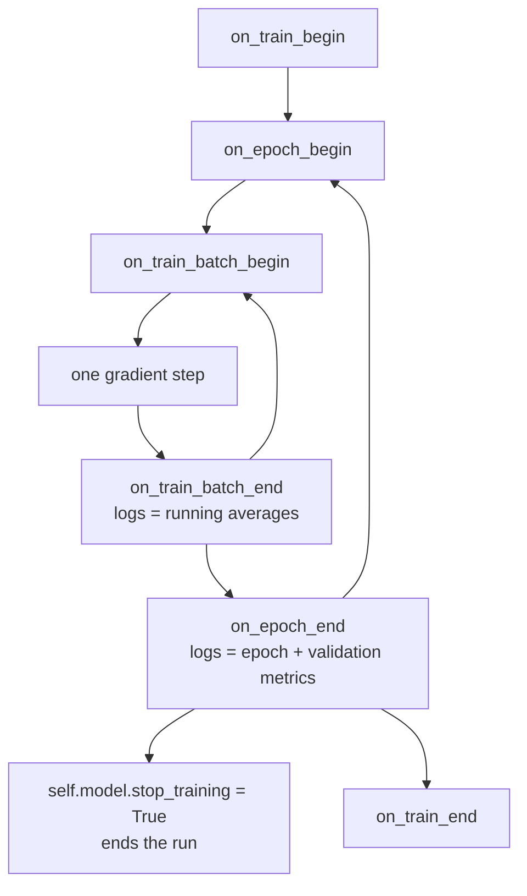

import DataCampExercise from "../../../../components/DataCampExercise.astro";
import Figure from "../../../../components/Figure.astro";
import Quiz from "../../../../components/Quiz.astro";

`model.fit` is a loop you cannot see inside. Callbacks are the hooks that let you
watch it, stop it, save from it and change it mid-flight — and every one of the
training policies in this phase was built from them. This page measures four of
those policies on the same model, and along the way pins down what the loss number
Keras prints during an epoch actually is.

## What you'll learn

- The callback lifecycle, and which hook fires where.
- What `logs["loss"]` means inside `on_train_batch_end`: a **running epoch
  average**, not the batch's loss — measured at **1.1317** mid-epoch against a
  batch range of **0.4560 to 2.0592**.
- Four policies on identical models: **0.8540, 0.8447, 0.8447, 0.8613** test
  accuracy.
- Why `EarlyStopping(restore_best_weights=True)` and
  `ModelCheckpoint(save_best_only=True)` gave **identical** results, and when to
  prefer each.
- The honest catch: early stopping on `val_loss` **cost 0.0093 accuracy** while
  improving the loss by 0.2394.
- What checkpointing costs: **26,060,320 bytes** saving every epoch against
  **3,257,540** for best-only.

## The lifecycle



Every hook receives a `logs` dict and can read `self.model`. Two facts do the heavy
lifting: validation metrics only exist in `on_epoch_end`, and setting
`self.model.stop_training = True` anywhere ends the run cleanly.

```python title="A callback is one class with the hooks you need"
class StopAt(keras.callbacks.Callback):
    def __init__(self, target):
        super().__init__()
        self.target = target
        self.stopped_epoch = None

    def on_epoch_end(self, epoch, logs=None):
        if logs["val_accuracy"] >= self.target:
            self.stopped_epoch = epoch + 1
            self.model.stop_training = True
```

Measured with a target of 0.8600 over a 40-epoch budget: it fired at **epoch 36**
with a validation accuracy of 0.8620, and `fit` returned a history containing 36
entries rather than 40.

## The loss Keras prints is not the loss on the batch

This trips up anyone who writes their first monitoring callback. Inside
`on_train_batch_end`, `logs["loss"]` is the **cumulative average over the epoch so
far** — which is why the progress bar's number falls so smoothly. Record both and
the difference is stark:

<Figure
  src="/images/dl/phase-02-training/callbacks-and-tensorboard/batch-vs-epoch"
  alt="Log-scale plot of training loss against epoch over ten epochs. A grey jagged line shows the loss on each of 470 batches, spanning a wide band. A smooth amber line shows the running average Keras reports, which descends inside that band. Blue dots mark the ten epoch values, sitting on the amber line at each epoch boundary."
  title="Three different numbers, all called 'the loss'"
  caption="The grey line is the actual loss on each batch, recomputed after the step. The amber line is what logs['loss'] returns inside on_train_batch_end: a running average that resets at each epoch boundary, which is why it looks so much smoother. The blue dots are the epoch values Keras prints, and they are simply the amber line's final value for each epoch."
/>

| Epoch | Printed | Batch min | Batch max | Batch sd | Running average mid-epoch |
| --- | --- | --- | --- | --- | --- |
| 1 | 0.9039 | **0.4560** | **2.0592** | **0.3501** | 1.1317 |
| 2 | 0.5289 | 0.3218 | 0.7452 | 0.0943 | 0.5502 |
| 5 | 0.3851 | 0.2165 | 0.5168 | 0.0678 | 0.3882 |
| 10 | 0.2796 | **0.1316** | **0.3895** | 0.0546 | 0.2811 |

Two consequences. In **epoch 1 the individual batches spanned 0.4560 to 2.0592**
while the printed figure was 0.9039 — an average over a window in which the model
changed enormously, so it describes no particular state of the model. And even at
epoch 10 the batch standard deviation is 0.0546, which is larger than most of the
differences this phase has been comparing.

**If you want per-batch losses, compute them yourself** (evaluate the batch after
the step, as the grey line above does). If you want a smooth signal, the running
average is already there.

## Four policies, one model

Every policy below is the same architecture, seed and data — only the callback list
changes. 6,000 Fashion-MNIST rows, 40 epochs maximum, Adam at 1e-3:

<Figure
  src="/images/dl/phase-02-training/callbacks-and-tensorboard/callback-policies"
  alt="Two panels. Left: validation loss per epoch for four policies; three of them rise steadily after about epoch 8 while the ReduceLROnPlateau curve flattens near 0.42. Right: bar chart of test accuracy — 0.8540, 0.8447, 0.8447 and 0.8613 — with the epochs spent annotated on each bar."
  title="Four training policies built only from callbacks"
  caption="EarlyStopping and ModelCheckpoint land on exactly the same test accuracy and loss, because both restore the weights from the same best-validation-loss epoch — early stopping just does it after 17 epochs instead of 40. ReduceLROnPlateau, which keeps training but cuts the learning rate, wins on both metrics."
/>

| Policy | Epochs run | Test accuracy | Test loss |
| --- | --- | --- | --- |
| 40 fixed epochs | 40 | **0.8540** | **0.7037** |
| `EarlyStopping(patience=5, restore_best_weights=True)` | **17** | 0.8447 | 0.4643 |
| `ModelCheckpoint(save_best_only=True)`, reloaded | 40 | 0.8447 | 0.4643 |
| `ReduceLROnPlateau(factor=0.5, patience=3)` | 40 | **0.8613** | **0.4234** |

Three readings, and the second is the uncomfortable one:

1. **Early stopping and best-checkpointing are the same policy.** Identical
   accuracy and identical loss to four decimal places, because both end up holding
   the weights from the same epoch. The difference is operational: early stopping
   saves 23 epochs of compute, while checkpointing survives a crashed process
   because the weights are on disk.
2. **Stopping early cost accuracy.** 0.8447 against the fixed run's 0.8540 — early
   stopping gave back 0.0093 of accuracy while improving the loss by 0.2394. Both
   are true because `val_loss` and `val_accuracy` disagree about when to stop, the
   same divergence measured on the [IMDB
   page](/deep-learning/phase-01---neural-network-foundations/first-example-classifying-movie-reviews-imdb-binary/).
   **Monitor the metric you actually care about**, and if that is accuracy, say so:
   `monitor="val_accuracy", mode="max"`.
3. **Reducing the rate beat stopping.** 0.8613 and 0.4234, best on both columns, by
   continuing to train at a lower rate instead of giving up — consistent with the
   60-epoch plateau run on the [scheduling
   page](/deep-learning/phase-02---training-deep-neural-networks/learning-rate-scheduling/).

```python title="The four policies, in full"
fixed = []

early = [keras.callbacks.EarlyStopping(monitor="val_loss", patience=5,
                                       restore_best_weights=True)]

checkpoint = [keras.callbacks.ModelCheckpoint("best.keras", monitor="val_loss",
                                              save_best_only=True)]
# ... then: model = keras.models.load_model("best.keras")

plateau = [keras.callbacks.ReduceLROnPlateau(monitor="val_loss", factor=0.5,
                                             patience=3, min_lr=1e-5)]
```

## ReduceLROnPlateau, watched rather than described

The callback is usually introduced as free insurance: when validation stops improving,
cut the learning rate. Here is what it actually did, with `factor=0.3` and `patience=3`.

<Figure
  src="/images/dl/phase-02-training/callbacks-and-tensorboard/plateau-trace"
  alt="Top: validation loss per epoch for a fixed learning rate and for ReduceLROnPlateau, with six dashed vertical lines marking the reductions at epochs 9, 13, 17, 20, 23 and 26. The two curves are close, with the fixed run slightly lower late on. Bottom: the learning rate on a log axis, a step function falling from 1e-3 to 1e-6 in six drops."
  title="MNIST, 6,000 rows, 40 epochs, factor 0.3, patience 3"
  caption="Six reductions fired — epochs 9, 13, 17, 20, 23 and 26 — taking the learning rate from 1e-3 to the 1e-6 floor, after which the last 14 epochs did essentially nothing. Best validation accuracy: 0.9320 with the callback against 0.9373 without. On this run the callback made the model worse, and the trace shows why: patience 3 on a noisy validation curve fires on noise, and a factor of 0.3 compounds fast enough that six firings is three orders of magnitude."
/>

| Run | Best validation accuracy | Final | Last learning rate |
| --- | --- | --- | --- |
| Fixed 1e-3 | **0.9373** | 0.9367 | 1.00e-03 |
| ReduceLROnPlateau | 0.9320 | 0.9313 | 1.00e-06 |

This is not an argument against the callback — it is an argument for looking at the trace
rather than the docstring. `patience=3` is short enough that ordinary epoch-to-epoch
noise in validation loss counts as a plateau, and `factor=0.3` compounds: six firings
take 1e-3 to 1e-6, at which point training has stopped in all but name. A longer patience
and a gentler factor are the fix, and the trace is what tells you which one you need.

## What checkpointing costs

`ModelCheckpoint` writes a full `.keras` archive — architecture, weights *and*
optimizer state. For a 269,322-parameter model over 8 epochs:

| | Files written | Total bytes |
| --- | --- | --- |
| save every epoch | 8 | **26,060,320** |
| `save_best_only=True` | 1 | **3,257,540** |

Each archive is 3.26 MB for a model whose raw float32 weights are 1.08 MB — the
extra is Adam's two slots per parameter plus container metadata, exactly as measured
on the [Keras APIs
page](/deep-learning/phase-01---neural-network-foundations/building-neural-networks-with-keras-sequential-and-functional-api/).
Saving every epoch of a real model is how you fill a disk overnight.

Use `save_weights_only=True` when you have the architecture in code and want the
files smaller, and add `save_freq="epoch"` deliberately rather than by accident.

## Logging: History, CSVLogger, TensorBoard

`fit` already returns everything it printed:

```python title="History is a plain dict of lists"
history = model.fit(...)
print(sorted(history.history.keys()))
# ['accuracy', 'loss', 'val_accuracy', 'val_loss']
print(len(history.history["loss"]))    # one entry per epoch actually run
```

For a run you want on disk in a form anything can read:

```python title="CSVLogger writes one row per epoch"
keras.callbacks.CSVLogger("log.csv")
# header:  epoch,accuracy,loss,val_accuracy,val_loss
# epoch 1: 0,0.6831666827201843,0.9038705229759216,0.7639999985694885,0.6423217058181763
```

Measured: three epochs produced **four non-empty lines** — a header and one row per
epoch. Note the `epoch` column is 0-indexed while every table in this phase counts
from 1.

And for the interactive view:

```python title="TensorBoard"
keras.callbacks.TensorBoard(log_dir="logs/run-01")
# then, in a terminal:  tensorboard --logdir logs
```

TensorBoard is worth reaching for when you have **many runs to compare** or want
per-layer weight and gradient histograms. For a single run, `history.history` plus
matplotlib answers most questions with less machinery — every figure in this phase
was made that way. Give each run its own `log_dir`, or the curves overlay each
other unreadably.

```p5 title="Where each hook fires" desc="A miniature training run. Press Step to advance one batch and watch which callback hook fires, what its logs contain, and when validation metrics become available." height="330"
const STEPS_PER_EPOCH = 4, EPOCHS = 3;
let step = -1;
const EVENTS = [];
(function build() {
  EVENTS.push({ hook: "on_train_begin", logs: "{}", epoch: 0 });
  for (let e = 1; e <= EPOCHS; e++) {
    EVENTS.push({ hook: "on_epoch_begin", logs: "{}", epoch: e });
    for (let b = 1; b <= STEPS_PER_EPOCH; b++) {
      EVENTS.push({ hook: "on_train_batch_begin", logs: "{}", epoch: e });
      EVENTS.push({
        hook: "on_train_batch_end",
        logs: "loss, accuracy  (running averages)",
        epoch: e, batch: b,
      });
    }
    EVENTS.push({
      hook: "on_epoch_end",
      logs: "loss, accuracy, val_loss, val_accuracy",
      epoch: e, validation: true,
    });
  }
  EVENTS.push({ hook: "on_train_end", logs: "{}", epoch: EPOCHS });
})();
function setup() {
  createCanvas(600, 330);
  textFont("monospace");
}
function draw() {
  background(13, 17, 23);
  noStroke();
  fill(230);
  textSize(12);
  textAlign(LEFT, TOP);
  text("3 epochs of 4 batches — press Step", 46, 24);
  const current = step >= 0 ? EVENTS[step] : null;
  const window = 8;
  const from = Math.max(0, Math.min(step - 3, EVENTS.length - window));
  for (let i = 0; i < window && from + i < EVENTS.length; i++) {
    const index = from + i;
    const event = EVENTS[index];
    const y = 54 + i * 24;
    const active = index === step;
    fill(active ? 46 : 24, active ? 96 : 30, active ? 140 : 38);
    rect(46, y, 508, 21, 3);
    fill(active ? 245 : 120);
    textSize(11);
    textAlign(LEFT, CENTER);
    text(event.hook, 54, y + 10);
    fill(event.validation ? 255 : (active ? 200 : 100),
         event.validation ? 211 : (active ? 200 : 100),
         event.validation ? 67 : (active ? 200 : 100));
    text(event.logs, 240, y + 10);
  }
  fill(150);
  textSize(11);
  textAlign(LEFT, TOP);
  if (current) {
    text("event " + (step + 1) + " of " + EVENTS.length + "     epoch "
      + current.epoch + (current.batch ? "     batch " + current.batch : ""),
      46, 258);
    text(current.validation
      ? "validation metrics exist only here"
      : "no val_loss available at this hook", 46, 276);
  } else {
    text("press Step to begin", 46, 258);
  }
  fill(90, 100, 114);
  rect(46, 296, 90, 24, 4);
  fill(240);
  textSize(11);
  textAlign(CENTER, CENTER);
  text("step", 91, 308);
  fill(90, 100, 114);
  rect(148, 296, 90, 24, 4);
  fill(240);
  text("reset", 193, 308);
}
function mousePressed() {
  if (mouseY < 296 || mouseY > 320) return;
  if (mouseX > 46 && mouseX < 136) step = Math.min(step + 1, EVENTS.length - 1);
  if (mouseX > 148 && mouseX < 238) step = -1;
}
```

```p5 title="The measured table, ranked" desc="Click a column to rank every row by it. The bars are that column's values and the highest and lowest are computed from the numbers, not written in." height="254"
let metric = 0;
const COLUMNS = ["Printed", "Batch min", "Batch max", "Batch sd"];
const ROWS = [
  ["1", 0.9039, 0.456, 2.0592, 0.3501],
  ["2", 0.5289, 0.3218, 0.7452, 0.0943],
  ["5", 0.3851, 0.2165, 0.5168, 0.0678],
  ["10", 0.2796, 0.1316, 0.3895, 0.0546]
];
function setup() {
  createCanvas(620, 254);
  textFont("monospace");
}
function fmt(v) {
  if (v === 0) { return "0"; }
  const a = Math.abs(v);
  if (a >= 1000 || a < 0.001) { return v.toExponential(2); }
  if (a >= 100) { return v.toFixed(1); }
  return v.toFixed(4);
}
function draw() {
  background(13, 17, 23);
  noStroke();
  fill(230);
  textSize(12);
  textAlign(LEFT, TOP);
  text("Callbacks and TensorBoard", 26, 16);
  let x = 26;
  for (let i = 0; i < COLUMNS.length; i++) {
    const w = COLUMNS[i].length * 6.6 + 16;
    if (i === metric) { fill(255, 211, 67); } else { fill(48, 56, 68); }
    rect(x, 40, w, 22, 4);
    if (i === metric) { fill(13, 17, 23); } else { fill(180); }
    textSize(9);
    text(COLUMNS[i], x + 8, 47);
    x += w + 6;
    if (x > 500) { break; }
  }
  const values = ROWS.map((r) => r[metric + 1]);
  const lo = Math.min(...values);
  const hi = Math.max(...values);
  const span = hi - lo === 0 ? 1 : hi - lo;
  const order = ROWS.slice().sort((a, b) => b[metric + 1] - a[metric + 1]);
  for (let i = 0; i < order.length; i++) {
    const y = 78 + i * 26;
    const v = order[i][metric + 1];
    fill(160);
    textSize(9);
    text(order[i][0], 26, y + 5);
    fill(34, 40, 50);
    rect(230, y, 280, 18, 3);
    const frac = (v - lo) / span;
    if (v === hi) { fill(126, 192, 143); }
    else if (v === lo) { fill(224, 108, 117); }
    else { fill(107, 169, 221); }
    rect(230, y, Math.max(frac * 280, 3), 18, 3);
    fill(225);
    textSize(9);
    text(fmt(v), 518, y + 5);
  }
  const top = order[0];
  const bottom = order[order.length - 1];
  fill(150);
  textSize(9);
  const base = 78 + order.length * 26 + 8;
  text("highest " + COLUMNS[metric] + ": " + top[0] + " at " + fmt(top[1]),
       26, base);
  text("lowest  " + COLUMNS[metric] + ": " + bottom[0] + " at "
       + fmt(bottom[1]), 26, base + 14);
  text("bars are scaled within the chosen column - lowest is not zero", 26,
       base + 30);
}
function mousePressed() {
  let x = 26;
  for (let i = 0; i < COLUMNS.length; i++) {
    const w = COLUMNS[i].length * 6.6 + 16;
    if (mouseX > x && mouseX < x + w && mouseY > 40 && mouseY < 62) {
      metric = i;
    }
    x += w + 6;
  }
}
```

## Pitfalls

- **Treating `logs["loss"]` in `on_train_batch_end` as the batch loss.** It is a
  running epoch average; in epoch 1 the real batches spanned 0.4560 to 2.0592
  against a printed 0.9039.
- **Monitoring `val_loss` when you care about accuracy.** It cost 0.0093 accuracy
  here. Use `monitor="val_accuracy", mode="max"` if that is the goal.
- **Reading validation metrics in `on_train_batch_end`.** They do not exist until
  `on_epoch_end`.
- **`ModelCheckpoint` without `save_best_only`.** Eight epochs wrote 26 MB; the
  best-only version wrote 3.26 MB.
- **Forgetting to reload the checkpoint.** `ModelCheckpoint` writes to disk but
  leaves the in-memory model at its final epoch. You must `load_model` afterwards.
- **Sharing one `log_dir` across runs.** TensorBoard overlays them into an
  unreadable mess. One directory per run.
- **Using both `EarlyStopping` and `ModelCheckpoint(save_best_only)`.** Not wrong,
  but redundant — they select the same epoch. Keep the checkpoint for crash
  recovery, not for a second opinion.
- **Assuming `stop_training` takes effect immediately.** It is checked at the end
  of the current epoch, so the epoch always completes.

## Recap

- Callbacks fire at run, epoch and batch boundaries; validation metrics exist only
  in `on_epoch_end`, and `self.model.stop_training = True` ends the run.
- `logs["loss"]` mid-epoch is a running average. Measured epoch 1: printed 0.9039,
  actual batches 0.4560 to 2.0592, sd 0.3501.
- Four policies on identical models: fixed 40 epochs 0.8540, early stopping 0.8447,
  best-checkpoint 0.8447, plateau reduction 0.8613.
- Early stopping and best-only checkpointing produce identical weights; one saves
  compute, the other survives a crash.
- Stopping on `val_loss` cost 0.0093 accuracy while improving loss by 0.2394 —
  monitor what you will report.
- Saving every epoch cost 26,060,320 bytes against 3,257,540 for best-only, because
  each archive carries the optimizer state too.
- A custom callback with a target threshold fired at epoch 36 of a 40-epoch budget
  and returned a 36-entry history.

## Next

Phase 2 is complete: gradients that survive depth, normalisation, regularisation,
schedules, honest validation, and the callbacks that run it all. Phase 3 changes the
architecture rather than the training — convolutional networks, where the input's
spatial structure becomes part of the model.

<Quiz
  questions={[
    {
      q: "Inside on_train_batch_end, logs['loss'] in epoch 1 read 1.1317 mid-epoch while the individual batch losses ranged from 0.4560 to 2.0592. What is logs['loss']?",
      options: [
        "The loss on the batch that just finished",
        "A cumulative average over all batches in the epoch so far, which is why it falls smoothly and why it does not describe any single state of the model",
        "The validation loss after that batch",
        "An exponential moving average with a fixed decay",
      ],
      answer: 1,
      explain: "If you need true per-batch losses, evaluate the batch yourself after the step. The running average is a smoothed signal, not a measurement of one batch.",
    },
    {
      q: "EarlyStopping(restore_best_weights=True) and ModelCheckpoint(save_best_only=True) gave identical test accuracy and loss. What actually differs between them?",
      options: [
        "Nothing at all — they are aliases",
        "Only the operational properties: early stopping ended after 17 epochs instead of 40 and saved compute, while checkpointing kept training but left the best weights on disk where they survive a crashed process",
        "ModelCheckpoint monitors a different metric by default",
        "EarlyStopping restores weights from the last epoch rather than the best",
      ],
      answer: 1,
      explain: "Both hold the weights from the same best-val_loss epoch. Remember that ModelCheckpoint requires an explicit load_model afterwards.",
    },
    {
      q: "The 40-epoch fixed run scored 0.8540 test accuracy while early stopping on val_loss scored 0.8447. Was early stopping a mistake?",
      options: [
        "Yes — never stop early",
        "It depends on the metric: it improved test loss by 0.2394 while costing 0.0093 accuracy, because val_loss and val_accuracy disagree on the stopping epoch — monitor whichever one you will report",
        "No — accuracy is unreliable and loss is the correct criterion always",
        "The comparison is invalid because the runs differ in length",
      ],
      answer: 1,
      explain: "Setting monitor='val_accuracy', mode='max' is the fix if accuracy is the goal. The default monitors val_loss.",
    },
    {
      q: "Why did checkpointing every epoch for 8 epochs write 26 MB for a model whose float32 weights are only 1.08 MB?",
      options: [
        "The files are uncompressed copies of the training data",
        "Each .keras archive stores architecture, weights and optimizer state — Adam's two slots per parameter roughly triple the size — and there were eight of them",
        "Keras writes a full history log into each file",
        "The measurement includes TensorBoard event files",
      ],
      answer: 1,
      explain: "3.26 MB per archive against 1.08 MB of raw weights. save_weights_only=True shrinks it when the architecture lives in code.",
    },
    {
      q: "Your custom callback sets self.model.stop_training = True inside on_train_batch_end at batch 3 of 50. What happens?",
      options: [
        "Training halts immediately after that batch",
        "The flag is checked at the epoch boundary, so the remaining 47 batches of the epoch still run before fit returns",
        "Keras raises an error because the flag can only be set in on_epoch_end",
        "The epoch restarts from batch 1",
      ],
      answer: 1,
      explain: "The training loop checks the flag between epochs. Setting it mid-epoch works, but the current epoch always completes.",
    },
  ]}
/>

## 🧪 Try It Yourself

<DataCampExercise
  lang="python"
  hint={`Record logs["loss"] and, separately, evaluate the same batch yourself after the step. The two numbers are different quantities.`}
  code={`# Task: Exercise 1 - The loss Keras prints is not the batch loss
import numpy as np
from tensorflow import keras

(x_train, y_train), _ = keras.datasets.fashion_mnist.load_data()
x_train = x_train[:6000].reshape(6000, -1).astype("float32") / 255.0
y_train = y_train[:6000]
BATCH = 128

keras.utils.set_random_seed(0)
model = keras.Sequential([
    keras.layers.Input((784,)),
    keras.layers.Dense(256, activation="relu"),
    keras.layers.Dense(256, activation="relu"),
    keras.layers.Dense(10, activation="softmax"),
])
model.compile(keras.optimizers.Adam(1e-3), "sparse_categorical_crossentropy",
              metrics=["accuracy"])
loss_fn = keras.losses.SparseCategoricalCrossentropy()


class Record(keras.callbacks.Callback):
    def __init__(self):
        super().__init__()
        self.running, self.actual, self.epochs = [], [], []

    def on_train_batch_end(self, batch, logs=None):
        self.running.append(float(logs["___"]))       # replace ___ with loss
        start = batch * BATCH
        rows = x_train[start:start + BATCH]
        labels = y_train[start:start + BATCH]
        self.actual.append(float(loss_fn(labels, model(rows,
                                                       training=False)).numpy()))

    def on_epoch_end(self, epoch, logs=None):
        self.epochs.append(float(logs["loss"]))


recorder = Record()
model.fit(x_train, y_train, epochs=10, batch_size=BATCH, verbose=0,
          callbacks=[recorder])

actual = np.array(recorder.actual)
running = np.array(recorder.running)
steps = int(np.ceil(len(x_train) / BATCH))
print(f"{'epoch':>6} {'printed':>9} {'batch min':>10} {'batch max':>10} "
      f"{'batch sd':>9} {'running mid-epoch':>18}")
for index in (0, 1, 4, 9):
    window = actual[index * steps:(index + 1) * steps]
    mid = running[index * steps + steps // 2]
    print(f"{index + 1:6d} {recorder.epochs[index]:9.4f} {window.min():10.4f} "
          f"{window.max():10.4f} {window.std(ddof=1):9.4f} {mid:18.4f}")
print("logs['loss'] is the running average of the epoch so far, not the loss")
print("on the batch that just finished")

# -- Expected Output -------------------------------------------
#  epoch   printed  batch min  batch max  batch sd  running mid-epoch
#      1    0.9039     0.4560     2.0592    0.3501             1.1317
#      2    0.5289     0.3218     0.7452    0.0943             0.5502
#      5    0.3851     0.2165     0.5168    0.0678             0.3882
#     10    0.2796     0.1316     0.3895    0.0546             0.2811
# logs['loss'] is the running average of the epoch so far, not the loss
# on the batch that just finished
# --------------------------------------------------------------`}
/>

<DataCampExercise
  lang="python"
  hint={`Setting self.model.stop_training = True inside on_epoch_end ends the run after that epoch completes. Record the epoch so you can report it afterwards.`}
  code={`# Task: Exercise 2 - Write a callback that stops on your own condition
import numpy as np
from tensorflow import keras

(x_train, y_train), (x_test, y_test) = keras.datasets.fashion_mnist.load_data()
x_train = x_train[:6000].reshape(6000, -1).astype("float32") / 255.0
y_train = y_train[:6000]
x_test = x_test[:1500].reshape(1500, -1).astype("float32") / 255.0
y_test = y_test[:1500]


class StopAt(keras.callbacks.Callback):
    def __init__(self, target):
        super().__init__()
        self.target = target
        self.stopped_epoch = None

    def on_epoch_end(self, epoch, logs=None):
        if logs["val_accuracy"] >= self.target:
            self.stopped_epoch = epoch + 1
            self.model.___ = True             # replace ___ with stop_training


keras.utils.set_random_seed(0)
model = keras.Sequential([
    keras.layers.Input((784,)),
    keras.layers.Dense(256, activation="relu"),
    keras.layers.Dense(256, activation="relu"),
    keras.layers.Dense(10, activation="softmax"),
])
model.compile(keras.optimizers.Adam(1e-3), "sparse_categorical_crossentropy",
              metrics=["accuracy"])
stop = StopAt(0.86)
history = model.fit(x_train, y_train, epochs=40, batch_size=128, verbose=0,
                    validation_data=(x_test, y_test), callbacks=[stop])
print(f"target 0.8600 reached at epoch {stop.stopped_epoch} of 40")
print(f"epochs actually run: {len(history.history['loss'])}")
print(f"val acc at that point: {history.history['val_accuracy'][-1]:.4f}")

# -- Expected Output -------------------------------------------
# target 0.8600 reached at epoch 36 of 40
# epochs actually run: 36
# val acc at that point: 0.8620
# --------------------------------------------------------------`}
/>

<DataCampExercise
  lang="python"
  hint={`Only the callbacks list changes. ModelCheckpoint leaves the in-memory model at its final epoch, so the checkpoint has to be loaded back before evaluating.`}
  code={`# Task: Exercise 3 - Four policies, one model
import os
import tempfile
import numpy as np
from tensorflow import keras

(x_train, y_train), (x_test, y_test) = keras.datasets.fashion_mnist.load_data()
x_train = x_train[:6000].reshape(6000, -1).astype("float32") / 255.0
y_train = y_train[:6000]
x_test = x_test[:1500].reshape(1500, -1).astype("float32") / 255.0
y_test = y_test[:1500]
checkpoint_path = os.path.join(tempfile.mkdtemp(), "best.keras")


def build():
    keras.utils.set_random_seed(0)
    model = keras.Sequential([
        keras.layers.Input((784,)),
        keras.layers.Dense(256, activation="relu"),
        keras.layers.Dense(256, activation="relu"),
        keras.layers.Dense(10, activation="softmax"),
    ])
    model.compile(keras.optimizers.Adam(1e-3),
                  "sparse_categorical_crossentropy", metrics=["accuracy"])
    return model


policies = [
    ("40 fixed epochs", [], None),
    ("EarlyStopping patience 5",
     [keras.callbacks.EarlyStopping(monitor="val_loss", patience=5,
                                    restore_best_weights=True)], None),
    ("ModelCheckpoint best only",
     [keras.callbacks.ModelCheckpoint(checkpoint_path, monitor="val_loss",
                                      save_best_only=___)],
     checkpoint_path),                            # replace ___ with True
    ("ReduceLROnPlateau 0.5",
     [keras.callbacks.ReduceLROnPlateau(monitor="val_loss", factor=0.5,
                                        patience=3, min_lr=1e-5)], None),
]

print(f"{'policy':28s} {'epochs':>7} {'test acc':>9} {'test loss':>10}")
for label, callbacks, restore in policies:
    model = build()
    history = model.fit(x_train, y_train, epochs=40, batch_size=128, verbose=0,
                        validation_data=(x_test, y_test), callbacks=callbacks)
    if restore:
        model = keras.models.load_model(restore)
    loss, accuracy = model.evaluate(x_test, y_test, verbose=0)
    print(f"{label:28s} {len(history.history['loss']):7d} {accuracy:9.4f} "
          f"{loss:10.4f}")
print("early stopping and best-checkpointing hold the same weights; only the")
print("epochs spent and the crash-safety differ")

# -- Expected Output -------------------------------------------
# policy                        epochs  test acc  test loss
# 40 fixed epochs                   40    0.8540     0.7037
# EarlyStopping patience 5          17    0.8447     0.4643
# ModelCheckpoint best only         40    0.8447     0.4643
# ReduceLROnPlateau 0.5             40    0.8613     0.4234
# early stopping and best-checkpointing hold the same weights; only the
# epochs spent and the crash-safety differ
# --------------------------------------------------------------`}
/>

<DataCampExercise
  lang="python"
  hint={`Without save_best_only, ModelCheckpoint writes one archive per epoch — and each archive carries the optimizer state as well as the weights.`}
  code={`# Task: Exercise 4 - What checkpointing costs on disk
import glob
import os
import tempfile
from tensorflow import keras

(x_train, y_train), (x_test, y_test) = keras.datasets.fashion_mnist.load_data()
x_train = x_train[:6000].reshape(6000, -1).astype("float32") / 255.0
y_train = y_train[:6000]
x_test = x_test[:1500].reshape(1500, -1).astype("float32") / 255.0
y_test = y_test[:1500]
root = tempfile.mkdtemp(prefix="pch-checkpoints-")


def build():
    keras.utils.set_random_seed(0)
    model = keras.Sequential([
        keras.layers.Input((784,)),
        keras.layers.Dense(256, activation="relu"),
        keras.layers.Dense(256, activation="relu"),
        keras.layers.Dense(10, activation="softmax"),
    ])
    model.compile(keras.optimizers.Adam(1e-3),
                  "sparse_categorical_crossentropy", metrics=["accuracy"])
    return model


for label, best_only in (("save every epoch", False), ("save_best_only", True)):
    folder = os.path.join(root, label.replace(" ", "-"))
    os.makedirs(folder, exist_ok=True)
    template = "epoch-{epoch:02d}.keras" if not best_only else "best.keras"
    model = build()
    model.fit(x_train, y_train, epochs=8, batch_size=128, verbose=0,
              validation_data=(x_test, y_test),
              callbacks=[keras.callbacks.ModelCheckpoint(
                  os.path.join(folder, template), monitor="val_loss",
                  save_best_only=___)])            # replace ___ with best_only
    files = sorted(glob.glob(os.path.join(folder, "*.keras")))
    total = sum(os.path.getsize(f) for f in files)
    print(f"{label:18s} {len(files)} file(s)  {total:,} bytes")
print(f"the model has {build().count_params():,} parameters, so its raw float32")
print(f"weights are {build().count_params() * 4:,} bytes - the rest is optimizer")
print("state and container metadata")

# -- Expected Output -------------------------------------------
# save every epoch   8 file(s)  26,060,320 bytes
# save_best_only     1 file(s)  3,257,540 bytes
# the model has 269,322 parameters, so its raw float32
# weights are 1,077,288 bytes - the rest is optimizer
# state and container metadata
# --------------------------------------------------------------`}
/>

<DataCampExercise
  lang="python"
  hint={`CSVLogger writes a header row plus one row per epoch. Filter out blank lines before counting, because the file uses platform line endings.`}
  code={`# Task: Exercise 5 - History and CSVLogger
import os
import tempfile
from tensorflow import keras

(x_train, y_train), (x_test, y_test) = keras.datasets.fashion_mnist.load_data()
x_train = x_train[:6000].reshape(6000, -1).astype("float32") / 255.0
y_train = y_train[:6000]
x_test = x_test[:1500].reshape(1500, -1).astype("float32") / 255.0
y_test = y_test[:1500]
csv_path = os.path.join(tempfile.mkdtemp(), "log.csv")

keras.utils.set_random_seed(0)
model = keras.Sequential([
    keras.layers.Input((784,)),
    keras.layers.Dense(256, activation="relu"),
    keras.layers.Dense(256, activation="relu"),
    keras.layers.Dense(10, activation="softmax"),
])
model.compile(keras.optimizers.Adam(1e-3), "sparse_categorical_crossentropy",
              metrics=["accuracy"])
history = model.fit(x_train, y_train, epochs=3, batch_size=128, verbose=0,
                    validation_data=(x_test, y_test),
                    callbacks=[keras.callbacks.CSVLogger(___)])
# replace ___ with csv_path

print(f"history keys: {sorted(history.history.keys())}")
print(f"entries per key: {len(history.history['loss'])}")
lines = [line for line in open(csv_path).read().splitlines() if line.strip()]
print(f"CSVLogger wrote {len(lines)} non-empty lines: 1 header + "
      f"{len(lines) - 1} epochs")
print(f"header: {lines[0]}")
print(f"epoch 1: {lines[1]}")
print("note the epoch column is 0-indexed")

# -- Expected Output -------------------------------------------
# history keys: ['accuracy', 'loss', 'val_accuracy', 'val_loss']
# entries per key: 3
# CSVLogger wrote 4 non-empty lines: 1 header + 3 epochs
# header: epoch,accuracy,loss,val_accuracy,val_loss
# epoch 1: 0,0.6831666827201843,0.9038705229759216,0.7639999985694885,0.6423217058181763
# note the epoch column is 0-indexed
# --------------------------------------------------------------`}
/>

<DataCampExercise
  lang="python"
  hint={`Log the learning rate yourself in on_epoch_end — Keras does not put it in logs. Reading self.model.optimizer.learning_rate gives the current value.`}
  code={`# Task: Exercise 6 - Log something Keras does not
import numpy as np
from tensorflow import keras

(x_train, y_train), (x_test, y_test) = keras.datasets.fashion_mnist.load_data()
x_train = x_train[:6000].reshape(6000, -1).astype("float32") / 255.0
y_train = y_train[:6000]
x_test = x_test[:1500].reshape(1500, -1).astype("float32") / 255.0
y_test = y_test[:1500]


class LogRate(keras.callbacks.Callback):
    def on_epoch_end(self, epoch, logs=None):
        logs["learning_rate"] = float(self.model.optimizer.___)
        # replace ___ with learning_rate


keras.utils.set_random_seed(0)
model = keras.Sequential([
    keras.layers.Input((784,)),
    keras.layers.Dense(256, activation="relu"),
    keras.layers.Dense(10, activation="softmax"),
])
model.compile(keras.optimizers.SGD(0.2), "sparse_categorical_crossentropy",
              metrics=["accuracy"])
history = model.fit(
    x_train, y_train, epochs=20, batch_size=128, verbose=0,
    validation_data=(x_test, y_test),
    callbacks=[LogRate(), keras.callbacks.ReduceLROnPlateau(
        monitor="val_loss", factor=0.5, patience=2, min_lr=1e-4)])

print(f"history now includes: {sorted(history.history.keys())}")
rates = history.history["learning_rate"]
print(f"{'epoch':>6} {'learning_rate':>14} {'val_loss':>10}")
previous = None
for epoch, (rate, loss) in enumerate(zip(rates,
                                         history.history["val_loss"]), start=1):
    if previous is None or abs(rate - previous) > 1e-12:
        print(f"{epoch:6d} {rate:14.6f} {loss:10.4f}")
    previous = rate
print(f"final rate {rates[-1]:.6f} after "
      f"{sum(1 for a, b in zip(rates, rates[1:]) if abs(a - b) > 1e-12)} "
      f"reductions")
print("anything you put into logs becomes part of history - and is picked up")
print("by CSVLogger and TensorBoard too")

# -- Expected Output -------------------------------------------
# history now includes: ['accuracy', 'learning_rate', 'loss', 'val_accuracy', 'val_loss']
#  epoch  learning_rate   val_loss
#      1       0.200000     0.7763
#     17       0.100000     0.4289
# final rate 0.100000 after 1 reductions
# anything you put into logs becomes part of history - and is picked up
# by CSVLogger and TensorBoard too
# --------------------------------------------------------------`}
/>
