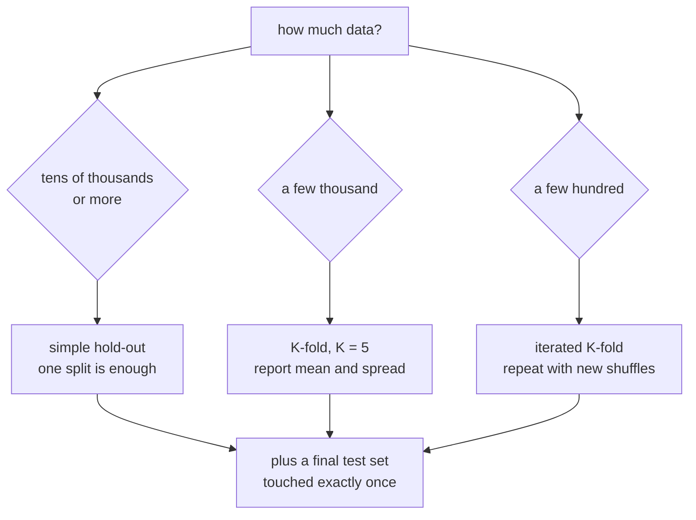

Every technique in this phase was judged by a validation number. This page is
about whether that number means anything. Two failure modes matter: the score has
too much variance to compare anything, or information from the test set has leaked
into training and the score is fiction. Both are measured below, and the second one
reached **0.9600 accuracy on data with no signal in it at all**.

## What you'll learn

- The spread across 30 random hold-out splits of the same data: **0.7333 to
  0.8750**, a range of 0.1417.
- Why K-fold cuts that: **sd 0.0225 against 0.0407** for single splits.
- Three information leaks measured on pure noise, where the honest answer is
  **0.5100**: feature selection before the split gave **0.7550**, and duplicated
  rows gave **0.9600**.
- Why the duplicate-row leak only appears once the split is shuffled.
- How to read a learning curve: the train/validation gap falling from **0.2450 to
  0.0822** as data grows 40×.
- When to use hold-out, K-fold, and iterated K-fold.

## One split is not a measurement

600 rows, logistic regression, 80/20 hold-out, repeated 30 times with a different
random split each time:

<Figure
  src="/images/dl/phase-02-training/evaluating-models/holdout-variance"
  alt="Two panels. Left: a histogram of 30 hold-out accuracies spread from 0.73 to 0.875, with the mean at 0.80 marked. Right: a bar chart of five cross-validation fold accuracies between 0.783 and 0.833, with the mean marked at 0.805."
  title="The same model and the same rows, scored 30 different ways"
  caption="Nothing changes between the 30 runs except which 120 rows are held out. The scores span 0.7333 to 0.8750 — a range of 0.1417, or 14 accuracy points. Five-fold cross-validation on the same rows gives a standard deviation of 0.0225 against the single-split 0.0407, because every row is used for validation exactly once instead of by chance."
/>

| | Value |
| --- | --- |
| mean across 30 splits | 0.8017 |
| standard deviation | **0.0407** |
| worst split | **0.7333** |
| best split | **0.8750** |
| range | **0.1417** |

Pick one split and report it, and you report a number drawn from that
distribution. If you also *tuned* on that split, you have selected the split that
flattered you.

Five-fold cross-validation on the identical rows:

| Fold | Accuracy |
| --- | --- |
| 1 | 0.7917 |
| 2 | 0.7917 |
| 3 | 0.7833 |
| 4 | 0.8250 |
| 5 | 0.8333 |
| mean | **0.8050** (sd 0.0225) |

K-fold does not remove the variance — the folds still disagree by 0.05 — but it
halves the standard deviation and, more importantly, it *reports* the spread. A
mean with no spread beside it is an incomplete result. The [house-price
page](/deep-learning/phase-01---neural-network-foundations/first-example-predicting-house-prices-regression/)
measured the same effect on 404 rows, where four folds disagreed by 0.8018 MAE.



## Three ways to leak, measured on nothing

Build a dataset with **no signal whatsoever**: 200 rows, 2,000 standard-normal
features, labels drawn at random. The honest cross-validated accuracy is chance —
measured at **0.5100** for the majority class. Anything above that is leakage,
because there is nothing to learn.

<Figure
  src="/images/dl/phase-02-training/evaluating-models/leakage"
  alt="Two panels of bar charts. Left: three logistic-regression procedures — honest selection inside the folds at 0.555, selection before the split at 0.755, and scaling plus selection before the split also at 0.755 — against a dashed chance line at 0.51. Right: 1-nearest-neighbour with no duplicates at 0.535 and with every row duplicated at 0.96."
  title="200 rows of pure noise, 2000 random features, random labels"
  caption="Green bars are honest procedures and land near chance, as they must. Selecting the 20 'best' features using every row before cross-validating produces 0.7550 — a 24-point lift out of nothing, because the selection step saw the labels of the rows it would later be tested on. Duplicating every row before splitting takes 1-nearest-neighbour to 0.9600, because each test row's exact twin is sitting in the training fold."
/>

| Procedure | Cross-validated accuracy | Honest? |
| --- | --- | --- |
| chance (majority class) | 0.5100 | — |
| feature selection inside each fold | 0.5550 | **yes** |
| feature selection using every row first | **0.7550** | no |
| scaling *and* selection before the split | 0.7550 | no |
| 1-NN, no duplicates | 0.5350 | **yes** |
| 1-NN, every row duplicated | **0.9600** | no |

Three lessons, in order of how often they bite:

1. **Any step that looks at the labels must live inside the fold.** Feature
   selection is the classic case: choosing the 20 features most correlated with the
   labels, using all 200 rows, hands the model 20 features that are correlated with
   the validation labels *by construction*. The lift is 0.2450 out of pure noise.
2. **Scaling before the split leaks too, but much less.** `StandardScaler` uses no
   labels, so it only leaks the feature distribution. Here it added nothing on top
   of the selection leak — the measured 0.7550 is identical. It matters more when
   the test set is small or distributed differently.
3. **Duplicate rows are the leak nobody looks for.** Near-copies of the same record
   — the same customer twice, the same image resized, augmented copies made before
   splitting — put a test row's twin in the training set. A model that can memorise
   then scores 0.9600 on noise.

### The duplicate leak needs a shuffle

A useful detail: with contiguous (unshuffled) folds, duplicating each row *in
place* does not leak at all, because both copies land in the same fold. The leak
appears only when the split is shuffled — which is what you are told to do, and
should do. Two safe practices, not one:

```python title="Deduplicate first, then shuffle"
_, unique_rows = np.unique(x, axis=0, return_index=True)
x, y = x[np.sort(unique_rows)], y[np.sort(unique_rows)]
# and: split by group (customer, patient, document) when rows are related
```

Grouped splitting — `GroupKFold` in scikit-learn — is the general answer whenever
rows are not independent.

## The learning curve tells you what to fix

Train the same model on growing subsets and record both accuracies:

<Figure
  src="/images/dl/phase-02-training/evaluating-models/learning-curve"
  alt="Log-scale plot of accuracy against training rows from 200 to 8000. The training curve starts at 0.985 and drifts down to 0.937; the validation curve rises from 0.74 to 0.855. The annotated gap above each point falls from 0.245 to 0.082."
  title="The gap above each point is train minus validation"
  caption="At 200 rows the model is at 0.9850 on its training data and 0.7400 on held-out data — a gap of 0.2450, which is the signature of not enough data rather than a bad model. By 8,000 rows the gap is 0.0822 and the validation curve is flattening: each doubling now buys less, so more data is no longer the cheapest improvement."
/>

| Training rows | Train accuracy | Validation accuracy | Gap |
| --- | --- | --- | --- |
| 200 | 0.9850 | 0.7400 | **0.2450** |
| 500 | 0.9880 | 0.7915 | 0.1965 |
| 1,000 | 0.9620 | 0.8080 | 0.1540 |
| 2,000 | 0.9455 | 0.8310 | 0.1145 |
| 4,000 | 0.9542 | 0.8495 | 0.1047 |
| 8,000 | 0.9367 | 0.8545 | **0.0822** |

Two diagnoses come straight off this table:

- **A large gap that shrinks as data grows** means the model is memorising and more
  data is the fix. That is the whole curve above: 40× the data closed two thirds of
  the gap.
- **A flattening validation curve** means more data has stopped paying. Between
  4,000 and 8,000 rows — a doubling — validation gained 0.0050. At that point
  capacity, features or architecture are the cheaper levers.

If instead *both* curves are low and close together, the model is underfitting and
more data will not help at all.

## Three validation schemes

```python title="Hold-out: one split, cheapest"
x_val, y_val = x_train[:5000], y_train[:5000]
x_fit, y_fit = x_train[5000:], y_train[5000:]
```

```python title="K-fold: every row validated exactly once"
from sklearn.model_selection import KFold
for train_index, val_index in KFold(5, shuffle=True, random_state=0).split(x):
    ...   # train a fresh model per fold, then average and report the spread
```

```python title="Iterated K-fold: K-fold with several shuffles"
from sklearn.model_selection import RepeatedKFold
for train_index, val_index in RepeatedKFold(n_splits=5, n_repeats=3,
                                            random_state=0).split(x):
    ...   # 15 models; the standard error shrinks with the count
```

| Scheme | Models trained | Use when |
| --- | --- | --- |
| hold-out | 1 | tens of thousands of rows or more |
| K-fold (K=5) | 5 | a few thousand rows |
| iterated K-fold | K × repeats | a few hundred rows, or a decision that matters |

And regardless of the scheme: **one final test set, evaluated once, after every
decision is made.** The validation score is contaminated by definition, because you
used it to choose things. The [IMDB
page](/deep-learning/phase-01---neural-network-foundations/first-example-classifying-movie-reviews-imdb-binary/)
measured that gap directly: 0.8882 on validation at the chosen epoch, 0.8792 on the
test set.

```p5 title="Draw your own split" desc="Sixty rows, one model, one split. Press Split to shuffle a new 80/20 division and watch the reported accuracy move — the model never changes, only which rows are held out." height="330"
const N = 60;
let rows = [];
let heldOut = [];
let history = [];
function setup() {
  createCanvas(600, 330);
  textFont("monospace");
  for (let i = 0; i < N; i++) {
    // A row is "easy" or "hard": the model gets easy ones right.
    rows.push({ easy: Math.random() > 0.25 });
  }
  split();
}
function split() {
  const order = [];
  for (let i = 0; i < N; i++) order.push(i);
  for (let i = N - 1; i > 0; i--) {
    const j = Math.floor(Math.random() * (i + 1));
    [order[i], order[j]] = [order[j], order[i]];
  }
  heldOut = order.slice(0, 12);
  let right = 0;
  for (const index of heldOut) if (rows[index].easy) right++;
  history.push(right / heldOut.length);
  if (history.length > 40) history.shift();
}
function draw() {
  background(13, 17, 23);
  noStroke();
  fill(230);
  textSize(12);
  textAlign(LEFT, TOP);
  text("60 rows: filled = held out this time", 50, 24);
  for (let i = 0; i < N; i++) {
    const x = 50 + (i % 20) * 25, y = 52 + Math.floor(i / 20) * 25;
    const out = heldOut.includes(i);
    const easy = rows[i].easy;
    if (out) fill(easy ? 120 : 230, easy ? 200 : 110, easy ? 120 : 110);
    else fill(easy ? 40 : 60, easy ? 60 : 44, easy ? 74 : 52);
    rect(x, y, 20, 20, 3);
  }
  const latest = history[history.length - 1];
  fill(255, 211, 67);
  textSize(13);
  textAlign(LEFT, TOP);
  text("this split's accuracy: " + latest.toFixed(4), 50, 142);
  const mean = history.reduce((a, b) => a + b, 0) / history.length;
  fill(200);
  textSize(11);
  text("splits drawn: " + history.length + "     mean "
    + mean.toFixed(4) + "     min " + Math.min(...history).toFixed(4)
    + "     max " + Math.max(...history).toFixed(4), 50, 164);
  const gx = 50, gy = 190, gw = 500, gh = 80;
  stroke(60, 70, 84);
  strokeWeight(1);
  line(gx, gy + gh, gx + gw, gy + gh);
  noFill();
  stroke(75, 139, 190);
  strokeWeight(1.6);
  beginShape();
  for (let i = 0; i < history.length; i++) {
    vertex(gx + i / 39 * gw, gy + gh - history[i] * gh);
  }
  endShape();
  noStroke();
  fill(150);
  textSize(10);
  textAlign(LEFT, TOP);
  text("each point is one 80/20 split of the same 60 rows", gx, gy + gh + 6);
  fill(90, 100, 114);
  rect(50, 296, 110, 24, 4);
  fill(240);
  textSize(11);
  textAlign(CENTER, CENTER);
  text("new split", 105, 308);
  fill(150);
  textAlign(LEFT, CENTER);
  textSize(10);
  text("the model is identical every time", 176, 308);
}
function mousePressed() {
  if (mouseX > 50 && mouseX < 160 && mouseY > 296 && mouseY < 320) split();
}
```

```p5 title="The measured table, ranked" desc="Click a column to rank every row by it. The bars are that column's values and the highest and lowest are computed from the numbers, not written in." height="306"
let metric = 0;
const COLUMNS = ["Train accuracy", "Validation accuracy", "Gap"];
const ROWS = [
  ["200", 0.985, 0.74, 0.245],
  ["500", 0.988, 0.7915, 0.1965],
  ["1,000", 0.962, 0.808, 0.154],
  ["2,000", 0.9455, 0.831, 0.1145],
  ["4,000", 0.9542, 0.8495, 0.1047],
  ["8,000", 0.9367, 0.8545, 0.0822]
];
function setup() {
  createCanvas(620, 306);
  textFont("monospace");
}
function fmt(v) {
  if (v === 0) { return "0"; }
  const a = Math.abs(v);
  if (a >= 1000 || a < 0.001) { return v.toExponential(2); }
  if (a >= 100) { return v.toFixed(1); }
  return v.toFixed(4);
}
function draw() {
  background(13, 17, 23);
  noStroke();
  fill(230);
  textSize(12);
  textAlign(LEFT, TOP);
  text("'Evaluating Models: Generalization", 26, 16);
  let x = 26;
  for (let i = 0; i < COLUMNS.length; i++) {
    const w = COLUMNS[i].length * 6.6 + 16;
    if (i === metric) { fill(255, 211, 67); } else { fill(48, 56, 68); }
    rect(x, 40, w, 22, 4);
    if (i === metric) { fill(13, 17, 23); } else { fill(180); }
    textSize(9);
    text(COLUMNS[i], x + 8, 47);
    x += w + 6;
    if (x > 500) { break; }
  }
  const values = ROWS.map((r) => r[metric + 1]);
  const lo = Math.min(...values);
  const hi = Math.max(...values);
  const span = hi - lo === 0 ? 1 : hi - lo;
  const order = ROWS.slice().sort((a, b) => b[metric + 1] - a[metric + 1]);
  for (let i = 0; i < order.length; i++) {
    const y = 78 + i * 26;
    const v = order[i][metric + 1];
    fill(160);
    textSize(9);
    text(order[i][0], 26, y + 5);
    fill(34, 40, 50);
    rect(230, y, 280, 18, 3);
    const frac = (v - lo) / span;
    if (v === hi) { fill(126, 192, 143); }
    else if (v === lo) { fill(224, 108, 117); }
    else { fill(107, 169, 221); }
    rect(230, y, Math.max(frac * 280, 3), 18, 3);
    fill(225);
    textSize(9);
    text(fmt(v), 518, y + 5);
  }
  const top = order[0];
  const bottom = order[order.length - 1];
  fill(150);
  textSize(9);
  const base = 78 + order.length * 26 + 8;
  text("highest " + COLUMNS[metric] + ": " + top[0] + " at " + fmt(top[1]),
       26, base);
  text("lowest  " + COLUMNS[metric] + ": " + bottom[0] + " at "
       + fmt(bottom[1]), 26, base + 14);
  text("bars are scaled within the chosen column - lowest is not zero", 26,
       base + 30);
}
function mousePressed() {
  let x = 26;
  for (let i = 0; i < COLUMNS.length; i++) {
    const w = COLUMNS[i].length * 6.6 + 16;
    if (mouseX > x && mouseX < x + w && mouseY > 40 && mouseY < 62) {
      metric = i;
    }
    x += w + 6;
  }
}
```

## Pitfalls

- **Reporting a single hold-out score.** Thirty splits of the same data spanned
  0.1417 here.
- **Fitting a scaler, imputer or feature selector before splitting.** Selection
  before the split reached 0.7550 on pure noise.
- **Augmenting or duplicating rows before splitting.** 1-NN scored 0.9600 on noise
  with duplicated rows.
- **Splitting related rows independently.** Same customer, patient or document
  across both sides is the same leak. Use grouped splitting.
- **Tuning on the test set.** Every decision made by looking at a split
  contaminates it; keep one split for one final measurement.
- **Reporting a K-fold mean without its spread.** The mean alone hides that the
  folds disagreed by 0.05.
- **Reading a small gap as success.** If both curves are low and close, the model
  is underfitting — the gap being small is not the goal.
- **Shuffling time-series data.** A shuffled split lets the model see the future.
  Split by time instead.

## Recap

- Thirty random hold-out splits of 600 rows gave 0.7333 to 0.8750: a single split
  is a draw from that distribution.
- Five-fold cross-validation on the same rows had sd 0.0225 against the single
  split's 0.0407, and reports its own spread.
- On 200 rows of pure noise where chance is 0.5100, selecting features before the
  split scored 0.7550 and duplicated rows scored 0.9600.
- The duplicate leak only appears once the split is shuffled — deduplicate, and
  split by group when rows are related.
- A large gap that shrinks with more data means memorising; a flattening validation
  curve means more data has stopped paying. Measured: gap 0.2450 → 0.0822 across
  40× the data, with the last doubling buying 0.0050.
- Hold-out for large data, K-fold for thousands of rows, iterated K-fold for
  hundreds — plus one test set evaluated exactly once.

## Next

The mechanics of running, watching and stopping a training job — all of it built
from callbacks:
[Callbacks and TensorBoard](/deep-learning/phase-02---training-deep-neural-networks/callbacks-and-tensorboard/).

<Quiz
  questions={[
    {
      q: "Thirty random 80/20 splits of the same 600 rows produced accuracies from 0.7333 to 0.8750. What does that imply about a reported single-split score?",
      options: [
        "It is unbiased and therefore fine to report",
        "It is one draw from a distribution 14 accuracy points wide, so it cannot support a comparison between models unless the difference is larger than that spread",
        "It means the model is unstable and should be retrained",
        "It only matters for datasets under 100 rows",
      ],
      answer: 1,
      explain: "And if you also tuned on that split, you have selected the split that flattered you. Report a K-fold mean with its spread.",
    },
    {
      q: "On 200 rows of random features and random labels, selecting the 20 most correlated features using every row before cross-validating gave 0.7550 accuracy. Where does that come from?",
      options: [
        "The features were not truly random",
        "The selection step saw the labels of the rows it would later be validated on, so the surviving features are correlated with those validation labels by construction — the lift is manufactured, not learned",
        "Logistic regression overfits 20 features",
        "Cross-validation is unreliable at 200 rows",
      ],
      answer: 1,
      explain: "The fix is a pipeline: put the selector inside the fold so it only ever sees training labels. That scored 0.5550, near the 0.5100 chance level.",
    },
    {
      q: "Duplicating every row before splitting took 1-nearest-neighbour to 0.9600 on pure noise — but only with a shuffled split. Why does the shuffle matter?",
      options: [
        "Shuffling changes the labels",
        "With contiguous folds the two copies of a row land in the same fold, so nothing leaks; shuffling separates them, putting each test row's exact twin in the training fold",
        "1-NN requires shuffled data to work",
        "Contiguous folds are always safer and should be preferred",
      ],
      answer: 1,
      explain: "Shuffling is correct practice, so the answer is not to stop shuffling — it is to deduplicate first and to split by group when rows are related.",
    },
    {
      q: "A learning curve shows training accuracy 0.9850 and validation 0.7400 at 200 rows, narrowing to 0.9367 and 0.8545 at 8,000. What is the diagnosis?",
      options: [
        "The model is underfitting and needs more capacity",
        "The model is memorising and more data is the effective fix — though the validation curve is flattening, so the next doubling will buy much less than the first",
        "The validation set is mislabelled",
        "Training should be stopped much earlier",
      ],
      answer: 1,
      explain: "Between 4,000 and 8,000 rows validation gained only 0.0050. At that point capacity or features are cheaper levers than data collection.",
    },
    {
      q: "Why keep a test set that is evaluated exactly once, if you already do K-fold cross-validation?",
      options: [
        "To have a larger sample for the final number",
        "Because every choice made by looking at the validation folds — epochs, architecture, hyperparameters — biases those folds upward, so a final untouched split is the only unbiased estimate",
        "Because K-fold cannot be used with neural networks",
        "To satisfy reporting conventions rather than for any statistical reason",
      ],
      answer: 1,
      explain: "The IMDB run measured the gap directly: 0.8882 on validation at the selected epoch against 0.8792 on the untouched test set.",
    },
  ]}
/>

## 🧪 Try It Yourself

<DataCampExercise
  lang="python"
  hint={`Shuffle an index array with the generator's permutation, take the first 80% for training and the rest for validation, and repeat.`}
  code={`# Task: Exercise 1 - How much does the split choice matter?
import numpy as np


def fit_logistic(x, y, epochs=150, lr=0.5):
    w, b = np.zeros(x.shape[1]), 0.0
    for _ in range(epochs):
        p = 1 / (1 + np.exp(-(x @ w + b)))
        w -= lr * x.T @ (p - y) / len(y)
        b -= lr * (p - y).mean()
    return w, b


def score(model, x, y):
    w, b = model
    return float((((x @ w + b) > 0).astype(int) == y).mean())


rng = np.random.RandomState(0)
n = 200
y = rng.randint(0, 2, n)
x = rng.randn(n, 10) + y[:, None] * np.array([0.5] * 4 + [0.0] * 6)

scores = []
for _ in range(30):
    order = rng.___(len(x))   # replace ___ with permutation
    cut = int(0.8 * len(x))
    train, test = order[:cut], order[cut:]
    model = fit_logistic(x[train], y[train])
    scores.append(score(model, x[test], y[test]))

scores = np.array(scores)
print("30 random 80/20 splits of the same", len(x), "rows")
print("the 30 scores are not all equal:", bool(scores.std() > 0))
print("best split beats worst split by more than 0.05:", bool(scores.max() - scores.min() > 0.05))
print("the mean is still a sensible accuracy:", bool(0.5 < scores.mean() < 0.9))`}
  solution={`import numpy as np


def fit_logistic(x, y, epochs=150, lr=0.5):
    w, b = np.zeros(x.shape[1]), 0.0
    for _ in range(epochs):
        p = 1 / (1 + np.exp(-(x @ w + b)))
        w -= lr * x.T @ (p - y) / len(y)
        b -= lr * (p - y).mean()
    return w, b


def score(model, x, y):
    w, b = model
    return float((((x @ w + b) > 0).astype(int) == y).mean())


rng = np.random.RandomState(0)
n = 200
y = rng.randint(0, 2, n)
x = rng.randn(n, 10) + y[:, None] * np.array([0.5] * 4 + [0.0] * 6)

scores = []
for _ in range(30):
    order = rng.permutation(len(x))
    cut = int(0.8 * len(x))
    train, test = order[:cut], order[cut:]
    model = fit_logistic(x[train], y[train])
    scores.append(score(model, x[test], y[test]))

scores = np.array(scores)
print("30 random 80/20 splits of the same", len(x), "rows")
print("the 30 scores are not all equal:", bool(scores.std() > 0))
print("best split beats worst split by more than 0.05:", bool(scores.max() - scores.min() > 0.05))
print("the mean is still a sensible accuracy:", bool(0.5 < scores.mean() < 0.9))`}
  sct={`test_output_contains("the 30 scores are not all equal: True", pattern=False)
test_output_contains("best split beats worst split by more than 0.05: True", pattern=False)
test_output_contains("the mean is still a sensible accuracy: True", pattern=False)
success_msg("Thirty splits of the same rows give thirty different scores, so a single split is one draw from a distribution, not the answer.")`}
  height={460}
/>

<DataCampExercise
  lang="python"
  hint={`Shuffle the row indices with a fixed seed, split them into 5 folds, and train a fresh model on the other four each time.`}
  code={`# Task: Exercise 2 - K-fold on the same rows
import numpy as np


def fit_logistic(x, y, epochs=150, lr=0.5):
    w, b = np.zeros(x.shape[1]), 0.0
    for _ in range(epochs):
        p = 1 / (1 + np.exp(-(x @ w + b)))
        w -= lr * x.T @ (p - y) / len(y)
        b -= lr * (p - y).mean()
    return w, b


def score(model, x, y):
    w, b = model
    return float((((x @ w + b) > 0).astype(int) == y).mean())


rng0 = np.random.RandomState(0)
n = 200
y = rng0.randint(0, 2, n)
x = rng0.randn(n, 10) + y[:, None] * np.array([0.5] * 4 + [0.0] * 6)

rng = np.random.RandomState(___)   # replace ___ with 0
order = rng.permutation(n)
folds_idx = np.array_split(order, 5)
folds = []
tested = []
for index, test in enumerate(folds_idx):
    train = np.concatenate([f for j, f in enumerate(folds_idx) if j != index])
    model = fit_logistic(x[train], y[train])
    folds.append(score(model, x[test], y[test]))
    tested.extend(test.tolist())
    print("fold", index + 1, "tests", len(test), "rows")

folds = np.array(folds)
print("every row was tested exactly once:", sorted(tested) == list(range(n)))
print("K-fold reports its own spread:", bool(folds.std(ddof=1) >= 0))
print("the mean over folds is a sensible accuracy:", bool(0.5 < folds.mean() < 0.9))`}
  solution={`import numpy as np


def fit_logistic(x, y, epochs=150, lr=0.5):
    w, b = np.zeros(x.shape[1]), 0.0
    for _ in range(epochs):
        p = 1 / (1 + np.exp(-(x @ w + b)))
        w -= lr * x.T @ (p - y) / len(y)
        b -= lr * (p - y).mean()
    return w, b


def score(model, x, y):
    w, b = model
    return float((((x @ w + b) > 0).astype(int) == y).mean())


rng0 = np.random.RandomState(0)
n = 200
y = rng0.randint(0, 2, n)
x = rng0.randn(n, 10) + y[:, None] * np.array([0.5] * 4 + [0.0] * 6)

rng = np.random.RandomState(0)
order = rng.permutation(n)
folds_idx = np.array_split(order, 5)
folds = []
tested = []
for index, test in enumerate(folds_idx):
    train = np.concatenate([f for j, f in enumerate(folds_idx) if j != index])
    model = fit_logistic(x[train], y[train])
    folds.append(score(model, x[test], y[test]))
    tested.extend(test.tolist())
    print("fold", index + 1, "tests", len(test), "rows")

folds = np.array(folds)
print("every row was tested exactly once:", sorted(tested) == list(range(n)))
print("K-fold reports its own spread:", bool(folds.std(ddof=1) >= 0))
print("the mean over folds is a sensible accuracy:", bool(0.5 < folds.mean() < 0.9))`}
  sct={`test_output_contains("fold 1 tests 40 rows", pattern=False)
test_output_contains("fold 5 tests 40 rows", pattern=False)
test_output_contains("every row was tested exactly once: True", pattern=False)
success_msg("K-fold tests every row exactly once and gives five scores, so it reports its own spread instead of hiding it.")`}
  height={460}
/>

<DataCampExercise
  lang="python"
  hint={`Selecting features inside each fold keeps the validation labels hidden. Selecting on all the rows first lets every fold's labels influence the choice.`}
  code={`# Task: Exercise 3 - Leak the labels through feature selection
import numpy as np

rng = np.random.RandomState(0)
x = rng.randn(100, 1000)
y = rng.randint(0, 2, 100)
print("100 rows, 1000 random features, random labels")


def top_features(x, y, k):
    """Indices of the k features most correlated with the label."""
    centred = x - x.mean(axis=0)
    corr = np.abs(centred.T @ (y - y.mean())) / (centred.std(axis=0) * len(y) + 1e-12)
    return np.argsort(-corr)[:k]


def centroid_accuracy(x_tr, y_tr, x_te, y_te):
    c0, c1 = x_tr[y_tr == 0].mean(axis=0), x_tr[y_tr == 1].mean(axis=0)
    pred = (((x_te - c1) ** 2).sum(axis=1) < ((x_te - c0) ** 2).sum(axis=1)).astype(int)
    return float((pred == y_te).mean())


folds = np.array_split(np.arange(100), 5)


def cross_val(features_fn):
    scores = []
    for i, test in enumerate(folds):
        train = np.concatenate([f for j, f in enumerate(folds) if j != i])
        cols = features_fn(train)
        scores.append(centroid_accuracy(x[train][:, cols], y[train], x[test][:, cols], y[test]))
    return float(np.mean(scores))


honest = cross_val(lambda train: top_features(x[train], y[train], 20))
everything = np.arange(100)
leaked = cross_val(lambda train: top_features(x[___], y[everything], 20))   # replace ___ with everything
print("selection inside each fold is near chance:", honest < 0.6)
print("selection before the split looks far better than chance:", leaked > 0.7)
print("there is nothing to learn here, so every point above chance was")
print("manufactured by letting the selector see the validation labels")`}
  solution={`import numpy as np

rng = np.random.RandomState(0)
x = rng.randn(100, 1000)
y = rng.randint(0, 2, 100)
print("100 rows, 1000 random features, random labels")


def top_features(x, y, k):
    """Indices of the k features most correlated with the label."""
    centred = x - x.mean(axis=0)
    corr = np.abs(centred.T @ (y - y.mean())) / (centred.std(axis=0) * len(y) + 1e-12)
    return np.argsort(-corr)[:k]


def centroid_accuracy(x_tr, y_tr, x_te, y_te):
    c0, c1 = x_tr[y_tr == 0].mean(axis=0), x_tr[y_tr == 1].mean(axis=0)
    pred = (((x_te - c1) ** 2).sum(axis=1) < ((x_te - c0) ** 2).sum(axis=1)).astype(int)
    return float((pred == y_te).mean())


folds = np.array_split(np.arange(100), 5)


def cross_val(features_fn):
    scores = []
    for i, test in enumerate(folds):
        train = np.concatenate([f for j, f in enumerate(folds) if j != i])
        cols = features_fn(train)
        scores.append(centroid_accuracy(x[train][:, cols], y[train], x[test][:, cols], y[test]))
    return float(np.mean(scores))


honest = cross_val(lambda train: top_features(x[train], y[train], 20))
everything = np.arange(100)
leaked = cross_val(lambda train: top_features(x[everything], y[everything], 20))
print("selection inside each fold is near chance:", honest < 0.6)
print("selection before the split looks far better than chance:", leaked > 0.7)
print("there is nothing to learn here, so every point above chance was")
print("manufactured by letting the selector see the validation labels")`}
  sct={`test_output_contains("selection inside each fold is near chance: True", pattern=False)
test_output_contains("selection before the split looks far better than chance: True", pattern=False)
success_msg("With random labels the honest score stays at chance and the leaky one looks impressive. The only difference is whether the selector saw the validation labels.")`}
  height={460}
/>

<DataCampExercise
  lang="python"
  hint={`np.repeat with axis=0 places each row's copy next to it. Contiguous folds keep the pair together; a shuffled split separates them.`}
  code={`# Task: Exercise 4 - The duplicate-row leak needs a shuffle
import numpy as np


def one_nn_cv(x, y, folds):
    scores = []
    for i, test in enumerate(folds):
        train = np.concatenate([f for j, f in enumerate(folds) if j != i])
        d = ((x[test][:, None, :] - x[train][None, :, :]) ** 2).sum(axis=2)
        pred = y[train][d.argmin(axis=1)]
        scores.append((pred == y[test]).mean())
    return float(np.mean(scores))


rng = np.random.RandomState(0)
x = rng.randn(200, 20)
y = rng.randint(0, 2, 200)
duplicated_x = np.repeat(x, 2, axis=0)
duplicated_y = np.repeat(y, 2)


def make_folds(n, shuffle):
    order = np.random.RandomState(0).permutation(n) if shuffle else np.arange(n)
    return np.array_split(order, 5)


results = {}
for label, shuffle in (("contiguous folds", False), ("shuffled folds", ___)):   # replace ___ with True
    plain = one_nn_cv(x, y, make_folds(200, shuffle))
    leaky = one_nn_cv(duplicated_x, duplicated_y, make_folds(400, shuffle))
    results[label] = (plain, leaky)
    print(label, ": computed")
print("contiguous folds keep each pair together, so nothing leaks:", results["contiguous folds"][1] < 0.7)
print("shuffled folds put each twin in training, so duplicates look far too good:", results["shuffled folds"][1] > 0.8)
print("with contiguous folds both copies land in the same fold; shuffling")
print("puts each test row's twin in the training fold")`}
  solution={`import numpy as np


def one_nn_cv(x, y, folds):
    scores = []
    for i, test in enumerate(folds):
        train = np.concatenate([f for j, f in enumerate(folds) if j != i])
        d = ((x[test][:, None, :] - x[train][None, :, :]) ** 2).sum(axis=2)
        pred = y[train][d.argmin(axis=1)]
        scores.append((pred == y[test]).mean())
    return float(np.mean(scores))


rng = np.random.RandomState(0)
x = rng.randn(200, 20)
y = rng.randint(0, 2, 200)
duplicated_x = np.repeat(x, 2, axis=0)
duplicated_y = np.repeat(y, 2)


def make_folds(n, shuffle):
    order = np.random.RandomState(0).permutation(n) if shuffle else np.arange(n)
    return np.array_split(order, 5)


results = {}
for label, shuffle in (("contiguous folds", False), ("shuffled folds", True)):
    plain = one_nn_cv(x, y, make_folds(200, shuffle))
    leaky = one_nn_cv(duplicated_x, duplicated_y, make_folds(400, shuffle))
    results[label] = (plain, leaky)
    print(label, ": computed")
print("contiguous folds keep each pair together, so nothing leaks:", results["contiguous folds"][1] < 0.7)
print("shuffled folds put each twin in training, so duplicates look far too good:", results["shuffled folds"][1] > 0.8)
print("with contiguous folds both copies land in the same fold; shuffling")
print("puts each test row's twin in the training fold")`}
  sct={`test_output_contains("contiguous folds keep each pair together, so nothing leaks: True", pattern=False)
test_output_contains("shuffled folds put each twin in training, so duplicates look far too good: True", pattern=False)
success_msg("Duplicated rows only leak when a shuffle separates the twins. The same data gives near-chance or near-perfect scores depending on how the folds are cut.")`}
  height={460}
/>

<DataCampExercise
  lang="python"
  hint={`Evaluate on the training subset as well as the held-out set, so you can watch the gap rather than just the validation score.`}
  code={`# Task: Exercise 5 - Read a learning curve
import numpy as np


def fit_logistic(x, y, epochs=150, lr=0.5):
    w, b = np.zeros(x.shape[1]), 0.0
    for _ in range(epochs):
        p = 1 / (1 + np.exp(-(x @ w + b)))
        w -= lr * x.T @ (p - y) / len(y)
        b -= lr * (p - y).mean()
    return w, b


def score(model, x, y):
    w, b = model
    return float((((x @ w + b) > 0).astype(int) == y).mean())


rng = np.random.RandomState(0)
y_all = rng.randint(0, 2, 6000)
x_all = rng.randn(6000, 60) + y_all[:, None] * np.array([0.25] * 30 + [0.0] * 30)
x_test, y_test = x_all[4000:], y_all[4000:]

gaps, vals = [], []
print("rows  train  validation  gap")
for size in (40, 100, 400, 1000, 4000):
    model = fit_logistic(x_all[:size], y_all[:___], epochs=400)   # replace ___ with size
    train = score(model, x_all[:size], y_all[:size])
    validation = score(model, x_test, y_test)
    gaps.append(train - validation)
    vals.append(validation)
    print(format(size, "4d"), round(train, 2), round(validation, 2), round(train - validation, 2))
print("the gap is huge with 40 rows and small with 4000:", gaps[0] > 0.2 and gaps[-1] < 0.05)
print("validation accuracy improves with more data:", vals[-1] > vals[0])
print("a large gap that shrinks with more data means memorising")`}
  solution={`import numpy as np


def fit_logistic(x, y, epochs=150, lr=0.5):
    w, b = np.zeros(x.shape[1]), 0.0
    for _ in range(epochs):
        p = 1 / (1 + np.exp(-(x @ w + b)))
        w -= lr * x.T @ (p - y) / len(y)
        b -= lr * (p - y).mean()
    return w, b


def score(model, x, y):
    w, b = model
    return float((((x @ w + b) > 0).astype(int) == y).mean())


rng = np.random.RandomState(0)
y_all = rng.randint(0, 2, 6000)
x_all = rng.randn(6000, 60) + y_all[:, None] * np.array([0.25] * 30 + [0.0] * 30)
x_test, y_test = x_all[4000:], y_all[4000:]

gaps, vals = [], []
print("rows  train  validation  gap")
for size in (40, 100, 400, 1000, 4000):
    model = fit_logistic(x_all[:size], y_all[:size], epochs=400)
    train = score(model, x_all[:size], y_all[:size])
    validation = score(model, x_test, y_test)
    gaps.append(train - validation)
    vals.append(validation)
    print(format(size, "4d"), round(train, 2), round(validation, 2), round(train - validation, 2))
print("the gap is huge with 40 rows and small with 4000:", gaps[0] > 0.2 and gaps[-1] < 0.05)
print("validation accuracy improves with more data:", vals[-1] > vals[0])
print("a large gap that shrinks with more data means memorising")`}
  sct={`test_output_contains("the gap is huge with 40 rows and small with 4000: True", pattern=False)
test_output_contains("validation accuracy improves with more data: True", pattern=False)
success_msg("With few rows the model memorises and the train-validation gap is huge. More data closes the gap and lifts the validation score.")`}
  height={460}
/>

<DataCampExercise
  lang="python"
  hint={`Repeated K-fold runs K-fold several times with a different shuffle each repeat, so the standard error of the mean falls with the number of models.`}
  code={`# Task: Exercise 6 - Iterated K-fold, and what it buys
import numpy as np


def fit_logistic(x, y, epochs=150, lr=0.5):
    w, b = np.zeros(x.shape[1]), 0.0
    for _ in range(epochs):
        p = 1 / (1 + np.exp(-(x @ w + b)))
        w -= lr * x.T @ (p - y) / len(y)
        b -= lr * (p - y).mean()
    return w, b


def score(model, x, y):
    w, b = model
    return float((((x @ w + b) > 0).astype(int) == y).mean())


rng = np.random.RandomState(0)
n = 200
y = rng.randint(0, 2, n)
x = rng.randn(n, 10) + y[:, None] * np.array([0.5] * 4 + [0.0] * 6)


def repeated_kfold(n_splits, n_repeats, seed=0):
    r = np.random.RandomState(seed)
    scores = []
    for _ in range(n_repeats):
        folds = np.array_split(r.permutation(n), n_splits)
        for i, test in enumerate(folds):
            train = np.concatenate([f for j, f in enumerate(folds) if j != i])
            scores.append(score(fit_logistic(x[train], y[train]), x[test], y[test]))
    return np.array(scores)


means = {}
for repeats in (1, 3, 5):
    scores = repeated_kfold(5, ___)   # replace ___ with repeats
    standard_error = scores.std(ddof=1) / np.sqrt(len(scores))
    means[repeats] = scores.mean()
    print("repeats", repeats, ":", len(scores), "models")
print("every repeat adds 5 more models:", [5 * r for r in (1, 3, 5)] == [5, 15, 25])
print("the mean barely moves between 1 and 5 repeats:", abs(means[1] - means[5]) < 0.05)
print("the fold-to-fold spread does not shrink with repeats - the uncertainty")
print("in the MEAN does, roughly as one over the square root of the count")`}
  solution={`import numpy as np


def fit_logistic(x, y, epochs=150, lr=0.5):
    w, b = np.zeros(x.shape[1]), 0.0
    for _ in range(epochs):
        p = 1 / (1 + np.exp(-(x @ w + b)))
        w -= lr * x.T @ (p - y) / len(y)
        b -= lr * (p - y).mean()
    return w, b


def score(model, x, y):
    w, b = model
    return float((((x @ w + b) > 0).astype(int) == y).mean())


rng = np.random.RandomState(0)
n = 200
y = rng.randint(0, 2, n)
x = rng.randn(n, 10) + y[:, None] * np.array([0.5] * 4 + [0.0] * 6)


def repeated_kfold(n_splits, n_repeats, seed=0):
    r = np.random.RandomState(seed)
    scores = []
    for _ in range(n_repeats):
        folds = np.array_split(r.permutation(n), n_splits)
        for i, test in enumerate(folds):
            train = np.concatenate([f for j, f in enumerate(folds) if j != i])
            scores.append(score(fit_logistic(x[train], y[train]), x[test], y[test]))
    return np.array(scores)


means = {}
for repeats in (1, 3, 5):
    scores = repeated_kfold(5, repeats)
    standard_error = scores.std(ddof=1) / np.sqrt(len(scores))
    means[repeats] = scores.mean()
    print("repeats", repeats, ":", len(scores), "models")
print("every repeat adds 5 more models:", [5 * r for r in (1, 3, 5)] == [5, 15, 25])
print("the mean barely moves between 1 and 5 repeats:", abs(means[1] - means[5]) < 0.05)
print("the fold-to-fold spread does not shrink with repeats - the uncertainty")
print("in the MEAN does, roughly as one over the square root of the count")`}
  sct={`test_output_contains("repeats 1 : 5 models", pattern=False)
test_output_contains("repeats 3 : 15 models", pattern=False)
test_output_contains("repeats 5 : 25 models", pattern=False)
test_output_contains("the mean barely moves between 1 and 5 repeats: True", pattern=False)
success_msg("Each repeat reshuffles and adds five more models. The fold-to-fold spread stays, but the uncertainty in the mean shrinks.")`}
  height={460}
/>
