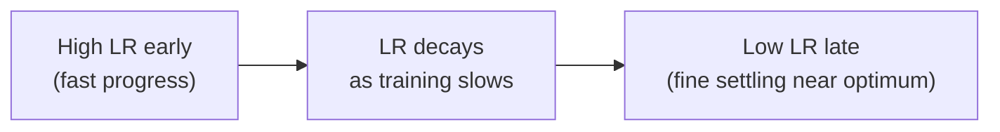

## What you'll learn

- why a single constant learning rate is always a compromise
- power scheduling, exponential scheduling, and piecewise constant scheduling
- performance scheduling with `ReduceLROnPlateau`
- the 1cycle schedule, and why Géron calls it out as the strongest option

## Why schedule the learning rate at all?

Too high, and training diverges. Too low, and it converges but takes forever.
Slightly too high, and it makes fast progress early on, then dances around the
optimum without ever quite settling. A **learning rate schedule** sidesteps the
whole trade-off: start large (fast early progress) and shrink it once progress
slows down, reaching a better solution faster than any single constant rate could.



## Get the base rate right before you schedule it

A schedule only decays a starting point — if that starting point is badly
wrong, no schedule will save the run. Chollet's diagnostic for a training loss
that simply won't move: don't reach for a fancier optimizer first, tune the
**learning rate** and **batch size**, since they're usually enough on their
own to get things moving. A learning rate of `1.0` on RMSprop can make training
overshoot so badly that accuracy gets stuck around 30–40%; dropping it to
`1e-2` on the exact same model and data can be the entire fix:

```python title="Same model, same data -- only the learning rate changes" showLineNumbers{1}
import numpy as np
import tensorflow as tf

np.random.seed(42)
X = np.random.rand(200, 20).astype("float32")
y = (X.sum(axis=1) > 10).astype("float32")

def train(learning_rate, epochs=5):
    model = tf.keras.models.Sequential([
        tf.keras.layers.Dense(32, activation="relu", input_shape=(20,)),
        tf.keras.layers.Dense(1, activation="sigmoid"),
    ])
    model.compile(
        optimizer=tf.keras.optimizers.RMSprop(learning_rate),
        loss="binary_crossentropy",
        metrics=["accuracy"],
    )
    history = model.fit(X, y, epochs=epochs, batch_size=32, verbose=0)
    return history.history["accuracy"][-1]

print("lr=1.0  final accuracy:", round(train(1.0), 2))
print("lr=1e-2 final accuracy:", round(train(1e-2), 2))
```

Once training actually gets started at a sane base rate, *that's* when
scheduling (below) starts paying off — squeezing out a better final result
faster than a constant rate ever could.

## Power scheduling

The learning rate becomes a function of the iteration number `t`:

`η(t) = η₀ / (1 + t/s)^c`

It drops quickly at first, then more and more slowly. In Keras this is the
easiest schedule to wire up — just set `decay` on the optimizer (Keras assumes
`c = 1`, and `decay` is `1/s`):

```python title="Power scheduling via optimizer decay" showLineNumbers{1}
import tensorflow as tf

optimizer = tf.keras.optimizers.legacy.SGD(learning_rate=0.01, decay=1e-4)
```

## Exponential scheduling

`η(t) = η₀ · 0.1^(t/s)` — the learning rate is slashed by a factor of 10 every
`s` steps, a steadier decay than power scheduling's fast-then-slow curve. Define
a schedule function and hand it to a `LearningRateScheduler` callback:

```python title="Exponential scheduling with a callback" showLineNumbers{1}
import tensorflow as tf

def exponential_decay(lr0, s):
    def exponential_decay_fn(epoch):
        return lr0 * 0.1 ** (epoch / s)
    return exponential_decay_fn

exponential_decay_fn = exponential_decay(lr0=0.01, s=20)
lr_scheduler = tf.keras.callbacks.LearningRateScheduler(exponential_decay_fn)

# history = model.fit(X_train, y_train, epochs=20, callbacks=[lr_scheduler])
```

## Piecewise constant scheduling

Use one learning rate for a stretch of epochs, then drop to a smaller one, and
so on. Simple, but it takes some trial and error to pick the right rates and how
long to hold each one:

```python title="Piecewise constant scheduling" showLineNumbers{1}
import tensorflow as tf

def piecewise_constant_fn(epoch):
    if epoch < 5:
        return 0.01
    elif epoch < 15:
        return 0.005
    else:
        return 0.001

lr_scheduler = tf.keras.callbacks.LearningRateScheduler(piecewise_constant_fn)
```

## Performance scheduling

Instead of a fixed formula, watch the validation loss (the same signal early
stopping uses) and cut the learning rate whenever it stops improving:

```python title="ReduceLROnPlateau" showLineNumbers{1}
import tensorflow as tf

lr_scheduler = tf.keras.callbacks.ReduceLROnPlateau(factor=0.5, patience=5)

# multiplies the learning rate by 0.5 whenever val_loss hasn't improved for 5 epochs
```

## The tf.keras.optimizers.schedules approach

`tf.keras` also lets you attach a schedule *object* directly to the optimizer,
which updates the learning rate every step (not just every epoch) and gets saved
along with the model:

```python title="ExponentialDecay schedule object" showLineNumbers{1}
import tensorflow as tf

batch_size = 32
s = 20 * len(X_train) // batch_size  # steps for ~20 epochs

learning_rate = tf.keras.optimizers.schedules.ExponentialDecay(0.01, s, 0.1)
optimizer = tf.keras.optimizers.SGD(learning_rate)
```

## 1cycle scheduling

Leslie Smith's **1cycle** schedule (2018) does something different from every
schedule above: it *increases* the learning rate from `η₀` up to a peak `η₁`
during the first half of training, then decreases it back down to `η₀` during
the second half, finishing the last few epochs by dropping several orders of
magnitude further. Momentum is often varied in the opposite direction — starting
high, dipping in the middle, then climbing back up. On CIFAR10, Smith reported
reaching 91.9% validation accuracy in just 100 epochs with 1cycle, versus 90.3%
in 800 epochs the standard way — the same architecture, radically less training.

```python title="A minimal 1cycle-style callback" showLineNumbers{1}
import tensorflow as tf

class OneCycleScheduler(tf.keras.callbacks.Callback):
    def __init__(self, iterations, max_lr=1e-3, start_lr=None, last_iterations=None, last_lr=None):
        self.iterations = iterations
        self.max_lr = max_lr
        self.start_lr = start_lr or max_lr / 10
        self.last_iterations = last_iterations or iterations // 10 + 1
        self.half_iteration = (iterations - self.last_iterations) // 2
        self.last_lr = last_lr or self.start_lr / 1000
        self.iteration = 0

    def _interpolate(self, iter1, iter2, lr1, lr2):
        return (lr2 - lr1) * (self.iteration - iter1) / (iter2 - iter1) + lr1

    def on_batch_begin(self, batch, logs=None):
        if self.iteration < self.half_iteration:
            lr = self._interpolate(0, self.half_iteration, self.start_lr, self.max_lr)
        elif self.iteration < 2 * self.half_iteration:
            lr = self._interpolate(self.half_iteration, 2 * self.half_iteration, self.max_lr, self.start_lr)
        else:
            lr = self._interpolate(2 * self.half_iteration, self.iterations, self.start_lr, self.last_lr)
        self.iteration += 1
        self.model.optimizer.learning_rate = lr
```

## Visualize it

Each schedule decays the learning rate very differently. Power scheduling drops
fast then flattens out; exponential scheduling keeps slashing it by the same
factor; 1cycle rises first, then falls, then collapses at the very end:

```p5 title="Learning rate schedules compared" desc="Power, exponential, and 1cycle schedules plotted over the course of training, with a marker tracing each one from epoch 0 to epoch T." height="280"
function setup() {
  createCanvas(600, 280);
  textFont("monospace");
}
function draw() {
  background(13, 17, 23);
  const gx = 46, gy = 20, gw = width - 80, gh = height - 60;
  stroke(60, 70, 84);
  strokeWeight(1);
  line(gx, gy + gh, gx + gw, gy + gh);
  line(gx, gy, gx, gy + gh);
  noStroke();
  fill(160);
  textSize(11);
  text("epoch 0", gx, gy + gh + 16);
  text("epoch T", gx + gw - 34, gy + gh + 16);
  text("lr", gx - 30, gy + 6);

  // one shared "training run" progress value, looping every PERIOD frames
  const period = 200;
  const t = (frameCount % period) / period;

  function plot(fn, col, label, ly) {
    // faint full curve for context
    stroke(col[0], col[1], col[2], 55);
    strokeWeight(1.5);
    noFill();
    beginShape();
    for (let i = 0; i <= 100; i++) {
      const tt = i / 100;
      const y = constrain(fn(tt), 0, 1);
      vertex(gx + tt * gw, gy + gh - y * gh);
    }
    endShape();

    // bright portion traced so far this run
    stroke(col[0], col[1], col[2]);
    strokeWeight(2.5);
    beginShape();
    for (let i = 0; i <= 100; i++) {
      const tt = i / 100;
      if (tt > t) break;
      const y = constrain(fn(tt), 0, 1);
      vertex(gx + tt * gw, gy + gh - y * gh);
    }
    endShape();

    // moving marker at the current epoch
    noStroke();
    fill(col[0], col[1], col[2]);
    ellipse(gx + t * gw, gy + gh - constrain(fn(t), 0, 1) * gh, 8, 8);

    fill(col);
    textSize(12);
    textAlign(LEFT, CENTER);
    text(label, gx + gw - 120, ly);
  }
  plot((tt) => 1 / (1 + tt * 6), [240, 150, 90], "power", gy + 16);
  plot((tt) => Math.pow(0.1, tt), [75, 139, 190], "exponential", gy + 34);
  plot((tt) => (tt < 0.45 ? tt / 0.45 : tt < 0.9 ? 1 - (tt - 0.45) / 0.45 : Math.max(0.02, 1 - (tt - 0.9) / 0.1)), [120, 200, 120], "1cycle", gy + 52);
}
```

## Mini-checkpoint

You've trained for a while and validation loss has plateaued for the last several
epochs, but you don't want to hand-pick a decay formula. Which callback fits best?

- `ReduceLROnPlateau` — it watches validation loss directly and cuts the
  learning rate only when progress actually stalls.

:::tip[From the book]
Géron summarizes a 2013 study comparing schedules for speech recognition models:
both performance scheduling and exponential scheduling worked well, with
exponential scheduling favored for being easy to tune and implement. But his
final verdict is that **1cycle performs even better still** — it's the schedule
listed as the default recommendation in the chapter's summary table, right
alongside He initialization, ELU, and Nadam/momentum optimization.
:::

import DataCampExercise from "../../../../components/DataCampExercise.astro";

## 🧪 Try It Yourself

### Exercise 1 – Build an Exponential Decay Schedule

<DataCampExercise
  lang="python"
  hint={`\`tf.keras.optimizers.schedules.ExponentialDecay(initial_lr, decay_steps, decay_rate)\` returns a schedule object you pass straight to an optimizer.`}
  code={`# Task: Exercise 1 - Build an Exponential Decay Schedule
import tensorflow as tf

schedule = tf.keras.optimizers.schedules.___(0.01, 20, 0.1)   # replace ___ with ExponentialDecay
print(round(float(schedule(0)), 2))

# ── Expected Output ───────────────────────────────────────────
# 0.01
# ──────────────────────────────────────────────────────────────`}
  solution={`import tensorflow as tf

schedule = tf.keras.optimizers.schedules.ExponentialDecay(0.01, 20, 0.1)
print(round(float(schedule(0)), 2))`}
  sct={`test_output_contains("0.01")
success_msg("Exponential decay schedule created — it starts at the initial rate!")`}
  height={140}
/>

### Exercise 2 – ReduceLROnPlateau Callback

<DataCampExercise
  lang="python"
  hint={`Pass \`factor=0.5\` and \`patience=5\` to \`tf.keras.callbacks.ReduceLROnPlateau\`.`}
  code={`# Task: Exercise 2 - ReduceLROnPlateau Callback
import tensorflow as tf

lr_scheduler = tf.keras.callbacks.___(factor=0.5, patience=5)   # replace ___ with ReduceLROnPlateau
print("factor:", lr_scheduler.factor, "patience:", lr_scheduler.patience)

# ── Expected Output ───────────────────────────────────────────
# factor: 0.5 patience: 5
# ──────────────────────────────────────────────────────────────`}
  solution={`import tensorflow as tf

lr_scheduler = tf.keras.callbacks.ReduceLROnPlateau(factor=0.5, patience=5)
print("factor:", lr_scheduler.factor, "patience:", lr_scheduler.patience)`}
  sct={`test_output_contains("factor: 0.5 patience: 5")
success_msg("The learning rate will now halve after 5 stagnant epochs!")`}
  height={140}
/>

### Exercise 3 – A Piecewise Constant Schedule Function

<DataCampExercise
  lang="python"
  hint={`Return a smaller learning rate as the epoch number increases, using plain if/elif/else.`}
  code={`# Task: Exercise 3 - A Piecewise Constant Schedule Function
def piecewise_constant_fn(epoch):
    if epoch < 5:
        return 0.01
    elif epoch < 15:
        return ___   # replace ___ with 0.005
    else:
        return 0.001

print(piecewise_constant_fn(0), piecewise_constant_fn(10), piecewise_constant_fn(20))

# ── Expected Output ───────────────────────────────────────────
# 0.01 0.005 0.001
# ──────────────────────────────────────────────────────────────`}
  solution={`def piecewise_constant_fn(epoch):
    if epoch < 5:
        return 0.01
    elif epoch < 15:
        return 0.005
    else:
        return 0.001

print(piecewise_constant_fn(0), piecewise_constant_fn(10), piecewise_constant_fn(20))`}
  sct={`test_output_contains("0.01 0.005 0.001")
success_msg("Piecewise schedule wired up correctly!")`}
  height={165}
/>

## Next

Continue to **The Universal Workflow of Machine Learning** — you now have a
full toolkit for training deep nets; the next three pages zoom back out to the
project-level workflow that toolkit fits into, before Phase 3 puts it all to
work on real images.
