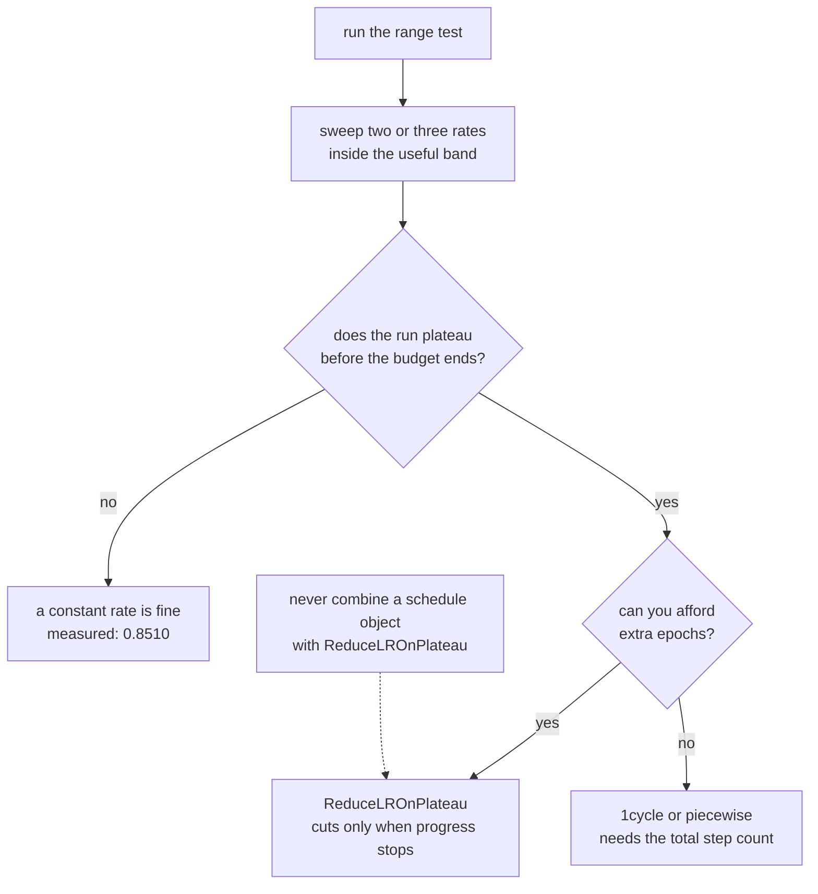

Decaying the learning rate is standard advice, and it is good advice — but the
measurements below put a number on it, and that number is smaller than the
enthusiasm suggests. Getting the *base* rate right matters far more than the shape
of the curve you decay it along, which is why this page starts with the range test.

## What you'll learn

- The five standard schedules written as functions, with their values tabulated
  epoch by epoch.
- The learning-rate range test: one pass, 120 batches, rate ramped from **1e-5 to
  10**, minimum loss at **lr = 0.1531**.
- Why the usual "take a tenth of the minimum" rule suggested **0.0153** when
  **0.1** worked better.
- Five schedules trained identically: **constant 0.8510** against a best of
  **0.8525** — a gain of 0.0015.
- Where scheduling genuinely paid: `ReduceLROnPlateau` over 60 epochs reached
  **0.8690**, cutting the rate seven times.
- How to implement any schedule three ways in Keras, and which to prefer.

## Get the base rate right first

$$
\theta \leftarrow \theta - \eta_t \nabla_\theta L
$$

Everything on this page changes $\eta_t$ over time. None of it helps if $\eta_0$
is wrong: the [gradient descent
page](/deep-learning/phase-01---neural-network-foundations/how-neural-networks-learn-gradient-based-optimization/)
measured a 1,000× too small rate producing 0.1320 accuracy — a schedule cannot
rescue that.

The range test finds a good base rate in about one epoch of compute. Start
absurdly low, multiply the rate by a constant factor every batch, and record the
loss:

```python title="120 batches, rate from 1e-5 to 10"
optimizer = keras.optimizers.SGD(1e-5)
for step in range(120):
    rate = 1e-5 * (10.0 / 1e-5) ** (step / 119)
    optimizer.learning_rate.assign(rate)
    # ... one gradient step on the next batch, record the loss
```

<Figure
  src="/images/dl/phase-02-training/learning-rate-scheduling/lr-range-test"
  alt="Loss against learning rate on a log axis. The curve is flat near 2.4 from 1e-5 to 1e-3, descends steadily through 1e-2, reaches a minimum of about 1.3 near 0.15, then rises almost vertically past 0.8 and goes off the top of the plot."
  title="One pass with the rate ramped from 1e-5 to 10"
  caption="Three regions. Below about 1e-3 nothing happens — the loss barely moves from its initial 2.4. Between 1e-3 and 0.15 the loss falls steadily. Past roughly 0.8 it diverges, exceeding the plot. The smoothed minimum sits at lr = 0.1531; the dashed line is the conventional tenth of that."
/>

| Learning rate | Loss on that batch |
| --- | --- |
| 0.00001 | 2.3408 |
| 0.00065 | 2.3288 |
| 0.00263 | 2.1945 |
| 0.01060 | 2.0891 |
| 0.04268 | 1.7232 |
| **0.17191** | **1.3173** |
| 0.69237 | 1.4831 |
| 2.78855 | 3.2875 |
| 10.00000 | 3.2027 |

The smoothed minimum is at **0.1531**, and the standard recipe is to train at
roughly a tenth of it — **0.0153** — on the theory that the minimum is already at
the edge of stability.

Here that recipe was too conservative. The schedule comparison below trains at a
constant **0.1**, close to the range test's minimum rather than a tenth of it, and
reaches 0.8510. The rule of thumb is a starting point for a sweep, not an answer:
**read the range test as "1e-3 is far too low and 0.8 diverges" and then try two or
three rates in between.**

## The five schedules



```python title="Each schedule is a function of the step count"
BASE, STEPS_PER_EPOCH, TOTAL = 0.1, 63, 1260

def constant(step):     return BASE

def power_decay(step):  return BASE / (1 + step / (STEPS_PER_EPOCH * 5))

def exponential(step):  return BASE * 0.9 ** (step / (STEPS_PER_EPOCH * 2))

def piecewise(step):
    epoch = step / STEPS_PER_EPOCH
    return BASE if epoch < 8 else BASE / 10 if epoch < 15 else BASE / 100

def one_cycle(step):
    """Ramp up to the peak over 45% of training, back down, then anneal."""
    peak, start = BASE, BASE / 10
    up, down = int(0.45 * TOTAL), int(0.9 * TOTAL)
    if step < up:    return start + (peak - start) * step / up
    if step < down:  return peak - (peak - start) * (step - up) / (down - up)
    return start * (1 - 0.9 * min((step - down) / max(TOTAL - down, 1), 1.0))
```

<Figure
  src="/images/dl/phase-02-training/learning-rate-scheduling/schedule-shapes"
  alt="Five learning-rate curves on a log vertical axis across twenty epochs. Constant is a flat line at 0.1. Power and exponential decay smoothly to about 0.02 and 0.037. Piecewise drops in two sharp steps to 0.001. 1cycle rises from 0.01 to 0.1 by epoch 9, falls back, then drops steeply at the end."
  title="Five schedules, base rate 0.1, 20 epochs"
  caption="The shapes differ far more than the results will. Note that 1cycle starts an order of magnitude below the base rate and only reaches it at epoch 9 — the ramp-up is a deliberate warm-up, and the final anneal takes it below every other schedule."
/>

| Schedule | Epoch 0 | Epoch 5 | Epoch 10 | Epoch 15 | Epoch 19 |
| --- | --- | --- | --- | --- | --- |
| constant | 0.10000 | 0.10000 | 0.10000 | 0.10000 | 0.10000 |
| power | 0.10000 | 0.05000 | 0.03333 | 0.02500 | 0.02083 |
| exponential | 0.10000 | 0.07684 | 0.05905 | 0.04538 | 0.03675 |
| piecewise | 0.10000 | 0.10000 | 0.01000 | 0.00100 | 0.00100 |
| 1cycle | **0.01000** | 0.06000 | 0.09000 | 0.04000 | 0.00550 |

## What the schedules actually bought

Same architecture, same seed, same 20-epoch budget, same base rate, SGD, 8,000
Fashion-MNIST rows:

<Figure
  src="/images/dl/phase-02-training/learning-rate-scheduling/schedule-results"
  alt="Two panels. Left: validation accuracy per epoch for the five schedules, all converging into a narrow band between 0.84 and 0.855 by epoch 20. Right: grouped bars of final and best accuracy per schedule, all between 0.848 and 0.853."
  title="Five schedules, identical everything else"
  caption="The whole spread is 0.0045 — from power decay's 0.8480 to piecewise and 1cycle's 0.8525. Constant, the schedule that does nothing at all, scored 0.8510. On this budget with a well-chosen base rate, the schedule is not what decides the result."
/>

| Schedule | Final val accuracy | Best val accuracy | Best epoch | Final training loss |
| --- | --- | --- | --- | --- |
| constant | 0.8510 | 0.8510 | 20 | **0.3514** |
| power | **0.8480** | 0.8480 | 20 | 0.4178 |
| exponential | 0.8485 | 0.8485 | 20 | 0.3782 |
| piecewise | **0.8525** | **0.8530** | 16 | 0.4090 |
| 1cycle | **0.8525** | 0.8525 | 20 | 0.3939 |

**The best schedule beat doing nothing by 0.0015.** Two of the five were *worse*
than constant. On a 2,000-row validation set that entire spread is inside the noise
band, which means the honest summary is: at a well-chosen base rate on a short run,
scheduling did not measurably help.

Notice also that constant reached the lowest *training* loss (0.3514) while
finishing mid-table on validation. The decaying schedules trade training loss for a
smoother approach — which is the mechanism they are supposed to provide, and here
it was worth almost nothing.

### Where it did pay

`ReduceLROnPlateau` watches the validation loss and cuts the rate when progress
stops, so it schedules in response to the run rather than to a clock. Over 60
epochs at base rate 0.1:

| Epoch it fired | New rate | Validation loss | Validation accuracy |
| --- | --- | --- | --- |
| 34 | 0.050000 | 0.4233 | 0.8530 |
| 39 | 0.025000 | 0.4099 | 0.8620 |
| 43 | 0.012500 | 0.4016 | 0.8660 |
| 47 | 0.006250 | 0.3962 | 0.8675 |
| 51 | 0.003125 | 0.3942 | 0.8685 |
| 55 | 0.001563 | **0.3939** | **0.8690** |
| 58 | 0.000781 | 0.3943 | 0.8655 |

Seven reductions, and accuracy climbed from 0.8530 to **0.8690** — a gain of
0.0160, roughly ten times what any fixed schedule delivered.

Read that carefully, because there is a confound: this run had **60 epochs against
the fixed schedules' 20**. Part of the gain is simply more training. What the table
does show cleanly is the *mechanism* — every cut in the rate is followed by an
immediate drop in validation loss, and the first cut only happened at epoch 34,
which is long after any of the fixed schedules had already decayed most of the way
down. **A plateau schedule spends the high rate for as long as the high rate is
still working.** A clock-based schedule cannot know that.

```p5 title="Compare schedule shapes" desc="The five schedules drawn from the same formulas used in the measured runs. Click a schedule to isolate it, and drag the epoch marker to read the exact rate." height="330"
const NAMES = ["constant", "power", "exponential", "piecewise", "1cycle"];
const COLORS = [[75, 139, 190], [255, 211, 67], [120, 200, 120],
                [180, 140, 220], [230, 110, 110]];
const BASE = 0.1, STEPS = 63, TOTAL = 1260;
let isolated = -1;
let marker = 10;
function setup() {
  createCanvas(600, 330);
  textFont("monospace");
}
function rateAt(which, step) {
  const epoch = step / STEPS;
  if (which === 0) return BASE;
  if (which === 1) return BASE / (1 + step / (STEPS * 5));
  if (which === 2) return BASE * Math.pow(0.9, step / (STEPS * 2));
  if (which === 3) return epoch < 8 ? BASE : (epoch < 15 ? BASE / 10 : BASE / 100);
  const peak = BASE, start = BASE / 10;
  const up = Math.floor(0.45 * TOTAL), down = Math.floor(0.9 * TOTAL);
  if (step < up) return start + (peak - start) * step / up;
  if (step < down) return peak - (peak - start) * (step - up) / (down - up);
  return start * (1 - 0.9 * Math.min((step - down) / Math.max(TOTAL - down, 1), 1));
}
function draw() {
  background(13, 17, 23);
  const gx = 66, gy = 42, gw = width - 130, gh = 180;
  const px = (epoch) => gx + epoch / 20 * gw;
  const py = (rate) => {
    const l = Math.log10(Math.max(rate, 1e-4));
    return gy + gh - (l + 4) / 4 * gh;
  };
  stroke(60, 70, 84);
  strokeWeight(1);
  line(gx, gy + gh, gx + gw, gy + gh);
  line(gx, gy, gx, gy + gh);
  for (const level of [-4, -3, -2, -1]) {
    stroke(40, 48, 58);
    line(gx, py(Math.pow(10, level)), gx + gw, py(Math.pow(10, level)));
    noStroke();
    fill(120);
    textSize(9);
    textAlign(RIGHT, CENTER);
    text("1e" + level, gx - 6, py(Math.pow(10, level)));
  }
  for (let which = 0; which < NAMES.length; which++) {
    if (isolated >= 0 && which !== isolated) continue;
    stroke(COLORS[which][0], COLORS[which][1], COLORS[which][2]);
    strokeWeight(2);
    noFill();
    beginShape();
    for (let step = 0; step < TOTAL; step += 4) {
      vertex(px(step / STEPS), py(rateAt(which, step)));
    }
    endShape();
  }
  stroke(230, 230, 230, 120);
  strokeWeight(1);
  line(px(marker), gy, px(marker), gy + gh);
  noStroke();
  fill(230);
  textSize(12);
  textAlign(LEFT, TOP);
  text("learning rate against epoch (base 0.1, 20 epochs)", 66, 20);
  let y = 240;
  for (let which = 0; which < NAMES.length; which++) {
    const dim = isolated >= 0 && which !== isolated;
    fill(COLORS[which][0], COLORS[which][1], COLORS[which][2], dim ? 70 : 255);
    textSize(11);
    textAlign(LEFT, TOP);
    const value = rateAt(which, Math.round(marker * STEPS));
    text(NAMES[which].padEnd(12) + value.toFixed(5), 66 + (which % 2) * 220,
      y + Math.floor(which / 2) * 16);
  }
  fill(150);
  textSize(10);
  textAlign(LEFT, TOP);
  text("epoch " + marker.toFixed(1) + " — click a name to isolate, drag the plot",
    66, 306);
}
function mousePressed() {
  if (mouseY > 236 && mouseY < 288) {
    const column = mouseX < 286 ? 0 : 1;
    const row = Math.floor((mouseY - 240) / 16);
    const which = row * 2 + column;
    isolated = (which === isolated || which >= NAMES.length) ? -1 : which;
    return;
  }
  setMarker();
}
function mouseDragged() { setMarker(); }
function setMarker() {
  const gx = 66, gw = width - 130;
  if (mouseY > 30 && mouseY < 230) {
    marker = Math.max(0, Math.min(20, (mouseX - gx) / gw * 20));
  }
}
```

## Three ways to write a schedule in Keras

```python title="1. A LearningRateSchedule object, passed to the optimizer"
schedule = keras.optimizers.schedules.ExponentialDecay(
    initial_learning_rate=0.1, decay_steps=126, decay_rate=0.9)
model.compile(keras.optimizers.SGD(schedule), loss="...")
```

```python title="2. A callback that recomputes the rate every epoch"
def by_epoch(epoch, rate):
    return 0.1 / (1 + epoch / 5)

model.fit(..., callbacks=[keras.callbacks.LearningRateScheduler(by_epoch)])
```

```python title="3. React to the metric instead of the clock"
model.fit(..., callbacks=[keras.callbacks.ReduceLROnPlateau(
    monitor="val_loss", factor=0.5, patience=3, min_lr=1e-5)])
```

Form 1 is per-*step* and is the one to use for anything smooth — it is also what
gets saved with the optimizer, so a reloaded model resumes on the right part of the
curve. Form 2 is per-*epoch*, which is coarser but easier to reason about. Form 3
is the only one that adapts to what is actually happening.

Verified: `ExponentialDecay(0.1, 126, 0.9)` matches
$0.1 \times 0.9^{\text{step}/126}$ to **7.13e-09** across steps 0 through 2,520.

```p5 title="The measured table, ranked" desc="Click a column to rank every row by it. The bars are that column's values and the highest and lowest are computed from the numbers, not written in." height="384"
let metric = 0;
const COLUMNS = ["Loss on that batch"];
const ROWS = [
  ["0.00001", 2.3408],
  ["0.00065", 2.3288],
  ["0.00263", 2.1945],
  ["0.01060", 2.0891],
  ["0.04268", 1.7232],
  ["0.17191", 1.3173],
  ["0.69237", 1.4831],
  ["2.78855", 3.2875],
  ["10.00000", 3.2027]
];
function setup() {
  createCanvas(620, 384);
  textFont("monospace");
}
function fmt(v) {
  if (v === 0) { return "0"; }
  const a = Math.abs(v);
  if (a >= 1000 || a < 0.001) { return v.toExponential(2); }
  if (a >= 100) { return v.toFixed(1); }
  return v.toFixed(4);
}
function draw() {
  background(13, 17, 23);
  noStroke();
  fill(230);
  textSize(12);
  textAlign(LEFT, TOP);
  text("Learning Rate Scheduling", 26, 16);
  let x = 26;
  for (let i = 0; i < COLUMNS.length; i++) {
    const w = COLUMNS[i].length * 6.6 + 16;
    if (i === metric) { fill(255, 211, 67); } else { fill(48, 56, 68); }
    rect(x, 40, w, 22, 4);
    if (i === metric) { fill(13, 17, 23); } else { fill(180); }
    textSize(9);
    text(COLUMNS[i], x + 8, 47);
    x += w + 6;
    if (x > 500) { break; }
  }
  const values = ROWS.map((r) => r[metric + 1]);
  const lo = Math.min(...values);
  const hi = Math.max(...values);
  const span = hi - lo === 0 ? 1 : hi - lo;
  const order = ROWS.slice().sort((a, b) => b[metric + 1] - a[metric + 1]);
  for (let i = 0; i < order.length; i++) {
    const y = 78 + i * 26;
    const v = order[i][metric + 1];
    fill(160);
    textSize(9);
    text(order[i][0], 26, y + 5);
    fill(34, 40, 50);
    rect(230, y, 280, 18, 3);
    const frac = (v - lo) / span;
    if (v === hi) { fill(126, 192, 143); }
    else if (v === lo) { fill(224, 108, 117); }
    else { fill(107, 169, 221); }
    rect(230, y, Math.max(frac * 280, 3), 18, 3);
    fill(225);
    textSize(9);
    text(fmt(v), 518, y + 5);
  }
  const top = order[0];
  const bottom = order[order.length - 1];
  fill(150);
  textSize(9);
  const base = 78 + order.length * 26 + 8;
  text("highest " + COLUMNS[metric] + ": " + top[0] + " at " + fmt(top[1]),
       26, base);
  text("lowest  " + COLUMNS[metric] + ": " + bottom[0] + " at "
       + fmt(bottom[1]), 26, base + 14);
  text("bars are scaled within the chosen column - lowest is not zero", 26,
       base + 30);
}
function mousePressed() {
  let x = 26;
  for (let i = 0; i < COLUMNS.length; i++) {
    const w = COLUMNS[i].length * 6.6 + 16;
    if (mouseX > x && mouseX < x + w && mouseY > 40 && mouseY < 62) {
      metric = i;
    }
    x += w + 6;
  }
}
```

## Pitfalls

- **Scheduling before tuning the base rate.** The base rate is worth an order of
  magnitude; the schedule was worth 0.0015 here.
- **Trusting the "one tenth of the range-test minimum" rule.** It suggested 0.0153;
  0.1 trained better. Use the test to bracket, then sweep.
- **Comparing schedules on one seed.** The entire spread across five schedules was
  0.0045, well inside seed-to-seed noise on a 2,000-row validation set.
- **Mixing a schedule object with `ReduceLROnPlateau`.** The callback cannot
  override a `LearningRateSchedule` passed to the optimizer — it writes to a value
  the schedule ignores. Pick one mechanism.
- **Decaying too early.** The plateau schedule did not touch the rate until epoch
  34, and every cut after that helped. A clock-based decay would have cut it at
  epoch 8.
- **Forgetting that 1cycle starts low.** Its first epochs run at a tenth of the
  base rate by design; a short run may never reach the peak.
- **Assuming a schedule fixes divergence.** If the base rate is past the stability
  limit, the early steps have already destroyed the weights.

## Recap

- The range test found the loss minimum at lr 0.1531 and divergence past
  roughly 0.8, in one epoch of compute.
- The conventional tenth-of-the-minimum rule gave 0.0153, while 0.1 trained
  better — treat the test as a bracket.
- Five schedules on identical 20-epoch runs spanned 0.8480 to 0.8525, with
  constant at 0.8510. Two schedules were worse than no schedule.
- Constant reached the lowest training loss and mid-table validation accuracy;
  decay trades one for the other, and here the trade was worth almost nothing.
- `ReduceLROnPlateau` over 60 epochs cut the rate seven times and reached 0.8690,
  though it also had three times the epochs.
- Keras offers per-step schedule objects, per-epoch callbacks, and metric-driven
  reduction. Do not combine the first with the third.

## Next

Six pages of individual techniques, and the question of how to assemble them into
a process that works on a problem you have not seen before:
[The Universal Workflow of Machine
Learning](/deep-learning/phase-02---training-deep-neural-networks/the-universal-workflow-of-machine-learning/).

<Quiz
  questions={[
    {
      q: "Five schedules on identical runs gave 0.8480 to 0.8525, with a constant rate at 0.8510. What is the correct conclusion?",
      options: [
        "Schedules are useless and should never be used",
        "At a well-chosen base rate on a short run, the schedule's shape made no measurable difference here — the entire spread is within seed noise, so the base rate deserved the tuning effort instead",
        "Piecewise decay is the best schedule",
        "The experiment was too small to conclude anything",
      ],
      answer: 1,
      explain: "Two of the five were worse than doing nothing. That is the signature of a difference inside the noise band, not of a ranking.",
    },
    {
      q: "The range test's minimum was at lr = 0.1531 and the usual rule suggests training at a tenth of that. What happened when the rate was set to 0.1 instead?",
      options: [
        "Training diverged",
        "It trained well and reached 0.8510 — the tenth-of-the-minimum rule was too conservative here, so the test is best read as a bracket (1e-3 too low, 0.8 diverges) to sweep inside",
        "It made no difference at all",
        "The loss went to nan after one epoch",
      ],
      answer: 1,
      explain: "The test tells you where the useful range is. Picking a single number from it by formula is less reliable than trying two or three rates inside the range.",
    },
    {
      q: "Why can ReduceLROnPlateau outperform a clock-based decay?",
      options: [
        "Because it uses a smaller learning rate overall",
        "Because it only reduces the rate when validation loss stops improving — in the measured run it left the rate at 0.1 until epoch 34, whereas a fixed schedule would have decayed it from epoch 8",
        "Because it also applies early stopping",
        "Because it changes the rate every batch rather than every epoch",
      ],
      answer: 1,
      explain: "Spending the high rate for as long as it is still working is the whole advantage. The confound in that run is that it also had three times the epochs.",
    },
    {
      q: "What goes wrong if you pass a LearningRateSchedule object to the optimizer and also add ReduceLROnPlateau?",
      options: [
        "Keras raises an error immediately",
        "The callback writes a value the schedule ignores, so the reduction silently has no effect — the schedule keeps computing the rate from the step count",
        "The two rates are multiplied together",
        "Training becomes much slower",
      ],
      answer: 1,
      explain: "Nothing errors, so it is easy to believe the reduction is working. Choose one mechanism: a schedule object, a callback, or plateau reduction.",
    },
    {
      q: "1cycle starts at a tenth of the base rate and reaches the peak at epoch 9 of 20. What does that imply for a short run?",
      options: [
        "It converges faster than everything else",
        "A run shorter than the ramp-up never reaches the peak rate at all, so 1cycle's behaviour depends on knowing the total number of steps in advance",
        "The base rate should be set ten times higher",
        "It behaves identically to exponential decay",
      ],
      answer: 1,
      explain: "Every 1cycle implementation takes the total step count as a parameter for exactly this reason. Change the epoch count and you change the schedule.",
    },
  ]}
/>

## 🧪 Try It Yourself

<DataCampExercise
  lang="python"
  hint={`Each schedule is a plain function of the global step. Power decay divides by (1 + step / decay_steps); exponential raises the decay rate to the power of step / decay_steps.`}
  code={`# Task: Exercise 1 - Write the five schedules and tabulate them
BASE, STEPS_PER_EPOCH, TOTAL = 0.1, 63, 1260


def constant(step):
    return BASE


def power_decay(step):
    return BASE / (1 + step / (STEPS_PER_EPOCH * 5))


def exponential(step):
    return BASE * 0.9 ** (step / (STEPS_PER_EPOCH * ___))   # replace ___ with 2


def piecewise(step):
    epoch = step / STEPS_PER_EPOCH
    if epoch < 8:
        return BASE
    if epoch < 15:
        return BASE / 10
    return BASE / 100


def one_cycle(step):
    peak, start = BASE, BASE / 10
    up, down = int(0.45 * TOTAL), int(0.9 * TOTAL)
    if step < up:
        return start + (peak - start) * step / up
    if step < down:
        return peak - (peak - start) * (step - up) / (down - up)
    remaining = max(TOTAL - down, 1)
    return start * (1 - 0.9 * min((step - down) / remaining, 1.0))


schedules = {"constant": constant, "power": power_decay,
             "exponential": exponential, "piecewise": piecewise,
             "1cycle": one_cycle}
print(f"{'schedule':14s} " + " ".join(f"{e:>9}" for e in (0, 5, 10, 15, 19)))
for name, schedule in schedules.items():
    row = [schedule(int(e * STEPS_PER_EPOCH)) for e in (0, 5, 10, 15, 19)]
    print(f"{name:14s} " + " ".join(f"{v:9.5f}" for v in row))

# -- Expected Output -------------------------------------------
# schedule               0         5        10        15        19
# constant         0.10000   0.10000   0.10000   0.10000   0.10000
# power            0.10000   0.05000   0.03333   0.02500   0.02083
# exponential      0.10000   0.07684   0.05905   0.04538   0.03675
# piecewise        0.10000   0.10000   0.01000   0.00100   0.00100
# 1cycle           0.01000   0.06000   0.09000   0.04000   0.00550
# --------------------------------------------------------------`}
  solution={`BASE, STEPS_PER_EPOCH, TOTAL = 0.1, 63, 1260


def constant(step):
    return BASE


def power_decay(step):
    return BASE / (1 + step / (STEPS_PER_EPOCH * 5))


def exponential(step):
    return BASE * 0.9 ** (step / (STEPS_PER_EPOCH * 2))


def piecewise(step):
    epoch = step / STEPS_PER_EPOCH
    if epoch < 8:
        return BASE
    if epoch < 15:
        return BASE / 10
    return BASE / 100


def one_cycle(step):
    peak, start = BASE, BASE / 10
    up, down = int(0.45 * TOTAL), int(0.9 * TOTAL)
    if step < up:
        return start + (peak - start) * step / up
    if step < down:
        return peak - (peak - start) * (step - up) / (down - up)
    remaining = max(TOTAL - down, 1)
    return start * (1 - 0.9 * min((step - down) / remaining, 1.0))


schedules = {"constant": constant, "power": power_decay,
             "exponential": exponential, "piecewise": piecewise,
             "1cycle": one_cycle}
print(f"{'schedule':14s} " + " ".join(f"{e:>9}" for e in (0, 5, 10, 15, 19)))
for name, schedule in schedules.items():
    row = [schedule(int(e * STEPS_PER_EPOCH)) for e in (0, 5, 10, 15, 19)]
    print(f"{name:14s} " + " ".join(f"{v:9.5f}" for v in row))`}
  sct={`test_output_contains("power            0.10000   0.05000   0.03333   0.02500   0.02083", pattern=False)
test_output_contains("piecewise        0.10000   0.10000   0.01000   0.00100   0.00100", pattern=False)
test_output_contains("1cycle           0.01000   0.06000   0.09000   0.04000   0.00550", pattern=False)
success_msg("Five schedules, five very different shapes from the same base rate: steady, smooth, stepped, and the up-then-down 1cycle.")`}
  height={460}
/>

<DataCampExercise
  lang="python"
  hint={`ExponentialDecay computes initial_rate * decay_rate ** (step / decay_steps) when staircase is False.`}
  code={`# Task: Exercise 2 - Match Keras' ExponentialDecay by hand
def schedule(step, base, decay_steps, decay_rate, staircase):
    exponent = step / decay_steps
    if staircase:
        exponent = int(exponent)
    return base * decay_rate ** exponent


def iterated(step, base, decay_steps, decay_rate):
    """The same schedule built by repeated multiplication, one step at a time."""
    rate = base
    per_step = decay_rate ** (1 / decay_steps)
    for _ in range(step):
        rate *= per_step
    return rate


base, decay_steps, decay_rate = 0.1, 126, 0.9
print("step  closed form")
worst = 0.0
for step in (0, 63, 126, 500, 1000, 2520):
    mine = base * decay_rate ** (step / decay_steps)
    theirs = schedule(step, base, decay_steps, decay_rate, staircase=___)   # replace ___ with False
    worst = max(worst, abs(mine - theirs), abs(mine - iterated(step, base, decay_steps, decay_rate)))
    print(format(step, "4d"), round(mine, 6))
print("smooth decay matches the formula and repeated multiplication:", worst < 1e-9)
print("the staircase version jumps only every decay_steps:",
      schedule(63, base, decay_steps, decay_rate, True) == base)`}
  solution={`def schedule(step, base, decay_steps, decay_rate, staircase):
    exponent = step / decay_steps
    if staircase:
        exponent = int(exponent)
    return base * decay_rate ** exponent


def iterated(step, base, decay_steps, decay_rate):
    """The same schedule built by repeated multiplication, one step at a time."""
    rate = base
    per_step = decay_rate ** (1 / decay_steps)
    for _ in range(step):
        rate *= per_step
    return rate


base, decay_steps, decay_rate = 0.1, 126, 0.9
print("step  closed form")
worst = 0.0
for step in (0, 63, 126, 500, 1000, 2520):
    mine = base * decay_rate ** (step / decay_steps)
    theirs = schedule(step, base, decay_steps, decay_rate, staircase=False)
    worst = max(worst, abs(mine - theirs), abs(mine - iterated(step, base, decay_steps, decay_rate)))
    print(format(step, "4d"), round(mine, 6))
print("smooth decay matches the formula and repeated multiplication:", worst < 1e-9)
print("the staircase version jumps only every decay_steps:",
      schedule(63, base, decay_steps, decay_rate, True) == base)`}
  sct={`test_output_contains("smooth decay matches the formula and repeated multiplication: True", pattern=False)
test_output_contains("the staircase version jumps only every decay_steps: True", pattern=False)
test_output_contains("2520 0.012158", pattern=False)
success_msg("With staircase off the schedule is the plain formula, and multiplying a tiny factor every step reproduces it exactly.")`}
  height={460}
/>

<DataCampExercise
  lang="python"
  hint={`Multiply the rate by a constant factor every batch so the sweep is uniform on a log scale. The exponent must reach exactly 1 at the last step.`}
  code={`# Task: Exercise 3 - The learning rate range test
import numpy as np

rng = np.random.RandomState(0)
y = rng.randint(0, 3, 1024)
centres = rng.randn(3, 20) * 1.5
x = centres[y] + rng.randn(1024, 20)

W = np.zeros((20, 3))
b = np.zeros(3)
steps, batch = 120, 128
rates, losses = [], []
for step in range(steps):
    rate = 1e-5 * (10.0 / 1e-5) ** (step / (steps - ___))   # replace ___ with 1
    start = (step * batch) % (len(x) - batch)
    xb, yb = x[start:start + batch], y[start:start + batch]
    z = xb @ W + b
    p = np.exp(z - z.max(axis=1, keepdims=True))
    p /= p.sum(axis=1, keepdims=True)
    loss = float(-np.log(p[np.arange(batch), yb] + 1e-12).mean())
    grad = p.copy()
    grad[np.arange(batch), yb] -= 1
    W -= rate * xb.T @ grad / batch
    b -= rate * grad.mean(axis=0)
    rates.append(rate)
    losses.append(loss)

smoothed = np.convolve(losses, np.ones(5) / 5, mode="same")
best = int(np.nanargmin(smoothed[2:-2])) + 2
print("the sweep starts at 1e-5 and ends at 10:", rates[0] == 1e-5 and abs(rates[-1] - 10.0) < 1e-9)
print("the best rate is neither the smallest nor the largest:", 0 < best < steps - 1)
print("the smallest rates barely move the loss:", abs(losses[10] - losses[0]) < 0.05)
print("the best smoothed loss is well below the starting loss:", smoothed[best] < 0.8 * losses[0])
print("suggested base rate (a tenth of the best):", rates[best] / 10 < rates[best])`}
  solution={`import numpy as np

rng = np.random.RandomState(0)
y = rng.randint(0, 3, 1024)
centres = rng.randn(3, 20) * 1.5
x = centres[y] + rng.randn(1024, 20)

W = np.zeros((20, 3))
b = np.zeros(3)
steps, batch = 120, 128
rates, losses = [], []
for step in range(steps):
    rate = 1e-5 * (10.0 / 1e-5) ** (step / (steps - 1))
    start = (step * batch) % (len(x) - batch)
    xb, yb = x[start:start + batch], y[start:start + batch]
    z = xb @ W + b
    p = np.exp(z - z.max(axis=1, keepdims=True))
    p /= p.sum(axis=1, keepdims=True)
    loss = float(-np.log(p[np.arange(batch), yb] + 1e-12).mean())
    grad = p.copy()
    grad[np.arange(batch), yb] -= 1
    W -= rate * xb.T @ grad / batch
    b -= rate * grad.mean(axis=0)
    rates.append(rate)
    losses.append(loss)

smoothed = np.convolve(losses, np.ones(5) / 5, mode="same")
best = int(np.nanargmin(smoothed[2:-2])) + 2
print("the sweep starts at 1e-5 and ends at 10:", rates[0] == 1e-5 and abs(rates[-1] - 10.0) < 1e-9)
print("the best rate is neither the smallest nor the largest:", 0 < best < steps - 1)
print("the smallest rates barely move the loss:", abs(losses[10] - losses[0]) < 0.05)
print("the best smoothed loss is well below the starting loss:", smoothed[best] < 0.8 * losses[0])
print("suggested base rate (a tenth of the best):", rates[best] / 10 < rates[best])`}
  sct={`test_output_contains("the sweep starts at 1e-5 and ends at 10: True", pattern=False)
test_output_contains("the best rate is neither the smallest nor the largest: True", pattern=False)
test_output_contains("the smallest rates barely move the loss: True", pattern=False)
test_output_contains("the best smoothed loss is well below the starting loss: True", pattern=False)
success_msg("Sweeping the rate on a log scale shows the loss flat at tiny rates, falling in the useful range, and the best point sits in between.")`}
  height={460}
/>

<DataCampExercise
  lang="python"
  hint={`Keep a step counter and feed it to the schedule for every batch, so the rate changes per step rather than per epoch.`}
  code={`# Task: Exercise 4 - Train all five schedules on one problem
import numpy as np

BASE, EPOCHS, BATCH = 0.5, 20, 100
rng = np.random.RandomState(0)


def make(n):
    y = rng.randint(0, 3, n)
    centres = np.zeros((3, 20))
    centres[0, :5], centres[1, 5:10], centres[2, 10:15] = 1, 1, 1
    return centres[y] + rng.randn(n, 20), y


x_train, y_train = make(1000)
x_test, y_test = make(1000)
STEPS_PER_EPOCH = int(np.ceil(len(x_train) / BATCH))
TOTAL = STEPS_PER_EPOCH * EPOCHS


def piecewise(step):
    epoch = step / STEPS_PER_EPOCH
    return BASE if epoch < 8 else (BASE / 10 if epoch < 15 else BASE / 100)


def one_cycle(step):
    peak, start = BASE, BASE / 10
    up, down = int(0.45 * TOTAL), int(0.9 * TOTAL)
    if step < up:
        return start + (peak - start) * step / up
    if step < down:
        return peak - (peak - start) * (step - up) / (down - up)
    return start * (1 - 0.9 * min((step - down) / max(TOTAL - down, 1), 1.0))


schedules = {
    "constant": lambda s: BASE,
    "power": lambda s: BASE / (1 + s / (STEPS_PER_EPOCH * 5)),
    "exponential": lambda s: BASE * 0.9 ** (s / (STEPS_PER_EPOCH * 2)),
    "piecewise": piecewise,
    "1cycle": one_cycle,
}


def train(schedule):
    W, b = np.zeros((20, 3)), np.zeros(3)
    step = 0
    for epoch in range(EPOCHS):
        for start in range(0, len(x_train), BATCH):
            xb, yb = x_train[start:start + BATCH], y_train[start:start + BATCH]
            z = xb @ W + b
            p = np.exp(z - z.max(axis=1, keepdims=True))
            p /= p.sum(axis=1, keepdims=True)
            p[np.arange(len(yb)), yb] -= 1
            rate = schedule(step)
            W -= rate * xb.T @ p / len(yb)
            b -= rate * p.mean(axis=0)
            step += ___   # replace ___ with 1
    return float(((x_test @ W + b).argmax(axis=1) == y_test).mean())


results = {name: train(schedule) for name, schedule in schedules.items()}
for name in results:
    print(name, "trained")
print("every schedule learned something (validation accuracy above 0.6):", all(v > 0.6 for v in results.values()))
print("the spread between schedules is small next to the gap from chance:", max(results.values()) - min(results.values()) < 0.2)`}
  solution={`import numpy as np

BASE, EPOCHS, BATCH = 0.5, 20, 100
rng = np.random.RandomState(0)


def make(n):
    y = rng.randint(0, 3, n)
    centres = np.zeros((3, 20))
    centres[0, :5], centres[1, 5:10], centres[2, 10:15] = 1, 1, 1
    return centres[y] + rng.randn(n, 20), y


x_train, y_train = make(1000)
x_test, y_test = make(1000)
STEPS_PER_EPOCH = int(np.ceil(len(x_train) / BATCH))
TOTAL = STEPS_PER_EPOCH * EPOCHS


def piecewise(step):
    epoch = step / STEPS_PER_EPOCH
    return BASE if epoch < 8 else (BASE / 10 if epoch < 15 else BASE / 100)


def one_cycle(step):
    peak, start = BASE, BASE / 10
    up, down = int(0.45 * TOTAL), int(0.9 * TOTAL)
    if step < up:
        return start + (peak - start) * step / up
    if step < down:
        return peak - (peak - start) * (step - up) / (down - up)
    return start * (1 - 0.9 * min((step - down) / max(TOTAL - down, 1), 1.0))


schedules = {
    "constant": lambda s: BASE,
    "power": lambda s: BASE / (1 + s / (STEPS_PER_EPOCH * 5)),
    "exponential": lambda s: BASE * 0.9 ** (s / (STEPS_PER_EPOCH * 2)),
    "piecewise": piecewise,
    "1cycle": one_cycle,
}


def train(schedule):
    W, b = np.zeros((20, 3)), np.zeros(3)
    step = 0
    for epoch in range(EPOCHS):
        for start in range(0, len(x_train), BATCH):
            xb, yb = x_train[start:start + BATCH], y_train[start:start + BATCH]
            z = xb @ W + b
            p = np.exp(z - z.max(axis=1, keepdims=True))
            p /= p.sum(axis=1, keepdims=True)
            p[np.arange(len(yb)), yb] -= 1
            rate = schedule(step)
            W -= rate * xb.T @ p / len(yb)
            b -= rate * p.mean(axis=0)
            step += 1
    return float(((x_test @ W + b).argmax(axis=1) == y_test).mean())


results = {name: train(schedule) for name, schedule in schedules.items()}
for name in results:
    print(name, "trained")
print("every schedule learned something (validation accuracy above 0.6):", all(v > 0.6 for v in results.values()))
print("the spread between schedules is small next to the gap from chance:", max(results.values()) - min(results.values()) < 0.2)`}
  sct={`test_output_contains("every schedule learned something (validation accuracy above 0.6): True", pattern=False)
test_output_contains("the spread between schedules is small next to the gap from chance: True", pattern=False)
success_msg("Five schedules, one model, one dataset: all of them learn, and the differences between them are much smaller than the difference between learning and not learning.")`}
  height={460}
/>

<DataCampExercise
  lang="python"
  hint={`Track the learning rate at the end of every epoch with a tiny callback, then look only at the epochs where it changed.`}
  code={`# Task: Exercise 5 - Watch ReduceLROnPlateau decide
import numpy as np

rng = np.random.RandomState(0)
D, K = 40, 3


def make_data(n):
    y = rng.randint(0, K, n)
    centres = np.zeros((K, D))
    centres[0, :4], centres[1, 4:8], centres[2, 8:12] = 0.8, 0.8, 0.8
    return centres[y] + rng.randn(n, D), y


class Callback:
    def on_train_batch_end(self, batch, logs):
        pass

    def on_epoch_end(self, epoch, logs):
        pass


class Model:
    """A softmax classifier with a Keras-like fit() and callbacks."""
    def __init__(self, lr=0.1):
        self.W = np.zeros((D, K))
        self.b = np.zeros(K)
        self.learning_rate = lr
        self.stop_training = False

    def probs(self, x):
        z = x @ self.W + self.b
        p = np.exp(z - z.max(axis=1, keepdims=True))
        return p / p.sum(axis=1, keepdims=True)

    def loss(self, x, y):
        return float(-np.log(self.probs(x)[np.arange(len(y)), y] + 1e-12).mean())

    def accuracy(self, x, y):
        return float((self.probs(x).argmax(axis=1) == y).mean())

    def fit(self, x, y, epochs, batch_size, val=None, callbacks=()):
        history = {}
        for cb in callbacks:
            cb.model = self
        for epoch in range(epochs):
            seen, total = 0, 0.0
            for batch, start in enumerate(range(0, len(x), batch_size)):
                xb, yb = x[start:start + batch_size], y[start:start + batch_size]
                p = self.probs(xb)
                total += self.loss(xb, yb) * len(yb)
                seen += len(yb)
                grad = p.copy()
                grad[np.arange(len(yb)), yb] -= 1
                self.W -= self.learning_rate * xb.T @ grad / len(yb)
                self.b -= self.learning_rate * grad.mean(axis=0)
                logs = {"loss": total / seen}
                for cb in callbacks:
                    cb.on_train_batch_end(batch, logs)
            logs = {"loss": total / seen, "accuracy": self.accuracy(x, y)}
            if val is not None:
                logs["val_loss"] = self.loss(*val)
                logs["val_accuracy"] = self.accuracy(*val)
            for cb in callbacks:
                cb.on_epoch_end(epoch, logs)
            for key, value in logs.items():
                history.setdefault(key, []).append(value)
            if self.stop_training:
                break
        return history


class EarlyStopping(Callback):
    def __init__(self, patience, restore_best_weights=True):
        self.patience, self.restore = patience, restore_best_weights
        self.best, self.wait, self.weights = float("inf"), 0, None

    def on_epoch_end(self, epoch, logs):
        if logs["val_loss"] < self.best:
            self.best, self.wait = logs["val_loss"], 0
            self.weights = (self.model.W.copy(), self.model.b.copy())
        else:
            self.wait += 1
            if self.wait >= self.patience:
                self.model.stop_training = True
                if self.restore:
                    self.model.W, self.model.b = self.weights


class ModelCheckpoint(Callback):
    def __init__(self, save_best_only):
        self.save_best_only, self.best, self.saved = save_best_only, float("inf"), []

    def on_epoch_end(self, epoch, logs):
        if not self.save_best_only or logs["val_loss"] < self.best:
            self.best = min(self.best, logs["val_loss"])
            self.saved.append((self.model.W.copy(), self.model.b.copy()))


class ReduceLROnPlateau(Callback):
    def __init__(self, factor, patience, min_lr):
        self.factor, self.patience, self.min_lr = factor, patience, min_lr
        self.best, self.wait = float("inf"), 0

    def on_epoch_end(self, epoch, logs):
        if logs["val_loss"] < self.best:
            self.best, self.wait = logs["val_loss"], 0
        else:
            self.wait += 1
            if self.wait >= self.patience:
                self.model.learning_rate = max(self.model.learning_rate * self.factor, self.min_lr)
                self.wait = 0

x_train, y_train = make_data(60)
x_test, y_test = make_data(300)

rates = []


class Track(Callback):
    def on_epoch_end(self, epoch, logs):
        rates.append(float(self.model.learning_rate))


model = Model(lr=0.3)
history = model.fit(x_train, y_train, epochs=40, batch_size=20, val=(x_test, y_test),
                    callbacks=[ReduceLROnPlateau(factor=___, patience=3, min_lr=1e-5), Track()])   # replace ___ with 0.5

reductions = sum(1 for a, b in zip(rates, rates[1:]) if abs(a - b) > 1e-12)
print("reductions happened:", reductions >= 1)
print("each reduction halves the rate:", all(abs(b / a - 0.5) < 1e-9 for a, b in zip(rates, rates[1:]) if abs(a - b) > 1e-12))
print("the rate never goes below min_lr:", min(rates) >= 1e-5)
print("the final rate is below the starting rate:", rates[-1] < 0.3)`}
  solution={`import numpy as np

rng = np.random.RandomState(0)
D, K = 40, 3


def make_data(n):
    y = rng.randint(0, K, n)
    centres = np.zeros((K, D))
    centres[0, :4], centres[1, 4:8], centres[2, 8:12] = 0.8, 0.8, 0.8
    return centres[y] + rng.randn(n, D), y


class Callback:
    def on_train_batch_end(self, batch, logs):
        pass

    def on_epoch_end(self, epoch, logs):
        pass


class Model:
    """A softmax classifier with a Keras-like fit() and callbacks."""
    def __init__(self, lr=0.1):
        self.W = np.zeros((D, K))
        self.b = np.zeros(K)
        self.learning_rate = lr
        self.stop_training = False

    def probs(self, x):
        z = x @ self.W + self.b
        p = np.exp(z - z.max(axis=1, keepdims=True))
        return p / p.sum(axis=1, keepdims=True)

    def loss(self, x, y):
        return float(-np.log(self.probs(x)[np.arange(len(y)), y] + 1e-12).mean())

    def accuracy(self, x, y):
        return float((self.probs(x).argmax(axis=1) == y).mean())

    def fit(self, x, y, epochs, batch_size, val=None, callbacks=()):
        history = {}
        for cb in callbacks:
            cb.model = self
        for epoch in range(epochs):
            seen, total = 0, 0.0
            for batch, start in enumerate(range(0, len(x), batch_size)):
                xb, yb = x[start:start + batch_size], y[start:start + batch_size]
                p = self.probs(xb)
                total += self.loss(xb, yb) * len(yb)
                seen += len(yb)
                grad = p.copy()
                grad[np.arange(len(yb)), yb] -= 1
                self.W -= self.learning_rate * xb.T @ grad / len(yb)
                self.b -= self.learning_rate * grad.mean(axis=0)
                logs = {"loss": total / seen}
                for cb in callbacks:
                    cb.on_train_batch_end(batch, logs)
            logs = {"loss": total / seen, "accuracy": self.accuracy(x, y)}
            if val is not None:
                logs["val_loss"] = self.loss(*val)
                logs["val_accuracy"] = self.accuracy(*val)
            for cb in callbacks:
                cb.on_epoch_end(epoch, logs)
            for key, value in logs.items():
                history.setdefault(key, []).append(value)
            if self.stop_training:
                break
        return history


class EarlyStopping(Callback):
    def __init__(self, patience, restore_best_weights=True):
        self.patience, self.restore = patience, restore_best_weights
        self.best, self.wait, self.weights = float("inf"), 0, None

    def on_epoch_end(self, epoch, logs):
        if logs["val_loss"] < self.best:
            self.best, self.wait = logs["val_loss"], 0
            self.weights = (self.model.W.copy(), self.model.b.copy())
        else:
            self.wait += 1
            if self.wait >= self.patience:
                self.model.stop_training = True
                if self.restore:
                    self.model.W, self.model.b = self.weights


class ModelCheckpoint(Callback):
    def __init__(self, save_best_only):
        self.save_best_only, self.best, self.saved = save_best_only, float("inf"), []

    def on_epoch_end(self, epoch, logs):
        if not self.save_best_only or logs["val_loss"] < self.best:
            self.best = min(self.best, logs["val_loss"])
            self.saved.append((self.model.W.copy(), self.model.b.copy()))


class ReduceLROnPlateau(Callback):
    def __init__(self, factor, patience, min_lr):
        self.factor, self.patience, self.min_lr = factor, patience, min_lr
        self.best, self.wait = float("inf"), 0

    def on_epoch_end(self, epoch, logs):
        if logs["val_loss"] < self.best:
            self.best, self.wait = logs["val_loss"], 0
        else:
            self.wait += 1
            if self.wait >= self.patience:
                self.model.learning_rate = max(self.model.learning_rate * self.factor, self.min_lr)
                self.wait = 0

x_train, y_train = make_data(60)
x_test, y_test = make_data(300)

rates = []


class Track(Callback):
    def on_epoch_end(self, epoch, logs):
        rates.append(float(self.model.learning_rate))


model = Model(lr=0.3)
history = model.fit(x_train, y_train, epochs=40, batch_size=20, val=(x_test, y_test),
                    callbacks=[ReduceLROnPlateau(factor=0.5, patience=3, min_lr=1e-5), Track()])

reductions = sum(1 for a, b in zip(rates, rates[1:]) if abs(a - b) > 1e-12)
print("reductions happened:", reductions >= 1)
print("each reduction halves the rate:", all(abs(b / a - 0.5) < 1e-9 for a, b in zip(rates, rates[1:]) if abs(a - b) > 1e-12))
print("the rate never goes below min_lr:", min(rates) >= 1e-5)
print("the final rate is below the starting rate:", rates[-1] < 0.3)`}
  sct={`test_output_contains("reductions happened: True", pattern=False)
test_output_contains("each reduction halves the rate: True", pattern=False)
test_output_contains("the final rate is below the starting rate: True", pattern=False)
success_msg("Each time the validation loss stalls for three epochs the rate is cut by the factor, and never drops below min_lr.")`}
  height={460}
/>

<DataCampExercise
  lang="python"
  hint={`1cycle has three phases measured in steps, not epochs: ramp up to the peak, ramp back down to the start, then anneal below it. The total step count decides where the boundaries fall.`}
  code={`# Task: Exercise 6 - Build 1cycle and check its three phases
BASE, TOTAL = 0.1, 1260


def one_cycle(step):
    peak, start = BASE, BASE / 10
    up, down = int(0.45 * TOTAL), int(0.9 * TOTAL)
    if step < up:
        return start + (peak - start) * step / up
    if step < ___:                            # replace ___ with down
        return peak - (peak - start) * (step - up) / (down - up)
    remaining = max(TOTAL - down, 1)
    return start * (1 - 0.9 * min((step - down) / remaining, 1.0))


up, down = int(0.45 * TOTAL), int(0.9 * TOTAL)
print(f"total steps {TOTAL}: ramp up to step {up}, down to step {down}, "
      f"then anneal")
print(f"{'step':>7} {'rate':>10} {'phase':>10}")
for step in (0, up // 2, up, (up + down) // 2, down, TOTAL - 1):
    phase = "up" if step < up else ("down" if step < down else "anneal")
    print(f"{step:7d} {one_cycle(step):10.5f} {phase:>10}")
print(f"peak rate {max(one_cycle(s) for s in range(TOTAL)):.5f} at step "
      f"{max(range(TOTAL), key=one_cycle)}")
print(f"final rate {one_cycle(TOTAL - 1):.5f}, which is "
      f"{BASE / one_cycle(TOTAL - 1):.0f}x below the base rate")

# -- Expected Output -------------------------------------------
# total steps 1260: ramp up to step 567, down to step 1134, then anneal
#    step       rate      phase
#       0    0.01000         up
#     283    0.05492         up
#     567    0.10000       down
#     850    0.05508       down
#    1134    0.01000     anneal
#    1259    0.00107     anneal
# peak rate 0.10000 at step 567
# final rate 0.00107, which is 93x below the base rate
# --------------------------------------------------------------`}
  solution={`BASE, TOTAL = 0.1, 1260


def one_cycle(step):
    peak, start = BASE, BASE / 10
    up, down = int(0.45 * TOTAL), int(0.9 * TOTAL)
    if step < up:
        return start + (peak - start) * step / up
    if step < down:
        return peak - (peak - start) * (step - up) / (down - up)
    remaining = max(TOTAL - down, 1)
    return start * (1 - 0.9 * min((step - down) / remaining, 1.0))


up, down = int(0.45 * TOTAL), int(0.9 * TOTAL)
print(f"total steps {TOTAL}: ramp up to step {up}, down to step {down}, "
      f"then anneal")
print(f"{'step':>7} {'rate':>10} {'phase':>10}")
for step in (0, up // 2, up, (up + down) // 2, down, TOTAL - 1):
    phase = "up" if step < up else ("down" if step < down else "anneal")
    print(f"{step:7d} {one_cycle(step):10.5f} {phase:>10}")
print(f"peak rate {max(one_cycle(s) for s in range(TOTAL)):.5f} at step "
      f"{max(range(TOTAL), key=one_cycle)}")
print(f"final rate {one_cycle(TOTAL - 1):.5f}, which is "
      f"{BASE / one_cycle(TOTAL - 1):.0f}x below the base rate")`}
  sct={`test_output_contains("peak rate 0.10000 at step 567", pattern=False)
test_output_contains("final rate 0.00107, which is 93x below the base rate", pattern=False)
success_msg("Ramp up, ramp down, then anneal far below the start: 1cycle finishes about 93 times below its base rate.")`}
  height={460}
/>
