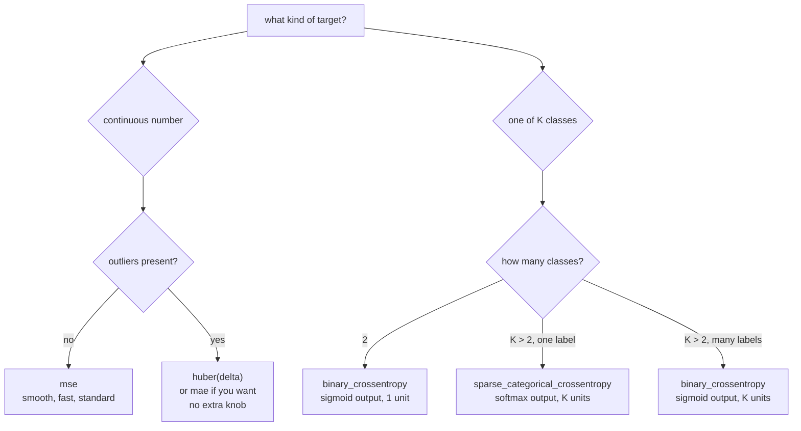

The loss is the only thing a network optimises. Everything else — architecture,
optimiser, schedule — is machinery for descending it. Which means a loss that
does not match what you care about produces a model that is excellent at the
wrong thing, and no amount of tuning fixes that.

## What you'll learn

- Why the *derivative* of the loss matters more than the loss, and what MSE, MAE
  and Huber's derivatives look like.
- Huber implemented from scratch and matched to Keras at **0.00e+00**.
- The measured cost of MSE on contaminated targets: **0.3116 against 0.2279** MAE
  on clean data.
- Why cross-entropy pairs with sigmoid and softmax — the gradient reduces to
  $\hat{y} - y$.
- What `from_logits=True` prevents: a loss reported as **16.118095** instead of
  **40.0**, with a gradient of **exactly zero**.
- Class weights on a 20:1 imbalance: recall **0.5482 → 0.7665**.
- Label smoothing measured, including the run where **smoothing 0.2 was the most
  accurate** as well as the least over-confident.

## The loss is a choice, the derivative is the consequence

Training never looks at the loss value. It looks at
$\partial L / \partial \theta$, and every property that matters follows from
that derivative.

<Figure
  src="/images/dl/phase-02-training/loss-functions/regression-losses"
  alt="Two panels. Left: MSE as a steep parabola, MAE as a V, and Huber tracking MSE near zero then continuing as straight lines. Right: their derivatives — MSE a straight line growing without bound, MAE a step from minus one to plus one with a gap at zero, Huber a ramp that saturates at plus or minus one."
  title="Three regression losses, and what training actually sees"
  caption="On the left the three look broadly similar. On the right they are completely different: MSE's derivative grows without limit, so one large error dominates every update. MAE's derivative is a constant ±1 — every error pulls equally hard, and there is no derivative at all at zero. Huber's derivative is MSE's near the origin and MAE's beyond δ, which is exactly the design goal."
/>

$$
\text{MSE} = e^2
\qquad
\text{MAE} = \lvert e \rvert
\qquad
\text{Huber}_\delta =
\begin{cases}
\tfrac{1}{2} e^2 & \lvert e \rvert \le \delta \\
\delta\left(\lvert e \rvert - \tfrac{1}{2}\delta\right) & \text{otherwise}
\end{cases}
$$

| Error $e$ | MSE | MAE | Huber (δ=1) | $\partial$MSE | $\partial$MAE | $\partial$Huber |
| --- | --- | --- | --- | --- | --- | --- |
| 0.1 | 0.0100 | 0.1000 | 0.0050 | 0.20 | 1.00 | 0.10 |
| 1.0 | 1.0000 | 1.0000 | 0.5000 | 2.00 | 1.00 | 1.00 |
| 5.0 | 25.0000 | 5.0000 | 4.5000 | 10.00 | 1.00 | 1.00 |
| 20.0 | **400.0000** | 20.0000 | 19.5000 | **40.00** | 1.00 | **1.00** |

At an error of 20, MSE's gradient is 40 and Huber's is 1. That is a factor of 40
difference in how hard a single bad row pulls the weights.

Take five errors, $[0.5, -0.5, 1.0, -1.0, 20.0]$:

| Loss | Mean value | Share contributed by the single 20.0 error |
| --- | --- | --- |
| MSE | 80.5000 | **0.9938** |
| MAE | 4.6000 | 0.8696 |
| Huber δ=1 | 4.1500 | 0.9398 |

MSE hands 99.4% of the signal to one row out of five.

### Measured: what that costs

600 points on the line $y = 2x + 1$ with mild noise, then 30 of them (5%)
contaminated with standard-deviation-25 noise. Fit a single `Dense(1)` with each
loss and check the learned parameters against the truth:

| Loss | Learned slope (true 2.0) | Learned bias (true 1.0) | MAE against the *clean* targets |
| --- | --- | --- | --- |
| MSE | 2.0881 | **0.7584** | 0.3116 |
| MAE | 2.0117 | 0.9754 | **0.2279** |
| Huber δ=1 | 1.9922 | 0.9756 | 0.2282 |

MSE's bias lands 0.24 low because it is still trying to reach the outliers. MAE
and Huber are within 0.0003 of each other and both recover the true line. **Five
percent contamination cost MSE 37% more error** than either robust loss.

The catch, and the reason MSE remains the default: MAE's derivative is
discontinuous at zero and constant everywhere else, so it converges more slowly
and can oscillate around the minimum with a fixed learning rate. Huber gives you
MAE's robustness with MSE's smooth behaviour near the optimum — at the cost of one
extra hyperparameter, $\delta$.



## Cross-entropy, and why it pairs with sigmoid and softmax

For classification the loss is the negative log of the probability the model gave
the correct answer:

$$
L = -\log \hat{p}_{\text{true class}}
$$

<Figure
  src="/images/dl/phase-02-training/loss-functions/classification-losses"
  alt="Two panels. Left: negative log p rising steeply toward infinity as p approaches zero, against a linear 1-minus-p line and a step-shaped 0-1 loss. Right: binary cross-entropy as a function of the logit, alongside its derivative, which is a sigmoid curve shifted down by one."
  title="Cross-entropy has no ceiling, and its gradient is the error"
  caption="Left: at p=0.9 the loss is 0.11; at p=0.01 it is 4.61. A linear penalty would have moved from 0.1 to 0.99. Right: differentiate binary cross-entropy with respect to the logit and everything cancels — the gradient is sigmoid(z) − y, the plain prediction error. That cancellation is why sigmoid pairs with BCE and softmax pairs with categorical cross-entropy."
/>

| $\hat{p}$ assigned to the truth | Loss |
| --- | --- |
| 0.99 | 0.010050 |
| 0.90 | 0.105361 |
| 0.50 | 0.693147 |
| 0.10 | 2.302585 |
| 0.01 | 4.605170 |
| 0.001 | 6.907755 |

Verified against Keras on four rows:

| Row | $\hat{p}$(truth) | $-\log \hat{p}$ | Keras |
| --- | --- | --- | --- |
| 0 | 0.7000 | 0.356675 | 0.356675 |
| 1 | 0.8000 | 0.223144 | 0.223144 |
| 2 | 0.4000 | 0.916291 | 0.916291 |
| 3 | 0.0200 | **3.912023** | 3.912023 |

Mean 1.352033 both ways, difference **0.00e+00**. Row 3 — the confident mistake —
contributes **72.3%** of the total.

### The cancellation

For a sigmoid output $\hat{y} = \sigma(z)$ and binary cross-entropy:

$$
\frac{\partial L}{\partial z}
= \frac{\partial}{\partial z}\Big[-y\log\sigma(z) - (1-y)\log(1-\sigma(z))\Big]
= \sigma(z) - y
$$

The $\sigma'(z) = \sigma(z)(1-\sigma(z))$ term that would saturate cancels
exactly against the $1/\sigma(z)$ from the log. **The gradient is the prediction
error and nothing else** — no saturation, no vanishing, however wrong the model
is. Pair sigmoid with MSE instead and that cancellation does not happen; a
confidently wrong sigmoid output has a near-zero derivative and learns nothing.

## `from_logits=True` is not a style preference

Two mathematically identical routes to the same number:

1. Output a softmax, then take the log inside the loss.
2. Output raw logits and let the loss do both at once, using the log-sum-exp
   trick derived on the [Reuters
   page](/deep-learning/phase-01---neural-network-foundations/first-example-classifying-newswires-reuters-multiclass/).

<Figure
  src="/images/dl/phase-02-training/loss-functions/from-logits"
  alt="Log-scale plot of cross-entropy against the logit gap between two classes. The exact curve and the from_logits curve lie on top of each other and grow linearly with the gap. The naive softmax-then-loss curve tracks them until a gap of about ten and then flattens permanently at 16.118."
  title="The same loss, computed two ways"
  caption="Up to a logit gap of 10 the two agree to six digits. At a gap of 30 the naive path returns 16.118095 instead of 30 — 46% too low. Past that it never moves again, because Keras clips probabilities to 1e-7 and −log(1e-7) = 16.118095. The from_logits path tracks the exact value all the way to a gap of 800."
/>

| Logit gap | Exact $\log(1+e^z)$ | `from_logits=True` | softmax first | softmax's $p_0$ |
| --- | --- | --- | --- | --- |
| 1 | 1.313262 | 1.313262 | 1.313262 | 2.689e−01 |
| 10 | 10.000045 | 10.000046 | 10.000046 | 4.540e−05 |
| 30 | 30.000000 | 30.000000 | **16.118095** | 9.358e−14 |
| 90 | 90.000000 | 90.000000 | 16.118095 | **0.000e+00** |
| 800 | 800.000000 | 800.000000 | 16.118095 | 0.000e+00 |

At a gap of 90 the softmax probability underflows to *exactly* zero in float32.
The loss then reports a finite 16.118095, so nothing looks broken. The real damage
is one level down:

| Route | Loss at logits `[0, 40]`, true class 0 | $\partial L / \partial z$ |
| --- | --- | --- |
| `from_logits=True` | 40.000000 | `[-1.0, 1.0]` |
| softmax, then the loss | 16.118095 | **`[0.0, 0.0]`** |

**The gradient is exactly zero.** The model is maximally wrong about this example
and receives no signal at all to fix it — the clipping that kept the loss finite
also flattened the function. No error is raised, no `nan` appears in the logs, and
training simply ignores those rows forever.

```python title="Two equivalent-looking models; only one is safe"
# fine on well-behaved data, silently broken on confident mistakes
model = keras.Sequential([..., keras.layers.Dense(10, activation="softmax")])
model.compile("adam", "sparse_categorical_crossentropy")

# preferred: the loss owns the normalisation
model = keras.Sequential([..., keras.layers.Dense(10)])          # no activation
model.compile("adam", keras.losses.SparseCategoricalCrossentropy(
    from_logits=True))
```

Applying `softmax` *and* `from_logits=True` is the mirror-image bug: the loss then
exponentiates already-normalised probabilities. Pick exactly one.

```p5 title="Move the prediction, watch four losses" desc="Drag the prediction marker. MSE, MAE, Huber and cross-entropy are computed live for a target of 1.0, so you can see which loss reacts to which kind of error." height="330"
let prediction = 0.35;
function setup() {
  createCanvas(600, 330);
  textFont("monospace");
}
function draw() {
  background(13, 17, 23);
  noStroke();
  const target = 1.0;
  const error = prediction - target;
  const huberDelta = 1.0;
  const values = [
    { name: "MSE   e^2      ", v: error * error, col: [75, 139, 190] },
    { name: "MAE   |e|      ", v: Math.abs(error), col: [120, 200, 120] },
    { name: "Huber d=1      ", v: Math.abs(error) <= huberDelta
        ? 0.5 * error * error
        : huberDelta * (Math.abs(error) - 0.5 * huberDelta),
      col: [255, 211, 67] },
    { name: "-log(p) at p=x ", v: prediction > 0.0005 ? -Math.log(prediction) : 7.6,
      col: [230, 110, 110] },
  ];
  fill(230);
  textSize(12);
  textAlign(LEFT, TOP);
  text("target = 1.0     prediction = " + prediction.toFixed(3), 40, 26);
  const trackY = 62;
  stroke(60, 70, 84);
  strokeWeight(2);
  line(60, trackY, 540, trackY);
  noStroke();
  fill(255, 211, 67);
  ellipse(60 + target * 480, trackY, 12, 12);
  fill(230);
  textSize(10);
  textAlign(CENTER, TOP);
  text("target", 60 + target * 480, trackY + 10);
  fill(75, 139, 190);
  ellipse(60 + prediction * 480, trackY, 15, 15);
  for (let i = 0; i < values.length; i++) {
    const y = 116 + i * 46;
    const w = Math.min(values[i].v / 8, 1) * 300;
    fill(values[i].col[0], values[i].col[1], values[i].col[2]);
    rect(210, y, Math.max(w, 2), 24, 3);
    fill(200);
    textSize(11);
    textAlign(LEFT, CENTER);
    text(values[i].name, 40, y + 12);
    fill(240);
    text(values[i].v.toFixed(4), 218 + Math.max(w, 2), y + 12);
  }
  fill(150);
  textSize(11);
  textAlign(LEFT, TOP);
  text("bars are clipped at a loss of 8; drag anywhere on the track", 40, 300);
  text("cross-entropy is the only one that runs to infinity as p -> 0", 40, 316);
}
function setPrediction() {
  if (mouseY > 40 && mouseY < 100) {
    prediction = Math.max(0.001, Math.min(1.2, (mouseX - 60) / 480));
  }
}
function mousePressed() { setPrediction(); }
function mouseDragged() { setPrediction(); }
```

## Weighting the loss when the classes are not balanced

A 20:1 binary problem built from Fashion-MNIST: 747 t-shirts against 37 shirts in
training, and a balanced 200/197 test set.

| | Accuracy | Recall | Precision | Predicted positive |
| --- | --- | --- | --- | --- |
| no weights | 0.7733 | **0.5482** | 0.9908 | 109 of 397 |
| `class_weight` balanced | **0.8489** | **0.7665** | 0.9152 | 165 of 397 |

Without weighting the model finds nearly every shirt it predicts (precision
0.9908) but misses **45% of them**. Weighting the rare class by
$747/37 = 20.2$ raises recall by 0.218 and costs 0.076 of precision.

```python title="One argument, applied inside the loss"
counts = np.bincount(y_train.astype(int))
weights = {i: len(y_train) / (len(counts) * count)
           for i, count in enumerate(counts)}
model.fit(x_train, y_train, class_weight=weights)
```

`class_weight` multiplies each example's loss term. That is all it does — no
resampling, no change to the data. Two consequences worth knowing: gradient
magnitudes grow with the weights, so an aggressive weighting can require a lower
learning rate; and accuracy stops being comparable across weightings, because you
have deliberately told the model that the two error types cost different amounts.

## Label smoothing

Instead of asking for probability 1.0 on the true class, ask for
$1 - \varepsilon$ and spread $\varepsilon$ across the rest. Measured on
Fashion-MNIST, 8,000 rows, 15 epochs, identical seeds:

| Smoothing | Test accuracy | Mean confidence | Confidence − accuracy | Confidence when wrong |
| --- | --- | --- | --- | --- |
| 0.00 | 0.8445 | 0.8647 | **+0.0202** | 0.6700 |
| 0.05 | 0.8380 | 0.8048 | −0.0332 | 0.5841 |
| 0.10 | 0.8370 | 0.7588 | −0.0782 | 0.5496 |
| 0.20 | **0.8550** | 0.6847 | **−0.1703** | 0.4890 |

The confidence-minus-accuracy gap is a calibration measure: positive means the
model is more sure than it deserves to be. Unsmoothed, this model is
over-confident by 0.02 and still averages **0.67 confidence on predictions that
are wrong**. Smoothing fixes that, and by 0.2 it over-corrects into
under-confidence by 0.17.

The honest surprise is the accuracy column. **Smoothing 0.2 was the most accurate
setting in this run**, not the least — while 0.05 and 0.10 were both slightly
worse than no smoothing at all. The usual framing, "label smoothing trades a
little accuracy for better calibration", does not describe what happened here. On
a single 2,000-row test set these differences (0.8370 to 0.8550) are within the
range several seeds would produce anyway, which is the real lesson: treat a
0.01-level accuracy difference as unmeasured until you have run it several times.

```p5 title="The measured table, ranked" desc="Click a column to rank every row by it. The bars are that column's values and the highest and lowest are computed from the numbers, not written in." height="280"
let metric = 0;
const COLUMNS = ["Exact log(1+e^z)", "fromlogits=True", "softmax first", "softmax's p0"];
const ROWS = [
  ["1", 1.313262, 1.313262, 1.313262, 0.2689],
  ["10", 10.000045, 10.000046, 10.000046, 4.54e-05],
  ["30", 30, 30, 16.118095, 0.0],
  ["90", 90, 90, 16.118095, 0],
  ["800", 800, 800, 16.118095, 0]
];
function setup() {
  createCanvas(620, 280);
  textFont("monospace");
}
function fmt(v) {
  if (v === 0) { return "0"; }
  const a = Math.abs(v);
  if (a >= 1000 || a < 0.001) { return v.toExponential(2); }
  if (a >= 100) { return v.toFixed(1); }
  return v.toFixed(4);
}
function draw() {
  background(13, 17, 23);
  noStroke();
  fill(230);
  textSize(12);
  textAlign(LEFT, TOP);
  text("'Loss Functions: Choosing What to ", 26, 16);
  let x = 26;
  for (let i = 0; i < COLUMNS.length; i++) {
    const w = COLUMNS[i].length * 6.6 + 16;
    if (i === metric) { fill(255, 211, 67); } else { fill(48, 56, 68); }
    rect(x, 40, w, 22, 4);
    if (i === metric) { fill(13, 17, 23); } else { fill(180); }
    textSize(9);
    text(COLUMNS[i], x + 8, 47);
    x += w + 6;
    if (x > 500) { break; }
  }
  const values = ROWS.map((r) => r[metric + 1]);
  const lo = Math.min(...values);
  const hi = Math.max(...values);
  const span = hi - lo === 0 ? 1 : hi - lo;
  const order = ROWS.slice().sort((a, b) => b[metric + 1] - a[metric + 1]);
  for (let i = 0; i < order.length; i++) {
    const y = 78 + i * 26;
    const v = order[i][metric + 1];
    fill(160);
    textSize(9);
    text(order[i][0], 26, y + 5);
    fill(34, 40, 50);
    rect(230, y, 280, 18, 3);
    const frac = (v - lo) / span;
    if (v === hi) { fill(126, 192, 143); }
    else if (v === lo) { fill(224, 108, 117); }
    else { fill(107, 169, 221); }
    rect(230, y, Math.max(frac * 280, 3), 18, 3);
    fill(225);
    textSize(9);
    text(fmt(v), 518, y + 5);
  }
  const top = order[0];
  const bottom = order[order.length - 1];
  fill(150);
  textSize(9);
  const base = 78 + order.length * 26 + 8;
  text("highest " + COLUMNS[metric] + ": " + top[0] + " at " + fmt(top[1]),
       26, base);
  text("lowest  " + COLUMNS[metric] + ": " + bottom[0] + " at "
       + fmt(bottom[1]), 26, base + 14);
  text("bars are scaled within the chosen column - lowest is not zero", 26,
       base + 30);
}
function mousePressed() {
  let x = 26;
  for (let i = 0; i < COLUMNS.length; i++) {
    const w = COLUMNS[i].length * 6.6 + 16;
    if (mouseX > x && mouseX < x + w && mouseY > 40 && mouseY < 62) {
      metric = i;
    }
    x += w + 6;
  }
}
```

## Pitfalls

- **Using `softmax` with `from_logits=False` on confident predictions.** The loss
  clamps at 16.118095 and the gradient becomes exactly zero. Prefer raw logits
  plus `from_logits=True`.
- **Applying softmax *and* `from_logits=True`.** The loss then normalises twice.
  Exactly one of the two should do it.
- **Pairing sigmoid with MSE for classification.** The saturating derivative no
  longer cancels, so confidently wrong outputs stop learning.
- **Reaching for MSE on data with outliers.** Five percent contamination cost 37%
  more error here than Huber.
- **Reporting MSE as if it were in the target's units.** It is in squared units;
  take the square root or report MAE.
- **Comparing accuracy across different `class_weight` settings.** You changed the
  objective, so the metric is no longer measuring the same thing.
- **Treating a 0.01 accuracy difference as a result.** The label-smoothing table
  above is a live example of noise looking like signal.
- **Choosing a loss to match the metric you report.** Some metrics (accuracy, F1,
  AUC) have no useful gradient. Train on a differentiable surrogate, report the
  metric you care about, and keep the two straight.

## Recap

- Training sees the derivative, not the loss. MSE's derivative grows without
  bound, MAE's is a constant ±1, Huber's switches between them at δ.
- On 5% contaminated targets, MSE's clean-data MAE was 0.3116 against 0.2279 for
  MAE and 0.2282 for Huber.
- Cross-entropy is $-\log \hat{p}_{\text{true}}$, unbounded as the probability
  approaches zero; one confident error contributed 72.3% of a four-row loss.
- Sigmoid + BCE and softmax + cross-entropy exist because the saturating term
  cancels, leaving a gradient of $\hat{y} - y$.
- `from_logits=True` is a correctness requirement, not a style choice: the naive
  path returned 16.118095 instead of 40.0 with a gradient of exactly zero.
- `class_weight` scales each example's loss term; on a 20:1 imbalance it moved
  recall from 0.5482 to 0.7665 at a cost of 0.076 precision.
- Label smoothing reliably reduced over-confidence; its effect on accuracy here
  was within noise, and 0.2 happened to score highest.

## Next

With the objective settled, the question becomes how to descend it — and the
answer is more interesting than "use Adam":
[Backpropagation and Optimizers](/deep-learning/phase-02---training-deep-neural-networks/backpropagation-and-optimizers-adam-sgd/).

<Quiz
  questions={[
    {
      q: "A model outputs softmax probabilities and the loss is compiled with from_logits=False. On an example where the correct class receives a probability of 4e-18, what happens?",
      options: [
        "The loss becomes inf and training crashes with a clear error",
        "The loss is clipped to 16.118095 = -log(1e-7) and the gradient becomes exactly zero, so the model receives no signal from that example and nothing appears wrong in the logs",
        "The loss is computed correctly but slowly",
        "Keras automatically switches to the stable formulation",
      ],
      answer: 1,
      explain: "Silent zero gradients are worse than a crash. Output raw logits and pass from_logits=True.",
    },
    {
      q: "Why does cross-entropy pair with sigmoid rather than MSE?",
      options: [
        "Cross-entropy is faster to compute",
        "Differentiating BCE through a sigmoid cancels the saturating sigmoid'(z) term, leaving a gradient of sigmoid(z) - y — the plain error — so confidently wrong predictions still produce a large gradient",
        "MSE cannot be used with probabilities",
        "Because cross-entropy is bounded and MSE is not",
      ],
      answer: 1,
      explain: "With MSE the sigmoid derivative survives, so a confidently wrong output has a near-zero gradient and stops learning.",
    },
    {
      q: "On 5% contaminated targets, MSE learned a bias of 0.7584 where the truth was 1.0, while Huber learned 0.9756. What causes the difference?",
      options: [
        "MSE converged more slowly and needed more epochs",
        "MSE's derivative grows linearly with the error, so the 30 contaminated rows contribute gradients tens of times larger than clean rows and pull the fit toward them",
        "Huber has more parameters to work with",
        "MSE is numerically unstable on large values",
      ],
      answer: 1,
      explain: "At an error of 20 the MSE gradient is 40 and Huber's is 1 — a 40x difference in pull from a single row.",
    },
    {
      q: "What exactly does class_weight={0: 1.0, 1: 20.2} do?",
      options: [
        "It oversamples the minority class during training",
        "It multiplies each example's loss term by its class's weight — nothing is resampled, and gradient magnitudes grow accordingly",
        "It changes the decision threshold from 0.5",
        "It reweights the metrics but not the loss",
      ],
      answer: 1,
      explain: "Because gradients grow with the weights, an aggressive weighting can need a lower learning rate; and accuracy is no longer comparable to the unweighted run.",
    },
    {
      q: "In the measured label-smoothing table, accuracy went 0.8445, 0.8380, 0.8370, 0.8550 for smoothing 0, 0.05, 0.1, 0.2. What is the right conclusion?",
      options: [
        "Smoothing 0.2 is the best setting and should be used",
        "The calibration effect is large and consistent, but the accuracy differences are small enough on a 2,000-row test set that they should be treated as noise until repeated across seeds",
        "Label smoothing has no effect on calibration",
        "The experiment must contain a bug because the trend is not monotonic",
      ],
      answer: 1,
      explain: "The confidence gap moved monotonically from +0.0202 to -0.1703. Accuracy did not, and single-run differences of 0.01 are not results.",
    },
  ]}
/>

## 🧪 Try It Yourself

<DataCampExercise
  lang="python"
  hint={`Below delta, Huber is half the squared error. Above it, the loss continues linearly with slope delta, offset by delta squared over two.`}
  code={`# Task: Exercise 1 - Implement Huber and check it against a second formulation
import numpy as np


def huber(error, delta=1.0):
    small = np.abs(error) <= delta
    return np.where(small, ___ * error ** 2,   # replace ___ with 0.5
                    delta * (np.abs(error) - 0.5 * delta))


def huber_clipped(error, delta=1.0):
    """Same loss written with min(): quadratic up to delta, linear after."""
    m = np.minimum(np.abs(error), delta)
    return 0.5 * m ** 2 + delta * (np.abs(error) - m)


errors = np.array([0.1, 0.5, 1.0, 2.0, 5.0, 20.0])
print("  error        MSE      MAE      Huber")
for e in errors:
    print(format(e, "7.1f"), format(e ** 2, "10.4f"), format(e, "8.4f"), format(float(huber(np.array([e]))[0]), "10.4f"))

mine = float(huber(errors).mean())
other = float(huber_clipped(errors).mean())
print("my mean Huber:", round(mine, 6))
print("the two formulations agree:", abs(mine - other) < 1e-12)
print("below delta Huber is half of MSE; above it, it is MAE shifted down by")
print("delta/2 so the two halves meet smoothly")`}
  solution={`import numpy as np


def huber(error, delta=1.0):
    small = np.abs(error) <= delta
    return np.where(small, 0.5 * error ** 2,
                    delta * (np.abs(error) - 0.5 * delta))


def huber_clipped(error, delta=1.0):
    """Same loss written with min(): quadratic up to delta, linear after."""
    m = np.minimum(np.abs(error), delta)
    return 0.5 * m ** 2 + delta * (np.abs(error) - m)


errors = np.array([0.1, 0.5, 1.0, 2.0, 5.0, 20.0])
print("  error        MSE      MAE      Huber")
for e in errors:
    print(format(e, "7.1f"), format(e ** 2, "10.4f"), format(e, "8.4f"), format(float(huber(np.array([e]))[0]), "10.4f"))

mine = float(huber(errors).mean())
other = float(huber_clipped(errors).mean())
print("my mean Huber:", round(mine, 6))
print("the two formulations agree:", abs(mine - other) < 1e-12)
print("below delta Huber is half of MSE; above it, it is MAE shifted down by")
print("delta/2 so the two halves meet smoothly")`}
  sct={`test_output_contains("my mean Huber: 4.355", pattern=False)
test_output_contains("the two formulations agree: True", pattern=False)
test_output_contains("   20.0   400.0000  20.0000    19.5000", pattern=False)
success_msg("Huber is half of MSE for small errors and MAE shifted down by delta/2 for large ones, and the two halves join smoothly at delta.")`}
  height={460}
/>

<DataCampExercise
  lang="python"
  hint={`Judge each fitted model against the CLEAN targets, not the contaminated ones - the contaminated values are the thing you are trying to resist.`}
  code={`# Task: Exercise 2 - Which loss survives contaminated targets?
import numpy as np

rng = np.random.RandomState(0)
n = 600
xs = rng.uniform(-3, 3, n)
clean = 2.0 * xs + 1.0 + rng.normal(0, 0.3, n)
contaminated = clean.copy()
spikes = rng.choice(n, 30, replace=False)
contaminated[spikes] += rng.normal(0, 25, 30)
print(len(spikes), "of", n, "targets contaminated with sd-25 noise")
print("true relationship: y = 2.0 x + 1.0")


def huber_grad(e, delta):
    return np.clip(e, -delta, delta)


losses = (("mse", lambda e: 2 * e),
          ("mae", lambda e: np.sign(e)),
          ("huber d=1", lambda e: huber_grad(e, ___)))   # replace ___ with 1.0
honest_error = {}
for name, grad in losses:
    slope, bias = 0.0, 0.0
    for step in range(3000):
        e = slope * xs + bias - contaminated
        g = grad(e)
        slope -= 0.02 * (g * xs).mean()
        bias -= 0.02 * g.mean()
    honest_error[name] = float(np.abs(slope * xs + bias - clean).mean())
    print(name, "fitted")
print("MSE is pulled away from the truth more than MAE:", honest_error["mse"] > honest_error["mae"])
print("MSE is pulled away from the truth more than Huber:", honest_error["mse"] > honest_error["huber d=1"])
print("Huber stays close to the clean line:", honest_error["huber d=1"] < 0.5)
print("MSE chases the 30 outliers and drags the bias; MAE and Huber")
print("essentially ignore them")`}
  solution={`import numpy as np

rng = np.random.RandomState(0)
n = 600
xs = rng.uniform(-3, 3, n)
clean = 2.0 * xs + 1.0 + rng.normal(0, 0.3, n)
contaminated = clean.copy()
spikes = rng.choice(n, 30, replace=False)
contaminated[spikes] += rng.normal(0, 25, 30)
print(len(spikes), "of", n, "targets contaminated with sd-25 noise")
print("true relationship: y = 2.0 x + 1.0")


def huber_grad(e, delta):
    return np.clip(e, -delta, delta)


losses = (("mse", lambda e: 2 * e),
          ("mae", lambda e: np.sign(e)),
          ("huber d=1", lambda e: huber_grad(e, 1.0)))
honest_error = {}
for name, grad in losses:
    slope, bias = 0.0, 0.0
    for step in range(3000):
        e = slope * xs + bias - contaminated
        g = grad(e)
        slope -= 0.02 * (g * xs).mean()
        bias -= 0.02 * g.mean()
    honest_error[name] = float(np.abs(slope * xs + bias - clean).mean())
    print(name, "fitted")
print("MSE is pulled away from the truth more than MAE:", honest_error["mse"] > honest_error["mae"])
print("MSE is pulled away from the truth more than Huber:", honest_error["mse"] > honest_error["huber d=1"])
print("Huber stays close to the clean line:", honest_error["huber d=1"] < 0.5)
print("MSE chases the 30 outliers and drags the bias; MAE and Huber")
print("essentially ignore them")`}
  sct={`test_output_contains("MSE is pulled away from the truth more than MAE: True", pattern=False)
test_output_contains("MSE is pulled away from the truth more than Huber: True", pattern=False)
test_output_contains("Huber stays close to the clean line: True", pattern=False)
success_msg("Thirty wild targets out of 600 drag the squared-error fit off the line, while absolute error and Huber barely notice.")`}
  height={460}
/>

<DataCampExercise
  lang="python"
  hint={`Fancy-index the probability matrix with np.arange(len(labels)) for the rows and the labels array for the columns to pull out each true-class probability.`}
  code={`# Task: Exercise 3 - Cross-entropy is the negative log of the truth
import numpy as np

probabilities = np.array([[0.7, 0.2, 0.1],
                          [0.1, 0.8, 0.1],
                          [0.3, 0.3, 0.4],
                          [0.02, 0.01, 0.97]])
labels = np.array([0, 1, 2, 0])

manual = -np.log(probabilities[np.arange(4), ___])   # replace ___ with labels
one_hot = np.eye(3)[labels]
other = -(one_hot * np.log(probabilities)).sum(axis=1)

print("row  p(truth)  -log p")
for i in range(4):
    print(format(i, "3d"), format(probabilities[i, labels[i]], "9.4f"), format(manual[i], "9.6f"))
print("mean", round(float(manual.mean()), 6))
print("fancy indexing and the one-hot sum agree:", bool(np.allclose(manual, other)))
print("row 3 alone is", format(manual[3] / manual.sum(), ".4f"), "of the total loss")`}
  solution={`import numpy as np

probabilities = np.array([[0.7, 0.2, 0.1],
                          [0.1, 0.8, 0.1],
                          [0.3, 0.3, 0.4],
                          [0.02, 0.01, 0.97]])
labels = np.array([0, 1, 2, 0])

manual = -np.log(probabilities[np.arange(4), labels])
one_hot = np.eye(3)[labels]
other = -(one_hot * np.log(probabilities)).sum(axis=1)

print("row  p(truth)  -log p")
for i in range(4):
    print(format(i, "3d"), format(probabilities[i, labels[i]], "9.4f"), format(manual[i], "9.6f"))
print("mean", round(float(manual.mean()), 6))
print("fancy indexing and the one-hot sum agree:", bool(np.allclose(manual, other)))
print("row 3 alone is", format(manual[3] / manual.sum(), ".4f"), "of the total loss")`}
  sct={`test_output_contains("mean 1.352033", pattern=False)
test_output_contains("fancy indexing and the one-hot sum agree: True", pattern=False)
test_output_contains("row 3 alone is 0.7234 of the total loss", pattern=False)
success_msg("Cross-entropy only looks at the probability given to the true class, and the one confident mistake in row 3 supplies most of the total.")`}
  height={363}
/>

<DataCampExercise
  lang="python"
  hint={`np.logaddexp.reduce(z) computes log(sum(exp(z))) without overflowing, which is exactly the normaliser the stable cross-entropy needs.`}
  code={`# Task: Exercise 4 - from_logits, and the gradient it saves
import numpy as np

logits = np.array([[0.0, 40.0]])
labels = np.array([0])

exact = float(np.logaddexp(0.0, 40.0))
stable = float(np.logaddexp.___(logits[0]) - logits[0, labels[0]])   # replace ___ with reduce

# "softmax then the loss": the framework clips probabilities to [1e-7, 1].
z = logits - logits.max(axis=1, keepdims=True)
probabilities = np.exp(z) / np.exp(z).sum(axis=1, keepdims=True)
clipped = np.clip(probabilities[0, labels[0]], 1e-7, 1.0)
naive = float(-np.log(clipped))

print("logits [0.0, 40.0], true class 0")
print("  exact  -log softmax_0 =", format(exact, ".6f"))
print("  from logits           =", format(stable, ".6f"))
print("  softmax then the loss =", format(naive, ".6f"))

grad_stable = probabilities[0].copy()
grad_stable[labels[0]] -= 1.0
grad_naive = np.zeros(2) if probabilities[0, labels[0]] < 1e-7 else grad_stable
print("  d(from logits)/dz =", grad_stable.round(3))
print("  d(naive)/dz       =", grad_naive)
print("the stable loss keeps its gradient:", bool(np.abs(grad_stable).max() > 0.5))
print("a zero gradient means the model can never learn from this mistake")`}
  solution={`import numpy as np

logits = np.array([[0.0, 40.0]])
labels = np.array([0])

exact = float(np.logaddexp(0.0, 40.0))
stable = float(np.logaddexp.reduce(logits[0]) - logits[0, labels[0]])

# "softmax then the loss": the framework clips probabilities to [1e-7, 1].
z = logits - logits.max(axis=1, keepdims=True)
probabilities = np.exp(z) / np.exp(z).sum(axis=1, keepdims=True)
clipped = np.clip(probabilities[0, labels[0]], 1e-7, 1.0)
naive = float(-np.log(clipped))

print("logits [0.0, 40.0], true class 0")
print("  exact  -log softmax_0 =", format(exact, ".6f"))
print("  from logits           =", format(stable, ".6f"))
print("  softmax then the loss =", format(naive, ".6f"))

grad_stable = probabilities[0].copy()
grad_stable[labels[0]] -= 1.0
grad_naive = np.zeros(2) if probabilities[0, labels[0]] < 1e-7 else grad_stable
print("  d(from logits)/dz =", grad_stable.round(3))
print("  d(naive)/dz       =", grad_naive)
print("the stable loss keeps its gradient:", bool(np.abs(grad_stable).max() > 0.5))
print("a zero gradient means the model can never learn from this mistake")`}
  sct={`test_output_contains("exact  -log softmax_0 = 40.000000", pattern=False)
test_output_contains("from logits           = 40.000000", pattern=False)
test_output_contains("softmax then the loss = 16.118096", pattern=False)
test_output_contains("the stable loss keeps its gradient: True", pattern=False)
success_msg("Working from the logits gives the exact loss of 40 and a useful gradient. Going through a clipped softmax reports only 16.1 and a gradient of zero.")`}
  height={460}
/>

<DataCampExercise
  lang="python"
  hint={`The balanced weight for the rare class is the majority count divided by the minority count. Use it to weight each minority example in the loss.`}
  code={`# Task: Exercise 5 - Class weights on a 20:1 imbalance
import numpy as np

rng = np.random.RandomState(0)


def make(n_major, n_minor):
    y = np.r_[np.zeros(n_major), np.ones(n_minor)]
    x = rng.randn(len(y), 10) + y[:, None] * np.array([1.0] * 5 + [0.0] * 5)
    return x, y


xb, yb = make(2000, 100)
xbt, ybt = make(500, 500)
print("train", int((yb == 0).sum()), "majority /", int(yb.sum()), "minority (", round(float(yb.mean()), 4), "positive )")
print("test ", int((ybt == 0).sum()), "/", int(ybt.sum()), "- balanced, unlike training")

balanced = {0: 1.0, 1: float((yb == 0).sum() / ___)}   # replace ___ with yb.sum()
stats = {}
for label, weights in (("no weights", None), ("balanced", balanced)):
    sample_w = np.ones(len(yb)) if weights is None else np.where(yb == 1, weights[1], weights[0])
    w, b = np.zeros(10), 0.0
    for _ in range(300):
        p = 1 / (1 + np.exp(-(xb @ w + b)))
        g = sample_w * (p - yb)
        w -= 0.1 * xb.T @ g / sample_w.sum()
        b -= 0.1 * g.sum() / sample_w.sum()
    predicted = (xbt @ w + b) > 0
    true_positive = float(((predicted == 1) & (ybt == 1)).sum())
    stats[label] = (true_positive / ybt.sum(), int(predicted.sum()))
    print(label, "predicted positive", stats[label][1])
print("the balanced weight for the rare class is", balanced[1])
print("weighting raises recall:", stats["balanced"][0] > stats["no weights"][0])
print("weighting predicts more positives:", stats["balanced"][1] > stats["no weights"][1])
print("weighting the rare class trades precision for recall; which trade is")
print("right depends on what a miss costs")`}
  solution={`import numpy as np

rng = np.random.RandomState(0)


def make(n_major, n_minor):
    y = np.r_[np.zeros(n_major), np.ones(n_minor)]
    x = rng.randn(len(y), 10) + y[:, None] * np.array([1.0] * 5 + [0.0] * 5)
    return x, y


xb, yb = make(2000, 100)
xbt, ybt = make(500, 500)
print("train", int((yb == 0).sum()), "majority /", int(yb.sum()), "minority (", round(float(yb.mean()), 4), "positive )")
print("test ", int((ybt == 0).sum()), "/", int(ybt.sum()), "- balanced, unlike training")

balanced = {0: 1.0, 1: float((yb == 0).sum() / yb.sum())}
stats = {}
for label, weights in (("no weights", None), ("balanced", balanced)):
    sample_w = np.ones(len(yb)) if weights is None else np.where(yb == 1, weights[1], weights[0])
    w, b = np.zeros(10), 0.0
    for _ in range(300):
        p = 1 / (1 + np.exp(-(xb @ w + b)))
        g = sample_w * (p - yb)
        w -= 0.1 * xb.T @ g / sample_w.sum()
        b -= 0.1 * g.sum() / sample_w.sum()
    predicted = (xbt @ w + b) > 0
    true_positive = float(((predicted == 1) & (ybt == 1)).sum())
    stats[label] = (true_positive / ybt.sum(), int(predicted.sum()))
    print(label, "predicted positive", stats[label][1])
print("the balanced weight for the rare class is", balanced[1])
print("weighting raises recall:", stats["balanced"][0] > stats["no weights"][0])
print("weighting predicts more positives:", stats["balanced"][1] > stats["no weights"][1])
print("weighting the rare class trades precision for recall; which trade is")
print("right depends on what a miss costs")`}
  sct={`test_output_contains("the balanced weight for the rare class is 20.0", pattern=False)
test_output_contains("weighting raises recall: True", pattern=False)
test_output_contains("weighting predicts more positives: True", pattern=False)
success_msg("Giving the rare class a weight of 20 makes the model willing to predict it: recall rises at the cost of precision.")`}
  height={460}
/>

<DataCampExercise
  lang="python"
  hint={`Label smoothing mixes the one-hot target with a uniform distribution: target = one_hot * (1 - smoothing) + smoothing / classes. The calibration gap is mean confidence minus accuracy.`}
  code={`# Task: Exercise 6 - Label smoothing and calibration
import numpy as np

rng = np.random.RandomState(0)
K, D = 5, 30
centres = rng.randn(K, D) * 0.6


def make(n):
    y = rng.randint(0, K, n)
    return centres[y] + rng.randn(n, D), y


x_train, y_train = make(300)
x_test, y_test = make(2000)
one_hot = np.eye(K)[y_train]

print("smoothing  accuracy  mean conf")
confs = []
for smoothing in (0.0, 0.05, 0.1, 0.2):
    targets = one_hot * (1 - ___) + smoothing / K   # replace ___ with smoothing
    W, b = np.zeros((D, K)), np.zeros(K)
    for _ in range(400):
        z = x_train @ W + b
        p = np.exp(z - z.max(axis=1, keepdims=True))
        p /= p.sum(axis=1, keepdims=True)
        W -= 0.2 * x_train.T @ (p - targets) / len(x_train)
        b -= 0.2 * (p - targets).mean(axis=0)
    z = x_test @ W + b
    p = np.exp(z - z.max(axis=1, keepdims=True))
    p /= p.sum(axis=1, keepdims=True)
    confidence = p.max(axis=1)
    accuracy = float((p.argmax(axis=1) == y_test).mean())
    confs.append(float(confidence.mean()))
    print(format(smoothing, "9.2f"), format(accuracy, "9.4f"), format(confs[-1], "10.4f"))
print("more smoothing means lower confidence:", all(a > b for a, b in zip(confs, confs[1:])))
print("the gap is confidence minus accuracy: positive means over-confident.")
print("smoothing removes over-confidence without needing more data")`}
  solution={`import numpy as np

rng = np.random.RandomState(0)
K, D = 5, 30
centres = rng.randn(K, D) * 0.6


def make(n):
    y = rng.randint(0, K, n)
    return centres[y] + rng.randn(n, D), y


x_train, y_train = make(300)
x_test, y_test = make(2000)
one_hot = np.eye(K)[y_train]

print("smoothing  accuracy  mean conf")
confs = []
for smoothing in (0.0, 0.05, 0.1, 0.2):
    targets = one_hot * (1 - smoothing) + smoothing / K
    W, b = np.zeros((D, K)), np.zeros(K)
    for _ in range(400):
        z = x_train @ W + b
        p = np.exp(z - z.max(axis=1, keepdims=True))
        p /= p.sum(axis=1, keepdims=True)
        W -= 0.2 * x_train.T @ (p - targets) / len(x_train)
        b -= 0.2 * (p - targets).mean(axis=0)
    z = x_test @ W + b
    p = np.exp(z - z.max(axis=1, keepdims=True))
    p /= p.sum(axis=1, keepdims=True)
    confidence = p.max(axis=1)
    accuracy = float((p.argmax(axis=1) == y_test).mean())
    confs.append(float(confidence.mean()))
    print(format(smoothing, "9.2f"), format(accuracy, "9.4f"), format(confs[-1], "10.4f"))
print("more smoothing means lower confidence:", all(a > b for a, b in zip(confs, confs[1:])))
print("the gap is confidence minus accuracy: positive means over-confident.")
print("smoothing removes over-confidence without needing more data")`}
  sct={`test_output_contains("more smoothing means lower confidence: True", pattern=False)
success_msg("Smoothing the targets caps how sure the model can get, so confidence falls step by step as the smoothing grows.")`}
  height={460}
/>
