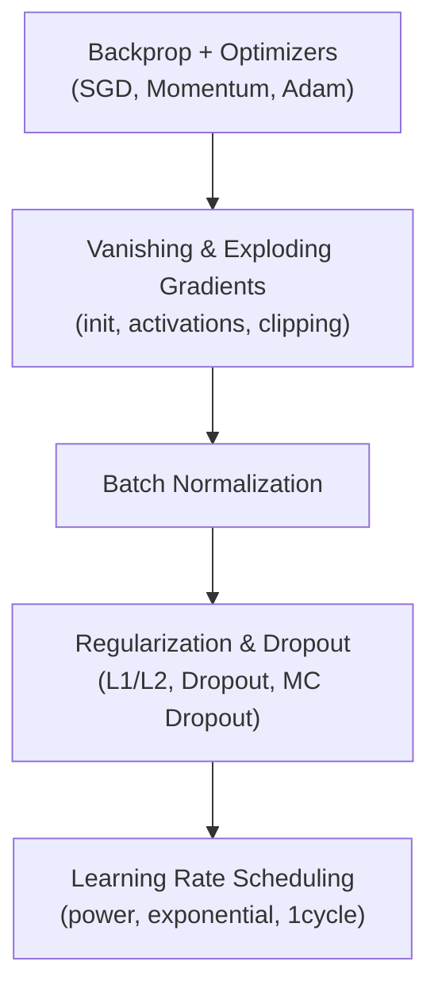

## Why deep nets fight back

A shallow network with one or two hidden layers is forgiving. Stack ten, twenty,
or a hundred layers and things change: gradients can vanish or explode on their
way back through backpropagation, training can crawl to a halt, and a model with
millions of parameters can memorize the training set instead of learning from it.

In this phase, you'll learn the toolkit that makes deep networks *actually* trainable:

- how backpropagation computes gradients, and which optimizer (SGD, momentum,
  RMSProp, Adam) to reach for
- why gradients vanish or explode, and how Glorot/He initialization plus
  nonsaturating activations (ReLU, ELU, SELU) fix it
- Batch Normalization — letting each layer normalize its own inputs on the fly
- regularization: L1/L2 penalties, Dropout, MC Dropout, and max-norm
- learning rate scheduling — decaying the learning rate on a schedule instead
  of leaving it constant

## Phase 2 flow

## How the pieces fit together

None of these techniques are used in isolation — a real `tf.keras` training script
usually combines several at once: He initialization on every layer, ELU or ReLU
activations, a BatchNormalization layer after each Dense layer, a touch of L2
regularization or Dropout, and Adam (or Nadam) as the optimizer with a decaying
learning rate. By the end of this phase you'll understand why each ingredient
earns its place in that recipe.

:::tip[From the book]
*Hands-On Machine Learning* (Géron) opens this chapter with a warning: training a
deep DNN "isn't a walk in the park." You may run into vanishing or exploding
gradients, you might not have enough labeled data, training may be painfully
slow, and a model with millions of parameters risks overfitting badly. The rest
of the chapter — and this phase — is the set of tools built specifically to
solve each of those four problems.
:::
