import Figure from "../../../../components/Figure.astro";
import Quiz from "../../../../components/Quiz.astro";

Phase 1's networks were two or three layers deep, because deeper ones do not train
without help. This phase is that help: what breaks with depth, what fixes it, and —
measured on identical runs — how much each fix is actually worth. Several are worth
much less than their reputation, and one of them is routinely mis-measured because
Keras reports a number that is not what it appears to be.

## What this phase covers

```mermaid
flowchart LR
  A["411 Backprop<br/>and optimizers"] --> B["411.5 Loss functions<br/>what to minimise"]
  B --> C["412 Vanishing and<br/>exploding gradients"]
  C --> D["413 Batch<br/>normalisation"]
  D --> E["414 Regularisation<br/>and dropout"]
  E --> F["415 Learning rate<br/>scheduling"]
  F --> G["416 The universal<br/>workflow"]
  G --> H["417 Evaluating<br/>models"]
  H --> I["418 Callbacks and<br/>TensorBoard"]
  I --> J["Phase 3:<br/>convolutional networks"]
```



Pages 411 to 415 are individual mechanisms. Pages 416 to 418 are the process that
assembles them — which order to apply them in, how to know whether a number is
real, and how to run the job.

## The nine pages, and what each one proves

| # | Page | The result it delivers |
| --- | --- | --- |
| 411 | [Backpropagation and Optimizers](/deep-learning/phase-02---training-deep-neural-networks/backpropagation-and-optimizers-adam-sgd/) | Backprop matched to TensorFlow at **7.45e−09**, and seven optimizers where **RMSprop (0.8565) beat Adam (0.8445)** while AdaGrad never arrived |
| 411.5 | [Loss Functions](/deep-learning/phase-02---training-deep-neural-networks/loss-functions---choosing-what-to-minimise/) | `from_logits=False` on a confident error returns a loss of 16.118095 instead of 40.0 with a gradient of **exactly zero** |
| 412 | [Vanishing & Exploding Gradients](/deep-learning/phase-02---training-deep-neural-networks/vanishing--exploding-gradients/) | A 20-layer sigmoid network delivering **1.19e−12** to its first layer, and an exploding run that killed **127 of 128** units |
| 413 | [Batch Normalization](/deep-learning/phase-02---training-deep-neural-networks/batch-normalization/) | Ten sigmoid layers going from **0.1025 to 0.9225** — and BN *losing* at batch size 4 |
| 414 | [Regularization & Dropout](/deep-learning/phase-02---training-deep-neural-networks/regularization--dropout/) | Dropout 0.5 at **0.8633**, and L2's apparent ranking **inverting** once Keras' penalty-inflated `val_loss` is corrected |
| 415 | [Learning Rate Scheduling](/deep-learning/phase-02---training-deep-neural-networks/learning-rate-scheduling/) | Five schedules within **0.0045** of each other, two of them worse than a constant rate |
| 416 | [The Universal Workflow](/deep-learning/phase-02---training-deep-neural-networks/the-universal-workflow-of-machine-learning/) | A five-rung ladder from **0.1015 to 0.8635** where logistic regression alone covered **0.7385** of the climb |
| 417 | [Evaluating Models](/deep-learning/phase-02---training-deep-neural-networks/evaluating-models---generalization-and-validation/) | Thirty hold-out splits spanning **0.1417**, and a leak reaching **0.9600 accuracy on pure noise** |
| 418 | [Callbacks and TensorBoard](/deep-learning/phase-02---training-deep-neural-networks/callbacks-and-tensorboard/) | Four policies, and proof that `logs["loss"]` mid-epoch is a **running average**, not the batch's loss |

<Figure
  src="/images/dl/phase-02-training/optimizers/optimizer-comparison"
  alt="Two panels. Left: training loss on a log axis for seven optimizers, with AdaGrad clearly highest and Nesterov lowest. Right: validation accuracy per epoch, where the adaptive methods rise fastest in the first five epochs, plain SGD catches up by epoch 14, and AdaGrad trails everything."
  title="Seven optimizers, one architecture, one seed"
  caption="Blue is the SGD family, amber the accumulating methods, green the Adam family. In the accuracy panel every optimizer except AdaGrad finishes inside a 0.014 band — but they arrive at very different times. Nesterov reaches the lowest training loss (0.2108) while finishing joint-lowest on validation accuracy, which is overfitting, not superiority."
/>

<Figure
  src="/images/dl/phase-02-training/learning-rate-scheduling/schedule-results"
  alt="Two panels. Left: validation accuracy per epoch for the five schedules, all converging into a narrow band between 0.84 and 0.855 by epoch 20. Right: grouped bars of final and best accuracy per schedule, all between 0.848 and 0.853."
  title="Five schedules, identical everything else"
  caption="The whole spread is 0.0045 — from power decay's 0.8480 to piecewise and 1cycle's 0.8525. Constant, the schedule that does nothing at all, scored 0.8510. On this budget with a well-chosen base rate, the schedule is not what decides the result."
/>

<Figure
  src="/images/dl/overviews/phase-summaries/phase-2"
  alt="Horizontal bars, one per page in the phase, each labelled with the claim it tested and coloured by the verdict: green where the standard story held, amber where it held at a price, red where the measurement contradicted it. 2 of 6 claims contradicted, 2 held at a price, 2 held."
  title="Every claim this phase set out to test"
  caption="Collected from the runs behind each page's own figures rather than measured afresh, so every bar is traceable to the page it names. Bar length is the log of the effect size, because the effects span from 0.0014 to 5,376 — the number that matters is printed on each bar. Across all nine phases, 34 of 54 claims were contradicted outright, 11 held at a cost that was worth stating, and 9 held as advertised."
/>

## Five results that contradict the standard advice

1. **Adam did not win.** RMSprop finished 0.0120 ahead of it and Nadam 0.0080 ahead
   on the same problem. Adam beat plain SGD by 0.0020 — a difference no one should
   act on. What adaptive methods actually bought was time: 5 epochs to reach 0.84
   against SGD's 14. (411)
2. **Learning-rate schedules bought almost nothing.** Five schedules spanned 0.8480
   to 0.8525 with a constant rate at 0.8510 — two schedules were *worse* than doing
   nothing. Getting the base rate right is worth an order of magnitude more. (415)
3. **Batch normalisation did not raise the ceiling.** At a well-tuned learning rate,
   with and without BN were identical to four decimal places (0.9115 both). BN's
   value is tolerance: at lr=1.0 it scored 0.9380 against 0.3985. And at batch size
   4 it *lost*. (413)
4. **Keras' `val_loss` inverted L2's ranking.** On the reported number every penalty
   looked worse than none; on the plain cross-entropy the strongest penalty was best
   by a wide margin (0.4810 against 0.6253). The reported loss includes the penalty
   term. (414)
5. **A leak reached 0.9600 accuracy on data with no signal in it.** Duplicating rows
   before a shuffled split let 1-nearest-neighbour find each test row's twin in the
   training fold. Feature selection before the split scored 0.7550 where chance was
   0.5100. (417)

The pattern across all five: **the mechanisms are real, and their magnitudes are
smaller and more conditional than the advice implies.** The ones that mattered most
here were the unglamorous ones — a correct base learning rate, a correct
`from_logits`, an honest split.

## What actually made the biggest difference

Ranked by measured effect on the same kind of problem:

| Change | Measured effect |
| --- | --- |
| fixing a dead network (initialisation + clipping) | 0.1025 → 0.8225 |
| adding BN to ten stacked sigmoid layers | 0.1025 → 0.9225 |
| using `from_logits=True` on confident errors | a zero gradient becomes a usable one |
| beating a linear baseline at all | 0.1015 → 0.8400 |
| dropout 0.5 on an over-parameterised model | 0.8467 → 0.8633 |
| plateau-based rate reduction over 60 epochs | 0.8530 → 0.8690 |
| choosing RMSprop over Adam | 0.8445 → 0.8565 |
| the best fixed schedule over a constant rate | 0.8510 → 0.8525 |

The top of that table is about **making training work at all**; the bottom is
0.001-level tuning. Most of the value is at the top, and most of the internet's
attention is at the bottom.

```p5 title="The learning rate, on one axis" desc="Drag through the sweep. Each stop is a measured run - the useful range is narrow and both edges fail in different ways." height="340"
let index = 3;
const RATES = [0.0001, 0.001, 0.01, 0.1, 1.0];
const ACC = [0.1320, 0.5885, 0.8405, 0.8960, 0.8855];
const LOSS = [2.318552, 1.714472, 0.464704, 0.187716, 0.187320];
const NOTE = [
  "1,000x too small - looks exactly like a broken model",
  "still climbing when the 15-epoch budget ran out",
  "inside the useful band",
  "best measured accuracy",
  "did NOT explode - the textbook picture says it should",
];
function setup() {
  createCanvas(620, 340);
  textFont("monospace");
}
function draw() {
  background(13, 17, 23);
  noStroke();
  fill(230);
  textSize(12);
  textAlign(LEFT, TOP);
  text("learning rate sweep - same model, same epochs", 26, 18);
  const ox = 26;
  const oy = 90;
  const w = 540;
  stroke(48, 56, 68);
  strokeWeight(2);
  line(ox, oy, ox + w, oy);
  noStroke();
  for (let i = 0; i < RATES.length; i++) {
    const x = ox + (i / (RATES.length - 1)) * w;
    if (i === index) { fill(255, 211, 67); } else { fill(90, 102, 118); }
    circle(x, oy, i === index ? 15 : 9);
    fill(i === index ? 235 : 110);
    textSize(8.5);
    textAlign(CENTER, TOP);
    text(RATES[i], x, oy + 14);
    textAlign(LEFT, TOP);
  }
  fill(150);
  textSize(10);
  text("accuracy after training:", 26, 140);
  fill(40, 47, 58);
  rect(26, 160, 500, 26, 3);
  const value = ACC[index];
  if (value > 0.9) { fill(126, 192, 143); }
  else if (value > 0.5) { fill(255, 211, 67); }
  else { fill(224, 108, 117); }
  rect(26, 160, value * 500, 26, 3);
  fill(240);
  textSize(12);
  text(value.toFixed(4), 34, 166);
  fill(200);
  textSize(10);
  text(NOTE[index], 26, 200);
  fill(150);
  textSize(9);
  text("final training loss: " + LOSS[index].toFixed(6), 26, 226);
  text("the useful range spans two orders of magnitude, and the failure", 26, 248);
  text("at the bottom is silent: 0.1320 is barely above the 0.1000 you", 26, 262);
  text("get by guessing, and nothing in the code looks wrong.", 26, 276);
  fill(110);
  textSize(8.5);
  text("theory bounds the step at 2/c - only measurement tells you c", 26, 302);
}
function mousePressed() { mouseDragged(); }
function mouseDragged() {
  if (mouseY < 70 || mouseY > 115) { return; }
  const t = Math.min(Math.max((mouseX - 26) / 540, 0), 1);
  index = Math.round(t * (RATES.length - 1));
}
```

```p5 title="How often the standard story survived" desc="Step through the phases. Each bar splits the claims that phase tested into contradicted, held at a price, and held as advertised - the totals are summed live." height="400"
let picked = 0;
const PHASES = [
  [1, "Neural Network Foundations", 3, 0, 3, "a single neuron cannot do XOR - 0 of 40,401 weight pairs"],
  [2, "Training Deep Networks", 2, 2, 2, "146x the parameters bought 0.0150 accuracy"],
  [3, "Computer Vision", 4, 1, 1, "augmentation cost 0.1855 clean, bought 0.1105 rotated"],
  [4, "Sequence Models", 4, 2, 0, "a fixed state scored 0.0017 against attention's 1.0000"],
  [5, "NLP & Transformers", 4, 1, 1, "TF-IDF 0.8632 beat a transformer's 0.8462, 55x cheaper"],
  [6, "Generative", 3, 1, 2, "copying 200 real images scored FID 5.027 against real 9.605"],
  [7, "Reinforcement Learning", 4, 2, 0, "replay and target nets: 144.20 together, 53.45 either alone"],
  [8, "Scaling & Deployment", 5, 1, 0, "mixed precision measured 40.65x SLOWER on this CPU"],
  [9, "Capstones", 5, 1, 0, "a memoriser beat the VAE on Frechet distance"]
];
function setup() {
  createCanvas(620, 400);
  textFont("monospace");
}
function draw() {
  background(13, 17, 23);
  noStroke();
  fill(230);
  textSize(12);
  textAlign(LEFT, TOP);
  text("54 claims, 9 phases, every one tested by a measurement", 26, 16);
  let broke = 0;
  let cost = 0;
  let held = 0;
  for (let i = 0; i < PHASES.length; i++) {
    broke += PHASES[i][2];
    cost += PHASES[i][3];
    held += PHASES[i][4];
  }
  for (let i = 0; i < PHASES.length; i++) {
    const y = 48 + i * 26;
    const row = PHASES[i];
    const chosen = i === picked;
    fill(chosen ? 255 : 130, chosen ? 211 : 140, chosen ? 67 : 155);
    textSize(9);
    text("Phase " + row[0] + "  " + row[1], 26, y + 5);
    let x = 250;
    const unit = 34;
    fill(224, 108, 117);
    rect(x, y, row[2] * unit, 17, 2);
    x += row[2] * unit;
    fill(255, 211, 67);
    rect(x, y, row[3] * unit, 17, 2);
    x += row[3] * unit;
    fill(126, 192, 143);
    rect(x, y, row[4] * unit, 17, 2);
    if (chosen) {
      noFill();
      stroke(255, 211, 67);
      strokeWeight(1.5);
      rect(248, y - 2, 6 * unit + 4, 21, 3);
      noStroke();
    }
  }
  const row = PHASES[picked];
  fill(200);
  textSize(10);
  text("Phase " + row[0] + " headline:", 26, 300);
  fill(255, 211, 67);
  textSize(10);
  text(row[5], 26, 318);
  fill(150);
  textSize(9);
  text("contradicted " + row[2] + "   held at a price " + row[3]
       + "   held " + row[4], 26, 340);
  fill(224, 108, 117);
  rect(26, 360, 12, 12, 2);
  fill(150);
  textSize(9);
  text("contradicted  " + broke + " of 54", 44, 362);
  fill(255, 211, 67);
  rect(210, 360, 12, 12, 2);
  fill(150);
  text("held at a price  " + cost, 228, 362);
  fill(126, 192, 143);
  rect(400, 360, 12, 12, 2);
  fill(150);
  text("held  " + held, 418, 362);
  fill(110);
  textSize(8.5);
  text("click a row. Collected from each page's own measured run.", 26, 382);
}
function mousePressed() {
  for (let i = 0; i < PHASES.length; i++) {
    const y = 48 + i * 26;
    if (mouseY > y && mouseY < y + 20) { picked = i; }
  }
}
```

## Prerequisites

- [Phase 1](/deep-learning/phase-01---neural-network-foundations/phase-1---neural-network-foundations/):
  tensors, the training loop, activations, and one gradient-descent step derived by
  hand.
- Comfort reading a training curve and telling training loss from validation loss.
- `pip install tensorflow numpy matplotlib scikit-learn` — no GPU needed. The
  heaviest measurement on any page in this phase is a 60-epoch run on 8,000 rows.

## By the end of this phase you can

- Derive backpropagation for a small network and check it against `GradientTape`.
- Choose a loss from the target's type, and explain why the sigmoid/cross-entropy
  pairing exists at all.
- Diagnose a dead or vanishing network from per-layer gradient norms rather than
  from the loss curve.
- Pick an initialiser that matches the activation, and know when clipping is a fix
  against a symptom.
- Insert normalisation where it helps and avoid it where it hurts.
- Regularise in the right order: capacity, then dropout, then a penalty.
- Find a base learning rate with a range test, and decide whether a schedule is
  worth adding.
- Build a baseline ladder and refuse to add complexity that does not pay.
- Design a validation scheme that does not leak, and report a spread rather than a
  point.
- Assemble a training job out of callbacks, and know exactly what each number it
  prints means.

## Next

Everything so far treats an input as a flat vector. Images are not flat, and
exploiting that structure is what Phase 3 is about: convolutional networks, where
the architecture encodes the fact that nearby pixels are related.

<Quiz
  questions={[
    {
      q: "Across this phase, which change produced the largest measured improvement?",
      options: [
        "Switching optimiser from SGD to Adam",
        "Making a broken network train at all — initialisation and clipping took a dead run from 0.1025 to 0.8225, and BN took ten stacked sigmoid layers from 0.1025 to 0.9225",
        "Adding a learning-rate schedule",
        "Increasing the model width",
      ],
      answer: 1,
      explain: "The large wins are about training working at all. The optimiser and schedule comparisons moved results by 0.001 to 0.01.",
    },
    {
      q: "Five learning-rate schedules landed within 0.0045 of each other, with two worse than a constant rate. What is the takeaway?",
      options: [
        "Schedules are broken in Keras",
        "The base rate deserves the tuning effort; the schedule's shape is a second-order effect on a short run at a well-chosen base rate",
        "Only 1cycle is worth using",
        "The measurement needs more epochs to be valid",
      ],
      answer: 1,
      explain: "The same phase measured a 1,000x-too-small base rate producing 0.1320 accuracy. That is the difference worth chasing.",
    },
    {
      q: "Why can Keras' reported val_loss not be used to compare L2 penalty strengths?",
      options: [
        "Because validation data is shuffled differently each epoch",
        "Because the reported loss includes the regularisation term, so a stronger penalty inflates its own loss — comparing the raw numbers compares different quantities and inverted the true ranking here",
        "Because L2 is applied only during training",
        "Because val_loss is computed before the last update",
      ],
      answer: 1,
      explain: "Measured: 0.6469 versus 0.6253 on Keras' number, but 0.4810 versus 0.6253 on the plain cross-entropy.",
    },
    {
      q: "Which order does the workflow page recommend for building a model?",
      options: [
        "Start with the largest model you can afford, then shrink it",
        "Beat a dumb baseline, then build something that visibly overfits, then regularise it back — because a model with no generalisation gap has nothing to trade",
        "Regularise first so the model never overfits",
        "Tune hyperparameters before choosing an architecture",
      ],
      answer: 1,
      explain: "The measured 8-unit model had a gap of only 0.0221 and could not be improved by any regulariser: it was underfitting, and a small gap is only good news when the scores are high.",
    },
    {
      q: "A colleague reports 0.86 validation accuracy from one 80/20 split on 600 rows. What should you ask for?",
      options: [
        "A larger model",
        "A cross-validated mean with its spread — thirty random splits of the same 600 rows ranged from 0.7333 to 0.8750, so a single split cannot support a comparison",
        "The training accuracy",
        "A different random seed",
      ],
      answer: 1,
      explain: "And check the pipeline for leaks: scaling or feature selection applied before the split reached 0.7550 on data with no signal at all.",
    },
  ]}
/>
