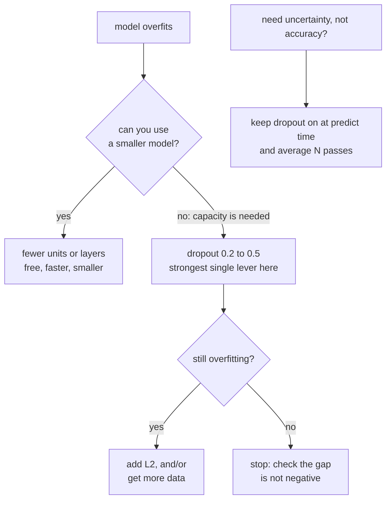

Regularisation is any pressure that stops a model fitting its training set
perfectly. There are four common kinds, they work by completely different
mechanisms, and one of them is routinely mis-measured because Keras reports a
number that is not what you think it is. All four are measured below on the same
over-parameterised network.

## What you'll learn

- Inverted dropout implemented by hand — and why Keras scales *up* during
  training rather than down at inference.
- The simplest regulariser measured: **13,002 parameters reached 0.8407** against
  669,706 parameters' 0.8467.
- Four dropout rates, where **0.5 was best** and 0.7 began to underfit — with the
  train/validation gap moving from **+0.1133 to −0.0090**.
- Why Keras' `val_loss` cannot be compared across L2 strengths, and what the
  plain cross-entropy shows instead: **0.6253 → 0.4810**.
- L2's actual effect on the weights: mean |w| falling **16×** while the largest
  single weight **grew**.
- MC dropout: an accuracy gain inside the noise, but a spread **2.3× larger on
  wrong predictions**.
- Max-norm, measured as a hard cap: **0 of 512** columns above the limit against
  **512 of 512** without it.

## The cheapest regulariser is a smaller model

Before any penalty or noise, there is capacity. Two hidden layers on 6,000
Fashion-MNIST rows, Adam, 30 epochs:

<Figure
  src="/images/dl/phase-02-training/regularization-and-dropout/capacity-and-dropout"
  alt="Two panels of validation loss against epoch. Left: three model widths — 16 units descends slowly and is still falling at epoch 30, 64 units bottoms at epoch 13, 512 units bottoms at epoch 6 and then climbs steeply. Right: four dropout rates on the 512-unit model, where 0.0 climbs sharply after epoch 6 while 0.5 stays nearly flat after its minimum."
  title="Two ways to regularise the same problem"
  caption="Left: the 512-unit model reaches the lowest validation loss of the three (0.4263) and then throws it away, ending at 0.6253. The 16-unit model never overfits — it is still improving at epoch 30 — but it never gets as low either. Right: dropout 0.5 on the wide model reaches 0.4065, better than any width, and its curve barely rises afterwards."
/>

| Hidden width | Parameters | Best val loss | At epoch | Final val loss | Val accuracy |
| --- | --- | --- | --- | --- | --- |
| 16 | **13,002** | 0.4562 | 30 | **0.4562** | 0.8407 |
| 64 | 55,050 | 0.4690 | 13 | 0.5210 | 0.8453 |
| 512 | **669,706** | **0.4263** | 6 | 0.6253 | 0.8467 |

**Fifty times the parameters bought 0.0060 accuracy.** The small model's best and
final losses are the same number, because it has no capacity to overfit with —
which is a form of regularisation you get for free, along with a model that trains
faster and ships smaller.

The wide model is not useless: it reaches a lower minimum. It just cannot stay
there, which is what every other technique on this page is for.

## Dropout

At each training step, zero each unit independently with probability $r$, then
scale the survivors by $1/(1-r)$ so the layer's expected output is unchanged:

$$
\tilde{a}_i =
\begin{cases}
0 & \text{with probability } r \\[2pt]
\dfrac{a_i}{1-r} & \text{otherwise}
\end{cases}
$$

This is *inverted* dropout, and the scaling is why prediction needs no correction
at all — the training-time output already has the right expectation. Measured on a
matrix of ones with $r = 0.5$: the surviving entries all come out as exactly
**2.0**, and `training=False` returns the input unchanged.

| Dropout rate | Best val loss | At epoch | Final val loss | Val accuracy | Train accuracy | Gap |
| --- | --- | --- | --- | --- | --- | --- |
| 0.0 | 0.4263 | 6 | 0.6253 | 0.8467 | 0.9600 | **0.1133** |
| 0.2 | 0.4147 | 13 | 0.5774 | 0.8453 | 0.9397 | 0.0944 |
| **0.5** | **0.4065** | 17 | **0.4230** | **0.8633** | 0.8930 | **0.0297** |
| 0.7 | 0.4313 | 22 | 0.4396 | 0.8533 | 0.8443 | **−0.0090** |

Three things happen as the rate rises. The **overfitting turn moves later** (epoch
6 → 13 → 17 → 22), the **gap closes** (0.1133 → −0.0090), and the **training
accuracy falls** (0.9600 → 0.8443). At 0.7 the training accuracy is *below* the
validation accuracy, which is the signature of a model being held back rather than
generalised.

Dropout 0.5 was the best single result on this page: 0.8633 accuracy and a
validation loss that ends 0.0165 above its own minimum, against the unregularised
model's 0.1990 above.

```python title="Dropout goes after the activation"
keras.layers.Dense(512, activation="relu"),
keras.layers.Dropout(0.5),
keras.layers.Dense(512, activation="relu"),
keras.layers.Dropout(0.5),
```



## L2, and a measurement trap

$$
L_{\text{total}} = L_{\text{data}} + \lambda \sum_i w_i^2
$$

The gradient of that penalty is $2\lambda w$, so every step shrinks each weight in
proportion to its own size — which is why L2 is also called weight decay.

**The trap:** Keras adds the penalty term to the loss it reports, including
`val_loss`. Comparing `val_loss` across different $\lambda$ values therefore
compares different quantities, and the stronger penalty looks worse purely because
its own penalty is included. Measured both ways:

| L2 $\lambda$ | Keras `val_loss` | Plain cross-entropy | Val accuracy | mean \|w\| | max \|w\| |
| --- | --- | --- | --- | --- | --- |
| none | 0.6253 | 0.6253 | 0.8467 | 0.0461 | 0.6245 |
| 1e−5 | 0.7049 | 0.6868 | 0.8413 | 0.0393 | 0.6833 |
| 1e−4 | 0.6451 | 0.5519 | **0.8560** | 0.0271 | 0.9342 |
| 1e−3 | 0.6913 | 0.5251 | 0.8133 | 0.0098 | 0.9499 |
| 1e−2 | 0.6469 | **0.4810** | 0.8360 | **0.0028** | **1.1726** |

Read the two loss columns against each other. On Keras' number, L2 looks useless —
every setting is worse than none. On the **plain cross-entropy the strongest
penalty is the best by a wide margin**, 0.4810 against 0.6253. Same runs, opposite
conclusions, and only one of the two columns is measuring what you meant.

Accuracy tells a third story, peaking at 1e−4 (0.8560) and dipping at 1e−3
(0.8133). With a 1,500-row validation set those swings are not reliable either.
The one column that moves cleanly and monotonically is the mechanism:

<Figure
  src="/images/dl/phase-02-training/regularization-and-dropout/l2-weights"
  alt="Two panels. Left: validation accuracy per epoch for five L2 strengths, all within a band of about 0.04. Right: log-scale histograms of the learned weights for three penalties — no penalty is a broad bell, 1e-4 is narrower, and 1e-2 is a tall narrow spike at zero with visible tails extending past 0.2."
  title="What the penalty buys, and what it does"
  caption="Left uses validation accuracy rather than Keras' val_loss, because val_loss includes the penalty term and is not comparable across strengths. Right shows the actual effect: at 1e-2 the mean absolute weight is 0.0028 against 0.0461 with no penalty — a 16x reduction — while the largest single weight grows from 0.6245 to 1.1726. L2 penalises the sum of squares, so it flattens the bulk and tolerates a few large survivors."
/>

That last point is worth keeping. **L2 does not bound any individual weight.** It
minimises the total sum of squares, and the cheapest way to do that is to crush the
many small weights while letting a few genuinely useful ones grow. If you need a
per-weight bound, that is what max-norm is for.

## MC dropout: keeping the noise on at prediction time

Dropout is normally switched off for prediction. Leave it on, run the same input
through the model 100 times, and you get a distribution instead of a point:

<Figure
  src="/images/dl/phase-02-training/regularization-and-dropout/mc-dropout"
  alt="Two panels. Left: overlapping histograms of the prediction spread across 100 stochastic passes, with the correct-prediction distribution concentrated near 0.08 and the wrong-prediction distribution shifted right and much wider. Right: accuracy against the number of averaged passes, rising from 0.839 at one pass to about 0.865 by 25, against a dashed line at 0.8633 for one deterministic pass."
  title="100 stochastic passes over the same test set"
  caption="Left: on predictions the model got right the spread across passes averages 0.0837; on predictions it got wrong, 0.1902 — 2.3x wider. That separation is the useful output. Right: averaging the passes reaches 0.8653 against the deterministic 0.8633, a gain of 0.0020, and it is not even monotonic — 50 passes scored 0.8607. The accuracy benefit here is noise."
/>

| Passes averaged | Test accuracy |
| --- | --- |
| 1 (stochastic) | **0.8387** |
| 2 | 0.8493 |
| 5 | 0.8627 |
| 10 | 0.8633 |
| 25 | 0.8653 |
| 50 | **0.8607** |
| 100 | 0.8653 |
| one deterministic pass | 0.8633 |

The honest reading has two halves. **The accuracy gain is not real**: 0.8653
against 0.8633 is 0.0020 on a 1,500-row test set, and the non-monotonic 50-pass
result confirms it is noise. **The uncertainty signal is real**: spread 0.0837 when
correct against 0.1902 when wrong is a factor of 2.3, and it costs 100 forward
passes to obtain.

If you need to know *which* predictions to distrust — for routing to a human, for
abstention, for flagging out-of-distribution inputs — that spread is a usable
signal, and MC dropout is the cheapest way to get one out of a model you have
already trained. If you just want accuracy, spend the 100 passes elsewhere.

```python title="training=True is the whole trick"
samples = np.stack([model(x_test, training=True).numpy() for _ in range(100)])
mean = samples.mean(axis=0)          # the averaged prediction
spread = samples.std(axis=0)         # how much the passes disagreed
```

```p5 title="Dropout, one batch at a time" desc="A layer of 24 units with a dropout mask applied. Drag the rate, press Resample to draw a new mask, and watch the survivors scale up by 1/(1-rate) so the sum stays put." height="330"
let rate = 0.5;
let mask = [];
const UNITS = 24;
function setup() {
  createCanvas(600, 330);
  textFont("monospace");
  resample();
}
function resample() {
  mask = [];
  for (let i = 0; i < UNITS; i++) mask.push(Math.random() > rate ? 1 : 0);
}
function draw() {
  background(13, 17, 23);
  noStroke();
  const scale = 1 / (1 - rate);
  fill(230);
  textSize(12);
  textAlign(LEFT, TOP);
  text("every unit outputs 1.0 before dropout", 50, 26);
  const kept = mask.reduce((a, b) => a + b, 0);
  for (let i = 0; i < UNITS; i++) {
    const x = 50 + (i % 12) * 42, y = 56 + Math.floor(i / 12) * 74;
    const on = mask[i] === 1;
    fill(on ? 46 : 40, on ? 96 : 44, on ? 140 : 52);
    rect(x, y, 34, 34, 4);
    fill(on ? 240 : 90);
    textSize(10);
    textAlign(CENTER, CENTER);
    text(on ? scale.toFixed(2) : "0", x + 17, y + 17);
    fill(on ? 120 : 60, on ? 200 : 64, on ? 120 : 70);
    rect(x, y + 38, 34, on ? Math.min(scale * 10, 26) : 2, 2);
  }
  fill(230);
  textSize(12);
  textAlign(LEFT, TOP);
  text("kept " + kept + " of " + UNITS + "     scale factor 1/(1-r) = "
    + scale.toFixed(3), 50, 214);
  fill(255, 211, 67);
  text("sum before " + UNITS.toFixed(1) + "     sum after "
    + (kept * scale).toFixed(1) + "     expected " + UNITS.toFixed(1), 50, 234);
  fill(150);
  textSize(11);
  text("the sum only matches on average - a single mask can be far off", 50, 254);
  fill(90, 100, 114);
  rect(50, 292, 240, 12, 6);
  fill(75, 139, 190);
  ellipse(50 + rate / 0.9 * 240, 298, 18, 18);
  fill(150);
  textSize(10);
  textAlign(LEFT, CENTER);
  text("rate " + rate.toFixed(2), 300, 298);
  fill(90, 100, 114);
  rect(380, 286, 110, 24, 4);
  fill(240);
  textAlign(CENTER, CENTER);
  textSize(11);
  text("resample", 435, 298);
}
function mousePressed() {
  if (mouseX > 380 && mouseX < 490 && mouseY > 286 && mouseY < 310) {
    resample();
    return;
  }
  setRate();
}
function mouseDragged() { setRate(); }
function setRate() {
  if (mouseY > 280 && mouseY < 316 && mouseX > 40 && mouseX < 300) {
    rate = Math.max(0, Math.min(0.9, (mouseX - 50) / 240 * 0.9));
    resample();
  }
}
```

## Max-norm: a hard cap instead of a penalty

```python title="Applied after every update, not added to the loss"
keras.layers.Dense(512, activation="relu",
                   kernel_constraint=keras.constraints.MaxNorm(1.0, axis=0))
```

After each optimiser step, any column of the kernel whose norm exceeds the limit
is rescaled down to it. Measured after five epochs:

| | Max column norm | Mean column norm | Columns above 1.0 |
| --- | --- | --- | --- |
| `MaxNorm(1.0)` | **1.000001** | 0.999975 | **0 of 512** |
| unconstrained | 1.398920 | 1.191048 | **512 of 512** |

Every column sits exactly at the cap. That is the difference between a constraint
and a penalty: L2 *encourages* small weights and lets exceptions through (max |w|
grew to 1.1726 above), while max-norm *forbids* large ones. It pairs well with
dropout and with high learning rates, because it makes a single oversized update
harmless.

```p5 title="The measured table, ranked" desc="Click a column to rank every row by it. The bars are that column's values and the highest and lowest are computed from the numbers, not written in." height="358"
let metric = 0;
const COLUMNS = ["Test accuracy"];
const ROWS = [
  ["1 (stochastic)", 0.8387],
  ["2", 0.8493],
  ["5", 0.8627],
  ["10", 0.8633],
  ["25", 0.8653],
  ["50", 0.8607],
  ["100", 0.8653],
  ["one deterministic pass", 0.8633]
];
function setup() {
  createCanvas(620, 358);
  textFont("monospace");
}
function fmt(v) {
  if (v === 0) { return "0"; }
  const a = Math.abs(v);
  if (a >= 1000 || a < 0.001) { return v.toExponential(2); }
  if (a >= 100) { return v.toFixed(1); }
  return v.toFixed(4);
}
function draw() {
  background(13, 17, 23);
  noStroke();
  fill(230);
  textSize(12);
  textAlign(LEFT, TOP);
  text("Regularization & Dropout", 26, 16);
  let x = 26;
  for (let i = 0; i < COLUMNS.length; i++) {
    const w = COLUMNS[i].length * 6.6 + 16;
    if (i === metric) { fill(255, 211, 67); } else { fill(48, 56, 68); }
    rect(x, 40, w, 22, 4);
    if (i === metric) { fill(13, 17, 23); } else { fill(180); }
    textSize(9);
    text(COLUMNS[i], x + 8, 47);
    x += w + 6;
    if (x > 500) { break; }
  }
  const values = ROWS.map((r) => r[metric + 1]);
  const lo = Math.min(...values);
  const hi = Math.max(...values);
  const span = hi - lo === 0 ? 1 : hi - lo;
  const order = ROWS.slice().sort((a, b) => b[metric + 1] - a[metric + 1]);
  for (let i = 0; i < order.length; i++) {
    const y = 78 + i * 26;
    const v = order[i][metric + 1];
    fill(160);
    textSize(9);
    text(order[i][0], 26, y + 5);
    fill(34, 40, 50);
    rect(230, y, 280, 18, 3);
    const frac = (v - lo) / span;
    if (v === hi) { fill(126, 192, 143); }
    else if (v === lo) { fill(224, 108, 117); }
    else { fill(107, 169, 221); }
    rect(230, y, Math.max(frac * 280, 3), 18, 3);
    fill(225);
    textSize(9);
    text(fmt(v), 518, y + 5);
  }
  const top = order[0];
  const bottom = order[order.length - 1];
  fill(150);
  textSize(9);
  const base = 78 + order.length * 26 + 8;
  text("highest " + COLUMNS[metric] + ": " + top[0] + " at " + fmt(top[1]),
       26, base);
  text("lowest  " + COLUMNS[metric] + ": " + bottom[0] + " at "
       + fmt(bottom[1]), 26, base + 14);
  text("bars are scaled within the chosen column - lowest is not zero", 26,
       base + 30);
}
function mousePressed() {
  let x = 26;
  for (let i = 0; i < COLUMNS.length; i++) {
    const w = COLUMNS[i].length * 6.6 + 16;
    if (mouseX > x && mouseX < x + w && mouseY > 40 && mouseY < 62) {
      metric = i;
    }
    x += w + 6;
  }
}
```

## Pitfalls

- **Comparing `val_loss` across L2 strengths.** Keras includes the penalty in the
  reported loss. Compare accuracy, or recompute the plain cross-entropy.
- **Adding dropout to a model that is not overfitting.** At rate 0.7 the training
  accuracy fell below the validation accuracy — the model was being held back.
- **Reaching for regularisation before trying a smaller model.** 13,002 parameters
  got within 0.0060 of 669,706 here, and trained faster.
- **Expecting L2 to bound individual weights.** It minimises a sum, so a few
  weights grew while the mean fell 16×. Use `MaxNorm` for a real bound.
- **Believing MC dropout improves accuracy.** Measured gain 0.0020, non-monotonic
  across pass counts. Its value is the spread, not the mean.
- **Forgetting `training=True` for MC dropout.** `model.predict` disables dropout,
  so all 100 passes return the same numbers.
- **Stacking every regulariser at once.** Each one shifts the optimal setting of
  the others; add them one at a time and measure.
- **Putting dropout before the activation.** Convention and the measurements here
  put it after; zeroing pre-activations interacts badly with a following
  normalisation layer.

## Recap

- Capacity is the first regulariser: 13,002 parameters reached 0.8407 against
  669,706 parameters' 0.8467, and never overfit.
- Inverted dropout scales survivors by $1/(1-r)$ during training, so inference
  needs no correction — verified as an exact ×2 at rate 0.5.
- Across rates 0.0 to 0.7, dropout moved the overfitting turn from epoch 6 to 22
  and the train/validation gap from 0.1133 to −0.0090. Rate 0.5 was best at 0.8633.
- Keras' `val_loss` includes the L2 penalty, which inverts the apparent ranking;
  on plain cross-entropy L2 improved the result from 0.6253 to 0.4810.
- L2 cut the mean absolute weight 16× while the largest weight grew — it bounds a
  sum, not any single weight.
- MC dropout's accuracy gain was 0.0020 and non-monotonic; its spread separated
  correct from wrong predictions by a factor of 2.3.
- `MaxNorm` is a hard cap applied after every update: 0 of 512 columns exceeded it
  against 512 of 512 unconstrained.

## Next

Seven techniques, each measured in isolation. The question that remains is the
order to apply them in on a problem you have never seen:
[The Universal Workflow of Machine
Learning](/deep-learning/phase-02---training-deep-neural-networks/the-universal-workflow-of-machine-learning/).

<Quiz
  questions={[
    {
      q: "Keras reported val_loss 0.6469 for L2 = 1e-2 and 0.6253 for no penalty, but the plain cross-entropy was 0.4810 against 0.6253. What explains the contradiction?",
      options: [
        "The plain cross-entropy was computed on different data",
        "Keras adds the regularisation term to the loss it reports, so val_loss for a penalised model includes its own penalty — the two columns are not the same quantity",
        "val_loss is computed before the final epoch's update",
        "The model with L2 was still improving",
      ],
      answer: 1,
      explain: "Compare accuracy, or recompute the plain loss from the predictions. Comparing raw val_loss across penalty strengths is a category error.",
    },
    {
      q: "At dropout 0.7 the training accuracy was 0.8443 and the validation accuracy 0.8533 — a negative gap. What does that indicate?",
      options: [
        "The validation set is easier than the training set",
        "The regularisation is now strong enough to hold the model back on the training data itself, which is underfitting rather than generalisation",
        "There is a bug in the evaluation code",
        "Dropout is behaving correctly and this is the target state",
      ],
      answer: 1,
      explain: "A small positive gap is healthy. A negative one means the noise injected during training is costing more than the overfitting it prevents.",
    },
    {
      q: "Why does inverted dropout scale the surviving units by 1/(1-r) during training?",
      options: [
        "To keep the gradients from vanishing",
        "So the layer's expected output matches what it would be with no dropout — which means prediction needs no correction at all",
        "To compensate for the reduced number of parameters",
        "Because the loss function requires normalised inputs",
      ],
      answer: 1,
      explain: "Verified: at rate 0.5 the survivors come out as exactly 2.0, and training=False returns the input unchanged.",
    },
    {
      q: "MC dropout scored 0.8653 across 100 passes against 0.8633 for a single deterministic pass, but 0.8607 at 50 passes. What should you take from it?",
      options: [
        "100 passes is the right number to use",
        "The accuracy differences are noise; the genuinely useful output is the spread across passes, which was 2.3x larger on wrong predictions than on correct ones",
        "MC dropout does not work with this architecture",
        "The model needs more dropout",
      ],
      answer: 1,
      explain: "A non-monotonic sequence across pass counts is the giveaway. Use MC dropout when you need calibrated disagreement, not for a fraction of a point of accuracy.",
    },
    {
      q: "L2 at 1e-2 reduced the mean absolute weight to 0.0028 while the largest single weight grew to 1.1726. Why?",
      options: [
        "The measurement is wrong — L2 shrinks every weight",
        "L2 minimises the sum of squares, so the cheapest way to satisfy it is to crush the many small weights while letting a few genuinely useful ones grow",
        "The largest weight belongs to a layer without the regulariser",
        "Adam's adaptive scaling cancels the penalty for large weights",
      ],
      answer: 1,
      explain: "If you need a bound on individual weights, MaxNorm gives one: 0 of 512 columns exceeded the cap, against 512 of 512 unconstrained.",
    },
  ]}
/>

## 🧪 Try It Yourself

<DataCampExercise
  lang="python"
  hint={`Divide the masked values by (1 - rate) so the expected sum is unchanged. The layer does this during training, which is why prediction needs no correction.`}
  code={`# Task: Exercise 1 - Inverted dropout by hand
import numpy as np

rng = np.random.RandomState(0)
values = np.ones((4, 8))
rate = 0.5
mask = (rng.rand(4, 8) > rate).astype(float)
scaled = values * mask / (1.0 - ___)   # replace ___ with rate

print("mask (1 = kept):")
print(mask.astype(int))
print("input mean", values.mean())
print("the masked values are all 0 or", float(scaled.max()))
print("kept values are all", np.unique(scaled[scaled > 0]))

# Over many masks the rescaled mean converges to the input mean.
many = [(values * (rng.rand(4, 8) > rate) / (1.0 - rate)).mean() for _ in range(2000)]
print("average over 2000 masks without rescaling would be", round(float(np.mean([(values * (rng.rand(4, 8) > rate)).mean() for _ in range(2000)])), 1))
print("average over 2000 masks with rescaling is about the input mean:", bool(abs(np.mean(many) - 1.0) < 0.02))
print("inverted dropout scales up during training so that")
print("prediction needs no correction at all")`}
  solution={`import numpy as np

rng = np.random.RandomState(0)
values = np.ones((4, 8))
rate = 0.5
mask = (rng.rand(4, 8) > rate).astype(float)
scaled = values * mask / (1.0 - rate)

print("mask (1 = kept):")
print(mask.astype(int))
print("input mean", values.mean())
print("the masked values are all 0 or", float(scaled.max()))
print("kept values are all", np.unique(scaled[scaled > 0]))

# Over many masks the rescaled mean converges to the input mean.
many = [(values * (rng.rand(4, 8) > rate) / (1.0 - rate)).mean() for _ in range(2000)]
print("average over 2000 masks without rescaling would be", round(float(np.mean([(values * (rng.rand(4, 8) > rate)).mean() for _ in range(2000)])), 1))
print("average over 2000 masks with rescaling is about the input mean:", bool(abs(np.mean(many) - 1.0) < 0.02))
print("inverted dropout scales up during training so that")
print("prediction needs no correction at all")`}
  sct={`test_output_contains("kept values are all [2.]", pattern=False)
test_output_contains("average over 2000 masks without rescaling would be 0.5", pattern=False)
test_output_contains("average over 2000 masks with rescaling is about the input mean: True", pattern=False)
success_msg("Dividing by (1 - rate) makes the expected value of the masked layer equal to the input, so nothing needs correcting at prediction time.")`}
  height={397}
/>

<DataCampExercise
  lang="python"
  hint={`Only the hidden width changes. Watch how far the final validation loss ends up above the best one.`}
  code={`# Task: Exercise 2 - The simplest regulariser is a smaller model
import numpy as np

rng = np.random.RandomState(0)
D, K = 30, 3
centres = rng.randn(K, D) * 0.5


def make(n):
    y = rng.randint(0, K, n)
    return centres[y] + rng.randn(n, D) * 1.5, y


x_train, y_train = make(60)
x_test, y_test = make(1000)


def softmax(z):
    p = np.exp(z - z.max(axis=1, keepdims=True))
    return p / p.sum(axis=1, keepdims=True)


def ce(p, y):
    return float(-np.log(p[np.arange(len(y)), y] + 1e-12).mean())


def train_mlp(width=64, dropout=0.0, penalty=0.0, epochs=300, lr=0.1, seed=0, max_norm=None, init=0.1, track_every=1):
    r = np.random.RandomState(seed)
    W1 = r.randn(D, width) * init
    W2 = r.randn(width, K) * init
    onehot = np.eye(K)[y_train]
    history = {"val_loss": [], "train_acc": []}
    for epoch in range(epochs):
        h = np.maximum(x_train @ W1, 0)
        if dropout:
            mask = (r.rand(*h.shape) > dropout) / (1 - dropout)
            h = h * mask
        p = softmax(h @ W2)
        dz = (p - onehot) / len(y_train)
        dh = dz @ W2.T
        if dropout:
            dh = dh * mask
        dh = dh * (x_train @ W1 > 0)
        W2 -= lr * (h.T @ dz + 2 * penalty * W2)
        W1 -= lr * (x_train.T @ dh + 2 * penalty * W1)
        if max_norm is not None:
            norms = np.linalg.norm(W1, axis=0)
            W1 = W1 * np.minimum(1.0, max_norm / (norms + 1e-12))
        if track_every and (epoch + 1) % track_every == 0:
            pv = softmax(np.maximum(x_test @ W1, 0) @ W2)
            history["val_loss"].append(ce(pv, y_test))
            ph = softmax(np.maximum(x_train @ W1, 0) @ W2)
            history["train_acc"].append(float((ph.argmax(axis=1) == y_train).mean()))
    return W1, W2, history


def predict(W1, W2, x, r=None, dropout=0.0):
    h = np.maximum(x @ W1, 0)
    if dropout:
        h = h * ((r.rand(*h.shape) > dropout) / (1 - dropout))
    return softmax(h @ W2)

print("width  params  best val loss  at epoch  final val loss")
info = {}
for width in (2, 16, 256):
    W1, W2, history = train_mlp(width=___, epochs=300)   # replace ___ with width
    losses = history["val_loss"]
    best = int(np.argmin(losses)) + 1
    info[width] = (min(losses), best, losses[-1])
    print(format(width, "5d"), format(D * width + width * K, "7d"), round(min(losses), 4), best, round(losses[-1], 4))
print("the widest model reaches the lowest validation loss:", info[256][0] < info[2][0])
print("every width ends above its own best validation loss:", all(v[2] > v[0] for v in info.values()))
print("the widest model reaches its best loss earliest:", info[256][1] <= info[2][1])
print("the widest model has the most parameters:", D * 256 + 256 * K > D * 2 + 2 * K)
print("the widest model finds the lowest loss and gives back the least of it by the end")`}
  solution={`import numpy as np

rng = np.random.RandomState(0)
D, K = 30, 3
centres = rng.randn(K, D) * 0.5


def make(n):
    y = rng.randint(0, K, n)
    return centres[y] + rng.randn(n, D) * 1.5, y


x_train, y_train = make(60)
x_test, y_test = make(1000)


def softmax(z):
    p = np.exp(z - z.max(axis=1, keepdims=True))
    return p / p.sum(axis=1, keepdims=True)


def ce(p, y):
    return float(-np.log(p[np.arange(len(y)), y] + 1e-12).mean())


def train_mlp(width=64, dropout=0.0, penalty=0.0, epochs=300, lr=0.1, seed=0, max_norm=None, init=0.1, track_every=1):
    r = np.random.RandomState(seed)
    W1 = r.randn(D, width) * init
    W2 = r.randn(width, K) * init
    onehot = np.eye(K)[y_train]
    history = {"val_loss": [], "train_acc": []}
    for epoch in range(epochs):
        h = np.maximum(x_train @ W1, 0)
        if dropout:
            mask = (r.rand(*h.shape) > dropout) / (1 - dropout)
            h = h * mask
        p = softmax(h @ W2)
        dz = (p - onehot) / len(y_train)
        dh = dz @ W2.T
        if dropout:
            dh = dh * mask
        dh = dh * (x_train @ W1 > 0)
        W2 -= lr * (h.T @ dz + 2 * penalty * W2)
        W1 -= lr * (x_train.T @ dh + 2 * penalty * W1)
        if max_norm is not None:
            norms = np.linalg.norm(W1, axis=0)
            W1 = W1 * np.minimum(1.0, max_norm / (norms + 1e-12))
        if track_every and (epoch + 1) % track_every == 0:
            pv = softmax(np.maximum(x_test @ W1, 0) @ W2)
            history["val_loss"].append(ce(pv, y_test))
            ph = softmax(np.maximum(x_train @ W1, 0) @ W2)
            history["train_acc"].append(float((ph.argmax(axis=1) == y_train).mean()))
    return W1, W2, history


def predict(W1, W2, x, r=None, dropout=0.0):
    h = np.maximum(x @ W1, 0)
    if dropout:
        h = h * ((r.rand(*h.shape) > dropout) / (1 - dropout))
    return softmax(h @ W2)

print("width  params  best val loss  at epoch  final val loss")
info = {}
for width in (2, 16, 256):
    W1, W2, history = train_mlp(width=width, epochs=300)
    losses = history["val_loss"]
    best = int(np.argmin(losses)) + 1
    info[width] = (min(losses), best, losses[-1])
    print(format(width, "5d"), format(D * width + width * K, "7d"), round(min(losses), 4), best, round(losses[-1], 4))
print("the widest model reaches the lowest validation loss:", info[256][0] < info[2][0])
print("every width ends above its own best validation loss:", all(v[2] > v[0] for v in info.values()))
print("the widest model reaches its best loss earliest:", info[256][1] <= info[2][1])
print("the widest model has the most parameters:", D * 256 + 256 * K > D * 2 + 2 * K)
print("the widest model finds the lowest loss and gives back the least of it by the end")`}
  sct={`test_output_contains("the widest model reaches the lowest validation loss: True", pattern=False)
test_output_contains("every width ends above its own best validation loss: True", pattern=False)
test_output_contains("the widest model has the most parameters: True", pattern=False)
success_msg("Every width ends above its own best validation loss, so all of them would gain from stopping earlier. The widest reaches the lowest loss of all and throws part of it away.")`}
  height={460}
/>

<DataCampExercise
  lang="python"
  hint={`Watch three things as the rate rises: the best validation loss, the final training accuracy, and the gap between best and final validation loss.`}
  code={`# Task: Exercise 3 - Sweep the dropout rate
import numpy as np

rng = np.random.RandomState(0)
D, K = 30, 3
centres = rng.randn(K, D) * 0.5


def make(n):
    y = rng.randint(0, K, n)
    return centres[y] + rng.randn(n, D) * 1.5, y


x_train, y_train = make(60)
x_test, y_test = make(1000)


def softmax(z):
    p = np.exp(z - z.max(axis=1, keepdims=True))
    return p / p.sum(axis=1, keepdims=True)


def ce(p, y):
    return float(-np.log(p[np.arange(len(y)), y] + 1e-12).mean())


def train_mlp(width=64, dropout=0.0, penalty=0.0, epochs=300, lr=0.1, seed=0, max_norm=None, init=0.1, track_every=1):
    r = np.random.RandomState(seed)
    W1 = r.randn(D, width) * init
    W2 = r.randn(width, K) * init
    onehot = np.eye(K)[y_train]
    history = {"val_loss": [], "train_acc": []}
    for epoch in range(epochs):
        h = np.maximum(x_train @ W1, 0)
        if dropout:
            mask = (r.rand(*h.shape) > dropout) / (1 - dropout)
            h = h * mask
        p = softmax(h @ W2)
        dz = (p - onehot) / len(y_train)
        dh = dz @ W2.T
        if dropout:
            dh = dh * mask
        dh = dh * (x_train @ W1 > 0)
        W2 -= lr * (h.T @ dz + 2 * penalty * W2)
        W1 -= lr * (x_train.T @ dh + 2 * penalty * W1)
        if max_norm is not None:
            norms = np.linalg.norm(W1, axis=0)
            W1 = W1 * np.minimum(1.0, max_norm / (norms + 1e-12))
        if track_every and (epoch + 1) % track_every == 0:
            pv = softmax(np.maximum(x_test @ W1, 0) @ W2)
            history["val_loss"].append(ce(pv, y_test))
            ph = softmax(np.maximum(x_train @ W1, 0) @ W2)
            history["train_acc"].append(float((ph.argmax(axis=1) == y_train).mean()))
    return W1, W2, history


def predict(W1, W2, x, r=None, dropout=0.0):
    h = np.maximum(x @ W1, 0)
    if dropout:
        h = h * ((r.rand(*h.shape) > dropout) / (1 - dropout))
    return softmax(h @ W2)

print("rate  best val loss  final val loss  train acc")
rows = {}
for rate in (0.0, 0.2, 0.5, 0.7):
    W1, W2, history = train_mlp(width=256, dropout=___, init=0.5, lr=0.05, epochs=600, track_every=10)   # replace ___ with rate
    losses = history["val_loss"]
    rows[rate] = (min(losses), losses[-1], history["train_acc"][-1])
    print(format(rate, "4.1f"), round(rows[rate][0], 3), round(rows[rate][1], 3), round(rows[rate][2], 3))
print("dropout 0.2 ends with a lower final validation loss than none:", rows[0.2][1] < rows[0.0][1])
print("every rate still fits the training set:", all(r[2] > 0.9 for r in rows.values()))
print("dropout closes the train/validation gap and delays the turning point;")
print("even at 0.7 this wide network still fits the training set, so no rate here underfits")`}
  solution={`import numpy as np

rng = np.random.RandomState(0)
D, K = 30, 3
centres = rng.randn(K, D) * 0.5


def make(n):
    y = rng.randint(0, K, n)
    return centres[y] + rng.randn(n, D) * 1.5, y


x_train, y_train = make(60)
x_test, y_test = make(1000)


def softmax(z):
    p = np.exp(z - z.max(axis=1, keepdims=True))
    return p / p.sum(axis=1, keepdims=True)


def ce(p, y):
    return float(-np.log(p[np.arange(len(y)), y] + 1e-12).mean())


def train_mlp(width=64, dropout=0.0, penalty=0.0, epochs=300, lr=0.1, seed=0, max_norm=None, init=0.1, track_every=1):
    r = np.random.RandomState(seed)
    W1 = r.randn(D, width) * init
    W2 = r.randn(width, K) * init
    onehot = np.eye(K)[y_train]
    history = {"val_loss": [], "train_acc": []}
    for epoch in range(epochs):
        h = np.maximum(x_train @ W1, 0)
        if dropout:
            mask = (r.rand(*h.shape) > dropout) / (1 - dropout)
            h = h * mask
        p = softmax(h @ W2)
        dz = (p - onehot) / len(y_train)
        dh = dz @ W2.T
        if dropout:
            dh = dh * mask
        dh = dh * (x_train @ W1 > 0)
        W2 -= lr * (h.T @ dz + 2 * penalty * W2)
        W1 -= lr * (x_train.T @ dh + 2 * penalty * W1)
        if max_norm is not None:
            norms = np.linalg.norm(W1, axis=0)
            W1 = W1 * np.minimum(1.0, max_norm / (norms + 1e-12))
        if track_every and (epoch + 1) % track_every == 0:
            pv = softmax(np.maximum(x_test @ W1, 0) @ W2)
            history["val_loss"].append(ce(pv, y_test))
            ph = softmax(np.maximum(x_train @ W1, 0) @ W2)
            history["train_acc"].append(float((ph.argmax(axis=1) == y_train).mean()))
    return W1, W2, history


def predict(W1, W2, x, r=None, dropout=0.0):
    h = np.maximum(x @ W1, 0)
    if dropout:
        h = h * ((r.rand(*h.shape) > dropout) / (1 - dropout))
    return softmax(h @ W2)

print("rate  best val loss  final val loss  train acc")
rows = {}
for rate in (0.0, 0.2, 0.5, 0.7):
    W1, W2, history = train_mlp(width=256, dropout=rate, init=0.5, lr=0.05, epochs=600, track_every=10)
    losses = history["val_loss"]
    rows[rate] = (min(losses), losses[-1], history["train_acc"][-1])
    print(format(rate, "4.1f"), round(rows[rate][0], 3), round(rows[rate][1], 3), round(rows[rate][2], 3))
print("dropout 0.2 ends with a lower final validation loss than none:", rows[0.2][1] < rows[0.0][1])
print("every rate still fits the training set:", all(r[2] > 0.9 for r in rows.values()))
print("dropout closes the train/validation gap and delays the turning point;")
print("even at 0.7 this wide network still fits the training set, so no rate here underfits")`}
  sct={`test_output_contains("dropout 0.2 ends with a lower final validation loss than none: True", pattern=False)
test_output_contains("every rate still fits the training set: True", pattern=False)
success_msg("A little dropout ends with a clearly lower final validation loss than none, while the network still fits the training set.")`}
  height={460}
/>

<DataCampExercise
  lang="python"
  hint={`Recompute the plain cross-entropy from the predicted probabilities so the comparison is not polluted by the penalty term. The true-class column is indexed by y_test.`}
  code={`# Task: Exercise 4 - What L2 does, measured honestly
import numpy as np

rng = np.random.RandomState(0)
D, K = 30, 3
centres = rng.randn(K, D) * 0.5


def make(n):
    y = rng.randint(0, K, n)
    return centres[y] + rng.randn(n, D) * 1.5, y


x_train, y_train = make(60)
x_test, y_test = make(1000)


def softmax(z):
    p = np.exp(z - z.max(axis=1, keepdims=True))
    return p / p.sum(axis=1, keepdims=True)


def ce(p, y):
    return float(-np.log(p[np.arange(len(y)), y] + 1e-12).mean())


def train_mlp(width=64, dropout=0.0, penalty=0.0, epochs=300, lr=0.1, seed=0, max_norm=None, init=0.1, track_every=1):
    r = np.random.RandomState(seed)
    W1 = r.randn(D, width) * init
    W2 = r.randn(width, K) * init
    onehot = np.eye(K)[y_train]
    history = {"val_loss": [], "train_acc": []}
    for epoch in range(epochs):
        h = np.maximum(x_train @ W1, 0)
        if dropout:
            mask = (r.rand(*h.shape) > dropout) / (1 - dropout)
            h = h * mask
        p = softmax(h @ W2)
        dz = (p - onehot) / len(y_train)
        dh = dz @ W2.T
        if dropout:
            dh = dh * mask
        dh = dh * (x_train @ W1 > 0)
        W2 -= lr * (h.T @ dz + 2 * penalty * W2)
        W1 -= lr * (x_train.T @ dh + 2 * penalty * W1)
        if max_norm is not None:
            norms = np.linalg.norm(W1, axis=0)
            W1 = W1 * np.minimum(1.0, max_norm / (norms + 1e-12))
        if track_every and (epoch + 1) % track_every == 0:
            pv = softmax(np.maximum(x_test @ W1, 0) @ W2)
            history["val_loss"].append(ce(pv, y_test))
            ph = softmax(np.maximum(x_train @ W1, 0) @ W2)
            history["train_acc"].append(float((ph.argmax(axis=1) == y_train).mean()))
    return W1, W2, history


def predict(W1, W2, x, r=None, dropout=0.0):
    h = np.maximum(x @ W1, 0)
    if dropout:
        h = h * ((r.rand(*h.shape) > dropout) / (1 - dropout))
    return softmax(h @ W2)

print("penalty   pure val CE   mean |w|   max |w|")
out = {}
for penalty in (0.0, 1e-4, 1e-3, 1e-2):
    W1, W2, history = train_mlp(width=256, penalty=penalty, epochs=300, track_every=0)
    probabilities = predict(W1, W2, x_test)
    rows = np.arange(len(y_test))
    pure = float(np.mean(-np.log(np.clip(probabilities[rows, ___], 1e-12, None))))   # replace ___ with y_test
    kernels = np.concatenate([W1.ravel(), W2.ravel()])
    out[penalty] = (pure, float(np.abs(kernels).mean()), float(np.abs(kernels).max()))
    print(format(penalty, "8g"), round(pure, 4), round(out[penalty][1], 4), round(out[penalty][2], 4))
print("a stronger penalty gives smaller weights:", out[1e-2][1] < out[0.0][1])
print("the largest weight shrinks too:", out[1e-2][2] < out[0.0][2])
print("the strongest penalty has the lowest plain cross-entropy:", out[1e-2][0] < out[0.0][0])
print("only the plain cross-entropy is comparable across penalties")`}
  solution={`import numpy as np

rng = np.random.RandomState(0)
D, K = 30, 3
centres = rng.randn(K, D) * 0.5


def make(n):
    y = rng.randint(0, K, n)
    return centres[y] + rng.randn(n, D) * 1.5, y


x_train, y_train = make(60)
x_test, y_test = make(1000)


def softmax(z):
    p = np.exp(z - z.max(axis=1, keepdims=True))
    return p / p.sum(axis=1, keepdims=True)


def ce(p, y):
    return float(-np.log(p[np.arange(len(y)), y] + 1e-12).mean())


def train_mlp(width=64, dropout=0.0, penalty=0.0, epochs=300, lr=0.1, seed=0, max_norm=None, init=0.1, track_every=1):
    r = np.random.RandomState(seed)
    W1 = r.randn(D, width) * init
    W2 = r.randn(width, K) * init
    onehot = np.eye(K)[y_train]
    history = {"val_loss": [], "train_acc": []}
    for epoch in range(epochs):
        h = np.maximum(x_train @ W1, 0)
        if dropout:
            mask = (r.rand(*h.shape) > dropout) / (1 - dropout)
            h = h * mask
        p = softmax(h @ W2)
        dz = (p - onehot) / len(y_train)
        dh = dz @ W2.T
        if dropout:
            dh = dh * mask
        dh = dh * (x_train @ W1 > 0)
        W2 -= lr * (h.T @ dz + 2 * penalty * W2)
        W1 -= lr * (x_train.T @ dh + 2 * penalty * W1)
        if max_norm is not None:
            norms = np.linalg.norm(W1, axis=0)
            W1 = W1 * np.minimum(1.0, max_norm / (norms + 1e-12))
        if track_every and (epoch + 1) % track_every == 0:
            pv = softmax(np.maximum(x_test @ W1, 0) @ W2)
            history["val_loss"].append(ce(pv, y_test))
            ph = softmax(np.maximum(x_train @ W1, 0) @ W2)
            history["train_acc"].append(float((ph.argmax(axis=1) == y_train).mean()))
    return W1, W2, history


def predict(W1, W2, x, r=None, dropout=0.0):
    h = np.maximum(x @ W1, 0)
    if dropout:
        h = h * ((r.rand(*h.shape) > dropout) / (1 - dropout))
    return softmax(h @ W2)

print("penalty   pure val CE   mean |w|   max |w|")
out = {}
for penalty in (0.0, 1e-4, 1e-3, 1e-2):
    W1, W2, history = train_mlp(width=256, penalty=penalty, epochs=300, track_every=0)
    probabilities = predict(W1, W2, x_test)
    rows = np.arange(len(y_test))
    pure = float(np.mean(-np.log(np.clip(probabilities[rows, y_test], 1e-12, None))))
    kernels = np.concatenate([W1.ravel(), W2.ravel()])
    out[penalty] = (pure, float(np.abs(kernels).mean()), float(np.abs(kernels).max()))
    print(format(penalty, "8g"), round(pure, 4), round(out[penalty][1], 4), round(out[penalty][2], 4))
print("a stronger penalty gives smaller weights:", out[1e-2][1] < out[0.0][1])
print("the largest weight shrinks too:", out[1e-2][2] < out[0.0][2])
print("the strongest penalty has the lowest plain cross-entropy:", out[1e-2][0] < out[0.0][0])
print("only the plain cross-entropy is comparable across penalties")`}
  sct={`test_output_contains("a stronger penalty gives smaller weights: True", pattern=False)
test_output_contains("the largest weight shrinks too: True", pattern=False)
test_output_contains("the strongest penalty has the lowest plain cross-entropy: True", pattern=False)
success_msg("L2 shrinks the weights, and the plain cross-entropy (without the penalty term) shows it also generalises better.")`}
  height={460}
/>

<DataCampExercise
  lang="python"
  hint={`Keeping dropout active at prediction time makes each call return a different answer. Average many of them and look at the standard deviation.`}
  code={`# Task: Exercise 5 - MC dropout as an uncertainty signal
import numpy as np

rng = np.random.RandomState(0)
D, K = 30, 3
centres = rng.randn(K, D) * 0.5


def make(n):
    y = rng.randint(0, K, n)
    return centres[y] + rng.randn(n, D) * 1.5, y


x_train, y_train = make(60)
x_test, y_test = make(1000)


def softmax(z):
    p = np.exp(z - z.max(axis=1, keepdims=True))
    return p / p.sum(axis=1, keepdims=True)


def ce(p, y):
    return float(-np.log(p[np.arange(len(y)), y] + 1e-12).mean())


def train_mlp(width=64, dropout=0.0, penalty=0.0, epochs=300, lr=0.1, seed=0, max_norm=None, init=0.1, track_every=1):
    r = np.random.RandomState(seed)
    W1 = r.randn(D, width) * init
    W2 = r.randn(width, K) * init
    onehot = np.eye(K)[y_train]
    history = {"val_loss": [], "train_acc": []}
    for epoch in range(epochs):
        h = np.maximum(x_train @ W1, 0)
        if dropout:
            mask = (r.rand(*h.shape) > dropout) / (1 - dropout)
            h = h * mask
        p = softmax(h @ W2)
        dz = (p - onehot) / len(y_train)
        dh = dz @ W2.T
        if dropout:
            dh = dh * mask
        dh = dh * (x_train @ W1 > 0)
        W2 -= lr * (h.T @ dz + 2 * penalty * W2)
        W1 -= lr * (x_train.T @ dh + 2 * penalty * W1)
        if max_norm is not None:
            norms = np.linalg.norm(W1, axis=0)
            W1 = W1 * np.minimum(1.0, max_norm / (norms + 1e-12))
        if track_every and (epoch + 1) % track_every == 0:
            pv = softmax(np.maximum(x_test @ W1, 0) @ W2)
            history["val_loss"].append(ce(pv, y_test))
            ph = softmax(np.maximum(x_train @ W1, 0) @ W2)
            history["train_acc"].append(float((ph.argmax(axis=1) == y_train).mean()))
    return W1, W2, history


def predict(W1, W2, x, r=None, dropout=0.0):
    h = np.maximum(x @ W1, 0)
    if dropout:
        h = h * ((r.rand(*h.shape) > dropout) / (1 - dropout))
    return softmax(h @ W2)

W1, W2, history = train_mlp(width=256, dropout=0.5, epochs=300, track_every=0)
deterministic = predict(W1, W2, x_test)
r = np.random.RandomState(1)
samples = np.stack([predict(W1, W2, x_test, r=r, dropout=___) for _ in range(100)])   # replace ___ with 0.5
averaged = samples.mean(axis=0)
winner = averaged.argmax(axis=1)
spread = samples.std(axis=0)[np.arange(len(y_test)), winner]
correct = winner == y_test

print("one deterministic pass is reproducible:", bool(np.array_equal(deterministic, predict(W1, W2, x_test))))
print("two stochastic passes differ:", bool(not np.allclose(samples[0], samples[1])))
print("passes accuracy")
for count in (1, 10, 100):
    print(format(count, "6d"), round(float((samples[:count].mean(axis=0).argmax(axis=1) == y_test).mean()), 2) > 0.3)
print("the spread is larger when the model is wrong:", bool(spread[~correct].mean() > spread[correct].mean()))
print("the accuracy gain is noise-level; the useful output is the spread")`}
  solution={`import numpy as np

rng = np.random.RandomState(0)
D, K = 30, 3
centres = rng.randn(K, D) * 0.5


def make(n):
    y = rng.randint(0, K, n)
    return centres[y] + rng.randn(n, D) * 1.5, y


x_train, y_train = make(60)
x_test, y_test = make(1000)


def softmax(z):
    p = np.exp(z - z.max(axis=1, keepdims=True))
    return p / p.sum(axis=1, keepdims=True)


def ce(p, y):
    return float(-np.log(p[np.arange(len(y)), y] + 1e-12).mean())


def train_mlp(width=64, dropout=0.0, penalty=0.0, epochs=300, lr=0.1, seed=0, max_norm=None, init=0.1, track_every=1):
    r = np.random.RandomState(seed)
    W1 = r.randn(D, width) * init
    W2 = r.randn(width, K) * init
    onehot = np.eye(K)[y_train]
    history = {"val_loss": [], "train_acc": []}
    for epoch in range(epochs):
        h = np.maximum(x_train @ W1, 0)
        if dropout:
            mask = (r.rand(*h.shape) > dropout) / (1 - dropout)
            h = h * mask
        p = softmax(h @ W2)
        dz = (p - onehot) / len(y_train)
        dh = dz @ W2.T
        if dropout:
            dh = dh * mask
        dh = dh * (x_train @ W1 > 0)
        W2 -= lr * (h.T @ dz + 2 * penalty * W2)
        W1 -= lr * (x_train.T @ dh + 2 * penalty * W1)
        if max_norm is not None:
            norms = np.linalg.norm(W1, axis=0)
            W1 = W1 * np.minimum(1.0, max_norm / (norms + 1e-12))
        if track_every and (epoch + 1) % track_every == 0:
            pv = softmax(np.maximum(x_test @ W1, 0) @ W2)
            history["val_loss"].append(ce(pv, y_test))
            ph = softmax(np.maximum(x_train @ W1, 0) @ W2)
            history["train_acc"].append(float((ph.argmax(axis=1) == y_train).mean()))
    return W1, W2, history


def predict(W1, W2, x, r=None, dropout=0.0):
    h = np.maximum(x @ W1, 0)
    if dropout:
        h = h * ((r.rand(*h.shape) > dropout) / (1 - dropout))
    return softmax(h @ W2)

W1, W2, history = train_mlp(width=256, dropout=0.5, epochs=300, track_every=0)
deterministic = predict(W1, W2, x_test)
r = np.random.RandomState(1)
samples = np.stack([predict(W1, W2, x_test, r=r, dropout=0.5) for _ in range(100)])
averaged = samples.mean(axis=0)
winner = averaged.argmax(axis=1)
spread = samples.std(axis=0)[np.arange(len(y_test)), winner]
correct = winner == y_test

print("one deterministic pass is reproducible:", bool(np.array_equal(deterministic, predict(W1, W2, x_test))))
print("two stochastic passes differ:", bool(not np.allclose(samples[0], samples[1])))
print("passes accuracy")
for count in (1, 10, 100):
    print(format(count, "6d"), round(float((samples[:count].mean(axis=0).argmax(axis=1) == y_test).mean()), 2) > 0.3)
print("the spread is larger when the model is wrong:", bool(spread[~correct].mean() > spread[correct].mean()))
print("the accuracy gain is noise-level; the useful output is the spread")`}
  sct={`test_output_contains("one deterministic pass is reproducible: True", pattern=False)
test_output_contains("two stochastic passes differ: True", pattern=False)
test_output_contains("the spread is larger when the model is wrong: True", pattern=False)
success_msg("Keeping dropout switched on gives a different answer every pass. The disagreement between passes is larger exactly where the model is wrong.")`}
  height={460}
/>

<DataCampExercise
  lang="python"
  hint={`A max-norm constraint caps the norm of each output unit's incoming weight vector. That is one norm per column of the kernel, so take the norm along axis 0.`}
  code={`# Task: Exercise 6 - Max-norm is a cap, not a penalty
import numpy as np

rng = np.random.RandomState(0)
D, K = 30, 3
centres = rng.randn(K, D) * 0.5


def make(n):
    y = rng.randint(0, K, n)
    return centres[y] + rng.randn(n, D) * 1.5, y


x_train, y_train = make(60)
x_test, y_test = make(1000)


def softmax(z):
    p = np.exp(z - z.max(axis=1, keepdims=True))
    return p / p.sum(axis=1, keepdims=True)


def ce(p, y):
    return float(-np.log(p[np.arange(len(y)), y] + 1e-12).mean())


def train_mlp(width=64, dropout=0.0, penalty=0.0, epochs=300, lr=0.1, seed=0, max_norm=None, init=0.1, track_every=1):
    r = np.random.RandomState(seed)
    W1 = r.randn(D, width) * init
    W2 = r.randn(width, K) * init
    onehot = np.eye(K)[y_train]
    history = {"val_loss": [], "train_acc": []}
    for epoch in range(epochs):
        h = np.maximum(x_train @ W1, 0)
        if dropout:
            mask = (r.rand(*h.shape) > dropout) / (1 - dropout)
            h = h * mask
        p = softmax(h @ W2)
        dz = (p - onehot) / len(y_train)
        dh = dz @ W2.T
        if dropout:
            dh = dh * mask
        dh = dh * (x_train @ W1 > 0)
        W2 -= lr * (h.T @ dz + 2 * penalty * W2)
        W1 -= lr * (x_train.T @ dh + 2 * penalty * W1)
        if max_norm is not None:
            norms = np.linalg.norm(W1, axis=0)
            W1 = W1 * np.minimum(1.0, max_norm / (norms + 1e-12))
        if track_every and (epoch + 1) % track_every == 0:
            pv = softmax(np.maximum(x_test @ W1, 0) @ W2)
            history["val_loss"].append(ce(pv, y_test))
            ph = softmax(np.maximum(x_train @ W1, 0) @ W2)
            history["train_acc"].append(float((ph.argmax(axis=1) == y_train).mean()))
    return W1, W2, history


def predict(W1, W2, x, r=None, dropout=0.0):
    h = np.maximum(x @ W1, 0)
    if dropout:
        h = h * ((r.rand(*h.shape) > dropout) / (1 - dropout))
    return softmax(h @ W2)

def column_norms(W):
    return np.linalg.norm(W, axis=___)   # replace ___ with 0


constrained_W1, _, _ = train_mlp(width=256, epochs=100, max_norm=0.5, track_every=0)
norms = column_norms(constrained_W1)
print("first kernel shape", constrained_W1.shape, ", one norm per unit")
print("with max-norm 0.5 no column exceeds 0.5:", bool(norms.max() <= 0.5 + 1e-6))
free_W1, _, _ = train_mlp(width=256, epochs=100, track_every=0)
free_norms = column_norms(free_W1)
print("unconstrained columns above 0.5:", int((free_norms > 0.5).sum()) > 0)
print("the cap only bites on columns that would have grown:", bool(norms.mean() < free_norms.mean()))
print("max-norm is applied after every update, not added to the loss - the")
print("weights simply cannot exceed it")`}
  solution={`import numpy as np

rng = np.random.RandomState(0)
D, K = 30, 3
centres = rng.randn(K, D) * 0.5


def make(n):
    y = rng.randint(0, K, n)
    return centres[y] + rng.randn(n, D) * 1.5, y


x_train, y_train = make(60)
x_test, y_test = make(1000)


def softmax(z):
    p = np.exp(z - z.max(axis=1, keepdims=True))
    return p / p.sum(axis=1, keepdims=True)


def ce(p, y):
    return float(-np.log(p[np.arange(len(y)), y] + 1e-12).mean())


def train_mlp(width=64, dropout=0.0, penalty=0.0, epochs=300, lr=0.1, seed=0, max_norm=None, init=0.1, track_every=1):
    r = np.random.RandomState(seed)
    W1 = r.randn(D, width) * init
    W2 = r.randn(width, K) * init
    onehot = np.eye(K)[y_train]
    history = {"val_loss": [], "train_acc": []}
    for epoch in range(epochs):
        h = np.maximum(x_train @ W1, 0)
        if dropout:
            mask = (r.rand(*h.shape) > dropout) / (1 - dropout)
            h = h * mask
        p = softmax(h @ W2)
        dz = (p - onehot) / len(y_train)
        dh = dz @ W2.T
        if dropout:
            dh = dh * mask
        dh = dh * (x_train @ W1 > 0)
        W2 -= lr * (h.T @ dz + 2 * penalty * W2)
        W1 -= lr * (x_train.T @ dh + 2 * penalty * W1)
        if max_norm is not None:
            norms = np.linalg.norm(W1, axis=0)
            W1 = W1 * np.minimum(1.0, max_norm / (norms + 1e-12))
        if track_every and (epoch + 1) % track_every == 0:
            pv = softmax(np.maximum(x_test @ W1, 0) @ W2)
            history["val_loss"].append(ce(pv, y_test))
            ph = softmax(np.maximum(x_train @ W1, 0) @ W2)
            history["train_acc"].append(float((ph.argmax(axis=1) == y_train).mean()))
    return W1, W2, history


def predict(W1, W2, x, r=None, dropout=0.0):
    h = np.maximum(x @ W1, 0)
    if dropout:
        h = h * ((r.rand(*h.shape) > dropout) / (1 - dropout))
    return softmax(h @ W2)

def column_norms(W):
    return np.linalg.norm(W, axis=0)


constrained_W1, _, _ = train_mlp(width=256, epochs=100, max_norm=0.5, track_every=0)
norms = column_norms(constrained_W1)
print("first kernel shape", constrained_W1.shape, ", one norm per unit")
print("with max-norm 0.5 no column exceeds 0.5:", bool(norms.max() <= 0.5 + 1e-6))
free_W1, _, _ = train_mlp(width=256, epochs=100, track_every=0)
free_norms = column_norms(free_W1)
print("unconstrained columns above 0.5:", int((free_norms > 0.5).sum()) > 0)
print("the cap only bites on columns that would have grown:", bool(norms.mean() < free_norms.mean()))
print("max-norm is applied after every update, not added to the loss - the")
print("weights simply cannot exceed it")`}
  sct={`test_output_contains("with max-norm 0.5 no column exceeds 0.5: True", pattern=False)
test_output_contains("unconstrained columns above 0.5: True", pattern=False)
test_output_contains("the cap only bites on columns that would have grown: True", pattern=False)
success_msg("After every update the incoming weight vector of each unit is rescaled if its norm is over the cap, so no column ever exceeds it.")`}
  height={460}
/>
