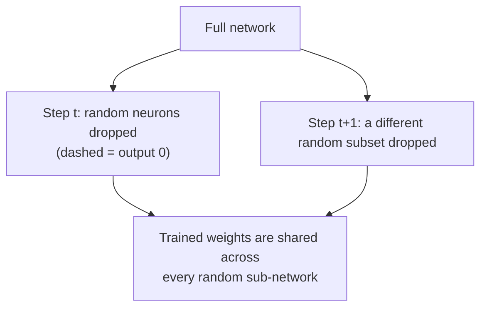

## What you'll learn

- L1 and L2 regularization on a layer's weights, and `functools.partial` to
  avoid repeating the same arguments everywhere
- Dropout — randomly ignoring neurons during training — and why it works
- MC Dropout, which turns a trained Dropout model into an uncertainty estimator
  for free
- max-norm regularization, which rescales weights after every training step

## Why regularize at all?

Deep nets have "an incredible amount of freedom": tens of thousands of
parameters, sometimes millions. That's exactly what lets them fit complex
datasets — and exactly what lets them overfit the training set instead of
learning something that generalizes. You already know one of the best fixes from
Chapter 10's toolkit: **early stopping**. Batch Normalization also acts as a mild
regularizer as a side effect. This page covers three more dedicated techniques.

## Reducing model size — the simplest regularizer

Before reaching for L1/L2 penalties or Dropout, Chollet's suggestion is to try
the cheapest fix first: **make the model smaller**. A model with fewer
parameters has less room to simply memorize the training set, so to reduce its
loss it's forced to learn compressed, genuinely predictive patterns instead —
exactly what generalizes to new data. There's no formula for the "right" size;
the workflow is to start small and add capacity only until validation loss
stops improving.

```python title="Same architecture, three capacities" showLineNumbers{1}
import tensorflow as tf

def build(units):
    return tf.keras.models.Sequential([
        tf.keras.layers.Dense(units, activation="relu", input_shape=(20,)),
        tf.keras.layers.Dense(units, activation="relu"),
        tf.keras.layers.Dense(1, activation="sigmoid"),
    ])

small_model = build(units=4)     # underfits later to overfit, but recovers slower
reference_model = build(units=16)
large_model = build(units=512)   # overfits almost immediately, noisy val loss

for name, model in [("small", small_model), ("reference", reference_model), ("large", large_model)]:
    print(name, "params:", model.count_params())
```

A model that's too small won't overfit at all — it'll plateau and stay there,
which is itself useful information: it tells you to add capacity back before
you reach for any of the regularizers below.

## L1 and L2 regularization

Just like Ridge and Lasso for linear models, you can penalize a layer's
connection weights directly. L2 regularization shrinks weights toward zero
smoothly; L1 pushes many of them *all the way* to zero, giving you a sparse
model.

```python title="L2-regularized Dense layer" showLineNumbers{1}
import tensorflow as tf

layer = tf.keras.layers.Dense(
    100,
    activation="elu",
    kernel_initializer="he_normal",
    kernel_regularizer=tf.keras.regularizers.l2(0.01),
)
```

Because you'll typically want the same activation, initializer, and regularizer
on every hidden layer, `functools.partial` saves you from repeating yourself
(and from typos that only show up on the third layer):

```python title="functools.partial to avoid repetition" showLineNumbers{1}
import tensorflow as tf
from functools import partial

RegularizedDense = partial(
    tf.keras.layers.Dense,
    activation="elu",
    kernel_initializer="he_normal",
    kernel_regularizer=tf.keras.regularizers.l2(0.01),
)

model = tf.keras.models.Sequential([
    tf.keras.layers.Flatten(input_shape=[28, 28]),
    RegularizedDense(300),
    RegularizedDense(100),
    RegularizedDense(10, activation="softmax", kernel_initializer="glorot_uniform"),
])
```

## Dropout

**Dropout** is one of the most popular — and most surprising — regularizers for
deep nets. At every training step, every neuron (including inputs, but never
outputs) has a probability `p` of being temporarily ignored entirely for that
step. The dropout rate `p` is usually `10%–50%`.



It sounds destructive, but it works because no neuron can rely on any single
neighbor being present — each one has to become independently useful, which
produces a network that's less sensitive to noise and generalizes better. Keras
handles the training/prediction asymmetry (scaling outputs by the keep
probability) for you automatically:

```python title="Dropout before every Dense layer" showLineNumbers{1}
import tensorflow as tf

model = tf.keras.models.Sequential([
    tf.keras.layers.Flatten(input_shape=[28, 28]),
    tf.keras.layers.Dropout(rate=0.2),
    tf.keras.layers.Dense(300, activation="elu", kernel_initializer="he_normal"),
    tf.keras.layers.Dropout(rate=0.2),
    tf.keras.layers.Dense(100, activation="elu", kernel_initializer="he_normal"),
    tf.keras.layers.Dropout(rate=0.2),
    tf.keras.layers.Dense(10, activation="softmax"),
])
```

Since Dropout is only active during training, always compare training loss
*without* dropout (measured after training) against the validation loss — with
dropout on, a model can look like it isn't overfitting even when it is.

:::tip[From the book]
Chollet traces Dropout back to Geoffrey Hinton's own explanation of where the
idea came from: "I went to my bank. The tellers kept changing and I asked one
of them why. He said he didn't know but they got moved around a lot. I figured
it must be because it would require cooperation between employees to
successfully defraud the bank. This made me realize that randomly removing a
different subset of neurons on each example would prevent conspiracies and
thus reduce overfitting." Dropout's job is to inject just enough noise to break
up the "conspiracies" — coincidental patterns — that a network would otherwise
happily memorize.
:::

## MC Dropout

Yarin Gal and Zoubin Ghahramani's trick: leave dropout **on** at prediction time
and run the same input through the model many times. Because dropout is random,
every pass gives a slightly different prediction — average them, and you get
both a better point estimate *and* a genuine uncertainty measure (the standard
deviation across passes), all without retraining anything.

```python title="MC Dropout: uncertainty from a trained model" showLineNumbers{1}
import numpy as np

# training=True keeps Dropout active even though we are predicting
y_probas = np.stack([model(X_test_scaled, training=True) for _ in range(100)])
y_proba = y_probas.mean(axis=0)   # the MC Dropout point estimate
y_std = y_probas.std(axis=0)      # how uncertain each prediction is
```

If other layers (like BatchNormalization) also behave differently in
training vs. prediction, forcing `training=True` globally isn't safe — subclass
`Dropout` instead so *only* dropout is forced on:

```python title="An MCDropout layer that is always active" showLineNumbers{1}
import tensorflow as tf

class MCDropout(tf.keras.layers.Dropout):
    def call(self, inputs):
        return super().call(inputs, training=True)
```

## Max-norm regularization

Instead of adding a penalty term to the loss, **max-norm regularization**
rescales a neuron's incoming weight vector after every training step, so that
`‖w‖₂ ≤ r`. Smaller `r` means stronger regularization, and it can also help
tame unstable gradients even without Batch Normalization.

```python title="Max-norm constraint on a Dense layer" showLineNumbers{1}
import tensorflow as tf

layer = tf.keras.layers.Dense(
    100,
    activation="elu",
    kernel_initializer="he_normal",
    kernel_constraint=tf.keras.constraints.max_norm(1.0),
)
```

## Visualize it

Each training step, Dropout silently switches a random subset of neurons off
(shown dimmed below) — click to re-roll which ones are dropped:

```p5 title="Dropout randomly disables neurons each step" desc="A dense layer where a random subset of neurons blink off (dimmed) at independent, staggered training steps; click to resample every neuron at once." height="280"
let neurons = [];
const p = 0.4; // dropout rate

function layout() {
  neurons = [];
  for (let i = 0; i < 10; i++) {
    const dropped = random() < p;
    neurons.push({
      y: 30 + i * 24,
      dropped,
      render: dropped ? 1 : 0,       // eased 0..1 blend toward the target state
      nextToggle: floor(random(35, 110)), // each neuron re-rolls on its own clock
    });
  }
}
function setup() {
  createCanvas(600, 280);
  textFont("monospace");
  textAlign(CENTER, CENTER);
  layout();
}
function draw() {
  background(13, 17, 23);
  const inX = 130, outX = 470, midY = 140;
  noStroke();
  fill(200);
  textSize(12);
  text("input", inX, 20);
  text("hidden layer (rate=0.4)", (inX + outX) / 2, 20);
  text("output", outX, 20);

  for (const n of neurons) {
    n.nextToggle--;
    if (n.nextToggle <= 0) {
      n.dropped = random() < p;
      n.nextToggle = floor(random(35, 110));
    }
    n.render = lerp(n.render, n.dropped ? 1 : 0, 0.1);
  }

  for (const n of neurons) {
    const dropCol = lerpColor(color(120, 200, 120, 160), color(90, 60, 60, 80), n.render);
    stroke(dropCol);
    strokeWeight(1.2);
    line(inX + 20, midY, inX + 90, n.y);
    line(outX - 90, n.y, outX - 20, midY);
  }
  noStroke();
  fill(75, 139, 190);
  ellipse(inX, midY, 30, 30);
  fill(75, 139, 190);
  ellipse(outX, midY, 30, 30);

  for (const n of neurons) {
    const bodyCol = lerpColor(color(120, 200, 120), color(90, 50, 50), n.render);
    const r = lerp(26, 22, n.render);
    fill(bodyCol);
    ellipse(inX + 90, n.y, r, r);
    if (n.render > 0.5) {
      fill(200, 120, 120, (n.render - 0.5) * 2 * 255);
      textSize(10);
      text("0", inX + 90, n.y);
    }
  }
}
function mousePressed() { layout(); }
```

:::tip[From the book]
Géron's analogy for why dropout works so well: imagine a company where every
employee tosses a coin each morning to decide whether to show up. No single
person could ever be the only one who knows how to run the coffee machine — that
knowledge has to spread across the whole team. Dropout forces neurons into the
same situation: none of them can co-adapt and lean on a few specific neighbors,
so the whole network ends up more robust.
:::

import DataCampExercise from "../../../../components/DataCampExercise.astro";

## 🧪 Try It Yourself

### Exercise 1 – L2-Regularize a Dense Layer

<DataCampExercise
  lang="python"
  hint={`Pass \`kernel_regularizer=tf.keras.regularizers.l2(0.01)\` when creating the layer.`}
  code={`# Task: Exercise 1 - L2-Regularize a Dense Layer
import tensorflow as tf

layer = tf.keras.layers.Dense(
    64, activation="elu",
    kernel_regularizer=tf.keras.regularizers.___(0.01),   # replace ___ with l2
)
print(layer.kernel_regularizer.__class__.__name__)

# ── Expected Output ───────────────────────────────────────────
# L2
# ──────────────────────────────────────────────────────────────`}
  solution={`import tensorflow as tf

layer = tf.keras.layers.Dense(
    64, activation="elu",
    kernel_regularizer=tf.keras.regularizers.l2(0.01),
)
print(layer.kernel_regularizer.__class__.__name__)`}
  sct={`test_output_contains("L2")
success_msg("L2 regularization applied to the layer's weights!")`}
  height={150}
/>

### Exercise 2 – Add a Dropout Layer

<DataCampExercise
  lang="python"
  hint={`\`tf.keras.layers.Dropout(rate=0.2)\` randomly zeroes ~20% of its inputs during training.`}
  code={`# Task: Exercise 2 - Add a Dropout Layer
import tensorflow as tf

model = tf.keras.models.Sequential([
    tf.keras.layers.Flatten(input_shape=[28, 28]),
    tf.keras.layers.___(rate=0.2),   # replace ___ with Dropout
    tf.keras.layers.Dense(300, activation="elu"),
])
print(model.layers[1].rate)

# ── Expected Output ───────────────────────────────────────────
# 0.2
# ──────────────────────────────────────────────────────────────`}
  solution={`import tensorflow as tf

model = tf.keras.models.Sequential([
    tf.keras.layers.Flatten(input_shape=[28, 28]),
    tf.keras.layers.Dropout(rate=0.2),
    tf.keras.layers.Dense(300, activation="elu"),
])
print(model.layers[1].rate)`}
  sct={`test_output_contains("0.2")
success_msg("Dropout layer added with a 20% rate!")`}
  height={150}
/>

### Exercise 3 – Run MC Dropout Predictions

<DataCampExercise
  lang="python"
  hint={`Call the model with \`training=True\` inside a loop, then average the stacked predictions with \`.mean(axis=0)\`.`}
  code={`# Task: Exercise 3 - Run MC Dropout Predictions
import numpy as np
import tensorflow as tf

model = tf.keras.models.Sequential([
    tf.keras.layers.Dense(20, activation="relu", input_shape=(5,)),
    tf.keras.layers.Dropout(0.5),
    tf.keras.layers.Dense(1),
])

X = np.random.rand(4, 5).astype("float32")
y_probas = np.stack([model(X, ___=True) for _ in range(50)])   # replace ___ with training
y_proba = y_probas.mean(axis=0)
print("shape:", y_proba.shape)

# ── Expected Output ───────────────────────────────────────────
# shape: (4, 1)
# ──────────────────────────────────────────────────────────────`}
  solution={`import numpy as np
import tensorflow as tf

model = tf.keras.models.Sequential([
    tf.keras.layers.Dense(20, activation="relu", input_shape=(5,)),
    tf.keras.layers.Dropout(0.5),
    tf.keras.layers.Dense(1),
])

X = np.random.rand(4, 5).astype("float32")
y_probas = np.stack([model(X, training=True) for _ in range(50)])
y_proba = y_probas.mean(axis=0)
print("shape:", y_proba.shape)`}
  sct={`test_output_contains("shape: (4, 1)")
success_msg("MC Dropout predictions averaged successfully!")`}
  height={165}
/>

## Next

Continue to **Learning Rate Scheduling** — the last lever for training deep
nets faster and reaching a better final solution.
