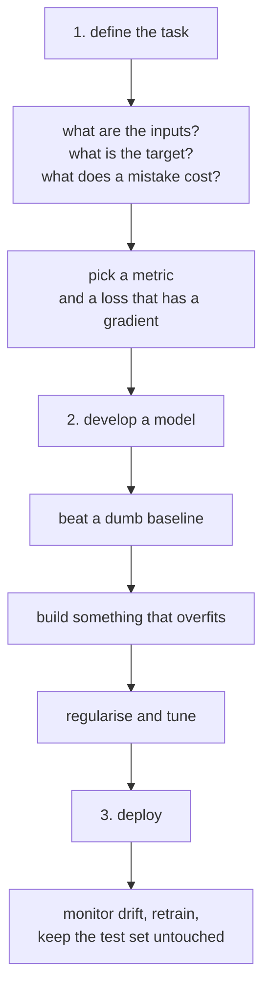

Every technique in this phase was measured in isolation. A real project needs an
order to apply them in, and that order matters more than the techniques do: most
failed projects fail at step 1, on a task that was never framed properly or a
baseline that was never measured. This page runs the whole workflow on one dataset
and reports what each step bought.

## What you'll learn

- A five-rung baseline ladder measured end to end: **0.1015 → 0.8400 → 0.8580 →
  0.8595 → 0.8635**.
- Why the 26× parameter jump from rung 3 to rung 4 bought **0.0015**.
- The overfit-then-regularise step with numbers: gaps of **0.0221, 0.0981 and
  0.0516** for three capacities.
- The one-batch smoke test: **32 rows memorised to accuracy 1.0000** with 256
  units, **0.8750** with 4.
- The sanity checks worth running before any model exists.
- Which last layer and loss to pair with each kind of target.

## Step 1: define the task

Before code: what is predicted, from what, and what does being wrong cost?



The choice of last layer and loss is mechanical once the target is described:

| Target | Last layer | Loss | Metric to report |
| --- | --- | --- | --- |
| binary | `Dense(1, "sigmoid")` | `binary_crossentropy` | accuracy, or precision/recall |
| multiclass, one label | `Dense(K)` + `from_logits=True` | `sparse_categorical_crossentropy` | accuracy and macro recall |
| multiclass, many labels | `Dense(K, "sigmoid")` | `binary_crossentropy` | per-label F1 |
| continuous | `Dense(1)` | `mse` or `huber` | MAE, in the target's units |
| bounded continuous [0,1] | `Dense(1, "sigmoid")` | `mse` or `binary_crossentropy` | MAE |

The reasoning behind each pairing — and the `from_logits` trap — is on the [loss
functions](/deep-learning/phase-02---training-deep-neural-networks/loss-functions---choosing-what-to-minimise/)
page.

### Sanity checks before any model exists

```python title="Five minutes that save a day"
print(x.shape, x.dtype, x.min(), x.max(), x.mean())
print(np.isnan(x).sum(), np.isinf(x).sum())
print(np.bincount(y))                                    # class balance
print(len(x) - len(np.unique(x, axis=0)))                # duplicate rows
```

Measured on 8,000 Fashion-MNIST rows: range [0.0000, 1.0000], mean 0.2851, zero
NaNs, class counts from **747 to 860** — near-balanced, so the majority baseline is
**0.1075** — and **0 duplicate rows**. Every one of those four numbers changes what
you do next. A class count of 7,900 against 100 changes the metric; duplicate rows
change the split, as the [evaluation
page](/deep-learning/phase-02---training-deep-neural-networks/evaluating-models---generalization-and-validation/)
measured at 0.9600 accuracy on pure noise.

## Step 2a: beat a dumb baseline

Each rung has to justify itself against the one below. Fashion-MNIST, 8,000
training rows, one held-out test set, everything measured:

<Figure
  src="/images/dl/phase-02-training/universal-workflow/baseline-ladder"
  alt="Bar chart of five rungs: majority class at 0.1015, logistic regression at 0.8400, a 32-unit MLP at 0.8580, a 512-512 MLP at 0.8595, and the same wide model with dropout and early stopping at 0.8635. Parameter counts and training seconds are annotated on each bar."
  title="Each rung has to beat the one below it to be worth using"
  caption="The first two rungs cover 0.7385 of the total climb; everything after them adds 0.0235 between them. The 512-512 model has 26 times the parameters of the 32-unit model and beat it by 0.0015 — inside noise. Only after adding dropout and early stopping does the wide model earn its size, at 0.8635."
/>

| Rung | Test accuracy | Parameters | Seconds |
| --- | --- | --- | --- |
| majority class | **0.1015** | 0 | 0.00 |
| logistic regression | **0.8400** | 7,850 | 21.57 |
| MLP, 32 units | 0.8580 | 25,450 | 15.27 |
| MLP, 512-512 | 0.8595 | **669,706** | 42.26 |
| 512-512 + dropout 0.4 + early stopping | **0.8635** | 669,706 | 34.56 |

Read the ladder as a cost-benefit table, not a leaderboard:

- **Rung 2 does most of the work.** Logistic regression covers 0.7385 of the 0.7620
  total climb, with 7,850 parameters and no tuning.
- **Rung 4 is not worth its price on its own.** 26× the parameters of rung 3 for
  0.0015 accuracy — smaller than the noise on this test set.
- **Rung 5 is where the extra capacity pays**, and only because it is regularised:
  0.8635, and it trained *faster* than rung 4 because early stopping cut it short.
- **The whole neural network contribution is 0.0235** over logistic regression. That
  is real and it is small, and knowing the size of it is the point of building the
  ladder.

## Step 2b: build something that overfits, then push back

The recommended order is deliberately counter-intuitive: **first make the model bad
in the right direction.** A model that cannot overfit has no headroom to
regularise, and you cannot tell an underfitting model from a badly tuned one.

<Figure
  src="/images/dl/phase-02-training/universal-workflow/overfit-then-regularise"
  alt="Two panels. Left: training (dashed) and validation (solid) accuracy for three models — an 8-unit model whose curves nearly coincide, a 512-512 model whose training curve climbs to 0.96 while validation flattens at 0.86, and a dropout model in between. Right: the training-minus-validation gap per epoch, rising to about 0.10 for the wide model, 0.05 with dropout, and staying near 0.02 for the small one."
  title="Three capacities, one dataset"
  caption="The 8-unit model has a gap of 0.0221 and cannot do better — it is underfitting, and no regulariser helps. The 512-512 model reaches a gap of 0.0981, which is the signal that there is headroom to trade. Adding dropout 0.4 cuts the gap to 0.0516 and produces the best validation accuracy of the three at its best epoch: 0.8710."
/>

| Model | Train accuracy | Val accuracy | Gap | Best val accuracy |
| --- | --- | --- | --- | --- |
| 8 units (too small) | 0.8656 | 0.8435 | **0.0221** | 0.8435 |
| 512-512 (overfits) | 0.9576 | 0.8595 | **0.0981** | 0.8605 |
| 512-512 + dropout 0.4 | 0.9086 | 0.8570 | 0.0516 | **0.8710** |

The 8-unit row is the important one. Its gap is *small*, which looks healthy and is
not: both numbers are low, and no amount of dropout, weight decay or scheduling will
raise them. **A small gap is only good news when the scores are high.**

Note also that the regularised model's *final* validation accuracy (0.8570) is
slightly below the unregularised one's (0.8595), while its *best* is clearly higher
(0.8710 against 0.8605). With dropout the run is noisier epoch to epoch, so the
best-epoch weights are what you want — which is exactly what
[`EarlyStopping(restore_best_weights=True)`](/deep-learning/phase-02---training-deep-neural-networks/callbacks-and-tensorboard/)
gives you.

### The one-batch smoke test

Before worrying about data, architecture or hyperparameters, check that the model
can memorise a single batch. Take 32 rows, train for 200 epochs, and demand
near-zero loss:

| Hidden units | Final training loss on 32 rows | Accuracy |
| --- | --- | --- |
| 4 | 0.402435 | **0.8750** |
| 256 | **0.000253** | **1.0000** |

The 256-unit model memorises 32 rows perfectly, as it must — 200,000 parameters
against 32 examples. **If your model cannot do this, the problem is a bug**: a
mislabelled target, a broken preprocessing step, a frozen layer, a learning rate of
zero. Data volume, regularisation and architecture are all irrelevant until this
test passes.

The 4-unit model's failure is informative in the other direction: it is not a bug,
it is a capacity limit, and it stalls at 0.8750 on 32 rows.

```python title="The whole test"
model.fit(x_train[:32], y_train[:32], epochs=200, batch_size=32)
# demand a loss near zero. If you cannot get it, stop and find the bug.
```

## What "scale up until you overfit" looks like

The instruction is precise but the number is not obvious, so here is the sweep: six model
sizes spanning 146×, no regularisation, everything else held fixed.

<Figure
  src="/images/dl/phase-02-training/universal-workflow/capacity-frontier"
  alt="Top: training and validation accuracy against parameter count on a log axis. Training accuracy climbs steadily from 0.8929 to 0.9635 while validation accuracy stays between 0.8365 and 0.8685. Bottom: the gap between them, rising from 0.0394 at 12,730 parameters to a peak of 0.1123 at 203,530 and settling near 0.095."
  title="Fashion-MNIST, 8,000 rows, 30 epochs, no regularisation"
  caption="Read the two panels together. Training accuracy rises monotonically — the model is absorbing more of the training set at every size, exactly as intended. Validation accuracy does not: it moves 0.0150 in total across a 146x range of parameters, and not monotonically. The gap panel is the signal the instruction is pointing at: it nearly triples between 12,730 and 203,530 parameters, which is where this model starts memorising rather than learning."
/>

| Model | Parameters | Train | Validation | Best validation | Gap |
| --- | --- | --- | --- | --- | --- |
| 16 | 12,730 | 0.8929 | 0.8535 | 0.8540 | 0.0394 |
| 64 | 50,890 | 0.9162 | 0.8580 | 0.8600 | 0.0583 |
| 256 | 203,530 | 0.9488 | 0.8365 | 0.8540 | **0.1123** |
| 256 × 256 | 269,322 | 0.9548 | 0.8500 | 0.8685 | 0.1047 |
| 512 × 512 | 669,706 | 0.9576 | 0.8595 | 0.8605 | 0.0981 |
| 1024 × 1024 | 1,863,690 | **0.9635** | **0.8685** | **0.8725** | 0.0950 |

Two things worth taking from this that the instruction alone does not tell you.

**Overfitting is not the same as getting worse.** The largest model has both the biggest
training–validation gap *and* the best validation accuracy. "Overfitting" describes the
gap, not the outcome; a model can memorise heavily and still generalise best of the ones
you tried.

**146× the parameters bought 0.0150 of validation accuracy.** If the search had stopped
at 64 units it would have given up almost nothing and trained in a fraction of the time.
The value of this sweep is knowing that — which you only know by running it.

## Step 3: deploy, then keep measuring

```python title="One evaluation, once, at the end"
loss, accuracy = model.evaluate(x_test, y_test)   # the first and only time
```

Three things belong in this step, and only the first is about modelling:

- **Evaluate the test set exactly once.** Every earlier number was used to make a
  decision and is therefore optimistic — measured on the [IMDB
  page](/deep-learning/phase-01---neural-network-foundations/first-example-classifying-movie-reviews-imdb-binary/)
  as 0.8882 validation against 0.8792 test.
- **Save the whole model, not the weights.** `model.save("name.keras")` carries the
  architecture, the weights and the non-trainable state that
  [BatchNormalization](/deep-learning/phase-02---training-deep-neural-networks/batch-normalization/)
  layers depend on. A round trip reproduces predictions to 0.00e+00.
- **Expect the input distribution to move.** The model is a fixed function; the
  world is not. Log the input statistics you checked in step 1 and compare them
  periodically against the training set. A shifted mean is your early warning.

```p5 title="Walk the ladder" desc="The five measured rungs. Click one to see its accuracy against the rung below it, its parameter count, and whether the gain justified the cost." height="330"
const RUNGS = [
  { name: "majority class", acc: 0.1015, params: 0, seconds: 0.0 },
  { name: "logistic regression", acc: 0.8400, params: 7850, seconds: 21.57 },
  { name: "MLP 32 units", acc: 0.8580, params: 25450, seconds: 15.27 },
  { name: "MLP 512-512", acc: 0.8595, params: 669706, seconds: 42.26 },
  { name: "512-512 + dropout + early stop", acc: 0.8635, params: 669706,
    seconds: 34.56 },
];
let picked = 1;
function setup() {
  createCanvas(600, 330);
  textFont("monospace");
}
function draw() {
  background(13, 17, 23);
  noStroke();
  fill(230);
  textSize(12);
  textAlign(LEFT, TOP);
  text("click a rung", 44, 22);
  for (let i = 0; i < RUNGS.length; i++) {
    const y = 46 + i * 34;
    const on = i === picked;
    fill(on ? 46 : 26, on ? 96 : 32, on ? 140 : 40);
    rect(44, y, 512, 28, 3);
    const width = RUNGS[i].acc * 300;
    fill(on ? 120 : 60, on ? 200 : 90, on ? 120 : 70);
    rect(240, y + 6, width, 16, 2);
    fill(on ? 245 : 140);
    textSize(11);
    textAlign(LEFT, CENTER);
    text(RUNGS[i].name, 52, y + 14);
    fill(on ? 255 : 150, on ? 211 : 150, on ? 67 : 150);
    text(RUNGS[i].acc.toFixed(4), 548 - 44, y + 14);
  }
  const current = RUNGS[picked];
  const below = RUNGS[Math.max(picked - 1, 0)];
  const gain = current.acc - below.acc;
  const extra = current.params - below.params;
  fill(230);
  textSize(12);
  textAlign(LEFT, TOP);
  text(current.name, 44, 228);
  fill(150);
  textSize(11);
  text("parameters " + current.params.toLocaleString()
    + "     training " + current.seconds.toFixed(1) + "s", 44, 248);
  if (picked === 0) {
    fill(150);
    text("the floor: predicting one class for everything", 44, 268);
  } else {
    fill(gain > 0.01 ? 120 : 230, gain > 0.01 ? 200 : 110,
         gain > 0.01 ? 120 : 110);
    text("against the rung below: " + (gain >= 0 ? "+" : "")
      + gain.toFixed(4) + " accuracy for "
      + (extra >= 0 ? "+" : "") + extra.toLocaleString() + " parameters",
      44, 268);
    fill(150);
    text(gain > 0.01 ? "worth the cost" :
      "inside the noise on a 2,000-row test set", 44, 288);
  }
  fill(120);
  textSize(10);
  text("bars are accuracy from 0 to 1", 240, 310);
}
function mousePressed() {
  for (let i = 0; i < RUNGS.length; i++) {
    const y = 46 + i * 34;
    if (mouseY > y && mouseY < y + 28 && mouseX > 44 && mouseX < 556) picked = i;
  }
}
```

```p5 title="The measured table, ranked" desc="Click a column to rank every row by it. The bars are that column's values and the highest and lowest are computed from the numbers, not written in." height="306"
let metric = 0;
const COLUMNS = ["Parameters", "Train", "Validation", "Best validation"];
const ROWS = [
  ["16", 12730, 0.8929, 0.8535, 0.854],
  ["64", 50890, 0.9162, 0.858, 0.86],
  ["256", 203530, 0.9488, 0.8365, 0.854],
  ["256 x 256", 269322, 0.9548, 0.85, 0.8685],
  ["512 x 512", 669706, 0.9576, 0.8595, 0.8605],
  ["1024 x 1024", 1863690, 0.9635, 0.8685, 0.8725]
];
function setup() {
  createCanvas(620, 306);
  textFont("monospace");
}
function fmt(v) {
  if (v === 0) { return "0"; }
  const a = Math.abs(v);
  if (a >= 1000 || a < 0.001) { return v.toExponential(2); }
  if (a >= 100) { return v.toFixed(1); }
  return v.toFixed(4);
}
function draw() {
  background(13, 17, 23);
  noStroke();
  fill(230);
  textSize(12);
  textAlign(LEFT, TOP);
  text("The Universal Workflow of Machine ", 26, 16);
  let x = 26;
  for (let i = 0; i < COLUMNS.length; i++) {
    const w = COLUMNS[i].length * 6.6 + 16;
    if (i === metric) { fill(255, 211, 67); } else { fill(48, 56, 68); }
    rect(x, 40, w, 22, 4);
    if (i === metric) { fill(13, 17, 23); } else { fill(180); }
    textSize(9);
    text(COLUMNS[i], x + 8, 47);
    x += w + 6;
    if (x > 500) { break; }
  }
  const values = ROWS.map((r) => r[metric + 1]);
  const lo = Math.min(...values);
  const hi = Math.max(...values);
  const span = hi - lo === 0 ? 1 : hi - lo;
  const order = ROWS.slice().sort((a, b) => b[metric + 1] - a[metric + 1]);
  for (let i = 0; i < order.length; i++) {
    const y = 78 + i * 26;
    const v = order[i][metric + 1];
    fill(160);
    textSize(9);
    text(order[i][0], 26, y + 5);
    fill(34, 40, 50);
    rect(230, y, 280, 18, 3);
    const frac = (v - lo) / span;
    if (v === hi) { fill(126, 192, 143); }
    else if (v === lo) { fill(224, 108, 117); }
    else { fill(107, 169, 221); }
    rect(230, y, Math.max(frac * 280, 3), 18, 3);
    fill(225);
    textSize(9);
    text(fmt(v), 518, y + 5);
  }
  const top = order[0];
  const bottom = order[order.length - 1];
  fill(150);
  textSize(9);
  const base = 78 + order.length * 26 + 8;
  text("highest " + COLUMNS[metric] + ": " + top[0] + " at " + fmt(top[1]),
       26, base);
  text("lowest  " + COLUMNS[metric] + ": " + bottom[0] + " at "
       + fmt(bottom[1]), 26, base + 14);
  text("bars are scaled within the chosen column - lowest is not zero", 26,
       base + 30);
}
function mousePressed() {
  let x = 26;
  for (let i = 0; i < COLUMNS.length; i++) {
    const w = COLUMNS[i].length * 6.6 + 16;
    if (mouseX > x && mouseX < x + w && mouseY > 40 && mouseY < 62) {
      metric = i;
    }
    x += w + 6;
  }
}
```

## Pitfalls

- **Skipping the dumb baseline.** Logistic regression covered 0.7385 of the total
  climb here. Without it, 0.8635 has no meaning.
- **Starting from a big model.** Rung 4's 669,706 parameters beat rung 3's 25,450 by
  0.0015. Start small, grow only when the small model is clearly the limit.
- **Regularising before overfitting.** With a 0.0221 gap there is nothing to trade;
  the 8-unit model needed capacity, not dropout.
- **Reading a small gap as healthy.** It is only healthy when both scores are high.
- **Skipping the one-batch smoke test.** A model that cannot memorise 32 rows has a
  bug, and no amount of data or tuning will fix it.
- **Choosing a metric that has no gradient.** Train on a differentiable surrogate,
  report the metric you care about, and keep the two distinct.
- **Touching the test set more than once.** Every look costs you the guarantee it
  exists to provide.
- **Assuming the deployed distribution is the training distribution.** Log the
  step-1 statistics and re-check them on live data.

## Recap

- Step 1 is framing: inputs, target, cost of error, then a mechanical choice of last
  layer and loss. Four cheap sanity checks come before any model.
- The measured ladder ran 0.1015 → 0.8400 → 0.8580 → 0.8595 → 0.8635, with logistic
  regression alone covering 0.7385 of the climb.
- Going from 25,450 to 669,706 parameters bought 0.0015 unregularised, and 0.0055
  once dropout and early stopping were added.
- Overfit first: the 8-unit model's 0.0221 gap was underfitting, the 512-512 model's
  0.0981 gap was the headroom, and dropout converted it into a best-epoch 0.8710.
- The one-batch smoke test: 256 units memorised 32 rows to loss 0.000253 and
  accuracy 1.0000; 4 units stalled at 0.8750. Failing it means a bug.
- Deployment is one test-set evaluation, a full `model.save`, and ongoing comparison
  of live input statistics against the training set.

## Next

The measurement discipline this page describes is what the rest of the phase
supplies the tools for:
[Evaluating Models: Generalization and
Validation](/deep-learning/phase-02---training-deep-neural-networks/evaluating-models---generalization-and-validation/)
covers how to make each rung's number trustworthy in the first place.

<Quiz
  questions={[
    {
      q: "Logistic regression scored 0.8400 and the final tuned network 0.8635 on the same data. Why build the logistic model at all?",
      options: [
        "As a fallback in case the network fails to train",
        "Because it establishes the size of the network's contribution — 0.0235 — which is the only way to judge whether the extra parameters, training time and complexity are worth carrying",
        "Because linear models generalise better",
        "It is only needed when the dataset is small",
      ],
      answer: 1,
      explain: "0.8635 sounds impressive alone. Against 0.8400 from 7,850 untuned parameters, it is a modest and quantified gain.",
    },
    {
      q: "A model reaches 0.8656 training accuracy and 0.8435 validation accuracy — a gap of only 0.0221. What should you do?",
      options: [
        "Nothing: a small gap means the model generalises well",
        "Add capacity — both numbers are low, so the model is underfitting and there is nothing for a regulariser to trade against",
        "Add dropout to close the gap further",
        "Collect more training data",
      ],
      answer: 1,
      explain: "A small gap is only good news when the scores are high. This is why the workflow says overfit first, then push back.",
    },
    {
      q: "Your model cannot get below 1.8 training loss on a single batch of 32 rows after 200 epochs. What is the most likely cause?",
      options: [
        "The dataset is too small overall",
        "A bug — mislabelled targets, broken preprocessing, a frozen layer or a zero learning rate — because a model with enough parameters must be able to memorise 32 examples",
        "The model needs more regularisation",
        "The batch size is too small",
      ],
      answer: 1,
      explain: "Measured: 256 units reached loss 0.000253 and accuracy 1.0000 on 32 rows. Failing that test is a bug, not a data or tuning problem.",
    },
    {
      q: "Rung 4 (669,706 parameters) beat rung 3 (25,450 parameters) by 0.0015 accuracy. What is the right response?",
      options: [
        "Ship rung 4 — it has the higher score",
        "Treat the difference as noise on a 2,000-row test set and keep the smaller model, unless regularisation turns the extra capacity into a real gain, as it did at rung 5",
        "Increase the model size further",
        "Rerun rung 3 with a different seed until it wins",
      ],
      answer: 1,
      explain: "Rung 5 is the same architecture as rung 4 with dropout and early stopping, and it reached 0.8635 — the capacity only paid once it was constrained.",
    },
    {
      q: "Why is the last-layer-and-loss choice described as mechanical rather than a design decision?",
      options: [
        "Because Keras picks it automatically",
        "Because it follows from the target's type: a bounded probability needs sigmoid and cross-entropy, one-of-K needs softmax, an unbounded number needs a linear output — the pairings exist so the gradient behaves",
        "Because any loss works if you train long enough",
        "Because the metric and the loss are always the same function",
      ],
      answer: 1,
      explain: "The sigmoid-plus-cross-entropy gradient reduces to (prediction - target). Mismatching the pairing removes that cancellation and the model stops learning from confident errors.",
    },
  ]}
/>

## 🧪 Try It Yourself

<DataCampExercise
  lang="python"
  hint={`DummyClassifier-style baseline first: always predict the most common training label. Each later rung has to beat the one below it by more than the noise.`}
  code={`# Task: Exercise 1 - Build the baseline ladder
import numpy as np

def softmax(z):
    p = np.exp(z - z.max(axis=1, keepdims=True))
    return p / p.sum(axis=1, keepdims=True)


def train_net(x, y, units=None, dropout=0.0, epochs=200, lr=0.2, seed=0):
    """units=None is plain softmax regression; otherwise one ReLU hidden layer."""
    r = np.random.RandomState(seed)
    k = int(y.max()) + 1
    onehot = np.eye(k)[y]
    if units is None:
        W = np.zeros((x.shape[1], k))
        for _ in range(epochs):
            W -= lr * x.T @ (softmax(x @ W) - onehot) / len(y)
        return lambda q: softmax(q @ W)
    W1 = r.randn(x.shape[1], units) * 0.1
    W2 = r.randn(units, k) * 0.1
    for _ in range(epochs):
        pre = x @ W1
        h = np.maximum(pre, 0)
        mask = 1.0
        if dropout:
            mask = (r.rand(*h.shape) > dropout) / (1 - dropout)
            h = h * mask
        dz = (softmax(h @ W2) - onehot) / len(y)
        dh = (dz @ W2.T) * mask * (pre > 0)
        W2 -= lr * h.T @ dz
        W1 -= lr * x.T @ dh
    return lambda q: softmax(np.maximum(q @ W1, 0) @ W2)


def accuracy(model, x, y):
    return float((model(x).argmax(axis=1) == y).mean())


rng = np.random.RandomState(0)
K, D = 4, 20
centres = rng.randn(K, D) * 0.5


def make(n):
    y = rng.randint(0, K, n)
    return centres[y] + rng.randn(n, D), y


x_train, y_train = make(600)
x_test, y_test = make(1000)

majority = np.bincount(y_train).argmax()
floor = float((y_test == ___).mean())   # replace ___ with majority
print("majority class : accuracy is near 1/4:", bool(abs(floor - 1 / K) < 0.06))

logistic = accuracy(train_net(x_train, y_train), x_test, y_test)
print("logistic regression beats the majority class by 0.3 or more:", logistic > floor + 0.3)

small = accuracy(train_net(x_train, y_train, units=4), x_test, y_test)
big = accuracy(train_net(x_train, y_train, units=128), x_test, y_test)
print("the networks are within 0.1 of logistic regression:", max(small, big) - logistic < 0.1)
print("every rung beats the majority floor:", min(logistic, small, big) > floor)
print("logistic regression alone covers most of the climb; the network's whole")
print("contribution is small next to it")`}
  solution={`import numpy as np

def softmax(z):
    p = np.exp(z - z.max(axis=1, keepdims=True))
    return p / p.sum(axis=1, keepdims=True)


def train_net(x, y, units=None, dropout=0.0, epochs=200, lr=0.2, seed=0):
    """units=None is plain softmax regression; otherwise one ReLU hidden layer."""
    r = np.random.RandomState(seed)
    k = int(y.max()) + 1
    onehot = np.eye(k)[y]
    if units is None:
        W = np.zeros((x.shape[1], k))
        for _ in range(epochs):
            W -= lr * x.T @ (softmax(x @ W) - onehot) / len(y)
        return lambda q: softmax(q @ W)
    W1 = r.randn(x.shape[1], units) * 0.1
    W2 = r.randn(units, k) * 0.1
    for _ in range(epochs):
        pre = x @ W1
        h = np.maximum(pre, 0)
        mask = 1.0
        if dropout:
            mask = (r.rand(*h.shape) > dropout) / (1 - dropout)
            h = h * mask
        dz = (softmax(h @ W2) - onehot) / len(y)
        dh = (dz @ W2.T) * mask * (pre > 0)
        W2 -= lr * h.T @ dz
        W1 -= lr * x.T @ dh
    return lambda q: softmax(np.maximum(q @ W1, 0) @ W2)


def accuracy(model, x, y):
    return float((model(x).argmax(axis=1) == y).mean())


rng = np.random.RandomState(0)
K, D = 4, 20
centres = rng.randn(K, D) * 0.5


def make(n):
    y = rng.randint(0, K, n)
    return centres[y] + rng.randn(n, D), y


x_train, y_train = make(600)
x_test, y_test = make(1000)

majority = np.bincount(y_train).argmax()
floor = float((y_test == majority).mean())
print("majority class : accuracy is near 1/4:", bool(abs(floor - 1 / K) < 0.06))

logistic = accuracy(train_net(x_train, y_train), x_test, y_test)
print("logistic regression beats the majority class by 0.3 or more:", logistic > floor + 0.3)

small = accuracy(train_net(x_train, y_train, units=4), x_test, y_test)
big = accuracy(train_net(x_train, y_train, units=128), x_test, y_test)
print("the networks are within 0.1 of logistic regression:", max(small, big) - logistic < 0.1)
print("every rung beats the majority floor:", min(logistic, small, big) > floor)
print("logistic regression alone covers most of the climb; the network's whole")
print("contribution is small next to it")`}
  sct={`test_output_contains("logistic regression beats the majority class by 0.3 or more: True", pattern=False)
test_output_contains("every rung beats the majority floor: True", pattern=False)
test_output_contains("the networks are within 0.1 of logistic regression: True", pattern=False)
success_msg("The majority class sets the floor and a linear model does most of the climbing. A network has to be judged by what it adds on top of that, not by its raw accuracy.")`}
  height={460}
/>

<DataCampExercise
  lang="python"
  hint={`Watch the gap between training and validation accuracy. A model that cannot open a gap has no headroom for a regulariser to trade against.`}
  code={`# Task: Exercise 2 - Overfit first, then push back
import numpy as np

def softmax(z):
    p = np.exp(z - z.max(axis=1, keepdims=True))
    return p / p.sum(axis=1, keepdims=True)


def train_net(x, y, units=None, dropout=0.0, epochs=200, lr=0.2, seed=0):
    """units=None is plain softmax regression; otherwise one ReLU hidden layer."""
    r = np.random.RandomState(seed)
    k = int(y.max()) + 1
    onehot = np.eye(k)[y]
    if units is None:
        W = np.zeros((x.shape[1], k))
        for _ in range(epochs):
            W -= lr * x.T @ (softmax(x @ W) - onehot) / len(y)
        return lambda q: softmax(q @ W)
    W1 = r.randn(x.shape[1], units) * 0.1
    W2 = r.randn(units, k) * 0.1
    for _ in range(epochs):
        pre = x @ W1
        h = np.maximum(pre, 0)
        mask = 1.0
        if dropout:
            mask = (r.rand(*h.shape) > dropout) / (1 - dropout)
            h = h * mask
        dz = (softmax(h @ W2) - onehot) / len(y)
        dh = (dz @ W2.T) * mask * (pre > 0)
        W2 -= lr * h.T @ dz
        W1 -= lr * x.T @ dh
    return lambda q: softmax(np.maximum(q @ W1, 0) @ W2)


def accuracy(model, x, y):
    return float((model(x).argmax(axis=1) == y).mean())


rng = np.random.RandomState(0)
K, D = 4, 30
centres = rng.randn(K, D) * 0.4


def make(n):
    y = rng.randint(0, K, n)
    return centres[y] + rng.randn(n, D) * 1.5, y


x_train, y_train = make(120)
x_test, y_test = make(1000)

recipes = {
    "too small (2 units)": (2, 0.0),
    "overfits (256 units)": (256, 0.0),
    "regularised (dropout 0.4)": (256, 0.4),
}
stats = {}
for label, (units, dropout) in recipes.items():
    model = train_net(x_train, y_train, units=units, dropout=dropout, epochs=300, lr=0.1)
    train = accuracy(model, x_train, y_train)
    validation = accuracy(model, x_test, y_test)
    stats[label] = (train, validation, train - ___)   # replace ___ with validation
    print(label, ": measured")
big = stats["overfits (256 units)"]
small = stats["too small (2 units)"]
print("the big model memorises the training set:", big[0] > 0.99)
print("the big model opens a large gap:", big[2] > 0.15)
print("the small model cannot memorise: its training accuracy is lower:", small[0] < big[0])
print("the small model's gap is smaller than the big model's:", small[2] < big[2])
print("a small gap from a model that scores low is underfitting, not health")`}
  solution={`import numpy as np

def softmax(z):
    p = np.exp(z - z.max(axis=1, keepdims=True))
    return p / p.sum(axis=1, keepdims=True)


def train_net(x, y, units=None, dropout=0.0, epochs=200, lr=0.2, seed=0):
    """units=None is plain softmax regression; otherwise one ReLU hidden layer."""
    r = np.random.RandomState(seed)
    k = int(y.max()) + 1
    onehot = np.eye(k)[y]
    if units is None:
        W = np.zeros((x.shape[1], k))
        for _ in range(epochs):
            W -= lr * x.T @ (softmax(x @ W) - onehot) / len(y)
        return lambda q: softmax(q @ W)
    W1 = r.randn(x.shape[1], units) * 0.1
    W2 = r.randn(units, k) * 0.1
    for _ in range(epochs):
        pre = x @ W1
        h = np.maximum(pre, 0)
        mask = 1.0
        if dropout:
            mask = (r.rand(*h.shape) > dropout) / (1 - dropout)
            h = h * mask
        dz = (softmax(h @ W2) - onehot) / len(y)
        dh = (dz @ W2.T) * mask * (pre > 0)
        W2 -= lr * h.T @ dz
        W1 -= lr * x.T @ dh
    return lambda q: softmax(np.maximum(q @ W1, 0) @ W2)


def accuracy(model, x, y):
    return float((model(x).argmax(axis=1) == y).mean())


rng = np.random.RandomState(0)
K, D = 4, 30
centres = rng.randn(K, D) * 0.4


def make(n):
    y = rng.randint(0, K, n)
    return centres[y] + rng.randn(n, D) * 1.5, y


x_train, y_train = make(120)
x_test, y_test = make(1000)

recipes = {
    "too small (2 units)": (2, 0.0),
    "overfits (256 units)": (256, 0.0),
    "regularised (dropout 0.4)": (256, 0.4),
}
stats = {}
for label, (units, dropout) in recipes.items():
    model = train_net(x_train, y_train, units=units, dropout=dropout, epochs=300, lr=0.1)
    train = accuracy(model, x_train, y_train)
    validation = accuracy(model, x_test, y_test)
    stats[label] = (train, validation, train - validation)
    print(label, ": measured")
big = stats["overfits (256 units)"]
small = stats["too small (2 units)"]
print("the big model memorises the training set:", big[0] > 0.99)
print("the big model opens a large gap:", big[2] > 0.15)
print("the small model cannot memorise: its training accuracy is lower:", small[0] < big[0])
print("the small model's gap is smaller than the big model's:", small[2] < big[2])
print("a small gap from a model that scores low is underfitting, not health")`}
  sct={`test_output_contains("the big model memorises the training set: True", pattern=False)
test_output_contains("the big model opens a large gap: True", pattern=False)
test_output_contains("the small model cannot memorise: its training accuracy is lower: True", pattern=False)
test_output_contains("the small model's gap is smaller than the big model's: True", pattern=False)
success_msg("A model that cannot overfit has no headroom for a regulariser to trade against. First show it can memorise, then push back.")`}
  height={460}
/>

<DataCampExercise
  lang="python"
  hint={`Run these before writing a model. Each one changes a downstream decision: the metric, the split, or the preprocessing. np.unique with axis=0 compares whole rows.`}
  code={`# Task: Exercise 3 - The checks that come before any model
import numpy as np

rng = np.random.RandomState(0)
x = rng.rand(800, 20)
y = rng.choice(5, 800, p=[0.4, 0.3, 0.15, 0.1, 0.05])
x[-5:] = x[:5]                       # five rows were copied by accident

print("shape", x.shape, " dtype", x.dtype)
print("range within [0, 1]:", bool(x.min() >= 0 and x.max() <= 1))
print("NaNs", int(np.isnan(x).sum()), " infinities", int(np.isinf(x).sum()))
counts = np.bincount(y, minlength=5)
print("most common class is", int(counts.argmax()), "with", counts.max(), "rows")
print("the most common class is the floor any model must beat:", bool(counts.max() / len(y) > 0.3))
unique = np.unique(x, axis=___)   # replace ___ with 0
print("duplicate rows:", len(x) - len(unique))`}
  solution={`import numpy as np

rng = np.random.RandomState(0)
x = rng.rand(800, 20)
y = rng.choice(5, 800, p=[0.4, 0.3, 0.15, 0.1, 0.05])
x[-5:] = x[:5]                       # five rows were copied by accident

print("shape", x.shape, " dtype", x.dtype)
print("range within [0, 1]:", bool(x.min() >= 0 and x.max() <= 1))
print("NaNs", int(np.isnan(x).sum()), " infinities", int(np.isinf(x).sum()))
counts = np.bincount(y, minlength=5)
print("most common class is", int(counts.argmax()), "with", counts.max(), "rows")
print("the most common class is the floor any model must beat:", bool(counts.max() / len(y) > 0.3))
unique = np.unique(x, axis=0)
print("duplicate rows:", len(x) - len(unique))`}
  sct={`test_output_contains("shape (800, 20)", pattern=False)
test_output_contains("NaNs 0  infinities 0", pattern=False)
test_output_contains("duplicate rows: 5", pattern=False)
test_output_contains("range within [0, 1]: True", pattern=False)
success_msg("Four cheap checks - shape, range, class balance and duplicates - each change a later decision. Here they find five duplicated rows that would leak across a split.")`}
  height={312}
/>

<DataCampExercise
  lang="python"
  hint={`Train on 32 rows only, for many epochs, with no regularisation. A model with enough parameters must reach a loss near zero.`}
  code={`# Task: Exercise 4 - The one-batch smoke test
import numpy as np

rng = np.random.RandomState(0)
x = rng.randn(___, 20)   # replace ___ with 32
y = rng.randint(0, 10, 32)        # random labels: only memorising can fit them


def fit_rows(units, steps=2000, lr=0.3):
    r = np.random.RandomState(0)
    W1, W2 = r.randn(20, units) * 0.3, r.randn(units, 10) * 0.3
    onehot = np.eye(10)[y]
    for _ in range(steps):
        pre = x @ W1
        h = np.maximum(pre, 0)
        z = h @ W2
        p = np.exp(z - z.max(axis=1, keepdims=True))
        p /= p.sum(axis=1, keepdims=True)
        dz = (p - onehot) / len(y)
        dh = (dz @ W2.T) * (pre > 0)
        W2 -= lr * h.T @ dz
        W1 -= lr * x.T @ dh
    loss = float(-np.log(p[np.arange(len(y)), y]).mean())
    return loss, float((p.argmax(axis=1) == y).mean())


results = {}
for units in (2, 256):
    results[units] = fit_rows(units)
    print(units, "units tried")
print("256 units memorise 32 rows (loss below 0.05):", results[256][0] < 0.05)
print("256 units reach accuracy 1.0 on those rows:", results[256][1] == 1.0)
print("2 units cannot (accuracy well below 1.0):", results[2][1] < 0.8)
print("a model that cannot memorise 32 rows has a bug, not a data problem")`}
  solution={`import numpy as np

rng = np.random.RandomState(0)
x = rng.randn(32, 20)
y = rng.randint(0, 10, 32)        # random labels: only memorising can fit them


def fit_rows(units, steps=2000, lr=0.3):
    r = np.random.RandomState(0)
    W1, W2 = r.randn(20, units) * 0.3, r.randn(units, 10) * 0.3
    onehot = np.eye(10)[y]
    for _ in range(steps):
        pre = x @ W1
        h = np.maximum(pre, 0)
        z = h @ W2
        p = np.exp(z - z.max(axis=1, keepdims=True))
        p /= p.sum(axis=1, keepdims=True)
        dz = (p - onehot) / len(y)
        dh = (dz @ W2.T) * (pre > 0)
        W2 -= lr * h.T @ dz
        W1 -= lr * x.T @ dh
    loss = float(-np.log(p[np.arange(len(y)), y]).mean())
    return loss, float((p.argmax(axis=1) == y).mean())


results = {}
for units in (2, 256):
    results[units] = fit_rows(units)
    print(units, "units tried")
print("256 units memorise 32 rows (loss below 0.05):", results[256][0] < 0.05)
print("256 units reach accuracy 1.0 on those rows:", results[256][1] == 1.0)
print("2 units cannot (accuracy well below 1.0):", results[2][1] < 0.8)
print("a model that cannot memorise 32 rows has a bug, not a data problem")`}
  sct={`test_output_contains("256 units memorise 32 rows (loss below 0.05): True", pattern=False)
test_output_contains("256 units reach accuracy 1.0 on those rows: True", pattern=False)
test_output_contains("2 units cannot (accuracy well below 1.0): True", pattern=False)
success_msg("A network with enough capacity must be able to memorise 32 random labels. If yours cannot, look for a bug before blaming the data.")`}
  height={460}
/>

<DataCampExercise
  lang="python"
  hint={`The floor for a classifier is the largest class's share. Anything at or below that number has learned nothing from the inputs.`}
  code={`# Task: Exercise 5 - What must a model beat?
import numpy as np

datasets = {
    "balanced 10-class": np.repeat(np.arange(10), 800),
    "imbalanced binary": np.concatenate([np.zeros(9500), np.ones(500)]),
    "three uneven classes": np.concatenate([np.zeros(600), np.ones(300),
                                            np.full(100, 2)]),
}
print(f"{'dataset':22s} {'rows':>7} {'classes':>8} {'majority share':>15} "
      f"{'uniform guess':>14}")
for name, labels in datasets.items():
    labels = labels.astype(int)
    counts = np.bincount(labels)
    majority = counts.max() / ___                # replace ___ with len(labels)
    print(f"{name:22s} {len(labels):7d} {len(counts):8d} {majority:15.4f} "
          f"{1 / len(counts):14.4f}")
print("report accuracy against the majority share, never against 1/classes -")
print("the imbalanced binary set is 0.95 before any model exists")

# -- Expected Output -------------------------------------------
# dataset                   rows  classes  majority share  uniform guess
# balanced 10-class         8000       10          0.1000         0.1000
# imbalanced binary        10000        2          0.9500         0.5000
# three uneven classes      1000        3          0.6000         0.3333
# report accuracy against the majority share, never against 1/classes -
# the imbalanced binary set is 0.95 before any model exists
# --------------------------------------------------------------`}
  solution={`import numpy as np

datasets = {
    "balanced 10-class": np.repeat(np.arange(10), 800),
    "imbalanced binary": np.concatenate([np.zeros(9500), np.ones(500)]),
    "three uneven classes": np.concatenate([np.zeros(600), np.ones(300),
                                            np.full(100, 2)]),
}
print(f"{'dataset':22s} {'rows':>7} {'classes':>8} {'majority share':>15} "
      f"{'uniform guess':>14}")
for name, labels in datasets.items():
    labels = labels.astype(int)
    counts = np.bincount(labels)
    majority = counts.max() / len(labels)
    print(f"{name:22s} {len(labels):7d} {len(counts):8d} {majority:15.4f} "
          f"{1 / len(counts):14.4f}")
print("report accuracy against the majority share, never against 1/classes -")
print("the imbalanced binary set is 0.95 before any model exists")`}
  sct={`test_output_contains("imbalanced binary        10000        2          0.9500         0.5000", pattern=False)
test_output_contains("the imbalanced binary set is 0.95 before any model exists", pattern=False)
success_msg("The imbalanced set is already 0.95 accurate with no model at all, which is why the majority share, not 1/classes, is the number to beat.")`}
  height={460}
/>

<DataCampExercise
  lang="python"
  hint={`Match each target description to its last layer and loss. The pairing follows from the range the output has to cover.`}
  code={`# Task: Exercise 6 - Pick the last layer and loss for each target
TASKS = [
    ("spam or not spam", "Dense(1, 'sigmoid')", "binary_crossentropy"),
    ("one of 46 topics", "Dense(46)", "sparse_categorical_crossentropy"),
    ("any of 20 tags at once", "Dense(20, 'sigmoid')", "binary_crossentropy"),
    ("house price in dollars", "Dense(1)", "mse"),
    ("price, with outliers", "Dense(1)", "huber"),
]

print(f"{'target':26s} {'last layer':26s} {'loss':32s}")
for target, layer, loss in TASKS:
    print(f"{target:26s} {layer:26s} {loss:32s}")

# the two rules that generate the whole table
bounded = {"binary_crossentropy"}
print()
for target, layer, loss in TASKS:
    squashing = "sigmoid" in layer or "softmax" in layer
    needs_bounded = loss in ___                   # replace ___ with bounded
    consistent = squashing == needs_bounded
    print(f"{target:26s} squashing={str(squashing):5s} "
          f"bounded loss={str(needs_bounded):5s} consistent={consistent}")
print("a bounded loss needs a bounded output; an unbounded target needs a")
print("linear one. Mismatch either and the gradient stops behaving")

# -- Expected Output -------------------------------------------
# target                     last layer                 loss                            
# spam or not spam           Dense(1, 'sigmoid')        binary_crossentropy             
# one of 46 topics           Dense(46)                  sparse_categorical_crossentropy 
# any of 20 tags at once     Dense(20, 'sigmoid')       binary_crossentropy             
# house price in dollars     Dense(1)                   mse                             
# price, with outliers       Dense(1)                   huber                           
#
# spam or not spam           squashing=True  bounded loss=True  consistent=True
# one of 46 topics           squashing=False bounded loss=False consistent=True
# any of 20 tags at once     squashing=True  bounded loss=True  consistent=True
# house price in dollars     squashing=False bounded loss=False consistent=True
# price, with outliers       squashing=False bounded loss=False consistent=True
# a bounded loss needs a bounded output; an unbounded target needs a
# linear one. Mismatch either and the gradient stops behaving
# --------------------------------------------------------------`}
  solution={`TASKS = [
    ("spam or not spam", "Dense(1, 'sigmoid')", "binary_crossentropy"),
    ("one of 46 topics", "Dense(46)", "sparse_categorical_crossentropy"),
    ("any of 20 tags at once", "Dense(20, 'sigmoid')", "binary_crossentropy"),
    ("house price in dollars", "Dense(1)", "mse"),
    ("price, with outliers", "Dense(1)", "huber"),
]

print(f"{'target':26s} {'last layer':26s} {'loss':32s}")
for target, layer, loss in TASKS:
    print(f"{target:26s} {layer:26s} {loss:32s}")

# the two rules that generate the whole table
bounded = {"binary_crossentropy"}
print()
for target, layer, loss in TASKS:
    squashing = "sigmoid" in layer or "softmax" in layer
    needs_bounded = loss in bounded
    consistent = squashing == needs_bounded
    print(f"{target:26s} squashing={str(squashing):5s} "
          f"bounded loss={str(needs_bounded):5s} consistent={consistent}")
print("a bounded loss needs a bounded output; an unbounded target needs a")
print("linear one. Mismatch either and the gradient stops behaving")`}
  sct={`test_output_contains("consistent=True", pattern=False)
test_output_contains("a bounded loss needs a bounded output", pattern=False)
success_msg("Bounded losses pair with squashing outputs and unbounded targets with linear ones, and every row of the table obeys that rule.")`}
  height={460}
/>
