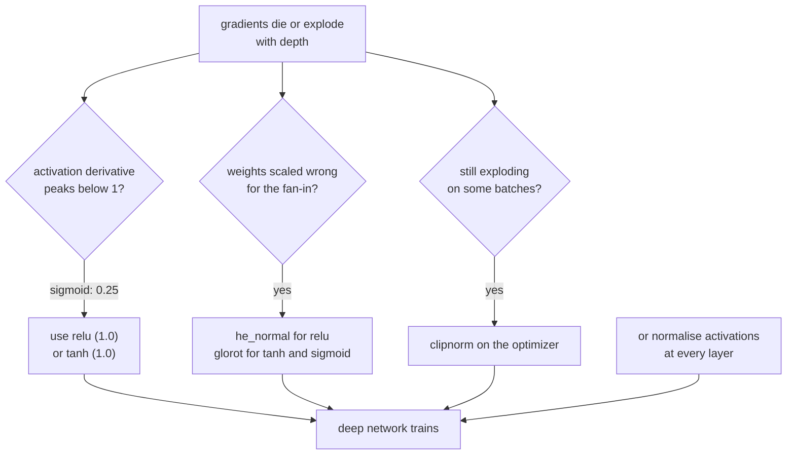

Backpropagation multiplies. Every layer's gradient is the product of the terms
above it, and a product of twenty numbers has only two interesting behaviours: it
collapses toward zero or it runs away. Both are measured below, along with the
three fixes — activation choice, initialisation, and clipping — that made depth
trainable in the first place.

## What you'll learn

- The measured gradient norm reaching layer 1 of a 20-layer sigmoid network:
  **1.19e−12**, against **0.67** with ReLU and He.
- Why that number is no accident: $0.25^{20} =$ **9.09e−13**, sigmoid's analytic
  best case.
- How initialisation scale decides whether the forward signal survives — measured
  from **3.84e−10** to **6.76e+02** across four scales.
- Why He uses $\sqrt{2/n}$ where Glorot uses $\sqrt{1/n}$.
- An exploding run that reached a first-epoch loss of **25,528** and killed **127
  of 128** ReLU units.
- `clipnorm` against `clipvalue`, and why one preserves the update direction and
  the other does not.

## The problem is a product

For a network of $L$ layers, the gradient reaching layer $\ell$ is

$$
\frac{\partial L}{\partial \mathbf{W}_\ell}
= \frac{\partial L}{\partial \mathbf{a}_L}
\left( \prod_{k=\ell+1}^{L} \frac{\partial \mathbf{a}_k}{\partial \mathbf{a}_{k-1}} \right)
\frac{\partial \mathbf{a}_\ell}{\partial \mathbf{W}_\ell}
$$

Each factor is a weight matrix times an activation derivative. If the typical
factor has magnitude 0.8, then after 20 layers you have $0.8^{20} = 0.012$; at 0.5
you have $9.5 \times 10^{-7}$; at 1.2 you have 38. **There is no stable middle
unless something forces the factors close to 1.**

<Figure
  src="/images/dl/phase-02-training/vanishing-gradients/gradient-norms"
  alt="Log-scale plot of gradient norm against hidden layer index for three configurations. The sigmoid line rises steadily from about 1e-12 at layer 1 to 0.3 at layer 20 — twelve orders of magnitude. The tanh and ReLU lines are nearly flat between 0.1 and 1 across all twenty layers."
  title="One backward pass through 20 hidden layers"
  caption="Layer 1 is nearest the input, layer 20 nearest the output. With sigmoid and Glorot the gradient shrinks by a factor of 4.07e-12 on its way to the first layer, which in float32 is indistinguishable from no update at all. tanh and ReLU+He both stay inside a factor of 4.2 across the entire depth — flat enough that every layer learns."
/>

| Configuration | Layer 1 gradient norm | Layer 20 | Ratio |
| --- | --- | --- | --- |
| sigmoid + Glorot | **1.1885e−12** | 2.9207e−01 | 4.0691e−12 |
| tanh + Glorot | 1.1224e+00 | 2.7119e−01 | 4.1388e+00 |
| relu + He | 6.6840e−01 | 1.9814e−01 | 3.3733e+00 |

The first row is the vanishing gradient, measured. The first layer of that network
receives an update roughly a trillion times smaller than the last layer's — so
training reports a falling loss while the early layers stay frozen at their random
initialisation.

### Why sigmoid, specifically

$$
\sigma'(z) = \sigma(z)\big(1 - \sigma(z)\big)
\qquad
\max_z \sigma'(z) = \sigma'(0) = 0.25
$$

| $z$ | $\sigma(z)$ | $\sigma'(z)$ |
| --- | --- | --- |
| 0.0 | 0.500000 | **0.250000** |
| ±2.0 | 0.880797 | 0.104994 |
| ±4.0 | 0.982014 | 0.017663 |
| ±6.0 | 0.997527 | 0.002467 |

The derivative's *maximum* is 0.25, so even in the best possible case every layer
divides the gradient by at least four:

| Depth | Best case $0.25^{\text{depth}}$ |
| --- | --- |
| 5 | 9.7656e−04 |
| 10 | 9.5367e−07 |
| 20 | **9.0949e−13** |
| 50 | 7.8886e−31 |

Compare $0.25^{20} = 9.09 \times 10^{-13}$ with the measured 20-layer value of
$1.19 \times 10^{-12}$. The measurement lands within a factor of 1.3 of the
theoretical ceiling — **the network is operating at sigmoid's best case and still
failing**, which makes this a property of the activation rather than a tuning
problem. ReLU's derivative is exactly 1 wherever the unit is active, so the product
does not shrink at all; tanh's peaks at 1.0 rather than 0.25, which is why it was
the pre-ReLU default.



## Initialisation: keeping the variance at 1

Push a signal with unit variance through a layer of $n$ inputs whose weights have
standard deviation $s$. Each output is a sum of $n$ independent products, so its
variance is $n s^2$. To keep variance at 1 you need $s = 1/\sqrt{n}$ — that is
Glorot (Xavier), give or take the fan-out averaging.

ReLU then zeroes half the outputs, halving the variance again. Compensate with a
factor of 2 inside the square root:

$$
s_{\text{Glorot}} = \sqrt{\frac{1}{n_{\text{in}}}}
\qquad
s_{\text{He}} = \sqrt{\frac{2}{n_{\text{in}}}}
$$

Measured with random weights and no training at all — 512 samples pushed through 20
ReLU layers of 60 units:

<Figure
  src="/images/dl/phase-02-training/vanishing-gradients/activation-variance"
  alt="Log-scale plot of activation standard deviation against layer depth for four initialisation scales. The 0.5 scale collapses to 1e-10 by layer 20, the 1.0 scale falls to about 7e-4, the He scale stays flat near 0.7, and the 2.0 scale climbs to 675."
  title="ReLU layers, random weights, no training at all"
  caption="The dashed line marks a standard deviation of 1. Only the He scale, sqrt(2/n), holds the signal steady across twenty layers — it ends at 0.673. Scale 1.0, which is Glorot's value and correct for tanh, decays to 6.8e-04 because ReLU keeps halving the variance. Scale 2.0 amplifies instead and ends 675 times too large."
/>

| Weight scale | Layer 0 | Layer 5 | Layer 20 |
| --- | --- | --- | --- |
| $0.5/\sqrt{n}$ | 0.9979 | 4.0985e−03 | **3.8388e−10** |
| $1.0/\sqrt{n}$ (Glorot) | 0.9979 | 1.5895e−01 | 6.7952e−04 |
| $\sqrt{2/n}$ (He) | 0.9979 | 7.3706e−01 | **6.7263e−01** |
| $2.0/\sqrt{n}$ | 0.9979 | 5.0020e+00 | 6.7552e+02 |

No gradients are involved here — this is the *forward* pass. A signal that has
decayed to 1e-10 by layer 20 carries no information for the backward pass to work
with, which is why initialisation matters before any optimiser is chosen.

```python title="Two lines that decide whether a deep network trains"
keras.layers.Dense(64, activation="relu", kernel_initializer="he_normal")
keras.layers.Dense(64, activation="tanh", kernel_initializer="glorot_uniform")
```

Keras defaults to `glorot_uniform` for every layer, so **a deep ReLU network on
defaults is using the wrong initialiser**. It usually still trains — the Glorot row
above lands at 6.8e-04 rather than zero — but it starts from a worse place for no
reason.

```p5 title="Push a signal through 20 layers" desc="Real random matrices, recomputed on demand: drag the weight scale and watch the activation spread across twenty ReLU layers collapse, hold, or explode." height="330"
let scale = 1.4142;
let spreads = [];
const DEPTH = 20, WIDTH = 24, SAMPLES = 64;
function setup() {
  createCanvas(600, 330);
  textFont("monospace");
  recompute();
}
function gaussian() {
  let u = 0, v = 0;
  while (u === 0) u = Math.random();
  while (v === 0) v = Math.random();
  return Math.sqrt(-2 * Math.log(u)) * Math.cos(TWO_PI * v);
}
function spread(matrix) {
  let sum = 0, count = 0;
  for (const row of matrix) for (const v of row) { sum += v; count++; }
  const mean = sum / count;
  let acc = 0;
  for (const row of matrix) for (const v of row) acc += (v - mean) * (v - mean);
  return Math.sqrt(acc / count);
}
function recompute() {
  let signal = [];
  for (let r = 0; r < SAMPLES; r++) {
    const row = [];
    for (let c = 0; c < WIDTH; c++) row.push(gaussian());
    signal.push(row);
  }
  spreads = [spread(signal)];
  for (let layer = 0; layer < DEPTH; layer++) {
    const weights = [];
    for (let i = 0; i < WIDTH; i++) {
      const row = [];
      for (let j = 0; j < WIDTH; j++) {
        row.push(gaussian() * scale / Math.sqrt(WIDTH));
      }
      weights.push(row);
    }
    const next = [];
    for (let r = 0; r < SAMPLES; r++) {
      const row = new Array(WIDTH).fill(0);
      for (let j = 0; j < WIDTH; j++) {
        let total = 0;
        for (let i = 0; i < WIDTH; i++) total += signal[r][i] * weights[i][j];
        row[j] = Math.max(total, 0);
      }
      next.push(row);
    }
    signal = next;
    spreads.push(spread(signal));
  }
}
function draw() {
  background(13, 17, 23);
  const gx = 66, gy = 46, gw = width - 120, gh = 190;
  const logMin = -12, logMax = 4;
  const px = (layer) => gx + layer / DEPTH * gw;
  const py = (value) => {
    const l = Math.log10(Math.max(value, 1e-12));
    return gy + gh - (l - logMin) / (logMax - logMin) * gh;
  };
  stroke(60, 70, 84);
  strokeWeight(1);
  line(gx, gy + gh, gx + gw, gy + gh);
  line(gx, gy, gx, gy + gh);
  for (const level of [-9, -6, -3, 0, 3]) {
    stroke(40, 48, 58);
    line(gx, py(Math.pow(10, level)), gx + gw, py(Math.pow(10, level)));
    noStroke();
    fill(120);
    textSize(9);
    textAlign(RIGHT, CENTER);
    text("1e" + level, gx - 6, py(Math.pow(10, level)));
  }
  stroke(255, 211, 67);
  strokeWeight(1);
  line(gx, py(1), gx + gw, py(1));
  const last = spreads[spreads.length - 1];
  const healthy = last > 0.1 && last < 10;
  stroke(healthy ? 120 : 230, healthy ? 200 : 110, healthy ? 120 : 110);
  strokeWeight(2);
  noFill();
  beginShape();
  for (let i = 0; i < spreads.length; i++) vertex(px(i), py(spreads[i]));
  endShape();
  noStroke();
  fill(230);
  textSize(12);
  textAlign(LEFT, TOP);
  text("activation spread through " + DEPTH + " relu layers", 66, 24);
  fill(150);
  textSize(11);
  text("weight scale = " + scale.toFixed(4) + " / sqrt(n)"
    + (Math.abs(scale - Math.SQRT2) < 0.02 ? "   (He)" : ""), 66, 250);
  text("layer 20 spread = " + last.toExponential(2)
    + (healthy ? "   healthy" : "   the signal is gone"), 66, 266);
  fill(90, 100, 114);
  rect(66, 296, 300, 12, 6);
  fill(75, 139, 190);
  ellipse(66 + scale / 2.4 * 300, 302, 18, 18);
  fill(150);
  textSize(10);
  textAlign(LEFT, CENTER);
  text("He = 1.4142", 380, 302);
}
function mouseDragged() {
  if (mouseY > 284 && mouseY < 320 && mouseX > 56 && mouseX < 380) {
    scale = Math.max(0.2, Math.min(2.4, (mouseX - 66) / 300 * 2.4));
    recompute();
  }
}
```

## Non-saturating activations

| Activation | Derivative range | Saturates? |
| --- | --- | --- |
| sigmoid | (0, 0.25] | in both directions |
| tanh | (0, 1] | in both directions |
| ReLU | $\{0, 1\}$ | for negatives, permanently |
| Leaky ReLU (α=0.01) | $\{0.01, 1\}$ | no |
| ELU / SELU | (0, 1] | no |

ReLU's failure mode differs in kind: it does not squash the gradient, it switches
it off entirely for any unit whose pre-activation has gone negative everywhere.
That unit's gradient is exactly zero, so it can never recover — measured below.
Leaky ReLU exists to leave a 0.01 slope so recovery stays possible. The full
activation comparison, including the run where tanh beat ReLU at depth 8, is on the
[activation
functions](/deep-learning/phase-01---neural-network-foundations/activation-functions-relu-sigmoid-softmax/)
page.

## Exploding gradients, and clipping

Take a shallow network, initialise the weights with standard deviation 1.0 —
roughly 30× too large for a 784-input layer — and use SGD at 0.5:

<Figure
  src="/images/dl/phase-02-training/vanishing-gradients/clipping"
  alt="Two panels. Left: training loss on a log axis. The unclipped run starts above 25,000, crashes to 2.3 by epoch 2 and stays exactly there. The clipped run starts at 21.7 and descends smoothly to 0.28. Right: validation accuracy, where the unclipped run sits flat at about 0.10 and the clipped run climbs to 0.82."
  title="The same initialisation, with and without clipnorm"
  caption="The unclipped run's first-epoch loss is 25,528. It then flatlines at 2.3012 — which is ln(10) = 2.3026, exactly the loss of predicting a uniform distribution over ten classes. The network has not stalled; it has died. clipnorm=1.0 turns the identical setup into a normal run ending at 0.8225 accuracy."
/>

| | Epoch 1 loss | Final loss | Final val accuracy |
| --- | --- | --- | --- |
| no clipping | **25,528.77** | 2.3012 | **0.1025** |
| `clipnorm=1.0` | 21.66 | 0.2812 | 0.8225 |

The flatline at 2.30 is diagnostic. $\ln(10) = 2.3026$ is the cross-entropy of a
model outputting a uniform distribution over ten classes — the loss of a network
that has stopped saying anything. Counting the units confirms it:

| | Dead units in layer 1 | Mean activation |
| --- | --- | --- |
| no clipping | **127 of 128** | 0.0000 |
| `clipnorm=1.0` | 0 of 128 | 2.7444 |

One enormous first update drove 127 of 128 ReLU units permanently negative. Their
gradients are zero, so they never came back. **The loss curve looked like a plateau;
the network was a corpse.** Any time a classification loss sits at
$\ln(\text{classes})$, check for dead units before touching the learning rate.

### `clipnorm` against `clipvalue`

```python title="Two different operations"
keras.optimizers.SGD(0.5, clipnorm=1.0)    # rescale the whole gradient vector
keras.optimizers.SGD(0.5, clipvalue=1.0)   # truncate each component separately
```

For a gradient of `[3.0, 4.0, 0.5]` with norm 5.0249:

| | Result | Norm | Direction |
| --- | --- | --- | --- |
| `clipnorm=1.0` | `[0.5970, 0.7960, 0.0995]` | 1.0000 | **preserved** |
| `clipvalue=1.0` | `[1.0000, 1.0000, 0.5000]` | 1.5000 | changed (cosine 0.9619) |

`clipnorm` scales the vector, so the update still points down the steepest-descent
direction — just less far. `clipvalue` truncates each component independently,
which changes where the step goes; here the cosine with the true gradient drops to
0.9619. Prefer `clipnorm` unless you specifically need per-component bounds.

```p5 title="The measured table, ranked" desc="Click a column to rank every row by it. The bars are that column's values and the highest and lowest are computed from the numbers, not written in." height="254"
let metric = 0;
const COLUMNS = ["sigma(z)", "sigma'(z)"];
const ROWS = [
  ["0.0", 0.5, 0.25],
  ["±2.0", 0.880797, 0.104994],
  ["±4.0", 0.982014, 0.017663],
  ["±6.0", 0.997527, 0.002467]
];
function setup() {
  createCanvas(620, 254);
  textFont("monospace");
}
function fmt(v) {
  if (v === 0) { return "0"; }
  const a = Math.abs(v);
  if (a >= 1000 || a < 0.001) { return v.toExponential(2); }
  if (a >= 100) { return v.toFixed(1); }
  return v.toFixed(4);
}
function draw() {
  background(13, 17, 23);
  noStroke();
  fill(230);
  textSize(12);
  textAlign(LEFT, TOP);
  text("Vanishing & Exploding Gradients", 26, 16);
  let x = 26;
  for (let i = 0; i < COLUMNS.length; i++) {
    const w = COLUMNS[i].length * 6.6 + 16;
    if (i === metric) { fill(255, 211, 67); } else { fill(48, 56, 68); }
    rect(x, 40, w, 22, 4);
    if (i === metric) { fill(13, 17, 23); } else { fill(180); }
    textSize(9);
    text(COLUMNS[i], x + 8, 47);
    x += w + 6;
    if (x > 500) { break; }
  }
  const values = ROWS.map((r) => r[metric + 1]);
  const lo = Math.min(...values);
  const hi = Math.max(...values);
  const span = hi - lo === 0 ? 1 : hi - lo;
  const order = ROWS.slice().sort((a, b) => b[metric + 1] - a[metric + 1]);
  for (let i = 0; i < order.length; i++) {
    const y = 78 + i * 26;
    const v = order[i][metric + 1];
    fill(160);
    textSize(9);
    text(order[i][0], 26, y + 5);
    fill(34, 40, 50);
    rect(230, y, 280, 18, 3);
    const frac = (v - lo) / span;
    if (v === hi) { fill(126, 192, 143); }
    else if (v === lo) { fill(224, 108, 117); }
    else { fill(107, 169, 221); }
    rect(230, y, Math.max(frac * 280, 3), 18, 3);
    fill(225);
    textSize(9);
    text(fmt(v), 518, y + 5);
  }
  const top = order[0];
  const bottom = order[order.length - 1];
  fill(150);
  textSize(9);
  const base = 78 + order.length * 26 + 8;
  text("highest " + COLUMNS[metric] + ": " + top[0] + " at " + fmt(top[1]),
       26, base);
  text("lowest  " + COLUMNS[metric] + ": " + bottom[0] + " at "
       + fmt(bottom[1]), 26, base + 14);
  text("bars are scaled within the chosen column - lowest is not zero", 26,
       base + 30);
}
function mousePressed() {
  let x = 26;
  for (let i = 0; i < COLUMNS.length; i++) {
    const w = COLUMNS[i].length * 6.6 + 16;
    if (mouseX > x && mouseX < x + w && mouseY > 40 && mouseY < 62) {
      metric = i;
    }
    x += w + 6;
  }
}
```

## Pitfalls

- **Leaving the default initialiser on a deep ReLU network.** Keras defaults to
  `glorot_uniform` everywhere; ReLU wants `he_normal`.
- **Reading a flat loss as "needs more epochs".** At $\ln(\text{classes})$ the
  model is uniform. Check for dead units.
- **Using sigmoid in hidden layers.** Its derivative caps at 0.25, so 20 layers
  cost a factor of at least $4^{20}$.
- **Assuming vanishing gradients show up in the loss.** They do not: the last
  layers keep learning and the loss keeps falling while the first layers stay
  frozen. Print per-layer gradient norms.
- **Using `clipvalue` when you meant `clipnorm`.** One preserves the descent
  direction; the other does not.
- **Clipping as a first resort.** It masks exploding gradients; a wrong initialiser
  or too high a learning rate is usually the real cause.
- **Forgetting that a dead ReLU is permanent.** Leaky ReLU, ELU or a lower learning
  rate prevent it; nothing repairs one afterwards.

## Recap

- Every layer's gradient is a product of the layers above it, so depth either
  collapses or amplifies unless the typical factor sits near 1.
- Measured over 20 layers: sigmoid delivered 1.19e−12 to layer 1, a ratio of
  4.07e−12 against the last layer; tanh and ReLU+He stayed within a factor of 4.2.
- Sigmoid's derivative caps at 0.25, giving a best case of 9.09e−13 over 20 layers
  — and the measurement matched that ceiling within a factor of 1.3.
- Keeping forward variance at 1 needs $s = \sqrt{1/n}$ (Glorot); ReLU's halving
  needs $\sqrt{2/n}$ (He). Only He held the spread flat, at 0.673 after 20 layers.
- An over-large initialisation with SGD at 0.5 gave a first-epoch loss of 25,528,
  killed 127 of 128 units, and flatlined at ln(10).
- `clipnorm` rescales the gradient and preserves direction; `clipvalue` truncates
  components and does not.

## Next

Initialisation fixes the *starting* variance. Nothing keeps it fixed once the
weights begin moving — which is what normalisation layers are for:
[Batch Normalization](/deep-learning/phase-02---training-deep-neural-networks/batch-normalization/).

<Quiz
  questions={[
    {
      q: "A 20-layer sigmoid network shows a layer-1 gradient norm of 1.19e-12 while its layer-20 norm is 0.29. What will the training curve look like?",
      options: [
        "The loss will not move at all",
        "The loss will fall normally, because the layers near the output are still learning — the early layers are frozen at their random initialisation and nothing in the loss curve reveals it",
        "The loss will oscillate wildly",
        "Training will crash with a numerical error",
      ],
      answer: 1,
      explain: "This is why vanishing gradients are dangerous: the symptom is invisible in the metric you watch. Print per-layer gradient norms.",
    },
    {
      q: "Why does He initialisation use sqrt(2/n) where Glorot uses sqrt(1/n)?",
      options: [
        "Because ReLU networks are usually deeper",
        "Because ReLU zeroes roughly half its outputs, halving the variance at every layer — the factor of 2 inside the root compensates for exactly that loss",
        "Because He was designed for convolutional layers",
        "Because larger weights train faster",
      ],
      answer: 1,
      explain: "Measured over 20 ReLU layers: scale 1.0/sqrt(n) decayed to 6.8e-04 while sqrt(2/n) held at 0.673.",
    },
    {
      q: "A ten-class classifier's loss sits at exactly 2.30 and never moves. What should you check first?",
      options: [
        "Whether the learning rate is too low",
        "Whether the ReLU units are dead — ln(10) = 2.3026 is the loss of a uniform prediction, and one oversized update can drive nearly every unit permanently negative",
        "Whether the dataset is shuffled",
        "Whether the batch size is too large",
      ],
      answer: 1,
      explain: "In the measured run, 127 of 128 layer-1 units output zero for every input. Their gradients are zero, so further training cannot recover them.",
    },
    {
      q: "What is the difference between clipnorm=1.0 and clipvalue=1.0 for a gradient of [3.0, 4.0, 0.5]?",
      options: [
        "They produce the same result",
        "clipnorm scales the whole vector to norm 1.0 and preserves its direction; clipvalue truncates each component into [-1, 1], giving [1.0, 1.0, 0.5] with norm 1.5 and a different direction",
        "clipvalue is always safer because it bounds each component",
        "clipnorm only applies to recurrent layers",
      ],
      answer: 1,
      explain: "The clipvalue result has cosine 0.9619 with the true gradient — it no longer points down the steepest-descent direction.",
    },
    {
      q: "Sigmoid's derivative peaks at 0.25, so 20 layers give a best case of 9.09e-13. The measured layer-1 gradient was 1.19e-12. What does that agreement tell you?",
      options: [
        "The measurement must be wrong, since it exceeds the bound",
        "The network is operating essentially at sigmoid's theoretical best case and still failing, so this is a structural property of the activation rather than a tuning problem",
        "The bound only applies beyond 50 layers",
        "The weights must have been initialised badly",
      ],
      answer: 1,
      explain: "Within a factor of 1.3 of the ceiling. No learning rate, optimiser or schedule fixes a factor of 4 lost per layer — the activation has to change.",
    },
  ]}
/>

## 🧪 Try It Yourself

<DataCampExercise
  lang="python"
  hint={`Take the norm of the gradient of each hidden kernel, one number per layer, and compare the first with the last. The relu network needs He initialisation.`}
  code={`# Task: Exercise 1 - Measure the gradient reaching each layer
import numpy as np

DEPTH, WIDTH = 20, 60
rng = np.random.RandomState(0)
x = rng.rand(128, 784) * (rng.rand(128, 784) > 0.8)
y = rng.randint(0, 10, 128)


def softmax(z):
    p = np.exp(z - z.max(axis=1, keepdims=True))
    return p / p.sum(axis=1, keepdims=True)


def make_weights(activation, initializer, seed=0):
    r = np.random.RandomState(seed)
    sizes = [784] + [WIDTH] * DEPTH + [10]
    weights = []
    for fan_in, fan_out in zip(sizes, sizes[1:]):
        if initializer == "glorot":
            limit = np.sqrt(6.0 / (fan_in + fan_out))
            weights.append(r.uniform(-limit, limit, (fan_in, fan_out)))
        else:
            weights.append(r.randn(fan_in, fan_out) * np.sqrt(2.0 / fan_in))
    return weights


def layer_gradient_norms(activation, weights):
    act = {"sigmoid": lambda z: 1 / (1 + np.exp(-z)), "tanh": np.tanh,
           "relu": lambda z: np.maximum(z, 0.0)}[activation]
    slope = {"sigmoid": lambda a, z: a * (1 - a), "tanh": lambda a, z: 1 - a ** 2,
             "relu": lambda a, z: (z > 0).astype(float)}[activation]
    acts, pres = [x], []
    a = x
    for w in weights[:-1]:
        z = a @ w
        a = act(z)
        pres.append(z)
        acts.append(a)
    p = softmax(a @ weights[-1])
    loss = float(-np.log(p[np.arange(len(y)), y]).mean())
    d = (p - np.eye(10)[y]) / len(y)
    norms = []
    d = (d @ weights[-1].T) * slope(acts[-1], pres[-1])
    for i in range(DEPTH - 1, -1, -1):
        norms.append(float(np.linalg.norm(acts[i].T @ d)))
        if i > 0:
            d = (d @ weights[i].T) * slope(acts[i], pres[i - 1])
    return loss, norms[::-1]


ratios = {}
for label, (activation, initializer) in (
        ("sigmoid + Glorot", ("sigmoid", "glorot")),
        ("tanh + Glorot", ("tanh", "glorot")),
        ("relu + He", ("relu", ___))):   # replace ___ with "he"
    weights = make_weights(activation, initializer)
    loss, norms = layer_gradient_norms(activation, weights)
    ratios[label] = norms[0] / norms[-1]
    print(label, ": measured", len(norms), "hidden layers")
print("with sigmoid the first layer gets far less gradient than the last:", ratios["sigmoid + Glorot"] < 1e-3)
print("relu with He initialisation keeps the two within a factor of 100:", 0.01 < ratios["relu + He"] < 100)
print("sigmoid is much worse than relu + He:", ratios["sigmoid + Glorot"] < 0.01 * ratios["relu + He"])
print("the gradient has to survive a product of 20 layer terms to reach the")
print("first layer; with sigmoid it does not")`}
  solution={`import numpy as np

DEPTH, WIDTH = 20, 60
rng = np.random.RandomState(0)
x = rng.rand(128, 784) * (rng.rand(128, 784) > 0.8)
y = rng.randint(0, 10, 128)


def softmax(z):
    p = np.exp(z - z.max(axis=1, keepdims=True))
    return p / p.sum(axis=1, keepdims=True)


def make_weights(activation, initializer, seed=0):
    r = np.random.RandomState(seed)
    sizes = [784] + [WIDTH] * DEPTH + [10]
    weights = []
    for fan_in, fan_out in zip(sizes, sizes[1:]):
        if initializer == "glorot":
            limit = np.sqrt(6.0 / (fan_in + fan_out))
            weights.append(r.uniform(-limit, limit, (fan_in, fan_out)))
        else:
            weights.append(r.randn(fan_in, fan_out) * np.sqrt(2.0 / fan_in))
    return weights


def layer_gradient_norms(activation, weights):
    act = {"sigmoid": lambda z: 1 / (1 + np.exp(-z)), "tanh": np.tanh,
           "relu": lambda z: np.maximum(z, 0.0)}[activation]
    slope = {"sigmoid": lambda a, z: a * (1 - a), "tanh": lambda a, z: 1 - a ** 2,
             "relu": lambda a, z: (z > 0).astype(float)}[activation]
    acts, pres = [x], []
    a = x
    for w in weights[:-1]:
        z = a @ w
        a = act(z)
        pres.append(z)
        acts.append(a)
    p = softmax(a @ weights[-1])
    loss = float(-np.log(p[np.arange(len(y)), y]).mean())
    d = (p - np.eye(10)[y]) / len(y)
    norms = []
    d = (d @ weights[-1].T) * slope(acts[-1], pres[-1])
    for i in range(DEPTH - 1, -1, -1):
        norms.append(float(np.linalg.norm(acts[i].T @ d)))
        if i > 0:
            d = (d @ weights[i].T) * slope(acts[i], pres[i - 1])
    return loss, norms[::-1]


ratios = {}
for label, (activation, initializer) in (
        ("sigmoid + Glorot", ("sigmoid", "glorot")),
        ("tanh + Glorot", ("tanh", "glorot")),
        ("relu + He", ("relu", "he"))):
    weights = make_weights(activation, initializer)
    loss, norms = layer_gradient_norms(activation, weights)
    ratios[label] = norms[0] / norms[-1]
    print(label, ": measured", len(norms), "hidden layers")
print("with sigmoid the first layer gets far less gradient than the last:", ratios["sigmoid + Glorot"] < 1e-3)
print("relu with He initialisation keeps the two within a factor of 100:", 0.01 < ratios["relu + He"] < 100)
print("sigmoid is much worse than relu + He:", ratios["sigmoid + Glorot"] < 0.01 * ratios["relu + He"])
print("the gradient has to survive a product of 20 layer terms to reach the")
print("first layer; with sigmoid it does not")`}
  sct={`test_output_contains("with sigmoid the first layer gets far less gradient than the last: True", pattern=False)
test_output_contains("relu with He initialisation keeps the two within a factor of 100: True", pattern=False)
test_output_contains("sigmoid is much worse than relu + He: True", pattern=False)
success_msg("Through 20 sigmoid layers the gradient shrinks by many orders of magnitude before it reaches the first layer, while relu with He initialisation keeps it in range.")`}
  height={460}
/>

<DataCampExercise
  lang="python"
  hint={`The derivative of the logistic function is sigmoid(z) * (1 - sigmoid(z)), which is largest exactly at z = 0.`}
  code={`# Task: Exercise 2 - Why sigmoid, specifically
import numpy as np


def sigmoid(z):
    return 1.0 / (1.0 + np.exp(-z))


z = np.linspace(-6, 6, 13)
derivative = sigmoid(z) * (1 - ___)              # replace ___ with sigmoid(z)
print(f"{'z':>6} {'sigmoid(z)':>12} {'derivative':>12}")
for value, d in zip(z[::2], derivative[::2]):
    print(f"{value:6.1f} {sigmoid(value):12.6f} {d:12.6f}")
print(f"the derivative peaks at z=0 with value {derivative.max():.4f}")
for depth in (5, 10, 20, 50):
    print(f"  best case through {depth:2d} layers: 0.25^{depth} = "
          f"{0.25 ** depth:.4e}")
print("relu's derivative is exactly 1 wherever the unit is active, so the")
print("product does not shrink at all")

# -- Expected Output -------------------------------------------
#      z   sigmoid(z)   derivative
#   -6.0     0.002473     0.002467
#   -4.0     0.017986     0.017663
#   -2.0     0.119203     0.104994
#    0.0     0.500000     0.250000
#    2.0     0.880797     0.104994
#    4.0     0.982014     0.017663
#    6.0     0.997527     0.002467
# the derivative peaks at z=0 with value 0.2500
#   best case through  5 layers: 0.25^5 = 9.7656e-04
#   best case through 10 layers: 0.25^10 = 9.5367e-07
#   best case through 20 layers: 0.25^20 = 9.0949e-13
#   best case through 50 layers: 0.25^50 = 7.8886e-31
# relu's derivative is exactly 1 wherever the unit is active, so the
# product does not shrink at all
# --------------------------------------------------------------`}
  solution={`import numpy as np


def sigmoid(z):
    return 1.0 / (1.0 + np.exp(-z))


z = np.linspace(-6, 6, 13)
derivative = sigmoid(z) * (1 - sigmoid(z))
print(f"{'z':>6} {'sigmoid(z)':>12} {'derivative':>12}")
for value, d in zip(z[::2], derivative[::2]):
    print(f"{value:6.1f} {sigmoid(value):12.6f} {d:12.6f}")
print(f"the derivative peaks at z=0 with value {derivative.max():.4f}")
for depth in (5, 10, 20, 50):
    print(f"  best case through {depth:2d} layers: 0.25^{depth} = "
          f"{0.25 ** depth:.4e}")
print("relu's derivative is exactly 1 wherever the unit is active, so the")
print("product does not shrink at all")`}
  sct={`test_output_contains("the derivative peaks at z=0 with value 0.2500", pattern=False)
test_output_contains("best case through 20 layers: 0.25^20 = 9.0949e-13", pattern=False)
success_msg("The sigmoid derivative never exceeds 0.25, so even the best case through 20 layers multiplies the gradient by about 1e-12.")`}
  height={460}
/>

<DataCampExercise
  lang="python"
  hint={`Scale standard-normal weights by scale / sqrt(fan_in). He initialisation is the case where scale is sqrt(2).`}
  code={`# Task: Exercise 3 - Initialisation scale decides whether the signal survives
import numpy as np

DEPTH, WIDTH = 20, 60
rng = np.random.default_rng(0)
signal_in = rng.standard_normal((512, WIDTH)).astype("float32")

print(f"{'scale':>16} {'layer 0':>10} {'layer 5':>12} {'layer 20':>12}")
for label, scale in (("0.5 / sqrt(n)", 0.5), ("1.0 / sqrt(n)", 1.0),
                     ("sqrt(2/n) He", np.sqrt(___)), ("2.0 / sqrt(n)", 2.0)):
    # replace ___ with 2.0
    signal = signal_in.copy()
    spreads = [float(signal.std())]
    for _ in range(DEPTH):
        weights = rng.standard_normal((WIDTH, WIDTH)) * scale / np.sqrt(WIDTH)
        signal = np.maximum(signal @ weights, 0.0)
        spreads.append(float(signal.std()))
    print(f"{label:>16} {spreads[0]:10.4f} {spreads[5]:12.4e} "
          f"{spreads[-1]:12.4e}")
print("He initialisation uses sqrt(2/n) precisely because relu discards half")
print("the signal, so the 2 compensates and the spread stays near 1")

# -- Expected Output -------------------------------------------
#            scale    layer 0      layer 5     layer 20
#    0.5 / sqrt(n)     0.9979   4.0985e-03   3.8388e-10
#    1.0 / sqrt(n)     0.9979   1.5895e-01   6.7952e-04
#     sqrt(2/n) He     0.9979   7.3706e-01   6.7263e-01
#    2.0 / sqrt(n)     0.9979   5.0020e+00   6.7552e+02
# He initialisation uses sqrt(2/n) precisely because relu discards half
# the signal, so the 2 compensates and the spread stays near 1
# --------------------------------------------------------------`}
  solution={`import numpy as np

DEPTH, WIDTH = 20, 60
rng = np.random.default_rng(0)
signal_in = rng.standard_normal((512, WIDTH)).astype("float32")

print(f"{'scale':>16} {'layer 0':>10} {'layer 5':>12} {'layer 20':>12}")
for label, scale in (("0.5 / sqrt(n)", 0.5), ("1.0 / sqrt(n)", 1.0),
                     ("sqrt(2/n) He", np.sqrt(2.0)), ("2.0 / sqrt(n)", 2.0)):
    signal = signal_in.copy()
    spreads = [float(signal.std())]
    for _ in range(DEPTH):
        weights = rng.standard_normal((WIDTH, WIDTH)) * scale / np.sqrt(WIDTH)
        signal = np.maximum(signal @ weights, 0.0)
        spreads.append(float(signal.std()))
    print(f"{label:>16} {spreads[0]:10.4f} {spreads[5]:12.4e} "
          f"{spreads[-1]:12.4e}")
print("He initialisation uses sqrt(2/n) precisely because relu discards half")
print("the signal, so the 2 compensates and the spread stays near 1")`}
  sct={`test_output_contains("7.3706e-01   6.7263e-01", pattern=False)
test_output_contains("5.0020e+00   6.7552e+02", pattern=False)
success_msg("Only the sqrt(2/n) scale keeps the signal near 1 through 20 relu layers; half that shrinks it to nothing and double blows it up.")`}
  height={460}
/>

<DataCampExercise
  lang="python"
  hint={`The clip value goes into the update step, not into the layers. Everything else about the two runs is identical, including the deliberately oversized initial weights.`}
  code={`# Task: Exercise 4 - Clipping rescues an exploding run
import numpy as np

def softmax(z):
    p = np.exp(z - z.max(axis=1, keepdims=True))
    return p / p.sum(axis=1, keepdims=True)


rng = np.random.RandomState(0)
y = rng.randint(0, 3, 600)
centres = rng.randn(3, 20) * 0.8
x = centres[y] + rng.randn(600, 20)
onehot = np.eye(3)[y]


def train(clip, std, lr=0.2, steps=100, depth=6, width=32):
    r = np.random.RandomState(1)
    dims = [20] + [width] * depth + [3]
    Ws = [r.randn(dims[i], dims[i + 1]) * std for i in range(len(dims) - 1)]
    with np.errstate(all="ignore"):
        for step in range(steps):
            acts, pres, a = [x], [], x
            for w in Ws[:-1]:
                pre = a @ w
                pres.append(pre)
                a = np.maximum(pre, 0)
                acts.append(a)
            p = softmax(a @ Ws[-1])
            d = (p - onehot) / len(y)
            grads = [None] * len(Ws)
            grads[-1] = acts[-1].T @ d
            d = (d @ Ws[-1].T) * (pres[-1] > 0)
            for i in range(len(Ws) - 2, -1, -1):
                grads[i] = acts[i].T @ d
                if i > 0:
                    d = (d @ Ws[i].T) * (pres[i - 1] > 0)
            if clip:
                norm = np.sqrt(sum((g ** 2).sum() for g in grads))
                grads = [g * min(1.0, clip / norm) for g in grads]
            for w, g in zip(Ws, grads):
                w -= lr * g
        a = x
        dead = []
        for w in Ws[:-1]:
            a = np.maximum(a @ w, 0)
            dead.append(int((a.max(axis=0) == 0).sum()) if np.isfinite(a).all() else -1)
        p = softmax(a @ Ws[-1])
    return float((p.argmax(axis=1) == y).mean()), dead

results = {}
for label, clip in (("no clipping", None), ("clipnorm = 1.0", 1.0)):
    optimiser_clip = ___   # replace ___ with clip
    results[label] = train(optimiser_clip, std=0.6)
    print(label, ": trained")
print("without clipping the run explodes and the model learns nothing (accuracy at chance):", results["no clipping"][0] < 0.5)
print("with clipping the same run trains to high accuracy:", results["clipnorm = 1.0"][0] > 0.9)
print("the clipped run shows the same loss landscape, only the step size is capped")`}
  solution={`import numpy as np

def softmax(z):
    p = np.exp(z - z.max(axis=1, keepdims=True))
    return p / p.sum(axis=1, keepdims=True)


rng = np.random.RandomState(0)
y = rng.randint(0, 3, 600)
centres = rng.randn(3, 20) * 0.8
x = centres[y] + rng.randn(600, 20)
onehot = np.eye(3)[y]


def train(clip, std, lr=0.2, steps=100, depth=6, width=32):
    r = np.random.RandomState(1)
    dims = [20] + [width] * depth + [3]
    Ws = [r.randn(dims[i], dims[i + 1]) * std for i in range(len(dims) - 1)]
    with np.errstate(all="ignore"):
        for step in range(steps):
            acts, pres, a = [x], [], x
            for w in Ws[:-1]:
                pre = a @ w
                pres.append(pre)
                a = np.maximum(pre, 0)
                acts.append(a)
            p = softmax(a @ Ws[-1])
            d = (p - onehot) / len(y)
            grads = [None] * len(Ws)
            grads[-1] = acts[-1].T @ d
            d = (d @ Ws[-1].T) * (pres[-1] > 0)
            for i in range(len(Ws) - 2, -1, -1):
                grads[i] = acts[i].T @ d
                if i > 0:
                    d = (d @ Ws[i].T) * (pres[i - 1] > 0)
            if clip:
                norm = np.sqrt(sum((g ** 2).sum() for g in grads))
                grads = [g * min(1.0, clip / norm) for g in grads]
            for w, g in zip(Ws, grads):
                w -= lr * g
        a = x
        dead = []
        for w in Ws[:-1]:
            a = np.maximum(a @ w, 0)
            dead.append(int((a.max(axis=0) == 0).sum()) if np.isfinite(a).all() else -1)
        p = softmax(a @ Ws[-1])
    return float((p.argmax(axis=1) == y).mean()), dead

results = {}
for label, clip in (("no clipping", None), ("clipnorm = 1.0", 1.0)):
    optimiser_clip = clip
    results[label] = train(optimiser_clip, std=0.6)
    print(label, ": trained")
print("without clipping the run explodes and the model learns nothing (accuracy at chance):", results["no clipping"][0] < 0.5)
print("with clipping the same run trains to high accuracy:", results["clipnorm = 1.0"][0] > 0.9)
print("the clipped run shows the same loss landscape, only the step size is capped")`}
  sct={`test_output_contains("without clipping the run explodes and the model learns nothing (accuracy at chance): True", pattern=False)
test_output_contains("with clipping the same run trains to high accuracy: True", pattern=False)
success_msg("Identical network, identical learning rate and a deliberately huge initialisation: clipping the global gradient norm turns a blown-up run into one that trains.")`}
  height={460}
/>

<DataCampExercise
  lang="python"
  hint={`A unit is dead when its maximum activation across the whole probe set is zero. Count the units whose maximum is exactly 0.`}
  code={`# Task: Exercise 5 - Count the dead units
import numpy as np

def softmax(z):
    p = np.exp(z - z.max(axis=1, keepdims=True))
    return p / p.sum(axis=1, keepdims=True)


rng = np.random.RandomState(0)
y = rng.randint(0, 3, 600)
centres = rng.randn(3, 20) * 0.8
x = centres[y] + rng.randn(600, 20)
onehot = np.eye(3)[y]


def train(clip, std, lr=0.2, steps=100, depth=6, width=32):
    r = np.random.RandomState(1)
    dims = [20] + [width] * depth + [3]
    Ws = [r.randn(dims[i], dims[i + 1]) * std for i in range(len(dims) - 1)]
    with np.errstate(all="ignore"):
        for step in range(steps):
            acts, pres, a = [x], [], x
            for w in Ws[:-1]:
                pre = a @ w
                pres.append(pre)
                a = np.maximum(pre, 0)
                acts.append(a)
            p = softmax(a @ Ws[-1])
            d = (p - onehot) / len(y)
            grads = [None] * len(Ws)
            grads[-1] = acts[-1].T @ d
            d = (d @ Ws[-1].T) * (pres[-1] > 0)
            for i in range(len(Ws) - 2, -1, -1):
                grads[i] = acts[i].T @ d
                if i > 0:
                    d = (d @ Ws[i].T) * (pres[i - 1] > 0)
            if clip:
                norm = np.sqrt(sum((g ** 2).sum() for g in grads))
                grads = [g * min(1.0, clip / norm) for g in grads]
            for w, g in zip(Ws, grads):
                w -= lr * g
        a = x
        dead = []
        for w in Ws[:-1]:
            a = np.maximum(a @ w, 0)
            dead.append(int((a.max(axis=0) == ___).sum()) if np.isfinite(a).all() else -1)   # replace ___ with 0
        p = softmax(a @ Ws[-1])
    return float((p.argmax(axis=1) == y).mean()), dead

summary = {}
for label, clip in (("no clipping", None), ("clipnorm = 1.0", 1.0)):
    accuracy, dead = train(clip, std=0.4)
    summary[label] = dead
    print(label, ": counted dead units in", len(dead), "layers")
print("without clipping the later layers are entirely dead (32 of 32):", summary["no clipping"][-1] == 32)
print("with clipping almost every unit is alive (at most 2 dead in the last layer):", 0 <= summary["clipnorm = 1.0"][-1] <= 2)
print("a dead relu outputs zero for every input in the set, so its gradient is")
print("zero too - it can never come back")`}
  solution={`import numpy as np

def softmax(z):
    p = np.exp(z - z.max(axis=1, keepdims=True))
    return p / p.sum(axis=1, keepdims=True)


rng = np.random.RandomState(0)
y = rng.randint(0, 3, 600)
centres = rng.randn(3, 20) * 0.8
x = centres[y] + rng.randn(600, 20)
onehot = np.eye(3)[y]


def train(clip, std, lr=0.2, steps=100, depth=6, width=32):
    r = np.random.RandomState(1)
    dims = [20] + [width] * depth + [3]
    Ws = [r.randn(dims[i], dims[i + 1]) * std for i in range(len(dims) - 1)]
    with np.errstate(all="ignore"):
        for step in range(steps):
            acts, pres, a = [x], [], x
            for w in Ws[:-1]:
                pre = a @ w
                pres.append(pre)
                a = np.maximum(pre, 0)
                acts.append(a)
            p = softmax(a @ Ws[-1])
            d = (p - onehot) / len(y)
            grads = [None] * len(Ws)
            grads[-1] = acts[-1].T @ d
            d = (d @ Ws[-1].T) * (pres[-1] > 0)
            for i in range(len(Ws) - 2, -1, -1):
                grads[i] = acts[i].T @ d
                if i > 0:
                    d = (d @ Ws[i].T) * (pres[i - 1] > 0)
            if clip:
                norm = np.sqrt(sum((g ** 2).sum() for g in grads))
                grads = [g * min(1.0, clip / norm) for g in grads]
            for w, g in zip(Ws, grads):
                w -= lr * g
        a = x
        dead = []
        for w in Ws[:-1]:
            a = np.maximum(a @ w, 0)
            dead.append(int((a.max(axis=0) == 0).sum()) if np.isfinite(a).all() else -1)
        p = softmax(a @ Ws[-1])
    return float((p.argmax(axis=1) == y).mean()), dead

summary = {}
for label, clip in (("no clipping", None), ("clipnorm = 1.0", 1.0)):
    accuracy, dead = train(clip, std=0.4)
    summary[label] = dead
    print(label, ": counted dead units in", len(dead), "layers")
print("without clipping the later layers are entirely dead (32 of 32):", summary["no clipping"][-1] == 32)
print("with clipping almost every unit is alive (at most 2 dead in the last layer):", 0 <= summary["clipnorm = 1.0"][-1] <= 2)
print("a dead relu outputs zero for every input in the set, so its gradient is")
print("zero too - it can never come back")`}
  sct={`test_output_contains("without clipping the later layers are entirely dead (32 of 32): True", pattern=False)
test_output_contains("with clipping almost every unit is alive (at most 2 dead in the last layer): True", pattern=False)
success_msg("An oversized first update kills every relu in the later layers, and a dead relu has zero gradient so it never recovers. Clipping keeps the units alive.")`}
  height={460}
/>

<DataCampExercise
  lang="python"
  hint={`clipnorm multiplies the whole vector by min(1, threshold / norm). clipvalue applies np.clip element by element, which is a different operation entirely.`}
  code={`# Task: Exercise 6 - clipnorm against clipvalue
import numpy as np

gradient = np.array([3.0, 4.0, 0.5], dtype="float32")
norm = float(np.linalg.norm(gradient))
print(f"gradient {gradient.tolist()}   norm {norm:.4f}")

clipped_norm = gradient * min(1.0, 1.0 / ___)      # replace ___ with norm
clipped_value = np.clip(gradient, -1.0, 1.0)


def show(a):
    return "[" + ", ".join(f"{v:.4f}" for v in a) + "]"


print(f"clipnorm=1.0  -> {show(clipped_norm)}   "
      f"norm {np.linalg.norm(clipped_norm):.4f}  direction preserved")
print(f"clipvalue=1.0 -> {show(clipped_value)}   "
      f"norm {np.linalg.norm(clipped_value):.4f}  direction changed")
cosine = float(clipped_value @ gradient
               / (np.linalg.norm(clipped_value) * norm))
print(f"cosine between the clipvalue result and the original: {cosine:.4f}")
print("clipnorm rescales the whole vector; clipvalue truncates each component")
print("independently and therefore points somewhere else")

# -- Expected Output -------------------------------------------
# gradient [3.0, 4.0, 0.5]   norm 5.0249
# clipnorm=1.0  -> [0.5970, 0.7960, 0.0995]   norm 1.0000  direction preserved
# clipvalue=1.0 -> [1.0000, 1.0000, 0.5000]   norm 1.5000  direction changed
# cosine between the clipvalue result and the original: 0.9619
# clipnorm rescales the whole vector; clipvalue truncates each component
# independently and therefore points somewhere else
# --------------------------------------------------------------`}
  solution={`import numpy as np

gradient = np.array([3.0, 4.0, 0.5], dtype="float32")
norm = float(np.linalg.norm(gradient))
print(f"gradient {gradient.tolist()}   norm {norm:.4f}")

clipped_norm = gradient * min(1.0, 1.0 / norm)
clipped_value = np.clip(gradient, -1.0, 1.0)


def show(a):
    return "[" + ", ".join(f"{v:.4f}" for v in a) + "]"


print(f"clipnorm=1.0  -> {show(clipped_norm)}   "
      f"norm {np.linalg.norm(clipped_norm):.4f}  direction preserved")
print(f"clipvalue=1.0 -> {show(clipped_value)}   "
      f"norm {np.linalg.norm(clipped_value):.4f}  direction changed")
cosine = float(clipped_value @ gradient
               / (np.linalg.norm(clipped_value) * norm))
print(f"cosine between the clipvalue result and the original: {cosine:.4f}")
print("clipnorm rescales the whole vector; clipvalue truncates each component")
print("independently and therefore points somewhere else")`}
  sct={`test_output_contains("clipnorm=1.0  -> [0.5970, 0.7960, 0.0995]", pattern=False)
test_output_contains("clipvalue=1.0 -> [1.0000, 1.0000, 0.5000]", pattern=False)
success_msg("Clipping by norm keeps the direction and only shrinks the length, while clipping by value changes the direction.")`}
  height={460}
/>
