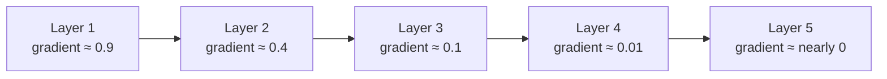

## What you'll learn

- why gradients vanish (or explode) as they flow backward through a deep net
- Glorot (Xavier) and He initialization — and why the default matters
- nonsaturating activations: ReLU, Leaky ReLU, ELU, and SELU
- gradient clipping for when exploding gradients are the real problem

## The problem

Backpropagation flows the error gradient from the output layer back to the input
layer, and uses it to update every weight along the way. In a deep network, that
gradient often gets smaller and smaller the further back it travels — by the time
it reaches the first few layers there's barely a signal left, so those layers
stop learning. This is the **vanishing gradients** problem. The opposite can also
happen: gradients grow larger and larger until the updates are enormous and
training diverges — the **exploding gradients** problem (more common in RNNs).

Géron traces this back to a 2010 paper by Glorot and Bengio: with the once-popular
combination of the logistic sigmoid activation and naive random initialization,
the variance of each layer's output keeps growing as you go deeper, until the
activation saturates near 0 or 1 at the top layers — and a saturated sigmoid has
a derivative close to zero, so almost no gradient survives the trip backward.



## Glorot and He initialization

Glorot and Bengio's fix: for the signal to flow properly in *both* directions
(forward predictions, backward gradients), the variance of a layer's outputs
should roughly equal the variance of its inputs. That leads to an initialization
scheme scaled by the layer's **fan-in** and **fan-out** (its number of input and
output connections):

| Initialization | Activation functions | Variance (uses `fan_avg` unless noted) |
| --- | --- | --- |
| Glorot | none, tanh, logistic, softmax | `1 / fan_avg` |
| He | ReLU and variants | `2 / fan_in` |
| LeCun | SELU | `1 / fan_in` |

Keras uses Glorot initialization with a uniform distribution by default. Switch
to He initialization explicitly when you're using ReLU-family activations:

```python title="Choosing an initializer" showLineNumbers{1}
import tensorflow as tf

# Default: Glorot uniform — fine for tanh/sigmoid/softmax
tf.keras.layers.Dense(10, activation="tanh")

# He initialization — pairs with ReLU and its variants
tf.keras.layers.Dense(10, activation="relu", kernel_initializer="he_normal")

# LeCun initialization — required for SELU's self-normalizing property
tf.keras.layers.Dense(10, activation="selu", kernel_initializer="lecun_normal")
```

## Nonsaturating activation functions

The choice of activation matters just as much as initialization. **ReLU**
(`max(0, z)`) doesn't saturate for positive inputs and is cheap to compute, which
is why it's the default hidden-layer activation today — but it has its own
"dying ReLU" problem: a neuron whose weighted input is always negative just
outputs 0 forever, and gradient descent can't revive it.

- **Leaky ReLU** — `max(α·z, z)` — gives negative inputs a small slope (`α`,
  typically `0.01` or `0.2`) instead of a hard zero, so neurons can't fully die.
- **ELU** — smooth and negative for `z < 0`, which pushes the average output
  closer to zero and speeds up convergence, at the cost of being slower to compute.
- **SELU** — a scaled variant of ELU that, under the right conditions (LeCun
  normal init, all-Dense sequential architecture, standardized inputs), makes the
  network **self-normalize**: every layer's output tends to keep a mean of 0 and
  a standard deviation of 1, all on its own.

Géron's rule of thumb for general use: `SELU > ELU > Leaky ReLU (and variants) >
ReLU > tanh > logistic`.

```python title="Using Leaky ReLU and SELU" showLineNumbers{1}
import tensorflow as tf

model = tf.keras.models.Sequential([
    tf.keras.layers.Flatten(input_shape=[28, 28]),
    tf.keras.layers.Dense(300, kernel_initializer="he_normal", use_bias=False),
    tf.keras.layers.LeakyReLU(alpha=0.2),
    tf.keras.layers.Dense(100, activation="selu", kernel_initializer="lecun_normal"),
    tf.keras.layers.Dense(10, activation="softmax"),
])
```

## Gradient clipping

Batch Normalization (next page) usually handles unstable gradients well enough
on its own, but **gradient clipping** is a simple, direct fix that's especially
common in recurrent networks: clip every gradient component to a fixed range
before it's applied.

```python title="Clipping gradients on the optimizer" showLineNumbers{1}
import tensorflow as tf

# clip every gradient component to [-1.0, 1.0]
optimizer = tf.keras.optimizers.SGD(clipvalue=1.0)

# or clip the whole gradient vector by its L2 norm, preserving direction
optimizer = tf.keras.optimizers.SGD(clipnorm=1.0)

model = tf.keras.models.Sequential([tf.keras.layers.Dense(1, input_shape=(4,))])
model.compile(loss="mse", optimizer=optimizer)
```

`clipvalue` can change the *direction* of the gradient vector (each component is
clipped independently); `clipnorm` rescales the whole vector so its direction is
preserved. Try both if you see exploding gradients in TensorBoard.

## Where this fits in the bigger picture

François Chollet frames the same symptom — a training loss that refuses to
move — as the first thing to debug in any deep learning project, and his first
suspects are the learning rate and batch size (see **Backpropagation and
Optimizers**, earlier in this phase). Vanishing or exploding gradients are the
same failure one layer deeper: even with a perfectly sane learning rate, a bad
init/activation combination can strangle the gradient signal before it ever
reaches the optimizer step. If a model still won't train after you've ruled
out the optimizer's hyperparameters, this page — not a fancier optimizer — is
where to look next.

## Visualize it

Watch what happens to the gradient signal as it's multiplied backward through
more and more layers — with a saturating activation it shrinks toward zero
almost immediately, while a nonsaturating one keeps a usable signal much deeper:

```p5 title="Gradient magnitude shrinking layer by layer" desc="The same starting gradient propagated backward through 8 layers, with a saturating activation (sigmoid-like) versus a nonsaturating one (ReLU-like). The signal fades, then breathes back in as the loop restarts." height="280"
let t = 0;
function setup() {
  createCanvas(600, 280);
  textFont("monospace");
  textAlign(CENTER, CENTER);
}
function draw() {
  background(13, 17, 23);
  const n = 8;
  const x0 = 50, gap = (width - 100) / (n - 1);
  let gSat = 1.0, gNon = 1.0;
  // a smooth 0 -> 1 -> 0 breathing cycle (sin), so the loop has no jump cut:
  // full-strength gradient fades away, then eases back in, forever
  const period = 220;
  const frac = Math.sin((Math.PI * (t % period)) / period);
  for (let i = 0; i < n; i++) {
    const x = x0 + i * gap;
    const satR = 10 + 22 * gSat;
    const nonR = 10 + 22 * gNon;
    noStroke();
    fill(240, 120, 90, 220);
    ellipse(x, 90, satR, satR);
    fill(230);
    textSize(10);
    text(gSat.toFixed(2), x, 90 + satR / 2 + 12);
    fill(120, 200, 120, 220);
    ellipse(x, 190, nonR, nonR);
    fill(230);
    text(gNon.toFixed(2), x, 190 + nonR / 2 + 12);
    if (i < n - 1) {
      stroke(240, 120, 90, 120); line(x + satR / 2, 90, x + gap - satR / 2, 90);
      stroke(120, 200, 120, 120); line(x + nonR / 2, 190, x + gap - nonR / 2, 190);
    }
    gSat *= 0.35 * frac + (1 - frac);
    gNon *= 0.85 * frac + (1 - frac);
  }
  fill(240, 120, 90);
  textAlign(LEFT, CENTER);
  textSize(12);
  text("saturating activation - gradient vanishes fast", 20, 30);
  fill(120, 200, 120);
  text("nonsaturating (ReLU-like) - gradient survives longer", 20, 250);
  t++;
}
function mousePressed() { t = 0; }
```

:::tip[From the book]
Géron's microphone analogy is a great way to remember why the variance has to
stay steady layer to layer: imagine a chain of amplifiers. If you set any one
knob too close to zero, your voice never comes out the other end; too close to
the max, and it saturates into noise. Every amplifier in the chain — every layer
in the network — has to preserve the signal's amplitude for it to survive the
whole journey, forward *and* backward.
:::

import DataCampExercise from "../../../../components/DataCampExercise.astro";

## 🧪 Try It Yourself

### Exercise 1 – He Initialization for ReLU

<DataCampExercise
  lang="python"
  hint={`Set \`kernel_initializer="he_normal"\` when the activation is \`"relu"\`.`}
  code={`# Task: Exercise 1 - He Initialization for ReLU
import tensorflow as tf

layer = tf.keras.layers.Dense(64, activation="relu", kernel_initializer="___")   # replace ___ with he_normal
print(layer.kernel_initializer.__class__.__name__)

# ── Expected Output ───────────────────────────────────────────
# HeNormal
# ──────────────────────────────────────────────────────────────`}
  solution={`import tensorflow as tf

layer = tf.keras.layers.Dense(64, activation="relu", kernel_initializer="he_normal")
print(layer.kernel_initializer.__class__.__name__)`}
  sct={`test_output_contains("HeNormal")
success_msg("He initialization set for a ReLU layer!")`}
  height={140}
/>

### Exercise 2 – Add a Leaky ReLU Layer

<DataCampExercise
  lang="python"
  hint={`\`tf.keras.layers.LeakyReLU(alpha=0.2)\` is added as its own layer, right after the Dense layer.`}
  code={`# Task: Exercise 2 - Add a Leaky ReLU Layer
import tensorflow as tf

model = tf.keras.models.Sequential([
    tf.keras.layers.Dense(10, kernel_initializer="he_normal", input_shape=(4,)),
    tf.keras.layers.___(alpha=0.2),   # replace ___ with LeakyReLU
])
print(model.layers[-1].__class__.__name__)

# ── Expected Output ───────────────────────────────────────────
# LeakyReLU
# ──────────────────────────────────────────────────────────────`}
  solution={`import tensorflow as tf

model = tf.keras.models.Sequential([
    tf.keras.layers.Dense(10, kernel_initializer="he_normal", input_shape=(4,)),
    tf.keras.layers.LeakyReLU(alpha=0.2),
])
print(model.layers[-1].__class__.__name__)`}
  sct={`test_output_contains("LeakyReLU")
success_msg("Leaky ReLU added after the Dense layer!")`}
  height={150}
/>

### Exercise 3 – Clip Gradients by Norm

<DataCampExercise
  lang="python"
  hint={`Pass \`clipnorm=1.0\` when creating the \`SGD\` optimizer.`}
  code={`# Task: Exercise 3 - Clip Gradients by Norm
import tensorflow as tf

optimizer = tf.keras.optimizers.SGD(learning_rate=0.01, ___=1.0)   # replace ___ with clipnorm
print("clipnorm:", optimizer.clipnorm)

# ── Expected Output ───────────────────────────────────────────
# clipnorm: 1.0
# ──────────────────────────────────────────────────────────────`}
  solution={`import tensorflow as tf

optimizer = tf.keras.optimizers.SGD(learning_rate=0.01, clipnorm=1.0)
print("clipnorm:", optimizer.clipnorm)`}
  sct={`test_output_contains("clipnorm: 1.0")
success_msg("Gradients will now be clipped by norm!")`}
  height={140}
/>

## Next

Continue to **Batch Normalization** — a technique that keeps every layer's
inputs well-scaled *throughout* training, not just at initialization.
