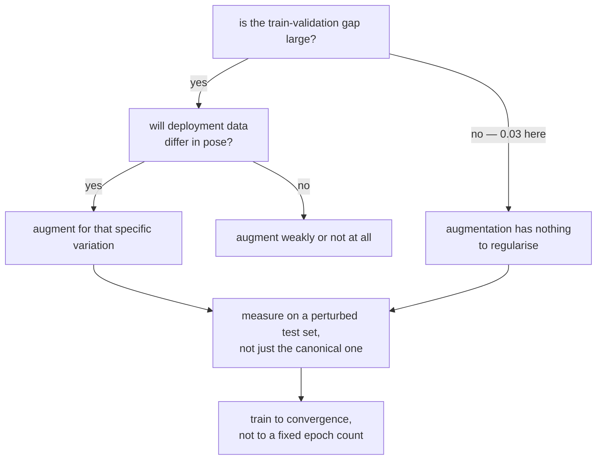

import DataCampExercise from "../../../../components/DataCampExercise.astro";
import Figure from "../../../../components/Figure.astro";
import Quiz from "../../../../components/Quiz.astro";

Data augmentation is the standard prescription for a small dataset: rotate, shift and
flip your training images to manufacture more of them. On Fashion-MNIST it made every
model **worse**.

| Training rows | No augmentation | Medium augmentation | Gain |
| --- | --- | --- | --- |
| 500 | 0.7150 | 0.5295 | **−0.1855** |
| 2,000 | 0.7630 | 0.6980 | −0.0650 |
| 8,000 | 0.8475 | 0.7785 | −0.0690 |

That is not a bug, and this page is about why — and about the measurement that shows what
augmentation *did* buy, which turns out to be something else entirely.

## What you'll learn

- Why augmentation is a statement about **invariance**, and what happens when the
  statement is false.
- The measurement that redeems it: on rotated test data, augmentation turned **0.5965
  into 0.7070**.
- Why `RandomRotation(0.15)` is ±54°, not a mild jitter.
- Why a fixed epoch budget makes augmentation look worse than it is — and how much worse.
- The diagnostic that tells you in advance whether augmentation can help at all.

## Augmentation is a claim about your data

Every augmentation encodes an assumption: *the label does not change under this
transformation*. Rotating a boot by 20° should still be a boot, so the model should learn
to be invariant to rotation.

That assumption is about the **test set**, not the training set. Fashion-MNIST images are
centred, size-normalised and axis-aligned — every one of them, in training *and* test. So
rotation invariance is not a property the task rewards; it is capacity spent on variation
the test set never contains.

The un-augmented model's train–validation gap says the same thing from another angle:

| Rows | Best validation accuracy | Train − validation gap |
| --- | --- | --- |
| 500 | 0.7150 | 0.0285 |
| 2,000 | 0.7630 | 0.0390 |
| 8,000 | 0.8475 | 0.0325 |

**A gap of 0.03 is not overfitting.** Augmentation is a regulariser, and this model has
almost nothing to regularise. Reaching for it here is treating a disease the patient
does not have.

<Figure
  src="/images/dl/phase-03-vision/data-augmentation/augmentation-effect"
  alt="Two panels. Left: best validation accuracy against training rows for augmented and un-augmented models, with the un-augmented line above at every size — 0.7150 against 0.5295 at 500 rows, 0.7630 against 0.6980 at 2,000, and 0.8475 against 0.7785 at 8,000. Right: per-epoch curves at 2,000 rows where dashed training accuracy and solid validation accuracy sit close together for both setups."
  title="Fashion-MNIST, 40 epochs"
  caption="Augmentation lost at every size, and lost most at the smallest — the opposite of the usual claim. The right panel shows why the train-validation gap matters: both models track their own training accuracy closely, so neither is memorising, and a regulariser has nothing to fix."
/>

## The measurement that changes the verdict

If augmentation buys invariance rather than accuracy, then the way to see it is to
**test on data that needs the invariance**. Same four models, three test sets: the
canonical one, one shifted by up to 15%, one rotated by up to 10% of a turn.

| Strength | Canonical | Shifted 15% | Rotated 10% | Canonical − shifted |
| --- | --- | --- | --- | --- |
| none | **0.7630** | 0.6260 | 0.5965 | **0.1370** |
| light (0.03) | 0.7065 | 0.6720 | 0.6175 | 0.0345 |
| medium (0.08) | 0.6950 | **0.6825** | **0.7070** | **0.0125** |
| heavy (0.20) | 0.5515 | 0.5685 | 0.5995 | −0.0170 |

<Figure
  src="/images/dl/phase-03-vision/data-augmentation/augmentation-robustness"
  alt="A grouped bar chart with three conditions. On canonical test data the un-augmented model leads at 0.763 and accuracy falls with augmentation strength to 0.552. On shifted test data the ordering reverses at the top: 0.626 unaugmented against 0.672 light and 0.683 medium. On rotated test data medium augmentation leads clearly at 0.707 against 0.596 unaugmented."
  title="2,000 rows, 40 epochs — the same models on three test sets"
  caption="Read the un-augmented bars left to right: 0.763, 0.626, 0.596. That model loses 0.1370 the moment the test images move and 0.1665 when they rotate — it never had to cope with either. The medium-augmented model reads 0.695, 0.683, 0.707: almost flat. It gave up 0.068 on canonical data and bought back 0.1105 on rotated data. Neither model is better; they are optimised for different deployment conditions."
/>

That is the honest statement of what augmentation does:

- It **costs** accuracy on data drawn from the same distribution as the training set.
- It **buys** accuracy on data that is not — measured **+0.1105 on rotation**, +0.0565 on
  shift.
- The right amount depends entirely on which of those your production data looks like,
  and nothing in your training set can tell you.

Heavy augmentation (±72° rotation) is bad everywhere, which is its own lesson: an
invariance the task genuinely does not have is not free even when the test set is
perturbed.

## Keras' rotation factor is in turns

```python title="RandomRotation(0.15) is not a small rotation"
keras.layers.RandomRotation(0.15)     # +/- 0.15 * 360 = +/- 54 degrees
keras.layers.RandomRotation(0.03)     # +/- 10.8 degrees — this is "light"
```

The first version of this page used 0.15 as its "medium" setting, on the assumption that
it meant something like 15%. It is ±54°, which turns a sandal into an unrecognisable
blob. The strengths on this page are 0.03 / 0.08 / 0.20 — ±10.8°, ±28.8° and ±72°.

<Figure
  src="/images/dl/phase-03-vision/data-augmentation/augmented-samples"
  alt="A row of nine 28x28 greyscale images: an original pullover followed by eight augmented versions, each flipped, rotated, zoomed or shifted, with visible black borders where the image has moved away from the frame edge."
  title="One image through the pipeline eight times"
  caption="Mean absolute pixel change across the eight draws ranged from 0.1360 to 0.1948, and no two draws were identical. Look at the black borders: every shift and rotation pulls the garment away from the frame and pads with zeros, so the model also learns that a border of black is normal — a second, unintended change to the input distribution."
/>

## The budget trap

The first version of this experiment ran 15 epochs and concluded that augmentation costs
0.16–0.20 accuracy everywhere. It does not:

| Rows | Setup | Best epoch | Accuracy at epoch 15 | Best accuracy |
| --- | --- | --- | --- | --- |
| 500 | none | 39 | 0.5780 | 0.7150 |
| 500 | medium | 40 | 0.4715 | 0.5295 |
| 2,000 | none | 40 | 0.7180 | 0.7630 |
| 2,000 | medium | 38 | 0.5305 | 0.6980 |
| 8,000 | none | 40 | 0.8075 | 0.8475 |
| 8,000 | medium | 33 | 0.7225 | 0.7785 |

At 2,000 rows the augmented model reads 0.5305 at epoch 15 and 0.6980 at its best —
**0.1675 of the apparent penalty was just an unfinished run**. Augmentation makes every
epoch a slightly different task, so convergence takes longer by construction. Comparing
at a fixed epoch count measures the budget.



## Which transformations are safe

| Transformation | Label-preserving? |
| --- | --- |
| `RandomFlip("horizontal")` | usually — a sneaker mirrored is a sneaker |
| `RandomFlip("vertical")` | **no** for clothing: Fashion-MNIST has no upside-down boots |
| `RandomRotation(small)` | yes within a few degrees |
| `RandomZoom`, `RandomTranslation` | yes, but both introduce black borders |
| horizontal flip on **text or digits** | **no** — a mirrored `2` is not a `2` |

The test is always the same question: **would a human give the augmented image the same
label?** If yes, it is a valid augmentation; if the test set never contains such images,
it is a valid augmentation that costs you accuracy.

```p5 title="Invariance you asked for, invariance you needed" desc="Choose how much the deployment data differs from the training data, and see which model wins. The numbers are the measured ones." height="330"
const DATA = {
  none: { canonical: 0.7630, shifted: 0.6260, rotated: 0.5965 },
  light: { canonical: 0.7065, shifted: 0.6720, rotated: 0.6175 },
  medium: { canonical: 0.6950, shifted: 0.6825, rotated: 0.7070 },
  heavy: { canonical: 0.5515, shifted: 0.5685, rotated: 0.5995 },
};
const NAMES = ["none", "light", "medium", "heavy"];
const CONDITIONS = ["canonical", "shifted", "rotated"];
let condition = 0;
function setup() {
  createCanvas(620, 330);
  textFont("monospace");
}
function draw() {
  background(13, 17, 23);
  const key = CONDITIONS[condition];
  const values = NAMES.map((n) => DATA[n][key]);
  const best = Math.max(...values);
  noStroke();
  fill(230);
  textSize(12);
  textAlign(LEFT, TOP);
  text("deployment data: " + key, 30, 22);
  NAMES.forEach((name, index) => {
    const y = 56 + index * 48;
    const value = DATA[name][key];
    const width = value * 480;
    fill(value === best ? 165 : 70, value === best ? 214 : 90,
      value === best ? 164 : 110);
    rect(120, y, width, 30, 4);
    fill(200);
    textSize(11);
    textAlign(RIGHT, CENTER);
    text(name, 112, y + 15);
    textAlign(LEFT, CENTER);
    fill(235);
    text(value.toFixed(4), 128 + width, y + 15);
    textAlign(LEFT, TOP);
  });
  const winner = NAMES[values.indexOf(best)];
  fill(255, 211, 67);
  textSize(11.5);
  text("best here: " + winner + " augmentation", 30, 256);
  fill(150);
  textSize(10.5);
  text("un-augmented wins on canonical data and loses 0.1665 when the test", 30, 278);
  text("images rotate; medium augmentation is almost flat across all three", 30, 294);
  fill(60, 70, 84);
  rect(430, 250, 160, 28, 4);
  fill(220);
  textAlign(CENTER, CENTER);
  textSize(10.5);
  text("next condition", 510, 264);
}
function mousePressed() {
  if (mouseX > 430 && mouseX < 590 && mouseY > 250 && mouseY < 278) {
    condition = (condition + 1) % CONDITIONS.length;
  }
}
```

```p5 title="The measured table, ranked" desc="Click a column to rank every row by it. The bars are that column's values and the highest and lowest are computed from the numbers, not written in." height="254"
let metric = 0;
const COLUMNS = ["Canonical", "Shifted 15%", "Rotated 10%", "Canonical - shifted"];
const ROWS = [
  ["none", 0.763, 0.626, 0.5965, 0.137],
  ["light (0.03)", 0.7065, 0.672, 0.6175, 0.0345],
  ["medium (0.08)", 0.695, 0.6825, 0.707, 0.0125],
  ["heavy (0.20)", 0.5515, 0.5685, 0.5995, -0.017]
];
function setup() {
  createCanvas(620, 254);
  textFont("monospace");
}
function fmt(v) {
  if (v === 0) { return "0"; }
  const a = Math.abs(v);
  if (a >= 1000 || a < 0.001) { return v.toExponential(2); }
  if (a >= 100) { return v.toFixed(1); }
  return v.toFixed(4);
}
function draw() {
  background(13, 17, 23);
  noStroke();
  fill(230);
  textSize(12);
  textAlign(LEFT, TOP);
  text("Data Augmentation for Small Datase", 26, 16);
  let x = 26;
  for (let i = 0; i < COLUMNS.length; i++) {
    const w = COLUMNS[i].length * 6.6 + 16;
    if (i === metric) { fill(255, 211, 67); } else { fill(48, 56, 68); }
    rect(x, 40, w, 22, 4);
    if (i === metric) { fill(13, 17, 23); } else { fill(180); }
    textSize(9);
    text(COLUMNS[i], x + 8, 47);
    x += w + 6;
    if (x > 500) { break; }
  }
  const values = ROWS.map((r) => r[metric + 1]);
  const lo = Math.min(...values);
  const hi = Math.max(...values);
  const span = hi - lo === 0 ? 1 : hi - lo;
  const order = ROWS.slice().sort((a, b) => b[metric + 1] - a[metric + 1]);
  for (let i = 0; i < order.length; i++) {
    const y = 78 + i * 26;
    const v = order[i][metric + 1];
    fill(160);
    textSize(9);
    text(order[i][0], 26, y + 5);
    fill(34, 40, 50);
    rect(230, y, 280, 18, 3);
    const frac = (v - lo) / span;
    if (v === hi) { fill(126, 192, 143); }
    else if (v === lo) { fill(224, 108, 117); }
    else { fill(107, 169, 221); }
    rect(230, y, Math.max(frac * 280, 3), 18, 3);
    fill(225);
    textSize(9);
    text(fmt(v), 518, y + 5);
  }
  const top = order[0];
  const bottom = order[order.length - 1];
  fill(150);
  textSize(9);
  const base = 78 + order.length * 26 + 8;
  text("highest " + COLUMNS[metric] + ": " + top[0] + " at " + fmt(top[1]),
       26, base);
  text("lowest  " + COLUMNS[metric] + ": " + bottom[0] + " at "
       + fmt(bottom[1]), 26, base + 14);
  text("bars are scaled within the chosen column - lowest is not zero", 26,
       base + 30);
}
function mousePressed() {
  let x = 26;
  for (let i = 0; i < COLUMNS.length; i++) {
    const w = COLUMNS[i].length * 6.6 + 16;
    if (mouseX > x && mouseX < x + w && mouseY > 40 && mouseY < 62) {
      metric = i;
    }
    x += w + 6;
  }
}
```

## Pitfalls

- **Augmenting a model that is not overfitting.** The gap here was 0.03, and augmentation
  cost up to 0.1855.
- **Judging augmentation on the canonical test set alone.** It lost 0.068 there and won
  0.1105 on rotated data — one number without the other is half the story.
- **Comparing at a fixed epoch count.** 0.1675 of the apparent penalty at 2,000 rows was
  an unfinished run.
- **Reading Keras' rotation factor as a percentage.** `RandomRotation(0.15)` is ±54°.
- **Using vertical flips on clothing, or horizontal flips on digits and text.** The label
  does not survive.
- **Ignoring the borders.** Every shift and rotation pads with black, so the model also
  learns that black borders are normal.
- **Assuming more augmentation is safer.** Heavy (±72°) was worst on all three test
  sets, including the perturbed ones.

## Recap

- Augmentation lost accuracy at every dataset size on canonical Fashion-MNIST: −0.1855,
  −0.0650, −0.0690.
- The un-augmented train–validation gap was ~0.03 — there was nothing to regularise.
- On perturbed test data the ranking reverses: rotated 0.5965 → **0.7070**, shifted
  0.6260 → 0.6825.
- The un-augmented model's canonical-minus-shifted drop was 0.1370; the medium-augmented
  model's was 0.0125.
- `RandomRotation(0.15)` is ±54°; the settings here are ±10.8°, ±28.8° and ±72°.
- Augmentation delays convergence: at 2,000 rows the augmented model gained 0.1675 after
  epoch 15.

## Next

Augmentation manufactures inputs. The next page stops classifying whole images and starts
labelling every pixel:
[Image Segmentation](/deep-learning/phase-03---computer-vision-with-cnns/image-segmentation/).

<Quiz
  questions={[
    {
      q: "Augmentation cost 0.1855 accuracy at 500 training rows on Fashion-MNIST. What is the most likely explanation?",
      options: [
        "The augmentation was implemented incorrectly",
        "Fashion-MNIST is centred and pose-normalised in both train and test, so rotation and shift invariance are capacity spent on variation the test set never contains",
        "500 rows is too many for augmentation to help",
        "Augmentation only works on colour images",
      ],
      answer: 1,
      explain: "The un-augmented train-validation gap was 0.0285 — the model was not overfitting, so a regulariser had nothing to fix.",
    },
    {
      q: "On rotated test data the augmented model scored 0.7070 against the un-augmented model's 0.5965. What does that establish?",
      options: [
        "Augmentation is better after all",
        "Augmentation buys invariance rather than accuracy — it costs on data drawn from the training distribution and pays on data that is not",
        "The rotated test set is easier",
        "The models should be retrained",
      ],
      answer: 1,
      explain: "The un-augmented model's canonical-minus-shifted drop was 0.1370 against 0.0125 for the augmented one. Which model is 'better' depends entirely on what the deployment data looks like.",
    },
    {
      q: "What does RandomRotation(0.15) do?",
      options: [
        "Rotates by up to 15 degrees",
        "Rotates by up to 0.15 of a full turn — plus or minus 54 degrees, which is enough to make a sandal unrecognisable",
        "Rotates 15% of the images",
        "Rotates by 15 radians",
      ],
      answer: 1,
      explain: "The factor is in turns. The settings on this page are 0.03, 0.08 and 0.20 — plus or minus 10.8, 28.8 and 72 degrees.",
    },
    {
      q: "At 2,000 rows the augmented model scored 0.5305 at epoch 15 and 0.6980 at its best. What does that mean for benchmarking?",
      options: [
        "Augmented models are unstable",
        "Augmentation makes each epoch a slightly different task, so it converges later — comparing at a fixed epoch count measures the budget, not the treatment",
        "The learning rate was too low",
        "Fifteen epochs is enough for any model",
      ],
      answer: 1,
      explain: "0.1675 of the apparent penalty was simply an unfinished run. Report the best epoch, or train both to convergence.",
    },
    {
      q: "Which diagnostic tells you in advance whether augmentation is likely to help?",
      options: [
        "The number of training rows",
        "The train-validation gap plus knowledge of how the deployment data differs from the training data — augmentation regularises, and it only pays for invariances the test data actually needs",
        "The model's parameter count",
        "The learning rate",
      ],
      answer: 1,
      explain: "A gap of 0.03 says there is nothing to regularise; the deployment question says whether the invariance is worth buying anyway.",
    },
  ]}
/>

## 🧪 Try It Yourself

<DataCampExercise
  lang="python"
  hint={`Augmentation layers are active only when training=True. Pass the same batch twice to see the difference.`}
  code={`# Task: Exercise 1 - Augmentation is a training-time-only transform
import numpy as np
from tensorflow import keras

(x_train, y_train), (x_test, y_test) = keras.datasets.fashion_mnist.load_data()
x_train = x_train[:8000].astype("float32")[..., None] / 255.0
y_train = y_train[:8000]
x_test = x_test[:2000].astype("float32")[..., None] / 255.0
y_test = y_test[:2000]

keras.utils.set_random_seed(0)
augment = keras.Sequential([
    keras.layers.RandomFlip("horizontal"),
    keras.layers.RandomRotation(0.08),
    keras.layers.RandomZoom(0.08),
    keras.layers.RandomTranslation(0.08, 0.08),
])
batch = np.repeat(x_train[7][None, ...], 8, axis=0)
inference = augment(batch, training=___).numpy()   # replace ___ with False
training = augment(batch, training=True).numpy()
print(f"training=False: max |output - input| "
      f"{np.abs(inference - batch).max():.2e}  (an identity)")
print(f"training=True:  max |output - input| "
      f"{np.abs(training - batch).max():.4f}")
print(f"8 draws produced {len({row.tobytes() for row in training})} distinct "
      f"outputs")
print("mean absolute pixel change per draw:")
print([round(float(np.abs(row - x_train[7]).mean()), 4) for row in training])
print("at inference the layers are pass-throughs, so a saved model behaves")
print("exactly as if the augmentation were not there")

# -- Expected Output -------------------------------------------
# training=False: max |output - input| 0.00e+00  (an identity)
# training=True:  max |output - input| (a value near 1.0)
# 8 draws produced 8 distinct outputs
# mean absolute pixel change per draw:
# (eight values, on this page's data between 0.1360 and 0.1948)
# at inference the layers are pass-throughs, so a saved model behaves
# exactly as if the augmentation were not there
# --------------------------------------------------------------`}
/>

<DataCampExercise
  lang="python"
  hint={`The rotation factor is a fraction of a full turn. Multiply by 360 to get degrees.`}
  code={`# Task: Exercise 2 - Keras' rotation factor is in turns, not percent
import numpy as np
from tensorflow import keras

print(f"{'factor':>8} {'degrees':>9} {'mean abs pixel change':>22}")
for factor in (0.03, 0.08, 0.15, 0.20, 0.50):
    keras.utils.set_random_seed(0)
    layer = keras.layers.RandomRotation(factor)
    out = layer(np.repeat(x_train[7][None, ...], 16, axis=0),
                training=True).numpy()
    degrees = factor * ___                       # replace ___ with 360
    print(f"{factor:8.2f} {degrees:9.1f} "
          f"{float(np.abs(out - x_train[7]).mean()):22.4f}")
print("0.15 - a common tutorial default - is plus or minus 54 degrees, which")
print("turns a sandal into a shape no human would label")

# -- Expected Output -------------------------------------------
#   factor   degrees  mean abs pixel change
#     0.03      10.8                 (small)
#     0.08      28.8                       .
#     0.15      54.0                       .
#     0.20      72.0                       .
#     0.50     180.0                (largest)
# 0.15 - a common tutorial default - is plus or minus 54 degrees, which
# turns a sandal into a shape no human would label
# --------------------------------------------------------------`}
/>

<DataCampExercise
  lang="python"
  hint={`Train once with and once without augmentation, and record the epoch at which each reaches its best validation accuracy.`}
  code={`# Task: Exercise 3 - Augmentation converges later
import numpy as np
from tensorflow import keras

EPOCHS, SIZE = 30, 2000


def build(strength):
    keras.utils.set_random_seed(0)
    layers = [keras.layers.Input((28, 28, 1))]
    if strength:
        layers.append(keras.Sequential([
            keras.layers.RandomFlip("horizontal"),
            keras.layers.RandomRotation(strength),
            keras.layers.RandomZoom(strength),
            keras.layers.RandomTranslation(strength, strength)]))
    for filters in (32, 64):
        layers += [keras.layers.Conv2D(filters, 3, padding="same",
                                       activation="relu"),
                   keras.layers.MaxPooling2D(2)]
    layers += [keras.layers.Conv2D(64, 3, padding="same", activation="relu"),
               keras.layers.GlobalAveragePooling2D(),
               keras.layers.Dense(64, activation="relu"),
               keras.layers.Dense(10, activation="softmax")]
    model = keras.Sequential(layers)
    model.compile(keras.optimizers.Adam(1e-3),
                  "sparse_categorical_crossentropy", metrics=["accuracy"])
    return model


print(f"{'setup':10s} {'best acc':>9} {'best epoch':>11} "
      f"{'acc at epoch 10':>16} {'left on the table':>18}")
for label, strength in (("none", 0.0), ("medium", 0.08)):
    model = build(strength)
    history = model.fit(x_train[:SIZE], y_train[:SIZE], epochs=EPOCHS,
                        batch_size=64, verbose=0,
                        validation_data=(x_test, y_test))
    curve = history.history["val_accuracy"]
    best = max(curve)
    print(f"{label:10s} {best:9.4f} {curve.index(best) + 1:11d} "
          f"{curve[9]:16.4f} {best - curve[___]:18.4f}")
    # replace ___ with 9
print("stopping early makes augmentation look far worse than it is: it makes")
print("every epoch a slightly different task, so it needs more of them")

# -- Expected Output -------------------------------------------
# (both setups keep improving well past epoch 10, and the augmented one has
#  substantially more accuracy still to come — on this page's 40-epoch runs
#  the gap at epoch 15 was 0.1675 larger than the gap at convergence)
# --------------------------------------------------------------`}
/>

<DataCampExercise
  lang="python"
  hint={`Build perturbed copies of the test set with the same augmentation layers, then evaluate each trained model on every version.`}
  code={`# Task: Exercise 4 - Test on data that needs the invariance
import numpy as np
from tensorflow import keras

# (build() and the data from Exercise 3)

perturbations = {"canonical": None,
                 "shifted 15%": keras.layers.RandomTranslation(0.15, 0.15),
                 "rotated 10%": keras.layers.RandomRotation(0.10)}
variants = {}
for label, layer in perturbations.items():
    if layer is None:
        variants[label] = x_test
    else:
        keras.utils.set_random_seed(1)
        variants[label] = layer(x_test, training=___).numpy()
        # replace ___ with True

print(f"{'strength':10s} " + " ".join(f"{c:>13}" for c in perturbations)
      + f" {'canonical - shifted':>21}")
for label, strength in (("none", 0.0), ("medium", 0.08)):
    model = build(strength)
    model.fit(x_train[:2000], y_train[:2000], epochs=30, batch_size=64,
              verbose=0)
    values = [float(model.evaluate(x, y_test, verbose=0)[1])
              for x in variants.values()]
    print(f"{label:10s} " + " ".join(f"{v:13.4f}" for v in values)
          + f" {values[0] - values[1]:21.4f}")
print("the un-augmented model is better on canonical data and collapses when")
print("the images move; the augmented one is nearly flat. Neither is 'better'")

# -- Expected Output -------------------------------------------
# (on this page's 40-epoch runs: none scored 0.7630 / 0.6260 / 0.5965 and
#  medium scored 0.6950 / 0.6825 / 0.7070 — the un-augmented model drops
#  0.1370 under shift, the augmented one 0.0125)
# --------------------------------------------------------------`}
/>

<DataCampExercise
  lang="python"
  hint={`A transformation is safe when a human would give the transformed image the same label. Compare a horizontal and a vertical flip on the same garment.`}
  code={`# Task: Exercise 5 - Which transformations keep the label true
import numpy as np
from tensorflow import keras

NAMES = ("t-shirt", "trouser", "pullover", "dress", "coat", "sandal",
         "shirt", "sneaker", "bag", "boot")
image = x_train[7]
print(f"the sample image is a {NAMES[int(y_train[7])]}")
print(f"{'transform':30s} {'mean abs change':>16} {'label survives?':>16}")
CASES = (
    ("RandomFlip('horizontal')", keras.layers.RandomFlip("horizontal"), True),
    ("RandomFlip('vertical')", keras.layers.RandomFlip("vertical"), False),
    ("RandomRotation(0.03)", keras.layers.RandomRotation(0.03), True),
    ("RandomRotation(0.50)", keras.layers.RandomRotation(0.50), False),
    ("RandomZoom(0.08)", keras.layers.RandomZoom(0.08), True),
)
for label, layer, safe in CASES:
    keras.utils.set_random_seed(0)
    out = layer(np.repeat(image[None, ...], 16, axis=0), training=True).numpy()
    verdict = "yes" if ___ else "no"             # replace ___ with safe
    print(f"{label:30s} {float(np.abs(out - image).mean()):16.4f} "
          f"{verdict:>16}")
print("the mean pixel change cannot tell you which is which - only knowing")
print("the data can. Fashion-MNIST has no upside-down boots, and a mirrored")
print("digit is not the same digit")

# -- Expected Output -------------------------------------------
# the sample image is a (one of the ten class names)
# transform                       mean abs change  label survives?
# RandomFlip('horizontal')                      .              yes
# RandomFlip('vertical')                        .               no
# RandomRotation(0.03)                          .              yes
# RandomRotation(0.50)                          .               no
# RandomZoom(0.08)                              .              yes
# the mean pixel change cannot tell you which is which - only knowing
# the data can. Fashion-MNIST has no upside-down boots, and a mirrored
# digit is not the same digit
# --------------------------------------------------------------`}
/>
