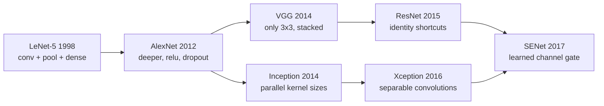

Every architecture below is famous for one idea. This page rebuilds six of those
ideas in miniature, trains them on the same 6,000 Fashion-MNIST rows with the same
budget, and reports what each one actually bought — which is not always what the
original paper's headline suggests, because the headline was earned at a scale a
CPU cannot reach.

Read the numbers as **what these ideas do at toy scale**, not as a reproduction of
ImageNet results. That gap is itself one of the lessons.

## What you'll learn

- The ideas in order: LeNet's stack, AlexNet's scale, VGG's 3×3 discipline,
  Inception's parallel branches, ResNet's shortcut, Xception's separable
  convolutions, SENet's channel gate.
- Six miniatures measured, where **VGG-ish won at 0.8800** and **Xception-ish
  reached 0.5773 with 4,714 parameters** — 99% smaller.
- Residual connections at 4 and 12 convolutions: **+0.0260 from depth against
  plain's +0.0033**, but plain still finished ahead overall.
- Why that is the expected result at this depth, and what it takes for ResNet's
  claim to show up.
- Depthwise-separable convolution counted exactly: **5.6× to 8.8×** fewer
  parameters.
- A real bug this page hit first: BN's moving statistics made every validation
  score meaningless until the momentum was lowered.

## The line of descent



Each step solved the problem the previous one created. LeNet showed the pattern
worked; AlexNet showed scale mattered; VGG showed uniform small kernels beat
hand-tuned ones; Inception attacked the cost of that uniformity; ResNet made depth
trainable; Xception and SENet attacked cost and channel weighting.

### LeNet-5 (1998)

Two convolution-and-pooling blocks then a small dense head. It established the
template every later network kept: **alternate feature extraction with
downsampling, then classify**.

### AlexNet (2012)

The same shape, eight layers deep, with ReLU instead of tanh, dropout, and enough
GPU memory to matter. Its contribution was not an idea but a demonstration — that
depth plus data plus compute beat every hand-designed feature pipeline.

### VGG (2014)

One rule: **every convolution is 3×3, every pool is 2×2, and the channel count
doubles at each stage.** The
[receptive-field arithmetic](/deep-learning/phase-03---computer-vision-with-cnns/intro-to-convolutional-neural-networks-cnn-for-images/)
justifies it — two 3×3 layers cover a 5×5 window with 18 weights per channel pair
instead of 25, with an extra nonlinearity.

### Inception / GoogLeNet (2014)

Rather than choosing a kernel size, run 1×1, 3×3, 5×5 and pooling **in parallel**
and concatenate. The 1×1 convolutions before the expensive branches cut the channel
count first, which is where the parameter saving comes from.

### ResNet (2015)

$$
\mathbf{y} = \mathcal{F}(\mathbf{x}) + \mathbf{x}
$$

The block learns a *residual* — what to add to its input, rather than the output
itself. If the best thing a block can do is nothing, it can output zero, which is
easy. The gradient also reaches earlier layers through the shortcut without passing
through the weights, which is what let 152-layer networks train.

```python title="The ordering matters more than it looks"
shortcut = x
y = Conv2D(32, 3, padding="same", use_bias=False)(x)
y = BatchNormalization()(y)
y = Activation("relu")(y)
y = Conv2D(32, 3, padding="same", use_bias=False)(y)
y = BatchNormalization()(y)
x = Add()([y, shortcut])
x = Activation("relu")(x)          # after the merge, not before
```

Putting the ReLU *before* the add and none after is a real trap, and it is the
first thing I got wrong building this page: the block then adds non-negative values
at every depth, activations grow without bound, and the deeper network gets *worse*
— which looks like evidence against residual connections and is actually a bug.

### Xception (2016)

Replace each convolution with a **depthwise** pass (one filter per input channel)
followed by a **pointwise** 1×1 mixing step:

$$
\underbrace{k^2 c_{\text{in}} c_{\text{out}}}_{\text{standard}}
\quad\longrightarrow\quad
\underbrace{k^2 c_{\text{in}}}_{\text{depthwise}} + \underbrace{c_{\text{in}} c_{\text{out}}}_{\text{pointwise}}
$$

<Figure
  src="/images/dl/phase-03-vision/famous-architectures/separable-savings"
  alt="Log-log plot of parameters per layer against channel count for standard and separable convolution. The standard curve rises from 2,320 to 2,359,808 while the separable one rises from 416 to 267,264, with the ratio annotated growing from 5.6x to 8.8x."
  title="Depthwise-separable convolution, counted exactly"
  caption="At 16 channels a separable layer saves 5.6x; at 512 it saves 8.8x. The saving grows with channel count because the standard layer's cost is quadratic in channels while the depthwise part is linear. The ceiling is the kernel area — 3x3 = 9 — which is why the ratio approaches but never reaches 9."
/>

| Channels in and out | Standard 3×3 | Separable 3×3 | Ratio |
| --- | --- | --- | --- |
| 16 | 2,320 | 416 | 5.6× |
| 64 | 36,928 | 4,736 | 7.8× |
| 256 | 590,080 | 68,096 | 8.7× |
| 512 | **2,359,808** | **267,264** | **8.8×** |

### SENet (2017)

Squeeze each channel to one number with global pooling, pass those through a tiny
two-layer network, and use the sigmoid output to **rescale each channel**. It is a
learned answer to "which feature maps matter for this image", and it costs almost
nothing.

## Six miniatures, one dataset

Each model below is a small version of one idea, trained identically: 6,000
Fashion-MNIST rows, 8 epochs, Adam at 1e-3, same seed.

<Figure
  src="/images/dl/phase-03-vision/famous-architectures/architecture-families"
  alt="Scatter of best validation accuracy against parameter count on a log axis for six miniature architectures. Xception-ish sits far left at 4,714 parameters and 0.577; VGG-ish sits far right at 467,818 and 0.880; LeNet-ish, Inception-ish, ResNet-ish and SENet-ish fall in between."
  title="Miniature versions of six ideas, same data and budget"
  caption="Accuracy tracks parameter count on this problem more than it tracks cleverness: VGG-ish has 99 times Xception-ish's parameters and 0.30 more accuracy. Inception-ish is the slowest at 306.7 seconds — its parallel 5x5 branch runs at full resolution — while returning 0.6913. None of these is a fair reproduction; they are the same ideas at 1/1000 of the scale that made them famous."
/>

| Miniature | Parameters | Best val accuracy | Seconds |
| --- | --- | --- | --- |
| LeNet-ish | 61,706 | 0.7860 | **20.6** |
| VGG-ish | **467,818** | **0.8800** | 128.8 |
| Inception-ish | 56,394 | 0.6913 | **306.7** |
| ResNet-ish | 38,122 | 0.8173 | 129.1 |
| Xception-ish | **4,714** | **0.5773** | 57.8 |
| SENet-ish | 31,394 | 0.6753 | 99.2 |

Three honest readings:

1. **Parameter count explains most of the ranking.** VGG-ish is the biggest and the
   best. At this scale the architectural ideas are competing on a problem too small
   to reward them.
2. **Xception-ish is the interesting row.** 4,714 parameters — 1% of VGG-ish's — for
   0.5773. Whether that is a bad result or a remarkable one depends entirely on
   whether you are counting accuracy or bytes.
3. **Inception-ish cost the most time and returned mid-table accuracy.** Its 5×5
   branch runs at full resolution, which is exactly the cost the real GoogLeNet
   avoided with 1×1 bottlenecks — mine has them, and it is still the slowest.

## Does the shortcut help? Measured

The claim that made ResNet famous is that *plain* deep networks get worse with
depth while residual ones keep improving. Tested at 4 and 12 convolutions:

<Figure
  src="/images/dl/phase-03-vision/famous-architectures/residual-depth"
  alt="Two panels. Left: validation accuracy per epoch for plain and residual stacks at two depths, all converging near 0.85 except the residual 12-convolution run which collapses to 0.70 on the last epoch. Right: training loss on a log axis, where the deeper models of both kinds reach lower loss than the shallower ones."
  title="Plain against residual at two depths"
  caption="The deeper models reach lower training loss in both families, so depth is helping the fit. On validation, plain 12 convolutions reached 0.8500 against residual's 0.8433, and the residual run's last epoch collapsed from a best of 0.8433 to 0.6987 — the instability is visible in the left panel. Depth helped the residual family more (+0.0260 against +0.0033) but from a lower starting point."
/>

| Model | Parameters | Best val accuracy | Final val | Final train loss | Seconds |
| --- | --- | --- | --- | --- | --- |
| plain, 4 convs | 38,122 | 0.8467 | 0.8467 | 0.3953 | 117.0 |
| plain, 12 convs | 112,874 | **0.8500** | 0.8500 | 0.2701 | 262.4 |
| residual, 4 convs | 38,122 | 0.8173 | 0.8073 | 0.4105 | 117.6 |
| residual, 12 convs | 112,874 | 0.8433 | **0.6987** | **0.2339** | 235.4 |

**The headline ResNet result did not reproduce, and it should not have.** At twelve
convolutions with batch normalisation there is no degradation problem to fix — the
plain network trains perfectly well, reaching 0.8500. The shortcut has nothing to
rescue.

What *is* visible is the direction of the effect:

- **Depth helped the residual family eight times more** (+0.0260 against +0.0033).
  Extrapolating that trend is exactly the argument the ResNet paper makes — it just
  needs tens of layers before the plain network starts losing.
- **The residual model reached the lowest training loss** (0.2339), so the shortcut
  is doing its job on optimisation; it is generalisation where it lost.
- **The residual run was unstable at the end**, dropping from 0.8433 to 0.6987 in
  one epoch. With shortcuts the effective learning rate on the residual branch is
  higher, and a fixed rate that suits the plain network can be too large here.

If you want to see the degradation ResNet fixes, you need 30+ layers, and on a CPU
that is hours. The honest statement is: **residual connections are insurance
against depth, and at twelve layers you are not yet paying premiums.**

## The bug that made every number meaningless

The first version of this page reported validation accuracies of **0.11 to 0.20**
while training loss sat at 0.30–0.46 — a model fitting its training data at ~85%
and scoring near chance on validation.

The cause was not the architecture. Every model here uses batch normalisation, and
at Keras' default `momentum=0.99` the moving statistics need roughly **460 batches**
to get within 1% of the truth — measured on the [batch normalisation
page](/deep-learning/phase-02---training-deep-neural-networks/batch-normalization/).
These runs are 6,000 rows at batch 128 for 8 epochs, which is **376 batches**. The
inference path was normalising with statistics that had never converged.

```python title="One argument, and the numbers became real"
keras.layers.BatchNormalization(momentum=0.9)   # ~45 batches, not ~460
```

| | Validation accuracy, plain 12 convs |
| --- | --- |
| `momentum=0.99` (default), 376 batches | **0.1540** |
| `momentum=0.9`, 376 batches | **0.8500** |

Same architecture, same data, same weights-in-training — a factor of five in the
reported score, from one hyperparameter that has nothing to do with learning. **Any
short run with batch normalisation should lower the momentum**, and any surprisingly
bad validation score on a BN model should send you here first.

```p5 title="Count a block's parameters" desc="Build one block from each family and read the parameter count, computed with the same arithmetic Keras uses." height="330"
const CHANNELS = [16, 32, 64, 128, 256];
let index = 2;
function setup() {
  createCanvas(600, 330);
  textFont("monospace");
}
function draw() {
  background(13, 17, 23);
  noStroke();
  const c = CHANNELS[index];
  const rows = [
    ["VGG: two Conv2D(C, 3x3)", 2 * (9 * c * c + c),
      "9*C*C+C, twice"],
    ["ResNet: same two, plus a shortcut", 2 * (9 * c * c + c),
      "Add() has no weights"],
    ["Inception: 1x1, 3x3, 5x5, pool+1x1",
      (c * c + c) + (9 * c * c + c) + (25 * c * c + c) + (c * c + c),
      "four branches, C/1 each"],
    ["Xception: SeparableConv2D(C, 3x3)", 9 * c + c * c + c,
      "9*C depthwise + C*C pointwise"],
    ["SENet gate: two tiny Dense layers", c * (c / 4) + c / 4 + (c / 4) * c + c,
      "squeeze to C/4 and back"],
  ];
  fill(230);
  textSize(12);
  textAlign(LEFT, TOP);
  text("one block, C = " + c + " channels in and out", 44, 24);
  const biggest = Math.max(...rows.map((r) => r[1]));
  for (let i = 0; i < rows.length; i++) {
    const y = 56 + i * 40;
    const [label, count, formula] = rows[i];
    const w = Math.max((count / biggest) * 250, 2);
    fill(46, 96, 140);
    rect(300, y, w, 22, 3);
    fill(210);
    textSize(11);
    textAlign(LEFT, CENTER);
    text(label, 44, y + 11);
    fill(255, 211, 67);
    text(Math.round(count).toLocaleString(), 306 + w, y + 11);
    fill(120);
    textSize(9);
    text(formula, 300, y + 30);
  }
  fill(150);
  textSize(11);
  textAlign(LEFT, TOP);
  text("Inception costs the most because its 5x5 branch alone is 25*C*C", 44, 262);
  text("Xception costs the least: 9*C instead of 9*C*C for the spatial part",
    44, 278);
  for (let i = 0; i < CHANNELS.length; i++) {
    const x = 44 + i * 84;
    fill(i === index ? 46 : 90, i === index ? 96 : 100, i === index ? 140 : 114);
    rect(x, 300, 76, 22, 3);
    fill(240);
    textSize(11);
    textAlign(CENTER, CENTER);
    text("C = " + CHANNELS[i], x + 38, 311);
  }
}
function mousePressed() {
  if (mouseY < 300 || mouseY > 322) return;
  for (let i = 0; i < CHANNELS.length; i++) {
    const x = 44 + i * 84;
    if (mouseX > x && mouseX < x + 76) index = i;
  }
}
```

```p5 title="The measured table, ranked" desc="Click a column to rank every row by it. The bars are that column's values and the highest and lowest are computed from the numbers, not written in." height="306"
let metric = 0;
const COLUMNS = ["Parameters", "Best val accuracy", "Seconds"];
const ROWS = [
  ["LeNet-ish", 61706, 0.786, 20.6],
  ["VGG-ish", 467818, 0.88, 128.8],
  ["Inception-ish", 56394, 0.6913, 306.7],
  ["ResNet-ish", 38122, 0.8173, 129.1],
  ["Xception-ish", 4714, 0.5773, 57.8],
  ["SENet-ish", 31394, 0.6753, 99.2]
];
function setup() {
  createCanvas(620, 306);
  textFont("monospace");
}
function fmt(v) {
  if (v === 0) { return "0"; }
  const a = Math.abs(v);
  if (a >= 1000 || a < 0.001) { return v.toExponential(2); }
  if (a >= 100) { return v.toFixed(1); }
  return v.toFixed(4);
}
function draw() {
  background(13, 17, 23);
  noStroke();
  fill(230);
  textSize(12);
  textAlign(LEFT, TOP);
  text("Famous CNN Architectures (LeNet to", 26, 16);
  let x = 26;
  for (let i = 0; i < COLUMNS.length; i++) {
    const w = COLUMNS[i].length * 6.6 + 16;
    if (i === metric) { fill(255, 211, 67); } else { fill(48, 56, 68); }
    rect(x, 40, w, 22, 4);
    if (i === metric) { fill(13, 17, 23); } else { fill(180); }
    textSize(9);
    text(COLUMNS[i], x + 8, 47);
    x += w + 6;
    if (x > 500) { break; }
  }
  const values = ROWS.map((r) => r[metric + 1]);
  const lo = Math.min(...values);
  const hi = Math.max(...values);
  const span = hi - lo === 0 ? 1 : hi - lo;
  const order = ROWS.slice().sort((a, b) => b[metric + 1] - a[metric + 1]);
  for (let i = 0; i < order.length; i++) {
    const y = 78 + i * 26;
    const v = order[i][metric + 1];
    fill(160);
    textSize(9);
    text(order[i][0], 26, y + 5);
    fill(34, 40, 50);
    rect(230, y, 280, 18, 3);
    const frac = (v - lo) / span;
    if (v === hi) { fill(126, 192, 143); }
    else if (v === lo) { fill(224, 108, 117); }
    else { fill(107, 169, 221); }
    rect(230, y, Math.max(frac * 280, 3), 18, 3);
    fill(225);
    textSize(9);
    text(fmt(v), 518, y + 5);
  }
  const top = order[0];
  const bottom = order[order.length - 1];
  fill(150);
  textSize(9);
  const base = 78 + order.length * 26 + 8;
  text("highest " + COLUMNS[metric] + ": " + top[0] + " at " + fmt(top[1]),
       26, base);
  text("lowest  " + COLUMNS[metric] + ": " + bottom[0] + " at "
       + fmt(bottom[1]), 26, base + 14);
  text("bars are scaled within the chosen column - lowest is not zero", 26,
       base + 30);
}
function mousePressed() {
  let x = 26;
  for (let i = 0; i < COLUMNS.length; i++) {
    const w = COLUMNS[i].length * 6.6 + 16;
    if (mouseX > x && mouseX < x + w && mouseY > 40 && mouseY < 62) {
      metric = i;
    }
    x += w + 6;
  }
}
```

## Pitfalls

- **Putting the ReLU before a residual add.** Activations then grow with depth and
  the deeper network gets worse — a bug that looks like a finding.
- **Leaving BN at `momentum=0.99` on a short run.** It cost a factor of five in the
  reported validation accuracy here.
- **Expecting ResNet's headline at twelve layers.** There is no degradation to fix
  until the plain network starts losing, which takes tens of layers.
- **Reading a toy-scale ranking as an architectural verdict.** Parameter count
  explained most of the ordering above.
- **Running 5×5 branches at full resolution.** Inception-ish was the slowest model
  here despite having 1×1 bottlenecks.
- **Assuming separable convolutions always save 9×.** The ceiling is the kernel
  area; measured savings ran 5.6× to 8.8×.
- **Comparing architectures without holding the budget fixed.** Same seed, same
  epochs, same data, or the comparison means nothing.

## Recap

- The line runs LeNet → AlexNet → VGG → Inception → ResNet → Xception → SENet, each
  solving the previous step's problem.
- Six miniatures on 6,000 rows: VGG-ish 0.8800 at 467,818 parameters, ResNet-ish
  0.8173, LeNet-ish 0.7860, Inception-ish 0.6913, SENet-ish 0.6753, Xception-ish
  0.5773 at 4,714 parameters.
- Depthwise-separable convolution saves 5.6× at 16 channels and 8.8× at 512, with
  the kernel area as the ceiling.
- Plain beat residual at both depths (0.8500 against 0.8433), but depth helped the
  residual family eight times more — the direction of the ResNet claim without the
  scale to demonstrate it.
- The residual model reached the lowest training loss and the least stable
  validation curve, collapsing 0.8433 → 0.6987 in one epoch.
- Batch normalisation at the default momentum made every validation number on this
  page meaningless until it was lowered to 0.9.

## Next

Every model here was trained from random weights on a few thousand images. Starting
from weights someone else already paid for changes the arithmetic completely:
[Transfer Learning Using Pre-trained Models](/deep-learning/phase-03---computer-vision-with-cnns/transfer-learning-using-pre-trained-models/).

<Quiz
  questions={[
    {
      q: "A residual network's validation accuracy gets worse as you add blocks, while its training loss improves. You wrote the block as conv-BN-relu, then Add. What is wrong?",
      options: [
        "The shortcut needs a 1x1 convolution to match dimensions",
        "The ReLU belongs after the merge, not before it — as written, the block adds non-negative values at every depth, so activations grow without bound as the network deepens",
        "Residual connections require more than twelve layers to help",
        "Batch normalisation should come after the ReLU",
      ],
      answer: 1,
      explain: "The classic ordering is conv-BN-relu-conv-BN, then Add, then ReLU. This exact mistake produced a result that looked like evidence against ResNet.",
    },
    {
      q: "Your BN-based model trains to 0.85 training accuracy but validates at 0.15 after 8 epochs on 6,000 rows at batch 128. What should you check first?",
      options: [
        "Whether the validation set is mislabelled",
        "The BatchNormalization momentum — at the default 0.99 the moving statistics need about 459 batches to converge, and this run has only 376, so the inference path normalises with wrong statistics",
        "Whether the learning rate is too high",
        "Whether the model needs more regularisation",
      ],
      answer: 1,
      explain: "Measured: 0.1540 at momentum=0.99 against 0.8500 at momentum=0.9, same architecture and data. Short runs should lower the momentum.",
    },
    {
      q: "Xception-ish reached 0.5773 with 4,714 parameters while VGG-ish reached 0.8800 with 467,818. Which is the better architecture?",
      options: [
        "VGG-ish, because accuracy is what matters",
        "Neither answer is available from this table alone — VGG-ish wins on accuracy and Xception-ish wins by two orders of magnitude on size, so the choice depends on whether you are constrained by accuracy or by bytes",
        "Xception-ish, because efficiency always wins",
        "They are equivalent once normalised by parameter count",
      ],
      answer: 1,
      explain: "Separable convolutions were designed for a deployment constraint. On a toy problem with no constraint, the bigger model simply wins.",
    },
    {
      q: "Why do two stacked 3x3 convolutions appear everywhere after VGG?",
      options: [
        "Because 3x3 is the smallest kernel that can detect edges",
        "Because they cover the same 5x5 receptive field as one 5x5 layer using 18 weights per channel pair instead of 25, and add an extra nonlinearity between them",
        "Because GPUs only optimise 3x3 convolutions",
        "Because larger kernels cannot be padded correctly",
      ],
      answer: 1,
      explain: "Fewer parameters and more nonlinearity for the same field. That single observation is most of VGG's contribution.",
    },
    {
      q: "Depthwise-separable convolution saved 5.6x at 16 channels and 8.8x at 512. Why does the saving grow, and what is its limit?",
      options: [
        "It grows without limit as channels increase",
        "The standard cost is quadratic in channels while the depthwise part is linear, so the ratio approaches the kernel area — 9 for a 3x3 kernel — without ever reaching it",
        "It is limited by the number of filters, not the kernel",
        "The saving is constant and the measurements are noise",
      ],
      answer: 1,
      explain: "Standard is k^2*Cin*Cout; separable is k^2*Cin + Cin*Cout. As Cout grows the first term stops mattering and the ratio tends to k^2.",
    },
  ]}
/>

## 🧪 Try It Yourself

<DataCampExercise
  lang="python"
  hint={`Standard convolution costs kernel area times input channels times output channels. Separable splits that into a depthwise part (kernel area times channels) and a pointwise part (channels times channels).`}
  code={`# Task: Exercise 1 - Count separable against standard convolution
print(f"{'channels':>9} {'standard':>12} {'separable':>11} {'ratio':>7}")
for c in (16, 32, 64, 128, 256, 512):
    standard = 3 * 3 * c * c + c
    separable = 3 * 3 * c + c * ___ + c            # replace ___ with c
    print(f"{c:9d} {standard:12,} {separable:11,} "
          f"{standard / separable:6.1f}x")
print("the ratio approaches the kernel area (9 for 3x3) but never reaches it,")
print("because the depthwise term never disappears")

# -- Expected Output -------------------------------------------
#  channels     standard   separable   ratio
#        16        2,320         416    5.6x
#        32        9,248       1,344    6.9x
#        64       36,928       4,736    7.8x
#       128      147,584      17,664    8.4x
#       256      590,080      68,096    8.7x
#       512    2,359,808     267,264    8.8x
# the ratio approaches the kernel area (9 for 3x3) but never reaches it,
# because the depthwise term never disappears
# --------------------------------------------------------------`}
  solution={`print(f"{'channels':>9} {'standard':>12} {'separable':>11} {'ratio':>7}")
for c in (16, 32, 64, 128, 256, 512):
    standard = 3 * 3 * c * c + c
    separable = 3 * 3 * c + c * c + c
    print(f"{c:9d} {standard:12,} {separable:11,} "
          f"{standard / separable:6.1f}x")
print("the ratio approaches the kernel area (9 for 3x3) but never reaches it,")
print("because the depthwise term never disappears")`}
  sct={`test_output_contains("2,359,808     267,264    8.8x", pattern=False)
test_output_contains("2,320         416    5.6x", pattern=False)
success_msg("Separable convolution is about 9 times cheaper for 3x3 kernels at wide layers, and the ratio approaches the kernel area without reaching it.")`}
  height={363}
/>

<DataCampExercise
  lang="python"
  hint={`Add contributes no weights. Put the activation after the merge - before it, the block can only ever add non-negative values to the shortcut.`}
  code={`# Task: Exercise 2 - Build a residual block the right way round
import numpy as np


def norm(z):
    return (z - z.mean(axis=0)) / (z.std(axis=0) + 1e-5)


def residual_block(x, r, correct=True):
    width = x.shape[1]
    shortcut = x
    w1 = r.randn(width, width) * np.sqrt(2.0 / width)
    w2 = r.randn(width, width) * np.sqrt(2.0 / width)
    y = np.maximum(norm(x @ w1), 0)
    y = norm(y @ w2)
    if correct:
        merged = y + shortcut
        return np.maximum(merged, 0)
    y = np.maximum(y, 0)
    return y + ___   # replace ___ with shortcut


results = {}
for correct in (True, False):
    r = np.random.RandomState(0)
    x = np.random.RandomState(1).randn(256, 32)
    means = []
    for _ in range(6):
        x = residual_block(x, r, correct=correct)
        means.append(float(x.mean()))
    label = "relu after Add" if correct else "relu before Add"
    results[label] = means
    print(label, "mean activation by block:", [round(m, 2) for m in means])
print("with the relu before the merge the mean activation climbs with every block:",
      all(b > a for a, b in zip(results["relu before Add"], results["relu before Add"][1:])))
print("the climb is larger than with the relu after the merge:",
      results["relu before Add"][-1] > results["relu after Add"][-1])
print("that drift is what makes a deeper 'residual' network perform worse")`}
  solution={`import numpy as np


def norm(z):
    return (z - z.mean(axis=0)) / (z.std(axis=0) + 1e-5)


def residual_block(x, r, correct=True):
    width = x.shape[1]
    shortcut = x
    w1 = r.randn(width, width) * np.sqrt(2.0 / width)
    w2 = r.randn(width, width) * np.sqrt(2.0 / width)
    y = np.maximum(norm(x @ w1), 0)
    y = norm(y @ w2)
    if correct:
        merged = y + shortcut
        return np.maximum(merged, 0)
    y = np.maximum(y, 0)
    return y + shortcut


results = {}
for correct in (True, False):
    r = np.random.RandomState(0)
    x = np.random.RandomState(1).randn(256, 32)
    means = []
    for _ in range(6):
        x = residual_block(x, r, correct=correct)
        means.append(float(x.mean()))
    label = "relu after Add" if correct else "relu before Add"
    results[label] = means
    print(label, "mean activation by block:", [round(m, 2) for m in means])
print("with the relu before the merge the mean activation climbs with every block:",
      all(b > a for a, b in zip(results["relu before Add"], results["relu before Add"][1:])))
print("the climb is larger than with the relu after the merge:",
      results["relu before Add"][-1] > results["relu after Add"][-1])
print("that drift is what makes a deeper 'residual' network perform worse")`}
  sct={`test_output_contains("with the relu before the merge the mean activation climbs with every block: True", pattern=False)
test_output_contains("the climb is larger than with the relu after the merge: True", pattern=False)
success_msg("Putting the relu before the merge means every block can only add non-negative values to the shortcut, so the activations drift upwards block after block.")`}
  height={460}
/>

<DataCampExercise
  lang="python"
  hint={`Only the momentum changes. The gap between the moving average and the true statistic is what the inference path would suffer from.`}
  code={`# Task: Exercise 3 - The BN momentum that decides whether your score is real
import numpy as np

EPOCHS, BATCH, ROWS = 8, 128, 6000
batches = int(np.ceil(ROWS / BATCH)) * EPOCHS
print("8 epochs at batch 128 over", ROWS, "rows =", batches, "batches")
for momentum in (0.99, 0.9):
    needed = 1
    estimate = 0.0
    while estimate < 0.99:
        estimate = momentum * estimate + (1 - momentum) * 1.0
        needed += 1
    print("  momentum", momentum, ": needs about", needed, "batches to be within 1%")

# The true activation mean drifts while the weights are still changing.
true_mean = np.linspace(0.0, 5.0, batches)
errors = {}
for momentum in (0.99, ___):   # replace ___ with 0.9
    moving = 0.0
    for t in range(batches):
        moving = momentum * moving + (1 - momentum) * true_mean[t]
    errors[momentum] = abs(moving - true_mean[-1])
    print("momentum", momentum, ": moving mean lags the true mean by", round(errors[momentum], 3))
print("the moving average lags much further behind with momentum 0.99:", errors[0.99] > 5 * errors[0.9])
print("the training path is fine in both runs - only the inference path,")
print("which uses the moving statistics, suffers, and only with the larger momentum")`}
  solution={`import numpy as np

EPOCHS, BATCH, ROWS = 8, 128, 6000
batches = int(np.ceil(ROWS / BATCH)) * EPOCHS
print("8 epochs at batch 128 over", ROWS, "rows =", batches, "batches")
for momentum in (0.99, 0.9):
    needed = 1
    estimate = 0.0
    while estimate < 0.99:
        estimate = momentum * estimate + (1 - momentum) * 1.0
        needed += 1
    print("  momentum", momentum, ": needs about", needed, "batches to be within 1%")

# The true activation mean drifts while the weights are still changing.
true_mean = np.linspace(0.0, 5.0, batches)
errors = {}
for momentum in (0.99, 0.9):
    moving = 0.0
    for t in range(batches):
        moving = momentum * moving + (1 - momentum) * true_mean[t]
    errors[momentum] = abs(moving - true_mean[-1])
    print("momentum", momentum, ": moving mean lags the true mean by", round(errors[momentum], 3))
print("the moving average lags much further behind with momentum 0.99:", errors[0.99] > 5 * errors[0.9])
print("the training path is fine in both runs - only the inference path,")
print("which uses the moving statistics, suffers, and only with the larger momentum")`}
  sct={`test_output_contains("momentum 0.99 : needs about 460 batches to be within 1%", pattern=False)
test_output_contains("momentum 0.9 : needs about 45 batches to be within 1%", pattern=False)
test_output_contains("the moving average lags much further behind with momentum 0.99: True", pattern=False)
success_msg("With momentum 0.99 the moving statistics need about 460 batches to settle, longer than this whole run, so inference uses stale numbers even though training looked fine.")`}
  height={460}
/>

<DataCampExercise
  lang="python"
  hint={`Concatenate the four branch outputs along the channel axis, which is the last axis of a height x width x channels array.`}
  code={`# Task: Exercise 4 - Build an Inception block and count its cost
import numpy as np

rng = np.random.RandomState(0)
H = W = 14


def conv_same(x, kernel, bias):
    """Stride-1 convolution with 'same' padding. kernel: (k, k, in, out)."""
    k = kernel.shape[0]
    pad = k // 2
    padded = np.pad(x, ((pad, pad), (pad, pad), (0, 0)))
    out = np.zeros((H, W, kernel.shape[3])) + bias
    for i in range(k):
        for j in range(k):
            out += padded[i:i + H, j:j + W, :] @ kernel[i, j]
    return np.maximum(out, 0)


def max_pool_same(x, size=3):
    pad = size // 2
    padded = np.pad(x, ((pad, pad), (pad, pad), (0, 0)), constant_values=-np.inf)
    stacked = [padded[i:i + H, j:j + W, :] for i in range(size) for j in range(size)]
    return np.max(stacked, axis=0)


def make_conv(k, cin, cout):
    return rng.randn(k, k, cin, cout) * np.sqrt(2.0 / (k * k * cin)), np.zeros(cout)


x = rng.randn(H, W, 32)
branches = {"1x1": make_conv(1, 32, 16), "3x3": make_conv(3, 32, 16), "5x5": make_conv(5, 32, 16),
            "pool then 1x1": make_conv(1, 32, 16)}
one = conv_same(x, *branches["1x1"])
three = conv_same(x, *branches["3x3"])
five = conv_same(x, *branches["5x5"])
pooled = conv_same(max_pool_same(x), *branches["pool then 1x1"])
merged = np.concatenate([one, three, five, pooled], axis=___)   # replace ___ with -1

print("input (14, 14, 32) -> output", merged.shape)
total = 0
for label, (kernel, bias) in branches.items():
    count = kernel.size + bias.size
    total += count
    print(format(label, "22s"), format(count, "12,"))
print(format("block total", "22s"), format(total, "12,"))
single = 3 * 3 * 32 * 64 + 64
print("one Conv2D(64, 3x3) for the same 64 output channels:", format(single, ","))
print("the four branches concatenate to 64 channels:", merged.shape[-1] == 64)
print("the 5x5 branch alone is 25/9 times a 3x3 branch, which is why the real")
print("GoogLeNet puts a 1x1 bottleneck in front of it")`}
  solution={`import numpy as np

rng = np.random.RandomState(0)
H = W = 14


def conv_same(x, kernel, bias):
    """Stride-1 convolution with 'same' padding. kernel: (k, k, in, out)."""
    k = kernel.shape[0]
    pad = k // 2
    padded = np.pad(x, ((pad, pad), (pad, pad), (0, 0)))
    out = np.zeros((H, W, kernel.shape[3])) + bias
    for i in range(k):
        for j in range(k):
            out += padded[i:i + H, j:j + W, :] @ kernel[i, j]
    return np.maximum(out, 0)


def max_pool_same(x, size=3):
    pad = size // 2
    padded = np.pad(x, ((pad, pad), (pad, pad), (0, 0)), constant_values=-np.inf)
    stacked = [padded[i:i + H, j:j + W, :] for i in range(size) for j in range(size)]
    return np.max(stacked, axis=0)


def make_conv(k, cin, cout):
    return rng.randn(k, k, cin, cout) * np.sqrt(2.0 / (k * k * cin)), np.zeros(cout)


x = rng.randn(H, W, 32)
branches = {"1x1": make_conv(1, 32, 16), "3x3": make_conv(3, 32, 16), "5x5": make_conv(5, 32, 16),
            "pool then 1x1": make_conv(1, 32, 16)}
one = conv_same(x, *branches["1x1"])
three = conv_same(x, *branches["3x3"])
five = conv_same(x, *branches["5x5"])
pooled = conv_same(max_pool_same(x), *branches["pool then 1x1"])
merged = np.concatenate([one, three, five, pooled], axis=-1)

print("input (14, 14, 32) -> output", merged.shape)
total = 0
for label, (kernel, bias) in branches.items():
    count = kernel.size + bias.size
    total += count
    print(format(label, "22s"), format(count, "12,"))
print(format("block total", "22s"), format(total, "12,"))
single = 3 * 3 * 32 * 64 + 64
print("one Conv2D(64, 3x3) for the same 64 output channels:", format(single, ","))
print("the four branches concatenate to 64 channels:", merged.shape[-1] == 64)
print("the 5x5 branch alone is 25/9 times a 3x3 branch, which is why the real")
print("GoogLeNet puts a 1x1 bottleneck in front of it")`}
  sct={`test_output_contains("input (14, 14, 32) -> output (14, 14, 64)", pattern=False)
test_output_contains("block total", pattern=False)
test_output_contains("the four branches concatenate to 64 channels: True", pattern=False)
success_msg("Four parallel branches with different receptive fields concatenate along the channel axis into 64 channels, at a cost comparable to a single 3x3 convolution.")`}
  height={460}
/>

<DataCampExercise
  lang="python"
  hint={`Global pooling squeezes each channel to one number, a tiny bottleneck learns per-channel weights, and a sigmoid keeps each weight between 0 and 1 before multiplying.`}
  code={`# Task: Exercise 5 - Build the SENet channel gate
import numpy as np

CHANNELS = 64
rng = np.random.RandomState(0)
sigmoid = lambda z: 1 / (1 + np.exp(-z))
relu = lambda z: np.maximum(z, 0)

w1 = rng.randn(CHANNELS, CHANNELS // 4) * np.sqrt(2.0 / CHANNELS)
b1 = np.zeros(CHANNELS // 4)
w2 = rng.randn(CHANNELS // 4, CHANNELS) * np.sqrt(2.0 / (CHANNELS // 4)) * 0.1
b2 = np.zeros(CHANNELS)

probe = rng.randn(4, 14, 14, CHANNELS)
squeeze = probe.mean(axis=(1, 2))                   # global average pooling
squeeze = relu(squeeze @ w1 + b1)
gate = ___(squeeze @ w2 + b2)   # replace ___ with sigmoid
weights = gate.reshape(4, 1, 1, CHANNELS)
gated = probe * weights

params = w1.size + b1.size + w2.size + b2.size
conv = 3 * 3 * CHANNELS * CHANNELS + CHANNELS
print("gate parameters:", format(params, ","))
print("a Conv2D(64, 3x3) on 64 channels:", format(conv, ","))
print("the gate is", format(params / conv, ".1%"), "of one convolution")
print("output keeps the input shape:", gated.shape == probe.shape)
print("every gate value is strictly between 0 and 1:", bool(gate.min() > 0 and gate.max() < 1))
print("an untrained gate sits near 0.5 for every channel:", bool(abs(gate.mean() - 0.5) < 0.1))
print("training teaches it which feature maps to turn up for a given image")`}
  solution={`import numpy as np

CHANNELS = 64
rng = np.random.RandomState(0)
sigmoid = lambda z: 1 / (1 + np.exp(-z))
relu = lambda z: np.maximum(z, 0)

w1 = rng.randn(CHANNELS, CHANNELS // 4) * np.sqrt(2.0 / CHANNELS)
b1 = np.zeros(CHANNELS // 4)
w2 = rng.randn(CHANNELS // 4, CHANNELS) * np.sqrt(2.0 / (CHANNELS // 4)) * 0.1
b2 = np.zeros(CHANNELS)

probe = rng.randn(4, 14, 14, CHANNELS)
squeeze = probe.mean(axis=(1, 2))                   # global average pooling
squeeze = relu(squeeze @ w1 + b1)
gate = sigmoid(squeeze @ w2 + b2)
weights = gate.reshape(4, 1, 1, CHANNELS)
gated = probe * weights

params = w1.size + b1.size + w2.size + b2.size
conv = 3 * 3 * CHANNELS * CHANNELS + CHANNELS
print("gate parameters:", format(params, ","))
print("a Conv2D(64, 3x3) on 64 channels:", format(conv, ","))
print("the gate is", format(params / conv, ".1%"), "of one convolution")
print("output keeps the input shape:", gated.shape == probe.shape)
print("every gate value is strictly between 0 and 1:", bool(gate.min() > 0 and gate.max() < 1))
print("an untrained gate sits near 0.5 for every channel:", bool(abs(gate.mean() - 0.5) < 0.1))
print("training teaches it which feature maps to turn up for a given image")`}
  sct={`test_output_contains("gate parameters: 2,128", pattern=False)
test_output_contains("the gate is 5.8% of one convolution", pattern=False)
test_output_contains("output keeps the input shape: True", pattern=False)
test_output_contains("every gate value is strictly between 0 and 1: True", pattern=False)
test_output_contains("an untrained gate sits near 0.5 for every channel: True", pattern=False)
success_msg("A squeeze-and-excite gate costs under 6% of a convolution and rescales each channel by a number between 0 and 1.")`}
  height={460}
/>
