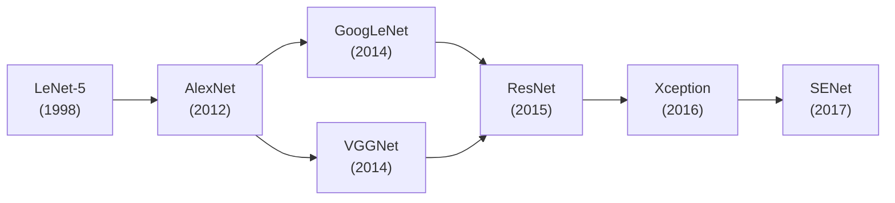

## What you'll learn

- the classic **LeNet-5** architecture that introduced convolution + pooling
- **AlexNet**, the deep-learning architecture that won ImageNet 2012
- **GoogLeNet**'s inception modules, and why 1 × 1 convolutions matter
- **VGGNet**'s "just stack more 3 × 3 convs" philosophy
- **ResNet**'s skip connections, and why they make very deep nets trainable
- **Xception**'s depthwise separable convolutions
- **SENet**'s squeeze-and-excitation blocks, which recalibrate feature maps
  by channel

A good way to track CNN progress is the ILSVRC ImageNet competition: the
top-five error rate for image classification fell from over 26% to under
2.3% in just six years, almost entirely through architecture changes.



## LeNet-5 (1998)

Created by Yann LeCun for handwritten digit recognition (MNIST), LeNet-5 is
where convolutional and pooling layers were introduced together for the
first time. It's small by modern standards: a few convolution + average
pooling pairs, ending in fully connected layers with `tanh` activations.
MNIST images (28 × 28) are zero-padded to 32 × 32 before being fed in.

## AlexNet (2012)

AlexNet crushed the 2012 ImageNet competition — a 17% top-five error rate
versus 26% for the runner-up. It's similar to LeNet-5, "only much larger and
deeper," and it was the first architecture to stack convolutional layers
directly on top of each other instead of always pairing conv → pool. Its key
innovations:

- **ReLU** activation instead of `tanh`/sigmoid
- **Dropout** (50%) on the two big fully connected layers, to fight overfitting
- **Data augmentation** — random shifts, horizontal flips, and lighting
  changes, to artificially grow the training set
- **Local response normalization (LRN)** — a competitive normalization step
  where strongly activated neurons suppress neighboring feature maps at the
  same position, encouraging different filters to specialize

## GoogLeNet (2014)

GoogLeNet pushed the top-five error rate below 7%, using roughly **10 times
fewer parameters than AlexNet** (about 6 million vs. 60 million). The trick
is the **inception module**: the input is copied and fed through four
parallel branches (different kernel sizes capturing patterns at different
scales), then all the outputs are concatenated along the depth dimension.

Inception modules use `1 × 1` convolutions as **bottleneck layers**: a 1 × 1
filter can't capture any spatial pattern (it only looks at one pixel), but it
*can* capture cross-channel patterns and — crucially — reduce the number of
feature maps before the more expensive 3 × 3 and 5 × 5 convolutions run. This
cuts computation and parameter count substantially. GoogLeNet stacks nine of
these inception modules, and finishes with a **global average pooling**
layer instead of several dense layers — dropping the remaining spatial
information (which is fine, since by then the feature maps are just 7 × 7)
while sharply cutting the parameter count.

## VGGNet (2014)

VGGNet, the ILSVRC 2014 runner-up, took the opposite approach to GoogLeNet:
extreme simplicity. It repeats "2 or 3 convolutional layers + a pooling
layer" over and over — 16 or 19 convolutional layers total, depending on the
variant — using **only 3 × 3 filters**, but many of them, followed by a
dense network with 2 hidden layers.

## ResNet (2015)

Kaiming He et al. won ILSVRC 2015 with a **Residual Network (ResNet)**,
reaching a top-five error rate under 3.6% using a network **152 layers**
deep. The key innovation is the **skip connection** (shortcut connection):
the input to a layer is also added directly to the output of a layer higher
up the stack.

If you're training a network to model a target function `h(x)`, adding a
skip connection means the network is now forced to model the **residual**
`f(x) = h(x) − x` instead. This is a big deal at initialization: a freshly
initialized network's weights are close to zero, so without a skip
connection it outputs values close to zero — but *with* a skip connection it
outputs a copy of its input, i.e. it starts out modeling the identity
function. If the true target function is reasonably close to identity (often
the case), training converges dramatically faster, and gradients can flow
across the whole network even before every layer has learned something
useful.

A deep residual network is just a long stack of **residual units (RUs)**,
each with two `3 × 3` convolutions (with Batch Normalization and ReLU) and a
skip connection. When the number of filters doubles (and spatial size
halves) between blocks, the skip connection uses a `1 × 1` convolution with
stride 2 to match shapes before the addition.

```python title="resnet34.py" showLineNumbers{1}
import tensorflow as tf

class ResidualUnit(tf.keras.layers.Layer):
    def __init__(self, filters, strides=1, activation="relu", **kwargs):
        super().__init__(**kwargs)
        self.activation = tf.keras.activations.get(activation)
        self.main_layers = [
            tf.keras.layers.Conv2D(filters, 3, strides=strides, padding="same", use_bias=False),
            tf.keras.layers.BatchNormalization(),
            self.activation,
            tf.keras.layers.Conv2D(filters, 3, strides=1, padding="same", use_bias=False),
            tf.keras.layers.BatchNormalization(),
        ]
        self.skip_layers = []
        if strides > 1:
            self.skip_layers = [
                tf.keras.layers.Conv2D(filters, 1, strides=strides, padding="same", use_bias=False),
                tf.keras.layers.BatchNormalization(),
            ]

    def call(self, inputs):
        Z = inputs
        for layer in self.main_layers:
            Z = layer(Z)
        skip_Z = inputs
        for layer in self.skip_layers:
            skip_Z = layer(skip_Z)
        return self.activation(Z + skip_Z)


model = tf.keras.models.Sequential()
model.add(tf.keras.layers.Conv2D(64, 7, strides=2, input_shape=[224, 224, 3],
                                  padding="same", use_bias=False))
model.add(tf.keras.layers.BatchNormalization())
model.add(tf.keras.layers.Activation("relu"))
model.add(tf.keras.layers.MaxPool2D(pool_size=3, strides=2, padding="same"))

prev_filters = 64
for filters in [64] * 3 + [128] * 4 + [256] * 6 + [512] * 3:
    strides = 1 if filters == prev_filters else 2
    model.add(ResidualUnit(filters, strides=strides))
    prev_filters = filters

model.add(tf.keras.layers.GlobalAvgPool2D())
model.add(tf.keras.layers.Flatten())
model.add(tf.keras.layers.Dense(10, activation="softmax"))
model.summary()
```

In fewer than 40 lines, that's the architecture that won ILSVRC 2015 — a nice
demonstration of how expressive the Keras API is.

### A batch normalization detail worth memorizing

Notice `use_bias=False` on every `Conv2D` in `ResidualUnit` above, immediately
followed by a `BatchNormalization` layer. That's not an accident. Because
`BatchNormalization` re-centers its input on zero anyway, the convolution's
own bias term becomes redundant — dropping it makes the layer very slightly
leaner for free. The recommended order is also `Conv2D` (no bias) →
`BatchNormalization` → activation, i.e. apply the activation function
*after* normalizing, not before:

```python title="batchnorm_ordering.py" showLineNumbers{1}
import tensorflow as tf

# Recommended: normalize first, then activate
x = tf.keras.layers.Conv2D(32, 3, use_bias=False, padding="same")(x)
x = tf.keras.layers.BatchNormalization()(x)
x = tf.keras.layers.Activation("relu")(x)
```

The intuition: batch normalization centers your data around zero, and ReLU
uses zero as its cutoff point for keeping or dropping activations — so
normalizing *before* the activation gets the most out of that cutoff. Your
model will still train if you order it the other way, but this ordering is
the more common convention in modern architectures.

## Xception (2016)

Xception ("Extreme Inception") replaces inception modules with **depthwise
separable convolutions**. A regular convolution captures spatial patterns
(shapes) and cross-channel patterns (e.g. "mouth + nose + eyes = face") at
the same time. A depthwise separable convolution assumes these can be
modeled *separately*: first, one spatial filter runs independently per input
channel; then a `1 × 1` convolution mixes across channels. This uses fewer
parameters, less memory, and less compute than a regular convolution — and
in practice, often performs *better*.

The parameter savings are concrete, not just theoretical. Take a `3 x 3`
convolution with 64 input channels and 64 output channels:

- **Regular `Conv2D`**: `3 * 3 * 64 * 64 = 36,864` trainable parameters.
- **Depthwise separable (`SeparableConv2D`)**: `3 * 3 * 64 + 64 * 64 = 4,672`
  trainable parameters — under 13% as many.

That gap only grows as filters or kernel sizes get larger, which is exactly
why Xception can match or beat much larger regular convnets while training
on comparatively modest hardware.

:::tip[From the book]
Chollet — who literally designed Xception — notes that this parameter
savings assumes spatial patterns and cross-channel patterns can be learned
*separately*, which turns out to be a very good assumption for the image
representations convnets learn in practice. He also flags an odd real-world
wrinkle: depthwise separable convolutions haven't received nearly as much
low-level GPU optimization as regular convolutions have, so the *speed*
gains on GPU are smaller than the parameter-count math would suggest. Even
so, the lower parameter count still means less overfitting risk and faster
convergence, so it's rarely a bad default for models you're training
yourself.
:::

## SENet (2017): recalibrating feature maps

The ILSVRC 2017 winner pushed the top-five error rate down to an
astonishing **2.25%** — not with a brand-new backbone, but by bolting a
small extra block onto an *existing* architecture (inception modules and
residual units both got the treatment, producing SE-Inception and
SE-ResNet). That extra piece is the **SE block** (Squeeze-and-Excitation),
and its whole job is to **recalibrate** a layer's feature maps: for each
channel, learn a single number between 0 and 1 saying "how relevant is this
feature map right now," then multiply every feature map by its number.

The intuition: an SE block might learn that "mouth," "nose," and "eyes"
feature maps tend to activate together. If it sees strong mouth and nose
activations but only weak eye activations, that's suspicious — so it boosts
the eye feature map's weight, helping resolve genuine ambiguity instead of
just trusting whichever filters happened to fire loudest. It's a form of
attention, but purely along the **channel** dimension — an SE block never
looks for spatial patterns, only "which of my channels matter."

An SE block is only three layers deep:

1. **Global average pooling** — squeeze each feature map down to a single
   number (so 256 feature maps become a 256-length vector).
2. **A small hidden `Dense` layer with ReLU** — squeeze *that* vector down
   further, typically to 1/16th its size. This bottleneck forces the block
   to learn a compact, general summary of which features co-occur, rather
   than memorizing every combination.
3. **A `Dense` output layer with sigmoid** — expand back out to one number
   per feature map, each between 0 and 1: the recalibration weights.

```python title="se_block.py" showLineNumbers{1}
import tensorflow as tf

def se_block(x, ratio=16):
    filters = x.shape[-1]
    se = tf.keras.layers.GlobalAveragePooling2D()(x)                        # squeeze
    se = tf.keras.layers.Dense(filters // ratio, activation="relu")(se)     # bottleneck
    se = tf.keras.layers.Dense(filters, activation="sigmoid")(se)           # excite
    se = tf.keras.layers.Reshape((1, 1, filters))(se)
    return tf.keras.layers.Multiply()([x, se])   # scale each feature map by its weight
```

Dropping a `se_block()` call at the end of every inception module or
residual unit is usually all it takes — the recalibration weights are
learned end-to-end alongside everything else, with no extra supervision
needed.

## Mini-checkpoint

Which architecture introduced skip connections, and what problem do they solve?

- ResNet. They let the network default to the identity function at
  initialization and let gradients flow across very deep stacks, which is
  what made 100+ layer networks trainable in the first place.

## Visualize it

A residual unit's skip connection carries the input `x` straight to the
addition, in parallel with the main path that has to pass through several
convolutional layers — so the signal always has a fast lane through the
network, no matter how deep the main path grows:

```p5 title="Residual learning: skip connections" desc="The input x travels through the skip connection unmodified, while the main path learns a residual F(x); both are added together before the final activation." height="300"
let t = 0;
const startX = 60;
const mainY = 90, skipY = 210, sumX = 480, sumY = 150;
const stages = ["Conv 3x3", "BN", "ReLU", "Conv 3x3", "BN"];
function stageX(i) { return startX + 70 + i * 66; }
function setup() {
  createCanvas(620, 300);
  textFont("monospace");
  textAlign(CENTER, CENTER);
}
function draw() {
  background(13, 17, 23);
  noStroke();
  fill(230);
  textSize(13);
  text("x", startX, mainY);
  text("x", startX, skipY);

  stroke(90, 100, 116);
  strokeWeight(1);
  line(startX + 12, mainY, stageX(0) - 25, mainY);
  for (let i = 0; i < stages.length; i++) {
    noFill();
    stroke(90, 100, 116);
    rect(stageX(i) - 25, mainY - 16, 50, 32, 4);
    if (i < stages.length - 1) line(stageX(i) + 25, mainY, stageX(i + 1) - 25, mainY);
    noStroke();
    fill(200);
    textSize(9);
    text(stages[i], stageX(i), mainY);
  }
  stroke(90, 100, 116);
  line(stageX(stages.length - 1) + 25, mainY, sumX, sumY - 18);

  stroke(120, 200, 120);
  strokeWeight(2);
  line(startX + 12, skipY, sumX, sumY + 18);

  noStroke();
  stroke(255, 211, 67);
  strokeWeight(2);
  fill(24, 34, 44);
  ellipse(sumX, sumY, 40, 40);
  noStroke();
  fill(255, 211, 67);
  textSize(16);
  text("+", sumX, sumY);

  stroke(90, 100, 116);
  strokeWeight(1);
  line(sumX + 20, sumY, sumX + 58, sumY);
  noFill();
  rect(sumX + 58, sumY - 16, 50, 32, 4);
  noStroke();
  fill(200);
  textSize(9);
  text("ReLU", sumX + 83, sumY);
  stroke(90, 100, 116);
  line(sumX + 108, sumY, sumX + 140, sumY);
  noStroke();
  fill(230);
  textSize(12);
  text("output", sumX + 168, sumY);

  const cyc = 160;
  const p = (t % cyc) / cyc;
  noStroke();
  fill(255, 211, 67);
  const dropStart = 0.15;
  const mx = lerp(startX + 12, sumX, p);
  const my = p < dropStart ? mainY : lerp(mainY, sumY, (p - dropStart) / (1 - dropStart));
  ellipse(mx, my, 9, 9);
  fill(120, 200, 120);
  ellipse(lerp(startX + 12, sumX, p), lerp(skipY, sumY + 18, p), 9, 9);

  fill(107, 169, 221);
  textSize(12);
  text("skip connection carries x straight to the sum -- easy to fall back to identity", width / 2, height - 16);
  t++;
}
```

:::tip[From the book]
*Hands-On Machine Learning* (Géron) frames the overall trend nicely: winning
ImageNet architectures kept getting **deeper**, with **fewer** parameters —
GoogLeNet already had 10× fewer parameters than AlexNet despite being deeper,
and ResNet went to 152 layers by relying on skip connections rather than
brute-force width. The book's advice for your own architectures: avoid large
kernels except in the very first layer, prefer stacking small 3 × 3 filters,
and reach for `keras.applications` before building something like ResNet
from scratch — which is exactly where the next page picks up.
:::

import DataCampExercise from "../../../../components/DataCampExercise.astro";

## 🧪 Try It Yourself

### Exercise 1 – A Bottleneck 1x1 Convolution

<DataCampExercise
  lang="python"
  hint={`A "bottleneck" layer uses a \`1x1\` kernel_size to reduce the number of feature maps before a more expensive convolution.`}
  code={`# Task: Exercise 1 - A Bottleneck 1x1 Convolution
import tensorflow as tf

bottleneck = tf.keras.layers.Conv2D(filters=16, kernel_size=___, activation="relu")   # replace ___ with 1
print("kernel_size:", bottleneck.kernel_size)

# ── Expected Output ───────────────────────────────────────────
# kernel_size: (1, 1)
# ──────────────────────────────────────────────────────────────`}
  solution={`import tensorflow as tf

bottleneck = tf.keras.layers.Conv2D(filters=16, kernel_size=1, activation="relu")
print("kernel_size:", bottleneck.kernel_size)`}
  sct={`test_output_contains("kernel_size: (1, 1)")
success_msg("That is a 1x1 bottleneck convolution, just like in an inception module!")`}
  height={140}
/>

### Exercise 2 – Add a Skip Connection

<DataCampExercise
  lang="python"
  hint={`Residual learning adds the block's input back to its output: \`tf.keras.layers.Add()([x, fx])\`.`}
  code={`# Task: Exercise 2 - Add a Skip Connection
import tensorflow as tf

inputs = tf.keras.Input(shape=(8, 8, 32))
fx = tf.keras.layers.Conv2D(32, 3, padding="same", activation="relu")(inputs)
fx = tf.keras.layers.Conv2D(32, 3, padding="same")(fx)

output = tf.keras.layers.___()([inputs, fx])   # replace ___ with Add
print("output shape:", output.shape)

# ── Expected Output ───────────────────────────────────────────
# output shape: (None, 8, 8, 32)
# ──────────────────────────────────────────────────────────────`}
  solution={`import tensorflow as tf

inputs = tf.keras.Input(shape=(8, 8, 32))
fx = tf.keras.layers.Conv2D(32, 3, padding="same", activation="relu")(inputs)
fx = tf.keras.layers.Conv2D(32, 3, padding="same")(fx)

output = tf.keras.layers.Add()([inputs, fx])
print("output shape:", output.shape)`}
  sct={`test_output_contains("output shape: (None, 8, 8, 32)")
success_msg("The residual F(x) and the identity x were added together correctly!")`}
  height={170}
/>

### Exercise 3 – Depthwise Separable Convolution

<DataCampExercise
  lang="python"
  hint={`Xception's key building block is \`tf.keras.layers.SeparableConv2D\`.`}
  code={`# Task: Exercise 3 - Depthwise Separable Convolution
import tensorflow as tf

sep_conv = tf.keras.layers.___(filters=64, kernel_size=3, padding="same", activation="relu")   # replace ___ with SeparableConv2D
print("layer:", sep_conv.__class__.__name__)

# ── Expected Output ───────────────────────────────────────────
# layer: SeparableConv2D
# ──────────────────────────────────────────────────────────────`}
  solution={`import tensorflow as tf

sep_conv = tf.keras.layers.SeparableConv2D(filters=64, kernel_size=3, padding="same", activation="relu")
print("layer:", sep_conv.__class__.__name__)`}
  sct={`test_output_contains("layer: SeparableConv2D")
success_msg("That is the building block behind Xception!")`}
  height={140}
/>

## Next

Continue to **Transfer Learning Using Pre-trained Models** — instead of
training a ResNet or Xception from scratch, download one already trained on
ImageNet and adapt it to your own dataset.
