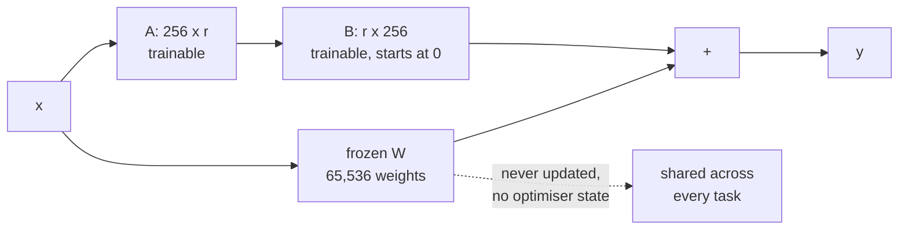

import DataCampExercise from "../../../../components/DataCampExercise.astro";
import Figure from "../../../../components/Figure.astro";
import Quiz from "../../../../components/Quiz.astro";

[Transfer learning](/deep-learning/phase-03---computer-vision-with-cnns/transfer-learning-using-pre-trained-models/)
asked whether pretrained weights help. This page asks a narrower and more practical
question: given that you are going to adapt a pretrained model, **which weights do you
actually update**, and what does each answer cost?

The interesting answer is **LoRA** — freeze the pretrained matrix entirely and learn a
small low-rank correction beside it. It is how most large models are adapted in practice,
and the mechanism is simple enough to implement in about twenty lines.

:::note[No pretrained checkpoint exists on this machine]
Nothing may be downloaded and no weights are cached, so the base model is pretrained
here: Fashion-MNIST classes 0–4, then adapted to classes 5–9. That is a small stand-in
for the usual setting of a large pretrained transformer. The **mechanism** under test —
a low-rank update $W + BA$ on a frozen matrix — is identical; the **scale** is not, and
one of the results below is caused entirely by the scale. It is flagged where it appears.
:::

## What you'll learn

- The four places you can put your trainable parameters, and what each is worth.
- LoRA derived and implemented: $W + BA$, why $B$ starts at zero, what the rank buys.
- The measured trade: **0.8911 from 7,493 parameters** against 0.9385 from 268,037.
- Why LoRA's real argument is **storage per task**, not accuracy.
- Why, on this task, training from scratch beat both frozen strategies — and what that
  tells you about when adaptation is worth anything at all.

## The base model and the four strategies

A 784 → 256 → 256 → 5 network, **268,037 parameters**, pretrained on Fashion-MNIST
classes 0–4 to **0.8696** in 7.7 seconds. The target task is classes 5–9 with only
**1,500 training rows**, twelve epochs, everything averaged over two seeds.

| Strategy | What trains |
| --- | --- |
| From scratch | Everything, no pretrained weights at all. The floor. |
| Frozen features + head | Both hidden layers frozen; only the new 5-way head. |
| Unfreeze last hidden | Second hidden layer plus the head. |
| LoRA rank 4 | Both hidden layers frozen; a rank-4 correction on each, plus the head. |
| Full fine-tune | Everything, starting from the pretrained weights. |

<Figure
  src="/images/dl/phase-03-vision/fine-tuning-and-lora/strategies"
  alt="Left: horizontal bars of target accuracy for five strategies — from scratch 0.9350, frozen features 0.7605, unfreeze last hidden 0.9071, LoRA rank 4 0.8911, full fine-tune 0.9385. Right: the same accuracies plotted against trainable parameters on a log axis, showing frozen features far left at low accuracy, LoRA in the middle, and the two full-parameter strategies at the right."
  title="1,500 target rows, 12 epochs, mean of 2 seeds"
  caption="The right panel is the one to read. Accuracy rises with trainable parameters but not proportionally: LoRA spends 2.8% of the parameters to get within 0.0474 of full fine-tuning, while frozen features spend 0.48% and fall 0.1780 short. Note where 'from scratch' sits — at 0.9350 it beats every strategy that froze anything, which is a fact about this task rather than about the methods."
/>

| Strategy | Accuracy | Seed spread | Trainable | Share of model | Seconds |
| --- | --- | --- | --- | --- | --- |
| From scratch | 0.9350 | 0.0053 | 268,037 | 100% | 3.3 |
| Frozen features + head | 0.7605 | **0.0846** | 1,285 | 0.48% | 4.3 |
| Unfreeze last hidden | 0.9071 | 0.0117 | 67,077 | 25.0% | 2.9 |
| **LoRA rank 4** | 0.8911 | 0.0057 | **7,493** | **2.80%** | 3.1 |
| Full fine-tune | **0.9385** | 0.0032 | 268,037 | 100% | 5.6 |

## The result that has to be reported first

**Training from scratch scored 0.9350 — higher than LoRA, higher than the linear probe,
and within 0.0035 of full fine-tuning.** Every adaptation strategy that froze weights did
worse than not using the pretrained model at all.

That is not a failure of LoRA. It is a statement about when adaptation is worth anything:

- **The target task is easy and there is enough data for it.** 1,500 rows of
  Fashion-MNIST footwear and bags is plenty for a 268k-parameter MLP. Adaptation methods
  earn their keep when target data is *scarce* relative to the model.
- **The base task is small.** Features learned from five garment classes are not a rich
  general-purpose representation. There is little to transfer, so freezing costs more
  than it saves.
- **The frozen-feature spread is 0.0846** — sixteen times the full fine-tune's 0.0032.
  When only a 1,285-parameter head trains, the outcome depends heavily on whether the
  frozen features happen to suit the new labels, and on this seed pair they sometimes
  did not.

At the scale where LoRA is actually used — a base model pretrained on far more data than
the target task has, and a target set of a few thousand examples — the ordering reverses.
This page cannot demonstrate that, and says so rather than picking a configuration that
would flatter the method.

## LoRA, derived

Full fine-tuning updates $W \in \mathbb{R}^{d \times k}$ directly, producing a whole new
matrix per task. LoRA keeps $W$ frozen and learns an update constrained to be low rank:

$$
W' = W + \Delta W, \qquad \Delta W = BA, \qquad
B \in \mathbb{R}^{d \times r},\; A \in \mathbb{R}^{r \times k},\; r \ll \min(d, k)
$$

The forward pass becomes

$$
\mathbf{y} = \mathbf{x}W + \mathbf{x}BA + \mathbf{b}
$$

and the parameter count drops from $dk$ to $r(d + k)$. For the 256×256 layers here at
$r = 4$: **65,536 → 2,048**, a 32× reduction per matrix.

Two implementation details carry the whole method:

**$B$ is initialised to zero.** Then $\Delta W = BA = 0$ at step one, so the wrapped layer
is *numerically identical* to the frozen one before any training happens. Adaptation
starts from the pretrained function exactly, with no random perturbation to recover from.
Initialising both factors randomly would inject noise into a model you just paid to
pretrain.

**Only $A$ and $B$ receive gradients.** $W$ is frozen, so the optimiser state — Adam keeps
two moments per trainable parameter — also shrinks by the same factor. On a large model
that optimiser state is usually the memory that actually stops you.

```python
class LoRADense(keras.layers.Layer):
    def __init__(self, base, rank, **kwargs):
        super().__init__(**kwargs)
        self.base = base
        self.base.trainable = False          # W never moves
        self.rank = rank

    def build(self, shape):
        inputs = int(self.base.kernel.shape[0])
        outputs = int(self.base.kernel.shape[1])
        self.down = self.add_weight(shape=(inputs, self.rank),
                                    initializer="glorot_uniform")
        self.up = self.add_weight(shape=(self.rank, outputs),
                                  initializer="zeros")      # B starts at 0

    def call(self, x):
        correction = tf.matmul(tf.matmul(x, self.down), self.up)
        return self.base.activation(
            tf.matmul(x, self.base.kernel) + self.base.bias + correction)
```



## What the rank buys

Rank is the only knob LoRA exposes. It is the inner dimension of the correction, and it
sets both capacity and cost:

<Figure
  src="/images/dl/phase-03-vision/fine-tuning-and-lora/rank-sweep"
  alt="Accuracy against LoRA rank on a log-2 axis, rising from 0.8508 at rank 1 to 0.9119 at rank 16, each point annotated with its trainable parameter count from 2,837 to 26,117. A dashed line marks full fine-tuning at 0.9385 and a dotted line marks frozen features at 0.7605."
  title="Mean of 2 seeds, otherwise identical runs"
  caption="Monotone but flattening. Rank 1 already reaches 0.8508 — well above the 0.7605 of a frozen-feature probe with a comparable-order parameter count — and doubling the rank four times buys 0.0611 more. Every point sits between the two dashed lines, which is the honest summary of the method: strictly better than freezing, strictly worse than updating everything, at a cost you choose."
/>

| Rank $r$ | Accuracy | Trainable | Against full fine-tune |
| --- | --- | --- | --- |
| 1 | 0.8508 | 2,837 | −0.0877 |
| 2 | 0.8826 | 4,389 | −0.0559 |
| 4 | 0.8911 | 7,493 | −0.0474 |
| 8 | 0.8990 | 13,701 | −0.0395 |
| 16 | **0.9119** | 26,117 | **−0.0266** |

Doubling the rank roughly doubles the trainable parameters and buys progressively less:
+0.0318 from rank 1 to 2, then +0.0085, +0.0079, +0.0129. There is no cliff and no sweet
spot — just a dial between "cheap" and "close to full fine-tuning".

## The argument that actually matters

LoRA does not win on accuracy. It wins on what you keep afterwards.

<Figure
  src="/images/dl/phase-03-vision/fine-tuning-and-lora/cost"
  alt="Left: bars on a log axis of kilobytes needed to store 20 adapted tasks, with from-scratch and full fine-tune both at about 20,940 KB, unfreeze-last-hidden at 5,240 KB, LoRA at 585 KB and frozen features at 100 KB. Right: bars of wall-clock seconds for 12 epochs, all between 2.9 and 5.6 seconds."
  title="Twenty tasks adapted from one base model, float32"
  caption="Full fine-tuning stores an entire 268,037-parameter model per task — 20,940 KB for twenty tasks. LoRA stores 7,493 numbers per task and shares the frozen base: 585 KB, a 35.8x reduction, for 0.0474 less accuracy. The right panel shows what the method does NOT buy at this scale: wall clock is dominated by the forward pass, which is unchanged, so training time barely moves."
/>

| Strategy | Per task | 20 tasks | Accuracy cost |
| --- | --- | --- | --- |
| Full fine-tune | 1,047 KB | 20,940 KB | — |
| Unfreeze last hidden | 262 KB | 5,240 KB | −0.0314 |
| **LoRA rank 4** | **29 KB** | **585 KB** | −0.0474 |
| Frozen features + head | 5 KB | 100 KB | −0.1780 |

Twenty task-specific models at full fine-tuning is twenty complete copies. With LoRA it is
one frozen base plus twenty 29 KB adapters, and swapping tasks means swapping a 29 KB
file. Multiply by a real base model and this is the difference between one deployment and
twenty.

**Note what it does not buy here.** Wall clock moved from 5.6 s to 3.1 s, and that is
mostly noise on runs this short — the forward pass through the frozen weights costs the
same either way, and LoRA adds two small matrix multiplies to it. Parameter-efficient
tuning saves *memory and storage*, not arithmetic. On a large model the memory saving is
what lets the run happen at all, but the per-step compute is roughly unchanged.

```p5 title="Where the parameters go" desc="Drag to set the LoRA rank. The bars show the measured accuracy and the trainable parameter count against the two reference lines." height="360"
let index = 2;
const RANKS = [1, 2, 4, 8, 16];
const ACC = [0.8508, 0.8826, 0.8911, 0.8990, 0.9119];
const PARAMS = [2837, 4389, 7493, 13701, 26117];
const FULL = 0.9385;
const FULL_P = 268037;
const FROZEN = 0.7605;
const SCRATCH = 0.9350;
function setup() {
  createCanvas(620, 360);
  textFont("monospace");
}
function draw() {
  background(13, 17, 23);
  noStroke();
  fill(230);
  textSize(12);
  textAlign(LEFT, TOP);
  text("LoRA rank " + RANKS[index] + " - 1,500 target rows, 12 epochs", 26, 18);
  fill(48, 56, 68);
  rect(26, 56, 420, 5, 2);
  for (let i = 0; i < RANKS.length; i++) {
    const x = 26 + (i / (RANKS.length - 1)) * 420;
    if (i === index) { fill(255, 211, 67); } else { fill(90, 102, 118); }
    circle(x, 58, i === index ? 14 : 9);
    fill(i === index ? 235 : 110);
    textSize(9);
    textAlign(CENTER, TOP);
    text(RANKS[i], x, 70);
    textAlign(LEFT, TOP);
  }
  fill(150);
  textSize(10);
  text("accuracy on the target classes:", 26, 100);
  fill(40, 47, 58);
  rect(26, 120, 460, 26, 3);
  fill(107, 169, 221);
  rect(26, 120, (ACC[index] / 1.0) * 460, 26, 3);
  fill(238);
  textSize(11);
  text(ACC[index].toFixed(4), 34, 126);
  stroke(126, 192, 143);
  strokeWeight(2);
  line(26 + FULL * 460, 116, 26 + FULL * 460, 150);
  stroke(224, 108, 117);
  line(26 + FROZEN * 460, 116, 26 + FROZEN * 460, 150);
  noStroke();
  fill(126, 192, 143);
  textSize(8);
  text("full " + FULL, 26 + FULL * 460 - 20, 152);
  fill(224, 108, 117);
  text("frozen " + FROZEN, 26 + FROZEN * 460 - 26, 152);
  fill(150);
  textSize(10);
  text("trainable parameters:", 26, 190);
  fill(40, 47, 58);
  rect(26, 210, 460, 26, 3);
  fill(255, 211, 67);
  rect(26, 210, (PARAMS[index] / FULL_P) * 460, 26, 3);
  fill(238);
  textSize(11);
  text(PARAMS[index].toLocaleString(), 34, 216);
  fill(150);
  textSize(9);
  text("full fine-tune trains 268,037 - that whole bar would be the width", 26, 244);
  text("of the box. This one is " + (PARAMS[index] / FULL_P * 100).toFixed(2)
       + "% of it.", 26, 257);
  fill(255, 211, 67);
  textSize(10);
  text("storing 20 tasks: " + Math.round(PARAMS[index] * 4 / 1024 * 20)
       + " KB, against 20,940 KB for full fine-tuning", 26, 284);
  fill(150);
  textSize(9);
  text("and from scratch - no pretrained weights at all - scored "
       + SCRATCH + " here.", 26, 312);
  text("Adaptation is worth something only when target data is scarce", 26, 325);
  text("relative to the model. On this task it was not.", 26, 338);
}
function mousePressed() { mouseDragged(); }
function mouseDragged() {
  if (mouseY < 40 || mouseY > 82) { return; }
  const t = Math.min(Math.max((mouseX - 26) / 420, 0), 1);
  index = Math.round(t * (RANKS.length - 1));
}
```

```p5 title="The measured table, ranked" desc="Click a column to rank every row by it. The bars are that column's values and the highest and lowest are computed from the numbers, not written in." height="280"
let metric = 0;
const COLUMNS = ["Accuracy", "Seed spread", "Trainable", "Share of model"];
const ROWS = [
  ["From scratch", 0.935, 0.0053, 268037, 100],
  ["Frozen features + head", 0.7605, 0.0846, 1285, 0.48],
  ["Unfreeze last hidden", 0.9071, 0.0117, 67077, 25],
  ["LoRA rank 4", 0.8911, 0.0057, 7493, 2.8],
  ["Full fine-tune", 0.9385, 0.0032, 268037, 100]
];
function setup() {
  createCanvas(620, 280);
  textFont("monospace");
}
function fmt(v) {
  if (v === 0) { return "0"; }
  const a = Math.abs(v);
  if (a >= 1000 || a < 0.001) { return v.toExponential(2); }
  if (a >= 100) { return v.toFixed(1); }
  return v.toFixed(4);
}
function draw() {
  background(13, 17, 23);
  noStroke();
  fill(230);
  textSize(12);
  textAlign(LEFT, TOP);
  text("Fine-Tuning and Parameter-Efficien", 26, 16);
  let x = 26;
  for (let i = 0; i < COLUMNS.length; i++) {
    const w = COLUMNS[i].length * 6.6 + 16;
    if (i === metric) { fill(255, 211, 67); } else { fill(48, 56, 68); }
    rect(x, 40, w, 22, 4);
    if (i === metric) { fill(13, 17, 23); } else { fill(180); }
    textSize(9);
    text(COLUMNS[i], x + 8, 47);
    x += w + 6;
    if (x > 500) { break; }
  }
  const values = ROWS.map((r) => r[metric + 1]);
  const lo = Math.min(...values);
  const hi = Math.max(...values);
  const span = hi - lo === 0 ? 1 : hi - lo;
  const order = ROWS.slice().sort((a, b) => b[metric + 1] - a[metric + 1]);
  for (let i = 0; i < order.length; i++) {
    const y = 78 + i * 26;
    const v = order[i][metric + 1];
    fill(160);
    textSize(9);
    text(order[i][0], 26, y + 5);
    fill(34, 40, 50);
    rect(230, y, 280, 18, 3);
    const frac = (v - lo) / span;
    if (v === hi) { fill(126, 192, 143); }
    else if (v === lo) { fill(224, 108, 117); }
    else { fill(107, 169, 221); }
    rect(230, y, Math.max(frac * 280, 3), 18, 3);
    fill(225);
    textSize(9);
    text(fmt(v), 518, y + 5);
  }
  const top = order[0];
  const bottom = order[order.length - 1];
  fill(150);
  textSize(9);
  const base = 78 + order.length * 26 + 8;
  text("highest " + COLUMNS[metric] + ": " + top[0] + " at " + fmt(top[1]),
       26, base);
  text("lowest  " + COLUMNS[metric] + ": " + bottom[0] + " at "
       + fmt(bottom[1]), 26, base + 14);
  text("bars are scaled within the chosen column - lowest is not zero", 26,
       base + 30);
}
function mousePressed() {
  let x = 26;
  for (let i = 0; i < COLUMNS.length; i++) {
    const w = COLUMNS[i].length * 6.6 + 16;
    if (mouseX > x && mouseX < x + w && mouseY > 40 && mouseY < 62) {
      metric = i;
    }
    x += w + 6;
  }
}
```

## Pitfalls

- **Reporting LoRA without a from-scratch baseline.** Here scratch scored 0.9350 and beat
  it. Without that row the page would read as an endorsement it has not earned.
- **Initialising $B$ randomly.** With $B = 0$ the adapted model starts exactly at the
  pretrained function. Random initialisation on both factors injects noise into weights
  you paid to pretrain.
- **Expecting a speed-up.** Wall clock barely moved. LoRA cuts trainable parameters,
  optimiser state and stored bytes — not the forward pass.
- **Judging a frozen-feature probe on one seed.** Its spread across two seeds was 0.0846
  against full fine-tuning's 0.0032; a single run could land anywhere in that band.
- **Choosing the rank by accuracy alone.** The curve is monotone, so accuracy alone always
  says "higher". The question is what accuracy per stored kilobyte you need.
- **Assuming these numbers transfer to a large base model.** They do not, and in a
  specific direction: the case for adaptation gets *stronger* as the base model grows and
  the target set shrinks.

## Recap

- The base model — 268,037 parameters, pretrained to 0.8696 on classes 0–4 — was adapted
  to classes 5–9 with 1,500 rows, five ways.
- **LoRA rank 4 reached 0.8911 while training 7,493 parameters, 2.80% of the model** —
  35.8× fewer than full fine-tuning's 0.9385.
- The rank sweep is monotone and flattening: 0.8508 at $r=1$ through 0.9119 at $r=16$,
  every point strictly between a frozen probe and full fine-tuning.
- **The real argument is storage**: 585 KB for twenty adapted tasks against 20,940 KB.
  Wall clock barely moved, because the forward pass is unchanged.
- $B$ initialised to zero is what lets adaptation start from the pretrained function
  exactly.
- **Training from scratch scored 0.9350 and beat every frozen strategy**, because the
  target task had enough data and the base task was small. Adaptation methods are worth
  their complexity when target data is scarce relative to the model — which is a
  condition to check, not to assume.

## Next

[Data Augmentation for Small Datasets](/deep-learning/phase-03---computer-vision-with-cnns/data-augmentation-for-small-datasets/) —
the other standard answer to "not enough target data", and one that also costs accuracy on
the distribution you measured.

<Quiz
  questions={[
    {
      q: "Training from scratch scored 0.9350 while LoRA scored 0.8911 and a frozen-feature probe 0.7605. What is the correct reading?",
      options: [
        "LoRA is a bad method",
        "Adaptation pays when target data is scarce relative to the model; here 1,500 rows was plenty and the base task (five garment classes) was too small to have learned much worth transferring",
        "The pretrained weights were corrupted",
        "The target task is impossible"
      ],
      answer: 1,
      explanation: "Every frozen strategy did worse than ignoring the pretrained model entirely. That is a statement about this scale, and it reverses when the base model is large and the target set is small."
    },
    {
      q: "In LoRA, why is B initialised to zero rather than randomly?",
      options: [
        "To save memory",
        "So that BA = 0 at step one and the wrapped layer is numerically identical to the frozen pretrained layer — adaptation starts from the pretrained function with no noise to recover from",
        "Because zero initialisation trains faster",
        "To prevent the rank from collapsing"
      ],
      answer: 1,
      explanation: "A is random so the two factors are not symmetric and gradients can flow. If both were random the model would begin at a perturbed version of the weights you just paid to pretrain."
    },
    {
      q: "LoRA reduced trainable parameters 35.8x but wall clock moved only 5.6 s to 3.1 s. Why so little?",
      options: [
        "The measurement was too short to be reliable",
        "LoRA saves memory, optimiser state and stored bytes - the forward pass still runs through the full frozen matrix, and LoRA adds two small multiplies on top of it",
        "Keras does not optimise frozen layers",
        "The rank was too high"
      ],
      answer: 1,
      explanation: "Parameter-efficient tuning is not compute-efficient tuning. On a large model the memory saving is what makes the run possible at all, but per-step arithmetic is roughly unchanged."
    },
    {
      q: "The frozen-feature probe's accuracy varied by 0.0846 across two seeds while full fine-tuning varied by 0.0032. What causes the difference?",
      options: [
        "The probe was trained for fewer epochs",
        "With only a 1,285-parameter head trainable, the result depends almost entirely on whether the fixed features happen to suit the new labels - there is no capacity to compensate when they do not",
        "Random seeds affect small models more in general",
        "The probe used a different optimiser"
      ],
      answer: 1,
      explanation: "More trainable parameters means more ability to adapt to whatever the initialisation gave you, which shows up as lower variance across seeds as well as higher mean accuracy."
    },
    {
      q: "For a 256x256 weight matrix at rank 4, LoRA replaces 65,536 trainable numbers with how many, and by what formula?",
      options: [
        "4, from the rank itself",
        "2,048, from r(d + k) = 4 x (256 + 256)",
        "16,384, from dk/r",
        "1,024, from d x r"
      ],
      answer: 1,
      explanation: "B is d x r and A is r x k, so the cost is r(d + k) rather than dk. The saving grows with the matrix: at 4096 x 4096 and rank 4 it is 16.8 million numbers against 32,768."
    },
    {
      q: "The rank sweep rose monotonically from 0.8508 to 0.9119. Why is 'pick the highest rank' still the wrong default?",
      options: [
        "Higher ranks overfit",
        "Because the curve flattens while cost keeps doubling - the decision is accuracy per stored kilobyte, and rank 16 costs 3.5x rank 4's storage for 0.0208 more accuracy",
        "Because high ranks are unstable",
        "Because rank must divide the layer width"
      ],
      answer: 1,
      explanation: "Accuracy alone always argues for more capacity, which is why it cannot select the rank. The whole point of the method is that you are trading against a budget, so the budget has to be in the comparison."
    }
  ]}
/>

## 🧪 Try It Yourself

<DataCampExercise
  lang="python"
  hint={`A rank-r product B @ A costs r(d + k) numbers against the full matrix's d * k.`}
  code={`# Task: Exercise 1 - What a low-rank update costs
import numpy as np

SHAPES = ((256, 256), (768, 768), (4096, 4096), (4096, 11008))
RANKS = (1, 4, 16, 64)

print(f"{'matrix':>14} {'full':>14} {'r=1':>10} {'r=4':>10} {'r=16':>10} "
      f"{'r=64':>10}")
for d, k in SHAPES:
    full = d * k
    costs = [rank * (d + ___) for rank in RANKS]     # replace ___ with k
    row = " ".join(f"{cost:10,}" for cost in costs)
    print(f"{f'{d}x{k}':>14} {full:14,} {row}")

print(f"\\n{'matrix':>14} {'r=4 as a share of full':>26}")
for d, k in SHAPES:
    share = 4 * (d + k) / (d * k)
    print(f"{f'{d}x{k}':>14} {share:25.4%}")

print("\\nthe saving grows with the matrix, which is the whole reason the")
print("method matters on large models and barely matters on small ones.")
print("At 256x256 rank 4 keeps 3.13% of the parameters; at 4096x11008 it")
print("keeps 0.13% - a 23x better saving on the same rank")`}
  solution={`import numpy as np

SHAPES = ((256, 256), (768, 768), (4096, 4096), (4096, 11008))
RANKS = (1, 4, 16, 64)

print(f"{'matrix':>14} {'full':>14} {'r=1':>10} {'r=4':>10} {'r=16':>10} "
      f"{'r=64':>10}")
for d, k in SHAPES:
    full = d * k
    costs = [rank * (d + k) for rank in RANKS]
    row = " ".join(f"{cost:10,}" for cost in costs)
    print(f"{f'{d}x{k}':>14} {full:14,} {row}")

print(f"\\n{'matrix':>14} {'r=4 as a share of full':>26}")
for d, k in SHAPES:
    share = 4 * (d + k) / (d * k)
    print(f"{f'{d}x{k}':>14} {share:25.4%}")

print("\\nthe saving grows with the matrix, which is the whole reason the")
print("method matters on large models and barely matters on small ones.")
print("At 256x256 rank 4 keeps 3.13% of the parameters; at 4096x11008 it")
print("keeps 0.13% - a 23x better saving on the same rank")`}
/>

<DataCampExercise
  lang="python"
  hint={`Set the up-projection to zeros and check the wrapped layer against the frozen one before any training.`}
  code={`# Task: Exercise 2 - Why B starts at zero
import numpy as np

rng = np.random.default_rng(0)
D, K, RANK = 64, 64, 4
W = rng.normal(0, 0.1, (D, K))          # the pretrained matrix
x = rng.normal(0, 1, (8, D))
frozen = x @ W

for label, up in (("B = zeros", np.zeros((RANK, K))),
                  ("B random", rng.normal(0, 0.1, (RANK, K)))):
    down = rng.normal(0, 0.1, (D, RANK))
    adapted = x @ W + x @ down @ ___     # replace ___ with up
    drift = float(np.abs(adapted - frozen).max())
    print(f"{label:10s} largest change to the output at step 0: {drift:.10f}")

print("\\nwith B = 0 the adapted model IS the pretrained model on step one,")
print("to the last bit. Every later step moves away from it deliberately.")
print("With B random it starts somewhere else, and the first thing training")
print("has to do is undo a perturbation to weights you paid to pretrain")`}
  solution={`import numpy as np

rng = np.random.default_rng(0)
D, K, RANK = 64, 64, 4
W = rng.normal(0, 0.1, (D, K))
x = rng.normal(0, 1, (8, D))
frozen = x @ W

for label, up in (("B = zeros", np.zeros((RANK, K))),
                  ("B random", rng.normal(0, 0.1, (RANK, K)))):
    down = rng.normal(0, 0.1, (D, RANK))
    adapted = x @ W + x @ down @ up
    drift = float(np.abs(adapted - frozen).max())
    print(f"{label:10s} largest change to the output at step 0: {drift:.10f}")

print("\\nwith B = 0 the adapted model IS the pretrained model on step one,")
print("to the last bit. Every later step moves away from it deliberately.")
print("With B random it starts somewhere else, and the first thing training")
print("has to do is undo a perturbation to weights you paid to pretrain")`}
/>

<DataCampExercise
  lang="python"
  hint={`Take the SVD of the difference between two matrices and see how much of it the first few singular values explain.`}
  code={`# Task: Exercise 3 - Is a real weight update actually low rank?
import numpy as np

rng = np.random.default_rng(0)
SIZE = 128

pretrained = rng.normal(0, 0.1, (SIZE, SIZE))
# A plausible fine-tuning update: a few strong directions plus small noise.
directions = rng.normal(0, 0.1, (SIZE, 3)) @ rng.normal(0, 0.1, (3, SIZE))
update = directions + rng.normal(0, 0.002, (SIZE, SIZE))
random_update = rng.normal(0, 0.02, (SIZE, SIZE))

for label, delta in (("structured", update), ("pure noise", random_update)):
    values = np.linalg.svd(delta, compute_uv=False)
    energy = np.cumsum(values ** 2) / np.sum(values ** ___)  # replace ___ with 2
    print(f"{label:12s} rank 1: {energy[0]:.4f}  rank 4: {energy[3]:.4f}  "
          f"rank 16: {energy[15]:.4f}")

print("\\nthe structured update is nearly all captured by its first few")
print("singular values; the noise needs every one of the 128. LoRA is a bet")
print("that fine-tuning updates look like the first row rather than the")
print("second - and the rank sweep on this page is that bet being priced")`}
  solution={`import numpy as np

rng = np.random.default_rng(0)
SIZE = 128

pretrained = rng.normal(0, 0.1, (SIZE, SIZE))
directions = rng.normal(0, 0.1, (SIZE, 3)) @ rng.normal(0, 0.1, (3, SIZE))
update = directions + rng.normal(0, 0.002, (SIZE, SIZE))
random_update = rng.normal(0, 0.02, (SIZE, SIZE))

for label, delta in (("structured", update), ("pure noise", random_update)):
    values = np.linalg.svd(delta, compute_uv=False)
    energy = np.cumsum(values ** 2) / np.sum(values ** 2)
    print(f"{label:12s} rank 1: {energy[0]:.4f}  rank 4: {energy[3]:.4f}  "
          f"rank 16: {energy[15]:.4f}")

print("\\nthe structured update is nearly all captured by its first few")
print("singular values; the noise needs every one of the 128. LoRA is a bet")
print("that fine-tuning updates look like the first row rather than the")
print("second - and the rank sweep on this page is that bet being priced")`}
/>

<DataCampExercise
  lang="python"
  hint={`Storage per task is the trainable count; the frozen base is shared across all of them.`}
  code={`# Task: Exercise 4 - The deployment arithmetic
import numpy as np

BASE = 268037
STRATEGIES = {
    "full fine-tune": 268037,
    "unfreeze last hidden": 67077,
    "LoRA rank 4": 7493,
    "frozen + head": 1285,
}
ACCURACY = {"full fine-tune": 0.9385, "unfreeze last hidden": 0.9071,
            "LoRA rank 4": 0.8911, "frozen + head": 0.7605}

for tasks in (1, 20, 500):
    print(f"\\n=== {tasks} adapted task(s) ===")
    print(f"{'strategy':22s} {'total MB':>10} {'vs full':>9} {'accuracy':>10}")
    for name, trainable in STRATEGIES.items():
        shared = 0 if name == "full fine-tune" else BASE
        total = (shared + trainable * ___) * 4 / 1024 / 1024  # use tasks
        full = (268037 * tasks) * 4 / 1024 / 1024
        print(f"{name:22s} {total:10.2f} {full / total:8.1f}x "
              f"{ACCURACY[name]:10.4f}")

print("\\nat one task the shared base makes LoRA WORSE than full fine-tuning")
print("on storage - you are keeping two things instead of one. The method")
print("only pays from a handful of tasks onward, which is exactly the")
print("setting it was designed for and not the setting most demos show")`}
  solution={`import numpy as np

BASE = 268037
STRATEGIES = {
    "full fine-tune": 268037,
    "unfreeze last hidden": 67077,
    "LoRA rank 4": 7493,
    "frozen + head": 1285,
}
ACCURACY = {"full fine-tune": 0.9385, "unfreeze last hidden": 0.9071,
            "LoRA rank 4": 0.8911, "frozen + head": 0.7605}

for tasks in (1, 20, 500):
    print(f"\\n=== {tasks} adapted task(s) ===")
    print(f"{'strategy':22s} {'total MB':>10} {'vs full':>9} {'accuracy':>10}")
    for name, trainable in STRATEGIES.items():
        shared = 0 if name == "full fine-tune" else BASE
        total = (shared + trainable * tasks) * 4 / 1024 / 1024
        full = (268037 * tasks) * 4 / 1024 / 1024
        print(f"{name:22s} {total:10.2f} {full / total:8.1f}x "
              f"{ACCURACY[name]:10.4f}")

print("\\nat one task the shared base makes LoRA WORSE than full fine-tuning")
print("on storage - you are keeping two things instead of one. The method")
print("only pays from a handful of tasks onward, which is exactly the")
print("setting it was designed for and not the setting most demos show")`}
/>

<DataCampExercise
  lang="python"
  hint={`Wrap a frozen Dense layer with a trainable rank-r correction and count what ends up trainable.`}
  code={`# Task: Exercise 5 - Build a LoRA layer and count the parameters
import numpy as np
from tensorflow import keras
import tensorflow as tf

WIDTH, RANK = 256, 4
keras.utils.set_random_seed(0)


class LoRADense(keras.layers.Layer):
    def __init__(self, base, rank, **kwargs):
        super().__init__(**kwargs)
        self.base = base
        self.base.trainable = False
        self.rank = rank

    def build(self, shape):
        inputs = int(self.base.kernel.shape[0])
        outputs = int(self.base.kernel.shape[1])
        self.down = self.add_weight(shape=(inputs, self.rank),
                                    initializer="glorot_uniform",
                                    name="lora_down")
        self.up = self.add_weight(shape=(self.rank, outputs),
                                  initializer=___,          # use "zeros"
                                  name="lora_up")

    def call(self, x):
        correction = tf.matmul(tf.matmul(x, self.down), self.up)
        return self.base.activation(
            tf.matmul(x, self.base.kernel) + self.base.bias + correction)


base = keras.layers.Dense(WIDTH, activation="relu")
base.build((None, WIDTH))
inputs = keras.layers.Input((WIDTH,))
wrapped = LoRADense(base, RANK)(inputs)
model = keras.Model(inputs, wrapped)

trainable = int(sum(np.prod(w.shape) for w in model.trainable_weights))
frozen = int(sum(np.prod(w.shape) for w in model.non_trainable_weights))
print(f"trainable:     {trainable:,}")
print(f"frozen:        {frozen:,}")
print(f"share trained: {trainable / (trainable + frozen):.4%}")

probe = np.zeros((4, WIDTH), dtype="float32") + 0.5
direct = base(probe).numpy()
through = model.predict(probe, verbose=0)
print(f"\\nlargest difference at step 0: {np.abs(direct - through).max():.10f}")
print("zero, because the up-projection starts at zero - the wrapped layer")
print("begins life as the frozen one")`}
  solution={`import numpy as np
from tensorflow import keras
import tensorflow as tf

WIDTH, RANK = 256, 4
keras.utils.set_random_seed(0)


class LoRADense(keras.layers.Layer):
    def __init__(self, base, rank, **kwargs):
        super().__init__(**kwargs)
        self.base = base
        self.base.trainable = False
        self.rank = rank

    def build(self, shape):
        inputs = int(self.base.kernel.shape[0])
        outputs = int(self.base.kernel.shape[1])
        self.down = self.add_weight(shape=(inputs, self.rank),
                                    initializer="glorot_uniform",
                                    name="lora_down")
        self.up = self.add_weight(shape=(self.rank, outputs),
                                  initializer="zeros",
                                  name="lora_up")

    def call(self, x):
        correction = tf.matmul(tf.matmul(x, self.down), self.up)
        return self.base.activation(
            tf.matmul(x, self.base.kernel) + self.base.bias + correction)


base = keras.layers.Dense(WIDTH, activation="relu")
base.build((None, WIDTH))
inputs = keras.layers.Input((WIDTH,))
wrapped = LoRADense(base, RANK)(inputs)
model = keras.Model(inputs, wrapped)

trainable = int(sum(np.prod(w.shape) for w in model.trainable_weights))
frozen = int(sum(np.prod(w.shape) for w in model.non_trainable_weights))
print(f"trainable:     {trainable:,}")
print(f"frozen:        {frozen:,}")
print(f"share trained: {trainable / (trainable + frozen):.4%}")

probe = np.zeros((4, WIDTH), dtype="float32") + 0.5
direct = base(probe).numpy()
through = model.predict(probe, verbose=0)
print(f"\\nlargest difference at step 0: {np.abs(direct - through).max():.10f}")
print("zero, because the up-projection starts at zero - the wrapped layer")
print("begins life as the frozen one")`}
/>

<DataCampExercise
  lang="python"
  hint={`Compare the measured accuracies against what each strategy costs, and check which one wins per unit of storage.`}
  code={`# Task: Exercise 6 - Price the measured results
import numpy as np

# All measured on this page: 1,500 target rows, 12 epochs, 2 seeds.
RESULTS = {
    "from scratch":         (0.9350, 268037),
    "frozen + head":        (0.7605, 1285),
    "unfreeze last hidden": (0.9071, 67077),
    "LoRA rank 4":          (0.8911, 7493),
    "full fine-tune":       (0.9385, 268037),
}
FLOOR = 0.2000        # five balanced classes

print(f"{'strategy':22s} {'accuracy':>9} {'over floor':>11} "
      f"{'trainable':>10} {'gain per 1k params':>20}")
for name, (accuracy, trainable) in RESULTS.items():
    gain = accuracy - FLOOR
    per_thousand = gain / (trainable / ___)      # replace ___ with 1000
    print(f"{name:22s} {accuracy:9.4f} {gain:11.4f} {trainable:10,} "
          f"{per_thousand:20.5f}")

best = max(RESULTS, key=lambda k: (RESULTS[k][0] - FLOOR) / RESULTS[k][1])
most = max(RESULTS, key=lambda k: RESULTS[k][0])
print(f"\\nmost accurate:    {most}")
print(f"best value:       {best}")
print("they are different strategies, and neither answer is wrong - the")
print("question decides. Note also that 'from scratch' beat three of the")
print("four adaptation strategies, which is the result this page had to")
print("report before recommending anything")`}
  solution={`import numpy as np

RESULTS = {
    "from scratch":         (0.9350, 268037),
    "frozen + head":        (0.7605, 1285),
    "unfreeze last hidden": (0.9071, 67077),
    "LoRA rank 4":          (0.8911, 7493),
    "full fine-tune":       (0.9385, 268037),
}
FLOOR = 0.2000

print(f"{'strategy':22s} {'accuracy':>9} {'over floor':>11} "
      f"{'trainable':>10} {'gain per 1k params':>20}")
for name, (accuracy, trainable) in RESULTS.items():
    gain = accuracy - FLOOR
    per_thousand = gain / (trainable / 1000)
    print(f"{name:22s} {accuracy:9.4f} {gain:11.4f} {trainable:10,} "
          f"{per_thousand:20.5f}")

best = max(RESULTS, key=lambda k: (RESULTS[k][0] - FLOOR) / RESULTS[k][1])
most = max(RESULTS, key=lambda k: RESULTS[k][0])
print(f"\\nmost accurate:    {most}")
print(f"best value:       {best}")
print("they are different strategies, and neither answer is wrong - the")
print("question decides. Note also that 'from scratch' beat three of the")
print("four adaptation strategies, which is the result this page had to")
print("report before recommending anything")`}
/>
