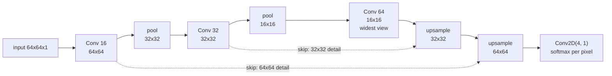

Classification answers "what is in this image". Segmentation answers **"what is
each pixel"** — one label per position, at the input's resolution. That changes the
output shape, forces the network to recover spatial detail it deliberately threw
away, and makes the obvious metric almost useless.

The data here is generated rather than downloaded: 1,200 training scenes of 64×64
containing a disc, a square and a triangle on noisy backgrounds, each with an exact
per-pixel label map. Every mask is known to be correct, and the whole page runs on a
CPU in a couple of minutes.

## What you'll learn

- Why the output is $(H, W, C)$ with a softmax over the **channel** axis, not a
  single vector.
- The metric trap: **predicting "background" everywhere scores 0.8691 pixel
  accuracy** on this data.
- Three upsampling designs measured, where **plain upsampling plus convolution won
  at 0.8965 mean IoU** and transposed convolution with skips came last at 0.8001.
- Why the smallest class is always the worst: **triangle IoU 0.4470 to 0.7331**
  while background sits above 0.98.
- What `Conv2DTranspose` does to a shape, and how it differs from `UpSampling2D`.
- Where segmentation errors actually live — the one-pixel boundary.

## The output is an image

A classifier ends with `Dense(classes, activation="softmax")` — one vector. A
segmentation model ends with `Conv2D(classes, 1, activation="softmax")` — **one
vector per pixel**, because a 1×1 convolution applied to an $(H, W, F)$ feature map
produces $(H, W, \text{classes})$ and the softmax runs along the last axis.

```python title="The only change at the output"
# classification
keras.layers.GlobalAveragePooling2D(),
keras.layers.Dense(4, activation="softmax")        # (4,)

# segmentation
keras.layers.Conv2D(4, 1, activation="softmax")    # (64, 64, 4)
```

The loss is unchanged. `sparse_categorical_crossentropy` against an integer mask of
shape $(H, W)$ averages the per-pixel loss over every position — 4,096 predictions
per image instead of one.

<Figure
  src="/images/dl/phase-03-vision/image-segmentation/segmentation-samples"
  alt="A three-by-four grid. The top row shows four noisy 64x64 scenes each containing a bright disc, a dark square and a grey triangle. The middle row shows the true masks in flat colours. The bottom row shows the model's predictions, which match the discs and squares closely but distort or merge the triangles, with per-image error rates from 2.0 to 3.9 percent."
  title="Inputs, true masks and predictions"
  caption="The discs and squares come back almost exactly. The triangles — the smallest and least distinct class — are mangled wherever they overlap a disc, and the error is concentrated on boundaries. Per-image error rates of 2.0% to 3.9% sound excellent until you notice that 86.9% of pixels are background."
/>

## The metric trap

| Class | Share of all pixels |
| --- | --- |
| background | **0.8691** |
| disc | 0.0568 |
| square | 0.0438 |
| triangle | **0.0303** |

A model that outputs "background" for every pixel scores **0.8691 pixel accuracy**
and is completely useless. The trained model's 0.9737 is only **0.10 above that
baseline** — the same imbalance problem measured on the [Reuters
page](/deep-learning/phase-01---neural-network-foundations/first-example-classifying-newswires-reuters-multiclass/),
except that in segmentation it is structural: backgrounds are always most of the
image.

The standard fix is **intersection over union**, per class:

$$
\text{IoU}_c = \frac{\lvert \hat{y} = c \; \wedge \; y = c \rvert}
{\lvert \hat{y} = c \; \vee \; y = c \rvert}
$$

The all-background model scores IoU 0.8691 on background and **exactly 0.0 on the
other three**, for a mean IoU of 0.2173. That is the number that tells you the model
does nothing.



The shape is an hourglass: **downsample to see context, upsample to recover
position.** The skip connections exist because the downsampling path destroys the
precise location of every boundary, and the upsampling path cannot invent it back.

## Getting the resolution back

Three ways, measured on identical data with the same seed:

| Design | Parameters | Pixel accuracy | Mean IoU | Seconds |
| --- | --- | --- | --- | --- |
| transposed conv + skips | 51,124 | 0.9737 | **0.8001** | **72.8** |
| upsample + conv + skips | 51,124 | **0.9863** | **0.8965** | **219.3** |
| transposed conv, no skips | 46,452 | 0.9805 | 0.8540 | 77.8 |

<Figure
  src="/images/dl/phase-03-vision/image-segmentation/upsampling-comparison"
  alt="Two panels. Left: validation pixel accuracy per epoch for three designs, all above 0.96 and closely bunched, with upsample-plus-convolution highest. Right: a bar chart of mean IoU where upsample plus convolution reaches 0.8965, no skips 0.8540 and transposed convolution with skips 0.8001."
  title="1,200 synthetic scenes, 12 epochs"
  caption="The left panel is why pixel accuracy is a bad metric: all three designs look identical above 0.96. The right panel separates them — upsampling followed by a convolution reaches 0.8965 mean IoU while transposed convolution with the same parameter count reaches 0.8001, and dropping the skip connections entirely scored 0.8540, better than one of the designs that kept them."
/>

Two results here are worth stating carefully, because both contradict the usual
advice:

1. **Plain upsampling plus a convolution beat transposed convolution** at an
   identical parameter count — 0.8965 against 0.8001 mean IoU. `UpSampling2D`
   repeats each value into a 2×2 block and the following convolution smooths it;
   `Conv2DTranspose` learns the upsampling, and here that flexibility cost more than
   it bought. It was also 3× slower in wall-clock, which is the opposite of what its
   simplicity suggests.
2. **Dropping the skip connections beat one of the designs that used them** — 0.8540
   against 0.8001. That is not evidence against skip connections; it is evidence that
   *this particular* transposed-convolution decoder was the weak link, and the
   comparison only separates them because IoU is sensitive enough to notice.

The honest summary: **on this problem the decoder choice mattered more than the skip
connections**, and the cheapest decoder won. Exercise 5 isolates it — the same
upsample-plus-convolution decoder with and without skips scored 0.8965 and 0.8974
mean IoU, a difference of 0.0009 that is indistinguishable from run-to-run noise. On
real segmentation tasks with thin structure — vessels, wires, text strokes — the skip
connections matter much more than they do on four solid geometric shapes with clean
boundaries, because there the boundary *is* the object.

### What each upsampling layer actually does

| Layer | (16, 16, 8) becomes | Parameters |
| --- | --- | --- |
| `UpSampling2D(2)` | (32, 32, 8) | **0** |
| `Conv2DTranspose(4, 3, strides=2)` | (32, 32, 4) | 292 |
| `UpSampling2D(2)` + `Conv2D(4, 3)` | (32, 32, 4) | 292 |

`UpSampling2D` is a fixed rule — nearest-neighbour repetition, no weights at all.
`Conv2DTranspose` inserts zeros between the input values and convolves, which is
mathematically the gradient of a strided convolution and is why it is sometimes
called a deconvolution (it is not one). The third row is the combination that won
above: fixed upsampling, then a learned smoothing.

## Where the errors are

| Design | background | disc | square | **triangle** |
| --- | --- | --- | --- | --- |
| transposed conv + skips | 0.9802 | 0.8453 | 0.9279 | **0.4470** |
| upsample + conv | 0.9866 | 0.9314 | 0.9351 | **0.7331** |
| no skips | 0.9817 | 0.9020 | 0.8830 | **0.6493** |

<Figure
  src="/images/dl/phase-03-vision/image-segmentation/iou-by-class"
  alt="Grouped bar chart of IoU for four classes across three designs, annotated with each class's share of all pixels. Background bars are all above 0.98, disc and square between 0.84 and 0.94, and triangle bars range from 0.45 to 0.73."
  title="IoU per class, with each class's share of all pixels"
  caption="The ordering is the same for every design and it follows the pixel share: background 86.9% of pixels and IoU above 0.98, triangle 3.0% and IoU as low as 0.4470. The triangle is also the hardest shape — thin at the apex, and the only one that regularly overlaps another object — so both effects push the same way."
/>

The triangle loses on two counts, and they compound:

- **It is the smallest class** at 3.0% of pixels, so it contributes almost nothing to
  the loss. A model can ignore it and still report 97% pixel accuracy.
- **It has the most boundary per unit area.** IoU on a small object is dominated by
  its outline: a shape 15 pixels across has roughly 56 boundary pixels out of 225
  total, and a one-pixel error all the way round drops its IoU to 0.60.

That second point is the general rule of segmentation: **the metric is decided at
the boundaries**, and small objects are almost all boundary. Weighting the loss by
inverse class frequency, or using a Dice/IoU-based loss directly, is the standard
response.

```p5 title="Pixel accuracy against IoU" desc="Paint a prediction over a small mask and watch the two metrics disagree. Start from all-background: the accuracy is already high while three IoUs are zero." height="330"
const N = 16;
let truth = [];
let predicted = [];
let brush = 1;
const NAMES = ["background", "disc", "square", "triangle"];
const COLORS = [[46, 96, 140], [255, 150, 60], [90, 200, 120], [230, 90, 90]];
function setup() {
  createCanvas(600, 330);
  textFont("monospace");
  for (let r = 0; r < N; r++) {
    truth.push([]);
    predicted.push([]);
    for (let c = 0; c < N; c++) {
      let label = 0;
      const dr = r - 5, dc = c - 5;
      if (dr * dr + dc * dc <= 9) label = 1;
      if (r >= 9 && r <= 13 && c >= 3 && c <= 7) label = 2;
      if (r >= 4 && r <= 8 && c >= 10 && c <= 10 + (r - 4)) label = 3;
      truth[r].push(label);
      predicted[r].push(0);
    }
  }
}
function metrics() {
  let correct = 0, total = 0;
  const ious = [];
  for (let k = 0; k < 4; k++) {
    let inter = 0, union = 0;
    for (let r = 0; r < N; r++) {
      for (let c = 0; c < N; c++) {
        if (k === 0) { total++; if (truth[r][c] === predicted[r][c]) correct++; }
        const a = truth[r][c] === k, b = predicted[r][c] === k;
        if (a && b) inter++;
        if (a || b) union++;
      }
    }
    ious.push(union ? inter / union : 0);
  }
  return { accuracy: correct / total, ious };
}
function draw() {
  background(13, 17, 23);
  noStroke();
  const cell = 15;
  fill(230);
  textSize(12);
  textAlign(LEFT, TOP);
  text("true mask", 40, 24);
  text("your prediction — click and drag", 280, 24);
  for (let r = 0; r < N; r++) {
    for (let c = 0; c < N; c++) {
      let col = COLORS[truth[r][c]];
      fill(col[0], col[1], col[2]);
      rect(40 + c * cell, 48 + r * cell, cell - 1, cell - 1);
      col = COLORS[predicted[r][c]];
      fill(col[0], col[1], col[2]);
      rect(280 + c * cell, 48 + r * cell, cell - 1, cell - 1);
    }
  }
  const m = metrics();
  fill(255, 211, 67);
  textSize(12);
  textAlign(LEFT, TOP);
  text("pixel accuracy " + m.accuracy.toFixed(4), 40, 300);
  fill(200);
  textSize(11);
  const mean = m.ious.reduce((a, b) => a + b, 0) / 4;
  text("mean IoU " + mean.toFixed(4) + "   per class "
    + m.ious.map((v) => v.toFixed(2)).join(" "), 40, 316);
  for (let k = 0; k < 4; k++) {
    const x = 280 + k * 78;
    const col = COLORS[k];
    fill(col[0], col[1], col[2], brush === k ? 255 : 110);
    rect(x, 296, 72, 22, 3);
    fill(brush === k ? 20 : 220);
    textSize(9);
    textAlign(CENTER, CENTER);
    text(NAMES[k], x + 36, 307);
  }
}
function paint() {
  const cell = 15;
  const c = Math.floor((mouseX - 280) / cell);
  const r = Math.floor((mouseY - 48) / cell);
  if (r >= 0 && r < N && c >= 0 && c < N) predicted[r][c] = brush;
}
function mousePressed() {
  if (mouseY > 296 && mouseY < 318 && mouseX > 280) {
    for (let k = 0; k < 4; k++) {
      const x = 280 + k * 78;
      if (mouseX > x && mouseX < x + 72) brush = k;
    }
    return;
  }
  paint();
}
function mouseDragged() { paint(); }
```

```p5 title="The measured table, ranked" desc="Click a column to rank every row by it. The bars are that column's values and the highest and lowest are computed from the numbers, not written in." height="228"
let metric = 0;
const COLUMNS = ["Parameters", "Pixel accuracy", "Mean IoU", "Seconds"];
const ROWS = [
  ["transposed conv + skips", 51124, 0.9737, 0.8001, 72.8],
  ["upsample + conv + skips", 51124, 0.9863, 0.8965, 219.3],
  ["transposed conv, no skips", 46452, 0.9805, 0.854, 77.8]
];
function setup() {
  createCanvas(620, 228);
  textFont("monospace");
}
function fmt(v) {
  if (v === 0) { return "0"; }
  const a = Math.abs(v);
  if (a >= 1000 || a < 0.001) { return v.toExponential(2); }
  if (a >= 100) { return v.toFixed(1); }
  return v.toFixed(4);
}
function draw() {
  background(13, 17, 23);
  noStroke();
  fill(230);
  textSize(12);
  textAlign(LEFT, TOP);
  text("Image Segmentation", 26, 16);
  let x = 26;
  for (let i = 0; i < COLUMNS.length; i++) {
    const w = COLUMNS[i].length * 6.6 + 16;
    if (i === metric) { fill(255, 211, 67); } else { fill(48, 56, 68); }
    rect(x, 40, w, 22, 4);
    if (i === metric) { fill(13, 17, 23); } else { fill(180); }
    textSize(9);
    text(COLUMNS[i], x + 8, 47);
    x += w + 6;
    if (x > 500) { break; }
  }
  const values = ROWS.map((r) => r[metric + 1]);
  const lo = Math.min(...values);
  const hi = Math.max(...values);
  const span = hi - lo === 0 ? 1 : hi - lo;
  const order = ROWS.slice().sort((a, b) => b[metric + 1] - a[metric + 1]);
  for (let i = 0; i < order.length; i++) {
    const y = 78 + i * 26;
    const v = order[i][metric + 1];
    fill(160);
    textSize(9);
    text(order[i][0], 26, y + 5);
    fill(34, 40, 50);
    rect(230, y, 280, 18, 3);
    const frac = (v - lo) / span;
    if (v === hi) { fill(126, 192, 143); }
    else if (v === lo) { fill(224, 108, 117); }
    else { fill(107, 169, 221); }
    rect(230, y, Math.max(frac * 280, 3), 18, 3);
    fill(225);
    textSize(9);
    text(fmt(v), 518, y + 5);
  }
  const top = order[0];
  const bottom = order[order.length - 1];
  fill(150);
  textSize(9);
  const base = 78 + order.length * 26 + 8;
  text("highest " + COLUMNS[metric] + ": " + top[0] + " at " + fmt(top[1]),
       26, base);
  text("lowest  " + COLUMNS[metric] + ": " + bottom[0] + " at "
       + fmt(bottom[1]), 26, base + 14);
  text("bars are scaled within the chosen column - lowest is not zero", 26,
       base + 30);
}
function mousePressed() {
  let x = 26;
  for (let i = 0; i < COLUMNS.length; i++) {
    const w = COLUMNS[i].length * 6.6 + 16;
    if (mouseX > x && mouseX < x + w && mouseY > 40 && mouseY < 62) {
      metric = i;
    }
    x += w + 6;
  }
}
```

## Pitfalls

- **Reporting pixel accuracy.** All-background scored 0.8691 here; the trained model
  scored 0.9737. The interesting information is in the 0.10 between them.
- **Averaging IoU over pixels instead of classes.** That reintroduces exactly the
  imbalance IoU was chosen to remove.
- **Assuming `Conv2DTranspose` beats `UpSampling2D` + `Conv2D`.** Measured 0.8001
  against 0.8965 at identical parameter counts, and 3× slower.
- **Calling `Conv2DTranspose` a deconvolution.** It is the gradient of a strided
  convolution, not an inverse; it cannot recover information the pooling discarded.
- **Omitting skip connections on fine structure.** They cost nothing at inference and
  carry the boundary detail — on shapes this simple the decoder mattered more, which
  will not generalise to real images.
- **Ignoring the smallest class.** Triangle IoU ran 0.4470–0.7331 while background sat
  above 0.98, and the loss barely notices.
- **Mismatching the mask encoding and the loss.** An $(H, W)$ integer mask pairs with
  `sparse_categorical_crossentropy`; an $(H, W, C)$ one-hot mask pairs with
  `categorical_crossentropy`.

## Recap

- Segmentation replaces the dense head with `Conv2D(classes, 1, activation="softmax")`
  — one softmax vector per pixel, 4,096 predictions per 64×64 image.
- Background was 86.91% of pixels, so a do-nothing model scores 0.8691 pixel accuracy
  and 0.2173 mean IoU. Report IoU.
- Three decoders at 12 epochs: upsample+conv 0.8965 mean IoU, no-skips 0.8540,
  transposed conv + skips 0.8001.
- `UpSampling2D` has zero parameters; `Conv2DTranspose` learns the upsampling and was
  both worse and slower here.
- Per-class IoU followed pixel share exactly, with triangle (3.0% of pixels) at
  0.4470–0.7331 against background above 0.98.
- IoU on small objects is dominated by boundary pixels, which is why class weighting
  or a Dice-style loss is standard.

## Next

One label per pixel is one way to answer "where". Boxes are the other, and they
bring a different set of problems:
[Object Detection (Bounding Boxes and YOLO)](/deep-learning/phase-03---computer-vision-with-cnns/object-detection-bounding-boxes-and-yolo/).

<Quiz
  questions={[
    {
      q: "Your segmentation model reports 0.97 pixel accuracy. What is the first thing to check?",
      options: [
        "Whether the model has enough capacity",
        "What a do-nothing model scores — background was 86.91% of pixels here, so 0.8691 comes free and 0.97 is only 0.10 above it",
        "Whether the learning rate is too high",
        "Whether the masks are one-hot encoded",
      ],
      answer: 1,
      explain: "The all-background prediction also scores 0.0 IoU on every foreground class, for a mean IoU of 0.2173 — which is the number that reveals it.",
    },
    {
      q: "Plain UpSampling2D followed by Conv2D reached 0.8965 mean IoU while Conv2DTranspose with the same parameter count reached 0.8001. What does that suggest?",
      options: [
        "Conv2DTranspose is broken in Keras",
        "A learned upsampler is not automatically better than a fixed rule plus a learned smoothing — and here the fixed-rule version was also three times faster in wall-clock",
        "The transposed convolution needed a larger kernel",
        "Skip connections were the real cause",
      ],
      answer: 1,
      explain: "The same phase measured strided convolution losing to fixed pooling for downsampling. Extra flexibility costs parameters and optimisation difficulty.",
    },
    {
      q: "Why is the triangle's IoU (0.4470 to 0.7331) so much worse than the background's (above 0.98)?",
      options: [
        "Triangles are geometrically harder to represent with convolutions",
        "It is the smallest class at 3.0% of pixels, so it barely affects the loss, and small objects are mostly boundary — a one-pixel error round the outline of a 15-pixel shape drops its IoU to about 0.60",
        "The mask for triangles is generated incorrectly",
        "Softmax cannot represent three foreground classes",
      ],
      answer: 1,
      explain: "Both effects push the same way, which is why inverse-frequency weighting or a Dice-style loss is the standard response.",
    },
    {
      q: "What is the output layer of a four-class segmentation model on 64x64 inputs?",
      options: [
        "Dense(4, activation='softmax') after flattening",
        "Conv2D(4, 1, activation='softmax'), producing (64, 64, 4) — one softmax vector per pixel, with the softmax along the channel axis",
        "Conv2D(1, 1, activation='sigmoid')",
        "Dense(64 * 64 * 4, activation='softmax')",
      ],
      answer: 1,
      explain: "A 1x1 convolution is a per-pixel dense layer. The loss then averages cross-entropy over all 4,096 positions.",
    },
    {
      q: "Conv2DTranspose is often called a deconvolution. Why is that name wrong?",
      options: [
        "Because it does not change the spatial size",
        "Because it is the gradient of a strided convolution, not its inverse — it cannot recover information that pooling discarded, which is exactly why skip connections exist",
        "Because it has no learnable parameters",
        "Because it only works on square inputs",
      ],
      answer: 1,
      explain: "Nothing in the upsampling path can invent back a boundary position that the downsampling path destroyed. The skip connection carries it forward instead.",
    },
  ]}
/>

## 🧪 Try It Yourself

<DataCampExercise
  lang="python"
  hint={`Count the pixels of each label across every mask with np.bincount on the flattened array. The largest share is what a do-nothing model scores.`}
  code={`# Task: Exercise 1 - The imbalance every segmentation mask has
import numpy as np

SIDE = 64
CLASS_NAMES = ("background", "disc", "square", "triangle")


def scene(rng):
    image = rng.normal(0.5, 0.06, (SIDE, SIDE)).astype("float32")
    mask = np.zeros((SIDE, SIDE), "int32")
    ys, xs = np.mgrid[0:SIDE, 0:SIDE]
    radius = rng.integers(7, 12)
    cy, cx = rng.integers(radius, SIDE - radius, 2)
    disc = (ys - cy) ** 2 + (xs - cx) ** 2 <= radius ** 2
    image[disc] = 0.9
    mask[disc] = 1
    size = rng.integers(10, 18)
    sy, sx = rng.integers(0, SIDE - size, 2)
    image[sy:sy + size, sx:sx + size] = 0.15
    mask[sy:sy + size, sx:sx + size] = 2
    height = rng.integers(12, 20)
    ty, tx = rng.integers(0, SIDE - height, 2)
    for row in range(height):
        half = int((row / height) * height / 2)
        left = max(tx + height // 2 - half, 0)
        right = min(tx + height // 2 + half + 1, SIDE)
        image[ty + row, left:right] = 0.65
        mask[ty + row, left:right] = 3
    return np.clip(image, 0, 1)[..., None], mask


rng = np.random.default_rng(0)
images, masks = [], []
for _ in range(1500):
    image, mask = scene(rng)
    images.append(image)
    masks.append(mask)
images, masks = np.stack(images), np.stack(masks)

counts = np.bincount(masks.ravel(), minlength=___)   # replace ___ with 4
share = counts / counts.sum()
print(f"{len(images)} scenes of {SIDE}x{SIDE} = {masks.size:,} labelled pixels")
print(f"{'class':12s} {'pixels':>12} {'share':>8}")
for name, count, fraction in zip(CLASS_NAMES, counts, share):
    print(f"{name:12s} {count:12,} {fraction:8.4f}")
print(f"predicting 'background' everywhere scores {share[0]:.4f} pixel accuracy")

# -- Expected Output -------------------------------------------
# 1500 scenes of 64x64 = 6,144,000 labelled pixels
# class              pixels    share
# background      5,339,821   0.8691
# disc              349,253   0.0568
# square            269,030   0.0438
# triangle          185,896   0.0303
# predicting 'background' everywhere scores 0.8691 pixel accuracy
# --------------------------------------------------------------`}
  solution={`import numpy as np

SIDE = 64
CLASS_NAMES = ("background", "disc", "square", "triangle")


def scene(rng):
    image = rng.normal(0.5, 0.06, (SIDE, SIDE)).astype("float32")
    mask = np.zeros((SIDE, SIDE), "int32")
    ys, xs = np.mgrid[0:SIDE, 0:SIDE]
    radius = rng.integers(7, 12)
    cy, cx = rng.integers(radius, SIDE - radius, 2)
    disc = (ys - cy) ** 2 + (xs - cx) ** 2 <= radius ** 2
    image[disc] = 0.9
    mask[disc] = 1
    size = rng.integers(10, 18)
    sy, sx = rng.integers(0, SIDE - size, 2)
    image[sy:sy + size, sx:sx + size] = 0.15
    mask[sy:sy + size, sx:sx + size] = 2
    height = rng.integers(12, 20)
    ty, tx = rng.integers(0, SIDE - height, 2)
    for row in range(height):
        half = int((row / height) * height / 2)
        left = max(tx + height // 2 - half, 0)
        right = min(tx + height // 2 + half + 1, SIDE)
        image[ty + row, left:right] = 0.65
        mask[ty + row, left:right] = 3
    return np.clip(image, 0, 1)[..., None], mask


rng = np.random.default_rng(0)
images, masks = [], []
for _ in range(1500):
    image, mask = scene(rng)
    images.append(image)
    masks.append(mask)
images, masks = np.stack(images), np.stack(masks)

counts = np.bincount(masks.ravel(), minlength=4)
share = counts / counts.sum()
print(f"{len(images)} scenes of {SIDE}x{SIDE} = {masks.size:,} labelled pixels")
print(f"{'class':12s} {'pixels':>12} {'share':>8}")
for name, count, fraction in zip(CLASS_NAMES, counts, share):
    print(f"{name:12s} {count:12,} {fraction:8.4f}")
print(f"predicting 'background' everywhere scores {share[0]:.4f} pixel accuracy")`}
  sct={`test_output_contains("predicting 'background' everywhere scores 0.8691 pixel accuracy", pattern=False)
test_output_contains("1500 scenes of 64x64 = 6,144,000 labelled pixels", pattern=False)
success_msg("Background is 87% of all pixels, so predicting it everywhere already scores 0.8691 pixel accuracy without finding a single object.")`}
  height={460}
/>

<DataCampExercise
  lang="python"
  hint={`IoU for a class is the count where both agree divided by the count where either says that class. A class the prediction never uses has an intersection of zero.`}
  code={`# Task: Exercise 2 - IoU exposes what pixel accuracy hides
import numpy as np

SIDE = 64
CLASS_NAMES = ("background", "disc", "square", "triangle")

mask = np.zeros((SIDE, SIDE), "int32")
ys, xs = np.mgrid[0:SIDE, 0:SIDE]
mask[(ys - 20) ** 2 + (xs - 20) ** 2 <= 81] = 1
mask[40:52, 8:20] = 2
mask[10:24, 44:58] = 3
lazy = np.zeros_like(mask)


def iou_per_class(true_mask, predicted_mask, classes=4):
    out = []
    for index in range(classes):
        intersection = float(((true_mask == index)
                              & (predicted_mask == index)).sum())
        union = float(((true_mask == index)
                       ___ (predicted_mask == index)).sum())
        # replace ___ with |
        out.append(intersection / union if union else 0.0)
    return out


print(f"pixel accuracy of the all-background prediction: "
      f"{float((lazy == mask).mean()):.4f}")
scores = iou_per_class(mask, lazy)
print(f"{'class':12s} {'IoU':>8}")
for name, value in zip(CLASS_NAMES, scores):
    print(f"{name:12s} {value:8.4f}")
print(f"mean IoU {float(np.mean(scores)):.4f}")
print("high pixel accuracy, three IoUs of zero: the metric you pick decides")
print("whether this looks like a good model or a useless one")

# -- Expected Output -------------------------------------------
# pixel accuracy of the all-background prediction: 0.8552
# class             IoU
# background     0.8552
# disc           0.0000
# square         0.0000
# triangle       0.0000
# mean IoU 0.2138
# high pixel accuracy, three IoUs of zero: the metric you pick decides
# whether this looks like a good model or a useless one
# --------------------------------------------------------------`}
  solution={`import numpy as np

SIDE = 64
CLASS_NAMES = ("background", "disc", "square", "triangle")

mask = np.zeros((SIDE, SIDE), "int32")
ys, xs = np.mgrid[0:SIDE, 0:SIDE]
mask[(ys - 20) ** 2 + (xs - 20) ** 2 <= 81] = 1
mask[40:52, 8:20] = 2
mask[10:24, 44:58] = 3
lazy = np.zeros_like(mask)


def iou_per_class(true_mask, predicted_mask, classes=4):
    out = []
    for index in range(classes):
        intersection = float(((true_mask == index)
                              & (predicted_mask == index)).sum())
        union = float(((true_mask == index)
                       | (predicted_mask == index)).sum())
        out.append(intersection / union if union else 0.0)
    return out


print(f"pixel accuracy of the all-background prediction: "
      f"{float((lazy == mask).mean()):.4f}")
scores = iou_per_class(mask, lazy)
print(f"{'class':12s} {'IoU':>8}")
for name, value in zip(CLASS_NAMES, scores):
    print(f"{name:12s} {value:8.4f}")
print(f"mean IoU {float(np.mean(scores)):.4f}")
print("high pixel accuracy, three IoUs of zero: the metric you pick decides")
print("whether this looks like a good model or a useless one")`}
  sct={`test_output_contains("mean IoU 0.2138", pattern=False)
test_output_contains("pixel accuracy of the all-background prediction: 0.8552", pattern=False)
success_msg("The do-nothing prediction has 85.5% pixel accuracy but three IoUs of zero. The metric you pick decides whether the model looks good.")`}
  height={460}
/>

<DataCampExercise
  lang="python"
  hint={`Nearest-neighbour upsampling repeats values and has no weights. A transposed convolution learns the upsampling, so it has a kernel like any convolution.`}
  code={`# Task: Exercise 3 - What each upsampling layer does
import numpy as np


class NearestUpsample:
    """Repeat every value: a fixed rule with no weights."""
    weights = []

    def __call__(self, x):
        return x.repeat(2, axis=0).repeat(2, axis=1)


class TransposedConv:
    """Stride-2 transposed convolution: insert zeros, then convolve with a kernel."""
    def __init__(self, cin, cout, k=3, seed=0):
        r = np.random.RandomState(seed)
        self.kernel = r.randn(k, k, cin, cout) * 0.1
        self.bias = np.zeros(cout)
        self.weights = [self.kernel, self.bias]

    def __call__(self, x):
        h, w, c = x.shape
        spread = np.zeros((2 * h, 2 * w, c))
        spread[::2, ::2] = x
        k = self.kernel.shape[0]
        pad = k // 2
        padded = np.pad(spread, ((pad, pad), (pad, pad), (0, 0)))
        out = np.zeros((2 * h, 2 * w, self.kernel.shape[3])) + self.bias
        for i in range(k):
            for j in range(k):
                out += padded[i:i + 2 * h, j:j + 2 * w, :] @ self.kernel[i, j]
        return out


probe = np.zeros((16, 16, 8))
up = NearestUpsample()
transposed = TransposedConv(8, 4)
print("layer                              in            out")
for label, layer in (("UpSampling2D(2)", up), ("Conv2DTranspose(4, 3, strides=2)", transposed)):
    out = layer(probe)
    print(format(label, "34s"), probe.shape, out.shape)
print("UpSampling2D parameters:   ", sum(int(np.prod(w.shape)) for w in up.___))   # replace ___ with weights
print("Conv2DTranspose parameters:", format(sum(int(np.prod(w.shape)) for w in transposed.weights), ","))
print("both double the height and width:", up(probe).shape[:2] == (32, 32) and transposed(probe).shape[:2] == (32, 32))
print("upsampling is a fixed rule; a transposed convolution learns how to fill")
print("in the detail, and neither can recover what pooling discarded")`}
  solution={`import numpy as np


class NearestUpsample:
    """Repeat every value: a fixed rule with no weights."""
    weights = []

    def __call__(self, x):
        return x.repeat(2, axis=0).repeat(2, axis=1)


class TransposedConv:
    """Stride-2 transposed convolution: insert zeros, then convolve with a kernel."""
    def __init__(self, cin, cout, k=3, seed=0):
        r = np.random.RandomState(seed)
        self.kernel = r.randn(k, k, cin, cout) * 0.1
        self.bias = np.zeros(cout)
        self.weights = [self.kernel, self.bias]

    def __call__(self, x):
        h, w, c = x.shape
        spread = np.zeros((2 * h, 2 * w, c))
        spread[::2, ::2] = x
        k = self.kernel.shape[0]
        pad = k // 2
        padded = np.pad(spread, ((pad, pad), (pad, pad), (0, 0)))
        out = np.zeros((2 * h, 2 * w, self.kernel.shape[3])) + self.bias
        for i in range(k):
            for j in range(k):
                out += padded[i:i + 2 * h, j:j + 2 * w, :] @ self.kernel[i, j]
        return out


probe = np.zeros((16, 16, 8))
up = NearestUpsample()
transposed = TransposedConv(8, 4)
print("layer                              in            out")
for label, layer in (("UpSampling2D(2)", up), ("Conv2DTranspose(4, 3, strides=2)", transposed)):
    out = layer(probe)
    print(format(label, "34s"), probe.shape, out.shape)
print("UpSampling2D parameters:   ", sum(int(np.prod(w.shape)) for w in up.weights))
print("Conv2DTranspose parameters:", format(sum(int(np.prod(w.shape)) for w in transposed.weights), ","))
print("both double the height and width:", up(probe).shape[:2] == (32, 32) and transposed(probe).shape[:2] == (32, 32))
print("upsampling is a fixed rule; a transposed convolution learns how to fill")
print("in the detail, and neither can recover what pooling discarded")`}
  sct={`test_output_contains("UpSampling2D parameters:    0", pattern=False)
test_output_contains("Conv2DTranspose parameters: 292", pattern=False)
test_output_contains("both double the height and width: True", pattern=False)
success_msg("Nearest-neighbour upsampling has no weights at all, while the transposed convolution learns 292 of them. Both double the height and width.")`}
  height={460}
/>

<DataCampExercise
  lang="python"
  hint={`A one-pixel error all the way round removes the boundary ring from the intersection and adds an equal ring to the union. For a square of side s the ring is 4s - 4 pixels.`}
  code={`# Task: Exercise 4 - Why small objects lose so much IoU
print(f"{'side':>6} {'area':>7} {'boundary':>10} {'boundary share':>15} "
      f"{'IoU after 1px error':>21}")
for side in (4, 8, 15, 30, 60):
    area = side * side
    boundary = 4 * side - ___                      # replace ___ with 4
    intersection = area - boundary
    union = area + boundary
    print(f"{side:6d} {area:7d} {boundary:10d} {boundary / area:15.4f} "
          f"{intersection / union:21.4f}")
print("a 4-pixel object is almost all boundary, so a one-pixel error destroys")
print("its IoU; the same error on a 60-pixel object barely registers")

# -- Expected Output -------------------------------------------
#   side    area   boundary  boundary share   IoU after 1px error
#      4      16         12          0.7500                0.1429
#      8      64         28          0.4375                0.3913
#     15     225         56          0.2489                0.6014
#     30     900        116          0.1289                0.7717
#     60    3600        236          0.0656                0.8770
# a 4-pixel object is almost all boundary, so a one-pixel error destroys
# its IoU; the same error on a 60-pixel object barely registers
# --------------------------------------------------------------`}
  solution={`print(f"{'side':>6} {'area':>7} {'boundary':>10} {'boundary share':>15} "
      f"{'IoU after 1px error':>21}")
for side in (4, 8, 15, 30, 60):
    area = side * side
    boundary = 4 * side - 4
    intersection = area - boundary
    union = area + boundary
    print(f"{side:6d} {area:7d} {boundary:10d} {boundary / area:15.4f} "
          f"{intersection / union:21.4f}")
print("a 4-pixel object is almost all boundary, so a one-pixel error destroys")
print("its IoU; the same error on a 60-pixel object barely registers")`}
  sct={`test_output_contains("4      16         12          0.7500                0.1429", pattern=False)
test_output_contains("60    3600        236          0.0656                0.8770", pattern=False)
success_msg("A 4-pixel object is three quarters boundary, so a one-pixel error leaves an IoU of 0.14. The same error on a 60-pixel object still leaves 0.88.")`}
  height={431}
/>

<DataCampExercise
  lang="python"
  hint={`The decoder can only bring back what the encoder kept. A skip connection hands the full-resolution features straight to the output.`}
  code={`# Task: Exercise 5 - Build the hourglass and score it properly
import numpy as np

SIDE = 32
CLASS_NAMES = ("background", "disc", "square", "triangle")


def scene(rng):
    image = rng.normal(0.5, 0.06, (SIDE, SIDE))
    mask = np.zeros((SIDE, SIDE), int)
    ys, xs = np.mgrid[0:SIDE, 0:SIDE]
    radius = rng.randint(4, 7)
    cy, cx = rng.randint(radius, SIDE - radius, 2)
    disc = (ys - cy) ** 2 + (xs - cx) ** 2 <= radius ** 2
    image[disc] = 0.9
    mask[disc] = 1
    size = rng.randint(5, 9)
    sy, sx = rng.randint(0, SIDE - size, 2)
    image[sy:sy + size, sx:sx + size] = 0.15
    mask[sy:sy + size, sx:sx + size] = 2
    height = rng.randint(6, 10)
    ty, tx = rng.randint(0, SIDE - height, 2)
    for row in range(height):
        half = int((row / height) * height / 2)
        left = max(tx + height // 2 - half, 0)
        right = min(tx + height // 2 + half + 1, SIDE)
        image[ty + row, left:right] = 0.65
        mask[ty + row, left:right] = 3
    return np.clip(image, 0, 1), mask


rng = np.random.RandomState(0)
scenes = [scene(rng) for _ in range(60)]
images = np.stack([s[0] for s in scenes])
masks = np.stack([s[1] for s in scenes])
x_train, y_train, x_test, y_test = images[:40], masks[:40], images[40:], masks[40:]


def iou_per_class(true_mask, predicted_mask, classes=4):
    out = []
    for index in range(classes):
        intersection = float(((true_mask == index) & (predicted_mask == index)).sum())
        union = float(((true_mask == index) | (predicted_mask == index)).sum())
        out.append(intersection / union if union else 0.0)
    return out


def features(batch, skips):
    # Encoder: average-pool 4x4 (loses detail). Decoder: repeat back up.
    n = len(batch)
    coarse = batch.reshape(n, SIDE // 4, 4, SIDE // 4, 4).mean(axis=(2, 4))
    up = coarse.repeat(4, axis=1).repeat(4, axis=2)
    maps = [up, up ** 2]
    if skips:
        raw = batch
        maps += [___, raw ** 2]   # replace ___ with raw
    return np.stack(maps, axis=-1).reshape(-1, len(maps))


def softmax(z):
    p = np.exp(z - z.max(axis=1, keepdims=True))
    return p / p.sum(axis=1, keepdims=True)


results = {}
for skips in (True, False):
    x = features(x_train, skips)
    onehot = np.eye(4)[y_train.ravel()]
    W, b = np.zeros((x.shape[1], 4)), np.zeros(4)
    for _ in range(60):
        p = softmax(x @ W + b)
        W -= 15.0 * x.T @ (p - onehot) / len(x)
        b -= 15.0 * (p - onehot).mean(axis=0)
    predicted = (features(x_test, skips) @ W + b).argmax(axis=1).reshape(y_test.shape)
    scores = iou_per_class(y_test, predicted)
    results[skips] = (float((predicted == y_test).mean()), float(np.mean(scores)))
    print("with skips" if skips else "no skips", ": scored on", len(x_test), "test scenes")
print("both designs clear 0.85 pixel accuracy:", all(v[0] > 0.85 for v in results.values()))
print("the skip connection raises mean IoU:", results[True][1] > results[False][1])
print("fine detail only survives through the skip: blurry boundaries cost IoU")`}
  solution={`import numpy as np

SIDE = 32
CLASS_NAMES = ("background", "disc", "square", "triangle")


def scene(rng):
    image = rng.normal(0.5, 0.06, (SIDE, SIDE))
    mask = np.zeros((SIDE, SIDE), int)
    ys, xs = np.mgrid[0:SIDE, 0:SIDE]
    radius = rng.randint(4, 7)
    cy, cx = rng.randint(radius, SIDE - radius, 2)
    disc = (ys - cy) ** 2 + (xs - cx) ** 2 <= radius ** 2
    image[disc] = 0.9
    mask[disc] = 1
    size = rng.randint(5, 9)
    sy, sx = rng.randint(0, SIDE - size, 2)
    image[sy:sy + size, sx:sx + size] = 0.15
    mask[sy:sy + size, sx:sx + size] = 2
    height = rng.randint(6, 10)
    ty, tx = rng.randint(0, SIDE - height, 2)
    for row in range(height):
        half = int((row / height) * height / 2)
        left = max(tx + height // 2 - half, 0)
        right = min(tx + height // 2 + half + 1, SIDE)
        image[ty + row, left:right] = 0.65
        mask[ty + row, left:right] = 3
    return np.clip(image, 0, 1), mask


rng = np.random.RandomState(0)
scenes = [scene(rng) for _ in range(60)]
images = np.stack([s[0] for s in scenes])
masks = np.stack([s[1] for s in scenes])
x_train, y_train, x_test, y_test = images[:40], masks[:40], images[40:], masks[40:]


def iou_per_class(true_mask, predicted_mask, classes=4):
    out = []
    for index in range(classes):
        intersection = float(((true_mask == index) & (predicted_mask == index)).sum())
        union = float(((true_mask == index) | (predicted_mask == index)).sum())
        out.append(intersection / union if union else 0.0)
    return out


def features(batch, skips):
    # Encoder: average-pool 4x4 (loses detail). Decoder: repeat back up.
    n = len(batch)
    coarse = batch.reshape(n, SIDE // 4, 4, SIDE // 4, 4).mean(axis=(2, 4))
    up = coarse.repeat(4, axis=1).repeat(4, axis=2)
    maps = [up, up ** 2]
    if skips:
        raw = batch
        maps += [raw, raw ** 2]
    return np.stack(maps, axis=-1).reshape(-1, len(maps))


def softmax(z):
    p = np.exp(z - z.max(axis=1, keepdims=True))
    return p / p.sum(axis=1, keepdims=True)


results = {}
for skips in (True, False):
    x = features(x_train, skips)
    onehot = np.eye(4)[y_train.ravel()]
    W, b = np.zeros((x.shape[1], 4)), np.zeros(4)
    for _ in range(60):
        p = softmax(x @ W + b)
        W -= 15.0 * x.T @ (p - onehot) / len(x)
        b -= 15.0 * (p - onehot).mean(axis=0)
    predicted = (features(x_test, skips) @ W + b).argmax(axis=1).reshape(y_test.shape)
    scores = iou_per_class(y_test, predicted)
    results[skips] = (float((predicted == y_test).mean()), float(np.mean(scores)))
    print("with skips" if skips else "no skips", ": scored on", len(x_test), "test scenes")
print("both designs clear 0.85 pixel accuracy:", all(v[0] > 0.85 for v in results.values()))
print("the skip connection raises mean IoU:", results[True][1] > results[False][1])
print("fine detail only survives through the skip: blurry boundaries cost IoU")`}
  sct={`test_output_contains("both designs clear 0.85 pixel accuracy: True", pattern=False)
test_output_contains("the skip connection raises mean IoU: True", pattern=False)
success_msg("Both designs look fine on pixel accuracy, but only the one with a skip connection sees the boundaries, and mean IoU shows the difference.")`}
  height={460}
/>
