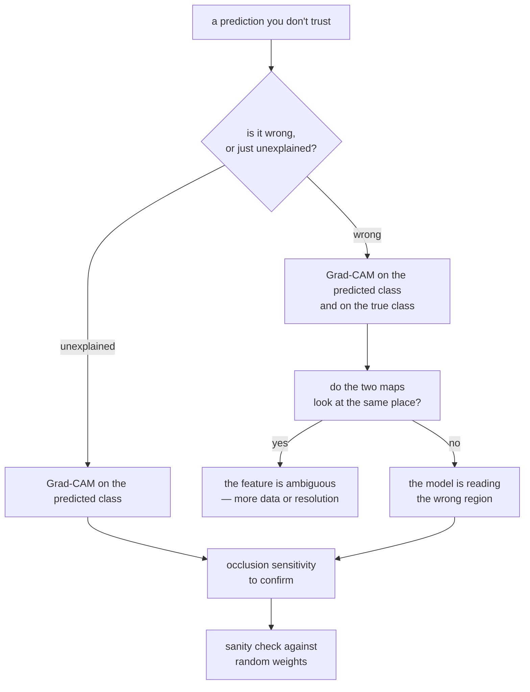

import DataCampExercise from "../../../../components/DataCampExercise.astro";
import Figure from "../../../../components/Figure.astro";
import Quiz from "../../../../components/Quiz.astro";

A convnet is more inspectable than most models because its features are pictures.
You can print them. That does not make the pictures *trustworthy* — a heat map is
itself the output of a computation, and a computation can produce a convincing
picture from an untrained network.

Everything here runs against one model: three convolutional blocks trained on 8,000
Fashion-MNIST rows for 15 epochs, **56,394 parameters, validation accuracy 0.7920**.
A deliberately mediocre model, because interpretation is a debugging tool and
debugging needs mistakes to look at.

## What you'll learn

- What layer activations actually look like, and the measured way they change with
  depth: **zero fraction 0.2071 → 0.4271, maximum 1.61 → 20.44** from the first
  block to the third.
- Why **4 of 64 third-block channels were silent** on the image, and what that means.
- How gradient ascent synthesises a filter's preferred input, and why **one filter
  refused to respond at all** (0.000 after 120 steps).
- Grad-CAM in nine lines of NumPy plus one `GradientTape`.
- **Occlusion sensitivity** as the slow, assumption-free check: 441 forward passes,
  agreeing with Grad-CAM at only **0.5697**.
- The sanity check most saliency methods fail — and how far this one gets: raw peaks
  **375× apart**, normalised maps still correlating at **0.6729**.

## Activations: what each layer actually responds to

The first technique needs no gradients. Build a model that outputs an intermediate
layer and call `predict`.

```python title="A probe on any intermediate layer"
probe = keras.Model(model.inputs, model.get_layer("conv1").output)
maps = probe.predict(image[None, ...], verbose=0)[0]   # (28, 28, 32)
```

Measured on one boot image:

| Layer | Shape | Mean | Max | Zero fraction | Silent channels |
| --- | --- | --- | --- | --- | --- |
| conv1 | (28, 28, 32) | 0.0994 | 1.6097 | 0.2071 | 0 of 32 |
| conv2 | (14, 14, 64) | 0.3567 | 4.2229 | 0.4271 | 0 of 64 |
| conv3 | (7, 7, 64) | 2.8666 | 20.4410 | 0.3559 | **4 of 64** |

<Figure
  src="/images/dl/phase-03-vision/interpreting-convnets/activation-maps"
  alt="Two rows of seven panels. The top row shows a boot image followed by six 28x28 conv1 activation maps, all of which highlight the whole silhouette of the boot with maxima between 1.27 and 1.61. The bottom row repeats the input followed by six 7x7 conv3 maps, which are coarse blocky patterns with maxima between 12.86 and 19.98 and no visible resemblance to the boot."
  title="The six most active channels of the first and last convolutional block"
  caption="Two honest observations. First, the six busiest conv1 channels look almost identical — ranked by mean activation, early filters are largely redundant on a single image, not the tidy set of oriented edge detectors that diagrams promise. Second, by conv3 the maps are 7x7 and have stopped being pictures: they are position-coded evidence, which is exactly why Grad-CAM's output is 7x7 and blocky."
/>

Three things in that table are worth reading carefully:

- **Activations grow with depth.** The maximum rises 1.61 → 4.22 → 20.44. Nothing
  normalises them here, and each layer adds its own scale. This is the same
  accumulation that broke the residual block on the
  [architectures page](/deep-learning/phase-03---computer-vision-with-cnns/famous-cnn-architectures-lenet-to-resnet/).
- **ReLU makes activations sparse.** The zero fraction climbs from 0.2071 to 0.4271:
  by the second block, nearly half of all positions carry no signal at all.
- **Silent channels are wasted capacity.** Four conv3 channels produced *nothing*
  anywhere in the image — the filter never fires for this input. A channel silent
  across the entire dataset is a dead unit; a channel silent on one image is
  specialisation.

## What a single filter is looking for

Activations tell you what a filter did on *this* image. Gradient ascent tells you
what it wants: start from noise and change the **input** to maximise one channel's
mean response.

```python title="Gradient ascent on the input, not the weights"
image = tf.Variable(tf.random.uniform((1, 28, 28, 1), 0.4, 0.6))
for _ in range(120):
    with tf.GradientTape() as tape:
        activation = tf.reduce_mean(probe(image, training=False)[..., channel])
    gradient = tape.gradient(activation, image)
    gradient = gradient / (tf.norm(gradient) + 1e-8)   # normalise, or it explodes
    image.assign_add(2.0 * gradient)
    image.assign(tf.clip_by_value(image, 0.0, 1.0))    # stay a valid image
```

The gradient is taken with respect to `image`; the weights never move. Two details
matter and both were learned the hard way: normalising the gradient makes one step
size work for every layer, and clipping keeps the result inside $[0, 1]$ so it is
still an image.

| Filter | Response after 120 steps | Image std | Fraction pinned at 0 or 1 |
| --- | --- | --- | --- |
| conv1 #0 | 0.167 | 0.4931 | 0.9656 |
| conv1 #1 | **0.021** | 0.1934 | 0.1378 |
| conv1 #2 | 0.147 | 0.4959 | 0.9821 |
| conv3 #0 | **0.000** | 0.0576 | 0.0000 |
| conv3 #1 | 17.526 | 0.4783 | 0.9375 |
| conv3 #2 | 12.838 | 0.4782 | 0.8520 |

<Figure
  src="/images/dl/phase-03-vision/interpreting-convnets/filter-maximisation"
  alt="Six greyscale 28x28 images in two rows. Four of them are high-contrast black-and-white stripe patterns — horizontal for conv1 filter 0, vertical for conv1 filter 2, and diagonal for conv3 filters 1 and 2. Two are almost featureless grey noise: conv1 filter 1 and conv3 filter 0."
  title="Inputs synthesised to maximise one filter each"
  caption="The four that worked are stripe patterns at different orientations and scales, and the deeper ones are visibly coarser — a bigger receptive field means a bigger stripe. The two flat panels are the interesting ones: conv3 filter 0 never rose above 0.000 in 120 steps, and its image stayed at std 0.0576. There is nothing to ascend when the gradient is zero everywhere, which is what a permanently dead ReLU channel looks like from the outside."
/>

The pinned fraction (0.9656, 0.9821, 0.9375) says the successful ascents ran straight
into the clipping bounds — the filter wants more contrast than an image can carry.
That is normal, and it is why published filter visualisations add a smoothness
penalty or blur between steps: without one, you get maximum-contrast stripes rather
than anything a photograph would contain.

## Grad-CAM

Activations and filter maximisation are class-agnostic. Grad-CAM answers the question
you actually have when a prediction is wrong: **which positions drove *this* class?**

The recipe, in full:

$$
\alpha_k = \frac{1}{HW}\sum_{i,j} \frac{\partial y_c}{\partial A^k_{ij}}
\qquad
L = \mathrm{ReLU}\!\left(\sum_k \alpha_k A^k\right)
$$

$A^k$ is the $k$-th channel of the last convolutional layer, $y_c$ is the score for
class $c$. The weight $\alpha_k$ is the **average gradient** of that score with
respect to the channel — how much this channel matters, globally. The map is the
weighted sum of channels, with negative evidence discarded by the ReLU.

```python title="Grad-CAM"
probe = keras.Model(model.inputs, [model.get_layer("conv3").output, model.output])
with tf.GradientTape() as tape:
    maps, predictions = probe(image[None, ...], training=False)
    score = predictions[:, class_index]
gradient = tape.gradient(score, maps)[0].numpy()
weights = gradient.mean(axis=(0, 1))                       # one alpha per channel
heat = np.maximum((maps[0].numpy() * weights).sum(axis=-1), 0)
heat = heat / (heat.max() + 1e-8)
```

The output is **7×7** — the spatial size of `conv3`, upsampled for display. Grad-CAM
cannot be sharper than the layer it reads, which is the price of reading a layer deep
enough to know what a class is.

<Figure
  src="/images/dl/phase-03-vision/interpreting-convnets/gradcam"
  alt="Two rows of six panels alternating image and heat map. Top row, correct predictions: a boot with heat across its lower half, a pullover with heat on its lower body, and trousers with a strong vertical band of heat down the legs. Bottom row, wrong predictions: a coat called trouser with heat down its centre, a coat called shirt with scattered heat at the shoulders, and a bag called boot with heat concentrated on its left edge and strap."
  title="Grad-CAM for three correct and three incorrect predictions"
  caption="The correct row is unsurprising — the trousers prediction (confidence 0.9998) sits on a vertical band exactly where the legs are. The wrong row is where the technique earns its keep: the coat called 'trouser' (0.3479) is being read down its central vertical opening, which really does look like the gap between two legs at 7x7 resolution, and the bag called 'boot' (0.5904) is being read at its strap. The model is not hallucinating; it is looking at a real feature and drawing the wrong conclusion from it."
/>

| Prediction | True | Said | Confidence | Heat map centre mass |
| --- | --- | --- | --- | --- |
| correct | boot | boot | 0.6820 | 0.3448 |
| correct | pullover | pullover | 0.8352 | 0.3260 |
| correct | trouser | trouser | **0.9998** | 0.4151 |
| wrong | coat | trouser | 0.3479 | 0.3391 |
| wrong | coat | shirt | 0.4911 | **0.1229** |
| wrong | bag | boot | 0.5904 | 0.2067 |

## The sanity check

Here is the part that most tutorials skip. Grad-CAM produces a plausible-looking heat
map from a network with **random weights**, because a weighted sum of random feature
maps is still a smooth blob with a peak somewhere. If you never compare against that
baseline, you cannot distinguish "the model looks here" from "this arithmetic
produces blobs".

```python title="The check to run before you trust any saliency map"
trained_map = gradcam(model, image, class_index)
random_map = gradcam(freshly_initialised_model, image, class_index)
print(np.corrcoef(trained_map.ravel(), random_map.ravel())[0, 1])
```

Exercise 5 runs it, and the answer is uncomfortable in a useful way:

| | Raw peak before normalising | Cells above 0.1 |
| --- | --- | --- |
| trained | **0.0761** | 17 of 49 |
| untrained | **0.0002** | 31 of 49 |

The raw magnitudes differ by **375×** — training clearly changed something. But the
**normalised** maps still correlate at **0.6729**, which means roughly two thirds of the
shape of a Grad-CAM picture here comes from the architecture and the arithmetic rather
than from what the network learned.

Both halves matter. Normalisation is what makes the map displayable, and it is also what
throws away the evidence that the trained map is 375× stronger. If you publish a
normalised heat map without this comparison, you are showing a picture that an untrained
network largely reproduces.

The complementary check is **occlusion sensitivity**: slide a grey patch over the
image and record how far the confidence falls. It makes no assumption about
gradients, layers or linearity — it just deletes information and measures the
consequence. It costs one forward pass per position (441 for an 8×8 patch on 28×28,
Exercise 3), which is exactly why Grad-CAM exists.



```p5 title="Grad-CAM as a weighted sum" desc="Drag the four alpha weights and watch the heat map change. This is the entire method — one weight per channel, then ReLU." height="360"
const N = 7;
let alphas = [0.9, -0.4, 0.5, 0.2];
let dragging = -1;
const maps = [];
function setup() {
  createCanvas(620, 360);
  textFont("monospace");
  noStroke();
  for (let k = 0; k < 4; k++) {
    const m = [];
    for (let r = 0; r < N; r++) {
      const row = [];
      for (let c = 0; c < N; c++) {
        const cy = [1.5, 5.0, 3.0, 3.0][k];
        const cx = [3.0, 3.0, 1.5, 5.5][k];
        const d = (r - cy) * (r - cy) + (c - cx) * (c - cx);
        row.push(Math.exp(-d / 4.0));
      }
      m.push(row);
    }
    maps.push(m);
  }
}
function heat() {
  const out = [];
  let peak = 1e-9;
  for (let r = 0; r < N; r++) {
    const row = [];
    for (let c = 0; c < N; c++) {
      let v = 0;
      for (let k = 0; k < 4; k++) v += alphas[k] * maps[k][r][c];
      v = Math.max(v, 0);
      peak = Math.max(peak, v);
      row.push(v);
    }
    out.push(row);
  }
  return { out, peak };
}
function jet(v) {
  const stops = [[13, 17, 40], [30, 90, 190], [60, 200, 170],
    [250, 210, 70], [230, 70, 60]];
  const x = Math.min(Math.max(v, 0), 1) * (stops.length - 1);
  const i = Math.floor(x);
  const t = x - i;
  const a = stops[i];
  const b = stops[Math.min(i + 1, stops.length - 1)];
  return [a[0] + (b[0] - a[0]) * t, a[1] + (b[1] - a[1]) * t,
    a[2] + (b[2] - a[2]) * t];
}
function draw() {
  background(13, 17, 23);
  const cell = 22;
  fill(220);
  textSize(11);
  textAlign(LEFT, TOP);
  text("four conv3 channels A_k", 24, 18);
  for (let k = 0; k < 4; k++) {
    const ox = 24 + k * (N * cell * 0.55 + 14);
    for (let r = 0; r < N; r++) {
      for (let c = 0; c < N; c++) {
        const g = maps[k][r][c] * 200;
        fill(g, g, g);
        rect(ox + c * cell * 0.55, 40 + r * cell * 0.55,
          cell * 0.55 - 1, cell * 0.55 - 1);
      }
    }
    fill(alphas[k] >= 0 ? 165 : 230, alphas[k] >= 0 ? 214 : 110,
      alphas[k] >= 0 ? 164 : 110);
    textSize(10);
    text("alpha " + alphas[k].toFixed(2), ox, 40 + N * cell * 0.55 + 4);
  }
  fill(220);
  textSize(11);
  text("drag a slider", 24, 132);
  for (let k = 0; k < 4; k++) {
    const y = 152 + k * 22;
    fill(60, 70, 84);
    rect(24, y + 6, 200, 4, 2);
    const x = 24 + ((alphas[k] + 1) / 2) * 200;
    fill(alphas[k] >= 0 ? 165 : 230, alphas[k] >= 0 ? 214 : 110,
      alphas[k] >= 0 ? 164 : 110);
    circle(x, y + 8, 13);
    fill(200);
    textSize(10);
    textAlign(LEFT, CENTER);
    text("A" + k, 232, y + 8);
  }
  const h = heat();
  fill(220);
  textSize(11);
  textAlign(LEFT, TOP);
  text("ReLU(sum alpha_k A_k), normalised", 300, 132);
  for (let r = 0; r < N; r++) {
    for (let c = 0; c < N; c++) {
      const col = jet(h.out[r][c] / h.peak);
      fill(col[0], col[1], col[2]);
      rect(300 + c * 26, 152 + r * 26, 25, 25);
    }
  }
  fill(255, 211, 67);
  textSize(10);
  const active = h.out.flat().filter((v) => v > 0.1 * h.peak).length;
  text("peak " + h.peak.toFixed(3) + "   cells above 10% of peak: " + active
    + " of " + N * N, 300, 340);
  fill(150);
  text("negative alphas are discarded by the ReLU", 24, 250);
}
function mousePressed() {
  for (let k = 0; k < 4; k++) {
    const y = 152 + k * 22 + 8;
    if (Math.abs(mouseY - y) < 11 && mouseX > 18 && mouseX < 232) dragging = k;
  }
}
function mouseDragged() {
  if (dragging >= 0) {
    alphas[dragging] = Math.min(Math.max((mouseX - 24) / 200, 0), 1) * 2 - 1;
  }
}
function mouseReleased() { dragging = -1; }
```

```p5 title="The measured table, ranked" desc="Click a column to rank every row by it. The bars are that column's values and the highest and lowest are computed from the numbers, not written in." height="306"
let metric = 0;
const COLUMNS = ["Response after 120 steps", "Image std", "Fraction pinned at 0 or 1"];
const ROWS = [
  ["conv1 #0", 0.167, 0.4931, 0.9656],
  ["conv1 #1", 0.021, 0.1934, 0.1378],
  ["conv1 #2", 0.147, 0.4959, 0.9821],
  ["conv3 #0", 0, 0.0576, 0],
  ["conv3 #1", 17.526, 0.4783, 0.9375],
  ["conv3 #2", 12.838, 0.4782, 0.852]
];
function setup() {
  createCanvas(620, 306);
  textFont("monospace");
}
function fmt(v) {
  if (v === 0) { return "0"; }
  const a = Math.abs(v);
  if (a >= 1000 || a < 0.001) { return v.toExponential(2); }
  if (a >= 100) { return v.toFixed(1); }
  return v.toFixed(4);
}
function draw() {
  background(13, 17, 23);
  noStroke();
  fill(230);
  textSize(12);
  textAlign(LEFT, TOP);
  text("Interpreting What Convnets Learn (", 26, 16);
  let x = 26;
  for (let i = 0; i < COLUMNS.length; i++) {
    const w = COLUMNS[i].length * 6.6 + 16;
    if (i === metric) { fill(255, 211, 67); } else { fill(48, 56, 68); }
    rect(x, 40, w, 22, 4);
    if (i === metric) { fill(13, 17, 23); } else { fill(180); }
    textSize(9);
    text(COLUMNS[i], x + 8, 47);
    x += w + 6;
    if (x > 500) { break; }
  }
  const values = ROWS.map((r) => r[metric + 1]);
  const lo = Math.min(...values);
  const hi = Math.max(...values);
  const span = hi - lo === 0 ? 1 : hi - lo;
  const order = ROWS.slice().sort((a, b) => b[metric + 1] - a[metric + 1]);
  for (let i = 0; i < order.length; i++) {
    const y = 78 + i * 26;
    const v = order[i][metric + 1];
    fill(160);
    textSize(9);
    text(order[i][0], 26, y + 5);
    fill(34, 40, 50);
    rect(230, y, 280, 18, 3);
    const frac = (v - lo) / span;
    if (v === hi) { fill(126, 192, 143); }
    else if (v === lo) { fill(224, 108, 117); }
    else { fill(107, 169, 221); }
    rect(230, y, Math.max(frac * 280, 3), 18, 3);
    fill(225);
    textSize(9);
    text(fmt(v), 518, y + 5);
  }
  const top = order[0];
  const bottom = order[order.length - 1];
  fill(150);
  textSize(9);
  const base = 78 + order.length * 26 + 8;
  text("highest " + COLUMNS[metric] + ": " + top[0] + " at " + fmt(top[1]),
       26, base);
  text("lowest  " + COLUMNS[metric] + ": " + bottom[0] + " at "
       + fmt(bottom[1]), 26, base + 14);
  text("bars are scaled within the chosen column - lowest is not zero", 26,
       base + 30);
}
function mousePressed() {
  let x = 26;
  for (let i = 0; i < COLUMNS.length; i++) {
    const w = COLUMNS[i].length * 6.6 + 16;
    if (mouseX > x && mouseX < x + w && mouseY > 40 && mouseY < 62) {
      metric = i;
    }
    x += w + 6;
  }
}
```

## Pitfalls

- **Trusting a heat map without the random-weights check.** Measured here, the trained
  and untrained *normalised* maps correlate at 0.6729 — most of the picture's shape is
  architectural.
- **Normalising away the evidence.** The trained map's raw peak was 375× the untrained
  one's (0.0761 against 0.0002); dividing by the maximum discards exactly that.
- **Reading Grad-CAM as pixel-level evidence.** The map here is 7×7 upsampled to
  28×28; every "region" is a 4×4 block.
- **Taking Grad-CAM from the wrong layer.** Too early and it has no class
  information; too late (after global pooling) and it has no positions.
- **Explaining only the predicted class.** For a wrong prediction, also compute the
  map for the *true* class — the comparison is the diagnosis.
- **Concluding a filter is broken from one gradient-ascent failure.** conv3 filter 0
  returned 0.000, which is consistent with a dead channel; confirm it across images
  before believing it.
- **Publishing raw gradient-ascent images as "what the filter sees".** 0.9656 of the
  pixels were pinned at the clipping bounds. Without a smoothness penalty these are
  adversarial-contrast patterns, not natural features.
- **Interpreting a model you have not validated.** This one scores 0.7920. An
  explanation of a bad model explains bad behaviour.

## Recap

- An intermediate probe is `keras.Model(model.inputs, layer.output)` — no gradients
  needed.
- Activations grew from max 1.61 (conv1) to 20.44 (conv3) with the ReLU zero fraction
  rising 0.2071 → 0.4271, and 4 of 64 conv3 channels were silent on the test image.
- Gradient ascent on the *input* synthesises a filter's preferred stimulus; two of six
  filters failed, one of them (0.000 response) consistent with a dead channel.
- Grad-CAM = average gradient per channel → weighted sum of channels → ReLU. Nine
  lines, resolution fixed by the layer you read.
- Wrong predictions were readable: a coat called "trouser" was being read down its
  central opening; a bag called "boot" at its strap.
- The random-weights check gave raw peaks of 0.0761 against 0.0002 but normalised maps
  correlating at 0.6729 — run it, and report both numbers.
- Occlusion sensitivity cost 441 forward passes for one 28×28 image, agreed with
  Grad-CAM at 0.5697, and found a region whose removal *raised* confidence by 0.0534 —
  something a gradient map cannot express.

## Next

Segmentation labelled every pixel and Grad-CAM located a class approximately. Boxes
are the middle ground, and they need a different output format entirely:
[Object Detection (Bounding Boxes and YOLO)](/deep-learning/phase-03---computer-vision-with-cnns/object-detection-bounding-boxes-and-yolo/).

<Quiz
  questions={[
    {
      q: "Grad-CAM on this model produces a 7x7 map for a 28x28 input. Why not 28x28?",
      options: [
        "Because the heat map is always downsampled by 4 for display",
        "Because it reads the last convolutional layer, whose spatial size is 7x7 after two pooling steps — resolution is bounded by the layer you take gradients at",
        "Because the ReLU discards three quarters of the positions",
        "Because gradients are only defined at pooled positions",
      ],
      answer: 1,
      explain: "Taking the map from an earlier layer gives more resolution and less class information. That trade-off is the method's main limitation.",
    },
    {
      q: "Gradient ascent on conv3 filter 0 returned a mean response of 0.000 after 120 steps, and the synthesised image stayed at std 0.0576. What is the most likely explanation?",
      options: [
        "The learning rate of 2.0 was too small",
        "The channel is dead — a ReLU that outputs zero for every input has zero gradient, so there is nothing for ascent to climb",
        "120 steps is not enough for a deep layer",
        "The image needed to be initialised from a real photograph",
      ],
      answer: 1,
      explain: "The measurement backs it up: 4 of 64 conv3 channels produced no activation anywhere on the test image either.",
    },
    {
      q: "What does the random-weights sanity check tell you?",
      options: [
        "Whether the model has converged",
        "Whether the saliency map depends on what the model learned, rather than on the architecture and the arithmetic of the method",
        "Whether the input image is in distribution",
        "Whether the learning rate was correct",
      ],
      answer: 1,
      explain: "A weighted sum of random feature maps is still a smooth blob with a peak. If the trained and random maps agree, the map is not evidence about the model.",
    },
    {
      q: "The zero fraction of activations rose from 0.2071 in conv1 to 0.4271 in conv2. What causes it?",
      options: [
        "Max pooling discarding values",
        "The ReLU: every negative pre-activation becomes exactly zero, and deeper layers have more negative pre-activations",
        "Numerical underflow in float32",
        "Dropout, which is active during prediction",
      ],
      answer: 1,
      explain: "Sparsity is a feature of ReLU networks, not a bug — but a channel that is zero for every input is a dead unit and pure waste.",
    },
    {
      q: "Occlusion sensitivity needed 441 forward passes for one 28x28 image with an 8x8 patch. When is that worth paying?",
      options: [
        "Never — Grad-CAM is strictly better",
        "When you need an explanation that makes no assumption about gradients or layer choice, for example to check a Grad-CAM map you are about to act on",
        "Only for models without convolutional layers",
        "Only when the model is untrained",
      ],
      answer: 1,
      explain: "It measures the thing you actually care about — what happens to the prediction when information is removed — at a cost that scales with image area.",
    },
  ]}
/>

## 🧪 Try It Yourself

<DataCampExercise
  lang="python"
  hint={`A probe is keras.Model(model.inputs, model.get_layer(name).output). A channel is silent when its maximum over both spatial axes is exactly zero.`}
  code={`# Task: Exercise 1 - Activations get sparser and larger with depth
import numpy as np
from tensorflow import keras

CLASSES = ("t-shirt", "trouser", "pullover", "dress", "coat", "sandal",
           "shirt", "sneaker", "bag", "boot")
(x_train, y_train), (x_test, y_test) = keras.datasets.fashion_mnist.load_data()
x_train = x_train[:8000].astype("float32")[..., None] / 255.0
y_train = y_train[:8000]
x_test = x_test[:2000].astype("float32")[..., None] / 255.0
y_test = y_test[:2000]

keras.utils.set_random_seed(0)
inputs = keras.layers.Input((28, 28, 1))
x = keras.layers.Conv2D(32, 3, padding="same", activation="relu",
                        name="conv1")(inputs)
x = keras.layers.MaxPooling2D(2)(x)
x = keras.layers.Conv2D(64, 3, padding="same", activation="relu",
                        name="conv2")(x)
x = keras.layers.MaxPooling2D(2)(x)
x = keras.layers.Conv2D(64, 3, padding="same", activation="relu",
                        name="conv3")(x)
pooled = keras.layers.GlobalAveragePooling2D()(x)
model = keras.Model(inputs, keras.layers.Dense(10, activation="softmax",
                                               name="head")(pooled))
model.compile(keras.optimizers.Adam(1e-3), "sparse_categorical_crossentropy",
              metrics=["accuracy"])
history = model.fit(x_train, y_train, epochs=15, batch_size=128, verbose=0,
                    validation_data=(x_test, y_test))
print(f"val acc {history.history['val_accuracy'][-1]:.4f}  "
      f"params {model.count_params():,}")

image = x_test[0]
print(f"one image, true class {CLASSES[int(y_test[0])]}")
print(f"{'layer':8s} {'shape':>14} {'mean':>8} {'max':>8} "
      f"{'zero fraction':>14} {'silent channels':>16}")
for name in ("conv1", "conv2", "conv3"):
    probe = keras.Model(model.inputs, model.get_layer(___).output)
    # replace ___ with name
    maps = probe.predict(image[None, ...], verbose=0)[0]
    silent = int((maps.max(axis=(0, 1)) == 0).sum())
    print(f"{name:8s} {str(maps.shape):>14} {maps.mean():8.4f} "
          f"{maps.max():8.4f} {float((maps == 0).mean()):14.4f} "
          f"{f'{silent} of {maps.shape[-1]}':>16}")

# -- Expected Output -------------------------------------------
# val acc 0.7920  params 56,394
# one image, true class boot
# layer             shape     mean      max  zero fraction  silent channels
# conv1    (28, 28, 32)   0.0994   1.6097         0.2071       0 of 32
# conv2    (14, 14, 64)   0.3567   4.2229         0.4271       0 of 64
# conv3      (7, 7, 64)   2.8666  20.4410         0.3559       4 of 64
# --------------------------------------------------------------`}
/>

<DataCampExercise
  lang="python"
  hint={`The alpha for a channel is the mean of the gradient of the class score with respect to that channel. Average over the two spatial axes only.`}
  code={`# Task: Exercise 2 - Grad-CAM from scratch
import numpy as np
import tensorflow as tf
from tensorflow import keras

# (build and train the model exactly as in Exercise 1, then:)


def gradcam(model, image, class_index, layer_name="conv3"):
    probe = keras.Model(model.inputs, [model.get_layer(layer_name).output,
                                       model.output])
    with tf.GradientTape() as tape:
        maps, predictions = probe(image[None, ...], training=False)
        score = predictions[:, class_index]
    gradient = tape.gradient(score, maps)[0].numpy()
    weights = gradient.mean(axis=(___))          # replace ___ with 0, 1
    heat = np.maximum((maps[0].numpy() * weights).sum(axis=-1), 0)
    return heat / (heat.max() + 1e-8)


probabilities = model.predict(x_test, verbose=0)
predicted = probabilities.argmax(axis=1)
image = x_test[0]
guess = int(predicted[0])
heat = gradcam(model, image, guess)
print(f"conv3 is 7x7, so the map is {heat.shape} — "
      f"{28 // heat.shape[0]}x coarser than the input")
print(f"said {CLASSES[guess]} with confidence {probabilities[0, guess]:.4f}")
print(f"heat map: min {heat.min():.4f}  max {heat.max():.4f}  "
      f"mean {heat.mean():.4f}")
runner_up = int(np.argsort(-probabilities[0])[1])
other = gradcam(model, image, runner_up)
print(f"explained as {CLASSES[runner_up]} instead: correlation "
      f"{np.corrcoef(heat.ravel(), other.ravel())[0, 1]:.4f}")
print("a negative correlation means the two classes are argued from different")
print("regions - which is the most useful thing Grad-CAM can tell you about a")
print("low-confidence prediction")

# -- Expected Output -------------------------------------------
# conv3 is 7x7, so the map is (7, 7) — 4x coarser than the input
# said boot with confidence 0.6820
# heat map: min 0.0000  max 1.0000  mean 0.2145
# explained as sneaker instead: correlation -0.5960
# the two explanations are anti-correlated: the evidence for 'sneaker' sits
# where the evidence for 'boot' does not
# --------------------------------------------------------------`}
/>

<DataCampExercise
  lang="python"
  hint={`Build one occluded copy of the image per patch position, predict them all in a single batch, and subtract from the unoccluded confidence.`}
  code={`# Task: Exercise 3 - Occlusion sensitivity, the gradient-free check
import numpy as np

# (model, x_test, probabilities and gradcam from the previous exercises)

PATCH = 8
guess = int(probabilities[0].argmax())
base = float(probabilities[0, guess])
grid = 28 - PATCH + 1
batch = []
for top in range(grid):
    for left in range(grid):
        occluded = x_test[0].copy()
        occluded[top:top + PATCH, left:left + PATCH] = 0.0
        batch.append(occluded)
scores = model.predict(np.stack(batch), verbose=0)[:, guess]
drops = base - scores.reshape(grid, ___)          # replace ___ with grid
worst = np.unravel_index(drops.argmax(), drops.shape)
print(f"{grid * grid} forward passes with an {PATCH}x{PATCH} patch")
print(f"unoccluded confidence {base:.4f}")
print(f"largest drop {drops.max():.4f} at row {worst[0]}, column {worst[1]}")
print(f"smallest drop {drops.min():.4f}  mean drop {drops.mean():.4f}")
heat = gradcam(model, x_test[0], guess)
coarse = drops[:heat.shape[0] * 3:3, :heat.shape[1] * 3:3]
print(f"correlation with the Grad-CAM map: "
      f"{np.corrcoef(coarse.ravel(), heat.ravel())[0, 1]:.4f}")
print("a negative drop means hiding that region made the model *more*")
print("confident, which is information Grad-CAM cannot give you")

# -- Expected Output -------------------------------------------
# 441 forward passes with an 8x8 patch
# unoccluded confidence 0.6820
# largest drop 0.6791 at row 12, column 16
# smallest drop -0.0534  mean drop 0.2326
# correlation with the Grad-CAM map: 0.5697
# a negative drop means hiding that region made the model *more*
# confident, which is information Grad-CAM cannot give you
# --------------------------------------------------------------`}
/>

<DataCampExercise
  lang="python"
  hint={`The gradient is taken with respect to the input variable. Normalise it before the step, and clip the image back into [0, 1] afterwards.`}
  code={`# Task: Exercise 4 - Synthesise a filter's preferred input
import numpy as np
import tensorflow as tf
from tensorflow import keras

# (model from Exercise 1)

probe = keras.Model(model.inputs, model.get_layer("conv1").output)
keras.utils.set_random_seed(0)
synthetic = tf.Variable(tf.random.uniform((1, 28, 28, 1), 0.4, 0.6, seed=0))
print(f"{'step':>6} {'mean response':>15} {'image std':>11}")
for step in range(121):
    if step % 30 == 0:
        response = float(tf.reduce_mean(
            probe(synthetic, training=False)[..., 0]).numpy())
        print(f"{step:6d} {response:15.4f} "
              f"{float(synthetic.numpy().std()):11.4f}")
    with tf.GradientTape() as tape:
        activation = tf.reduce_mean(probe(synthetic, training=False)[..., 0])
    gradient = tape.gradient(activation, ___)     # replace ___ with synthetic
    gradient = gradient / (tf.norm(gradient) + 1e-8)
    synthetic.assign_add(2.0 * gradient)
    synthetic.assign(tf.clip_by_value(synthetic, 0.0, 1.0))
picture = synthetic.numpy()[0, :, :, 0]
print(f"fraction of pixels pinned at 0 or 1: "
      f"{float(((picture <= 1e-6) | (picture >= 1 - 1e-6)).mean()):.4f}")
print("the ascent runs into the clipping bounds: the filter wants more")
print("contrast than an image can represent")

# -- Expected Output -------------------------------------------
#   step   mean response   image std
#      0          0.0140      0.0576
#     30          0.1633      0.4788
#     60          0.1660      0.4894
#     90          0.1663      0.4914
#    120          0.1666      0.4931
# fraction of pixels pinned at 0 or 1: 0.9656
# the ascent runs into the clipping bounds: the filter wants more
# contrast than an image can represent
# --------------------------------------------------------------`}
/>

<DataCampExercise
  lang="python"
  hint={`Build a second model with the same architecture and a different seed, do not train it, and run the identical Grad-CAM function on both.`}
  code={`# Task: Exercise 5 - The sanity check: does the map depend on training?
import numpy as np
import tensorflow as tf
from tensorflow import keras

# (trained model, x_test and probabilities from Exercise 1)


def build(seed):
    keras.utils.set_random_seed(seed)
    inputs = keras.layers.Input((28, 28, 1))
    x = keras.layers.Conv2D(32, 3, padding="same", activation="relu",
                            name="conv1")(inputs)
    x = keras.layers.MaxPooling2D(2)(x)
    x = keras.layers.Conv2D(64, 3, padding="same", activation="relu",
                            name="conv2")(x)
    x = keras.layers.MaxPooling2D(2)(x)
    x = keras.layers.Conv2D(64, 3, padding="same", activation="relu",
                            name="conv3")(x)
    pooled = keras.layers.GlobalAveragePooling2D()(x)
    return keras.Model(inputs, keras.layers.Dense(10, activation="softmax",
                                                  name="head")(pooled))


def gradcam_raw(target, image, class_index, layer_name="conv3"):
    probe = keras.Model(target.inputs, [target.get_layer(layer_name).output,
                                        target.output])
    with tf.GradientTape() as tape:
        maps, predictions = probe(image[None, ...], training=False)
        score = predictions[:, class_index]
    gradient = tape.gradient(score, maps)[0].numpy()
    weights = gradient.mean(axis=(0, 1))
    raw = np.maximum((maps[0].numpy() * weights).sum(axis=-1), 0)
    return raw / (raw.max() + 1e-8), float(raw.max())


untrained = build(1)                       # same architecture, never fitted
image = x_test[0]
guess = int(probabilities[0].argmax())
trained_map, trained_peak = gradcam_raw(model, image, guess)
random_map, random_peak = gradcam_raw(untrained, image, guess)
print(f"{'model':12s} {'raw peak':>12} {'cells above 0.1':>16}")
for label, heat_map, peak in (("trained", trained_map, trained_peak),
                              ("untrained", random_map, random_peak)):
    print(f"{label:12s} {peak:12.4f} "
          f"{int((heat_map > 0.1).sum()):16d}")
correlation = np.corrcoef(trained_map.ravel(), ___.ravel())[0, 1]
# replace ___ with random_map
print(f"correlation between the two maps: {correlation:.4f}")
print("an untrained network still produces a smooth blob with a peak; if your")
print("method cannot tell the two apart it is not measuring the model")

# -- Expected Output -------------------------------------------
# model            raw peak  cells above 0.1
# trained            0.0761               17
# untrained          0.0002               31
# correlation between the two maps: 0.6729
# an untrained network still produces a smooth blob with a peak; if your
# method cannot tell the two apart it is not measuring the model
#
# (the raw peak differs by 375x, but the *normalised* maps still correlate at
#  0.67 — so part of what Grad-CAM shows is the architecture, not the weights)
# --------------------------------------------------------------`}
/>
