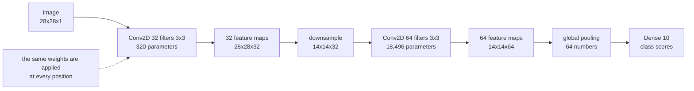

Every model so far flattened its input. Flattening a 28×28 image throws away the
fact that pixel (5, 5) is next to pixel (5, 6) — and then asks the network to
rediscover it from 784 unordered numbers. Convolution keeps that structure, and
the saving is not subtle: on a 224×224 photo the first layer goes from **4,816,928
parameters to 896**.

Every measurement on this page uses **Fashion-MNIST** — 28×28 greyscale clothing
images, ten classes — because it is small enough to run every experiment on a CPU
in seconds and real enough that the results mean something.

## What you'll learn

- Convolution implemented in twelve lines and matched to `tf.nn.conv2d` at
  **2.38e−07**.
- What four hand-written kernels do to a real image, and why the kernel's *sum*
  predicts its behaviour.
- The parameter saving, counted: **78×** on Fashion-MNIST, **5,376×** on a
  224×224 photo.
- Receptive-field arithmetic: eight 3×3 layers see **17×17**; add stride 2 and
  they see **511×511**.
- Output-shape arithmetic for `valid` and `same` padding at three strides,
  checked against Keras.
- Equivariance verified: shifting the input shifts the feature map by exactly
  **0.00e+00** in the interior.

## Convolution is a small weighted sum, repeated

A kernel is a small grid of weights. Slide it across the image, and at each
position write down the sum of (kernel weight × pixel underneath):

$$
\text{out}[i, j] = \sum_{u=0}^{k-1} \sum_{v=0}^{k-1}
K[u, v] \cdot \text{in}[i + u, \; j + v]
$$

```python title="The whole operation, no framework"
def convolve(image, kernel):
    size = kernel.shape[0]
    out = np.zeros((image.shape[0] - size + 1, image.shape[1] - size + 1))
    for row in range(out.shape[0]):
        for column in range(out.shape[1]):
            patch = image[row:row + size, column:column + size]
            out[row, column] = (patch * kernel).sum()
    return out
```

On a 28×28 input with a 3×3 kernel that gives a **26×26** output —
$28 - 3 + 1 = 26$ — and it costs 9 multiply-adds per output pixel, **6,084** for
the whole map. Checked against `tf.nn.conv2d`: maximum difference **2.38e−07**,
which is float32 rounding.

<Figure
  src="/images/dl/phase-03-vision/intro-to-cnns/kernels-on-an-image"
  alt="Five greyscale panels. The first is a 28x28 Fashion-MNIST pullover. The next four show the same image after a vertical-edge kernel, which highlights the left and right sides of the garment; a horizontal-edge kernel, which highlights the shoulders and hem; a sharpen kernel, which crisps the outline; and a 3x3 mean blur, which softens everything."
  title="Four hand-written 3x3 kernels on one image"
  caption="No training involved — these are four fixed grids of nine numbers each. The vertical-edge kernel responds to the garment's left and right boundaries and is near zero across the flat body; the horizontal one picks out the shoulders and hem instead. The two kernels whose weights sum to 1 preserve the image's overall brightness; the two that sum to 0 return zero wherever the input is flat."
/>

| Kernel | Sum of weights | Response range | Mean \|response\| |
| --- | --- | --- | --- |
| vertical edges | 0.00 | −4.0000 to 4.0000 | 0.7425 |
| horizontal edges | 0.00 | −3.8627 to 3.8706 | 0.4515 |
| sharpen | 1.00 | −1.8510 to 2.8941 | **0.8813** |
| blur (3×3 mean) | 1.00 | 0.0000 to 0.9617 | 0.6557 |

The sum of the weights tells you what a kernel is for. **Sum to zero and it
measures change**: a flat patch produces exactly zero, so the output is an edge
map. **Sum to one and it preserves brightness**: the blur's output range
(0.0000–0.9617) is nearly the input's (0.0000–1.0000), because it is an average.

A convnet learns these numbers instead of being given them — but the first layer
of a trained convnet reliably ends up looking like this set.

## What it buys: parameters that do not depend on the image size

A `Dense` layer connects every input to every unit. A `Conv2D` layer connects a
$k \times k$ window to every unit, and **reuses the same weights at every
position**.

$$
\text{Dense: } n_{\text{in}} \times u + u
\qquad
\text{Conv2D: } k^2 \times c_{\text{in}} \times c_{\text{out}} + c_{\text{out}}
$$

<Figure
  src="/images/dl/phase-03-vision/intro-to-cnns/parameter-comparison"
  alt="Log-scale bar chart comparing Dense(32) against Conv2D(32, 3x3) for three input sizes. Dense grows from 25,120 to 98,336 to 4,816,928 parameters while Conv2D stays at 320, 896 and 896."
  title="Same 32 outputs, two ways of connecting them"
  caption="The Conv2D bars barely move: 320 parameters on a 28x28x1 input and 896 on a 224x224x3 one, because the count depends only on the kernel size and the channel counts. The Dense bars grow with the pixel count, reaching 4,816,928 on the photo — 5,376 times more for the same 32 outputs."
/>

| Input | `Dense(32)` | `Conv2D(32, 3×3)` | Ratio |
| --- | --- | --- | --- |
| Fashion-MNIST 28×28×1 | 25,120 | **320** | 78× |
| small colour 32×32×3 | 98,336 | 896 | 110× |
| photo 224×224×3 | **4,816,928** | **896** | **5,376×** |

Two properties fall out of weight sharing, and they are the reason convnets work
on images:

- **The parameter count is independent of the input size.** The same
  `Conv2D(32, 3×3)` layer handles 28×28 and 224×224 with 896 parameters, so a
  bigger image costs compute but not memory for weights.
- **A feature learned in one place works everywhere.** A `Dense` layer would have
  to learn "vertical edge" separately for every position it might appear in.



Each filter produces one **feature map** — a 2-D image of "how strongly this
pattern responded here". A layer with 32 filters produces 32 of them, stacked
into a depth axis, and the next layer's kernels span that whole depth: a 3×3
kernel over 32 channels is $3 \times 3 \times 32 = 288$ weights per filter.

## Output shapes, exactly

| Padding | Stride | Formula | Output side |
| --- | --- | --- | --- |
| `valid` | 1 | $\lceil (28 - 3 + 1)/1 \rceil$ | 26 |
| `valid` | 2 | $\lceil (28 - 3 + 1)/2 \rceil$ | 13 |
| `valid` | 3 | $\lceil (28 - 3 + 1)/3 \rceil$ | 9 |
| `same` | 1 | $\lceil 28/1 \rceil$ | **28** |
| `same` | 2 | $\lceil 28/2 \rceil$ | 14 |
| `same` | 3 | $\lceil 28/3 \rceil$ | 10 |

Every row was checked against a real `Conv2D` layer. The trap is in the name:
**`padding="same"` does not mean "same output size"** — it means "pad so the
kernel can be centred on every input pixel". With stride 1 that happens to
preserve the size; with stride 2 it halves it.

## Receptive fields: how deep is deep enough

Each layer's output pixel depends on a small window of the layer below, which
depends on a larger window below that. The recursion is

$$
r_{\ell} = r_{\ell-1} + (k - 1) \cdot j_{\ell-1},
\qquad
j_{\ell} = j_{\ell-1} \cdot s
$$

where $r$ is the receptive field, $j$ the jump, $k$ the kernel size and $s$ the
stride.

<Figure
  src="/images/dl/phase-03-vision/intro-to-cnns/receptive-field"
  alt="Log-scale plot of receptive field against layers stacked. The 3x3 stride-1 line grows linearly to 17 pixels at eight layers, the 5x5 line to 33, and the stride-2 line grows exponentially to 511. A dashed line marks the 28-pixel image size."
  title="How far back into the input each layer can see"
  caption="With stride 1 the receptive field grows linearly — eight 3x3 layers reach 17 pixels, still less than a whole 28-pixel image. Introduce stride 2 and it grows geometrically, passing the image size by layer four and reaching 511 by layer eight. Downsampling is how convnets see globally without needing hundreds of layers."
/>

| Recipe | 1 layer | 2 | 4 | 8 |
| --- | --- | --- | --- | --- |
| 3×3, stride 1 | 3 | 5 | 9 | **17** |
| 5×5, stride 1 | 5 | 9 | 17 | 33 |
| 3×3, stride 2 | 3 | 7 | 31 | **511** |
| 7×7, stride 1 | 7 | 13 | 25 | 49 |

Read the first two rows together: **two 3×3 layers see the same 5×5 window as one
5×5 layer**, using $2 \times 9 = 18$ weights per channel pair instead of 25 — and
with a nonlinearity in between. That comparison is why almost every modern
architecture is built from stacked 3×3 kernels.

Row three is why downsampling exists. Stride 1 alone would need dozens of layers
before any unit could see a whole image.

## Equivariance, and where it stops

Convolution *commutes* with translation: shift the input and the feature map
shifts identically. Verified by shifting an image three pixels right and comparing
against shifting the feature map three pixels right:

| Region compared | max \|f(shift(x)) − shift(f(x))\| |
| --- | --- |
| the whole map | 6.81e−01 |
| the interior, excluding the border | **0.00e+00** |

The interior agreement is *exact*. The whole-map discrepancy is entirely a
boundary effect — the shift wraps pixels around the edge while `padding="same"`
pads with zeros, so the two disagree only in the border columns. Stating this
carelessly is a common error: **convolution is exactly equivariant away from the
boundary, and approximately equivariant at it.**

Equivariance is not invariance. The feature map still knows *where* the object was:

| Operation | max difference after a 3-pixel shift |
| --- | --- |
| global max pooling | 1.07e−02 |
| global average pooling | 2.16e−02 |

Both are near zero but not zero — again from the boundary. Pooling over the whole
map is what converts "the pattern is here" into "the pattern is present", which
is what a classifier needs.

```p5 title="Slide a kernel by hand" desc="A 3x3 kernel over an 8x8 input. Click a kernel, drag the highlighted window, and read the multiply-add that produces the output pixel." height="330"
const KERNELS = {
  "vertical edges": [[-1, 0, 1], [-2, 0, 2], [-1, 0, 1]],
  "horizontal edges": [[-1, -2, -1], [0, 0, 0], [1, 2, 1]],
  "sharpen": [[0, -1, 0], [-1, 5, -1], [0, -1, 0]],
  "blur": [[1 / 9, 1 / 9, 1 / 9], [1 / 9, 1 / 9, 1 / 9], [1 / 9, 1 / 9, 1 / 9]],
};
const NAMES = Object.keys(KERNELS);
const N = 8;
let picked = 0;
let row = 2, col = 2;
let input = [];
function setup() {
  createCanvas(600, 330);
  textFont("monospace");
  // A synthetic edge: dark on the left, bright on the right.
  for (let r = 0; r < N; r++) {
    const line = [];
    for (let c = 0; c < N; c++) line.push(c < N / 2 ? 0.15 : 0.85);
    input.push(line);
  }
}
function output(r, c) {
  const k = KERNELS[NAMES[picked]];
  let total = 0;
  for (let u = 0; u < 3; u++) {
    for (let v = 0; v < 3; v++) total += k[u][v] * input[r + u][c + v];
  }
  return total;
}
function draw() {
  background(13, 17, 23);
  noStroke();
  fill(230);
  textSize(12);
  textAlign(LEFT, TOP);
  text("input 8x8 (a vertical edge)", 40, 24);
  text("output 6x6", 330, 24);
  const cell = 26;
  for (let r = 0; r < N; r++) {
    for (let c = 0; c < N; c++) {
      const shade = input[r][c] * 255;
      fill(shade, shade, shade);
      rect(40 + c * cell, 48 + r * cell, cell - 2, cell - 2, 2);
    }
  }
  noFill();
  stroke(255, 211, 67);
  strokeWeight(2);
  rect(40 + col * cell - 1, 48 + row * cell - 1, cell * 3, cell * 3, 3);
  noStroke();
  for (let r = 0; r < N - 2; r++) {
    for (let c = 0; c < N - 2; c++) {
      const value = output(r, c);
      const shade = Math.max(0, Math.min(255, (value + 2) / 4 * 255));
      fill(shade, shade, shade);
      rect(330 + c * cell, 48 + r * cell, cell - 2, cell - 2, 2);
      if (r === row && c === col) {
        noFill();
        stroke(255, 211, 67);
        strokeWeight(2);
        rect(330 + c * cell - 1, 48 + r * cell - 1, cell, cell, 2);
        noStroke();
      }
    }
  }
  const k = KERNELS[NAMES[picked]];
  fill(200);
  textSize(11);
  textAlign(LEFT, TOP);
  let terms = [];
  for (let u = 0; u < 3; u++) {
    for (let v = 0; v < 3; v++) {
      terms.push((Math.round(k[u][v] * 100) / 100) + "*"
        + input[row + u][col + v].toFixed(2));
    }
  }
  text("output[" + row + "," + col + "] = " + terms.slice(0, 5).join(" + "),
    40, 268);
  text("    + " + terms.slice(5).join(" + ") + " = "
    + output(row, col).toFixed(4), 40, 284);
  for (let i = 0; i < NAMES.length; i++) {
    const x = 40 + i * 130;
    fill(i === picked ? 46 : 90, i === picked ? 96 : 100,
         i === picked ? 140 : 114);
    rect(x, 304, 122, 20, 3);
    fill(240);
    textSize(10);
    textAlign(CENTER, CENTER);
    text(NAMES[i], x + 61, 314);
  }
}
function mousePressed() {
  if (mouseY > 304 && mouseY < 324) {
    for (let i = 0; i < NAMES.length; i++) {
      const x = 40 + i * 130;
      if (mouseX > x && mouseX < x + 122) picked = i;
    }
    return;
  }
  drag();
}
function mouseDragged() { drag(); }
function drag() {
  const cell = 26;
  const c = Math.floor((mouseX - 40) / cell);
  const r = Math.floor((mouseY - 48) / cell);
  if (r >= 0 && r < N - 2 && c >= 0 && c < N - 2) { row = r; col = c; }
}
```

```p5 title="The measured table, ranked" desc="Click a column to rank every row by it. The bars are that column's values and the highest and lowest are computed from the numbers, not written in." height="254"
let metric = 0;
const COLUMNS = ["1 layer", "2", "4", "8"];
const ROWS = [
  ["3x3, stride 1", 3, 5, 9, 17],
  ["5x5, stride 1", 5, 9, 17, 33],
  ["3x3, stride 2", 3, 7, 31, 511],
  ["7x7, stride 1", 7, 13, 25, 49]
];
function setup() {
  createCanvas(620, 254);
  textFont("monospace");
}
function fmt(v) {
  if (v === 0) { return "0"; }
  const a = Math.abs(v);
  if (a >= 1000 || a < 0.001) { return v.toExponential(2); }
  if (a >= 100) { return v.toFixed(1); }
  return v.toFixed(4);
}
function draw() {
  background(13, 17, 23);
  noStroke();
  fill(230);
  textSize(12);
  textAlign(LEFT, TOP);
  text("Intro to Convolutional Neural Netw", 26, 16);
  let x = 26;
  for (let i = 0; i < COLUMNS.length; i++) {
    const w = COLUMNS[i].length * 6.6 + 16;
    if (i === metric) { fill(255, 211, 67); } else { fill(48, 56, 68); }
    rect(x, 40, w, 22, 4);
    if (i === metric) { fill(13, 17, 23); } else { fill(180); }
    textSize(9);
    text(COLUMNS[i], x + 8, 47);
    x += w + 6;
    if (x > 500) { break; }
  }
  const values = ROWS.map((r) => r[metric + 1]);
  const lo = Math.min(...values);
  const hi = Math.max(...values);
  const span = hi - lo === 0 ? 1 : hi - lo;
  const order = ROWS.slice().sort((a, b) => b[metric + 1] - a[metric + 1]);
  for (let i = 0; i < order.length; i++) {
    const y = 78 + i * 26;
    const v = order[i][metric + 1];
    fill(160);
    textSize(9);
    text(order[i][0], 26, y + 5);
    fill(34, 40, 50);
    rect(230, y, 280, 18, 3);
    const frac = (v - lo) / span;
    if (v === hi) { fill(126, 192, 143); }
    else if (v === lo) { fill(224, 108, 117); }
    else { fill(107, 169, 221); }
    rect(230, y, Math.max(frac * 280, 3), 18, 3);
    fill(225);
    textSize(9);
    text(fmt(v), 518, y + 5);
  }
  const top = order[0];
  const bottom = order[order.length - 1];
  fill(150);
  textSize(9);
  const base = 78 + order.length * 26 + 8;
  text("highest " + COLUMNS[metric] + ": " + top[0] + " at " + fmt(top[1]),
       26, base);
  text("lowest  " + COLUMNS[metric] + ": " + bottom[0] + " at "
       + fmt(bottom[1]), 26, base + 14);
  text("bars are scaled within the chosen column - lowest is not zero", 26,
       base + 30);
}
function mousePressed() {
  let x = 26;
  for (let i = 0; i < COLUMNS.length; i++) {
    const w = COLUMNS[i].length * 6.6 + 16;
    if (mouseX > x && mouseX < x + w && mouseY > 40 && mouseY < 62) {
      metric = i;
    }
    x += w + 6;
  }
}
```

## Pitfalls

- **Reading `padding="same"` as "same output size".** With stride 2 it halves the
  side length; the name describes the padding, not the shape.
- **Forgetting that a kernel spans every input channel.** A 3×3 kernel over 32
  channels is 288 weights, not 9.
- **Stacking stride-1 layers and expecting global context.** Eight of them see
  17 pixels of a 28-pixel image. Downsample.
- **Claiming convolution is translation *invariant*.** It is equivariant; pooling
  supplies the invariance.
- **Claiming equivariance is exact everywhere.** Measured 0.00e+00 in the interior
  and 6.81e−01 at the boundary.
- **Choosing one 5×5 layer over two 3×3 layers.** Same receptive field, 25 weights
  against 18, and one fewer nonlinearity.
- **Flattening straight after the last conv layer.** That `Dense` layer will
  dominate the parameter count; global pooling usually works as well for far less.

## Recap

- Convolution is a small weighted sum slid across the input: 9 multiply-adds per
  output pixel, 6,084 for a 26×26 map, matched to TensorFlow at 2.38e−07.
- A kernel's weight sum predicts its behaviour: sum 0 measures change, sum 1
  preserves brightness.
- Weight sharing makes the parameter count independent of image size — 896
  parameters on a 224×224×3 photo against 4,816,928 for `Dense(32)`.
- Output side is $\lceil (n - k + 1)/s \rceil$ for `valid` and $\lceil n/s \rceil$
  for `same`, both checked against Keras.
- Receptive field grows linearly with stride 1 (17 pixels after eight 3×3 layers)
  and geometrically with stride 2 (511).
- Two 3×3 layers match one 5×5 layer's receptive field with 18 weights instead of
  25, plus an extra nonlinearity.
- Convolution is exactly equivariant to translation in the interior (0.00e+00) and
  approximately so at the boundary; global pooling converts that into invariance.

## Next

Downsampling is the other half of the architecture, and there is more than one way
to do it:
[Pooling & CNN Architecture](/deep-learning/phase-03---computer-vision-with-cnns/pooling--cnn-architecture/).

<Quiz
  questions={[
    {
      q: "A Conv2D(32, 3x3) layer has 896 parameters on a 224x224x3 input and 320 on a 28x28x1 one. Why does the image size barely matter?",
      options: [
        "Because Keras compresses the weights internally",
        "Because the same kernel weights are reused at every position — the count is kernel area times input channels times filters, plus one bias per filter, with no dependence on the pixel count",
        "Because convolution only looks at part of the image",
        "Because the layer is applied after downsampling",
      ],
      answer: 1,
      explain: "Dense(32) on the same photo needs 4,816,928 parameters — 5,376 times more for the same 32 outputs.",
    },
    {
      q: "You use Conv2D(32, 3, strides=2, padding='same') on a 28x28 input. What is the output side length?",
      options: [
        "28, because 'same' preserves the size",
        "14 — 'same' pads so the kernel can be centred everywhere, but the stride still divides the output, giving ceil(28/2)",
        "26, from 28 - 3 + 1",
        "13, from ceil((28 - 3 + 1)/2)",
      ],
      answer: 1,
      explain: "The name refers to the padding, not the output shape. With stride 1 it happens to preserve the size; with stride 2 it halves it.",
    },
    {
      q: "Eight stacked 3x3 stride-1 layers have a receptive field of 17 pixels. What does that mean for a 28x28 image?",
      options: [
        "The network can see the whole image after eight layers",
        "No unit can see the whole image yet, so a purely stride-1 stack needs many more layers — which is why downsampling exists, taking the field to 511 pixels by layer eight",
        "The receptive field is irrelevant to accuracy",
        "The image must be padded to 17x17",
      ],
      answer: 1,
      explain: "With stride 2 the field grows geometrically and passes the image size by layer four.",
    },
    {
      q: "Shifting an image 3 pixels right changed the feature map by 6.81e-01 over the whole map but 0.00e+00 in the interior. What does that show?",
      options: [
        "Convolution is not equivariant at all",
        "Convolution is exactly equivariant away from the boundary; the whole-map difference comes only from the edge, where a wrap-around shift and zero padding disagree",
        "The convolution has a numerical bug",
        "Equivariance requires padding='valid'",
      ],
      answer: 1,
      explain: "Precision matters here: the exact claim is interior equivariance. Boundaries always break it slightly, and so do stride and pooling misalignment.",
    },
    {
      q: "Why do modern architectures prefer two stacked 3x3 layers over one 5x5 layer?",
      options: [
        "Because 3x3 kernels are faster on GPUs regardless of the count",
        "Because two 3x3 layers cover the same 5x5 receptive field using 18 weights per channel pair rather than 25, and add a nonlinearity in between",
        "Because 5x5 kernels cannot be padded",
        "Because 3x3 kernels have larger receptive fields",
      ],
      answer: 1,
      explain: "Same field, fewer weights, more nonlinearity. This is the observation VGG made and everything since has kept.",
    },
  ]}
/>

## 🧪 Try It Yourself

<DataCampExercise
  lang="python"
  hint={`The output is smaller than the input by kernel_size - 1 in each direction. Multiply the patch by the kernel element-wise and sum.`}
  code={`# Task: Exercise 1 - Convolution by hand, checked against a vectorised reference
import numpy as np
from numpy.lib.stride_tricks import sliding_window_view

rng = np.random.RandomState(0)
grey = rng.rand(28, 28)
kernel = np.array([[-1, 0, 1], [-2, 0, 2], [-1, 0, 1]], float)


def convolve(image, kernel):
    size = kernel.shape[0]
    out = np.zeros((image.shape[0] - size + 1, image.shape[1] - size + 1))
    for row in range(out.shape[0]):
        for column in range(out.shape[1]):
            patch = image[row:row + size, column:column + size]
            out[row, column] = float((patch * ___).sum())   # replace ___ with kernel
    return out


mine = convolve(grey, kernel)
# Reference: every 3x3 window at once.
windows = sliding_window_view(grey, (3, 3))
reference = np.einsum("ijkl,kl->ij", windows, kernel)
print("input", grey.shape, "with a", kernel.shape, "kernel ->", mine.shape)
print("28 - 3 + 1 =", 28 - 3 + 1)
print("matches the all-windows reference:", bool(np.allclose(mine, reference)))
print("multiply-adds for one output pixel:", kernel.size)
print("for the whole map:", format(mine.size * kernel.size, ","))`}
  solution={`import numpy as np
from numpy.lib.stride_tricks import sliding_window_view

rng = np.random.RandomState(0)
grey = rng.rand(28, 28)
kernel = np.array([[-1, 0, 1], [-2, 0, 2], [-1, 0, 1]], float)


def convolve(image, kernel):
    size = kernel.shape[0]
    out = np.zeros((image.shape[0] - size + 1, image.shape[1] - size + 1))
    for row in range(out.shape[0]):
        for column in range(out.shape[1]):
            patch = image[row:row + size, column:column + size]
            out[row, column] = float((patch * kernel).sum())
    return out


mine = convolve(grey, kernel)
# Reference: every 3x3 window at once.
windows = sliding_window_view(grey, (3, 3))
reference = np.einsum("ijkl,kl->ij", windows, kernel)
print("input", grey.shape, "with a", kernel.shape, "kernel ->", mine.shape)
print("28 - 3 + 1 =", 28 - 3 + 1)
print("matches the all-windows reference:", bool(np.allclose(mine, reference)))
print("multiply-adds for one output pixel:", kernel.size)
print("for the whole map:", format(mine.size * kernel.size, ","))`}
  sct={`test_output_contains("input (28, 28) with a (3, 3) kernel -> (26, 26)", pattern=False)
test_output_contains("matches the all-windows reference: True", pattern=False)
test_output_contains("for the whole map: 6,084", pattern=False)
success_msg("A 3x3 kernel slides over a 28x28 image to give 26x26 outputs, and the hand-written loop agrees with a vectorised reference.")`}
  height={460}
/>

<DataCampExercise
  lang="python"
  hint={`Look at each kernel's sum. A kernel summing to zero returns zero on any flat patch; a kernel summing to one leaves the average brightness unchanged. A 3x3 mean divides by the number of cells.`}
  code={`# Task: Exercise 2 - What the kernel's sum tells you
import numpy as np

rng = np.random.RandomState(0)
grey = rng.rand(28, 28)

KERNELS = {
    "vertical edges": np.array([[-1, 0, 1], [-2, 0, 2], [-1, 0, 1]], float),
    "horizontal edges": np.array([[-1, -2, -1], [0, 0, 0], [1, 2, 1]], float),
    "sharpen": np.array([[0, -1, 0], [-1, 5, -1], [0, -1, 0]], float),
    "blur (3x3 mean)": np.ones((3, 3), float) / ___,   # replace ___ with 9
}


def convolve(image, kernel):
    size = kernel.shape[0]
    out = np.zeros((image.shape[0] - size + 1, image.shape[1] - size + 1))
    for row in range(out.shape[0]):
        for column in range(out.shape[1]):
            out[row, column] = float((image[row:row + size, column:column + size] * kernel).sum())
    return out


flat = np.full((28, 28), 0.7)
print("kernel              sum   response on a flat image")
for name, k in KERNELS.items():
    response = convolve(flat, k)
    print(format(name, "18s"), format(k.sum(), "5.2f"), round(float(response.mean()), 4))
print("edge kernels sum to 0:", KERNELS["vertical edges"].sum() == 0 and KERNELS["horizontal edges"].sum() == 0)
print("sharpen and blur sum to 1:", abs(KERNELS["sharpen"].sum() - 1) < 1e-9 and abs(KERNELS["blur (3x3 mean)"].sum() - 1) < 1e-9)
print("edge kernels return 0.0 on a flat image:", float(convolve(flat, KERNELS["vertical edges"]).max()) == 0.0)
print("blur keeps the brightness of a flat image at 0.7:", abs(float(convolve(flat, KERNELS["blur (3x3 mean)"]).mean()) - 0.7) < 1e-9)
print("kernels summing to 0 respond to change and ignore flat regions;")
print("kernels summing to 1 preserve overall brightness")`}
  solution={`import numpy as np

rng = np.random.RandomState(0)
grey = rng.rand(28, 28)

KERNELS = {
    "vertical edges": np.array([[-1, 0, 1], [-2, 0, 2], [-1, 0, 1]], float),
    "horizontal edges": np.array([[-1, -2, -1], [0, 0, 0], [1, 2, 1]], float),
    "sharpen": np.array([[0, -1, 0], [-1, 5, -1], [0, -1, 0]], float),
    "blur (3x3 mean)": np.ones((3, 3), float) / 9,
}


def convolve(image, kernel):
    size = kernel.shape[0]
    out = np.zeros((image.shape[0] - size + 1, image.shape[1] - size + 1))
    for row in range(out.shape[0]):
        for column in range(out.shape[1]):
            out[row, column] = float((image[row:row + size, column:column + size] * kernel).sum())
    return out


flat = np.full((28, 28), 0.7)
print("kernel              sum   response on a flat image")
for name, k in KERNELS.items():
    response = convolve(flat, k)
    print(format(name, "18s"), format(k.sum(), "5.2f"), round(float(response.mean()), 4))
print("edge kernels sum to 0:", KERNELS["vertical edges"].sum() == 0 and KERNELS["horizontal edges"].sum() == 0)
print("sharpen and blur sum to 1:", abs(KERNELS["sharpen"].sum() - 1) < 1e-9 and abs(KERNELS["blur (3x3 mean)"].sum() - 1) < 1e-9)
print("edge kernels return 0.0 on a flat image:", float(convolve(flat, KERNELS["vertical edges"]).max()) == 0.0)
print("blur keeps the brightness of a flat image at 0.7:", abs(float(convolve(flat, KERNELS["blur (3x3 mean)"]).mean()) - 0.7) < 1e-9)
print("kernels summing to 0 respond to change and ignore flat regions;")
print("kernels summing to 1 preserve overall brightness")`}
  sct={`test_output_contains("edge kernels sum to 0: True", pattern=False)
test_output_contains("sharpen and blur sum to 1: True", pattern=False)
test_output_contains("edge kernels return 0.0 on a flat image: True", pattern=False)
test_output_contains("blur keeps the brightness of a flat image at 0.7: True", pattern=False)
success_msg("A kernel that sums to zero ignores flat regions and one that sums to one preserves brightness. The sum tells you what the kernel will do before you run it.")`}
  height={460}
/>

<DataCampExercise
  lang="python"
  hint={`A Dense layer's weight count is inputs times units. A conv layer's is kernel area times input channels times filters — the pixel count never appears.`}
  code={`# Task: Exercise 3 - Count the parameters both ways
print(f"{'input':22s} {'Dense(32)':>14} {'Conv2D(32,3x3)':>16} {'ratio':>10}")
for label, side, channels in (("Fashion-MNIST 28x28x1", 28, 1),
                              ("small colour 32x32x3", 32, 3),
                              ("photo 224x224x3", 224, 3)):
    dense = side * side * channels * 32 + 32
    conv = 3 * 3 * ___ * 32 + 32                  # replace ___ with channels
    print(f"{label:22s} {dense:14,} {conv:16,} {dense / conv:9,.0f}x")
print("a Dense layer's size depends on the image size; a Conv2D layer's does")
print("not - it depends only on the kernel and the channel counts")

# -- Expected Output -------------------------------------------
# input                       Dense(32)   Conv2D(32,3x3)      ratio
# Fashion-MNIST 28x28x1          25,120              320        78x
# small colour 32x32x3           98,336              896       110x
# photo 224x224x3             4,816,928              896     5,376x
# a Dense layer's size depends on the image size; a Conv2D layer's does
# not - it depends only on the kernel and the channel counts
# --------------------------------------------------------------`}
  solution={`print(f"{'input':22s} {'Dense(32)':>14} {'Conv2D(32,3x3)':>16} {'ratio':>10}")
for label, side, channels in (("Fashion-MNIST 28x28x1", 28, 1),
                              ("small colour 32x32x3", 32, 3),
                              ("photo 224x224x3", 224, 3)):
    dense = side * side * channels * 32 + 32
    conv = 3 * 3 * channels * 32 + 32
    print(f"{label:22s} {dense:14,} {conv:16,} {dense / conv:9,.0f}x")
print("a Dense layer's size depends on the image size; a Conv2D layer's does")
print("not - it depends only on the kernel and the channel counts")`}
  sct={`test_output_contains("Fashion-MNIST 28x28x1          25,120              320        78x", pattern=False)
test_output_contains("photo 224x224x3             4,816,928              896     5,376x", pattern=False)
success_msg("A Dense layer grows with the image while a convolution only depends on the kernel and channels, so a photo costs 5,376 times more in Dense form.")`}
  height={363}
/>

<DataCampExercise
  lang="python"
  hint={`The field grows by (kernel_size - 1) times the current jump, and the jump multiplies by the stride at each layer.`}
  code={`# Task: Exercise 4 - Receptive field arithmetic
print(f"{'recipe':22s} " + " ".join(f"{d:>6}" for d in (1, 2, 4, 8)))
for label, size, stride in (("3x3 stride 1", 3, 1), ("5x5 stride 1", 5, 1),
                            ("3x3 stride 2", 3, 2), ("7x7 stride 1", 7, 1)):
    row = []
    field, jump = 1, 1
    for depth in range(1, 9):
        field = field + (size - 1) * jump
        jump = jump * ___                          # replace ___ with stride
        if depth in (1, 2, 4, 8):
            row.append(field)
    print(f"{label:22s} " + " ".join(f"{v:6d}" for v in row))
print("two 3x3 layers see 5x5 using 18 weights per channel pair; one 5x5")
print("layer sees the same with 25 - which is why 3x3 stacks won")

# -- Expected Output -------------------------------------------
# recipe                      1      2      4      8
# 3x3 stride 1                3      5      9     17
# 5x5 stride 1                5      9     17     33
# 3x3 stride 2                3      7     31    511
# 7x7 stride 1                7     13     25     49
# two 3x3 layers see 5x5 using 18 weights per channel pair; one 5x5
# layer sees the same with 25 - which is why 3x3 stacks won
# --------------------------------------------------------------`}
  solution={`print(f"{'recipe':22s} " + " ".join(f"{d:>6}" for d in (1, 2, 4, 8)))
for label, size, stride in (("3x3 stride 1", 3, 1), ("5x5 stride 1", 5, 1),
                            ("3x3 stride 2", 3, 2), ("7x7 stride 1", 7, 1)):
    row = []
    field, jump = 1, 1
    for depth in range(1, 9):
        field = field + (size - 1) * jump
        jump = jump * stride
        if depth in (1, 2, 4, 8):
            row.append(field)
    print(f"{label:22s} " + " ".join(f"{v:6d}" for v in row))
print("two 3x3 layers see 5x5 using 18 weights per channel pair; one 5x5")
print("layer sees the same with 25 - which is why 3x3 stacks won")`}
  sct={`test_output_contains("3x3 stride 2                3      7     31    511", pattern=False)
test_output_contains("two 3x3 layers see 5x5 using 18 weights per channel pair; one 5x5", pattern=False)
success_msg("Strides make the receptive field grow geometrically: eight 3x3 stride-2 layers see 511 pixels while eight stride-1 layers see only 17.")`}
  height={448}
/>

<DataCampExercise
  lang="python"
  hint={`For 'valid' the output side is ceil((n - k + 1) / s); for 'same' it is ceil(n / s). Python's ceiling division of positive integers is -(-a // b).`}
  code={`# Task: Exercise 5 - Output shapes, padding and stride
import numpy as np
from numpy.lib.stride_tricks import sliding_window_view

grey = np.random.RandomState(0).rand(28, 28)
kernel = np.ones((3, 3))


def actual_size(padding, stride):
    image = np.pad(grey, 1) if padding == "same" else grey
    windows = sliding_window_view(image, (3, 3))[::stride, ::stride]
    if padding == "same":
        # 'same' pads so that the window centres cover the original image
        windows = sliding_window_view(np.pad(grey, 1), (3, 3))[::stride, ::stride]
    return np.einsum("ijkl,kl->ij", windows, kernel).shape[0]


matches = []
print("padding  stride  formula                        mine  actual")
for padding in ("valid", "same"):
    for stride in (1, 2, 3):
        actual = actual_size(padding, stride)
        if padding == "valid":
            formula = "ceil((28 - 3 + 1)/" + str(stride) + ")"
            mine = -(-(28 - 3 + 1) // stride)
        else:
            formula = "ceil(28/" + str(stride) + ")"
            mine = -(-28 // ___)   # replace ___ with stride
        matches.append(mine == actual)
        print(format(padding, "7s"), format(stride, "6d"), format(formula, "28s"), format(mine, "5d"), format(actual, "7d"))
print("the formula matches the real output in all 6 cases:", all(matches))
print("'same' keeps the size when the stride is 1, and divides it otherwise -")
print("the name refers to padding, not to the output shape")`}
  solution={`import numpy as np
from numpy.lib.stride_tricks import sliding_window_view

grey = np.random.RandomState(0).rand(28, 28)
kernel = np.ones((3, 3))


def actual_size(padding, stride):
    image = np.pad(grey, 1) if padding == "same" else grey
    windows = sliding_window_view(image, (3, 3))[::stride, ::stride]
    if padding == "same":
        # 'same' pads so that the window centres cover the original image
        windows = sliding_window_view(np.pad(grey, 1), (3, 3))[::stride, ::stride]
    return np.einsum("ijkl,kl->ij", windows, kernel).shape[0]


matches = []
print("padding  stride  formula                        mine  actual")
for padding in ("valid", "same"):
    for stride in (1, 2, 3):
        actual = actual_size(padding, stride)
        if padding == "valid":
            formula = "ceil((28 - 3 + 1)/" + str(stride) + ")"
            mine = -(-(28 - 3 + 1) // stride)
        else:
            formula = "ceil(28/" + str(stride) + ")"
            mine = -(-28 // stride)
        matches.append(mine == actual)
        print(format(padding, "7s"), format(stride, "6d"), format(formula, "28s"), format(mine, "5d"), format(actual, "7d"))
print("the formula matches the real output in all 6 cases:", all(matches))
print("'same' keeps the size when the stride is 1, and divides it otherwise -")
print("the name refers to padding, not to the output shape")`}
  sct={`test_output_contains("the formula matches the real output in all 6 cases: True", pattern=False)
test_output_contains("same         2 ceil(28/2)", pattern=False)
success_msg("Both formulas match the sizes you get by actually sliding a window: 'valid' shrinks by kernel - 1, and 'same' divides by the stride.")`}
  height={460}
/>

<DataCampExercise
  lang="python"
  hint={`np.roll shifts with wrap-around. The object stays away from the border, so the roll of the feature maps must agree with the maps of the rolled image along the width axis.`}
  code={`# Task: Exercise 6 - Equivariance, measured precisely
import numpy as np

rng = np.random.RandomState(0)
image = np.zeros((28, 28))
image[8:20, 6:16] = rng.rand(12, 10)          # an object away from the border
kernels = rng.randn(3, 3, 8)


def layer(img):
    padded = np.pad(img, 1)
    out = np.zeros((28, 28, 8))
    for i in range(3):
        for j in range(3):
            out += padded[i:i + 28, j:j + 28, None] * kernels[i, j]
    return np.maximum(out, 0)


shift = 3
shifted = np.roll(image, shift, axis=1)
maps = layer(image)
maps_shifted = layer(shifted)
rolled = np.roll(maps, shift, axis=___)   # replace ___ with 1

print("feature maps", maps.shape)
print("whole map is exactly equivariant:", bool(np.abs(maps_shifted - rolled).max() < 1e-9))
print("the object never touches the border, so shifting is exact even at the edges")
for name, pool in (("global max", lambda m: m.max(axis=(0, 1))), ("global avg", lambda m: m.mean(axis=(0, 1)))):
    difference = np.abs(pool(maps_shifted) - pool(maps)).max()
    print(name, "pooling difference after the shift is below 1e-9:", bool(difference < 1e-9))
print("pooling over the whole map turns equivariance into invariance")`}
  solution={`import numpy as np

rng = np.random.RandomState(0)
image = np.zeros((28, 28))
image[8:20, 6:16] = rng.rand(12, 10)          # an object away from the border
kernels = rng.randn(3, 3, 8)


def layer(img):
    padded = np.pad(img, 1)
    out = np.zeros((28, 28, 8))
    for i in range(3):
        for j in range(3):
            out += padded[i:i + 28, j:j + 28, None] * kernels[i, j]
    return np.maximum(out, 0)


shift = 3
shifted = np.roll(image, shift, axis=1)
maps = layer(image)
maps_shifted = layer(shifted)
rolled = np.roll(maps, shift, axis=1)

print("feature maps", maps.shape)
print("whole map is exactly equivariant:", bool(np.abs(maps_shifted - rolled).max() < 1e-9))
print("the object never touches the border, so shifting is exact even at the edges")
for name, pool in (("global max", lambda m: m.max(axis=(0, 1))), ("global avg", lambda m: m.mean(axis=(0, 1)))):
    difference = np.abs(pool(maps_shifted) - pool(maps)).max()
    print(name, "pooling difference after the shift is below 1e-9:", bool(difference < 1e-9))
print("pooling over the whole map turns equivariance into invariance")`}
  sct={`test_output_contains("whole map is exactly equivariant: True", pattern=False)
test_output_contains("global max pooling difference after the shift is below 1e-9: True", pattern=False)
test_output_contains("global avg pooling difference after the shift is below 1e-9: True", pattern=False)
success_msg("Shifting the input shifts the feature map by exactly the same amount, and pooling over the whole map then removes the shift entirely.")`}
  height={460}
/>
