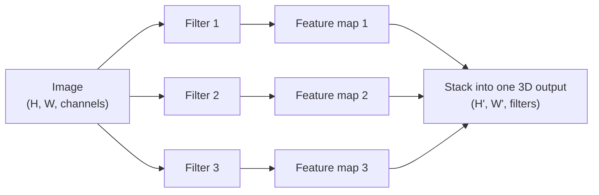

## Why CNNs exist

Images have structure:

- nearby pixels are related
- patterns repeat across the image

A regular `Dense` layer ignores both facts — it flattens the image into a
long 1D list and connects every pixel to every neuron. For a small 28 × 28
MNIST digit that's already wasteful; for a 100 × 100 photo, a first hidden
layer of just 1,000 neurons would need **10 million connections**. CNNs solve
this using **partially connected layers** and **weight sharing**: instead of
looking at the whole image at once, a neuron only looks at a small patch of
it, and that same small filter is reused everywhere across the image.

## Where the idea came from

CNNs trace back to biology. In 1958–59, Hubel and Wiesel discovered that
neurons in the visual cortex have a small **local receptive field** — they
only react to a limited region of the visual field — and that simple
detectors (like a neuron that only fires for horizontal lines) feed into
higher-level neurons that combine them into more complex patterns. That
hierarchical structure — simple filters low down, complex combinations higher
up — is exactly what a stack of convolutional layers reproduces.

## Convolutional layers: local receptive fields

In a convolutional layer, a neuron at row `i`, column `j` is connected only to
a small rectangle of the previous layer (its **receptive field**), not to
every pixel. Two hyperparameters control how that rectangle moves:

- **stride** — how far the receptive field shifts each step. A stride of 2
  skips every other position, roughly halving the output's height and width.
- **padding** — `"valid"` uses no padding (the output shrinks a little each
  layer); `"same"` adds zeros around the border so the output keeps the same
  height and width as the input when the stride is 1.

## Filters and feature maps

A neuron's weights can be drawn as a small image the size of its receptive
field — this is called a **filter** (or **convolution kernel**). For example,
a filter that is all zeros except for a vertical line of `1`s in the middle
will ignore everything in its receptive field except the vertical line
passing through it. If every neuron in a layer uses that same filter, the
whole layer produces a **feature map**: an image that lights up wherever the
input matches the filter, and stays dark everywhere else.

You don't have to hand-design these filters. During training, the
convolutional layer learns whichever filters are most useful for the task —
edges and color blobs in the early layers, then textures, then whole shapes
higher up the stack.

## Stacking multiple feature maps

A real convolutional layer applies **many** filters at once, so it outputs
one feature map per filter — making its output a 3D volume rather than a flat
image. All the neurons *within* one feature map share the same weights and
bias (that's the weight sharing), but neurons in *different* feature maps
learn different filters. Once a CNN learns to recognize a pattern in one
spot, it can recognize that same pattern anywhere else in the image — a
regular `Dense` network has no such luck.



## tf.keras implementation

You can see convolution happen directly with `tf.nn.conv2d`, by hand-crafting
a filter that only reacts to vertical edges:

```python title="manual_conv2d.py" showLineNumbers{1}
import numpy as np
import tensorflow as tf

# A tiny 8x8 grayscale "image" with a bright vertical stripe down the middle
image = np.zeros((8, 8), dtype=np.float32)
image[:, 3:5] = 1.0
images = image.reshape(1, 8, 8, 1)  # TF wants [batch, height, width, channels]

# A 3x3 filter that reacts to vertical edges (dark -> bright transitions)
vertical_edge_filter = np.array([
    [-1, 0, 1],
    [-1, 0, 1],
    [-1, 0, 1],
], dtype=np.float32).reshape(3, 3, 1, 1)

feature_map = tf.nn.conv2d(images, vertical_edge_filter, strides=1, padding="SAME")
print("Feature map shape:", feature_map.shape)
print(np.round(feature_map.numpy()[0, :, :, 0], 1))
```

In practice you'll almost always use the `Conv2D` layer instead, and let the
network learn the filters during training:

```python title="conv2d_layer.py" showLineNumbers{1}
import tensorflow as tf

conv = tf.keras.layers.Conv2D(
    filters=32,        # number of learned filters (feature maps)
    kernel_size=3,      # each filter is 3x3
    strides=1,
    padding="same",      # keep the same height/width as the input
    activation="relu",
)
```

## Key parts

- **Convolution layers**: learn filters
- **Pooling**: reduce spatial size, keep important features
- **Fully connected layers**: final classification/regression

## Why they work well

- parameter sharing (same filter used across image)
- translation invariance (patterns recognized in different locations)

## Downsampling: pooling isn't the only option

The next page covers pooling layers in depth, but it's worth knowing early
on that a convolutional layer can shrink its own output too — you don't
strictly need a separate pooling layer to downsample. Setting `strides=2` on
a `Conv2D` layer makes it skip every other position as it slides, which
roughly halves the height and width of its output, exactly like a 2 × 2
pooling layer would.

```python title="strided_conv2d.py" showLineNumbers{1}
import tensorflow as tf

# strides=2 halves height and width, same as MaxPooling2D(pool_size=2) would
downsampling_conv = tf.keras.layers.Conv2D(
    filters=64, kernel_size=3, strides=2, padding="same", activation="relu"
)
```

Most classification convnets still prefer plain pooling for downsampling —
it's cheap (no weights to learn) and its translation invariance is a nice
property when you only care "is this pattern present *somewhere*?" But for
tasks where the *exact location* of a pattern matters — like image
segmentation, where you need to predict a class for every pixel — a strided
convolution downsamples without throwing away location information the way
max pooling does. You'll see this trade-off again on the Image Segmentation
page.

## Visualize it

Watch a 3 × 3 kernel slide across an 8 × 8 input, one receptive field at a
time. At each position it multiplies the pixels underneath it by the
kernel's weights and sums the result into a single feature-map cell — the
amber box is the receptive field being read right now, the green box is the
output cell being written:

```p5 title="A kernel sliding over a pixel grid" desc="A 3x3 vertical-edge kernel slides across the input image, writing one value into the feature map per step." height="360"
const gridSize = 8;
const img = [];
for (let r = 0; r < gridSize; r++) {
  const row = [];
  for (let c = 0; c < gridSize; c++) row.push((c === 3 || c === 4) ? 1 : 0);
  img.push(row);
}
const kernel = [[-1, 0, 1], [-1, 0, 1], [-1, 0, 1]];
const outSize = gridSize - 2;
let feature = [];
let pos = 0;
let t = 0;
const cell = 26;
const inX = 40, inY = 46;
const outX = 400, outY = 46;

function resetFeature() {
  feature = [];
  for (let i = 0; i < outSize; i++) feature.push(new Array(outSize).fill(null));
  pos = 0;
}
function setup() {
  createCanvas(640, 360);
  textFont("monospace");
  textAlign(CENTER, CENTER);
  resetFeature();
}
function conv(r, c) {
  let sum = 0;
  for (let kr = 0; kr < 3; kr++) {
    for (let kc = 0; kc < 3; kc++) sum += img[r + kr][c + kc] * kernel[kr][kc];
  }
  return sum;
}
function draw() {
  background(13, 17, 23);
  noStroke();
  fill(230);
  textSize(13);
  text("Input image", inX + (gridSize * cell) / 2, inY - 20);
  text("Feature map", outX + (outSize * cell) / 2, outY - 20);

  for (let r = 0; r < gridSize; r++) {
    for (let c = 0; c < gridSize; c++) {
      fill(img[r][c] ? 230 : 40);
      stroke(60, 70, 84);
      strokeWeight(1);
      rect(inX + c * cell, inY + r * cell, cell, cell);
    }
  }

  const row = Math.floor(pos / outSize);
  const col = pos % outSize;

  noFill();
  stroke(255, 211, 67);
  strokeWeight(3);
  rect(inX + col * cell, inY + row * cell, cell * 3, cell * 3);

  for (let r = 0; r < outSize; r++) {
    for (let c = 0; c < outSize; c++) {
      const v = feature[r][c];
      noStroke();
      fill(v === null ? color(24, 34, 44) : color(constrain(128 + v * 60, 0, 255)));
      stroke(60, 70, 84);
      strokeWeight(1);
      rect(outX + c * cell, outY + r * cell, cell, cell);
    }
  }
  noFill();
  stroke(120, 200, 120);
  strokeWeight(3);
  rect(outX + col * cell, outY + row * cell, cell, cell);

  noStroke();
  fill(107, 169, 221);
  textSize(12);
  text("kernel = vertical-edge detector, stride 1, valid padding", width / 2, height - 18);

  t++;
  if (t % 16 === 0) {
    feature[row][col] = conv(row, col);
    pos++;
    if (pos >= outSize * outSize) resetFeature();
  }
}
function mousePressed() { resetFeature(); }
```

## Mini-checkpoint

Why not use a plain MLP for images?

- too many parameters and ignores spatial structure.

:::tip[From the book]
*Hands-On Machine Learning* (Géron) points out that a layer full of neurons
using the *same* filter outputs a feature map that "highlights the areas in
an image that activate the filter the most." Feed a picture through a
vertical-line filter and the vertical edges get enhanced while everything
else blurs out; feed the same picture through a horizontal-line filter and
the opposite happens. Of course, you rarely hand-design filters like this —
during training, the convolutional layer learns whichever filters minimize
the loss, and later layers learn to combine them into more complex patterns.
:::

:::tip[From the book]
Chollet frames convolution as encoded prior knowledge, not just an
architecture trick: "using convolution layers means that you know in
advance that the relevant patterns present in your input images are
translation-invariant." A model's architecture is really the sum of choices
— which layers, how they're configured and connected — that define the
*hypothesis space* gradient descent gets to search over. A good hypothesis
space bakes in assumptions you already know are true about the problem;
that's exactly why convnets, not plain `Dense` stacks, are the default
choice for anything that looks like an image.
:::

import DataCampExercise from "../../../../components/DataCampExercise.astro";

## 🧪 Try It Yourself

### Exercise 1 – Create a Conv2D Layer

<DataCampExercise
  lang="python"
  hint={`\`tf.keras.layers.Conv2D(filters=..., kernel_size=..., activation=...)\` — the number of filters is how many feature maps it will output.`}
  code={`# Task: Exercise 1 - Create a Conv2D Layer
import tensorflow as tf

conv = tf.keras.layers.___(filters=32, kernel_size=3, padding="same", activation="relu")   # replace ___ with Conv2D
print("layer:", conv.__class__.__name__)
print("filters:", conv.filters)

# ── Expected Output ───────────────────────────────────────────
# layer: Conv2D
# filters: 32
# ──────────────────────────────────────────────────────────────`}
  solution={`import tensorflow as tf

conv = tf.keras.layers.Conv2D(filters=32, kernel_size=3, padding="same", activation="relu")
print("layer:", conv.__class__.__name__)
print("filters:", conv.filters)`}
  sct={`test_output_contains("layer: Conv2D")
test_output_contains("filters: 32")
success_msg("Conv2D layer created correctly!")`}
  height={150}
/>

### Exercise 2 – Convolve an Image With a Filter

<DataCampExercise
  lang="python"
  hint={`Use \`tf.nn.conv2d(images, filters, strides=1, padding="SAME")\`.`}
  code={`# Task: Exercise 2 - Convolve an Image With a Filter
import numpy as np
import tensorflow as tf

image = np.zeros((6, 6), dtype=np.float32)
image[:, 2:4] = 1.0
images = image.reshape(1, 6, 6, 1)

vertical_filter = np.array([[-1, 0, 1]] * 3, dtype=np.float32).reshape(3, 3, 1, 1)

feature_map = tf.nn.___(images, vertical_filter, strides=1, padding="SAME")   # replace ___ with conv2d
print("shape:", feature_map.shape)

# ── Expected Output ───────────────────────────────────────────
# shape: (1, 6, 6, 1)
# ──────────────────────────────────────────────────────────────`}
  solution={`import numpy as np
import tensorflow as tf

image = np.zeros((6, 6), dtype=np.float32)
image[:, 2:4] = 1.0
images = image.reshape(1, 6, 6, 1)

vertical_filter = np.array([[-1, 0, 1]] * 3, dtype=np.float32).reshape(3, 3, 1, 1)

feature_map = tf.nn.conv2d(images, vertical_filter, strides=1, padding="SAME")
print("shape:", feature_map.shape)`}
  sct={`test_output_contains("shape: (1, 6, 6, 1)")
success_msg("Convolution applied correctly!")`}
  height={160}
/>

### Exercise 3 – Stack Filters Into a Feature Volume

<DataCampExercise
  lang="python"
  hint={`Build a small \`Sequential\` model with one \`Conv2D\` layer, then check \`model.output_shape\`. The last number in the shape is the number of feature maps (filters).`}
  code={`# Task: Exercise 3 - Stack Filters Into a Feature Volume
import tensorflow as tf

model = tf.keras.models.Sequential([
    tf.keras.layers.Conv2D(16, 3, padding="same", activation="relu", input_shape=[28, 28, 1]),
])
print("output shape:", model.output_shape)
print("num feature maps:", model.output_shape[___])   # replace ___ with -1

# ── Expected Output ───────────────────────────────────────────
# output shape: (None, 28, 28, 16)
# num feature maps: 16
# ──────────────────────────────────────────────────────────────`}
  solution={`import tensorflow as tf

model = tf.keras.models.Sequential([
    tf.keras.layers.Conv2D(16, 3, padding="same", activation="relu", input_shape=[28, 28, 1]),
])
print("output shape:", model.output_shape)
print("num feature maps:", model.output_shape[-1])`}
  sct={`test_output_contains("output shape: (None, 28, 28, 16)")
test_output_contains("num feature maps: 16")
success_msg("You can see the feature maps stacking up as the depth dimension!")`}
  height={160}
/>

## Next

Continue to **Pooling & CNN Architecture** — see how pooling layers shrink
these feature maps and how convolution + pooling combine into a full CNN.
