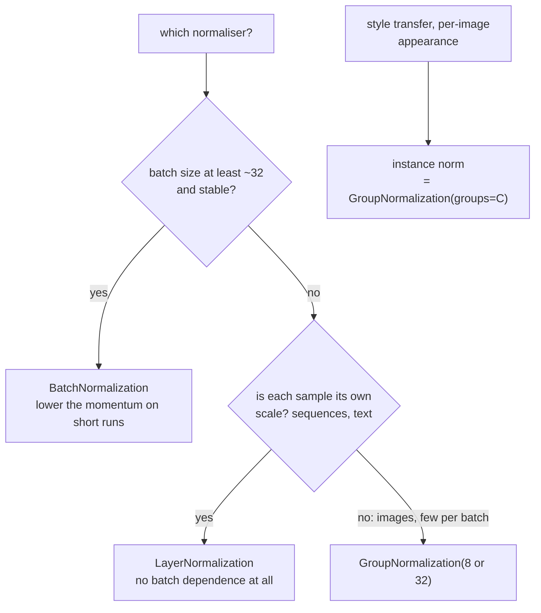

import DataCampExercise from "../../../../components/DataCampExercise.astro";
import Figure from "../../../../components/Figure.astro";
import Quiz from "../../../../components/Quiz.astro";

[Batch normalisation](/deep-learning/phase-02---training-deep-neural-networks/batch-normalization/)
estimates its statistics from the batch, and that measurement showed it losing at
batch size 4. Three alternatives fix that by reducing over different axes
entirely. They differ in exactly one way — **which values go into one mean** — and
everything else about their behaviour follows from that choice.

## What you'll learn

- All four normalisers implemented by hand and matched to Keras within
  **1.19e−06**.
- The axes each reduces over, counted: on one tensor, **6, 8, 24 and 48**
  independent mean/variance pairs.
- What each actually centres — batch norm leaves per-sample means at **1.42e−01**;
  layer norm leaves per-channel means at **1.86e+00**.
- A batch-size sweep where **LayerNormalization won at batches 4, 16 and 64** and
  batch norm won at 256.
- Why every method's accuracy falls as the batch grows here, and why that is a
  confound rather than a result.
- The one-line relationship between instance norm and group norm.

## One difference, four layers

Every one of these computes $\hat{x} = (x - \mu)/\sqrt{\sigma^2 + \epsilon}$ and
then applies a learned scale and shift. The only question is which elements of the
tensor $\mu$ and $\sigma$ are computed over. For a feature map of shape
$(N, H, W, C)$:

| Normaliser | Reduces over | One mean per | Depends on the batch? |
| --- | --- | --- | --- |
| `BatchNormalization` | $N, H, W$ | channel | **yes** |
| `LayerNormalization` | $H, W, C$ | sample | no |
| `GroupNormalization(g)` | $H, W, C/g$ | sample × group | no |
| instance norm | $H, W$ | sample × channel | no |

<Figure
  src="/images/dl/phase-03-vision/normalisation-beyond-batch/norm-axes"
  alt="Five heatmaps of sample against channel. The input panel shows wildly different column brightnesses because the channels are on different scales. Batch norm equalises the columns; layer norm equalises the rows; group norm equalises blocks of columns within each row; instance norm equalises every cell."
  title="The same tensor under four normalisers"
  caption="Each panel is the per-sample, per-channel mean after normalising an (8, 4, 4, 6) tensor whose six channels were deliberately given means from -2.0 to 18.4. Batch norm flattens the columns — it centres each channel across the batch. Layer norm flattens the rows — it centres each sample across its channels. Group norm does it in blocks of two channels, and instance norm centres every cell independently."
/>

On an $(8, 4, 4, 6)$ tensor whose channels were given means from −2.02 to 18.45 and
standard deviations from 0.19 to 8.34:

| Normaliser | Mean/variance pairs | Values per estimate | max \|hand-written − Keras\| |
| --- | --- | --- | --- |
| batch | 6 | **128** | 1.19e−06 |
| layer | 8 | 96 | 7.15e−07 |
| group (3 groups) | 24 | 32 | 4.77e−07 |
| instance | **48** | **16** | 9.09e−07 |

The two columns move in opposite directions, and that is the whole trade-off.
**More independent estimates means each one is computed from fewer values** — batch
norm has 6 estimates over 128 values each, instance norm has 48 over 16 each. Noisy
estimates hurt; too few estimates means less normalising.

### What each one actually centres

Measured after normalising, taking the maximum absolute mean over each axis:

| Normaliser | Per-channel means | Per-sample means |
| --- | --- | --- |
| batch | **1.18e−06** | 1.42e−01 |
| layer | **1.86e+00** | **4.97e−08** |
| group | 8.71e−01 | 5.46e−08 |
| instance | 1.43e−07 | 1.29e−07 |

Read the two columns as a contradiction that is not one. **Batch norm centres
channels and leaves samples off-centre; layer norm does the exact reverse.** Layer
norm leaves a per-channel mean of 1.86 — it never promised to remove that, because
it never looks across the batch. Only instance norm, which uses the most estimates,
centres both.

If your channels are on wildly different scales and the batch is large, batch norm
is measuring the thing you want. If each sample has its own scale — different
lighting, different speaker volume, different sequence length — layer norm is.

```python title="All four, in Keras"
keras.layers.BatchNormalization(momentum=0.9)
keras.layers.LayerNormalization()
keras.layers.GroupNormalization(groups=8)
keras.layers.GroupNormalization(groups=channels)   # this is instance norm
```

The last line is not a trick: **instance normalisation is group normalisation with
one channel per group.** Keras ships no separate layer because it does not need one.

## The statistic-count argument, before any training

<Figure
  src="/images/dl/phase-03-vision/normalisation-beyond-batch/norm-statistics"
  alt="Log-log plot of values per mean estimate against batch size for four normalisers on a 16x16x64 feature map. Batch norm rises from 256 at batch 1 to 32,768 at batch 128; layer norm is flat at 16,384, group norm flat at 2,048 and instance norm flat at 256. A dashed line marks 30 values."
  title="16x16 feature map, 64 channels, groups of 8"
  caption="Only batch norm's line slopes: its estimate quality is a function of the batch size, while the other three are fixed by the feature-map geometry. At batch 1 batch norm averages 256 values — the same as instance norm — and by batch 128 it averages 32,768, more than any other method. That crossing is the entire practical argument."
/>

| Batch | Batch norm | Layer norm | Group norm (8) | Instance norm |
| --- | --- | --- | --- | --- |
| 1 | **256** | 16,384 | 2,048 | 256 |
| 8 | 2,048 | 16,384 | 2,048 | 256 |
| 32 | 8,192 | 16,384 | 2,048 | 256 |
| 128 | **32,768** | 16,384 | 2,048 | 256 |

Three things follow without training anything:

- **Batch norm is the only one whose estimate quality depends on the batch.** At
  batch 1 it has as little information as instance norm; at batch 128 it has twice
  layer norm's.
- **The others are decided by the feature map, not the batch** — so they behave
  identically at batch 1 and batch 1,000, which is why every Transformer uses layer
  norm and why segmentation and detection models, which use tiny batches of large
  images, use group norm.
- **Group norm is the tunable middle.** `groups=1` is layer norm, `groups=channels`
  is instance norm, and 8 or 32 is the usual compromise.

## Measured: accuracy against batch size

Same convnet, same seed, 4,000 Fashion-MNIST rows, 6 epochs, only the
normalisation layer changing:

<Figure
  src="/images/dl/phase-03-vision/normalisation-beyond-batch/norm-batch-size"
  alt="Line plot of validation accuracy against batch size on a log axis for four variants. All four decline as the batch grows. The no-normalisation line falls fastest, from 0.752 to 0.444. Layer norm is highest at batches 4, 16 and 64, and batch norm overtakes it at batch 256."
  title="Fashion-MNIST, 4,000 rows — which normaliser survives a small batch?"
  caption="LayerNormalization leads at batches 4, 16 and 64 (0.7980, 0.7860, 0.7410) and batch norm overtakes it at 256 (0.7090 against 0.6660), exactly where its estimates become the best-informed. Every line falls as the batch grows because the epoch count is fixed: batch 4 gets 6,000 optimiser steps and batch 256 gets 96. Compare within a column, not along a row."
/>

| Normaliser | Batch 4 | Batch 16 | Batch 64 | Batch 256 |
| --- | --- | --- | --- | --- |
| none | 0.7520 | 0.7010 | 0.6180 | **0.4440** |
| batch | 0.7590 | 0.7590 | 0.6890 | **0.7090** |
| layer | **0.7980** | **0.7860** | **0.7410** | 0.6660 |
| group (8) | 0.7510 | 0.7500 | 0.7030 | 0.6550 |

**The confound first, because it dominates the table.** Every column falls as the
batch grows, and that is almost entirely because the epoch budget is fixed: batch 4
takes 6,000 optimiser steps and batch 256 takes 96. Nothing in this table says
"large batches are bad" — it says "96 updates is not many". The valid comparison is
*down* each column, between normalisers at the same batch size.

With that said:

1. **Layer norm won three of four batch sizes**, by 0.039, 0.027 and 0.052. On a
   small convnet with a small batch it was simply the best choice.
2. **Batch norm overtook it at 256** (0.7090 against 0.6660) — precisely where the
   statistic count crosses over. The theory and the measurement agree.
3. **Batch norm's advantage over nothing at all grows with batch size**: +0.0070 at
   batch 4, +0.2650 at batch 256. At batch 4 it is barely worth the layer.
4. **Group norm never won.** It sat between the others at every size — which is what
   a compromise looks like, and why it is chosen for constraints rather than for
   accuracy.

### The bug this page hit first

The first version of this comparison reported batch norm at **0.1740 at batch 64 and
0.1260 at batch 256** — collapsing as the batch grew. The cause was not the
normaliser: at Keras' default `momentum=0.99`, BN's moving statistics need roughly
460 optimiser steps, and **a larger batch means fewer steps**. Batch 256 for 6
epochs is 96 steps, so the inference path was normalising with statistics that had
barely moved from their initial values.

| | Batch 64 | Batch 256 |
| --- | --- | --- |
| `momentum=0.99` (default) | 0.1740 | **0.1260** |
| `momentum=0.9` | 0.6890 | **0.7090** |

This is the second time the same default produced a nonsense result in this phase —
the [architectures
page](/deep-learning/phase-03---computer-vision-with-cnns/famous-cnn-architectures-lenet-to-resnet/)
hit it too. **On any short run, or any run with a large batch, lower the BN
momentum.** Layer, group and instance norm have no such setting, because they keep
no running statistics at all — which is a real operational advantage independent of
accuracy.



```p5 title="Pick the axes, watch the estimate count" desc="A tensor of shape (N, H, W, C). Change the batch size and the group count and read how many values go into one mean for each normaliser." height="330"
let batch = 8;
let groups = 8;
const H = 16, W = 16, C = 64;
function setup() {
  createCanvas(600, 330);
  textFont("monospace");
}
function counts() {
  return [
    ["batch norm", batch * H * W, C, "N, H, W"],
    ["layer norm", H * W * C, batch, "H, W, C"],
    ["group norm", H * W * (C / groups), batch * groups, "H, W, C/g"],
    ["instance norm", H * W, batch * C, "H, W"],
  ];
}
function draw() {
  background(13, 17, 23);
  noStroke();
  fill(230);
  textSize(12);
  textAlign(LEFT, TOP);
  text("feature map (" + batch + ", " + H + ", " + W + ", " + C + ")"
    + "   groups = " + groups, 40, 24);
  const rows = counts();
  const biggest = Math.max(...rows.map((r) => r[1]));
  for (let i = 0; i < rows.length; i++) {
    const y = 58 + i * 46;
    const [label, perEstimate, estimates, axes] = rows[i];
    const w = Math.max((perEstimate / biggest) * 250, 2);
    const thin = perEstimate < 30;
    fill(thin ? 230 : 46, thin ? 110 : 96, thin ? 110 : 140);
    rect(250, y, w, 22, 3);
    fill(210);
    textSize(11);
    textAlign(LEFT, CENTER);
    text(label, 40, y + 11);
    fill(255, 211, 67);
    text(perEstimate.toLocaleString() + " values", 256 + w, y + 11);
    fill(120);
    textSize(9);
    text("reduces over " + axes + "   ->   "
      + estimates.toLocaleString() + " mean/var pairs", 250, y + 28);
  }
  fill(150);
  textSize(11);
  textAlign(LEFT, TOP);
  text("only batch norm's bar moves when the batch size changes", 40, 250);
  text("red means fewer than 30 values per estimate - mostly noise", 40, 266);
  const buttons = [["batch 1", 40], ["batch 8", 118], ["batch 64", 196],
                   ["g = 1", 300], ["g = 8", 372], ["g = 64", 444]];
  for (const [label, x] of buttons) {
    const on = (label === "batch " + batch) || (label === "g = " + groups);
    fill(on ? 46 : 90, on ? 96 : 100, on ? 140 : 114);
    rect(x, 298, 70, 22, 3);
    fill(240);
    textSize(10);
    textAlign(CENTER, CENTER);
    text(label, x + 35, 309);
  }
}
function mousePressed() {
  if (mouseY < 298 || mouseY > 320) return;
  if (mouseX > 40 && mouseX < 110) batch = 1;
  if (mouseX > 118 && mouseX < 188) batch = 8;
  if (mouseX > 196 && mouseX < 266) batch = 64;
  if (mouseX > 300 && mouseX < 370) groups = 1;
  if (mouseX > 372 && mouseX < 442) groups = 8;
  if (mouseX > 444 && mouseX < 514) groups = 64;
}
```

```p5 title="The measured table, ranked" desc="Click a column to rank every row by it. The bars are that column's values and the highest and lowest are computed from the numbers, not written in." height="254"
let metric = 0;
const COLUMNS = ["Batch 4", "Batch 16", "Batch 64", "Batch 256"];
const ROWS = [
  ["none", 0.752, 0.701, 0.618, 0.444],
  ["batch", 0.759, 0.759, 0.689, 0.709],
  ["layer", 0.798, 0.786, 0.741, 0.666],
  ["group (8)", 0.751, 0.75, 0.703, 0.655]
];
function setup() {
  createCanvas(620, 254);
  textFont("monospace");
}
function fmt(v) {
  if (v === 0) { return "0"; }
  const a = Math.abs(v);
  if (a >= 1000 || a < 0.001) { return v.toExponential(2); }
  if (a >= 100) { return v.toFixed(1); }
  return v.toFixed(4);
}
function draw() {
  background(13, 17, 23);
  noStroke();
  fill(230);
  textSize(12);
  textAlign(LEFT, TOP);
  text("'Normalisation Beyond Batch: Layer", 26, 16);
  let x = 26;
  for (let i = 0; i < COLUMNS.length; i++) {
    const w = COLUMNS[i].length * 6.6 + 16;
    if (i === metric) { fill(255, 211, 67); } else { fill(48, 56, 68); }
    rect(x, 40, w, 22, 4);
    if (i === metric) { fill(13, 17, 23); } else { fill(180); }
    textSize(9);
    text(COLUMNS[i], x + 8, 47);
    x += w + 6;
    if (x > 500) { break; }
  }
  const values = ROWS.map((r) => r[metric + 1]);
  const lo = Math.min(...values);
  const hi = Math.max(...values);
  const span = hi - lo === 0 ? 1 : hi - lo;
  const order = ROWS.slice().sort((a, b) => b[metric + 1] - a[metric + 1]);
  for (let i = 0; i < order.length; i++) {
    const y = 78 + i * 26;
    const v = order[i][metric + 1];
    fill(160);
    textSize(9);
    text(order[i][0], 26, y + 5);
    fill(34, 40, 50);
    rect(230, y, 280, 18, 3);
    const frac = (v - lo) / span;
    if (v === hi) { fill(126, 192, 143); }
    else if (v === lo) { fill(224, 108, 117); }
    else { fill(107, 169, 221); }
    rect(230, y, Math.max(frac * 280, 3), 18, 3);
    fill(225);
    textSize(9);
    text(fmt(v), 518, y + 5);
  }
  const top = order[0];
  const bottom = order[order.length - 1];
  fill(150);
  textSize(9);
  const base = 78 + order.length * 26 + 8;
  text("highest " + COLUMNS[metric] + ": " + top[0] + " at " + fmt(top[1]),
       26, base);
  text("lowest  " + COLUMNS[metric] + ": " + bottom[0] + " at "
       + fmt(bottom[1]), 26, base + 14);
  text("bars are scaled within the chosen column - lowest is not zero", 26,
       base + 30);
}
function mousePressed() {
  let x = 26;
  for (let i = 0; i < COLUMNS.length; i++) {
    const w = COLUMNS[i].length * 6.6 + 16;
    if (mouseX > x && mouseX < x + w && mouseY > 40 && mouseY < 62) {
      metric = i;
    }
    x += w + 6;
  }
}
```

## Pitfalls

- **Leaving BN at `momentum=0.99` with a large batch.** Fewer steps per epoch means
  the moving statistics never converge: 0.1260 against 0.7090 at batch 256.
- **Expecting layer norm to centre channels.** It leaves per-channel means at 1.86
  by construction, because it never looks across the batch.
- **Using batch norm at batch 1 or 2.** It then averages as few values as instance
  norm while still carrying moving-statistics baggage.
- **Reading a batch-size sweep at fixed epochs as a batch-size result.** Batch 4 got
  6,000 updates and batch 256 got 96.
- **Reaching for group norm to improve accuracy.** It never won a column here; it
  wins when the batch cannot be large.
- **Looking for an `InstanceNormalization` layer in Keras.** It is
  `GroupNormalization(groups=channels)`.
- **Mixing normalisers within a block.** Each assumes it sees the un-normalised
  distribution; stacking two of them wastes parameters and confuses the scale.

## Recap

- All four compute the same formula and differ only in which axes they reduce over,
  matched to Keras within 1.19e−06.
- More independent estimates means fewer values per estimate: batch 6×128, layer
  8×96, group 24×32, instance 48×16 on the tensor measured.
- Batch norm centres channels and not samples (per-sample mean 1.42e−01); layer norm
  does the reverse (per-channel mean 1.86).
- Only batch norm's estimate quality depends on the batch size — 256 values at batch
  1 against 32,768 at batch 128.
- Measured on 4,000 rows: layer norm won at batches 4, 16 and 64; batch norm
  overtook it at 256, exactly where the statistic counts cross.
- Group norm sat between the others at every batch size — a compromise chosen for
  constraints, not accuracy.
- Instance norm is `GroupNormalization(groups=channels)`.

## Next

Back to the practical question every small-data vision project starts with — whether
to train at all, or to start from weights someone else paid for:
[Transfer Learning Using Pre-trained Models](/deep-learning/phase-03---computer-vision-with-cnns/transfer-learning-using-pre-trained-models/).

<Quiz
  questions={[
    {
      q: "After layer normalisation, the maximum per-channel mean is 1.86 rather than near zero. Is that a bug?",
      options: [
        "Yes — normalisation should centre everything",
        "No — layer norm reduces over H, W and C within each sample, so it centres samples and never looks across the batch; per-channel means are not its business",
        "Yes — the epsilon is too large",
        "No, but only because the channels were on different scales",
      ],
      answer: 1,
      explain: "Measured: layer norm leaves per-sample means at 4.97e-08 and per-channel means at 1.86. Batch norm is the exact reverse.",
    },
    {
      q: "Your model uses BatchNormalization at batch 256 for 6 epochs on 4,000 rows and validates at 0.126 while training fine. What is wrong?",
      options: [
        "The batch is too large for the dataset",
        "That is only 96 optimiser steps, and at the default momentum=0.99 BN's moving statistics need roughly 460 — the inference path is normalising with statistics that never converged",
        "Batch norm does not work above batch 128",
        "The learning rate needs to scale with the batch size",
      ],
      answer: 1,
      explain: "Measured: 0.1260 at momentum=0.99 against 0.7090 at momentum=0.9, same everything else. Large batches make this worse, not better, because they mean fewer steps.",
    },
    {
      q: "Why do Transformers use LayerNormalization rather than BatchNormalization?",
      options: [
        "Because it has fewer parameters",
        "Because its statistics come from within each sample, so they are identical at batch 1 and batch 1,000 and do not depend on what else is in the batch — and it keeps no running statistics to converge",
        "Because batch norm cannot handle sequences of different lengths at all",
        "Because layer norm trains faster",
      ],
      answer: 1,
      explain: "Sequence models often have small or variable batches, and inference is frequently a single sequence. Layer norm is unaffected by both.",
    },
    {
      q: "What is GroupNormalization(groups=channels) equivalent to?",
      options: [
        "Batch normalisation",
        "Instance normalisation — one mean and variance per sample per channel, which is why Keras ships no separate layer for it",
        "Layer normalisation",
        "No normalisation at all",
      ],
      answer: 1,
      explain: "And groups=1 is layer normalisation. Group norm spans the whole range between the two extremes.",
    },
    {
      q: "In the measured sweep every normaliser's accuracy fell as the batch size grew. What does that show?",
      options: [
        "Large batches always generalise worse",
        "Mostly that the epoch budget was fixed, so batch 4 got 6,000 optimiser steps and batch 256 got 96 — the valid comparison is between normalisers at the same batch size, not across batch sizes",
        "That normalisation stops working above batch 64",
        "That the dataset is too small for large batches",
      ],
      answer: 1,
      explain: "Reading along a row conflates the normaliser with the update count. Reading down a column is the controlled comparison.",
    },
  ]}
/>

## 🧪 Try It Yourself

<DataCampExercise
  lang="python"
  hint={`Each normaliser differs only in the axes passed to mean and var. Batch reduces over (0, 1, 2); layer over (1, 2, 3); instance over (1, 2).`}
  code={`# Task: Exercise 1 - All four normalisers by hand
import numpy as np
from tensorflow import keras

SHAPE = (8, 4, 4, 6)
GROUPS = 3
EPSILON = 1e-3
rng = np.random.default_rng(0)
x = (rng.standard_normal(SHAPE) * np.array([1.0, 3.0, 0.5, 8.0, 2.0, 0.2])
     + np.array([0.0, 5.0, -2.0, 20.0, 1.0, -0.5])).astype("float32")


def reference(x, kind, groups=GROUPS):
    if kind == "batch":
        axes = (0, 1, 2)
    elif kind == "layer":
        axes = (1, 2, ___)                         # replace ___ with 3
    elif kind == "instance":
        axes = (1, 2)
    else:
        batch, height, width, channels = x.shape
        grouped = x.reshape(batch, height, width, groups, channels // groups)
        mean = grouped.mean(axis=(1, 2, 4), keepdims=True)
        variance = grouped.var(axis=(1, 2, 4), keepdims=True)
        return ((grouped - mean)
                / np.sqrt(variance + EPSILON)).reshape(x.shape)
    mean = x.mean(axis=axes, keepdims=True)
    variance = x.var(axis=axes, keepdims=True)
    return (x - mean) / np.sqrt(variance + EPSILON)


layers = {
    "batch": keras.layers.BatchNormalization(epsilon=EPSILON),
    "layer": keras.layers.LayerNormalization(epsilon=EPSILON, axis=(1, 2, 3)),
    "group": keras.layers.GroupNormalization(groups=GROUPS, epsilon=EPSILON),
    "instance": keras.layers.GroupNormalization(groups=SHAPE[3],
                                                epsilon=EPSILON),
}
pairs = {"batch": SHAPE[3], "layer": SHAPE[0], "group": SHAPE[0] * GROUPS,
         "instance": SHAPE[0] * SHAPE[3]}
per_estimate = {"batch": SHAPE[0] * 16, "layer": 16 * SHAPE[3],
                "group": 16 * (SHAPE[3] // GROUPS), "instance": 16}

print(f"{'normaliser':12s} {'mean/var pairs':>15} {'values per estimate':>21} "
      f"{'max |mine - keras|':>20}")
for kind in ("batch", "layer", "group", "instance"):
    mine = reference(x, kind)
    theirs = layers[kind](x, training=True).numpy()
    print(f"{kind:12s} {pairs[kind]:15d} {per_estimate[kind]:21d} "
          f"{np.abs(mine - theirs).max():20.2e}")
print("more estimates always means fewer values behind each one")

# -- Expected Output -------------------------------------------
# normaliser    mean/var pairs   values per estimate   max |mine - keras|
# batch                      6                   128             1.19e-06
# layer                      8                    96             7.15e-07
# group                     24                    32             4.77e-07
# instance                  48                    16             9.09e-07
# more estimates always means fewer values behind each one
# --------------------------------------------------------------`}
/>

<DataCampExercise
  lang="python"
  hint={`Check the per-channel means and the per-sample means separately. Each normaliser only promises to centre the axes it reduced over.`}
  code={`# Task: Exercise 2 - What each normaliser actually centres
import numpy as np
from tensorflow import keras

SHAPE = (8, 4, 4, 6)
GROUPS = 3
EPSILON = 1e-3
rng = np.random.default_rng(0)
x = (rng.standard_normal(SHAPE) * np.array([1.0, 3.0, 0.5, 8.0, 2.0, 0.2])
     + np.array([0.0, 5.0, -2.0, 20.0, 1.0, -0.5])).astype("float32")

layers = {
    "batch": keras.layers.BatchNormalization(epsilon=EPSILON),
    "layer": keras.layers.LayerNormalization(epsilon=EPSILON, axis=(1, 2, 3)),
    "group": keras.layers.GroupNormalization(groups=GROUPS, epsilon=EPSILON),
    "instance": keras.layers.GroupNormalization(groups=SHAPE[3],
                                                epsilon=EPSILON),
}
print(f"{'normaliser':12s} {'per-channel means':>19} {'per-sample means':>18}")
for kind, layer in layers.items():
    out = layer(x, training=True).numpy()
    per_channel = np.abs(out.mean(axis=(0, 1, 2))).max()
    per_sample = np.abs(out.mean(axis=(1, 2, ___))).max()
    # replace ___ with 3
    print(f"{kind:12s} {per_channel:19.2e} {per_sample:18.2e}")
print("batch norm centres channels and not samples; layer norm is the reverse;")
print("instance norm, with the most estimates, centres both")

# -- Expected Output -------------------------------------------
# normaliser      per-channel means   per-sample means
# batch                    1.18e-06           1.42e-01
# layer                    1.86e+00           4.97e-08
# group                    8.71e-01           5.46e-08
# instance                 1.43e-07           1.29e-07
# batch norm centres channels and not samples; layer norm is the reverse;
# instance norm, with the most estimates, centres both
# --------------------------------------------------------------`}
/>

<DataCampExercise
  lang="python"
  hint={`Only batch norm's count contains the batch size. The other three depend on the feature-map geometry alone.`}
  code={`# Task: Exercise 3 - How many values go into one mean?
H, W, C, GROUPS = 16, 16, 64, 8

print(f"{'batch':>7} {'batch norm':>12} {'layer norm':>12} "
      f"{'group norm':>12} {'instance':>10}")
for batch in (1, 2, 8, 32, 128):
    per_batch = batch * H * W
    per_layer = H * W * C
    per_group = H * W * (C // ___)                 # replace ___ with GROUPS
    per_instance = H * W
    print(f"{batch:7d} {per_batch:12,} {per_layer:12,} {per_group:12,} "
          f"{per_instance:10,}")
print("batch norm has as little information as instance norm at batch 1, and")
print("twice layer norm's at batch 128 - it is the only line that moves")

# -- Expected Output -------------------------------------------
#   batch   batch norm   layer norm   group norm   instance
#       1          256       16,384        2,048        256
#       2          512       16,384        2,048        256
#       8        2,048       16,384        2,048        256
#      32        8,192       16,384        2,048        256
#     128       32,768       16,384        2,048        256
# batch norm has as little information as instance norm at batch 1, and
# twice layer norm's at batch 128 - it is the only line that moves
# --------------------------------------------------------------`}
/>

<DataCampExercise
  lang="python"
  hint={`GroupNormalization with one group per channel reduces over exactly the same axes as instance normalisation, so the outputs should be bit-identical.`}
  code={`# Task: Exercise 4 - Group norm spans layer norm and instance norm
import numpy as np
from tensorflow import keras

SHAPE = (4, 8, 8, 12)
rng = np.random.default_rng(0)
x = rng.standard_normal(SHAPE).astype("float32")
channels = SHAPE[-1]

layer_norm = keras.layers.LayerNormalization(epsilon=1e-3, axis=(1, 2, 3))
one_group = keras.layers.GroupNormalization(groups=1, epsilon=1e-3)
per_channel = keras.layers.GroupNormalization(groups=___, epsilon=1e-3)
# replace ___ with channels

a = layer_norm(x, training=True).numpy()
b = one_group(x, training=True).numpy()
c = per_channel(x, training=True).numpy()
print(f"LayerNormalization vs GroupNormalization(groups=1):  "
      f"max difference {np.abs(a - b).max():.2e}")
print(f"per-sample means after GroupNormalization(groups={channels}): "
      f"{np.abs(c.mean(axis=(1, 2, 3))).max():.2e}")
print(f"per-sample-per-channel means: "
      f"{np.abs(c.mean(axis=(1, 2))).max():.2e}")
print(f"groups=1 is layer norm; groups={channels} is instance norm; anything")
print("between is the compromise everyone actually ships")

# -- Expected Output -------------------------------------------
# LayerNormalization vs GroupNormalization(groups=1):  max difference 0.00e+00
# per-sample means after GroupNormalization(groups=12): 9.93e-09
# per-sample-per-channel means: 4.84e-08
# groups=1 is layer norm; groups=12 is instance norm; anything
# between is the compromise everyone actually ships
# --------------------------------------------------------------`}
/>

<DataCampExercise
  lang="python"
  hint={`Only the normalisation layer changes between the four models. Read down each batch-size column, not along the rows — the epoch budget is fixed, so larger batches get far fewer optimiser steps.`}
  code={`# Task: Exercise 5 - Which normaliser survives a small batch?
import numpy as np
from tensorflow import keras

LIMIT, EPOCHS = 4000, 6
BATCHES = (4, 16, 64, 256)
(x_train, y_train), (x_test, y_test) = keras.datasets.fashion_mnist.load_data()
x_train = x_train[:LIMIT].astype("float32")[..., None] / 255.0
y_train = y_train[:LIMIT]
x_test = x_test[:LIMIT // 4].astype("float32")[..., None] / 255.0
y_test = y_test[:LIMIT // 4]


def build(kind):
    keras.utils.set_random_seed(0)
    layers = [keras.layers.Input((28, 28, 1))]
    for filters in (32, 64):
        layers.append(keras.layers.Conv2D(filters, 3, padding="same",
                                          use_bias=False))
        if kind == "batch":
            layers.append(keras.layers.BatchNormalization(momentum=___))
            # replace ___ with 0.9
        elif kind == "layer":
            layers.append(keras.layers.LayerNormalization())
        elif kind == "group":
            layers.append(keras.layers.GroupNormalization(groups=8))
        layers.append(keras.layers.Activation("relu"))
        layers.append(keras.layers.MaxPooling2D(2))
    layers += [keras.layers.GlobalAveragePooling2D(),
               keras.layers.Dense(10, activation="softmax")]
    model = keras.Sequential(layers)
    model.compile(keras.optimizers.Adam(1e-3),
                  "sparse_categorical_crossentropy", metrics=["accuracy"])
    return model


print(f"{'normaliser':12s} " + " ".join(f"{b:>9}" for b in BATCHES))
for kind in ("none", "batch", "layer", "group"):
    scores = []
    for batch in BATCHES:
        history = build(kind).fit(x_train, y_train, epochs=EPOCHS,
                                  batch_size=batch, verbose=0,
                                  validation_data=(x_test, y_test))
        scores.append(history.history["val_accuracy"][-1])
    print(f"{kind:12s} " + " ".join(f"{s:9.4f}" for s in scores))
print("layer norm wins the small batches; batch norm overtakes it at 256,")
print("exactly where its statistics become the best-informed")

# -- Expected Output -------------------------------------------
# normaliser           4        16        64       256
# none            0.7520    0.7010    0.6180    0.4440
# batch           0.7590    0.7590    0.6890    0.7090
# layer           0.7980    0.7860    0.7410    0.6660
# group           0.7510    0.7500    0.7030    0.6550
# layer norm wins the small batches; batch norm overtakes it at 256,
# exactly where its statistics become the best-informed
# --------------------------------------------------------------`}
/>
