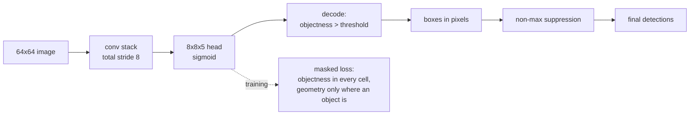

Classification gives one label per image. Segmentation gives one per pixel. Detection
gives **a variable number of boxes, each with a position, a size and a confidence** —
and that variability is the whole difficulty. A network outputs a fixed-shape tensor;
the answer has a length the network cannot know in advance.

Every single-stage detector solves it the same way: divide the image into a grid and
let each cell answer *"is there an object centred in me, and if so, where exactly and
how big?"* This page builds that detector — 23,621 parameters, 2,000 synthetic 64×64
scenes, 18 epochs — and measures every part of it.

## What you'll learn

- Why detection cannot use a fixed-length output, and the grid trick that makes it
  fixed anyway.
- The five numbers per cell, and why every one of them is scaled into $[0, 1]$.
- Why the loss **must mask the geometry terms** by objectness — measured at **38.5×
  inflation** when it doesn't.
- IoU as the only sensible "is this box correct" test: a **4-pixel shift on a 20-pixel
  box costs a third of it**.
- Non-max suppression, in five lines.
- The measured trade: **recall 0.8616 → 0.6799** as the objectness threshold rises
  0.3 → 0.7, while precision sits still at ~0.997.

## IoU first, because everything is scored with it

Two boxes are "the same box" only relative to a threshold on their intersection over
union:

$$
\text{IoU} = \frac{\text{area}(A \cap B)}{\text{area}(A) + \text{area}(B) - \text{area}(A \cap B)}
$$

| Case | Box A | Box B | IoU |
| --- | --- | --- | --- |
| identical | (10, 10, 30, 30) | (10, 10, 30, 30) | 1.0000 |
| shifted 4 px | (10, 10, 30, 30) | (14, 10, 34, 30) | **0.6667** |
| shifted 10 px | (10, 10, 30, 30) | (20, 10, 40, 30) | 0.3333 |
| half the size | (10, 10, 30, 30) | (10, 10, 20, 20) | 0.2500 |
| touching | (10, 10, 30, 30) | (30, 10, 50, 30) | **0.0000** |
| disjoint | (10, 10, 30, 30) | (40, 40, 60, 60) | 0.0000 |

<Figure
  src="/images/dl/phase-03-vision/object-detection/iou-examples"
  alt="Six small panels each showing two overlapping rectangles with their IoU printed above: identical boxes at 1.0000, a four-pixel shift at 0.6667, a ten-pixel shift at 0.3333, a half-size box at 0.2500, edge-touching boxes at 0.0000 and disjoint boxes at 0.0000."
  title="IoU for six box pairs"
  caption="The 4-pixel shift is the row to remember: a fifth of the box's width costs a third of the IoU. That is why 0.5 is called a lenient detection threshold and 0.75 a strict one, and why mAP@0.5 and mAP@0.5:0.95 are different sports. Note also that boxes which merely touch score exactly 0 — IoU has no notion of 'close'."
/>

## The grid encoding

The image is divided into an 8×8 grid of 8×8-pixel cells. Each cell predicts five
numbers:

| Number | Meaning | Range | Activation |
| --- | --- | --- | --- |
| objectness | is an object's **centre** in this cell? | $[0, 1]$ | sigmoid |
| $o_x, o_y$ | centre offset **inside the cell** | $[0, 1]$ | sigmoid |
| $w, h$ | box size as a fraction of the **image** | $[0, 1]$ | sigmoid |

```python title="Encoding a box into a cell"
def encode(boxes, grid=8, cell=8, side=64):
    target = np.zeros((grid, grid, 5), "float32")
    for x1, y1, x2, y2 in boxes:
        cx, cy = (x1 + x2) / 2, (y1 + y2) / 2
        column, row = min(int(cx // cell), grid - 1), min(int(cy // cell), grid - 1)
        target[row, column] = (1.0,
                               (cx - column * cell) / cell,   # offset in the cell
                               (cy - row * cell) / cell,
                               (x2 - x1) / side,              # size in the image
                               (y2 - y1) / side)
    return target
```

Both scalings exist for the same reason: **every target lands in $[0, 1]$, so a
sigmoid can produce it.** A network asked to regress raw pixel coordinates must learn
the image size as well as the object, and it learns it badly.

The output is therefore $8 \times 8 \times 5 = 320$ numbers, fixed, whatever the scene
contains. The encoding is exactly invertible — Exercise 2 round-trips two boxes with a
maximum coordinate error of `0.00e+00`.



### The design's built-in limit

One cell holds one object. Two centres in the same cell means **the grid can only
represent one of them** — no loss function and no training budget fixes that. On this
data it happens in **3.00% of scenes** (Exercise 3). Real YOLO variants attach several
*anchor boxes* per cell to raise the ceiling; a finer grid lowers the collision rate.

## The imbalance, and the loss it forces

| Quantity | Value |
| --- | --- |
| cells per scene | 64 |
| objects per scene (mean) | 2.000 |
| cells containing an object centre | **0.0305** |
| imbalance against a positive | **32.8 : 1** |

A cell with no object still emits four geometry numbers, and those numbers are
**meaningless** — there is no box for them to describe. The fix is one multiplication:

```python title="The masked loss"
def detection_loss(y_true, y_pred):
    present = y_true[..., :1]                       # 1 where an object is centred
    objectness = keras.losses.binary_crossentropy(present, y_pred[..., :1])
    geometry = tf.reduce_sum(tf.square(y_true[..., 1:] - y_pred[..., 1:]), axis=-1)
    return tf.reduce_mean(objectness) + 5.0 * tf.reduce_mean(geometry * present[..., 0])
```

Objectness is scored **everywhere** — the model must learn where objects are *not*.
Geometry is scored **only where an object is**. Exercise 6 measures the cost of getting
this wrong on a 2×2 grid holding one object, with the model guessing 0.5 everywhere:

| Geometry loss | Value |
| --- | --- |
| over every cell | 0.770000 |
| masked to cells with an object | **0.020000** |
| inflation from the three empty cells | **38.50×** |

Thirty-eight times the loss, and every bit of the excess is the model being punished
for box coordinates that describe nothing. The 5.0 weight on the geometry term exists
for the opposite reason: one objectness term across 64 cells otherwise drowns out four
geometry terms in one cell, and the model settles for saying "no object" everywhere.

## What the trained detector does

**23,621 parameters, 18 epochs, final loss 0.0210, validation loss 0.0239.**

<Figure
  src="/images/dl/phase-03-vision/object-detection/grid-predictions"
  alt="Two rows of four panels. The top row shows four test scenes with green ground-truth boxes over noisy grey backgrounds containing dark or light rectangles: two, three, three and one object. The bottom row shows the same scenes with kept detections in amber, labelled kept 0 of 0, kept 1 of 2, kept 1 of 1 and kept 1 of 1."
  title="The first four test scenes at objectness threshold 0.5"
  caption="An honest sample: these are the first four test scenes, not the best four. The detector finds one box in three of them and nothing at all in the first. Across the whole test split its recall at this threshold is 0.7726, so these four are worse than average — and what they show is the failure mode: adjacent objects and low-contrast objects lose their objectness score first."
/>

Aggregate results on the test split, matching at IoU 0.5:

| Objectness threshold | Raw | After NMS | Matched | Precision | Recall |
| --- | --- | --- | --- | --- | --- |
| 0.3 | 833 | 699 | 697 | 0.9971 | **0.8616** |
| 0.5 | 693 | 627 | 625 | 0.9968 | 0.7726 |
| 0.7 | 580 | 552 | 550 | 0.9964 | 0.6799 |

That table says something the usual precision-recall story does not:

- **Precision barely moves** (0.9971 → 0.9964). When this detector fires, something is
  almost always there.
- **Recall falls by 0.18.** Every raised threshold is a decision to miss more objects,
  bought with essentially no precision.
- **NMS removed 134 boxes at threshold 0.3 and 28 at 0.7**, because a low threshold
  admits more near-duplicates of the same object.

The detector's weakness is not false alarms; it is silence. That is the normal shape
for an objectness head trained against a 32.8:1 negative majority — and it is exactly
the problem **focal loss** was invented to fix, by down-weighting the easy negatives
that dominate the gradient.

## Non-max suppression

The grid produces several boxes for one object whenever neighbouring cells both fire.
NMS keeps the highest-scoring box and deletes anything overlapping it too much:

```python title="Non-max suppression"
def non_max_suppression(detections, threshold):
    kept = []
    for score, box in sorted(detections, key=lambda item: -item[0]):
        if all(iou(box, other) <= threshold for _, other in kept):
            kept.append((score, box))
    return kept
```

<Figure
  src="/images/dl/phase-03-vision/object-detection/nms-effect"
  alt="Four panels of the same scene at decreasing NMS IoU thresholds. The leftmost, labelled no NMS, shows several overlapping amber boxes around each object; moving right through thresholds 0.5, 0.3 and 0.1 the duplicates disappear until one box per object remains."
  title="The same raw detections at four NMS thresholds"
  caption="The sort order matters as much as the threshold: NMS is greedy, so the highest-scoring box in each cluster survives and defines what counts as a duplicate. Too high a threshold leaves duplicates; too low deletes genuinely separate objects that happen to overlap — which is why crowded scenes need a higher threshold than sparse ones."
/>

NMS is **post-processing**: no parameters, no gradients. It cannot improve a box, only
remove one, which is why it barely moved precision or recall in the table above — the
duplicates it deleted were already matching the same true box.

```p5 title="Non-max suppression, by hand" desc="Drag the IoU threshold. Boxes are taken in score order; each survives only if it overlaps every survivor by less than the threshold." height="330"
let boxes = [];
let threshold = 0.5;
let dragging = false;
function setup() {
  createCanvas(620, 330);
  textFont("monospace");
  boxes = [
    { score: 0.95, x: 60, y: 70, w: 90, h: 90 },
    { score: 0.91, x: 78, y: 62, w: 90, h: 90 },
    { score: 0.86, x: 68, y: 86, w: 90, h: 90 },
    { score: 0.80, x: 250, y: 90, w: 80, h: 80 },
    { score: 0.62, x: 262, y: 104, w: 80, h: 80 },
    { score: 0.55, x: 400, y: 60, w: 70, h: 120 },
  ];
}
function iou(a, b) {
  const left = Math.max(a.x, b.x);
  const top = Math.max(a.y, b.y);
  const right = Math.min(a.x + a.w, b.x + b.w);
  const bottom = Math.min(a.y + a.h, b.y + b.h);
  if (right <= left || bottom <= top) return 0;
  const inter = (right - left) * (bottom - top);
  return inter / (a.w * a.h + b.w * b.h - inter);
}
function suppress() {
  const kept = [];
  const dropped = [];
  const order = boxes.slice().sort((p, q) => q.score - p.score);
  for (const box of order) {
    let killer = null;
    for (const other of kept) {
      if (iou(box, other) > threshold) { killer = other; break; }
    }
    if (killer) dropped.push({ box: box, killer: killer }); else kept.push(box);
  }
  return { kept: kept, dropped: dropped };
}
function draw() {
  background(13, 17, 23);
  const result = suppress();
  strokeWeight(1.5);
  noFill();
  for (const item of result.dropped) {
    stroke(120, 130, 145, 170);
    drawingContext.setLineDash([4, 4]);
    rect(item.box.x, item.box.y, item.box.w, item.box.h);
    drawingContext.setLineDash([]);
    noStroke();
    fill(120, 130, 145);
    textSize(9);
    textAlign(LEFT, BOTTOM);
    text(item.box.score.toFixed(2) + " dropped (IoU "
      + iou(item.box, item.killer).toFixed(2) + ")", item.box.x + 2,
      item.box.y - 2);
    noFill();
    strokeWeight(1.5);
  }
  for (const box of result.kept) {
    stroke(255, 211, 67);
    rect(box.x, box.y, box.w, box.h);
    noStroke();
    fill(255, 211, 67);
    textSize(10);
    textAlign(LEFT, BOTTOM);
    text(box.score.toFixed(2) + " kept", box.x + 2, box.y - 2);
    noFill();
    strokeWeight(1.5);
  }
  noStroke();
  fill(220);
  textSize(11);
  textAlign(LEFT, TOP);
  text("6 raw detections -> " + result.kept.length + " kept", 24, 224);
  fill(60, 70, 84);
  rect(24, 262, 300, 4, 2);
  const knob = 24 + threshold * 300;
  fill(255, 211, 67);
  circle(knob, 264, 14);
  fill(200);
  textSize(10);
  text("NMS IoU threshold " + threshold.toFixed(2), 24, 280);
  fill(150);
  text("at 1.00 nothing is suppressed; at 0.10 even separate objects merge",
    24, 300);
}
function mousePressed() {
  if (Math.abs(mouseY - 264) < 12) dragging = true;
}
function mouseDragged() {
  if (dragging) threshold = Math.min(Math.max((mouseX - 24) / 300, 0), 1);
}
function mouseReleased() { dragging = false; }
```

## Two-stage, one-stage, and what the names mean

| Family | Idea | Trade |
| --- | --- | --- |
| **R-CNN → Fast → Faster** | propose regions, then classify each | accurate, slow; Faster R-CNN learns the proposals |
| **YOLO / SSD** | one pass, a grid of predictions | one forward pass per image, weaker on small and crowded objects |
| **RetinaNet** | one-stage plus focal loss | attacks the negative-majority problem directly |
| **DETR** | transformer, set prediction | no anchors, no NMS; needs far longer training |

The detector on this page is the YOLO shape reduced to essentials: one grid, one box
per cell, one class. Everything a production detector adds — anchors, feature pyramids
for multiple scales, focal loss, per-box class heads — answers a limitation you can
already measure here.

```p5 title="The measured table, ranked" desc="Click a column to rank every row by it. The bars are that column's values and the highest and lowest are computed from the numbers, not written in." height="306"
let metric = 0;
const COLUMNS = ["IoU"];
const ROWS = [
  ["identical", 1],
  ["shifted 4 px", 0.6667],
  ["shifted 10 px", 0.3333],
  ["half the size", 0.25],
  ["touching", 0],
  ["disjoint", 0]
];
function setup() {
  createCanvas(620, 306);
  textFont("monospace");
}
function fmt(v) {
  if (v === 0) { return "0"; }
  const a = Math.abs(v);
  if (a >= 1000 || a < 0.001) { return v.toExponential(2); }
  if (a >= 100) { return v.toFixed(1); }
  return v.toFixed(4);
}
function draw() {
  background(13, 17, 23);
  noStroke();
  fill(230);
  textSize(12);
  textAlign(LEFT, TOP);
  text("Object Detection (Bounding Boxes a", 26, 16);
  let x = 26;
  for (let i = 0; i < COLUMNS.length; i++) {
    const w = COLUMNS[i].length * 6.6 + 16;
    if (i === metric) { fill(255, 211, 67); } else { fill(48, 56, 68); }
    rect(x, 40, w, 22, 4);
    if (i === metric) { fill(13, 17, 23); } else { fill(180); }
    textSize(9);
    text(COLUMNS[i], x + 8, 47);
    x += w + 6;
    if (x > 500) { break; }
  }
  const values = ROWS.map((r) => r[metric + 1]);
  const lo = Math.min(...values);
  const hi = Math.max(...values);
  const span = hi - lo === 0 ? 1 : hi - lo;
  const order = ROWS.slice().sort((a, b) => b[metric + 1] - a[metric + 1]);
  for (let i = 0; i < order.length; i++) {
    const y = 78 + i * 26;
    const v = order[i][metric + 1];
    fill(160);
    textSize(9);
    text(order[i][0], 26, y + 5);
    fill(34, 40, 50);
    rect(230, y, 280, 18, 3);
    const frac = (v - lo) / span;
    if (v === hi) { fill(126, 192, 143); }
    else if (v === lo) { fill(224, 108, 117); }
    else { fill(107, 169, 221); }
    rect(230, y, Math.max(frac * 280, 3), 18, 3);
    fill(225);
    textSize(9);
    text(fmt(v), 518, y + 5);
  }
  const top = order[0];
  const bottom = order[order.length - 1];
  fill(150);
  textSize(9);
  const base = 78 + order.length * 26 + 8;
  text("highest " + COLUMNS[metric] + ": " + top[0] + " at " + fmt(top[1]),
       26, base);
  text("lowest  " + COLUMNS[metric] + ": " + bottom[0] + " at "
       + fmt(bottom[1]), 26, base + 14);
  text("bars are scaled within the chosen column - lowest is not zero", 26,
       base + 30);
}
function mousePressed() {
  let x = 26;
  for (let i = 0; i < COLUMNS.length; i++) {
    const w = COLUMNS[i].length * 6.6 + 16;
    if (mouseX > x && mouseX < x + w && mouseY > 40 && mouseY < 62) {
      metric = i;
    }
    x += w + 6;
  }
}
```

## Pitfalls

- **Scoring geometry where there is no object.** Measured 38.50× loss inflation on a
  2×2 example; at 0.0305 positive cells the real figure is worse.
- **Forgetting that one cell holds one object.** 3.00% of these scenes lose an object
  to a cell collision, and no amount of training recovers it.
- **Regressing raw pixel coordinates.** Cell-relative offsets and image-relative sizes
  keep every target in $[0, 1]$, where a sigmoid lives.
- **Quoting precision without recall.** Precision sat at 0.997 while recall fell 0.8616
  → 0.6799: it reported nothing about the threshold change.
- **Quoting a detection score without its IoU threshold.** Exercise 5 shows the same
  three predictions scoring recall 1.0000 at IoU 0.5 and 0.0000 at 0.75.
- **Expecting NMS to improve accuracy.** It removes duplicates; it cannot make a bad
  box good, and too low a threshold deletes real neighbouring objects.
- **Ignoring the objectness bias.** Trained against a 32.8:1 negative majority, the
  head defaults to "nothing here" — which is why the first test scene got zero
  detections.

## Recap

- Detection needs a variable-length answer, so a single-stage detector fixes the shape
  with a grid: 8×8 cells × 5 numbers = 320 outputs, exactly invertible.
- Cell-relative offsets and image-relative sizes put every target in $[0, 1]$.
- Only 0.0305 of cells hold an object centre — a 32.8:1 imbalance that forces the
  masked geometry loss (38.50× inflation without it) and the 5.0 weight with it.
- IoU is unforgiving: a 4-pixel shift on a 20-pixel box scores 0.6667, and touching
  boxes score exactly 0.
- Measured at IoU 0.5: recall 0.8616 / 0.7726 / 0.6799 at objectness 0.3 / 0.5 / 0.7,
  precision flat at ~0.997. The failure mode is misses, not false alarms.
- NMS is greedy, parameterless post-processing — 134 duplicates removed at threshold
  0.3, 28 at 0.7.

## Next

Convolutions carried this entire phase. The last page replaces them with attention and
measures what that costs:
[Vision Transformers (ViT)](/deep-learning/phase-03---computer-vision-with-cnns/vision-transformers-vit/).

<Quiz
  questions={[
    {
      q: "Why does a detector predict box centres as offsets inside a grid cell rather than as pixel coordinates?",
      options: [
        "To make the boxes smaller",
        "So every target lies in [0, 1] and a sigmoid can produce it — a raw-pixel target forces the network to learn the image size as well as the object",
        "Because pixel coordinates are not differentiable",
        "To allow more than one object per cell",
      ],
      answer: 1,
      explain: "The same reasoning applies to width and height, which are scaled by the image side rather than the cell.",
    },
    {
      q: "Only 0.0305 of cells contain an object centre. What does that force in the loss?",
      options: [
        "A larger learning rate",
        "Masking the geometry terms by objectness — geometry in an empty cell describes no box, and counting it inflated the geometry loss 38.50x in the worked example",
        "Dropping the objectness term entirely",
        "Predicting only one box per image",
      ],
      answer: 1,
      explain: "Objectness itself must still be scored in every cell: the model has to learn where objects are not.",
    },
    {
      q: "Raising the objectness threshold from 0.3 to 0.7 moved recall from 0.8616 to 0.6799 while precision stayed near 0.997. What is the right reading?",
      options: [
        "The threshold is irrelevant to performance",
        "This detector's errors are misses, not false alarms — so raising the threshold buys almost no precision and costs a great deal of recall",
        "Precision and recall are always inversely related",
        "The IoU threshold should be raised instead",
      ],
      answer: 1,
      explain: "It is the expected shape for a head trained against a 32.8:1 negative majority, and precisely what focal loss addresses.",
    },
    {
      q: "Two boxes share only an edge — they touch but do not overlap. What is their IoU?",
      options: [
        "Close to 1, because they are adjacent",
        "Exactly 0 — the intersection has zero area, and IoU has no notion of 'nearly overlapping'",
        "0.5",
        "Undefined, because the denominator is zero",
      ],
      answer: 1,
      explain: "The measured table shows touching boxes and boxes 30 pixels apart both scoring 0.0000.",
    },
    {
      q: "What is the hard limit of one-box-per-cell, and how do real detectors work around it?",
      options: [
        "Boxes cannot be larger than a cell; use bigger cells",
        "Two object centres in the same cell cannot both be represented — measured at 3.00% of scenes here; anchors (several boxes per cell) and finer grids raise the ceiling",
        "The grid cannot detect rotated objects; use rotation augmentation",
        "Objectness cannot exceed 1; rescale the targets",
      ],
      answer: 1,
      explain: "It is a representational limit, not an optimisation one — no loss function or training budget can recover the second object.",
    },
  ]}
/>

## 🧪 Try It Yourself

<DataCampExercise
  lang="python"
  hint={`The intersection is empty whenever the right edge is left of the left edge, or the bottom edge above the top. Return 0.0 in that case before dividing.`}
  code={`# Task: Exercise 1 - IoU by hand
def iou(a, b):
    left = max(a[0], b[0])
    top = max(a[1], b[1])
    right = min(a[2], b[2])
    bottom = min(a[3], b[3])
    if right <= left or bottom <= top:
        return 0.0
    intersection = (right - left) * (bottom - top)
    area_a = (a[2] - a[0]) * (a[3] - a[1])
    area_b = (b[2] - b[0]) * (b[3] - b[1])
    return float(intersection / (area_a + area_b - ___))
    # replace ___ with intersection


PAIRS = (
    ("identical", (10, 10, 30, 30), (10, 10, 30, 30)),
    ("shifted 4 px", (10, 10, 30, 30), (14, 10, 34, 30)),
    ("shifted 10 px", (10, 10, 30, 30), (20, 10, 40, 30)),
    ("half the size", (10, 10, 30, 30), (10, 10, 20, 20)),
    ("touching", (10, 10, 30, 30), (30, 10, 50, 30)),
    ("disjoint", (10, 10, 30, 30), (40, 40, 60, 60)),
)
print(f"{'case':16s} {'box A':>22} {'box B':>22} {'IoU':>8}")
for label, a, b in PAIRS:
    print(f"{label:16s} {str(a):>22} {str(b):>22} {iou(a, b):8.4f}")
print("a 4-pixel shift on a 20-pixel box already costs a third of the IoU,")
print("which is why 0.5 is a lenient threshold and 0.75 a strict one")

# -- Expected Output -------------------------------------------
# case                              box A                  box B      IoU
# identical              (10, 10, 30, 30)       (10, 10, 30, 30)   1.0000
# shifted 4 px           (10, 10, 30, 30)       (14, 10, 34, 30)   0.6667
# shifted 10 px          (10, 10, 30, 30)       (20, 10, 40, 30)   0.3333
# half the size          (10, 10, 30, 30)       (10, 10, 20, 20)   0.2500
# touching               (10, 10, 30, 30)       (30, 10, 50, 30)   0.0000
# disjoint               (10, 10, 30, 30)       (40, 40, 60, 60)   0.0000
# a 4-pixel shift on a 20-pixel box already costs a third of the IoU,
# which is why 0.5 is a lenient threshold and 0.75 a strict one
# --------------------------------------------------------------`}
  solution={`def iou(a, b):
    left = max(a[0], b[0])
    top = max(a[1], b[1])
    right = min(a[2], b[2])
    bottom = min(a[3], b[3])
    if right <= left or bottom <= top:
        return 0.0
    intersection = (right - left) * (bottom - top)
    area_a = (a[2] - a[0]) * (a[3] - a[1])
    area_b = (b[2] - b[0]) * (b[3] - b[1])
    return float(intersection / (area_a + area_b - intersection))


PAIRS = (
    ("identical", (10, 10, 30, 30), (10, 10, 30, 30)),
    ("shifted 4 px", (10, 10, 30, 30), (14, 10, 34, 30)),
    ("shifted 10 px", (10, 10, 30, 30), (20, 10, 40, 30)),
    ("half the size", (10, 10, 30, 30), (10, 10, 20, 20)),
    ("touching", (10, 10, 30, 30), (30, 10, 50, 30)),
    ("disjoint", (10, 10, 30, 30), (40, 40, 60, 60)),
)
print(f"{'case':16s} {'box A':>22} {'box B':>22} {'IoU':>8}")
for label, a, b in PAIRS:
    print(f"{label:16s} {str(a):>22} {str(b):>22} {iou(a, b):8.4f}")
print("a 4-pixel shift on a 20-pixel box already costs a third of the IoU,")
print("which is why 0.5 is a lenient threshold and 0.75 a strict one")`}
  sct={`test_output_contains("(14, 10, 34, 30)   0.6667", pattern=False)
test_output_contains("(20, 10, 40, 30)   0.3333", pattern=False)
test_output_contains("(10, 10, 20, 20)   0.2500", pattern=False)
success_msg("A 4-pixel shift on a 20-pixel box costs a third of the IoU, which is why 0.5 is a lenient threshold and 0.75 a strict one.")`}
  height={460}
/>

<DataCampExercise
  lang="python"
  hint={`The offset is measured from the cell's top-left corner and divided by the cell size; the width and height are divided by the image side.`}
  code={`# Task: Exercise 2 - Encode a box into a grid cell and decode it back
import numpy as np

SIDE = 64
GRID = 8
CELL = SIDE // GRID


def cell_of(box):
    cx, cy = (box[0] + box[2]) / 2, (box[1] + box[3]) / 2
    return (min(int(cy // CELL), GRID - 1), min(int(cx // CELL), GRID - 1))


def encode(boxes):
    target = np.zeros((GRID, GRID, 5), "float32")
    for box in boxes:
        x1, y1, x2, y2 = box
        cx, cy = (x1 + x2) / 2, (y1 + y2) / 2
        row, column = cell_of(box)
        target[row, column] = (1.0, (cx - column * CELL) / CELL,
                               (cy - row * CELL) / ___,
                               # replace ___ with CELL
                               (x2 - x1) / SIDE, (y2 - y1) / SIDE)
    return target


def decode(prediction, threshold=0.5):
    out = []
    for row in range(GRID):
        for column in range(GRID):
            objectness = float(prediction[row, column, 0])
            if objectness < threshold:
                continue
            ox, oy, w, h = prediction[row, column, 1:]
            cx = (column + float(ox)) * CELL
            cy = (row + float(oy)) * CELL
            width, height = float(w) * SIDE, float(h) * SIDE
            out.append((objectness, (cx - width / 2, cy - height / 2,
                                     cx + width / 2, cy + height / 2)))
    return out


boxes = [(12, 20, 28, 38), (40, 8, 58, 30)]
target = encode(boxes)
print(f"grid {GRID}x{GRID} of {CELL}x{CELL} pixels, 5 numbers per cell "
      f"= {GRID * GRID * 5} targets")
for box in boxes:
    row, column = cell_of(box)
    values = target[row, column]
    print(f"box {box} -> cell (row {row}, col {column})  "
          f"offset ({values[1]:.4f}, {values[2]:.4f})  "
          f"size ({values[3]:.4f}, {values[4]:.4f})")
recovered = sorted(box for _, box in decode(target))
worst = max(abs(a - b) for box, rec in zip(sorted(boxes), recovered)
            for a, b in zip(box, rec))
print(f"decoded back: {[tuple(round(v, 2) for v in b) for b in recovered]}")
print(f"max coordinate error after the round trip: {worst:.2e}")
print("offsets are relative to the cell and sizes to the image, so every")
print("target lands in [0, 1] and a sigmoid can produce it")

# -- Expected Output -------------------------------------------
# grid 8x8 of 8x8 pixels, 5 numbers per cell = 320 targets
# box (12, 20, 28, 38) -> cell (row 3, col 2)  offset (0.5000, 0.6250)  size (0.2500, 0.2812)
# box (40, 8, 58, 30) -> cell (row 2, col 6)  offset (0.1250, 0.3750)  size (0.2812, 0.3438)
# decoded back: [(12.0, 20.0, 28.0, 38.0), (40.0, 8.0, 58.0, 30.0)]
# max coordinate error after the round trip: 0.00e+00
# offsets are relative to the cell and sizes to the image, so every
# target lands in [0, 1] and a sigmoid can produce it
# --------------------------------------------------------------`}
  solution={`import numpy as np

SIDE = 64
GRID = 8
CELL = SIDE // GRID


def cell_of(box):
    cx, cy = (box[0] + box[2]) / 2, (box[1] + box[3]) / 2
    return (min(int(cy // CELL), GRID - 1), min(int(cx // CELL), GRID - 1))


def encode(boxes):
    target = np.zeros((GRID, GRID, 5), "float32")
    for box in boxes:
        x1, y1, x2, y2 = box
        cx, cy = (x1 + x2) / 2, (y1 + y2) / 2
        row, column = cell_of(box)
        target[row, column] = (1.0, (cx - column * CELL) / CELL,
                               (cy - row * CELL) / CELL,
                               (x2 - x1) / SIDE, (y2 - y1) / SIDE)
    return target


def decode(prediction, threshold=0.5):
    out = []
    for row in range(GRID):
        for column in range(GRID):
            objectness = float(prediction[row, column, 0])
            if objectness < threshold:
                continue
            ox, oy, w, h = prediction[row, column, 1:]
            cx = (column + float(ox)) * CELL
            cy = (row + float(oy)) * CELL
            width, height = float(w) * SIDE, float(h) * SIDE
            out.append((objectness, (cx - width / 2, cy - height / 2,
                                     cx + width / 2, cy + height / 2)))
    return out


boxes = [(12, 20, 28, 38), (40, 8, 58, 30)]
target = encode(boxes)
print(f"grid {GRID}x{GRID} of {CELL}x{CELL} pixels, 5 numbers per cell "
      f"= {GRID * GRID * 5} targets")
for box in boxes:
    row, column = cell_of(box)
    values = target[row, column]
    print(f"box {box} -> cell (row {row}, col {column})  "
          f"offset ({values[1]:.4f}, {values[2]:.4f})  "
          f"size ({values[3]:.4f}, {values[4]:.4f})")
recovered = sorted(box for _, box in decode(target))
worst = max(abs(a - b) for box, rec in zip(sorted(boxes), recovered)
            for a, b in zip(box, rec))
print(f"decoded back: {[tuple(round(v, 2) for v in b) for b in recovered]}")
print(f"max coordinate error after the round trip: {worst:.2e}")
print("offsets are relative to the cell and sizes to the image, so every")
print("target lands in [0, 1] and a sigmoid can produce it")`}
  sct={`test_output_contains("max coordinate error after the round trip: 0.00e+00", pattern=False)
test_output_contains("box (12, 20, 28, 38) -> cell (row 3, col 2)", pattern=False)
success_msg("Encoding a box into a grid cell and decoding it again returns exactly the same coordinates, and every target stays in [0, 1].")`}
  height={460}
/>

<DataCampExercise
  lang="python"
  hint={`Count the distinct cells holding a centre across many scenes and divide by the total number of cells. A collision is a scene with fewer occupied cells than objects.`}
  code={`# Task: Exercise 3 - The imbalance and the cell-collision limit
import numpy as np

SIDE, GRID = 64, 8
CELL = SIDE // GRID
rng = np.random.default_rng(0)


def random_boxes(count):
    out = []
    for _ in range(count):
        width, height = int(rng.integers(10, 20)), int(rng.integers(10, 20))
        x = int(rng.integers(0, SIDE - width))
        y = int(rng.integers(0, SIDE - height))
        out.append((x, y, x + width, y + height))
    return out


def cell_of(box):
    cx, cy = (box[0] + box[2]) / 2, (box[1] + box[3]) / 2
    return (min(int(cy // CELL), GRID - 1), min(int(cx // CELL), GRID - 1))


occupied_total, cells_total, collisions = 0, 0, 0
for _ in range(500):
    scene = random_boxes(int(rng.integers(1, 4)))
    cells = {cell_of(box) for box in scene}
    occupied_total += len(cells)
    cells_total += GRID * ___                        # replace ___ with GRID
    if len(cells) < len(scene):
        collisions += 1
rate = occupied_total / cells_total
print(f"{cells_total:,} cells over 500 scenes, {occupied_total:,} contain a "
      f"box centre")
print(f"positive rate {rate:.4f}  ratio {1 / rate:.1f}:1 against")
print(f"scenes where two centres shared a cell: {collisions} of 500 "
      f"({collisions / 500:.4f})")
print("a shared cell is unrepresentable: the grid stores one box per cell, so")
print("anchors or a finer grid are the only fixes")

# -- Expected Output -------------------------------------------
# 32,000 cells over 500 scenes, 1,005 contain a box centre
# positive rate 0.0314  ratio 31.8:1 against
# scenes where two centres shared a cell: 15 of 500 (0.0300)
# a shared cell is unrepresentable: the grid stores one box per cell, so
# anchors or a finer grid are the only fixes
# --------------------------------------------------------------`}
  solution={`import numpy as np

SIDE, GRID = 64, 8
CELL = SIDE // GRID
rng = np.random.default_rng(0)


def random_boxes(count):
    out = []
    for _ in range(count):
        width, height = int(rng.integers(10, 20)), int(rng.integers(10, 20))
        x = int(rng.integers(0, SIDE - width))
        y = int(rng.integers(0, SIDE - height))
        out.append((x, y, x + width, y + height))
    return out


def cell_of(box):
    cx, cy = (box[0] + box[2]) / 2, (box[1] + box[3]) / 2
    return (min(int(cy // CELL), GRID - 1), min(int(cx // CELL), GRID - 1))


occupied_total, cells_total, collisions = 0, 0, 0
for _ in range(500):
    scene = random_boxes(int(rng.integers(1, 4)))
    cells = {cell_of(box) for box in scene}
    occupied_total += len(cells)
    cells_total += GRID * GRID
    if len(cells) < len(scene):
        collisions += 1
rate = occupied_total / cells_total
print(f"{cells_total:,} cells over 500 scenes, {occupied_total:,} contain a "
      f"box centre")
print(f"positive rate {rate:.4f}  ratio {1 / rate:.1f}:1 against")
print(f"scenes where two centres shared a cell: {collisions} of 500 "
      f"({collisions / 500:.4f})")
print("a shared cell is unrepresentable: the grid stores one box per cell, so")
print("anchors or a finer grid are the only fixes")`}
  sct={`test_output_contains("positive rate 0.0314  ratio 31.8:1 against", pattern=False)
test_output_contains("scenes where two centres shared a cell: 15 of 500", pattern=False)
success_msg("Only about 3% of grid cells hold an object, and a few scenes put two centres in one cell, which a one-box-per-cell grid cannot represent.")`}
  height={460}
/>

<DataCampExercise
  lang="python"
  hint={`Sort by score descending, then accept a box only if its IoU with every already-accepted box is at most the threshold.`}
  code={`# Task: Exercise 4 - Non-max suppression
def iou(a, b):
    left, top = max(a[0], b[0]), max(a[1], b[1])
    right, bottom = min(a[2], b[2]), min(a[3], b[3])
    if right <= left or bottom <= top:
        return 0.0
    intersection = (right - left) * (bottom - top)
    return float(intersection / ((a[2] - a[0]) * (a[3] - a[1])
                                 + (b[2] - b[0]) * (b[3] - b[1])
                                 - intersection))


def non_max_suppression(detections, threshold):
    kept = []
    for score, box in sorted(detections, key=lambda item: ___):
        # replace ___ with -item[0]
        if all(iou(box, other) <= threshold for _, other in kept):
            kept.append((score, box))
    return kept


detections = [
    (0.95, (10, 10, 30, 30)),
    (0.91, (16, 10, 36, 30)),
    (0.88, (11, 12, 31, 32)),
    (0.80, (40, 40, 60, 60)),
    (0.60, (41, 42, 61, 62)),
]
print(f"{len(detections)} raw detections for 2 real objects")
print("pairwise IoU with the top-scoring box: "
      + ", ".join(f"{s:.2f}:{iou(b, detections[0][1]):.4f}"
                  for s, b in detections[1:]))
print(f"{'IoU threshold':>14} {'kept':>6} {'scores kept':>28}")
for threshold in (1.0, 0.7, 0.5, 0.3, 0.1):
    kept = (detections if threshold >= 1.0
            else non_max_suppression(detections, threshold))
    print(f"{threshold:14.1f} {len(kept):6d} {str([s for s, _ in kept]):>28}")
print("NMS keeps the highest-scoring box and drops anything overlapping it")
print("more than the threshold; too high keeps duplicates, too low deletes")
print("genuinely separate objects that happen to touch")

# -- Expected Output -------------------------------------------
# 5 raw detections for 2 real objects
# pairwise IoU with the top-scoring box: 0.91:0.5385, 0.88:0.7467, 0.80:0.0000, 0.60:0.0000
#  IoU threshold   kept                  scores kept
#            1.0      5 [0.95, 0.91, 0.88, 0.8, 0.6]
#            0.7      3            [0.95, 0.91, 0.8]
#            0.5      2                  [0.95, 0.8]
#            0.3      2                  [0.95, 0.8]
#            0.1      2                  [0.95, 0.8]
# NMS keeps the highest-scoring box and drops anything overlapping it
# more than the threshold; too high keeps duplicates, too low deletes
# genuinely separate objects that happen to touch
# --------------------------------------------------------------`}
  solution={`def iou(a, b):
    left, top = max(a[0], b[0]), max(a[1], b[1])
    right, bottom = min(a[2], b[2]), min(a[3], b[3])
    if right <= left or bottom <= top:
        return 0.0
    intersection = (right - left) * (bottom - top)
    return float(intersection / ((a[2] - a[0]) * (a[3] - a[1])
                                 + (b[2] - b[0]) * (b[3] - b[1])
                                 - intersection))


def non_max_suppression(detections, threshold):
    kept = []
    for score, box in sorted(detections, key=lambda item: -item[0]):
        if all(iou(box, other) <= threshold for _, other in kept):
            kept.append((score, box))
    return kept


detections = [
    (0.95, (10, 10, 30, 30)),
    (0.91, (16, 10, 36, 30)),
    (0.88, (11, 12, 31, 32)),
    (0.80, (40, 40, 60, 60)),
    (0.60, (41, 42, 61, 62)),
]
print(f"{len(detections)} raw detections for 2 real objects")
print("pairwise IoU with the top-scoring box: "
      + ", ".join(f"{s:.2f}:{iou(b, detections[0][1]):.4f}"
                  for s, b in detections[1:]))
print(f"{'IoU threshold':>14} {'kept':>6} {'scores kept':>28}")
for threshold in (1.0, 0.7, 0.5, 0.3, 0.1):
    kept = (detections if threshold >= 1.0
            else non_max_suppression(detections, threshold))
    print(f"{threshold:14.1f} {len(kept):6d} {str([s for s, _ in kept]):>28}")
print("NMS keeps the highest-scoring box and drops anything overlapping it")
print("more than the threshold; too high keeps duplicates, too low deletes")
print("genuinely separate objects that happen to touch")`}
  sct={`test_output_contains("[0.95, 0.91, 0.88, 0.8, 0.6]", pattern=False)
test_output_contains("[0.95, 0.8]", pattern=False)
success_msg("Too high an NMS threshold keeps duplicates and too low a one deletes real objects; 0.5 keeps exactly one box per object here.")`}
  height={460}
/>

<DataCampExercise
  lang="python"
  hint={`A detection counts as correct when its best IoU against any true box reaches the threshold. Precision divides by the number of predictions, recall by the number of true boxes.`}
  code={`# Task: Exercise 5 - Precision and recall are IoU-threshold-relative
def iou(a, b):
    left, top = max(a[0], b[0]), max(a[1], b[1])
    right, bottom = min(a[2], b[2]), min(a[3], b[3])
    if right <= left or bottom <= top:
        return 0.0
    intersection = (right - left) * (bottom - top)
    return float(intersection / ((a[2] - a[0]) * (a[3] - a[1])
                                 + (b[2] - b[0]) * (b[3] - b[1])
                                 - intersection))


truth = [(10, 10, 30, 30), (40, 40, 60, 60)]
predicted = [(0.95, (12, 11, 32, 31)), (0.80, (41, 42, 61, 62)),
             (0.55, (0, 0, 8, 8))]
print("best IoU per prediction: "
      + ", ".join(f"{s:.2f}:{max(iou(b, t) for t in truth):.4f}"
                  for s, b in predicted))
print(f"{'IoU threshold':>14} {'matched':>8} {'precision':>10} {'recall':>8}")
for level in (0.3, 0.5, 0.75, 0.9):
    matched = sum(int(max(iou(b, t) for t in truth) >= ___)
                  # replace ___ with level
                  for _, b in predicted)
    print(f"{level:14.2f} {matched:8d} {matched / len(predicted):10.4f} "
          f"{matched / len(truth):8.4f}")
print("the same three predictions score recall 1.0000 at IoU 0.5 and 0.0000")
print("at 0.75, which is why results are quoted as mAP@0.5 or mAP@0.5:0.95")

# -- Expected Output -------------------------------------------
# best IoU per prediction: 0.95:0.7467, 0.80:0.7467, 0.55:0.0000
#  IoU threshold  matched  precision   recall
#           0.30        2     0.6667   1.0000
#           0.50        2     0.6667   1.0000
#           0.75        0     0.0000   0.0000
#           0.90        0     0.0000   0.0000
# the same three predictions score recall 1.0000 at IoU 0.5 and 0.0000
# at 0.75, which is why results are quoted as mAP@0.5 or mAP@0.5:0.95
# --------------------------------------------------------------`}
  solution={`def iou(a, b):
    left, top = max(a[0], b[0]), max(a[1], b[1])
    right, bottom = min(a[2], b[2]), min(a[3], b[3])
    if right <= left or bottom <= top:
        return 0.0
    intersection = (right - left) * (bottom - top)
    return float(intersection / ((a[2] - a[0]) * (a[3] - a[1])
                                 + (b[2] - b[0]) * (b[3] - b[1])
                                 - intersection))


truth = [(10, 10, 30, 30), (40, 40, 60, 60)]
predicted = [(0.95, (12, 11, 32, 31)), (0.80, (41, 42, 61, 62)),
             (0.55, (0, 0, 8, 8))]
print("best IoU per prediction: "
      + ", ".join(f"{s:.2f}:{max(iou(b, t) for t in truth):.4f}"
                  for s, b in predicted))
print(f"{'IoU threshold':>14} {'matched':>8} {'precision':>10} {'recall':>8}")
for level in (0.3, 0.5, 0.75, 0.9):
    matched = sum(int(max(iou(b, t) for t in truth) >= level)
                  for _, b in predicted)
    print(f"{level:14.2f} {matched:8d} {matched / len(predicted):10.4f} "
          f"{matched / len(truth):8.4f}")
print("the same three predictions score recall 1.0000 at IoU 0.5 and 0.0000")
print("at 0.75, which is why results are quoted as mAP@0.5 or mAP@0.5:0.95")`}
  sct={`test_output_contains("0.30        2     0.6667   1.0000", pattern=False)
test_output_contains("best IoU per prediction: 0.95:0.7467", pattern=False)
success_msg("The same three predictions score full recall at IoU 0.5 and none at 0.75, which is why detection results always quote the threshold.")`}
  height={460}
/>

<DataCampExercise
  lang="python"
  hint={`Multiply the per-cell geometry error by the objectness target before averaging, so cells with no object contribute nothing at all.`}
  code={`# Task: Exercise 6 - Why the loss must mask the geometry terms
import numpy as np

y_true = np.zeros((1, 2, 2, 5), "float32")
y_true[0, 0, 0] = (1.0, 0.5, 0.5, 0.3, 0.3)          # one object, top-left cell
y_pred = np.full((1, 2, 2, 5), 0.5, "float32")        # the model guesses 0.5

present = y_true[..., :1]
squared = np.sum((y_true[..., 1:] - y_pred[..., 1:]) ** 2, axis=-1)
geometry_all = float(np.mean(squared))
geometry_masked = float(np.mean(squared * present[..., ___]))
# replace ___ with 0
print("one object in a 2x2 grid; the model guesses 0.5 everywhere")
print(f"geometry loss over every cell     {geometry_all:.6f}")
print(f"geometry loss masked to objects   {geometry_masked:.6f}")
print(f"empty cells: {int((present == 0).sum())} of {present.size}")
print(f"counting them makes the loss {geometry_all / geometry_masked:.2f}x "
      f"larger, and all of that is noise")
print("multiply by the objectness target: an empty cell's box coordinates")
print("describe no box at all")

# -- Expected Output -------------------------------------------
# one object in a 2x2 grid; the model guesses 0.5 everywhere
# geometry loss over every cell     0.770000
# geometry loss masked to objects   0.020000
# empty cells: 3 of 4
# counting them makes the loss 38.50x larger, and all of that is noise
# multiply by the objectness target: an empty cell's box coordinates
# describe no box at all
# --------------------------------------------------------------`}
  solution={`import numpy as np

y_true = np.zeros((1, 2, 2, 5), "float32")
y_true[0, 0, 0] = (1.0, 0.5, 0.5, 0.3, 0.3)          # one object, top-left cell
y_pred = np.full((1, 2, 2, 5), 0.5, "float32")        # the model guesses 0.5

present = y_true[..., :1]
squared = np.sum((y_true[..., 1:] - y_pred[..., 1:]) ** 2, axis=-1)
geometry_all = float(np.mean(squared))
geometry_masked = float(np.mean(squared * present[..., 0]))
print("one object in a 2x2 grid; the model guesses 0.5 everywhere")
print(f"geometry loss over every cell     {geometry_all:.6f}")
print(f"geometry loss masked to objects   {geometry_masked:.6f}")
print(f"empty cells: {int((present == 0).sum())} of {present.size}")
print(f"counting them makes the loss {geometry_all / geometry_masked:.2f}x "
      f"larger, and all of that is noise")
print("multiply by the objectness target: an empty cell's box coordinates")
print("describe no box at all")`}
  sct={`test_output_contains("geometry loss masked to objects   0.020000", pattern=False)
test_output_contains("empty cells: 3 of 4", pattern=False)
success_msg("Without the objectness mask, the three empty cells flood the box loss with noise that makes it 38 times larger.")`}
  height={460}
/>
