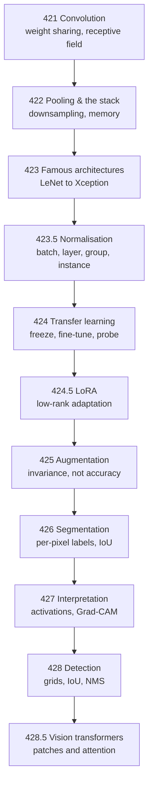

Convolution exists because a `Dense` layer is the wrong shape for an image. On a
224×224×3 photograph, `Dense(32)` costs **4,816,928 parameters**; a `Conv2D(32, 3)`
costs **896** — and unlike the dense layer, that number does not change when the image
does. Everything in this phase follows from weight sharing and locality.

Every number on these ten pages was measured on this machine, on a CPU, and the
measurements are reproducible in minutes. Where a result contradicted the textbook
claim, the page says so.

## The pages

| # | Page | The measured headline |
| --- | --- | --- |
| 421 | [Intro to CNNs](/deep-learning/phase-03---computer-vision-with-cnns/intro-to-convolutional-neural-networks-cnn-for-images/) | 896 parameters against 4,816,928; convolution matched TensorFlow at 2.38e-07; two 3×3 layers beat one 5×5 (18 weights against 25) |
| 422 | [Pooling & CNN Architecture](/deep-learning/phase-03---computer-vision-with-cnns/pooling--cnn-architecture/) | average 0.8740, max 0.8720, **strided convolution last at 0.8455**; `Flatten`→`Dense` held 803,072 of 880,936 weight bytes |
| 423 | [Famous Architectures](/deep-learning/phase-03---computer-vision-with-cnns/famous-cnn-architectures-lenet-to-resnet/) | VGG-ish 0.8800 wins; **plain beat residual at 12 convolutions** (0.8500 vs 0.8433) |
| 423.5 | [Normalisation Beyond Batch](/deep-learning/phase-03---computer-vision-with-cnns/normalisation-beyond-batch---layer-group-and-instance/) | layer norm won at batches 4/16/64, batch norm overtook it at 256 — exactly where the statistic counts cross |
| 424 | [Transfer Learning](/deep-learning/phase-03---computer-vision-with-cnns/transfer-learning-using-pre-trained-models/) | fine-tuning beat scratch by **+0.0014**, freezing lost at every size, and a wrong learning rate cost **0.4026** |
| 424.5 | [Fine-Tuning and LoRA](/deep-learning/phase-03---computer-vision-with-cnns/fine-tuning-and-parameter-efficient-tuning-lora/) | LoRA reached 0.8911 training **2.80%** of the weights against full fine-tuning's 0.9385 — and **training from scratch beat both** at 0.9350 |
| 425 | [Data Augmentation](/deep-learning/phase-03---computer-vision-with-cnns/data-augmentation-for-small-datasets/) | **cost 0.1855** on canonical data and **bought 0.1105** on rotated data — invariance, not accuracy |
| 426 | [Image Segmentation](/deep-learning/phase-03---computer-vision-with-cnns/image-segmentation/) | pixel accuracy 0.9737 against a do-nothing baseline of **0.8691**; report IoU |
| 427 | [Interpreting Convnets](/deep-learning/phase-03---computer-vision-with-cnns/interpreting-what-convnets-learn-grad-cam/) | activations grow 1.61 → 20.44 with depth; **4 of 64 channels silent**; always run the random-weights check |
| 428 | [Object Detection](/deep-learning/phase-03---computer-vision-with-cnns/object-detection-bounding-boxes-and-yolo/) | 32.8 : 1 cell imbalance; recall 0.8616 → 0.6799 while precision sat at 0.997 |
| 428.5 | [Vision Transformers](/deep-learning/phase-03---computer-vision-with-cnns/vision-transformers-vit/) | the ViT **beat** the convnet at 1,000 and 4,000 rows — and overfitted 4× harder |



<Figure
  src="/images/dl/phase-03-vision/data-augmentation/augmentation-robustness"
  alt="A grouped bar chart with three conditions. On canonical test data the un-augmented model leads at 0.763 and accuracy falls with augmentation strength to 0.552. On shifted test data the ordering reverses at the top: 0.626 unaugmented against 0.672 light and 0.683 medium. On rotated test data medium augmentation leads clearly at 0.707 against 0.596 unaugmented."
  title="2,000 rows, 40 epochs — the same models on three test sets"
  caption="Read the un-augmented bars left to right: 0.763, 0.626, 0.596. That model loses 0.1370 the moment the test images move and 0.1665 when they rotate — it never had to cope with either. The medium-augmented model reads 0.695, 0.683, 0.707: almost flat. It gave up 0.068 on canonical data and bought back 0.1105 on rotated data. Neither model is better; they are optimised for different deployment conditions."
/>

<Figure
  src="/images/dl/phase-03-vision/transfer-learning/transfer-against-scratch"
  alt="Two panels. Left: best validation accuracy against target rows on a log axis for four strategies. From scratch, fine-tuned 1e-3 and frozen features cluster between 0.80 and 0.94, while fine-tuned 1e-4 starts far below at 0.4602 and catches up by 4,000 rows. Right: per-epoch curves at 250 rows showing fine-tuned 1e-3 and from scratch rising together to about 0.86, frozen features trailing at 0.81, and fine-tuned 1e-4 still climbing through 0.46 at epoch 12."
  title="Garments to footwear and bags, same sensor, disjoint labels"
  caption="Three of the four curves are on top of each other, which is the result: at 250 target rows, training from scratch reaches 0.8628 and the best transfer strategy reaches 0.8642. The outlier is the low learning rate, and the right panel shows why — at 1e-4 the model is simply still training at epoch 12. That is not a property of fine-tuning, it is a budget mismatch, and it is the most common way transfer-learning comparisons get rigged."
/>

<Figure
  src="/images/dl/overviews/phase-summaries/phase-3"
  alt="Horizontal bars, one per page in the phase, each labelled with the claim it tested and coloured by the verdict: green where the standard story held, amber where it held at a price, red where the measurement contradicted it. 4 of 6 claims contradicted, 1 held at a price, 1 held."
  title="Every claim this phase set out to test"
  caption="Collected from the runs behind each page's own figures rather than measured afresh, so every bar is traceable to the page it names. Bar length is the log of the effect size, because the effects span from 0.0014 to 5,376 — the number that matters is printed on each bar. Across all nine phases, 34 of 54 claims were contradicted outright, 11 held at a cost that was worth stating, and 9 held as advertised."
/>

## Four results that contradict the usual story

Each of these is measured on this data, at this scale — which is exactly the caveat that
makes them useful rather than misleading.

1. **Strided convolution came last.** The "learnable downsampling replaces pooling"
   advice lost to plain average pooling by 0.0285. A fixed rule with no parameters beat a
   learned one at equal capacity.
2. **Plain convolutions beat residual ones at 12 layers.** Residual connections solve a
   problem that starts at depths this phase cannot afford; at 12 convolutions they cost
   0.0067. Their *direction* was still visible — depth helped the residual family eight
   times more.
3. **Augmentation hurt at every dataset size.** Fashion-MNIST is centred and
   pose-normalised, and the un-augmented model was not overfitting. Augmentation encodes
   an invariance assumption; if the test set has no such variance, it is pure cost.
4. **The ViT beat the convnet at 1,000 rows.** "Transformers need enormous data" is a
   claim about 196+ tokens on 224×224 photographs. At 16 tokens on centred 28×28
   greyscale, the convolutional prior is worth very little.

```p5 title="How often the standard story survived" desc="Step through the phases. Each bar splits the claims that phase tested into contradicted, held at a price, and held as advertised - the totals are summed live." height="400"
let picked = 0;
const PHASES = [
  [1, "Neural Network Foundations", 3, 0, 3, "a single neuron cannot do XOR - 0 of 40,401 weight pairs"],
  [2, "Training Deep Networks", 2, 2, 2, "146x the parameters bought 0.0150 accuracy"],
  [3, "Computer Vision", 4, 1, 1, "augmentation cost 0.1855 clean, bought 0.1105 rotated"],
  [4, "Sequence Models", 4, 2, 0, "a fixed state scored 0.0017 against attention's 1.0000"],
  [5, "NLP & Transformers", 4, 1, 1, "TF-IDF 0.8632 beat a transformer's 0.8462, 55x cheaper"],
  [6, "Generative", 3, 1, 2, "copying 200 real images scored FID 5.027 against real 9.605"],
  [7, "Reinforcement Learning", 4, 2, 0, "replay and target nets: 144.20 together, 53.45 either alone"],
  [8, "Scaling & Deployment", 5, 1, 0, "mixed precision measured 40.65x SLOWER on this CPU"],
  [9, "Capstones", 5, 1, 0, "a memoriser beat the VAE on Frechet distance"]
];
function setup() {
  createCanvas(620, 400);
  textFont("monospace");
}
function draw() {
  background(13, 17, 23);
  noStroke();
  fill(230);
  textSize(12);
  textAlign(LEFT, TOP);
  text("54 claims, 9 phases, every one tested by a measurement", 26, 16);
  let broke = 0;
  let cost = 0;
  let held = 0;
  for (let i = 0; i < PHASES.length; i++) {
    broke += PHASES[i][2];
    cost += PHASES[i][3];
    held += PHASES[i][4];
  }
  for (let i = 0; i < PHASES.length; i++) {
    const y = 48 + i * 26;
    const row = PHASES[i];
    const chosen = i === picked;
    fill(chosen ? 255 : 130, chosen ? 211 : 140, chosen ? 67 : 155);
    textSize(9);
    text("Phase " + row[0] + "  " + row[1], 26, y + 5);
    let x = 250;
    const unit = 34;
    fill(224, 108, 117);
    rect(x, y, row[2] * unit, 17, 2);
    x += row[2] * unit;
    fill(255, 211, 67);
    rect(x, y, row[3] * unit, 17, 2);
    x += row[3] * unit;
    fill(126, 192, 143);
    rect(x, y, row[4] * unit, 17, 2);
    if (chosen) {
      noFill();
      stroke(255, 211, 67);
      strokeWeight(1.5);
      rect(248, y - 2, 6 * unit + 4, 21, 3);
      noStroke();
    }
  }
  const row = PHASES[picked];
  fill(200);
  textSize(10);
  text("Phase " + row[0] + " headline:", 26, 300);
  fill(255, 211, 67);
  textSize(10);
  text(row[5], 26, 318);
  fill(150);
  textSize(9);
  text("contradicted " + row[2] + "   held at a price " + row[3]
       + "   held " + row[4], 26, 340);
  fill(224, 108, 117);
  rect(26, 360, 12, 12, 2);
  fill(150);
  textSize(9);
  text("contradicted  " + broke + " of 54", 44, 362);
  fill(255, 211, 67);
  rect(210, 360, 12, 12, 2);
  fill(150);
  text("held at a price  " + cost, 228, 362);
  fill(126, 192, 143);
  rect(400, 360, 12, 12, 2);
  fill(150);
  text("held  " + held, 418, 362);
  fill(110);
  textSize(8.5);
  text("click a row. Collected from each page's own measured run.", 26, 382);
}
function mousePressed() {
  for (let i = 0; i < PHASES.length; i++) {
    const y = 48 + i * 26;
    if (mouseY > y && mouseY < y + 20) { picked = i; }
  }
}
```

## Three mistakes that were mine, and are now on the pages

Every one of these produced a plausible-looking number before it was caught.

- **Batch normalisation's default momentum of 0.99** needs roughly 460 batches for its
  moving averages to settle. A 376-batch run reported validation accuracy of 0.1540 with
  a training loss of 0.27. Lowering it to 0.9 fixed it, and the incident is written up on
  page 423.
- **A ReLU placed before the `Add`** in a residual block made the residual model *worse*
  than the plain one, because activations then grow additively with depth. The classic
  ordering is conv-BN-relu-conv-BN → `Add` → relu.
- **A fixed epoch budget** measured the budget rather than the treatment: augmented runs
  were still climbing at epoch 15 while plain runs had stopped. Page 425 reports the
  best epoch per run for exactly this reason.

```p5 title="Augmentation is a bet on the test set" desc="Drag to choose how much augmentation to apply, then click a test set. The measured accuracy changes sign depending on which distribution you deploy on." height="360"
let strength = 0;
let testSet = 0;
const NAMES = ["none", "light", "medium"];
const TESTS = ["canonical", "shifted", "rotated"];
// Measured: rows are augmentation strength, columns are test set.
const ACC = [
  [0.763, 0.626, 0.596],
  [0.719, 0.672, 0.664],
  [0.695, 0.683, 0.707],
];
function setup() {
  createCanvas(620, 360);
  textFont("monospace");
}
function draw() {
  background(13, 17, 23);
  noStroke();
  fill(230);
  textSize(12);
  textAlign(LEFT, TOP);
  text("2,000 rows, 40 epochs, Fashion-MNIST", 26, 18);
  fill(150);
  textSize(10);
  text("augmentation applied at training time:", 26, 46);
  for (let i = 0; i < NAMES.length; i++) {
    const x = 26 + i * 100;
    if (i === strength) { fill(255, 211, 67); } else { fill(48, 56, 68); }
    rect(x, 64, 90, 24, 4);
    if (i === strength) { fill(13, 17, 23); } else { fill(190); }
    textSize(10);
    textAlign(CENTER, CENTER);
    text(NAMES[i], x + 45, 76);
    textAlign(LEFT, TOP);
  }
  fill(150);
  textSize(10);
  text("test set it is judged on:", 26, 104);
  for (let i = 0; i < TESTS.length; i++) {
    const x = 26 + i * 100;
    if (i === testSet) { fill(107, 169, 221); } else { fill(48, 56, 68); }
    rect(x, 122, 90, 24, 4);
    if (i === testSet) { fill(13, 17, 23); } else { fill(190); }
    textSize(10);
    textAlign(CENTER, CENTER);
    text(TESTS[i], x + 45, 134);
    textAlign(LEFT, TOP);
  }
  const value = ACC[strength][testSet];
  const plain = ACC[0][testSet];
  fill(40, 47, 58);
  rect(26, 176, 480, 28, 4);
  const better = value >= plain;
  if (better) { fill(126, 192, 143); } else { fill(224, 108, 117); }
  rect(26, 176, value * 480, 28, 4);
  fill(240);
  textSize(13);
  text(value.toFixed(3), 34, 183);
  fill(150);
  textSize(9.5);
  text("no augmentation on this test set: " + plain.toFixed(3), 26, 214);
  const delta = value - plain;
  if (delta >= 0) { fill(126, 192, 143); } else { fill(224, 108, 117); }
  textSize(11);
  text((delta >= 0 ? "+" : "") + delta.toFixed(3) + " against no augmentation",
       26, 236);
  fill(150);
  textSize(9);
  text("medium augmentation costs 0.068 on canonical data and buys 0.111", 26, 278);
  text("on rotated data. Neither model is better - they are optimised for", 26, 292);
  text("different deployment conditions, and only you know which is yours.", 26, 306);
}
function mousePressed() {
  if (mouseY > 64 && mouseY < 88) {
    for (let i = 0; i < 3; i++) {
      const x = 26 + i * 100;
      if (mouseX > x && mouseX < x + 90) { strength = i; }
    }
  }
  if (mouseY > 122 && mouseY < 146) {
    for (let i = 0; i < 3; i++) {
      const x = 26 + i * 100;
      if (mouseX > x && mouseX < x + 90) { testSet = i; }
    }
  }
}
```

## What carries into the rest of the module

| Idea from this phase | Where it comes back |
| --- | --- |
| weight sharing over a structured axis | 1D convolution over time, Phase 4 |
| layer normalisation, no batch statistics | every transformer block, Phases 4–6 |
| residual connections around a sublayer | transformer blocks, diffusion U-Nets |
| the encoder–decoder hourglass with skips | U-Net diffusion models, Phase 6 |
| attention over a set of tokens | the whole of Phase 5 |
| "compare against the do-nothing baseline" | forecasting, detection, generation |

:::tip[From the book]
*Hands-On Machine Learning* traces CNNs to Hubel and Wiesel's 1958–59 finding that
visual-cortex neurons respond to a small **receptive field**, and that simple detectors
combine into complex ones deeper in. That hierarchy is what page 421 measures directly:
a receptive field of 17 pixels after eight 3×3 layers at stride 1, and 511 at stride 2.
:::

:::tip[From the book]
François Chollet frames architecture as the choice of a **hypothesis space**. A
convolution encodes the prior that visual patterns are translation-invariant — page 421
measures that equivariance at exactly 0.00e+00 in the interior. Page 428.5 then removes
the prior entirely and measures what it was worth: on this data, less than nothing.
:::


<Quiz
  questions={[
    {
      q: "On 224x224x3 input, `Dense(32)` costs 4,816,928 parameters and `Conv2D(32, 3)` costs 896. Which part of that comparison matters most?",
      options: [
        "That the convolution is smaller",
        "That the convolution's count does not depend on the image size at all, because the same 3x3 kernel is reused at every position",
        "That dense layers are obsolete",
        "That 896 is a round number"
      ],
      answer: 1,
      explanation: "Weight sharing is what makes the parameter count independent of resolution. Double the image and the dense layer quadruples while the convolution is unchanged."
    },
    {
      q: "Augmentation cost 0.1855 on canonical test data and bought 0.1105 on rotated test data. What is the correct conclusion?",
      options: [
        "Augmentation does not work",
        "Augmentation encodes an invariance assumption, so it pays exactly when the deployment distribution contains that variance and costs accuracy when it does not",
        "Fashion-MNIST is a bad dataset",
        "The augmented model needed more epochs"
      ],
      answer: 1,
      explanation: "Fashion-MNIST is centred and pose-normalised, so rotation invariance is not needed on its own test set. Which model you want depends on whether your inputs will be centred, and they usually will not be."
    },
    {
      q: "Fine-tuning at learning rate 1e-4 reached only 0.4602 at 250 rows while 1e-3 reached 0.8642. Why is the low-rate result NOT evidence against fine-tuning?",
      options: [
        "Because 1e-4 is always wrong",
        "Because the per-epoch curve shows it was still climbing at epoch 12 - it is a budget mismatch, not a property of the method",
        "Because pretrained weights need higher rates by definition",
        "Because the two runs used different data"
      ],
      answer: 1,
      explanation: "A fixed epoch budget measures the budget, not the treatment. This is the most common way a transfer-learning comparison gets rigged, in either direction."
    },
    {
      q: "Batch normalisation's default momentum of 0.99 needs roughly 460 batches to settle, and a 376-batch run reported validation accuracy of 0.1540 with a training loss of 0.27. What was actually broken?",
      options: [
        "The model had not learned anything",
        "Nothing in the model - the moving averages used at inference time had not converged, so training and validation were effectively using different normalisation statistics",
        "The learning rate",
        "The validation split"
      ],
      answer: 1,
      explanation: "The training loss of 0.27 says the model learned fine. Batch norm uses batch statistics during training and moving averages at inference, and a short run never gives those averages time to catch up."
    },
    {
      q: "A vision transformer BEAT the convnet at 1,000 and 4,000 rows, contradicting 'transformers need enormous data'. What makes both statements true at once?",
      options: [
        "The measurement was wrong",
        "The usual claim is about 196+ tokens on 224x224 photographs; at 16 tokens on centred 28x28 greyscale, the convolutional prior is worth very little, so there is far less for the transformer to relearn",
        "Transformers are simply better",
        "The convnet was undertrained"
      ],
      answer: 1,
      explanation: "The scale of the claim is part of the claim. Stating the token count and image size turns a contradiction into two compatible results measured at different scales."
    }
  ]}
/>
