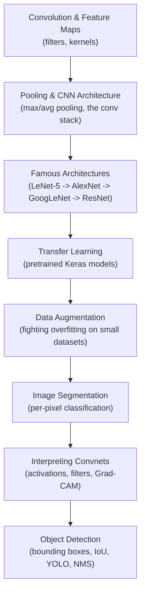

## Why images need a different network

A plain `Dense` layer for a 100 × 100 pixel image would need to connect every
neuron to all 10,000 pixels — millions of weights before you've even reached
the second layer. Images also have structure a `Dense` layer throws away:
nearby pixels are related, and the same pattern (an edge, an eye, a wheel)
can appear anywhere in the frame. **Convolutional neural networks (CNNs)**
were built specifically to exploit that structure, using small filters that
slide across the image and share their weights everywhere they go.

In this phase, you'll learn:

- how **convolutional layers** use filters (kernels) to build feature maps
  instead of connecting to every pixel
- how **pooling layers** shrink feature maps and add a little translation
  invariance
- the classic CNN stack, and the memory/parameter trade-offs behind it
- the landmark architectures that shaped the field — **LeNet-5, AlexNet,
  GoogLeNet, VGGNet, ResNet**, and **Xception**
- how to reuse a Keras **pretrained model** instead of training from scratch
- how **data augmentation** manufactures believable new training images to
  fight overfitting on small datasets
- **semantic segmentation** — classifying every pixel of an image, not just
  the image as a whole
- how to peek inside a trained convnet with **activation visualizations,
  filter visualizations, and Grad-CAM heatmaps**
- **object detection** — predicting bounding boxes as a regression problem,
  grading them with IoU, and cleaning up duplicates with non-max
  suppression, the way YOLO does in real time

## Phase 3 flow

## How the pieces fit together

Every modern vision model is still, at heart, a stack of the same two
building blocks: **convolutional layers** that detect patterns and **pooling
layers** that shrink the image while keeping what matters. Once you
understand that stack, the "famous architectures" are just different ways of
arranging it — LeNet-5 stacked it modestly, AlexNet made it deeper and added
ReLU, GoogLeNet made it wider with inception modules, and ResNet made it
*very* deep by adding skip connections so gradients could flow all the way
back. Rather than retraining one of these giants yourself, `keras.applications`
lets you download the pretrained weights directly — which is exactly how the
Image Segmentation page's encoder-decoder model, and the Grad-CAM
interpretability page's Xception model, get their vision "backbone."

Once the classics are behind you, the phase moves into the techniques that
make CNNs practical to train and trust on real, small, messy datasets: data
augmentation for when you don't have millions of images, image segmentation
for when you need a per-pixel answer instead of a single label, and
Grad-CAM for when you need to know *why* your model made a prediction, not
just what it predicted. The phase closes with object detection, which pulls
several earlier ideas together at once — a classifier-and-localizer trained
as a regression problem, an FCN's dense-to-convolutional trick for running
it efficiently across a whole image, and IoU-based non-max suppression for
cleaning up the result — exactly the recipe behind YOLO.

:::tip[From the book]
*Hands-On Machine Learning* (Géron) opens this chapter by tracing CNNs back to
biology: in 1958–59, Hubel and Wiesel found that neurons in the visual cortex
react only to a small **receptive field**, and that simple, low-level
detectors (like horizontal or vertical lines) get combined into detectors for
larger, more complex patterns deeper in the brain. That hierarchical idea —
simple filters low down, complex combinations higher up — is precisely what a
convolutional layer stacked on convolutional layer reproduces in software, and
it's why the field ties its history to the 1998 LeNet-5 paper that introduced
convolution and pooling layers together for the first time.
:::

:::tip[From the book]
François Chollet (creator of Keras, and of the Xception architecture
featured in this phase) frames a model's architecture as the sum of choices
that define its **hypothesis space** — the space of functions gradient
descent can search over. Convolutional layers encode a specific piece of
prior knowledge: that visual patterns are translation-invariant. Later
architecture patterns in this phase — residual connections, batch
normalization, depthwise separable convolutions — all encode further prior
knowledge about what makes deep vision models trainable and efficient.
:::
