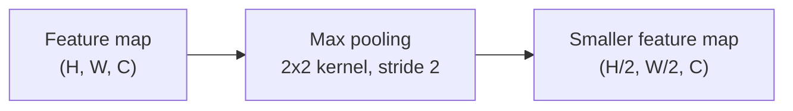

## What pooling layers do

Once you understand convolutional layers, pooling layers are easy: their goal
is to **subsample** (shrink) the feature maps, which reduces the
computational load, the memory usage, and the number of parameters —
limiting the risk of overfitting along the way.

Just like a convolutional layer, each neuron in a pooling layer looks at a
small receptive field in the previous layer. The difference is that a pooling
neuron has **no weights** — it just aggregates its inputs with a fixed
function such as `max` or `mean`.

## Max pooling vs. average pooling

- **Max pooling** keeps only the largest value in each receptive field and
  drops the rest. With a 2 × 2 kernel and stride 2, only the strongest of
  every 4 pixels survives.
- **Average pooling** keeps the mean instead of the max.

Max pooling is more common in practice: it keeps the *strongest* signal and
throws away the noise, and it gives the network a bit of **translation
invariance** — if the input shifts by a pixel or two, the max-pooled output
often stays exactly the same. That invariance is great for classification
("is there a cat *somewhere*?"), but it's actually undesirable for tasks like
semantic segmentation, where a shift in the input should produce a matching
shift in the output (this is called **equivariance**, not invariance).

The downside: max pooling is destructive. Even a tiny 2 × 2 kernel with
stride 2 throws away 75% of the input values.



## tf.keras implementation

```python title="pooling_layers.py" showLineNumbers{1}
import tensorflow as tf

max_pool = tf.keras.layers.MaxPool2D(pool_size=2)     # stride defaults to pool_size
avg_pool = tf.keras.layers.AvgPool2D(pool_size=2)

# Global average pooling: outputs one number per feature map, per instance.
# Often used as the very last layer before the Dense output in modern CNNs.
global_avg_pool = tf.keras.layers.GlobalAvgPool2D()
```

## A typical CNN stack

A classic CNN architecture repeats the same pattern: a few convolutional
layers (each followed by ReLU), then a pooling layer to shrink the image,
then a few more convolutional layers, then another pooling layer, and so on.
As the image gets smaller, it typically gets **deeper** — more feature maps —
since a pooling layer halving the spatial size lets you afford to double the
number of filters without an explosion in parameters or compute. At the top,
a regular feedforward network turns the final feature maps into a prediction.

Here is a simple CNN for Fashion MNIST, straight out of the book:

```python title="fashion_mnist_cnn.py" showLineNumbers{1}
import tensorflow as tf

model = tf.keras.models.Sequential([
    tf.keras.layers.Conv2D(64, 7, activation="relu", padding="same", input_shape=[28, 28, 1]),
    tf.keras.layers.MaxPooling2D(2),
    tf.keras.layers.Conv2D(128, 3, activation="relu", padding="same"),
    tf.keras.layers.Conv2D(128, 3, activation="relu", padding="same"),
    tf.keras.layers.MaxPooling2D(2),
    tf.keras.layers.Conv2D(256, 3, activation="relu", padding="same"),
    tf.keras.layers.Conv2D(256, 3, activation="relu", padding="same"),
    tf.keras.layers.MaxPooling2D(2),
    tf.keras.layers.Flatten(),
    tf.keras.layers.Dense(128, activation="relu"),
    tf.keras.layers.Dropout(0.5),
    tf.keras.layers.Dense(64, activation="relu"),
    tf.keras.layers.Dropout(0.5),
    tf.keras.layers.Dense(10, activation="softmax"),
])
model.compile(loss="sparse_categorical_crossentropy", optimizer="adam", metrics=["accuracy"])
model.summary()
```

Notice how the number of filters grows (64 → 128 → 256) each time a pooling
layer halves the height and width — this CNN reaches over 92% accuracy on
Fashion MNIST, clearly better than a plain dense network on the same task.

:::note
A common mistake is reaching for one big kernel (say, 5 × 5). Two stacked
3 × 3 convolutional layers usually use *fewer* parameters, need *fewer*
computations, and perform *better* than one 5 × 5 layer. The one exception is
the very first convolutional layer: it can afford a larger kernel (e.g. 7 × 7
or 5 × 5) with a stride of 2 or more, since the input only has 1-3 channels
and shrinking it early is cheap.
:::

## Memory requirements

Convolutional layers can be very memory-hungry, especially during training —
backpropagation needs to keep every intermediate feature map around for the
reverse pass. Consider a convolutional layer with 5 × 5 filters, outputting
200 feature maps of size 150 × 100, stride 1, "same" padding, fed a
150 × 100 RGB image:

- **Parameters**: `(5 × 5 × 3 + 1) × 200 = 15,200` — small compared to a
  `Dense` layer (which would need **675 million** parameters for the same
  input and output size).
- **Compute per instance**: each of the 200 feature maps has 150 × 100
  neurons, each computing a weighted sum of 5 × 5 × 3 = 75 inputs — about
  **225 million** float multiplications.
- **RAM for the output**: 200 × 150 × 100 × 32 bits ≈ 12 MB, for *one*
  instance. A batch of 100 instances needs **1.2 GB** just for this one
  layer's output.

If training crashes with an out-of-memory error, try: a smaller mini-batch
size, a larger stride, removing a layer, 16-bit floats instead of 32-bit, or
distributing the model across multiple devices.

## Modern twist: residual connections around pooling blocks

Stacking convolution and pooling layers works well up to a point, but very
deep stacks run into a different problem: backpropagation is a bit like the
game of telephone — an error signal gets passed backward through function
after function, and each one introduces a little noise. Stack enough layers
and the gradient reaching the earliest layers can get overwhelmed by that
noise entirely, so the network stops learning. This is the **vanishing
gradient problem**.

The fix, popularized by ResNet, is to add the input of a block back to its
output — a **residual (skip) connection** — so gradients have a noise-free
shortcut all the way back, no matter how deep the main path grows. When a
block includes a `MaxPooling2D` layer, the residual needs its own small
strided `1 × 1` convolution to shrink and reshape it so the addition still
lines up:

```python title="residual_pooling_block.py" showLineNumbers{1}
import tensorflow as tf

def residual_block(x, filters, pooling=False):
    residual = x
    x = tf.keras.layers.Conv2D(filters, 3, activation="relu", padding="same")(x)
    x = tf.keras.layers.Conv2D(filters, 3, activation="relu", padding="same")(x)
    if pooling:
        x = tf.keras.layers.MaxPooling2D(2, padding="same")(x)
        # match the pooling layer's downsampling with a strided 1x1 conv
        residual = tf.keras.layers.Conv2D(filters, 1, strides=2)(residual)
    elif filters != residual.shape[-1]:
        # number of filters changed but no pooling -- just reshape channels
        residual = tf.keras.layers.Conv2D(filters, 1)(residual)
    return tf.keras.layers.add([x, residual])
```

Every architecture on the next page that goes very deep (ResNet, and
anything built on top of it) relies on exactly this pattern: convolution +
pooling for the "processing" work, and a skip connection so depth doesn't
come at the cost of trainability.

:::tip[From the book]
Chollet's mental model for why this works: force each block in the chain to
be "nondestructive" by making sure it retains a noiseless copy of its input
alongside whatever transformation it computes. Concretely, that's just
`residual = x; x = block(x); x = add([x, residual])`. It's a small addition
to the code, but it's the difference between a CNN that tops out around a
few dozen layers and one — like the 152-layer ResNet — that trains reliably
at almost any depth.
:::

## Visualize it

A 2 × 2 max-pooling kernel with stride 2 slides across the feature map
without overlapping, and only the brightest (largest) pixel in each 2 × 2
block survives into the smaller output:

```p5 title="Max pooling: downsampling a feature map" desc="A 2x2 max-pooling window slides over the input without overlapping, keeping only the largest value in each block." height="340"
const gridSize = 8;
let img = [];
function randomize() {
  img = [];
  for (let r = 0; r < gridSize; r++) {
    const row = [];
    for (let c = 0; c < gridSize; c++) row.push(floor(random(20, 235)));
    img.push(row);
  }
}
const outSize = gridSize / 2;
let outImg = [];
let pos = 0;
let t = 0;
const cell = 26;
const inX = 40, inY = 46;
const outX = 420, outY = 46;

function resetOut() {
  outImg = [];
  for (let i = 0; i < outSize; i++) outImg.push(new Array(outSize).fill(null));
  pos = 0;
}
function setup() {
  createCanvas(640, 340);
  textFont("monospace");
  textAlign(CENTER, CENTER);
  randomize();
  resetOut();
}
function maxOf(r, c) {
  let m = -Infinity;
  for (let kr = 0; kr < 2; kr++) {
    for (let kc = 0; kc < 2; kc++) m = max(m, img[r * 2 + kr][c * 2 + kc]);
  }
  return m;
}
function draw() {
  background(13, 17, 23);
  noStroke();
  fill(230);
  textSize(13);
  text("Input feature map (8x8)", inX + (gridSize * cell) / 2, inY - 20);
  text("Pooled output (4x4)", outX + (outSize * cell * 2) / 2, outY - 20);

  for (let r = 0; r < gridSize; r++) {
    for (let c = 0; c < gridSize; c++) {
      fill(img[r][c]);
      stroke(60, 70, 84);
      strokeWeight(1);
      rect(inX + c * cell, inY + r * cell, cell, cell);
    }
  }

  const row = Math.floor(pos / outSize);
  const col = pos % outSize;

  noFill();
  stroke(255, 211, 67);
  strokeWeight(3);
  rect(inX + col * 2 * cell, inY + row * 2 * cell, cell * 2, cell * 2);

  for (let r = 0; r < outSize; r++) {
    for (let c = 0; c < outSize; c++) {
      const v = outImg[r][c];
      noStroke();
      fill(v === null ? color(24, 34, 44) : color(v));
      stroke(60, 70, 84);
      strokeWeight(1);
      rect(outX + c * cell * 2, outY + r * cell * 2, cell * 2, cell * 2);
    }
  }
  noFill();
  stroke(120, 200, 120);
  strokeWeight(3);
  rect(outX + col * cell * 2, outY + row * cell * 2, cell * 2, cell * 2);

  noStroke();
  fill(107, 169, 221);
  textSize(12);
  text("only the brightest pixel in each 2x2 block survives", width / 2, height - 18);

  t++;
  if (t % 20 === 0) {
    outImg[row][col] = maxOf(row, col);
    pos++;
    if (pos >= outSize * outSize) {
      randomize();
      resetOut();
    }
  }
}
function mousePressed() { randomize(); resetOut(); }
```

## Mini-checkpoint

Why is max pooling used more often than average pooling in modern CNNs?

- it keeps only the strongest activations (a cleaner signal for later layers),
  gives slightly stronger translation invariance, and is cheaper to compute.

:::tip[From the book]
*Hands-On Machine Learning* (Géron) notes an interesting exception: a max
pooling layer typically works on **spatial** dimensions (height and width),
but you can also pool along the **depth** dimension. A depthwise max pooling
layer can let a CNN learn to be invariant to things like rotation, thickness,
or brightness — for example, learning several filters that each detect a
different rotation of the same handwritten digit, then letting depthwise max
pooling pick whichever one fired strongest. `tf.keras` doesn't ship this out
of the box, but you can build it with `tf.nn.max_pool()` wrapped in a
`Lambda` layer.
:::

import DataCampExercise from "../../../../components/DataCampExercise.astro";

## 🧪 Try It Yourself

### Exercise 1 – Add a Max Pooling Layer

<DataCampExercise
  lang="python"
  hint={`\`tf.keras.layers.MaxPool2D(pool_size=2)\` — the stride defaults to the pool size.`}
  code={`# Task: Exercise 1 - Add a Max Pooling Layer
import tensorflow as tf

pool = tf.keras.layers.___(pool_size=2)   # replace ___ with MaxPool2D
print("layer:", pool.__class__.__name__)
print("pool_size:", pool.pool_size)

# ── Expected Output ───────────────────────────────────────────
# layer: MaxPooling2D
# pool_size: (2, 2)
# ──────────────────────────────────────────────────────────────`}
  solution={`import tensorflow as tf

pool = tf.keras.layers.MaxPool2D(pool_size=2)
print("layer:", pool.__class__.__name__)
print("pool_size:", pool.pool_size)`}
  sct={`test_output_contains("layer: MaxPooling2D")
test_output_contains("pool_size: (2, 2)")
success_msg("Max pooling layer created!")`}
  height={150}
/>

### Exercise 2 – Check the Downsampled Shape

<DataCampExercise
  lang="python"
  hint={`After a \`MaxPool2D(pool_size=2)\`, both height and width are cut in half.`}
  code={`# Task: Exercise 2 - Check the Downsampled Shape
import tensorflow as tf

model = tf.keras.models.Sequential([
    tf.keras.layers.Conv2D(32, 3, padding="same", activation="relu", input_shape=[28, 28, 1]),
    tf.keras.layers.___(pool_size=2),   # replace ___ with MaxPool2D
])
print("output shape:", model.output_shape)

# ── Expected Output ───────────────────────────────────────────
# output shape: (None, 14, 14, 32)
# ──────────────────────────────────────────────────────────────`}
  solution={`import tensorflow as tf

model = tf.keras.models.Sequential([
    tf.keras.layers.Conv2D(32, 3, padding="same", activation="relu", input_shape=[28, 28, 1]),
    tf.keras.layers.MaxPool2D(pool_size=2),
])
print("output shape:", model.output_shape)`}
  sct={`test_output_contains("output shape: (None, 14, 14, 32)")
success_msg("Pooling cut the spatial size in half, as expected!")`}
  height={160}
/>

### Exercise 3 – Global Average Pooling

<DataCampExercise
  lang="python"
  hint={`\`tf.keras.layers.GlobalAvgPool2D()\` collapses each feature map down to a single number.`}
  code={`# Task: Exercise 3 - Global Average Pooling
import tensorflow as tf

model = tf.keras.models.Sequential([
    tf.keras.layers.Conv2D(64, 3, padding="same", activation="relu", input_shape=[32, 32, 3]),
    tf.keras.layers.___(),   # replace ___ with GlobalAvgPool2D
])
print("output shape:", model.output_shape)

# ── Expected Output ───────────────────────────────────────────
# output shape: (None, 64)
# ──────────────────────────────────────────────────────────────`}
  solution={`import tensorflow as tf

model = tf.keras.models.Sequential([
    tf.keras.layers.Conv2D(64, 3, padding="same", activation="relu", input_shape=[32, 32, 3]),
    tf.keras.layers.GlobalAvgPool2D(),
])
print("output shape:", model.output_shape)`}
  sct={`test_output_contains("output shape: (None, 64)")
success_msg("Global average pooling collapsed each feature map to one number!")`}
  height={160}
/>

## Next

Continue to **Famous CNN Architectures (LeNet to ResNet)** — see how these
same convolution and pooling building blocks were arranged differently over
the years to win the ImageNet challenge.
