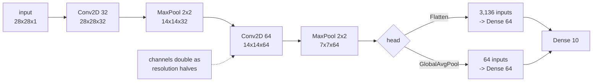

Convolution keeps the resolution; something has to reduce it. The
[receptive-field arithmetic](/deep-learning/phase-03---computer-vision-with-cnns/intro-to-convolutional-neural-networks-cnn-for-images/)
showed why: eight stride-1 layers see 17 pixels of a 28-pixel image, while
downsampling reaches 511. This page measures the four ways of doing it, and one of
the results contradicts the usual advice.

## What you'll learn

- Pooling implemented by hand and matched to Keras at **0.00e+00** (max) and
  **5.96e−08** (average).
- What each kind preserves: average pooling keeps the mean at **0.5761** exactly,
  max pooling raises it to **0.6738**.
- Four downsampling strategies measured, where **average pooling (0.8740) matched
  max pooling (0.8720)** and strided convolution came last at 0.8455.
- What skipping downsampling costs: **14.7× the parameters and 3× the time** for
  no reliable gain.
- The activation-memory profile: **201,000 bytes per image**, and where it goes.
- Why `Flatten` before a `Dense` head is where a small convnet's parameters
  disappear.

## Pooling is a reduction with no parameters

Split the feature map into non-overlapping windows and replace each with one
number — its maximum or its mean:

```python title="Both kinds, written out"
def pool(image, size, how):
    blocks = image.reshape(image.shape[0] // size, size,
                           image.shape[1] // size, size)
    return blocks.max(axis=(1, 3)) if how == "max" else blocks.mean(axis=(1, 3))
```

Matched against `MaxPooling2D(2)` and `AveragePooling2D(2)`: maximum difference
**0.00e+00** for max pooling and **5.96e−08** for average pooling — the latter is
float32 rounding on the division. A 2×2 pool discards three of every four values:
784 numbers become 196.

<Figure
  src="/images/dl/phase-03-vision/pooling-and-architecture/pooling-on-an-image"
  alt="Five greyscale panels: a 28x28 Fashion-MNIST pullover, then the same image after 2x2 max pooling and 2x2 average pooling at 14x14, and 4x4 max and average pooling at 7x7. The max-pooled versions look brighter and blockier; the average-pooled ones look softer."
  title="The same image, pooled four ways"
  caption="Max pooling keeps the brightest pixel in each window, so the garment thickens and brightens — its mean rises from 0.5761 to 0.6738 at 2x2 and 0.8353 at 4x4. Average pooling preserves the mean exactly at 0.5761 in both cases, and loses the peaks instead: its maximum falls from 1.0000 to 0.9657 and then 0.9422."
/>

| | Output shape | Mean | Max | Std |
| --- | --- | --- | --- | --- |
| input | (28, 28) | 0.5761 | 1.0000 | 0.4329 |
| max pool 2×2 | (14, 14) | **0.6738** | 1.0000 | 0.4185 |
| average pool 2×2 | (14, 14) | **0.5761** | 0.9657 | 0.4008 |
| max pool 4×4 | (7, 7) | **0.8353** | 1.0000 | 0.3229 |
| average pool 4×4 | (7, 7) | **0.5761** | 0.9422 | 0.3450 |

That table is the whole difference. **Max pooling asks "did this feature appear
anywhere in the window?"** — it is a local OR, it keeps the peak, and it raises the
mean because the maximum of four samples is above their average. **Average pooling
asks "how much of this feature was present on average?"** — it preserves the mean
by construction and destroys the peaks.

For a feature detector, the OR is usually what you want: a vertical edge somewhere
in this 2×2 region is the useful fact. That is the standard argument for max
pooling. The measurement below tests it.

## Four ways to halve the resolution

Same architecture, same seed, 8,000 Fashion-MNIST rows, 12 epochs — only the
downsampling mechanism changes:

<Figure
  src="/images/dl/phase-03-vision/pooling-and-architecture/downsampling-options"
  alt="Two panels. Left: validation accuracy per epoch for four downsampling strategies, with max pool, average pool and no downsampling clustered near 0.87 and strided convolution below them. Right: a scatter of final accuracy against parameter count on a log axis, where no downsampling sits far to the right at 3.2 million parameters."
  title="Fashion-MNIST, 8,000 rows, 12 epochs"
  caption="Max and average pooling are indistinguishable at 0.8720 and 0.8740 with identical parameter counts. Strided convolution adds 46,176 parameters and finishes last at 0.8455. Removing downsampling entirely reaches 0.8765 — the best 'best' figure — but needs 3,230,794 parameters and 345 seconds against max pooling's 220,234 and 116."
/>

| Strategy | Parameters | Final val accuracy | Best | Seconds |
| --- | --- | --- | --- | --- |
| max pooling | 220,234 | 0.8720 | 0.8760 | 116.3 |
| average pooling | 220,234 | **0.8740** | 0.8740 | **90.6** |
| strided convolution | 266,410 | **0.8455** | 0.8645 | 142.8 |
| no downsampling | **3,230,794** | 0.8655 | **0.8765** | **345.5** |

Three honest readings:

1. **Average pooling matched max pooling.** 0.8740 against 0.8720 final, with
   identical parameter counts, and average pooling was 22% faster in this run. The
   "max pooling is better for feature detection" argument is plausible and did not
   show up here. Both are fine; do not spend time choosing.
2. **Strided convolution came last** — 0.8455 — while adding 46,176 parameters and
   the most time of the three downsampling options. It is a learnable
   downsampler, which sounds better and here was worse.
3. **Skipping downsampling was not the disaster the theory suggests.** It reached
   the highest single number (0.8765), because it never throws information away.
   It also cost **14.7× the parameters** and **3× the time**, and those 3.2 million
   parameters are almost entirely in the `Flatten` → `Dense` transition, not in the
   convolutions.

The practical conclusion is the unglamorous one: pool with a 2×2 window, use max
or average as you prefer, and spend the saved effort elsewhere.

## The architecture that follows from this



The pattern is almost universal: **resolution halves and channel count doubles**,
so the total activation volume falls by 2× per block rather than 4×. Each block
sees a larger region and represents more distinct patterns in it.

## Where the memory actually goes

Training memory is dominated by stored activations, not weights — the backward
pass needs every intermediate. Measured on the max-pool model:

<Figure
  src="/images/dl/phase-03-vision/pooling-and-architecture/memory-profile"
  alt="Log-scale grouped bar chart per layer showing activation bytes in blue and weight bytes in amber. The first Conv2D has the largest activations at 100,352 bytes and almost no weights; the first Dense layer has 803,072 bytes of weights and 256 bytes of activations."
  title="Per-image activation memory against weight memory"
  caption="The two quantities are almost perfectly anti-correlated. The first convolution stores 100,352 bytes of activations from 1,280 bytes of weights; the Dense layer stores 256 bytes of activations from 803,072 bytes of weights. Total activations are 201,000 bytes per image, so a batch of 512 needs 102.91 MB before gradients are considered."
/>

| Layer | Output shape | Activations (bytes) | Weights (bytes) |
| --- | --- | --- | --- |
| Conv2D | (28, 28, 32) | **100,352** | 1,280 |
| MaxPooling2D | (14, 14, 32) | 25,088 | 0 |
| Conv2D | (14, 14, 64) | 50,176 | 73,984 |
| MaxPooling2D | (7, 7, 64) | 12,544 | 0 |
| Flatten | (3136,) | 12,544 | 0 |
| Dense | (64,) | 256 | **803,072** |
| Dense | (10,) | 40 | 2,600 |

| Batch size | Activation memory (forward only) |
| --- | --- |
| 32 | 6.43 MB |
| 128 | 25.73 MB |
| 512 | **102.91 MB** |

Two things follow. **Pooling early is the cheapest memory saving available** — the
first pool removes 75,264 bytes per image, more than every weight in the two
convolutions combined. And **the batch size you can fit is set by activations**,
which scale linearly with it, while weights do not scale at all.

## The `Flatten` trap

Look again at that table: `Dense(64)` after `Flatten` holds **803,072 bytes of
weights** — 91% of the model's parameters — because it receives
$7 \times 7 \times 64 = 3{,}136$ inputs. Replace `Flatten` with
`GlobalAveragePooling2D` and it receives 64.

```python title="Two heads, one of them enormous"
keras.layers.Flatten(),                        # 3,136 inputs -> Dense(64)
keras.layers.GlobalAveragePooling2D(),         # 64 inputs -> Dense(64)
```

Global pooling averages each channel down to a single number, which discards
position entirely. That is the right trade for classification — you want "a sleeve
is present", not "a sleeve is present at (3, 5)" — and it is why every architecture
after VGG uses it.

```p5 title="Pool a feature map by hand" desc="A 8x8 map with a bright diagonal. Switch between max and average pooling at two window sizes and read what each one keeps." height="330"
let how = "max";
let size = 2;
const N = 8;
let input = [];
function setup() {
  createCanvas(600, 330);
  textFont("monospace");
  for (let r = 0; r < N; r++) {
    const line = [];
    for (let c = 0; c < N; c++) {
      // A diagonal ridge plus a single bright spot off it.
      let v = Math.max(0, 1 - Math.abs(r - c) * 0.45);
      if (r === 1 && c === 6) v = 1.0;
      line.push(v);
    }
    input.push(line);
  }
}
function pooled() {
  const out = [];
  for (let r = 0; r < N / size; r++) {
    const line = [];
    for (let c = 0; c < N / size; c++) {
      let best = -1, total = 0;
      for (let u = 0; u < size; u++) {
        for (let v = 0; v < size; v++) {
          const value = input[r * size + u][c * size + v];
          best = Math.max(best, value);
          total += value;
        }
      }
      line.push(how === "max" ? best : total / (size * size));
    }
    out.push(line);
  }
  return out;
}
function stats(grid) {
  let sum = 0, best = -1, count = 0;
  for (const row of grid) for (const v of row) { sum += v; best = Math.max(best, v); count++; }
  return { mean: sum / count, max: best };
}
function draw() {
  background(13, 17, 23);
  noStroke();
  const cell = 26;
  fill(230);
  textSize(12);
  textAlign(LEFT, TOP);
  text("input 8x8", 46, 24);
  for (let r = 0; r < N; r++) {
    for (let c = 0; c < N; c++) {
      const shade = input[r][c] * 255;
      fill(shade, shade, shade);
      rect(46 + c * cell, 48 + r * cell, cell - 2, cell - 2, 2);
    }
  }
  const out = pooled();
  const side = N / size;
  fill(230);
  text("pooled " + side + "x" + side, 330, 24);
  for (let r = 0; r < side; r++) {
    for (let c = 0; c < side; c++) {
      const shade = out[r][c] * 255;
      fill(shade, shade, shade);
      rect(330 + c * cell * size, 48 + r * cell * size,
           cell * size - 2, cell * size - 2, 2);
      fill(out[r][c] > 0.5 ? 20 : 210);
      textSize(10);
      textAlign(CENTER, CENTER);
      text(out[r][c].toFixed(2), 330 + c * cell * size + cell * size / 2 - 1,
           48 + r * cell * size + cell * size / 2 - 1);
    }
  }
  const before = stats(input), after = stats(out);
  noStroke();
  fill(200);
  textSize(11);
  textAlign(LEFT, TOP);
  text("input   mean " + before.mean.toFixed(4) + "   max "
    + before.max.toFixed(4), 46, 266);
  fill(how === "max" ? 255 : 120, how === "max" ? 211 : 200,
       how === "max" ? 67 : 120);
  text("pooled  mean " + after.mean.toFixed(4) + "   max "
    + after.max.toFixed(4), 46, 282);
  const buttons = [["max", 46], ["mean", 140], ["2x2", 250], ["4x4", 330]];
  for (const [label, x] of buttons) {
    const on = (label === how) || (label === size + "x" + size);
    fill(on ? 46 : 90, on ? 96 : 100, on ? 140 : 114);
    rect(x, 302, 84, 22, 3);
    fill(240);
    textSize(11);
    textAlign(CENTER, CENTER);
    text(label, x + 42, 313);
  }
  fill(150);
  textSize(10);
  textAlign(LEFT, CENTER);
  text("the bright spot at (1,6) survives max pooling and is averaged away",
    430, 313);
}
function mousePressed() {
  if (mouseY < 302 || mouseY > 324) return;
  if (mouseX > 46 && mouseX < 130) how = "max";
  if (mouseX > 140 && mouseX < 224) how = "mean";
  if (mouseX > 250 && mouseX < 334) size = 2;
  if (mouseX > 330 && mouseX < 414) size = 4;
}
```

```p5 title="The measured table, ranked" desc="Click a column to rank every row by it. The bars are that column's values and the highest and lowest are computed from the numbers, not written in." height="280"
let metric = 0;
const COLUMNS = ["Mean", "Max", "Std"];
const ROWS = [
  ["input", 0.5761, 1, 0.4329],
  ["max pool 2x2", 0.6738, 1, 0.4185],
  ["average pool 2x2", 0.5761, 0.9657, 0.4008],
  ["max pool 4x4", 0.8353, 1, 0.3229],
  ["average pool 4x4", 0.5761, 0.9422, 0.345]
];
function setup() {
  createCanvas(620, 280);
  textFont("monospace");
}
function fmt(v) {
  if (v === 0) { return "0"; }
  const a = Math.abs(v);
  if (a >= 1000 || a < 0.001) { return v.toExponential(2); }
  if (a >= 100) { return v.toFixed(1); }
  return v.toFixed(4);
}
function draw() {
  background(13, 17, 23);
  noStroke();
  fill(230);
  textSize(12);
  textAlign(LEFT, TOP);
  text("Pooling & CNN Architecture", 26, 16);
  let x = 26;
  for (let i = 0; i < COLUMNS.length; i++) {
    const w = COLUMNS[i].length * 6.6 + 16;
    if (i === metric) { fill(255, 211, 67); } else { fill(48, 56, 68); }
    rect(x, 40, w, 22, 4);
    if (i === metric) { fill(13, 17, 23); } else { fill(180); }
    textSize(9);
    text(COLUMNS[i], x + 8, 47);
    x += w + 6;
    if (x > 500) { break; }
  }
  const values = ROWS.map((r) => r[metric + 1]);
  const lo = Math.min(...values);
  const hi = Math.max(...values);
  const span = hi - lo === 0 ? 1 : hi - lo;
  const order = ROWS.slice().sort((a, b) => b[metric + 1] - a[metric + 1]);
  for (let i = 0; i < order.length; i++) {
    const y = 78 + i * 26;
    const v = order[i][metric + 1];
    fill(160);
    textSize(9);
    text(order[i][0], 26, y + 5);
    fill(34, 40, 50);
    rect(230, y, 280, 18, 3);
    const frac = (v - lo) / span;
    if (v === hi) { fill(126, 192, 143); }
    else if (v === lo) { fill(224, 108, 117); }
    else { fill(107, 169, 221); }
    rect(230, y, Math.max(frac * 280, 3), 18, 3);
    fill(225);
    textSize(9);
    text(fmt(v), 518, y + 5);
  }
  const top = order[0];
  const bottom = order[order.length - 1];
  fill(150);
  textSize(9);
  const base = 78 + order.length * 26 + 8;
  text("highest " + COLUMNS[metric] + ": " + top[0] + " at " + fmt(top[1]),
       26, base);
  text("lowest  " + COLUMNS[metric] + ": " + bottom[0] + " at "
       + fmt(bottom[1]), 26, base + 14);
  text("bars are scaled within the chosen column - lowest is not zero", 26,
       base + 30);
}
function mousePressed() {
  let x = 26;
  for (let i = 0; i < COLUMNS.length; i++) {
    const w = COLUMNS[i].length * 6.6 + 16;
    if (mouseX > x && mouseX < x + w && mouseY > 40 && mouseY < 62) {
      metric = i;
    }
    x += w + 6;
  }
}
```

## Pitfalls

- **Believing max pooling is clearly better.** Measured 0.8720 against average
  pooling's 0.8740 with identical parameter counts.
- **Reaching for strided convolution because it is learnable.** It finished last
  at 0.8455 and cost 46,176 extra parameters.
- **Using `Flatten` before the classifier head.** It put 91% of this model's
  parameters into one `Dense` layer. Use `GlobalAveragePooling2D`.
- **Budgeting memory from the parameter count.** Activations dominate training
  memory and scale with the batch size; the first conv layer stored 78× more
  activation bytes than weight bytes.
- **Pooling too aggressively too early.** A 4×4 pool on a 28-pixel image leaves
  7×7 after one block; there is not much left to convolve.
- **Expecting pooling to add capacity.** It has zero parameters and no
  nonlinearity. It buys receptive field and memory, nothing else.
- **Assuming no-downsampling is always worse.** It reached the best single score
  here — at 14.7× the parameters and 3× the time.

## Recap

- Pooling replaces each window with its max or mean; max matched Keras at 0.00e+00
  and average at 5.96e−08, and a 2×2 pool discards three of every four values.
- Average pooling preserves the mean (0.5761 → 0.5761); max pooling raises it
  (→ 0.6738 at 2×2, 0.8353 at 4×4) and preserves the peaks.
- Measured on 8,000 rows: average pool 0.8740, max pool 0.8720, no downsampling
  0.8655 (best 0.8765 at 3.2M parameters), strided conv 0.8455.
- The standard pattern is resolution halving while channels double, so activation
  volume falls 2× per block.
- Activation memory is 201,000 bytes per image — 102.91 MB at batch 512 — and the
  first convolution holds half of it.
- `Flatten` into `Dense` held 803,072 of 880,936 weight bytes. Global average
  pooling removes that at no measured cost in accuracy.

## Next

With convolution and downsampling settled, the interesting question is how to
arrange them — and the answers that made history:
[Famous CNN Architectures (LeNet to ResNet)](/deep-learning/phase-03---computer-vision-with-cnns/famous-cnn-architectures-lenet-to-resnet/).

<Quiz
  questions={[
    {
      q: "Average pooling preserved the input's mean exactly (0.5761) while max pooling raised it to 0.6738. Why is that guaranteed rather than coincidental?",
      options: [
        "Because max pooling multiplies by a constant factor",
        "Because the mean of the window means is the mean of all values, while the maximum of four samples is at least their average and usually above it",
        "Because the image was mostly bright",
        "Because average pooling normalises its output",
      ],
      answer: 1,
      explain: "This is also why max pooling keeps peaks and average pooling loses them: max 1.0000 against 0.9657 at 2x2.",
    },
    {
      q: "Removing downsampling entirely gave the best single accuracy (0.8765) but needed 3,230,794 parameters against max pooling's 220,234. Where did the extra parameters come from?",
      options: [
        "From the extra convolutions needed to compensate",
        "From the Flatten to Dense transition: without pooling the final feature map is 28x28x64 = 50,176 values, so the Dense layer's kernel becomes enormous",
        "From the pooling layers themselves, which have weights",
        "From the larger activation memory",
      ],
      answer: 1,
      explain: "That is also the Flatten trap in the pooled model, where Dense(64) held 91% of the parameters from 3,136 inputs.",
    },
    {
      q: "Your convnet runs out of memory at batch 512 but fits at 128. What changed, given the weights are identical?",
      options: [
        "The weights are duplicated per batch element",
        "Activation memory scales linearly with the batch size — 25.73 MB at 128 against 102.91 MB at 512 here — while weight memory does not scale at all",
        "The optimizer state grows with the batch",
        "Larger batches need more gradient buffers per parameter",
      ],
      answer: 1,
      explain: "And the backward pass needs every stored activation, so the real figure is higher than the forward-only number.",
    },
    {
      q: "What does a MaxPooling2D layer contribute to a network?",
      options: [
        "Additional capacity through its learned weights",
        "Receptive field and reduced activation memory, and nothing else — it has zero parameters and applies no nonlinearity",
        "A nonlinearity equivalent to ReLU",
        "Translation invariance for the whole network",
      ],
      answer: 1,
      explain: "It doubles the jump, which is what makes the receptive field grow geometrically rather than linearly with depth.",
    },
    {
      q: "Strided convolution is a learnable downsampler, yet it scored 0.8455 against max pooling's 0.8720. What is the right takeaway?",
      options: [
        "Strided convolution is broken in Keras",
        "A more flexible mechanism is not automatically better on a small dataset — it added 46,176 parameters to learn something a fixed rule already did well",
        "Strided convolution needs a much higher learning rate",
        "The result would reverse with any other seed",
      ],
      answer: 1,
      explain: "On large datasets strided and learned downsampling do compete well. On 8,000 rows the fixed rule won, which is the general pattern for extra capacity on small data.",
    },
  ]}
/>

## 🧪 Try It Yourself

<DataCampExercise
  lang="python"
  hint={`Reshape into windows and reduce over the two window axes. axis=(1, 3) is the pair created by the reshape.`}
  code={`# Task: Exercise 1 - Pooling by hand
import numpy as np


def pool(image, size, how):
    height = image.shape[0] // size * size
    width = image.shape[1] // size * size
    blocks = image[:height, :width].reshape(height // size, size, width // size, size)
    return (blocks.max(axis=(1, 3)) if how == "max"
            else blocks.mean(axis=___))   # replace ___ with (1, 3)


grey = np.random.RandomState(0).rand(28, 28)
mine_max = pool(grey, 2, "max")
mine_mean = pool(grey, 2, "mean")

# Reference: loop over every 2x2 window explicitly.
loop_max = np.zeros((14, 14))
loop_mean = np.zeros((14, 14))
for i in range(14):
    for j in range(14):
        window = grey[2 * i:2 * i + 2, 2 * j:2 * j + 2]
        loop_max[i, j] = window.max()
        loop_mean[i, j] = window.mean()
print("input", grey.shape, "-> pooled", mine_max.shape)
print("max pooling matches the loop:", bool(np.allclose(mine_max, loop_max)))
print("average pooling matches the loop:", bool(np.allclose(mine_mean, loop_mean)))
print("a 2x2 pool discards 3 of every 4 values:", grey.size, "->", mine_max.size)`}
  solution={`import numpy as np


def pool(image, size, how):
    height = image.shape[0] // size * size
    width = image.shape[1] // size * size
    blocks = image[:height, :width].reshape(height // size, size, width // size, size)
    return (blocks.max(axis=(1, 3)) if how == "max"
            else blocks.mean(axis=(1, 3)))


grey = np.random.RandomState(0).rand(28, 28)
mine_max = pool(grey, 2, "max")
mine_mean = pool(grey, 2, "mean")

# Reference: loop over every 2x2 window explicitly.
loop_max = np.zeros((14, 14))
loop_mean = np.zeros((14, 14))
for i in range(14):
    for j in range(14):
        window = grey[2 * i:2 * i + 2, 2 * j:2 * j + 2]
        loop_max[i, j] = window.max()
        loop_mean[i, j] = window.mean()
print("input", grey.shape, "-> pooled", mine_max.shape)
print("max pooling matches the loop:", bool(np.allclose(mine_max, loop_max)))
print("average pooling matches the loop:", bool(np.allclose(mine_mean, loop_mean)))
print("a 2x2 pool discards 3 of every 4 values:", grey.size, "->", mine_max.size)`}
  sct={`test_output_contains("input (28, 28) -> pooled (14, 14)", pattern=False)
test_output_contains("max pooling matches the loop: True", pattern=False)
test_output_contains("average pooling matches the loop: True", pattern=False)
success_msg("Reshaping into windows and reducing over the two window axes is the same as looping over every 2x2 window, and it discards three quarters of the values.")`}
  height={460}
/>

<DataCampExercise
  lang="python"
  hint={`Track the mean and the max separately. One kind of pooling preserves the first exactly and one preserves the second.`}
  code={`# Task: Exercise 2 - What each kind of pooling preserves
import numpy as np


def pool(image, size, how):
    height = image.shape[0] // size * size
    width = image.shape[1] // size * size
    blocks = image[:height, :width].reshape(height // size, size, width // size, size)
    return (blocks.max(axis=(1, 3)) if how == "max"
            else blocks.mean(axis=(1, 3)))


grey = np.random.RandomState(0).rand(28, 28) ** 3
print("input           mean", round(float(grey.mean()), 4), " max", round(float(grey.max()), 4))
stats = {}
for size in (2, 4):
    for how in ("max", ___):   # replace ___ with "mean"
        pooled = pool(grey, size, how)
        stats[(size, how)] = (float(pooled.mean()), float(pooled.max()))
        print(how, "pool", str(size) + "x" + str(size), "->", pooled.shape)
print("average pooling preserves the mean exactly:", all(abs(stats[(s, "mean")][0] - grey.mean()) < 1e-12 for s in (2, 4)))
print("max pooling raises the mean:", all(stats[(s, "max")][0] > grey.mean() for s in (2, 4)))
print("both keep the overall maximum when it is in a window:", all(abs(stats[(s, "max")][1] - grey.max()) < 1e-12 for s in (2, 4)))
print("average pooling preserves the mean exactly; max pooling raises it,")
print("because it keeps the largest value in every window")`}
  solution={`import numpy as np


def pool(image, size, how):
    height = image.shape[0] // size * size
    width = image.shape[1] // size * size
    blocks = image[:height, :width].reshape(height // size, size, width // size, size)
    return (blocks.max(axis=(1, 3)) if how == "max"
            else blocks.mean(axis=(1, 3)))


grey = np.random.RandomState(0).rand(28, 28) ** 3
print("input           mean", round(float(grey.mean()), 4), " max", round(float(grey.max()), 4))
stats = {}
for size in (2, 4):
    for how in ("max", "mean"):
        pooled = pool(grey, size, how)
        stats[(size, how)] = (float(pooled.mean()), float(pooled.max()))
        print(how, "pool", str(size) + "x" + str(size), "->", pooled.shape)
print("average pooling preserves the mean exactly:", all(abs(stats[(s, "mean")][0] - grey.mean()) < 1e-12 for s in (2, 4)))
print("max pooling raises the mean:", all(stats[(s, "max")][0] > grey.mean() for s in (2, 4)))
print("both keep the overall maximum when it is in a window:", all(abs(stats[(s, "max")][1] - grey.max()) < 1e-12 for s in (2, 4)))
print("average pooling preserves the mean exactly; max pooling raises it,")
print("because it keeps the largest value in every window")`}
  sct={`test_output_contains("average pooling preserves the mean exactly: True", pattern=False)
test_output_contains("max pooling raises the mean: True", pattern=False)
test_output_contains("both keep the overall maximum when it is in a window: True", pattern=False)
success_msg("Average pooling keeps the overall mean exactly, max pooling inflates it because it keeps the largest value in every window, and both can keep the brightest pixel.")`}
  height={460}
/>

<DataCampExercise
  lang="python"
  hint={`Only the downsampling step changes between the four designs. A strided convolution with stride 2 halves the side, like a 2x2 pool.`}
  code={`# Task: Exercise 3 - Four ways to halve the resolution
import numpy as np


def conv_params(cin, cout, k=3):
    return k * k * cin * cout + cout


def build(kind):
    """Return (parameters, size of the flattened vector fed to the dense layer)."""
    side, total, channels = 28, 0, 1
    for filters in (32, 64):
        total += conv_params(channels, filters)
        channels = filters
        if kind == "strided conv":
            total += conv_params(channels, filters)
            side = side // ___   # replace ___ with 2
        elif kind in ("max pool", "average pool"):
            side = side // 2
    flat = side * side * channels
    total += flat * 64 + 64 + 64 * 10 + 10
    return total, flat


counts = {}
print("kind                 params   flattened values")
for kind in ("max pool", "average pool", "strided conv", "no downsampling"):
    counts[kind], flat = build(kind)
    print(format(kind, "18s"), format(counts[kind], "9,"), format(flat, "8,"))
print("pooling adds no parameters of its own (max = average):", counts["max pool"] == counts["average pool"])
print("a strided convolution adds weights:", counts["strided conv"] > counts["max pool"])
print("skipping downsampling costs more than 14x the parameters:", counts["no downsampling"] > 14 * counts["max pool"])
print("average pooling matches max pooling in size, and skipping downsampling")
print("costs 14x the parameters for no reliable gain")`}
  solution={`import numpy as np


def conv_params(cin, cout, k=3):
    return k * k * cin * cout + cout


def build(kind):
    """Return (parameters, size of the flattened vector fed to the dense layer)."""
    side, total, channels = 28, 0, 1
    for filters in (32, 64):
        total += conv_params(channels, filters)
        channels = filters
        if kind == "strided conv":
            total += conv_params(channels, filters)
            side = side // 2
        elif kind in ("max pool", "average pool"):
            side = side // 2
    flat = side * side * channels
    total += flat * 64 + 64 + 64 * 10 + 10
    return total, flat


counts = {}
print("kind                 params   flattened values")
for kind in ("max pool", "average pool", "strided conv", "no downsampling"):
    counts[kind], flat = build(kind)
    print(format(kind, "18s"), format(counts[kind], "9,"), format(flat, "8,"))
print("pooling adds no parameters of its own (max = average):", counts["max pool"] == counts["average pool"])
print("a strided convolution adds weights:", counts["strided conv"] > counts["max pool"])
print("skipping downsampling costs more than 14x the parameters:", counts["no downsampling"] > 14 * counts["max pool"])
print("average pooling matches max pooling in size, and skipping downsampling")
print("costs 14x the parameters for no reliable gain")`}
  sct={`test_output_contains("pooling adds no parameters of its own (max = average): True", pattern=False)
test_output_contains("a strided convolution adds weights: True", pattern=False)
test_output_contains("skipping downsampling costs more than 14x the parameters: True", pattern=False)
success_msg("Max and average pooling cost nothing, a strided convolution adds its own weights, and skipping downsampling makes the dense layer 14 times bigger.")`}
  height={460}
/>

<DataCampExercise
  lang="python"
  hint={`Each layer's activation bytes are the product of its output dimensions times 4 for float32. Weight bytes come from the layer's parameter count.`}
  code={`# Task: Exercise 4 - Where the memory goes
import numpy as np

LAYERS = [
    ("Conv2D", (28, 28, 32), 3 * 3 * 1 * 32 + 32),
    ("MaxPooling2D", (14, 14, 32), 0),
    ("Conv2D", (14, 14, 64), 3 * 3 * 32 * 64 + 64),
    ("MaxPooling2D", (7, 7, 64), 0),
    ("Flatten", (3136,), 0),
    ("Dense", (64,), 3136 * 64 + 64),
    ("Dense", (10,), 64 * 10 + 10),
]

total_activations = 0
total_weights = 0
print("layer            output shape         activations      weights")
for name, dims, weights in LAYERS:
    activation_bytes = int(np.prod(dims)) * ___   # replace ___ with 4
    weight_bytes = weights * 4
    total_activations += activation_bytes
    total_weights += weight_bytes
    print(format(name, "16s"), format(str(dims), "18s"), format(activation_bytes, "13,"), format(weight_bytes, "12,"))
print("total activations per image", format(total_activations, ","), "bytes  weights", format(total_weights, ","), "bytes")
for batch_size in (32, 128, 512):
    print("  batch", batch_size, ":", round(total_activations * batch_size / 1e6, 2), "MB of activations")
print("activations grow with the batch size:", total_activations * 512 > total_activations * 32)
print("the first conv layer holds the largest activation tensor:", max(LAYERS, key=lambda l: int(np.prod(l[1])))[0] == "Conv2D")
print("the dense layer holds the most weights:", max(LAYERS, key=lambda l: l[2])[0] == "Dense")`}
  solution={`import numpy as np

LAYERS = [
    ("Conv2D", (28, 28, 32), 3 * 3 * 1 * 32 + 32),
    ("MaxPooling2D", (14, 14, 32), 0),
    ("Conv2D", (14, 14, 64), 3 * 3 * 32 * 64 + 64),
    ("MaxPooling2D", (7, 7, 64), 0),
    ("Flatten", (3136,), 0),
    ("Dense", (64,), 3136 * 64 + 64),
    ("Dense", (10,), 64 * 10 + 10),
]

total_activations = 0
total_weights = 0
print("layer            output shape         activations      weights")
for name, dims, weights in LAYERS:
    activation_bytes = int(np.prod(dims)) * 4
    weight_bytes = weights * 4
    total_activations += activation_bytes
    total_weights += weight_bytes
    print(format(name, "16s"), format(str(dims), "18s"), format(activation_bytes, "13,"), format(weight_bytes, "12,"))
print("total activations per image", format(total_activations, ","), "bytes  weights", format(total_weights, ","), "bytes")
for batch_size in (32, 128, 512):
    print("  batch", batch_size, ":", round(total_activations * batch_size / 1e6, 2), "MB of activations")
print("activations grow with the batch size:", total_activations * 512 > total_activations * 32)
print("the first conv layer holds the largest activation tensor:", max(LAYERS, key=lambda l: int(np.prod(l[1])))[0] == "Conv2D")
print("the dense layer holds the most weights:", max(LAYERS, key=lambda l: l[2])[0] == "Dense")`}
  sct={`test_output_contains("total activations per image 201,000 bytes", pattern=False)
test_output_contains("the first conv layer holds the largest activation tensor: True", pattern=False)
test_output_contains("the dense layer holds the most weights: True", pattern=False)
success_msg("Activations are biggest in the early convolutions and scale with the batch size, while the weights are concentrated in the dense layer after Flatten.")`}
  height={460}
/>

<DataCampExercise
  lang="python"
  hint={`Pooling has no weights at all. For the receptive field, each layer adds (size - 1) times the current jump, and the jump multiplies by the stride.`}
  code={`# Task: Exercise 5 - Pooling has no parameters, but it moves the field
import numpy as np

conv_params = 3 * 3 * 32 * 64 + 64
print("MaxPooling2D parameters:", 0)
print("Conv2D(64, 3x3) on 32 channels:", format(conv_params, ","))

field, jump = 1, 1
print("after                        receptive field   jump")
fields = []
for label, size, stride in (("conv 3x3", 3, 1), ("pool 2x2", 2, 2),
                            ("conv 3x3", 3, 1), ("pool 2x2", 2, 2),
                            ("conv 3x3", 3, 1)):
    field = field + (size - 1) * jump
    jump = jump * ___   # replace ___ with stride
    fields.append(field)
    print(format(label, "28s"), format(field, "16d"), format(jump, "6d"))
print("the receptive field after the five layers is", field)
print("pooling contributes no weights and no nonlinearity - it buys receptive")
print("field and cuts activation memory, and that is all")`}
  solution={`import numpy as np

conv_params = 3 * 3 * 32 * 64 + 64
print("MaxPooling2D parameters:", 0)
print("Conv2D(64, 3x3) on 32 channels:", format(conv_params, ","))

field, jump = 1, 1
print("after                        receptive field   jump")
fields = []
for label, size, stride in (("conv 3x3", 3, 1), ("pool 2x2", 2, 2),
                            ("conv 3x3", 3, 1), ("pool 2x2", 2, 2),
                            ("conv 3x3", 3, 1)):
    field = field + (size - 1) * jump
    jump = jump * stride
    fields.append(field)
    print(format(label, "28s"), format(field, "16d"), format(jump, "6d"))
print("the receptive field after the five layers is", field)
print("pooling contributes no weights and no nonlinearity - it buys receptive")
print("field and cuts activation memory, and that is all")`}
  sct={`test_output_contains("MaxPooling2D parameters: 0", pattern=False)
test_output_contains("the receptive field after the five layers is 18", pattern=False)
success_msg("Pooling has no weights, yet it doubles the jump, so the later 3x3 convolutions see a much larger part of the input.")`}
  height={380}
/>
