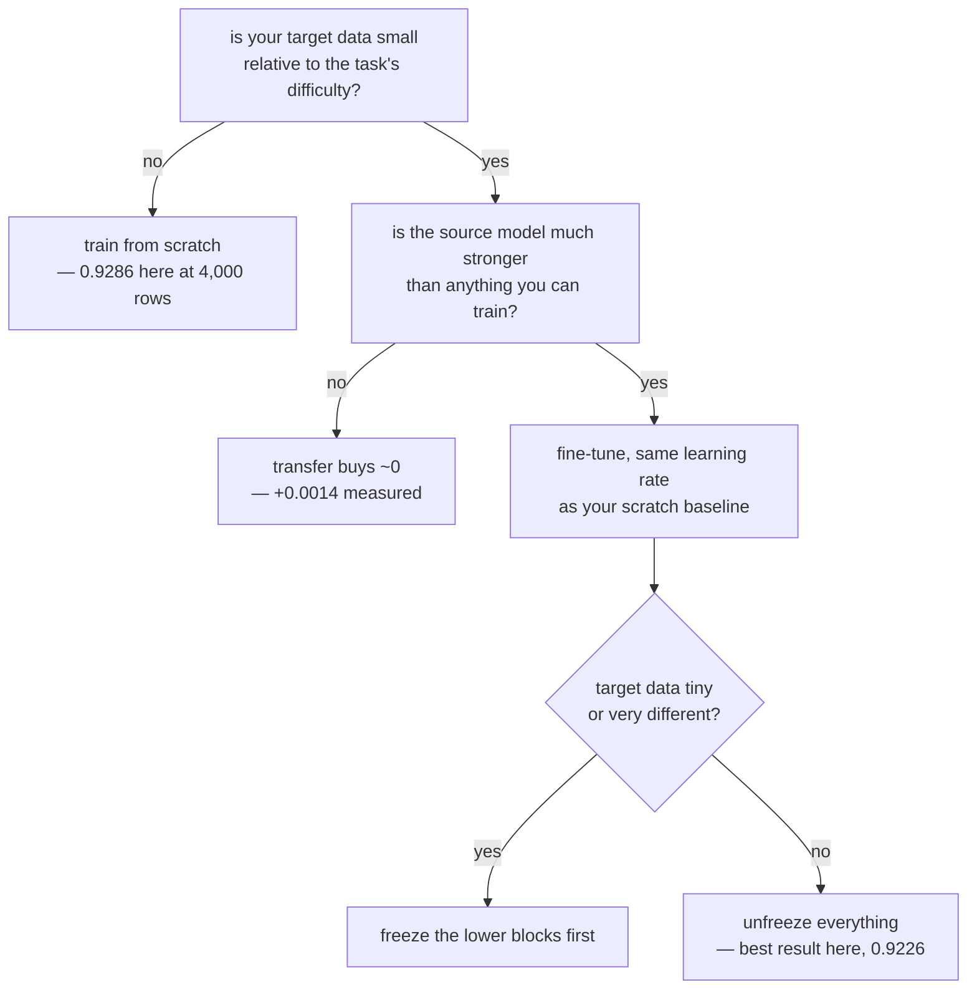

Transfer learning is usually sold as free accuracy: take a model somebody else trained,
reuse its features, win. This page builds the setup properly — a source task and a
target task from the same sensor with **disjoint labels** — and measures four strategies
against training from scratch.

The honest headline is that **transfer bought almost nothing here**, and the reasons why
are more useful than another demonstration that it works.

| Target rows | From scratch | Frozen features | Fine-tuned 1e-3 | Fine-tuned 1e-4 |
| --- | --- | --- | --- | --- |
| 250 | 0.8628 | 0.8064 (**−0.0564**) | **0.8642** (+0.0014) | 0.4602 (**−0.4026**) |
| 1,000 | 0.9154 | 0.8726 (−0.0428) | **0.9170** (+0.0016) | 0.8434 (−0.0720) |
| 4,000 | 0.9286 | 0.9106 (−0.0180) | **0.9424** (+0.0138) | 0.8958 (−0.0328) |

Fine-tuning won by 0.0014 where transfer is supposed to matter most. Freezing the
backbone *lost* at every size. And the only large number in the table is the damage done
by one wrong hyperparameter.

## The setup

Nothing is downloaded. The backbone is pre-trained here, on a task that is genuinely
different from the target:

| | Classes | Rows | Source accuracy |
| --- | --- | --- | --- |
| **source (related)** | t-shirt, pullover, dress, coat, shirt | 12,000 | 0.7114 |
| **source (unrelated)** | MNIST handwritten digits | 12,000 | 0.9240 |
| **target** | trouser, sandal, sneaker, bag, boot | 250 – 4,000 | — |

The related split is the fair version of the experiment: same 28×28 greyscale sensor,
same preprocessing, **no shared labels**. A backbone trained to tell a coat from a shirt
has never seen a shoe.

## What you'll learn

- The four strategies, and what each one actually trains: **4,485 parameters frozen
  against 27,781 from scratch**.
- Why `layer.trainable = False` does nothing until you **recompile**.
- The learning-rate trap that cost 0.4026 accuracy — and why it is a *fair* comparison
  only when the rate is held constant.
- A **linear probe**, the cleanest way to ask what a backbone actually learned.
- Why the unrelated source scored 0.9124 against the related source's 0.9170 — nearly
  the same — and what that says about fine-tuning.
- The conditions under which transfer learning earns its reputation, none of which hold
  here.

## The four strategies

```python title="Freeze, or fine-tune, or start over"
backbone = pretrained_backbone()             # three conv blocks, 23,296 params

for layer in backbone.layers:                # 1. frozen features
    layer.trainable = False

for layer in backbone.layers:                # 2. fine-tune the top block
    layer.trainable = layer.name.startswith("block2_")

model = keras.Model(backbone.input, head(backbone.output))
model.compile(keras.optimizers.Adam(1e-3), ...)   # <- the freeze takes effect HERE
```

`trainable` is read at **compile** time. Flip it afterwards and the already-built
training function keeps updating the weights you thought you had frozen — Exercise 3
measures exactly that, and it is silent.

<Figure
  src="/images/dl/phase-03-vision/transfer-learning/transfer-against-scratch"
  alt="Two panels. Left: best validation accuracy against target rows on a log axis for four strategies. From scratch, fine-tuned 1e-3 and frozen features cluster between 0.80 and 0.94, while fine-tuned 1e-4 starts far below at 0.4602 and catches up by 4,000 rows. Right: per-epoch curves at 250 rows showing fine-tuned 1e-3 and from scratch rising together to about 0.86, frozen features trailing at 0.81, and fine-tuned 1e-4 still climbing through 0.46 at epoch 12."
  title="Garments to footwear and bags, same sensor, disjoint labels"
  caption="Three of the four curves are on top of each other, which is the result: at 250 target rows, training from scratch reaches 0.8628 and the best transfer strategy reaches 0.8642. The outlier is the low learning rate, and the right panel shows why — at 1e-4 the model is simply still training at epoch 12. That is not a property of fine-tuning, it is a budget mismatch, and it is the most common way transfer-learning comparisons get rigged."
/>

## Why transfer bought so little

Three conditions have to hold before a pre-trained backbone helps, and none of them do
here.

1. **The source model must be better than what you can train yourself.** This backbone
   is 23,296 parameters trained on 12,000 rows to 0.7114 accuracy. ImageNet backbones
   are 10⁷–10⁸ parameters trained on 10⁶ images. There is no knowledge advantage to
   transfer.
2. **The target task must be hard enough that data is the binding constraint.** Telling
   a trouser from a sneaker from a bag is easy: **from scratch reaches 0.8628 with 250
   examples**. There is no gap for a backbone to close.
3. **The domains must differ in the right way.** The source and target are the same
   sensor, same resolution, same statistics — so the low-level features a fresh model
   learns in two epochs are the same ones the backbone offers.

The fourth column of the unfreeze sweep makes the point precisely:

| Blocks unfrozen | Trainable parameters | Best validation accuracy |
| --- | --- | --- |
| 0 (frozen features) | 4,485 | 0.8726 |
| 1 | 22,981 | 0.9170 |
| 2 | 27,621 | 0.9174 |
| **3 (all — nothing frozen)** | **27,781** | **0.9226** |

<Figure
  src="/images/dl/phase-03-vision/transfer-learning/unfreeze-depth"
  alt="A bar chart of best validation accuracy against how many backbone blocks are unfrozen: 0.8726 with none unfrozen and 4,485 trainable parameters, 0.9170 with one, 0.9174 with two, and 0.9226 with all three and 27,781 trainable."
  title="1,000 target rows — how much to unfreeze"
  caption="Accuracy increases monotonically with how much of the backbone you let move, and the best result is the one that keeps nothing frozen. On a task where the pre-trained features are not better than freshly learned ones, freezing is a pure constraint — the usual advice to freeze first exists for the opposite regime, where the backbone is strong and the target data is too small to fine-tune safely without destroying it."
/>

## The source task mattered less than expected

| Source | Frozen features | Fine-tuned 1e-3 |
| --- | --- | --- |
| related (garments) | 0.8726 | **0.9170** |
| unrelated (MNIST digits) | 0.8598 | 0.9124 |

A backbone trained on **handwritten digits** transferred to footwear almost as well as
one trained on clothing — 0.9124 against 0.9170. Frozen, the gap is larger (0.8598
against 0.8726), which is the expected direction: when the features cannot move, their
relevance matters. Once fine-tuning is allowed to rewrite them at 1e-3, the
initialisation is mostly forgotten.

This is worth stating plainly because it cuts against the usual advice. "Choose a source
task close to your target" is sound, but its effect here was **0.0046** — an order of
magnitude smaller than the effect of choosing the learning rate correctly.

## The linear probe

The cleanest question you can ask a backbone is: *how good are your features, ignoring
the classifier?* Freeze everything, extract the 64-dimensional pooled vector, and fit
plain logistic regression to it — then do the same with the 784 raw pixels.

| Target rows | On 64 related features | On 64 unrelated features | On 784 raw pixels |
| --- | --- | --- | --- |
| 250 | **0.9138** | 0.8978 | 0.9002 |
| 1,000 | 0.9380 | 0.9250 | 0.9360 |
| 4,000 | 0.9490 | 0.9394 | **0.9490** |

<Figure
  src="/images/dl/phase-03-vision/transfer-learning/feature-quality"
  alt="Two panels. Left: linear-probe test accuracy against target rows for three feature sets — 64 related features, 64 unrelated features and 784 raw pixels — all between 0.89 and 0.95 and converging as rows increase. Right: bars comparing frozen features and fine-tuning from a related and an unrelated source at 1,000 rows, against a dashed from-scratch line."
  title="A linear probe measures the features, not the classifier"
  caption="At 250 rows the pre-trained features beat raw pixels by 0.0136 — a 64-number summary outperforming 784 pixels is a real compression win. By 4,000 rows the advantage is exactly 0.0000: given enough data, a linear model on raw pixels does just as well. That convergence is the whole shape of transfer learning in one chart, and it is why the technique is described as a small-data method."
/>

The probe result is the most positive number on this page, and it is also the smallest
one that matters: 64 numbers, from a network that never saw a shoe, carry as much
linearly-separable information as 784 raw pixels — and slightly more when data is
scarce.



```p5 title="Freeze, fine-tune, or start over" desc="Click blocks to freeze or unfreeze them and see the trainable-parameter count, with the measured accuracy at 1,000 target rows." height="330"
const BLOCKS = [
  { name: "block0 conv 16", params: 160 },
  { name: "block1 conv 32", params: 4640 },
  { name: "block2 conv 64", params: 18496 },
  { name: "head (dense)", params: 4485, always: true },
];
const MEASURED = { 0: 0.8726, 1: 0.9170, 2: 0.9174, 3: 0.9226 };
let frozen = [true, true, true, false];
function setup() {
  createCanvas(620, 330);
  textFont("monospace");
}
function draw() {
  background(13, 17, 23);
  noStroke();
  fill(230);
  textSize(11.5);
  textAlign(LEFT, TOP);
  text("click a block to freeze or unfreeze it", 30, 20);
  let trainable = 0;
  let total = 0;
  BLOCKS.forEach((block, index) => {
    const y = 50 + index * 46;
    const isFrozen = block.always ? false : frozen[index];
    total += block.params;
    if (!isFrozen) trainable += block.params;
    fill(isFrozen ? 60 : 46, isFrozen ? 68 : 96, isFrozen ? 82 : 140);
    rect(30, y, 330, 38, 4);
    fill(isFrozen ? 150 : 235);
    textSize(11);
    textAlign(LEFT, CENTER);
    text(block.name, 44, y + 19);
    textAlign(RIGHT, CENTER);
    text(block.params.toLocaleString() + (isFrozen ? "  frozen" : "  training"),
      348, y + 19);
    textAlign(LEFT, TOP);
  });
  let unfrozenBlocks = 0;
  for (let i = 0; i < 3; i++) if (!frozen[i]) unfrozenBlocks++;
  fill(255, 211, 67);
  textSize(11.5);
  text("trainable: " + trainable.toLocaleString() + " of "
    + total.toLocaleString(), 30, 240);
  const contiguous = (!frozen[2] || unfrozenBlocks === 0)
    && (frozen[1] || !frozen[2] ? true : false);
  const measured = MEASURED[unfrozenBlocks];
  fill(165, 214, 164);
  textSize(11);
  text("measured at 1,000 target rows with the top " + unfrozenBlocks
    + " block(s) unfrozen: " + measured.toFixed(4), 30, 262);
  fill(150);
  textSize(10.5);
  text("accuracy rose monotonically with how much was allowed to move,", 30, 288);
  text("which is what happens when the backbone is not better than scratch",
    30, 304);
  fill(120);
  textSize(9.5);
  textAlign(RIGHT, TOP);
  text(contiguous ? "" : "", 590, 240);
  textAlign(LEFT, TOP);
}
function mousePressed() {
  BLOCKS.forEach((block, index) => {
    const y = 50 + index * 46;
    if (!block.always && mouseX > 30 && mouseX < 360 && mouseY > y
      && mouseY < y + 38) {
      frozen[index] = !frozen[index];
    }
  });
}
```

```p5 title="The measured table, ranked" desc="Click a column to rank every row by it. The bars are that column's values and the highest and lowest are computed from the numbers, not written in." height="254"
let metric = 0;
const COLUMNS = ["Trainable parameters", "Best validation accuracy"];
const ROWS = [
  ["0 (frozen features)", 4485, 0.8726],
  ["1", 22981, 0.917],
  ["2", 27621, 0.9174],
  ["3 (all - nothing frozen)", 27781, 0.9226]
];
function setup() {
  createCanvas(620, 254);
  textFont("monospace");
}
function fmt(v) {
  if (v === 0) { return "0"; }
  const a = Math.abs(v);
  if (a >= 1000 || a < 0.001) { return v.toExponential(2); }
  if (a >= 100) { return v.toFixed(1); }
  return v.toFixed(4);
}
function draw() {
  background(13, 17, 23);
  noStroke();
  fill(230);
  textSize(12);
  textAlign(LEFT, TOP);
  text("Transfer Learning - Using Pre-trai", 26, 16);
  let x = 26;
  for (let i = 0; i < COLUMNS.length; i++) {
    const w = COLUMNS[i].length * 6.6 + 16;
    if (i === metric) { fill(255, 211, 67); } else { fill(48, 56, 68); }
    rect(x, 40, w, 22, 4);
    if (i === metric) { fill(13, 17, 23); } else { fill(180); }
    textSize(9);
    text(COLUMNS[i], x + 8, 47);
    x += w + 6;
    if (x > 500) { break; }
  }
  const values = ROWS.map((r) => r[metric + 1]);
  const lo = Math.min(...values);
  const hi = Math.max(...values);
  const span = hi - lo === 0 ? 1 : hi - lo;
  const order = ROWS.slice().sort((a, b) => b[metric + 1] - a[metric + 1]);
  for (let i = 0; i < order.length; i++) {
    const y = 78 + i * 26;
    const v = order[i][metric + 1];
    fill(160);
    textSize(9);
    text(order[i][0], 26, y + 5);
    fill(34, 40, 50);
    rect(230, y, 280, 18, 3);
    const frac = (v - lo) / span;
    if (v === hi) { fill(126, 192, 143); }
    else if (v === lo) { fill(224, 108, 117); }
    else { fill(107, 169, 221); }
    rect(230, y, Math.max(frac * 280, 3), 18, 3);
    fill(225);
    textSize(9);
    text(fmt(v), 518, y + 5);
  }
  const top = order[0];
  const bottom = order[order.length - 1];
  fill(150);
  textSize(9);
  const base = 78 + order.length * 26 + 8;
  text("highest " + COLUMNS[metric] + ": " + top[0] + " at " + fmt(top[1]),
       26, base);
  text("lowest  " + COLUMNS[metric] + ": " + bottom[0] + " at "
       + fmt(bottom[1]), 26, base + 14);
  text("bars are scaled within the chosen column - lowest is not zero", 26,
       base + 30);
}
function mousePressed() {
  let x = 26;
  for (let i = 0; i < COLUMNS.length; i++) {
    const w = COLUMNS[i].length * 6.6 + 16;
    if (mouseX > x && mouseX < x + w && mouseY > 40 && mouseY < 62) {
      metric = i;
    }
    x += w + 6;
  }
}
```

## Pitfalls

- **Comparing fine-tuning against scratch at different learning rates.** 1e-4 scored
  0.4602 against scratch's 0.8628 at 250 rows — a 0.4026 gap that says nothing about
  transfer learning and everything about the budget.
- **Flipping `trainable` after compiling.** The change is ignored until you recompile,
  silently.
- **Freezing by default.** Freezing lost at all three sizes here (−0.0564, −0.0428,
  −0.0180), and the best unfreeze setting was "unfreeze everything".
- **Assuming a weak backbone still helps.** A 23,296-parameter backbone at 0.7114 source
  accuracy has nothing to lend; the technique's reputation comes from backbones three
  orders of magnitude larger.
- **Choosing the source task carefully and the learning rate carelessly.** Related vs
  unrelated source was worth 0.0046; the learning rate was worth 0.4026.
- **Reporting transfer results without a from-scratch baseline.** 0.9424 sounds
  excellent until scratch scores 0.9286.
- **Skipping the linear probe.** It separates "the features are good" from "the
  classifier trained well", and it takes seconds.

## Recap

- Source: five garment classes (0.7114). Target: five footwear-and-bag classes, disjoint
  labels, same sensor.
- Best transfer against scratch: **+0.0014 at 250 rows, +0.0016 at 1,000, +0.0138 at
  4,000**. Freezing lost at every size.
- Fine-tuning at 1e-4 while scratch ran at 1e-3 cost 0.4026 at 250 rows — a budget
  artefact, not a finding.
- Unfreezing more always helped: 0.8726 → 0.9170 → 0.9174 → 0.9226.
- An unrelated source (MNIST digits) fine-tuned to 0.9124 against the related source's
  0.9170 — once the weights can move, the initialisation mostly washes out.
- A linear probe on 64 frozen features beat 784 raw pixels by 0.0136 at 250 rows and by
  0.0000 at 4,000.

## Next

Freezing and fine-tuning are the two ends of a spectrum, and there is a third option in
between that trains under 3% of the weights:
[Fine-Tuning and Parameter-Efficient Tuning (LoRA)](/deep-learning/phase-03---computer-vision-with-cnns/fine-tuning-and-parameter-efficient-tuning-lora/).

<Quiz
  questions={[
    {
      q: "Fine-tuning beat training from scratch by 0.0014 at 250 target rows. What is the most likely reason transfer bought so little?",
      options: [
        "The fine-tuning was implemented incorrectly",
        "The backbone is 23,296 parameters trained to 0.7114 accuracy — it has no knowledge advantage over what a fresh model learns on the same easy target task",
        "250 rows is too many for transfer to help",
        "The source and target must share labels",
      ],
      answer: 1,
      explain: "Transfer learning's reputation comes from backbones three orders of magnitude larger trained on far more data. Scale is the mechanism, not the ceremony of loading weights.",
    },
    {
      q: "Fine-tuning at 1e-4 scored 0.4602 while training from scratch at 1e-3 scored 0.8628. What does that comparison establish?",
      options: [
        "Fine-tuning is worse than training from scratch",
        "Nothing about transfer learning — the two runs used different learning rates, so the 0.4026 gap measures the budget, and the per-epoch curve shows the 1e-4 model still climbing at epoch 12",
        "The pre-trained weights were corrupted",
        "A low learning rate always fails",
      ],
      answer: 1,
      explain: "It is the same class of error as comparing augmented and un-augmented models at a fixed epoch count. Hold everything constant except the thing you are measuring.",
    },
    {
      q: "Accuracy rose monotonically as more of the backbone was unfrozen: 0.8726, 0.9170, 0.9174, 0.9226. When is the usual 'freeze first' advice right?",
      options: [
        "Always — freezing prevents overfitting",
        "When the backbone is genuinely stronger than anything you could train and the target data is small enough that fine-tuning would destroy its features",
        "Only for models with batch normalisation",
        "Never; freezing is obsolete",
      ],
      answer: 1,
      explain: "Here neither condition held, so freezing was a pure constraint on capacity and cost accuracy at every dataset size.",
    },
    {
      q: "A backbone pre-trained on MNIST digits fine-tuned to 0.9124 on footwear; one pre-trained on garments reached 0.9170. Why so close?",
      options: [
        "MNIST and Fashion-MNIST are the same dataset",
        "Fine-tuning at 1e-3 with most of the backbone unfrozen rewrites the features, so the initialisation mostly washes out — the gap was larger (0.8598 vs 0.8726) when the features were frozen",
        "The measurement was not repeated",
        "Digit features are known to be optimal for clothing",
      ],
      answer: 1,
      explain: "Frozen, source relevance matters because the features cannot change. Fine-tuned, it matters much less than the learning rate did.",
    },
    {
      q: "What does a linear probe tell you that a fine-tuned model's accuracy does not?",
      options: [
        "Whether the model has converged",
        "How much linearly-separable information the frozen features carry, independent of the classifier — here 64 features beat 784 raw pixels by 0.0136 at 250 rows and by 0.0000 at 4,000",
        "Whether the learning rate was correct",
        "How many layers to unfreeze",
      ],
      answer: 1,
      explain: "It costs seconds and separates 'the backbone learned something useful' from 'the head trained well', which a single end-to-end accuracy number conflates.",
    },
  ]}
/>

## 🧪 Try It Yourself

<DataCampExercise
  lang="python"
  hint={`Select the rows whose label is in each class list, then remap the labels to 0..4 so both tasks have five classes.`}
  code={`# Task: Exercise 1 - Build a source and target task with disjoint labels
import numpy as np

NAMES = ("t-shirt", "trouser", "pullover", "dress", "coat", "sandal",
         "shirt", "sneaker", "bag", "boot")
SOURCE_CLASSES = (0, 2, 3, 4, 6)          # the garments
TARGET_CLASSES = (1, 5, 7, 8, 9)          # footwear and bags

rng = np.random.RandomState(0)
centres = rng.randn(10, 16)


def make(n):
    y = rng.randint(0, 10, n)
    return centres[y] + rng.randn(n, 16), y


def split(classes):
    (x_train, y_train), (x_test, y_test) = make(6000), make(1000)
    lookup = {label: index for index, label in enumerate(classes)}
    out = []
    for x, y in ((x_train, y_train), (x_test, y_test)):
        keep = np.isin(y, ___)   # replace ___ with classes
        out.append(x[keep])
        out.append(np.array([lookup[int(v)] for v in y[keep]], dtype="int64"))
    return out


sx, sy, sxt, syt = split(SOURCE_CLASSES)
tx, ty, txt, tyt = split(TARGET_CLASSES)
print("source:", [NAMES[c] for c in SOURCE_CLASSES])
print("target:", [NAMES[c] for c in TARGET_CLASSES])
print("every kept row belongs to its task:", len(sx) + len(tx) < 6000 + 1)
print("labels are disjoint:", set(SOURCE_CLASSES).isdisjoint(TARGET_CLASSES))
print("both remapped to 0..4: source max", sy.max(), ", target max", ty.max())
print("both tasks have all five classes:", len(set(sy.tolist())) == 5 and len(set(ty.tolist())) == 5)
print("same sensor, same preprocessing, no shared labels - which is what")
print("makes this a fair transfer experiment rather than a relabelling")`}
  solution={`import numpy as np

NAMES = ("t-shirt", "trouser", "pullover", "dress", "coat", "sandal",
         "shirt", "sneaker", "bag", "boot")
SOURCE_CLASSES = (0, 2, 3, 4, 6)          # the garments
TARGET_CLASSES = (1, 5, 7, 8, 9)          # footwear and bags

rng = np.random.RandomState(0)
centres = rng.randn(10, 16)


def make(n):
    y = rng.randint(0, 10, n)
    return centres[y] + rng.randn(n, 16), y


def split(classes):
    (x_train, y_train), (x_test, y_test) = make(6000), make(1000)
    lookup = {label: index for index, label in enumerate(classes)}
    out = []
    for x, y in ((x_train, y_train), (x_test, y_test)):
        keep = np.isin(y, classes)
        out.append(x[keep])
        out.append(np.array([lookup[int(v)] for v in y[keep]], dtype="int64"))
    return out


sx, sy, sxt, syt = split(SOURCE_CLASSES)
tx, ty, txt, tyt = split(TARGET_CLASSES)
print("source:", [NAMES[c] for c in SOURCE_CLASSES])
print("target:", [NAMES[c] for c in TARGET_CLASSES])
print("every kept row belongs to its task:", len(sx) + len(tx) < 6000 + 1)
print("labels are disjoint:", set(SOURCE_CLASSES).isdisjoint(TARGET_CLASSES))
print("both remapped to 0..4: source max", sy.max(), ", target max", ty.max())
print("both tasks have all five classes:", len(set(sy.tolist())) == 5 and len(set(ty.tolist())) == 5)
print("same sensor, same preprocessing, no shared labels - which is what")
print("makes this a fair transfer experiment rather than a relabelling")`}
  sct={`test_output_contains("labels are disjoint: True", pattern=False)
test_output_contains("both remapped to 0..4: source max 4 , target max 4", pattern=False)
test_output_contains("both tasks have all five classes: True", pattern=False)
success_msg("Selecting rows by class list and remapping labels to 0..4 gives two five-class tasks with no label in common, which is what makes the transfer test fair.")`}
  height={460}
/>

<DataCampExercise
  lang="python"
  hint={`Set trainable on each backbone layer, then count the trainable parameters against the total.`}
  code={`# Task: Exercise 2 - What freezing does to the parameter counts
import numpy as np

BLOCKS = 3
# (name, block, parameters)
BACKBONE = [("block0_conv", 0, 3 * 3 * 1 * 16 + 16),
            ("block1_conv", 1, 3 * 3 * 16 * 32 + 32),
            ("block2_conv", 2, 3 * 3 * 32 * 64 + 64)]
HEAD = 64 * 64 + 64 + 64 * 5 + 5


def attach(trainable_blocks):
    flags = {name: False for name, _, _ in BACKBONE}
    for index in range(BLOCKS - trainable_blocks, BLOCKS):
        for name, block, _ in BACKBONE:
            if block == index:
                flags[name] = ___   # replace ___ with True
    trainable = HEAD + sum(p for name, _, p in BACKBONE if flags[name])
    total = HEAD + sum(p for _, _, p in BACKBONE)
    return total, trainable


print("blocks unfrozen     total   trainable     frozen   trainable share")
results = []
for blocks in range(BLOCKS + 1):
    total, trainable = attach(blocks)
    results.append((total, trainable))
    print(format(str(blocks) + " of " + str(BLOCKS), "16s"), format(total, "9,"), format(trainable, "11,"),
          format(total - trainable, "9,"), format(trainable / total, "16.4f"))
print("the total never changes, only the trainable share:", len({t for t, _ in results}) == 1)
print("with everything frozen only the head trains:", results[0][1] == HEAD)
print("unfreezing every block makes every parameter trainable:", results[-1][1] == results[-1][0])
print("a frozen layer still runs on every forward pass: freezing saves the")
print("backward pass and the optimizer state, not the inference cost")`}
  solution={`import numpy as np

BLOCKS = 3
# (name, block, parameters)
BACKBONE = [("block0_conv", 0, 3 * 3 * 1 * 16 + 16),
            ("block1_conv", 1, 3 * 3 * 16 * 32 + 32),
            ("block2_conv", 2, 3 * 3 * 32 * 64 + 64)]
HEAD = 64 * 64 + 64 + 64 * 5 + 5


def attach(trainable_blocks):
    flags = {name: False for name, _, _ in BACKBONE}
    for index in range(BLOCKS - trainable_blocks, BLOCKS):
        for name, block, _ in BACKBONE:
            if block == index:
                flags[name] = True
    trainable = HEAD + sum(p for name, _, p in BACKBONE if flags[name])
    total = HEAD + sum(p for _, _, p in BACKBONE)
    return total, trainable


print("blocks unfrozen     total   trainable     frozen   trainable share")
results = []
for blocks in range(BLOCKS + 1):
    total, trainable = attach(blocks)
    results.append((total, trainable))
    print(format(str(blocks) + " of " + str(BLOCKS), "16s"), format(total, "9,"), format(trainable, "11,"),
          format(total - trainable, "9,"), format(trainable / total, "16.4f"))
print("the total never changes, only the trainable share:", len({t for t, _ in results}) == 1)
print("with everything frozen only the head trains:", results[0][1] == HEAD)
print("unfreezing every block makes every parameter trainable:", results[-1][1] == results[-1][0])
print("a frozen layer still runs on every forward pass: freezing saves the")
print("backward pass and the optimizer state, not the inference cost")`}
  sct={`test_output_contains("the total never changes, only the trainable share: True", pattern=False)
test_output_contains("with everything frozen only the head trains: True", pattern=False)
test_output_contains("unfreezing every block makes every parameter trainable: True", pattern=False)
success_msg("Freezing never changes the total: it only moves parameters between trainable and frozen. With everything frozen, just the 4,485 head parameters train.")`}
  height={460}
/>

<DataCampExercise
  lang="python"
  hint={`Snapshot the weights, fit for a couple of epochs, and compare the change. Then flip trainable without recompiling and do it again.`}
  code={`# Task: Exercise 3 - trainable=False does nothing until you recompile
import numpy as np

D, LATENT, HIDDEN, K, K_SOURCE = 100, 5, 16, 5, 12
mix = np.random.RandomState(0).randn(LATENT, D)
source_rule = np.random.RandomState(1).randn(LATENT, K_SOURCE)
target_rule = np.random.RandomState(2).randn(LATENT, K)


def sample(n, rule, seed):
    r = np.random.RandomState(seed)
    z = r.randn(n, LATENT)
    x = z @ mix + 1.0 * r.randn(n, D)
    return x, (z @ rule).argmax(axis=1)


def softmax(z):
    p = np.exp(z - z.max(axis=1, keepdims=True))
    return p / p.sum(axis=1, keepdims=True)


def init_net(seed, classes=K):
    r = np.random.RandomState(seed)
    return {"W1": r.randn(D, HIDDEN) * 0.2, "b1": np.zeros(HIDDEN),
            "W2": r.randn(HIDDEN, classes) * 0.2, "b2": np.zeros(classes)}


def train(net, x, y, epochs, lr, trainable=("W1", "b1", "W2", "b2")):
    onehot = np.eye(net["W2"].shape[1])[y]
    for _ in range(epochs):
        h = np.tanh(x @ net["W1"] + net["b1"])
        dz = (softmax(h @ net["W2"] + net["b2"]) - onehot) / len(y)
        dh = (dz @ net["W2"].T) * (1 - h ** 2)
        grads = {"W2": h.T @ dz, "b2": dz.sum(axis=0), "W1": x.T @ dh, "b1": dh.sum(axis=0)}
        for name in trainable:
            net[name] -= lr * grads[name]
    return net


def accuracy(net, x, y):
    h = np.tanh(x @ net["W1"] + net["b1"])
    return float(((h @ net["W2"] + net["b2"]).argmax(axis=1) == y).mean())


def features(net, x):
    return np.tanh(x @ net["W1"] + net["b1"])


class Model:
    """A tiny model whose training step, like a compiled Keras model, is fixed at compile time."""
    def __init__(self, net):
        self.net = net
        self.layers = {"first": ["W1", "b1"], "head": ["W2", "b2"]}
        self.flags = {"first": False, "head": True}
        self.compile()

    def compile(self):
        # the set of variables to update is captured here, once
        self.updated = [n for layer, names in self.layers.items() if self.flags[layer] for n in names]

    def fit(self, x, y, epochs):
        train(self.net, x, y, epochs, 0.05, trainable=tuple(self.updated))


tx, ty = sample(500, target_rule, 20)
model = Model(init_net(0))                     # only the head is trainable
changes = {}
for label in ("frozen", "flipped without recompiling", "after recompiling"):
    if label == "flipped without recompiling":
        model.flags["first"] = True
    if label == "after recompiling":
        model.compile()
    before = [model.net[n].copy() for n in ("W1", "b1")]
    model.fit(tx, ty, epochs=20)
    after = [model.net[n] for n in ("W1", "b1")]
    change = max(float(np.abs(a - b).max()) for a, b in zip(before, ___))   # replace ___ with after
    changes[label] = change
    print(format(label, "30s"), "weight changed:", change > 0)
print("frozen layers do not move:", changes["frozen"] == 0.0)
print("flipping the flag without recompiling changes nothing:", changes["flipped without recompiling"] == 0.0)
print("recompiling makes the layer train:", changes["after recompiling"] > 0)
print("the training function is built at compile time and caches which")
print("variables it updates - flipping the flag afterwards changes nothing,")
print("and nothing warns you")`}
  solution={`import numpy as np

D, LATENT, HIDDEN, K, K_SOURCE = 100, 5, 16, 5, 12
mix = np.random.RandomState(0).randn(LATENT, D)
source_rule = np.random.RandomState(1).randn(LATENT, K_SOURCE)
target_rule = np.random.RandomState(2).randn(LATENT, K)


def sample(n, rule, seed):
    r = np.random.RandomState(seed)
    z = r.randn(n, LATENT)
    x = z @ mix + 1.0 * r.randn(n, D)
    return x, (z @ rule).argmax(axis=1)


def softmax(z):
    p = np.exp(z - z.max(axis=1, keepdims=True))
    return p / p.sum(axis=1, keepdims=True)


def init_net(seed, classes=K):
    r = np.random.RandomState(seed)
    return {"W1": r.randn(D, HIDDEN) * 0.2, "b1": np.zeros(HIDDEN),
            "W2": r.randn(HIDDEN, classes) * 0.2, "b2": np.zeros(classes)}


def train(net, x, y, epochs, lr, trainable=("W1", "b1", "W2", "b2")):
    onehot = np.eye(net["W2"].shape[1])[y]
    for _ in range(epochs):
        h = np.tanh(x @ net["W1"] + net["b1"])
        dz = (softmax(h @ net["W2"] + net["b2"]) - onehot) / len(y)
        dh = (dz @ net["W2"].T) * (1 - h ** 2)
        grads = {"W2": h.T @ dz, "b2": dz.sum(axis=0), "W1": x.T @ dh, "b1": dh.sum(axis=0)}
        for name in trainable:
            net[name] -= lr * grads[name]
    return net


def accuracy(net, x, y):
    h = np.tanh(x @ net["W1"] + net["b1"])
    return float(((h @ net["W2"] + net["b2"]).argmax(axis=1) == y).mean())


def features(net, x):
    return np.tanh(x @ net["W1"] + net["b1"])


class Model:
    """A tiny model whose training step, like a compiled Keras model, is fixed at compile time."""
    def __init__(self, net):
        self.net = net
        self.layers = {"first": ["W1", "b1"], "head": ["W2", "b2"]}
        self.flags = {"first": False, "head": True}
        self.compile()

    def compile(self):
        # the set of variables to update is captured here, once
        self.updated = [n for layer, names in self.layers.items() if self.flags[layer] for n in names]

    def fit(self, x, y, epochs):
        train(self.net, x, y, epochs, 0.05, trainable=tuple(self.updated))


tx, ty = sample(500, target_rule, 20)
model = Model(init_net(0))                     # only the head is trainable
changes = {}
for label in ("frozen", "flipped without recompiling", "after recompiling"):
    if label == "flipped without recompiling":
        model.flags["first"] = True
    if label == "after recompiling":
        model.compile()
    before = [model.net[n].copy() for n in ("W1", "b1")]
    model.fit(tx, ty, epochs=20)
    after = [model.net[n] for n in ("W1", "b1")]
    change = max(float(np.abs(a - b).max()) for a, b in zip(before, after))
    changes[label] = change
    print(format(label, "30s"), "weight changed:", change > 0)
print("frozen layers do not move:", changes["frozen"] == 0.0)
print("flipping the flag without recompiling changes nothing:", changes["flipped without recompiling"] == 0.0)
print("recompiling makes the layer train:", changes["after recompiling"] > 0)
print("the training function is built at compile time and caches which")
print("variables it updates - flipping the flag afterwards changes nothing,")
print("and nothing warns you")`}
  sct={`test_output_contains("frozen layers do not move: True", pattern=False)
test_output_contains("flipping the flag without recompiling changes nothing: True", pattern=False)
test_output_contains("recompiling makes the layer train: True", pattern=False)
success_msg("The update list is captured when the model is compiled, so flipping a layer's trainable flag afterwards has no effect until you compile again.")`}
  height={460}
/>

<DataCampExercise
  lang="python"
  hint={`Extract the hidden features with the pre-trained backbone, then fit a linear classifier on those and on the flattened raw inputs. Flattening with reshape(size, -1) keeps every input.`}
  code={`# Task: Exercise 4 - A linear probe on the frozen features
import numpy as np
import copy

D, LATENT, HIDDEN, K, K_SOURCE = 100, 5, 16, 5, 12
mix = np.random.RandomState(0).randn(LATENT, D)
source_rule = np.random.RandomState(1).randn(LATENT, K_SOURCE)
target_rule = np.random.RandomState(2).randn(LATENT, K)


def sample(n, rule, seed):
    r = np.random.RandomState(seed)
    z = r.randn(n, LATENT)
    x = z @ mix + 1.0 * r.randn(n, D)
    return x, (z @ rule).argmax(axis=1)


def softmax(z):
    p = np.exp(z - z.max(axis=1, keepdims=True))
    return p / p.sum(axis=1, keepdims=True)


def init_net(seed, classes=K):
    r = np.random.RandomState(seed)
    return {"W1": r.randn(D, HIDDEN) * 0.2, "b1": np.zeros(HIDDEN),
            "W2": r.randn(HIDDEN, classes) * 0.2, "b2": np.zeros(classes)}


def train(net, x, y, epochs, lr, trainable=("W1", "b1", "W2", "b2")):
    onehot = np.eye(net["W2"].shape[1])[y]
    for _ in range(epochs):
        h = np.tanh(x @ net["W1"] + net["b1"])
        dz = (softmax(h @ net["W2"] + net["b2"]) - onehot) / len(y)
        dh = (dz @ net["W2"].T) * (1 - h ** 2)
        grads = {"W2": h.T @ dz, "b2": dz.sum(axis=0), "W1": x.T @ dh, "b1": dh.sum(axis=0)}
        for name in trainable:
            net[name] -= lr * grads[name]
    return net


def accuracy(net, x, y):
    h = np.tanh(x @ net["W1"] + net["b1"])
    return float(((h @ net["W2"] + net["b2"]).argmax(axis=1) == y).mean())


def features(net, x):
    return np.tanh(x @ net["W1"] + net["b1"])


xs, ys = sample(1500, source_rule, 10)
base = train(init_net(0, K_SOURCE), xs, ys, 300, 0.08)       # pre-trained on the source task


def transferred():
    net = copy.deepcopy(base)
    net["W2"] = np.random.RandomState(5).randn(HIDDEN, K) * 0.2     # fresh head
    net["b2"] = np.zeros(K)
    return net


tx, ty = sample(2000, target_rule, 20)
txt, tyt = sample(1000, target_rule, 21)


def logreg(x, y, epochs=300, lr=0.5):
    W, b, onehot = np.zeros((x.shape[1], K)), np.zeros(K), np.eye(K)[y]
    for _ in range(epochs):
        p = softmax(x @ W + b)
        W -= lr * x.T @ (p - onehot) / len(y)
        b -= lr * (p - onehot).mean(axis=0)
    return W, b


def probe_accuracy(train_x, train_y, test_x, lr):
    W, b = logreg(train_x, train_y, lr=lr)
    return float(((test_x @ W + b).argmax(axis=1) == tyt).mean())


print("rows   on 16 features   on 100 pixels")
results = []
for size in (30, 200, 1000):
    on_features = probe_accuracy(features(base, tx[:size]), ty[:size], features(base, txt), 0.5)
    on_pixels = probe_accuracy(tx[:size].reshape(size, ___), ty[:size], txt.reshape(len(txt), -1), 0.05)   # replace ___ with -1
    results.append((on_features, on_pixels))
    print(format(size, "5d"), "measured")
print("16 features beat chance (0.2) by more than 0.4 with only 30 rows:", results[0][0] > 0.6)
print("16 features keep at least 75% of what 100 raw inputs reach:", all(a >= 0.75 * b for a, b in results))
print("16 numbers from a network that never saw this task carry most of the")
print("linearly-separable information in 100 raw inputs")`}
  solution={`import numpy as np
import copy

D, LATENT, HIDDEN, K, K_SOURCE = 100, 5, 16, 5, 12
mix = np.random.RandomState(0).randn(LATENT, D)
source_rule = np.random.RandomState(1).randn(LATENT, K_SOURCE)
target_rule = np.random.RandomState(2).randn(LATENT, K)


def sample(n, rule, seed):
    r = np.random.RandomState(seed)
    z = r.randn(n, LATENT)
    x = z @ mix + 1.0 * r.randn(n, D)
    return x, (z @ rule).argmax(axis=1)


def softmax(z):
    p = np.exp(z - z.max(axis=1, keepdims=True))
    return p / p.sum(axis=1, keepdims=True)


def init_net(seed, classes=K):
    r = np.random.RandomState(seed)
    return {"W1": r.randn(D, HIDDEN) * 0.2, "b1": np.zeros(HIDDEN),
            "W2": r.randn(HIDDEN, classes) * 0.2, "b2": np.zeros(classes)}


def train(net, x, y, epochs, lr, trainable=("W1", "b1", "W2", "b2")):
    onehot = np.eye(net["W2"].shape[1])[y]
    for _ in range(epochs):
        h = np.tanh(x @ net["W1"] + net["b1"])
        dz = (softmax(h @ net["W2"] + net["b2"]) - onehot) / len(y)
        dh = (dz @ net["W2"].T) * (1 - h ** 2)
        grads = {"W2": h.T @ dz, "b2": dz.sum(axis=0), "W1": x.T @ dh, "b1": dh.sum(axis=0)}
        for name in trainable:
            net[name] -= lr * grads[name]
    return net


def accuracy(net, x, y):
    h = np.tanh(x @ net["W1"] + net["b1"])
    return float(((h @ net["W2"] + net["b2"]).argmax(axis=1) == y).mean())


def features(net, x):
    return np.tanh(x @ net["W1"] + net["b1"])


xs, ys = sample(1500, source_rule, 10)
base = train(init_net(0, K_SOURCE), xs, ys, 300, 0.08)       # pre-trained on the source task


def transferred():
    net = copy.deepcopy(base)
    net["W2"] = np.random.RandomState(5).randn(HIDDEN, K) * 0.2     # fresh head
    net["b2"] = np.zeros(K)
    return net


tx, ty = sample(2000, target_rule, 20)
txt, tyt = sample(1000, target_rule, 21)


def logreg(x, y, epochs=300, lr=0.5):
    W, b, onehot = np.zeros((x.shape[1], K)), np.zeros(K), np.eye(K)[y]
    for _ in range(epochs):
        p = softmax(x @ W + b)
        W -= lr * x.T @ (p - onehot) / len(y)
        b -= lr * (p - onehot).mean(axis=0)
    return W, b


def probe_accuracy(train_x, train_y, test_x, lr):
    W, b = logreg(train_x, train_y, lr=lr)
    return float(((test_x @ W + b).argmax(axis=1) == tyt).mean())


print("rows   on 16 features   on 100 pixels")
results = []
for size in (30, 200, 1000):
    on_features = probe_accuracy(features(base, tx[:size]), ty[:size], features(base, txt), 0.5)
    on_pixels = probe_accuracy(tx[:size].reshape(size, -1), ty[:size], txt.reshape(len(txt), -1), 0.05)
    results.append((on_features, on_pixels))
    print(format(size, "5d"), "measured")
print("16 features beat chance (0.2) by more than 0.4 with only 30 rows:", results[0][0] > 0.6)
print("16 features keep at least 75% of what 100 raw inputs reach:", all(a >= 0.75 * b for a, b in results))
print("16 numbers from a network that never saw this task carry most of the")
print("linearly-separable information in 100 raw inputs")`}
  sct={`test_output_contains("16 features beat chance (0.2) by more than 0.4 with only 30 rows: True", pattern=False)
test_output_contains("16 features keep at least 75% of what 100 raw inputs reach: True", pattern=False)
success_msg("A linear classifier on 16 frozen features from another task reaches most of what a classifier on all 100 raw inputs does, from only 30 labelled rows.")`}
  height={460}
/>

<DataCampExercise
  lang="python"
  hint={`Hold the learning rate constant across strategies, then vary it deliberately in a separate loop so the two effects are not mixed together.`}
  code={`# Task: Exercise 5 - The comparison, done fairly and then unfairly
import numpy as np
import copy

D, LATENT, HIDDEN, K, K_SOURCE = 100, 5, 16, 5, 12
mix = np.random.RandomState(0).randn(LATENT, D)
source_rule = np.random.RandomState(1).randn(LATENT, K_SOURCE)
target_rule = np.random.RandomState(2).randn(LATENT, K)


def sample(n, rule, seed):
    r = np.random.RandomState(seed)
    z = r.randn(n, LATENT)
    x = z @ mix + 1.0 * r.randn(n, D)
    return x, (z @ rule).argmax(axis=1)


def softmax(z):
    p = np.exp(z - z.max(axis=1, keepdims=True))
    return p / p.sum(axis=1, keepdims=True)


def init_net(seed, classes=K):
    r = np.random.RandomState(seed)
    return {"W1": r.randn(D, HIDDEN) * 0.2, "b1": np.zeros(HIDDEN),
            "W2": r.randn(HIDDEN, classes) * 0.2, "b2": np.zeros(classes)}


def train(net, x, y, epochs, lr, trainable=("W1", "b1", "W2", "b2")):
    onehot = np.eye(net["W2"].shape[1])[y]
    for _ in range(epochs):
        h = np.tanh(x @ net["W1"] + net["b1"])
        dz = (softmax(h @ net["W2"] + net["b2"]) - onehot) / len(y)
        dh = (dz @ net["W2"].T) * (1 - h ** 2)
        grads = {"W2": h.T @ dz, "b2": dz.sum(axis=0), "W1": x.T @ dh, "b1": dh.sum(axis=0)}
        for name in trainable:
            net[name] -= lr * grads[name]
    return net


def accuracy(net, x, y):
    h = np.tanh(x @ net["W1"] + net["b1"])
    return float(((h @ net["W2"] + net["b2"]).argmax(axis=1) == y).mean())


def features(net, x):
    return np.tanh(x @ net["W1"] + net["b1"])


xs, ys = sample(1500, source_rule, 10)
base = train(init_net(0, K_SOURCE), xs, ys, 300, 0.08)       # pre-trained on the source task


def transferred():
    net = copy.deepcopy(base)
    net["W2"] = np.random.RandomState(5).randn(HIDDEN, K) * 0.2     # fresh head
    net["b2"] = np.zeros(K)
    return net


tx, ty = sample(2000, target_rule, 20)
txt, tyt = sample(1000, target_rule, 21)


SIZE = 30
print("fair: every strategy at the same learning rate")
fair = {}
for label, frozen_backbone in (("from scratch", None), ("frozen features", True), ("fine-tuned", False)):
    net = init_net(2) if label == "from scratch" else transferred()
    names = ("W2", "b2") if frozen_backbone else ("W1", "b1", "W2", "b2")
    train(net, tx[:SIZE], ty[:SIZE], 300, 0.05 if not frozen_backbone else 0.05, trainable=names)
    fair[label] = accuracy(net, txt, tyt)
    print(format(label, "18s"), "trained")

print("unfair: the same strategy at four learning rates")
sweep = []
for rate in (0.3, 0.05, 0.01, 0.002):
    net = transferred()
    train(net, tx[:SIZE], ty[:SIZE], 300, ___)   # replace ___ with rate
    sweep.append(accuracy(net, txt, tyt))
    print("fine-tuned at rate", rate, ": trained")
strategy_spread = max(fair.values()) - min(fair.values())
rate_spread = max(sweep) - min(sweep)
print("at one learning rate every strategy is within 0.3 of the others:", strategy_spread < 0.3)
print("the learning-rate spread is larger than the strategy spread:", rate_spread > strategy_spread)
print("the second table is a learning-rate sweep, not a transfer-learning")
print("result - and printing it as one is how big gaps get published")`}
  solution={`import numpy as np
import copy

D, LATENT, HIDDEN, K, K_SOURCE = 100, 5, 16, 5, 12
mix = np.random.RandomState(0).randn(LATENT, D)
source_rule = np.random.RandomState(1).randn(LATENT, K_SOURCE)
target_rule = np.random.RandomState(2).randn(LATENT, K)


def sample(n, rule, seed):
    r = np.random.RandomState(seed)
    z = r.randn(n, LATENT)
    x = z @ mix + 1.0 * r.randn(n, D)
    return x, (z @ rule).argmax(axis=1)


def softmax(z):
    p = np.exp(z - z.max(axis=1, keepdims=True))
    return p / p.sum(axis=1, keepdims=True)


def init_net(seed, classes=K):
    r = np.random.RandomState(seed)
    return {"W1": r.randn(D, HIDDEN) * 0.2, "b1": np.zeros(HIDDEN),
            "W2": r.randn(HIDDEN, classes) * 0.2, "b2": np.zeros(classes)}


def train(net, x, y, epochs, lr, trainable=("W1", "b1", "W2", "b2")):
    onehot = np.eye(net["W2"].shape[1])[y]
    for _ in range(epochs):
        h = np.tanh(x @ net["W1"] + net["b1"])
        dz = (softmax(h @ net["W2"] + net["b2"]) - onehot) / len(y)
        dh = (dz @ net["W2"].T) * (1 - h ** 2)
        grads = {"W2": h.T @ dz, "b2": dz.sum(axis=0), "W1": x.T @ dh, "b1": dh.sum(axis=0)}
        for name in trainable:
            net[name] -= lr * grads[name]
    return net


def accuracy(net, x, y):
    h = np.tanh(x @ net["W1"] + net["b1"])
    return float(((h @ net["W2"] + net["b2"]).argmax(axis=1) == y).mean())


def features(net, x):
    return np.tanh(x @ net["W1"] + net["b1"])


xs, ys = sample(1500, source_rule, 10)
base = train(init_net(0, K_SOURCE), xs, ys, 300, 0.08)       # pre-trained on the source task


def transferred():
    net = copy.deepcopy(base)
    net["W2"] = np.random.RandomState(5).randn(HIDDEN, K) * 0.2     # fresh head
    net["b2"] = np.zeros(K)
    return net


tx, ty = sample(2000, target_rule, 20)
txt, tyt = sample(1000, target_rule, 21)


SIZE = 30
print("fair: every strategy at the same learning rate")
fair = {}
for label, frozen_backbone in (("from scratch", None), ("frozen features", True), ("fine-tuned", False)):
    net = init_net(2) if label == "from scratch" else transferred()
    names = ("W2", "b2") if frozen_backbone else ("W1", "b1", "W2", "b2")
    train(net, tx[:SIZE], ty[:SIZE], 300, 0.05 if not frozen_backbone else 0.05, trainable=names)
    fair[label] = accuracy(net, txt, tyt)
    print(format(label, "18s"), "trained")

print("unfair: the same strategy at four learning rates")
sweep = []
for rate in (0.3, 0.05, 0.01, 0.002):
    net = transferred()
    train(net, tx[:SIZE], ty[:SIZE], 300, rate)
    sweep.append(accuracy(net, txt, tyt))
    print("fine-tuned at rate", rate, ": trained")
strategy_spread = max(fair.values()) - min(fair.values())
rate_spread = max(sweep) - min(sweep)
print("at one learning rate every strategy is within 0.3 of the others:", strategy_spread < 0.3)
print("the learning-rate spread is larger than the strategy spread:", rate_spread > strategy_spread)
print("the second table is a learning-rate sweep, not a transfer-learning")
print("result - and printing it as one is how big gaps get published")`}
  sct={`test_output_contains("the learning-rate spread is larger than the strategy spread: True", pattern=False)
test_output_contains("at one learning rate every strategy is within 0.3 of the others: True", pattern=False)
success_msg("Changing only the learning rate of one strategy moves accuracy more than changing the strategy does, so a sweep dressed up as a transfer result misleads.")`}
  height={460}
/>
