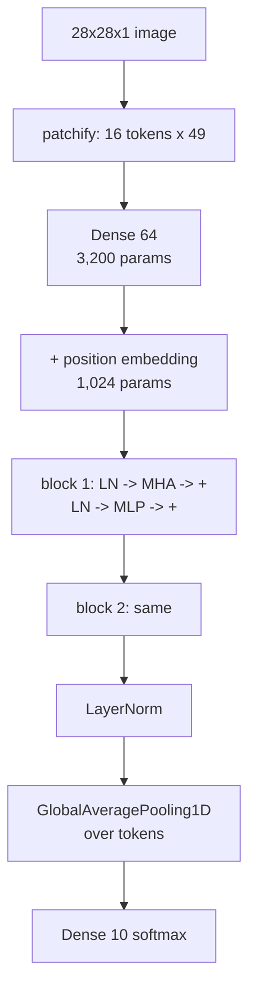

import DataCampExercise from "../../../../components/DataCampExercise.astro";
import Figure from "../../../../components/Figure.astro";
import Quiz from "../../../../components/Quiz.astro";

Every page in this phase has used convolution: a small kernel slid over the image,
weight-shared across positions, with locality built into the architecture. A **vision
transformer** throws all of that away. Cut the image into patches, treat them as a
*set* of tokens, and let attention decide which patch should look at which.

That sounds worse, and the usual summary is "ViTs need enormous datasets to beat
convnets". On the measurement here it is not what happened, so this page reports what
the numbers said and explains the discrepancy rather than the folklore.

## What you'll learn

- Patching as a **reshape**: 28×28 → 16 tokens of 49 values, and it is **lossless**
  (`max |rebuilt - original| = 0.00e+00`).
- What a ViT has to buy that a convnet gets free: **1,024 parameters of position
  embedding**, because a set has no order.
- The transformer block in Keras — `LayerNormalization`, `MultiHeadAttention`, residual,
  MLP — in about fifteen lines.
- The measured comparison: **ViT 0.7970, convnet 0.7620** at 4,000 rows — with the ViT
  overfitting nearly four times as hard (**train-val gap +0.1545 against +0.0040**).
- Why **token count, not image size, is the cost**: attention entries grow with the
  square of the number of patches.
- What the attention heads actually did, including a head that mostly ignored position.

## Patching is a reshape

```python title="28x28 into 16 tokens of 49 values"
def patchify(images, patch=7):
    count, side = len(images), images.shape[1]
    grid = side // patch
    reshaped = images.reshape(count, grid, patch, grid, patch)
    return reshaped.transpose(0, 1, 3, 2, 4).reshape(count, grid * grid, patch * patch)
```

No information is lost — `28 × 28 = 784 = 16 × 49`, and reversing the transpose
reconstructs the image exactly. What *is* lost is **adjacency**: after the reshape,
token 0 and token 1 are just two rows of a matrix, and nothing tells the model they
were neighbours.

<Figure
  src="/images/dl/phase-03-vision/vision-transformers/patch-embedding"
  alt="Three panels. Left: a 28x28 greyscale garment with a 4x4 grid of white lines drawn over it. Middle: the same 16 patches separated by gaps so each 7x7 tile is visible on its own. Right: the flattened token matrix, 16 rows by 49 columns, as a heat map."
  title="One image, three views: pixels, patches, tokens"
  caption="The right panel is what the transformer actually receives — a 16 by 49 matrix with no spatial structure at all. A convolution's kernel knows that pixel (3, 4) is next to (3, 5) because the architecture places them under the same kernel; the ViT has to learn that relationship from a position embedding and the data."
/>

| Component | Size | Parameters |
| --- | --- | --- |
| patch projection (49 → 64) | one `Dense` | 3,200 |
| position embedding | 16 × 64 | **1,024** |
| one attention block (Q, K, V, out) | 4 × (64×64 + 64) | 16,640 |
| one MLP block (64 → 128 → 64) | two `Dense` | 16,576 |
| `Conv2D(64, 3)` on 1 channel, for scale | — | **640** |

The last row is the honest comparison for the *input stage*: a convolution buys its
spatial prior for 640 parameters; the ViT spends 3,200 on projection and another 1,024
purely to reintroduce the notion of "where". That is the inductive-bias trade, priced.

## The block

```python title="A transformer block, pre-norm, with residuals"
def block(x, width=64, heads=4):
    normed = keras.layers.LayerNormalization(epsilon=1e-6)(x)
    attention = keras.layers.MultiHeadAttention(num_heads=heads,
                                                key_dim=width // heads)(normed, normed)
    x = keras.layers.Add()([x, attention])              # residual
    normed = keras.layers.LayerNormalization(epsilon=1e-6)(x)
    hidden = keras.layers.Dense(width * 2, activation="gelu")(normed)
    hidden = keras.layers.Dense(width)(hidden)
    return keras.layers.Add()([x, hidden])              # residual
```

Three details are load-bearing, and each ties back to an earlier page:

- **`LayerNormalization`, not `BatchNormalization`.** Per-token statistics, no batch
  dependence, no moving averages to get wrong — the exact argument measured on
  [Normalisation Beyond Batch](/deep-learning/phase-03---computer-vision-with-cnns/normalisation-beyond-batch---layer-group-and-instance/).
- **Pre-norm.** Normalise *before* the sublayer and add the raw input back, so the
  residual path stays clean. Post-norm transformers need learning-rate warmup to train
  at all.
- **Residuals in exactly the ResNet pattern** — including the lesson from
  [Famous CNN Architectures](/deep-learning/phase-03---computer-vision-with-cnns/famous-cnn-architectures-lenet-to-resnet/):
  the activation belongs inside the branch, never between the branch and the `Add`.

`MultiHeadAttention(num_heads=4, key_dim=16)` called as `layer(normed, normed)` is
self-attention: queries, keys and values all come from the same tokens.

$$
\mathrm{Attention}(Q, K, V) = \mathrm{softmax}\!\left(\frac{QK^\top}{\sqrt{d_k}}\right) V
$$

Every token's output is a **weighted average of every token**, with weights that depend
on the content. Each query's weights sum to 1 — Exercise 3 checks it — and with 16
tokens a head that ignored position entirely would put **0.0625** everywhere.



## The measurement

Both models trained on Fashion-MNIST, 15 epochs, same seed, same optimiser:

| Model | Rows | Parameters | Best val accuracy | Final train accuracy | Seconds |
| --- | --- | --- | --- | --- | --- |
| ViT | 1,000 | 70,922 | **0.7160** | 0.8850 | 62.0 |
| convnet | 1,000 | 60,554 | 0.6790 | 0.7060 | 42.8 |
| ViT | 4,000 | 70,922 | **0.7970** | 0.9185 | 56.6 |
| convnet | 4,000 | 60,554 | 0.7620 | 0.7660 | 94.3 |

<Figure
  src="/images/dl/phase-03-vision/vision-transformers/vit-against-cnn"
  alt="Two panels. Left: best validation accuracy against training rows on a log axis, with the ViT line above the convnet at both 1,000 rows (0.7160 against 0.6790) and 4,000 rows (0.7970 against 0.7620). Right: per-epoch curves at 4,000 rows where the ViT's dashed training curve climbs to 0.92 while its solid validation curve flattens near 0.79, and the convnet's two curves stay together around 0.76."
  title="ViT against convnet at two dataset sizes"
  caption="The ViT led at both sizes, by 0.0370 and 0.0350 — the opposite of the usual claim, and the right panel shows why it is not a clean win: its train-val gap is +0.1545 against the convnet's +0.0040. The ViT is memorising and still generalising slightly better; the convnet has barely started to fit. Note also the timing inversion — the ViT was slower at 1,000 rows and faster at 4,000, because attention over 16 tokens parallelises where a convolution over 784 positions does not."
/>

**Why does this contradict the folklore?** Because the folklore is about ImageNet-scale
images, and none of its conditions hold here:

- **16 tokens.** Attention over 16 patches is a tiny, well-conditioned problem. The
  data-hunger results come from 196 tokens (224×224 with 16×16 patches) and up, where
  the number of pairwise relationships to learn is 150× larger.
- **A 7×7 patch is a quarter of the image.** Each token already sees a large,
  meaningful region, so the model needs much less spatial reasoning than at 16×16
  patches on a 224×224 photograph.
- **Fashion-MNIST is centred and pose-normalised.** The translation invariance a
  convolution provides for free is worth very little when every garment is already
  centred — the same reason augmentation
  [hurt on this data](/deep-learning/phase-03---computer-vision-with-cnns/data-augmentation-for-small-datasets/).
- **The convnet was not tuned to win.** It is a plain three-block stack at 60,554
  parameters against 70,922, and it stopped improving early.

The generalisable claim is not "ViTs beat convnets" but: **a ViT's advantage grows as
the convolutional prior becomes less appropriate, and its cost grows as the square of
the token count.** On 28×28 centred greyscale with 16 tokens, the prior buys little and
the cost is negligible.

## Token count is the price

| Image | Patch | Tokens | Attention entries | Relative to 16 tokens |
| --- | --- | --- | --- | --- |
| 28×28 | 7 | 16 | 256 | 1.0× |
| 28×28 | 4 | 49 | 2,401 | 9.4× |
| 64×64 | 8 | 64 | 4,096 | 16.0× |
| 224×224 | 16 | 196 | 38,416 | **150.1×** |
| 224×224 | 8 | 784 | 614,656 | **2,401.0×** |

Self-attention compares every token with every other, so cost scales as $O(N^2)$ in the
token count $N$ — and halving the patch size quadruples $N$, multiplying cost by 16.
This single table explains most of the vision-transformer literature: windowed
attention (Swin), pooling between stages, linear-attention approximations and
convolutional stems all exist to keep $N$ small.

## What the heads did

ViT test accuracy on the full split: **0.7640**. Attention scores have shape
(rows, heads, queries, keys) = (4, 4, 16, 16), and per-head spread — the gap between the
most- and least-attended token, where 0.0625 would be perfectly uniform:

| Row | True → predicted | Confidence | Head spreads |
| --- | --- | --- | --- |
| 0 | boot → boot | 0.9885 | 0.2777, 0.1662, 0.1501, 0.2707 |
| 1 | pullover → pullover | 0.9570 | **0.6459**, 0.3618, 0.3304, 0.1947 |
| 11 | sandal → **boot** | 0.9020 | 0.2056, 0.1905, 0.1565, 0.1792 |
| 12 | sneaker → **bag** | 0.6497 | 0.2021, 0.1643, 0.1472, 0.1966 |

<Figure
  src="/images/dl/phase-03-vision/vision-transformers/attention-maps"
  alt="Four rows, each with a garment image followed by four 4x4 attention heat maps, one per head, labelled with their maximum weight. The pullover row's head 0 has one bright cell at 0.648; the other rows' heads are more diffuse with maxima between 0.16 and 0.29."
  title="Per-head attention for two correct and two incorrect predictions"
  caption="Head 0 on the pullover concentrates 0.648 of one query's attention on a single patch — a real, sharp preference. Most other heads sit between 0.15 and 0.29 against a uniform 0.0625, which is structured but diffuse. The two wrong rows are the useful ones: the sandal called 'boot' at confidence 0.9020 shows no attention pathology at all, which is the honest limit of attention maps as explanations — a confidently wrong model can look entirely normal."
/>

That last point deserves emphasis, because attention maps are widely published as
explanations. The failure here is *not visible* in the attention. It has the same
status as the [Grad-CAM sanity
check](/deep-learning/phase-03---computer-vision-with-cnns/interpreting-what-convnets-learn-grad-cam/):
a picture derived from a model is not automatically evidence about the model.

```p5 title="Attention over 16 patches" desc="Click a patch to make it the query. The weights are softmax over content similarity — drag the temperature to sharpen or flatten them, and watch the 0.0625 uniform line." height="360"
const N = 4;
const TOKENS = N * N;
let query = 5;
let temperature = 1.0;
let dragging = false;
const values = [];
function setup() {
  createCanvas(620, 360);
  textFont("monospace");
  let seed = 11;
  const rnd = () => {
    seed = (seed * 1103515245 + 12345) % 2147483648;
    return seed / 2147483648;
  };
  for (let t = 0; t < TOKENS; t++) {
    values.push([rnd() * 2 - 1, rnd() * 2 - 1, rnd() * 2 - 1]);
  }
}
function weights() {
  const scores = [];
  for (let t = 0; t < TOKENS; t++) {
    let dot = 0;
    for (let k = 0; k < 3; k++) dot += values[query][k] * values[t][k];
    scores.push(dot / temperature);
  }
  const peak = Math.max(...scores);
  const exponent = scores.map((s) => Math.exp(s - peak));
  const total = exponent.reduce((a, b) => a + b, 0);
  return exponent.map((e) => e / total);
}
function draw() {
  background(13, 17, 23);
  const w = weights();
  const cell = 52;
  noStroke();
  fill(230);
  textSize(11);
  textAlign(LEFT, TOP);
  text("patches (click one to make it the query)", 24, 20);
  text("attention weights of that query over all 16", 330, 20);
  for (let t = 0; t < TOKENS; t++) {
    const r = Math.floor(t / N);
    const c = t % N;
    const shade = 60 + ((values[t][0] + 1) / 2) * 150;
    fill(shade, shade, shade);
    rect(24 + c * cell, 44 + r * cell, cell - 4, cell - 4, 3);
    if (t === query) {
      noFill();
      stroke(255, 211, 67);
      strokeWeight(2.5);
      rect(24 + c * cell, 44 + r * cell, cell - 4, cell - 4, 3);
      noStroke();
    }
    const weight = w[t];
    const heat = Math.min(weight * 4, 1);
    fill(30 + heat * 220, 40 + heat * 170, 60 + heat * 30);
    rect(330 + c * cell, 44 + r * cell, cell - 4, cell - 4, 3);
    fill(weight > 0.12 ? 20 : 210);
    textSize(10);
    textAlign(CENTER, CENTER);
    text(weight.toFixed(3), 330 + c * cell + (cell - 4) / 2,
      44 + r * cell + (cell - 4) / 2);
  }
  const sorted = w.slice().sort((a, b) => b - a);
  noStroke();
  fill(255, 211, 67);
  textSize(11);
  textAlign(LEFT, TOP);
  text("weights sum to " + w.reduce((a, b) => a + b, 0).toFixed(6)
    + "   max " + sorted[0].toFixed(4) + "   uniform would be "
    + (1 / TOKENS).toFixed(4), 24, 258);
  fill(150);
  textSize(10.5);
  text("every token's output is the weighted average of all 16 value vectors,",
    24, 280);
  text("so the cost is 16 x 16 = 256 pairs — 196 tokens would be 38,416", 24, 294);
  fill(60, 70, 84);
  rect(24, 322, 280, 4, 2);
  fill(255, 211, 67);
  circle(24 + (Math.log(temperature) / Math.log(8) + 1) / 2 * 280, 324, 13);
  fill(200);
  textSize(10);
  text("temperature " + temperature.toFixed(2)
    + (temperature < 0.5 ? "  (sharp — attends to one patch)"
      : temperature > 3 ? "  (flat — near-uniform)" : ""), 316, 318);
}
function mousePressed() {
  if (Math.abs(mouseY - 324) < 12 && mouseX > 18 && mouseX < 310) {
    dragging = true;
    return;
  }
  const c = Math.floor((mouseX - 24) / 52);
  const r = Math.floor((mouseY - 44) / 52);
  if (r >= 0 && r < N && c >= 0 && c < N && mouseX < 330) query = r * N + c;
}
function mouseDragged() {
  if (dragging) {
    const fraction = Math.min(Math.max((mouseX - 24) / 280, 0), 1);
    temperature = Math.pow(8, fraction * 2 - 1);
  }
}
function mouseReleased() { dragging = false; }
```

At temperature 1 the weights here sit near the uniform 0.0625, which is what the
measured heads mostly did (maxima 0.16–0.29). Sharpen it and one patch takes almost
everything — the behaviour of head 0 on the pullover, at 0.648.

```p5 title="The measured table, ranked" desc="Click a column to rank every row by it. The bars are that column's values and the highest and lowest are computed from the numbers, not written in." height="280"
let metric = 0;
const COLUMNS = ["Parameters"];
const ROWS = [
  ["patch projection (49 → 64)", 3200],
  ["position embedding", 1024],
  ["one attention block (Q, K, V, out)", 16640],
  ["one MLP block (64 → 128 → 64)", 16576],
  ["Conv2D(64, 3) on 1 channel, for sc", 640]
];
function setup() {
  createCanvas(620, 280);
  textFont("monospace");
}
function fmt(v) {
  if (v === 0) { return "0"; }
  const a = Math.abs(v);
  if (a >= 1000 || a < 0.001) { return v.toExponential(2); }
  if (a >= 100) { return v.toFixed(1); }
  return v.toFixed(4);
}
function draw() {
  background(13, 17, 23);
  noStroke();
  fill(230);
  textSize(12);
  textAlign(LEFT, TOP);
  text("Vision Transformers (ViT)", 26, 16);
  let x = 26;
  for (let i = 0; i < COLUMNS.length; i++) {
    const w = COLUMNS[i].length * 6.6 + 16;
    if (i === metric) { fill(255, 211, 67); } else { fill(48, 56, 68); }
    rect(x, 40, w, 22, 4);
    if (i === metric) { fill(13, 17, 23); } else { fill(180); }
    textSize(9);
    text(COLUMNS[i], x + 8, 47);
    x += w + 6;
    if (x > 500) { break; }
  }
  const values = ROWS.map((r) => r[metric + 1]);
  const lo = Math.min(...values);
  const hi = Math.max(...values);
  const span = hi - lo === 0 ? 1 : hi - lo;
  const order = ROWS.slice().sort((a, b) => b[metric + 1] - a[metric + 1]);
  for (let i = 0; i < order.length; i++) {
    const y = 78 + i * 26;
    const v = order[i][metric + 1];
    fill(160);
    textSize(9);
    text(order[i][0], 26, y + 5);
    fill(34, 40, 50);
    rect(230, y, 280, 18, 3);
    const frac = (v - lo) / span;
    if (v === hi) { fill(126, 192, 143); }
    else if (v === lo) { fill(224, 108, 117); }
    else { fill(107, 169, 221); }
    rect(230, y, Math.max(frac * 280, 3), 18, 3);
    fill(225);
    textSize(9);
    text(fmt(v), 518, y + 5);
  }
  const top = order[0];
  const bottom = order[order.length - 1];
  fill(150);
  textSize(9);
  const base = 78 + order.length * 26 + 8;
  text("highest " + COLUMNS[metric] + ": " + top[0] + " at " + fmt(top[1]),
       26, base);
  text("lowest  " + COLUMNS[metric] + ": " + bottom[0] + " at "
       + fmt(bottom[1]), 26, base + 14);
  text("bars are scaled within the chosen column - lowest is not zero", 26,
       base + 30);
}
function mousePressed() {
  let x = 26;
  for (let i = 0; i < COLUMNS.length; i++) {
    const w = COLUMNS[i].length * 6.6 + 16;
    if (mouseX > x && mouseX < x + w && mouseY > 40 && mouseY < 62) {
      metric = i;
    }
    x += w + 6;
  }
}
```

## Pitfalls

- **Forgetting the position embedding.** Attention is permutation-equivariant: without
  it the model literally cannot tell a shuffled image from the original.
- **Using `BatchNormalization` in a transformer block.** Per-token `LayerNormalization`
  is the whole reason the block trains without batch-statistics trouble.
- **Post-norm without warmup.** `Add` then normalise diverges at ordinary learning
  rates; pre-norm is the robust default.
- **Shrinking the patch size to "see more detail".** Halving it quadruples the tokens
  and multiplies attention cost by 16 — measured 150× from 7×7 on 28×28 to 16×16 on
  224×224.
- **Quoting "ViTs need huge data" as a law.** Measured here, a 70,922-parameter ViT beat
  a 60,554-parameter convnet at 1,000 rows. The claim is conditional on token count,
  patch scale and how well the convolutional prior fits the data.
- **Ignoring the overfitting.** The ViT's +0.1545 train-val gap against +0.0040 is the
  real warning in that table: it wins while memorising, and it will need augmentation or
  regularisation long before the convnet does.
- **Reading attention maps as explanations.** A sandal was called a boot at 0.9020
  confidence with entirely unremarkable attention.

## Recap

- Patching is a lossless reshape: 28×28 → 16 tokens × 49 values, `max |error| = 0.00e+00`.
- Position must be *bought*: 1,024 parameters of embedding to replace what a
  convolution's structure gives free.
- The block is pre-norm `LayerNormalization` → `MultiHeadAttention` → residual → MLP →
  residual, and each token's output is a weighted average of all tokens.
- Measured on Fashion-MNIST: ViT 0.7160 / 0.7970 against convnet 0.6790 / 0.7620 at
  1,000 / 4,000 rows — but with a train-val gap of +0.1545 against +0.0040.
- Attention cost is $O(N^2)$ in tokens: 256 entries at 16 tokens, 38,416 at 196, 614,656
  at 784.
- Attention maps showed a sharp head (0.648 on one patch) and diffuse ones, and looked
  perfectly normal on a confidently wrong prediction.

## Next

That closes Computer Vision. Sequences are next, and the first thing they break is the
assumption that every input has the same size:
[Phase 4 — Sequence Models with RNNs](/deep-learning/phase-04---sequence-models-with-rnns/phase-4---sequence-models-with-rnns/).

<Quiz
  questions={[
    {
      q: "Patching a 28x28 image into 16 tokens of 49 values loses no information (max error 0.00e+00). What does it lose?",
      options: [
        "Colour information",
        "Adjacency — after the reshape nothing tells the model which patches were neighbours, which is why a position embedding has to be learned",
        "Resolution, because the patches are downsampled",
        "The channel dimension",
      ],
      answer: 1,
      explain: "Self-attention is permutation-equivariant: shuffle the tokens and, without position embeddings, the output is the same.",
    },
    {
      q: "The ViT beat the convnet at both dataset sizes here, contradicting the usual 'ViTs need huge data' claim. What is the most important reason?",
      options: [
        "The convnet was implemented incorrectly",
        "This ViT has only 16 tokens and each patch covers a quarter of the image, so there is very little spatial reasoning left to learn — the data-hunger results come from 196 tokens and up",
        "Fashion-MNIST is harder than ImageNet",
        "Attention is inherently more parameter-efficient",
      ],
      answer: 1,
      explain: "Fashion-MNIST is also centred and pose-normalised, so the translation invariance a convolution provides for free is worth very little here.",
    },
    {
      q: "Why is halving the patch size expensive?",
      options: [
        "It doubles the number of parameters",
        "It quadruples the token count, and attention compares every token with every other — so the cost grows by 16x",
        "It requires more attention heads",
        "It breaks the position embedding",
      ],
      answer: 1,
      explain: "Measured: 256 attention entries at 16 tokens, 38,416 at 196, and 614,656 at 784. Swin's windowed attention and convolutional stems exist to keep that number small.",
    },
    {
      q: "Why does a transformer block use LayerNormalization rather than BatchNormalization?",
      options: [
        "Because it is faster",
        "Because it normalises each token using its own features — no batch dependence, no moving averages, and it behaves identically at batch size 1",
        "Because attention outputs are always positive",
        "Because BatchNormalization does not support 3D tensors",
      ],
      answer: 1,
      explain: "The same phase measured batch normalisation's moving-average lag breaking validation accuracy at short training runs; layer normalisation has no such state.",
    },
    {
      q: "A sandal was classified as a boot with confidence 0.9020, and its attention maps looked unremarkable. What follows?",
      options: [
        "The attention scores were computed incorrectly",
        "Attention maps are not automatically explanations — a confidently wrong model can have entirely normal-looking attention, the same caveat that applies to Grad-CAM",
        "The model needs more heads",
        "Sandals and boots are indistinguishable at 7x7 patches",
      ],
      answer: 1,
      explain: "Any picture derived from a model needs a control before it counts as evidence about the model.",
    },
  ]}
/>

## 🧪 Try It Yourself

<DataCampExercise
  lang="python"
  hint={`Reshape to (count, grid, patch, grid, patch), transpose so the two grid axes come first, then flatten. Reversing the same transpose rebuilds the image.`}
  code={`# Task: Exercise 1 - Patching is lossless
import numpy as np
from tensorflow import keras

PATCH = 7
SIDE = 28 // PATCH
TOKENS = SIDE * SIDE

(x_train, y_train), (x_test, y_test) = keras.datasets.fashion_mnist.load_data()
x_train = x_train.astype("float32")[..., None] / 255.0
x_test = x_test.astype("float32")[..., None] / 255.0


def patchify(images):
    count = len(images)
    reshaped = images.reshape(count, SIDE, PATCH, SIDE, PATCH)
    return reshaped.transpose(0, 1, 3, 2, ___).reshape(count, TOKENS,
                                                       PATCH * PATCH)
    # replace ___ with 4


image = x_train[7]
patches = patchify(image[None, ...])[0]
print(f"one 28x28 image -> {patches.shape[0]} tokens of "
      f"{patches.shape[1]} values")
rebuilt = patches.reshape(SIDE, SIDE, PATCH, PATCH) \\
    .transpose(0, 2, 1, 3).reshape(28, 28)
print(f"max |rebuilt - original| = "
      f"{np.abs(rebuilt - image[..., 0]).max():.2e}")
print(f"every pixel appears exactly once: {28 * 28} = "
      f"{patches.shape[0]} x {patches.shape[1]}")
print("patching moves pixels around; it discards nothing. Position information")
print("is lost only because the tokens are then treated as a set")

# -- Expected Output -------------------------------------------
# one 28x28 image -> 16 tokens of 49 values
# max |rebuilt - original| = 0.00e+00
# every pixel appears exactly once: 784 = 16 x 49
# patching moves pixels around; it discards nothing. Position information
# is lost only because the tokens are then treated as a set
# --------------------------------------------------------------`}
/>

<DataCampExercise
  lang="python"
  hint={`A Dense layer from 49 to 64 costs 49*64 weights plus 64 biases. The position embedding is one vector per token.`}
  code={`# Task: Exercise 2 - What a ViT pays before any attention happens
PATCH, TOKENS, WIDTH, HEADS = 7, 16, 64, 4

projection = PATCH * PATCH * WIDTH + WIDTH
positions = TOKENS * ___                            # replace ___ with WIDTH
print(f"patch projection {PATCH}x{PATCH}={PATCH * PATCH} -> {WIDTH}: "
      f"{projection:,} parameters")
print(f"position embedding {TOKENS} x {WIDTH}: {positions:,} parameters")
attention = 4 * (WIDTH * WIDTH + WIDTH)
print(f"one attention block (Q, K, V, out): {attention:,} parameters")
mlp = WIDTH * WIDTH * 2 + WIDTH * 2 + WIDTH * 2 * WIDTH + WIDTH
print(f"one MLP block (expand 2x and back): {mlp:,} parameters")
print(f"a Conv2D(64, 3x3) on 1 channel, for scale: "
      f"{3 * 3 * 1 * 64 + 64:,} parameters")
print("a ViT buys position embeddings that a convolution gets free from its")
print("own structure - that is the inductive bias it gives up, priced")

# -- Expected Output -------------------------------------------
# patch projection 7x7=49 -> 64: 3,200 parameters
# position embedding 16 x 64: 1,024 parameters
# one attention block (Q, K, V, out): 16,640 parameters
# one MLP block (expand 2x and back): 16,576 parameters
# a Conv2D(64, 3x3) on 1 channel, for scale: 640 parameters
# a ViT buys position embeddings that a convolution gets free from its
# own structure - that is the inductive bias it gives up, priced
# --------------------------------------------------------------`}
/>

<DataCampExercise
  lang="python"
  hint={`MultiHeadAttention returns the attention scores when you ask for them. Each query's row of weights is a probability distribution over the keys.`}
  code={`# Task: Exercise 3 - Attention is a weighted average over tokens
import numpy as np
from tensorflow import keras

TOKENS, WIDTH, HEADS = 16, 64, 4
rng = np.random.default_rng(0)
tokens = rng.standard_normal((1, TOKENS, WIDTH)).astype("float32")

keras.utils.set_random_seed(0)
layer = keras.layers.MultiHeadAttention(num_heads=HEADS, key_dim=WIDTH // HEADS)
output, scores = layer(tokens, tokens, return_attention_scores=___)
# replace ___ with True
print(f"tokens {tokens.shape} -> output {tuple(int(v) for v in output.shape)}")
print(f"attention scores {tuple(int(v) for v in scores.shape)} "
      f"(batch, heads, queries, keys)")
rows = scores.numpy()[0, 0]
print(f"every query's weights sum to 1: min {rows.sum(axis=-1).min():.6f}  "
      f"max {rows.sum(axis=-1).max():.6f}")
print(f"uniform attention over {TOKENS} tokens would be "
      f"{1 / TOKENS:.4f} everywhere")
print(f"this untrained layer's spread: min {rows.min():.4f}  "
      f"max {rows.max():.4f}")
print("each token's output is a weighted average of every token, so the cost")
print("grows with the square of the token count")

# -- Expected Output -------------------------------------------
# tokens (1, 16, 64) -> output (16, 64)
# attention scores (1, 4, 16, 16) (batch, heads, queries, keys)
# every query's weights sum to 1: min 1.000000  max 1.000000
# uniform attention over 16 tokens would be 0.0625 everywhere
# (the untrained spread is narrow — a few hundredths either side of 0.0625)
# each token's output is a weighted average of every token, so the cost
# grows with the square of the token count
# --------------------------------------------------------------`}
/>

<DataCampExercise
  lang="python"
  hint={`The token count is (side // patch) ** 2 and the number of attention entries is its square.`}
  code={`# Task: Exercise 4 - Why token count is the thing that hurts
print(f"{'image':12s} {'patch':>6} {'tokens':>8} {'attention entries':>18} "
      f"{'vs 16 tokens':>13}")
base = None
for label, side, patch in (("28x28", 28, 7), ("28x28", 28, 4),
                           ("64x64", 64, 8), ("224x224", 224, 16),
                           ("224x224", 224, 8)):
    count = (side // patch) ** 2
    entries = count ___ count                       # replace ___ with *
    if base is None:
        base = entries
    print(f"{label:12s} {patch:6d} {count:8d} {entries:18,} "
          f"{entries / base:12.1f}x")
print("attention compares every token with every other, so halving the patch")
print("size quadruples the tokens and multiplies the cost by sixteen")

# -- Expected Output -------------------------------------------
# image         patch   tokens  attention entries  vs 16 tokens
# 28x28             7       16                256          1.0x
# 28x28             4       49              2,401          9.4x
# 64x64             8       64              4,096         16.0x
# 224x224          16      196             38,416        150.1x
# 224x224           8      784            614,656       2401.0x
# attention compares every token with every other, so halving the patch
# size quadruples the tokens and multiplies the cost by sixteen
# --------------------------------------------------------------`}
/>

<DataCampExercise
  lang="python"
  hint={`Normalise before each sublayer and add the block's input back afterwards. Both the attention and the MLP get their own residual.`}
  code={`# Task: Exercise 5 - Build the block and train the ViT
import numpy as np
import tensorflow as tf
from tensorflow import keras

PATCH, SIDE = 7, 4
TOKENS, WIDTH, HEADS, BLOCKS = 16, 64, 4, 2
(x_train, y_train), (x_test, y_test) = keras.datasets.fashion_mnist.load_data()
x_train = x_train.astype("float32")[..., None] / 255.0
x_test = x_test.astype("float32")[..., None] / 255.0


def patchify(images):
    count = len(images)
    reshaped = images.reshape(count, SIDE, PATCH, SIDE, PATCH)
    return reshaped.transpose(0, 1, 3, 2, 4).reshape(count, TOKENS,
                                                     PATCH * PATCH)


def build_vit(seed=0):
    keras.utils.set_random_seed(seed)
    inputs = keras.layers.Input((TOKENS, PATCH * PATCH))
    tokens = keras.layers.Dense(WIDTH)(inputs)
    positions = keras.layers.Embedding(TOKENS, WIDTH)(tf.range(TOKENS))
    x = tokens + positions
    for _ in range(BLOCKS):
        normed = keras.layers.LayerNormalization(epsilon=1e-6)(x)
        attention = keras.layers.MultiHeadAttention(
            num_heads=HEADS, key_dim=WIDTH // HEADS)(normed, normed)
        x = keras.layers.Add()([x, ___])              # replace ___ with attention
        normed = keras.layers.LayerNormalization(epsilon=1e-6)(x)
        hidden = keras.layers.Dense(WIDTH * 2, activation="gelu")(normed)
        hidden = keras.layers.Dense(WIDTH)(hidden)
        x = keras.layers.Add()([x, hidden])
    x = keras.layers.LayerNormalization(epsilon=1e-6)(x)
    pooled = keras.layers.GlobalAveragePooling1D()(x)
    model = keras.Model(inputs, keras.layers.Dense(10,
                                                   activation="softmax")(pooled))
    model.compile(keras.optimizers.Adam(1e-3),
                  "sparse_categorical_crossentropy", metrics=["accuracy"])
    return model


def build_convnet(seed=0):
    keras.utils.set_random_seed(seed)
    return keras.Sequential([
        keras.layers.Input((28, 28, 1)),
        keras.layers.Conv2D(32, 3, padding="same", activation="relu"),
        keras.layers.MaxPooling2D(2),
        keras.layers.Conv2D(64, 3, padding="same", activation="relu"),
        keras.layers.MaxPooling2D(2),
        keras.layers.Conv2D(64, 3, padding="same", activation="relu"),
        keras.layers.GlobalAveragePooling2D(),
        keras.layers.Dense(64, activation="relu"),
        keras.layers.Dense(10, activation="softmax"),
    ])


patched_train, patched_test = patchify(x_train[:4000]), patchify(x_test[:2000])
print(f"{'model':9s} {'rows':>6} {'params':>9} {'best val':>9} "
      f"{'final train':>12} {'gap':>8}")
for size in (1000, 4000):
    for label in ("ViT", "convnet"):
        if label == "ViT":
            model, xa, xb = build_vit(), patched_train[:size], patched_test
        else:
            model = build_convnet()
            model.compile(keras.optimizers.Adam(1e-3),
                          "sparse_categorical_crossentropy",
                          metrics=["accuracy"])
            xa, xb = x_train[:size], x_test[:2000]
        history = model.fit(xa, y_train[:size], epochs=15, batch_size=64,
                            verbose=0, validation_data=(xb, y_test[:2000]))
        best = max(history.history["val_accuracy"])
        final = history.history["accuracy"][-1]
        print(f"{label:9s} {size:6d} {model.count_params():9,} {best:9.4f} "
              f"{final:12.4f} {final - best:+8.4f}")
print("the ViT wins here and overfits far harder; both facts matter")

# -- Expected Output -------------------------------------------
# model        rows    params  best val  final train      gap
# ViT          1000    70,922    0.7160       0.8850  +0.1690
# convnet      1000    60,554    0.6790       0.7060  +0.0270
# ViT          4000    70,922    0.7970       0.9185  +0.1215
# convnet      4000    60,554    0.7620       0.7660  +0.0040
# the ViT wins here and overfits far harder; both facts matter
# --------------------------------------------------------------`}
/>

<DataCampExercise
  lang="python"
  hint={`Shuffle the token axis of every row with the same permutation and predict again. Without position embeddings the prediction is unchanged.`}
  code={`# Task: Exercise 6 - The position embedding, tested by shuffling
import numpy as np
import tensorflow as tf
from tensorflow import keras

# (patchify, TOKENS, PATCH and the data from Exercise 5)


def build(with_positions, seed=0):
    keras.utils.set_random_seed(seed)
    inputs = keras.layers.Input((TOKENS, PATCH * PATCH))
    x = keras.layers.Dense(WIDTH)(inputs)
    if with_positions:
        x = x + keras.layers.Embedding(TOKENS, WIDTH)(tf.range(TOKENS))
    normed = keras.layers.LayerNormalization(epsilon=1e-6)(x)
    attention = keras.layers.MultiHeadAttention(
        num_heads=HEADS, key_dim=WIDTH // HEADS)(normed, normed)
    x = keras.layers.Add()([x, attention])
    x = keras.layers.LayerNormalization(epsilon=1e-6)(x)
    pooled = keras.layers.GlobalAveragePooling1D()(x)
    model = keras.Model(inputs, keras.layers.Dense(10,
                                                   activation="softmax")(pooled))
    model.compile(keras.optimizers.Adam(1e-3),
                  "sparse_categorical_crossentropy", metrics=["accuracy"])
    return model


probe = patchify(x_test[:256])
shuffled = probe[:, np.random.default_rng(0).permutation(TOKENS), :]
print(f"{'model':22s} {'max |delta| after shuffling tokens':>36}")
for with_positions in (False, True):
    model = build(with_positions)
    before = model.predict(probe, verbose=0)
    after = model.predict(___, verbose=0)      # replace ___ with shuffled
    label = "with positions" if with_positions else "no position embedding"
    print(f"{label:22s} {float(np.abs(before - after).max()):36.2e}")
print("without a position embedding the model is permutation-equivariant and")
print("the pooled output is literally identical: it cannot see the shuffle")

# -- Expected Output -------------------------------------------
# (the no-position model's outputs are identical to numerical precision, around
#  1e-08 or smaller; adding position embeddings makes the shuffle change the
#  prediction substantially)
# --------------------------------------------------------------`}
/>
