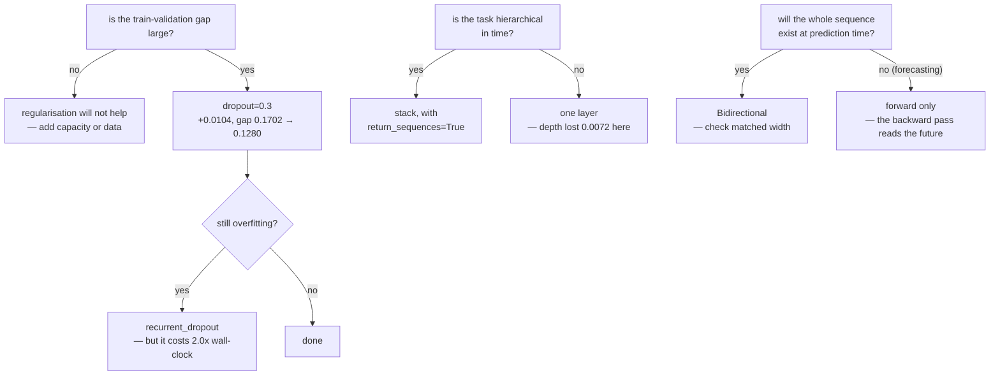

import DataCampExercise from "../../../../components/DataCampExercise.astro";
import Figure from "../../../../components/Figure.astro";
import Quiz from "../../../../components/Quiz.astro";

A single `LSTM(32)` on 5,000 IMDB reviews scores **0.8260**. Three refinements are the
standard next moves: regularise it, stack it, run it in both directions. All three were
measured here on the identical model, data and seed, at eight epochs.

| Change | Best validation accuracy | Against the baseline | Seconds |
| --- | --- | --- | --- |
| baseline `LSTM(32)` | 0.8260 | — | 129.5 |
| `dropout=0.3` | **0.8364** | **+0.0104** | 141.3 |
| `recurrent_dropout=0.3` | 0.8180 | **−0.0080** | **259.2** |
| both at 0.3 | 0.8240 | −0.0020 | 284.3 |
| 2 stacked layers | 0.8204 | −0.0056 | 362.5 |
| 3 stacked layers | 0.8188 | −0.0072 | 557.4 |
| `Bidirectional` (32+32) | **0.8448** | **+0.0188** | 225.3 |
| `Bidirectional` (16+16, matched width) | 0.8284 | +0.0024 | 262.7 |

One of the three helped. One cost twice the wall-clock to lose accuracy. One helped
mostly because it doubled the model's width.

## What you'll learn

- The difference between `dropout` and `recurrent_dropout` — different tensors,
  different masks, very different cost.
- Why `recurrent_dropout` **doubled the training time**: it drops off TensorFlow's fused
  kernel.
- The `return_sequences` rule that makes stacking possible, and why depth lost here.
- What `Bidirectional` actually costs, and how to tell a real gain from a width gain.
- The one setting a forecaster must never use, and the leak that makes it look good.

## Two dropout arguments, two different tensors

$$
\begin{aligned}
h_t &= f\!\left(W_x \cdot (\underbrace{m_x \odot x_t}_{\texttt{dropout}})
+ W_h \cdot (\underbrace{m_h \odot h_{t-1}}_{\texttt{recurrent\_dropout}}) + b\right)
\end{aligned}
$$

- **`dropout`** masks the **input** $x_t$ at each step.
- **`recurrent_dropout`** masks the **previous state** $h_{t-1}$ — inside the loop.

Both use the *same mask at every timestep* (a "variational" mask). That matters: a fresh
mask per step would resample the noise 200 times along one sequence and destroy anything
the state was carrying. A `Dropout` layer placed *between* two recurrent layers does
exactly that resampling — which is fine there, because it sits outside the recurrence.

<Figure
  src="/images/dl/phase-04-sequences/advanced-recurrent/recurrent-dropout"
  alt="Two panels. Left: paired bars for four settings showing the final train-minus-validation gap in grey and the best validation accuracy in colour — 0.8260 with gap 0.1702, 0.8364 with gap 0.1280, 0.8180 with gap 0.1708, 0.8240 with gap 0.1688. Right: per-epoch curves where all four dashed training curves climb above 0.95 while the solid validation curves flatten between 0.78 and 0.84."
  title="LSTM(32) on IMDB, 8 epochs, four dropout settings"
  caption="Plain dropout is the only setting that did what dropout is for: it cut the train-validation gap from 0.1702 to 0.1280 and gained 0.0104 accuracy. Recurrent dropout barely moved the gap (0.1708) and lost 0.0080 while costing twice the wall-clock. The dashed curves show why the gap is worth watching separately from the score: every one of these models is memorising the training set by epoch 5."
/>

### The cost nobody mentions

`recurrent_dropout` took **259.2 seconds against 129.5** — exactly 2.0×. The reason is
implementation, not mathematics: cuDNN and TensorFlow's fused CPU kernels implement the
whole recurrence as one optimised operation, and applying a dropout mask *inside* the
loop forces Keras to fall back to the generic step-by-step path.

The same is true of `mask_zero=True`, which every page in this phase uses. The two
together are why this module was the slowest in the phase.

| Setting | Fused kernel | Measured cost |
| --- | --- | --- |
| plain `LSTM` | yes | 1.0× |
| `dropout=0.3` | yes | 1.1× |
| `recurrent_dropout=0.3` | **no** | **2.0×** |

If you want regularisation and speed, use `dropout` plus a `Dropout` layer after the
recurrent layer, and reach for `recurrent_dropout` only when the gap says you need it.

## Stacking

Every recurrent layer except the last needs `return_sequences=True`, or the next one
receives a vector where it expects a sequence:

```python title="A two-layer stack"
model = keras.Sequential([
    keras.layers.Input((200,)),
    keras.layers.Embedding(10000, 32, mask_zero=True),
    keras.layers.LSTM(32, return_sequences=True),    # (batch, 200, 32)
    keras.layers.LSTM(32),                           # (batch, 32)
    keras.layers.Dense(1, activation="sigmoid"),
])
```

<Figure
  src="/images/dl/phase-04-sequences/advanced-recurrent/stacking-depth"
  alt="Two panels. Left: validation accuracy per epoch for one, two and three stacked LSTM layers, all between 0.78 and 0.83 with no clear separation. Right: bars of best accuracy — 0.8260, 0.8204, 0.8188 — annotated with training times of 189, 362 and 557 seconds."
  title="Stacked LSTMs on IMDB"
  caption="Depth cost accuracy monotonically and time linearly: each extra layer added 8,320 parameters, roughly 180 seconds, and lost about 0.006 accuracy. Sentiment on 5,000 reviews does not have a hierarchy of temporal features for a second layer to build on — the first layer already extracts everything the task needs, and the second only adds optimisation difficulty."
/>

| Layers | Parameters | Best validation accuracy | Seconds |
| --- | --- | --- | --- |
| 1 | 328,353 | **0.8260** | 188.8 |
| 2 | 336,673 | 0.8204 | 362.5 |
| 3 | 344,993 | 0.8188 | 557.4 |

Stacking is genuinely useful when the task has structure at several timescales — speech
(phonemes → words), music, long documents. It is not a general-purpose capacity dial,
and on this task it was a pure loss: **3× the training time for −0.0072 accuracy**.

## Bidirectional

`Bidirectional` runs two copies of the layer — one forward, one over the reversed
sequence — and concatenates their outputs. Reading a review backwards is not a worse way
to read it: the **backward** model alone scored 0.8180 against the forward model's
0.8260.

<Figure
  src="/images/dl/phase-04-sequences/advanced-recurrent/bidirectional"
  alt="Two panels. Left: bars for forward 0.8260, backward 0.8180, bidirectional 0.8448 and bidirectional at matched width 0.8284, each annotated with parameter counts of 328,353, 328,353, 336,705 and 326,305. Right: per-epoch validation curves where the bidirectional run sits above the others for most epochs and the backward-only run starts far lower at 0.52 before catching up."
  title="Forward, backward, and both"
  caption="The naive reading is that Bidirectional bought +0.0188. The matched-width control says otherwise: two 16-unit directions, which cost slightly fewer parameters than one 32-unit forward layer, gained only +0.0024. Most of the headline win was the extra width, not the extra direction — and the backward-only run's first epoch at 0.52 is a reminder that the two directions are not interchangeable during optimisation even when they end up equivalent."
/>

| Setup | Parameters | Best validation accuracy | Against forward |
| --- | --- | --- | --- |
| forward `LSTM(32)` | 328,353 | 0.8260 | — |
| backward `LSTM(32)` | 328,353 | 0.8180 | −0.0080 |
| `Bidirectional(LSTM(32))` | 336,705 | **0.8448** | **+0.0188** |
| `Bidirectional(LSTM(16))` | 326,305 | 0.8284 | +0.0024 |

**Always include the matched-width control.** Any wrapper that doubles a layer's output
width will look good against the un-doubled version; the question is whether the
*structure* helped, and here it was worth 0.0024, not 0.0188.



## The one that is a bug, not a trade-off

For classification, `Bidirectional` is a legitimate choice: the whole review exists
before you classify it. For **forecasting**, it is a leak. The backward pass at timestep
$t$ has consumed timesteps $t+1 \ldots T$, and at prediction time those have not
happened.

The failure mode is nasty because it validates beautifully. Your offline metric improves,
because your offline data contains the future; production then fails silently.
Exercise 5 demonstrates it directly: on a task where the answer sits at the *last*
timestep and must be reported from the *first*, a forward model cannot exceed chance and
a bidirectional one solves it.

The same reasoning covers every "look-ahead" mistake in the phase — shuffled splits,
scalers fitted on all the data, and target-derived features.

```p5 title="Which timesteps has each direction seen?" desc="Move the query step and watch what the forward, backward and bidirectional layers have consumed by the time they produce their output for that step." height="330"
let step = 7;
let dragging = false;
const T = 16;
function setup() {
  createCanvas(620, 330);
  textFont("monospace");
}
function draw() {
  background(13, 17, 23);
  const w = 32;
  const left = 40;
  noStroke();
  fill(230);
  textSize(11.5);
  textAlign(LEFT, TOP);
  text("output at timestep " + step, left, 22);
  const rows = [
    { label: "forward", seen: (t) => t <= step, color: [107, 169, 221] },
    { label: "backward", seen: (t) => t >= step, color: [255, 211, 67] },
    { label: "bidirectional", seen: () => true, color: [165, 214, 164] },
  ];
  rows.forEach((row, index) => {
    const y = 56 + index * 74;
    fill(200);
    textSize(10.5);
    textAlign(LEFT, CENTER);
    text(row.label, left, y - 12);
    for (let t = 0; t < T; t++) {
      const seen = row.seen(t);
      if (seen) fill(row.color[0], row.color[1], row.color[2], 210);
      else fill(45, 52, 63);
      rect(left + t * w, y, w - 3, 34, 3);
      if (t === step) {
        noFill();
        stroke(255);
        strokeWeight(2);
        rect(left + t * w, y, w - 3, 34, 3);
        noStroke();
      }
    }
    const count = Array.from({ length: T }, (_, t) => row.seen(t))
      .filter(Boolean).length;
    const future = Array.from({ length: T }, (_, t) => t > step && row.seen(t))
      .filter(Boolean).length;
    fill(future ? 230 : 150, future ? 90 : 150, future ? 90 : 150);
    textSize(10);
    textAlign(LEFT, CENTER);
    text(count + " steps seen" + (future ? "  — " + future
      + " of them in the future" : ""), left + T * w + 8, y + 17);
  });
  fill(150);
  textSize(10.5);
  textAlign(LEFT, TOP);
  text("classification: the whole sequence already exists, so reading ahead is fine",
    left, 282);
  fill(230, 90, 90);
  text("forecasting: those future steps have not happened yet — this is a leak",
    left, 298);
  fill(60, 70, 84);
  rect(left, 264, T * w - 3, 4, 2);
  fill(255, 255, 255);
  circle(left + (step / (T - 1)) * (T * w - 3), 266, 11);
}
function mousePressed() { if (Math.abs(mouseY - 266) < 12) dragging = true; }
function mouseDragged() {
  if (dragging) {
    const w = 32;
    step = Math.round(Math.min(Math.max((mouseX - 40) / (T * w - 3), 0), 1)
      * (T - 1));
  }
}
function mouseReleased() { dragging = false; }
```

```p5 title="The measured table, ranked" desc="Click a column to rank every row by it. The bars are that column's values and the highest and lowest are computed from the numbers, not written in." height="358"
let metric = 0;
const COLUMNS = ["Best validation accuracy", "Seconds"];
const ROWS = [
  ["baseline LSTM(32)", 0.826, 129.5],
  ["dropout=0.3", 0.8364, 141.3],
  ["recurrentdropout=0.3", 0.818, 259.2],
  ["both at 0.3", 0.824, 284.3],
  ["2 stacked layers", 0.8204, 362.5],
  ["3 stacked layers", 0.8188, 557.4],
  ["Bidirectional (32+32)", 0.8448, 225.3],
  ["Bidirectional (16+16, matched widt", 0.8284, 262.7]
];
function setup() {
  createCanvas(620, 358);
  textFont("monospace");
}
function fmt(v) {
  if (v === 0) { return "0"; }
  const a = Math.abs(v);
  if (a >= 1000 || a < 0.001) { return v.toExponential(2); }
  if (a >= 100) { return v.toFixed(1); }
  return v.toFixed(4);
}
function draw() {
  background(13, 17, 23);
  noStroke();
  fill(230);
  textSize(12);
  textAlign(LEFT, TOP);
  text("Advanced Recurrent Layers (Dropout", 26, 16);
  let x = 26;
  for (let i = 0; i < COLUMNS.length; i++) {
    const w = COLUMNS[i].length * 6.6 + 16;
    if (i === metric) { fill(255, 211, 67); } else { fill(48, 56, 68); }
    rect(x, 40, w, 22, 4);
    if (i === metric) { fill(13, 17, 23); } else { fill(180); }
    textSize(9);
    text(COLUMNS[i], x + 8, 47);
    x += w + 6;
    if (x > 500) { break; }
  }
  const values = ROWS.map((r) => r[metric + 1]);
  const lo = Math.min(...values);
  const hi = Math.max(...values);
  const span = hi - lo === 0 ? 1 : hi - lo;
  const order = ROWS.slice().sort((a, b) => b[metric + 1] - a[metric + 1]);
  for (let i = 0; i < order.length; i++) {
    const y = 78 + i * 26;
    const v = order[i][metric + 1];
    fill(160);
    textSize(9);
    text(order[i][0], 26, y + 5);
    fill(34, 40, 50);
    rect(230, y, 280, 18, 3);
    const frac = (v - lo) / span;
    if (v === hi) { fill(126, 192, 143); }
    else if (v === lo) { fill(224, 108, 117); }
    else { fill(107, 169, 221); }
    rect(230, y, Math.max(frac * 280, 3), 18, 3);
    fill(225);
    textSize(9);
    text(fmt(v), 518, y + 5);
  }
  const top = order[0];
  const bottom = order[order.length - 1];
  fill(150);
  textSize(9);
  const base = 78 + order.length * 26 + 8;
  text("highest " + COLUMNS[metric] + ": " + top[0] + " at " + fmt(top[1]),
       26, base);
  text("lowest  " + COLUMNS[metric] + ": " + bottom[0] + " at "
       + fmt(bottom[1]), 26, base + 14);
  text("bars are scaled within the chosen column - lowest is not zero", 26,
       base + 30);
}
function mousePressed() {
  let x = 26;
  for (let i = 0; i < COLUMNS.length; i++) {
    const w = COLUMNS[i].length * 6.6 + 16;
    if (mouseX > x && mouseX < x + w && mouseY > 40 && mouseY < 62) {
      metric = i;
    }
    x += w + 6;
  }
}
```

## Pitfalls

- **Reaching for `recurrent_dropout` first.** It cost 2.0× the wall-clock and lost
  0.0080 here, while plain `dropout` gained 0.0104 for 1.1×.
- **Judging regularisation by accuracy alone.** The useful signal was the gap: 0.1702 →
  0.1280 under `dropout`, essentially unchanged (0.1708) under `recurrent_dropout`.
- **Stacking as a capacity dial.** Three layers cost 3× the time for −0.0072. Stack when
  the task is hierarchical in time, not when you want "more model".
- **Forgetting `return_sequences=True` on all but the last layer.** It raises a shape
  error at build time, which is the good case; in a functional model with a `Reshape` it
  can silently mean something else.
- **Quoting a `Bidirectional` gain without a matched-width control.** +0.0188 became
  +0.0024 once the widths were equalised.
- **Using `Bidirectional` in a forecaster.** The backward pass reads timesteps that do
  not exist at prediction time, and it validates *better* for exactly that reason.
- **Assuming backward is worse than forward.** 0.8180 against 0.8260 — a different
  reading order, not a broken one.

## Recap

- `dropout` masks the input, `recurrent_dropout` masks the previous state, and both hold
  one mask fixed across all timesteps.
- Measured: `dropout=0.3` gave the only real win (+0.0104, gap 0.1702 → 0.1280);
  `recurrent_dropout=0.3` lost 0.0080 at 2.0× the wall-clock because it disables the
  fused kernel.
- Stacking cost accuracy at every depth (0.8260 → 0.8204 → 0.8188) and roughly 180
  seconds per layer.
- `Bidirectional` scored 0.8448 against 0.8260 — but only +0.0024 once width was matched.
- Backward-only scored 0.8180: a different reading order, not a worse one.
- No forecaster may use `Bidirectional`; the backward pass reads the future.

## Next

Recurrence has now been measured from every angle, including the angles where it loses.
One angle remains, and it is the bridge to the next phase: the fixed-size state that a
recurrent encoder hands to its decoder, and the mechanism invented to get around it.
[Attention Before Transformers (Additive and Bahdanau)](/deep-learning/phase-04---sequence-models-with-rnns/attention-before-transformers-additive-and-bahdanau/).

<Quiz
  questions={[
    {
      q: "What is the difference between dropout and recurrent_dropout on an LSTM?",
      options: [
        "One is applied during training, the other at inference",
        "dropout masks the input x_t; recurrent_dropout masks the previous state h_{t-1} inside the recurrence — and only the second one disables the fused kernel",
        "recurrent_dropout uses a different random distribution",
        "They are aliases for the same argument",
      ],
      answer: 1,
      explain: "Measured: 141.3 seconds for dropout against 259.2 for recurrent_dropout, on the identical model.",
    },
    {
      q: "recurrent_dropout=0.3 left the train-validation gap at 0.1708 and lost 0.0080 accuracy, while dropout=0.3 cut the gap to 0.1280 and gained 0.0104. What do you conclude?",
      options: [
        "recurrent_dropout is always wrong",
        "On this task plain dropout is the better first move — it regularised more and cost half as much; recurrent_dropout is what you try when the gap is still too large",
        "Neither form of dropout works on recurrent layers",
        "The model needed more epochs",
      ],
      answer: 1,
      explain: "The gap is the diagnostic. A regulariser that does not move the gap is not regularising, whatever it does to the score.",
    },
    {
      q: "Stacking went 0.8260 to 0.8204 to 0.8188 while training time went 189s to 362s to 557s. When is stacking still the right move?",
      options: [
        "Whenever you want more capacity",
        "When the task has structure at several timescales — speech, music, long documents — so a second layer has something to build on",
        "Whenever the first layer overfits",
        "Never; a single recurrent layer is always enough",
      ],
      answer: 1,
      explain: "Sentiment on short reviews is not hierarchical in time, so the second layer added optimisation difficulty and nothing else.",
    },
    {
      q: "Bidirectional scored 0.8448 against a forward LSTM's 0.8260. Why is that not a +0.0188 result?",
      options: [
        "Because bidirectional models cannot be deployed",
        "Because it also doubled the output width — two 16-unit directions at matched parameters scored 0.8284, a gain of only +0.0024",
        "Because the backward pass is unreliable",
        "Because the seeds differed",
      ],
      answer: 1,
      explain: "Any wrapper that doubles width beats the un-doubled version. The matched-width control is what isolates the structural effect.",
    },
    {
      q: "Why must a forecasting model never use Bidirectional?",
      options: [
        "It is too slow",
        "The backward pass consumes later timesteps, which at prediction time are the future — so the model validates better precisely because it is leaking",
        "It cannot be combined with masking",
        "It doubles the parameter count",
      ],
      answer: 1,
      explain: "Same family as a shuffled split or a scaler fitted on the full series: information at training time that will not exist at inference time.",
    },
  ]}
/>

## 🧪 Try It Yourself

<DataCampExercise
  lang="python"
  hint={`Pass training=True to see dropout act, and training=False to see the layer become deterministic. The two arguments touch different tensors.`}
  code={`# Task: Exercise 1 - The two dropout arguments are not the same thing
import numpy as np
from tensorflow import keras

probe = np.random.default_rng(0).standard_normal((4, 30, 8)).astype("float32")
print(f"{'setting':34s} {'output std, training=True':>26}")
for label, kwargs in (("no dropout", {}),
                      ("dropout=0.5", {"dropout": 0.5}),
                      ("recurrent_dropout=0.5", {"recurrent_dropout": 0.5}),
                      ("both 0.5", {"dropout": 0.5,
                                    "recurrent_dropout": 0.5})):
    keras.utils.set_random_seed(0)
    layer = keras.layers.LSTM(16, **kwargs)
    out = layer(probe, training=___)          # replace ___ with True
    print(f"{label:34s} {float(out.numpy().std()):26.4f}")

keras.utils.set_random_seed(0)
layer = keras.layers.LSTM(16, dropout=0.5, recurrent_dropout=0.5)
a = layer(probe, training=False).numpy()
b = layer(probe, training=False).numpy()
print(f"at inference the layer is deterministic: max |a - b| = "
      f"{float(np.abs(a - b).max()):.2e}")
print("dropout masks the input x_t; recurrent_dropout masks the previous")
print("state h_{t-1}, inside the loop")

# -- Expected Output -------------------------------------------
# setting                            output std, training=True
# no dropout                                            0.1695
# dropout=0.5                                           0.2157
# recurrent_dropout=0.5                                 0.1785
# both 0.5                                              0.2386
# at inference the layer is deterministic: max |a - b| = 0.00e+00
# dropout masks the input x_t; recurrent_dropout masks the previous
# state h_{t-1}, inside the loop
# --------------------------------------------------------------`}
/>

<DataCampExercise
  lang="python"
  hint={`Time a couple of epochs for each setting after a warm-up epoch, so graph tracing is not counted.`}
  code={`# Task: Exercise 2 - What recurrent_dropout costs
import time

import numpy as np
from tensorflow import keras

x = np.random.default_rng(0).standard_normal((2000, 100, 8)).astype("float32")
y = np.random.default_rng(1).integers(0, 2, 2000)
print(f"{'setting':26s} {'seconds for 2 epochs':>21} {'relative':>9}")
timings = {}
for label, kwargs in (("no dropout", {}),
                      ("dropout=0.3", {"dropout": 0.3}),
                      ("recurrent_dropout=0.3", {"recurrent_dropout": 0.3})):
    keras.utils.set_random_seed(0)
    model = keras.Sequential([keras.layers.Input((100, 8)),
                              keras.layers.LSTM(32, **kwargs),
                              keras.layers.Dense(1, activation="sigmoid")])
    model.compile(keras.optimizers.Adam(1e-3), "binary_crossentropy")
    model.fit(x[:256], y[:256], epochs=1, batch_size=64, verbose=0)  # warm up
    started = time.perf_counter()
    model.fit(x, y, epochs=2, batch_size=64, verbose=0)
    timings[label] = time.perf_counter() - ___     # replace ___ with started
    print(f"{label:26s} {timings[label]:21.1f} "
          f"{timings[label] / timings['no dropout']:8.1f}x")
print("the fused kernel implements the whole recurrence as one operation;")
print("a mask inside the loop forces the slow step-by-step path")

# -- Expected Output -------------------------------------------
# (plain dropout is roughly free; recurrent_dropout costs about 2x, which is
#  what the page measured on the full IMDB model: 259.2s against 129.5s)
# --------------------------------------------------------------`}
/>

<DataCampExercise
  lang="python"
  hint={`Every recurrent layer except the last needs return_sequences=True. Count the parameters each extra layer adds.`}
  code={`# Task: Exercise 3 - Stacking, and the error it raises
import numpy as np
from tensorflow import keras

print(f"{'depth':>6} {'params':>9} {'added':>8} {'output shape':>16}")
previous = None
for depth in (1, 2, 3):
    keras.utils.set_random_seed(0)
    layers = [keras.layers.Input((100, 8))]
    for index in range(depth):
        layers.append(keras.layers.LSTM(
            32, return_sequences=index < depth - ___))   # replace ___ with 1
    layers.append(keras.layers.Dense(1))
    model = keras.Sequential(layers)
    added = "" if previous is None else f"{model.count_params() - previous:,}"
    print(f"{depth:6d} {model.count_params():9,} {added:>8} "
          f"{str(model.output_shape):>16}")
    previous = model.count_params()

try:
    keras.Sequential([keras.layers.Input((100, 8)),
                      keras.layers.LSTM(32),
                      keras.layers.LSTM(32)])
except Exception as error:
    print(f"missing the flag: {type(error).__name__}: "
          f"{str(error).splitlines()[0][:100]}")
print("each layer adds 8,320 parameters and, on IMDB, about 180 seconds -")
print("for 0.006 less accuracy")

# -- Expected Output -------------------------------------------
#  depth    params    added     output shape
#      1     5,281                 (None, 1)
#      2    13,601    8,320        (None, 1)
#      3    21,921    8,320        (None, 1)
# missing the flag: ValueError: Input 0 with name 'None' of layer 'lstm_7' is
#   incompatible with the layer: expected ndim=3, found ndim=2
# each layer adds 8,320 parameters and, on IMDB, about 180 seconds -
# for 0.006 less accuracy
# --------------------------------------------------------------`}
/>

<DataCampExercise
  lang="python"
  hint={`Bidirectional concatenates the two directions by default, so the output width doubles. merge_mode changes that.`}
  code={`# Task: Exercise 4 - Bidirectional widths and merge modes
import numpy as np
from tensorflow import keras

probe = np.zeros((2, 100, 8), "float32")
print(f"{'layer':42s} {'output shape':>16} {'params':>9}")
for label, layer in (
        ("LSTM(32)", keras.layers.LSTM(32)),
        ("Bidirectional(LSTM(32))",
         keras.layers.Bidirectional(keras.layers.LSTM(32))),
        ("Bidirectional(LSTM(16))  <- matched width",
         keras.layers.Bidirectional(keras.layers.LSTM(16))),
        ("Bidirectional(LSTM(32), merge_mode='sum')",
         keras.layers.Bidirectional(keras.layers.LSTM(32), merge_mode="sum")),
        ("Bidirectional(LSTM(32), return_sequences=True)",
         keras.layers.Bidirectional(
             keras.layers.LSTM(32, return_sequences=True)))):
    out = layer(probe)
    params = int(sum(np.prod(w.shape) for w in ___.weights))
    # replace ___ with layer
    print(f"{label:42s} {str(tuple(int(v) for v in out.shape)):>16} "
          f"{params:9,}")
print("the default concatenates, so the output width doubles - which is why a")
print("matched-width control belongs in every bidirectional comparison")

# -- Expected Output -------------------------------------------
# layer                                        output shape    params
# LSTM(32)                                          (2, 32)     5,248
# Bidirectional(LSTM(32))                           (2, 64)    10,496
# Bidirectional(LSTM(16))  <- matched width         (2, 32)     3,200
# Bidirectional(LSTM(32), merge_mode='sum')         (2, 32)    10,496
# Bidirectional(LSTM(32), return_sequences=True) (2, 100, 64)  10,496
# the default concatenates, so the output width doubles - which is why a
# matched-width control belongs in every bidirectional comparison
# --------------------------------------------------------------`}
/>

<DataCampExercise
  lang="python"
  hint={`Put the informative value at the last timestep and read the prediction from the first. Only a layer that has seen the future can answer.`}
  code={`# Task: Exercise 5 - The backward pass reads the future
import numpy as np
from tensorflow import keras

ROWS, LENGTH = 3000, 20


def clue_at_the_end(rows, length, seed=0):
    generator = np.random.default_rng(seed)
    x = generator.normal(0.0, 0.3, (rows, length, 1)).astype("float32")
    bits = generator.integers(0, 2, rows)
    x[:, ___, 0] = bits * 2.0 - 1.0           # replace ___ with -1
    return x, bits.astype("int32")


x, y = clue_at_the_end(ROWS, LENGTH)
x_test, y_test = clue_at_the_end(1000, LENGTH, seed=1)
print("the informative value is at the LAST timestep and the prediction is")
print("read from the FIRST - chance is 0.5")
print(f"{'model':34s} {'best val accuracy':>18}")
for label, cell in (
        ("forward LSTM, first state", keras.layers.LSTM(16,
                                                        return_sequences=True)),
        ("bidirectional, first state",
         keras.layers.Bidirectional(keras.layers.LSTM(16,
                                                      return_sequences=True)))):
    keras.utils.set_random_seed(0)
    model = keras.Sequential([keras.layers.Input((LENGTH, 1)), cell,
                              keras.layers.Lambda(lambda t: t[:, 0, :]),
                              keras.layers.Dense(1, activation="sigmoid")])
    model.compile(keras.optimizers.Adam(3e-3), "binary_crossentropy",
                  metrics=["accuracy"])
    history = model.fit(x, y, epochs=12, batch_size=64, verbose=0,
                        validation_data=(x_test, y_test))
    print(f"{label:34s} {max(history.history['val_accuracy']):18.4f}")
print("the forward model cannot beat chance because the answer has not")
print("happened yet; the bidirectional one can, which in a forecaster is a bug")

# -- Expected Output -------------------------------------------
# (the forward model sits at roughly 0.5 and the bidirectional one climbs well
#  above it — that gap is exactly the leak)
# --------------------------------------------------------------`}
/>
