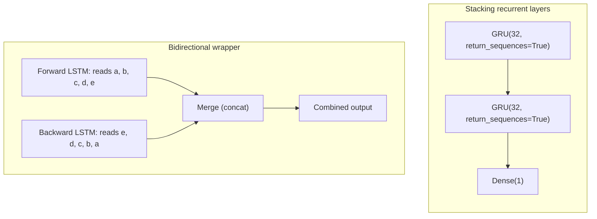

## Why refine a plain RNN

A single LSTM or GRU layer is often just the *starting point*. Once you have a
baseline that beats a common-sense heuristic (see the previous page), three
knobs from *Deep Learning with Python* (Chollet) usually decide what to try
next:

- training is **unstable** — loss barely moves, swings wildly, or hits `NaN` →
  fight the unstable-gradients problem with **recurrent layer normalization**.
- the model is **overfitting** — training loss keeps dropping, validation loss
  doesn't → add **recurrent dropout**.
- the model has **plateaued** but isn't overfitting badly → **stack** more
  recurrent layers for extra capacity.
- the task cares about order but **not which direction** you read it in (most
  text tasks) → try a **bidirectional** wrapper.



## Recurrent layer normalization

Before touching dropout at all, it's worth checking for a different symptom:
**unstable gradients**. An unrolled RNN is really a very deep feedforward
network wearing a trench coat — the same weights get reused at every time
step — so it can suffer the same vanishing/exploding gradients problem that
affects any deep net. The tell is in the *training curve itself*, not the gap
between train and validation loss: if loss barely moves, jumps around instead
of settling down, or turns to `NaN`, that's unstable gradients, not overfitting.

Ordinary `BatchNormalization` doesn't help much here. As *Hands-On Machine
Learning* (Géron) explains, it can't be applied *between* time steps — only
between stacked recurrent layers — because it needs statistics computed across
a batch, and those aren't meaningful mid-sequence. **Layer Normalization**
fixes this: instead of normalizing across the batch, it normalizes across the
*features* of a single instance, so it behaves identically at training and
inference time and can safely be applied at every time step, right after the
linear combination of inputs and hidden state.

Keras doesn't expose a `layer_norm=True` flag on `LSTM`/`GRU`, so using it takes
a small custom cell wrapped in `keras.layers.RNN` — built on the plain
`SimpleRNNCell`:

```python title="layer_norm_rnn_cell.py" showLineNumbers{1}
from tensorflow import keras

class LNSimpleRNNCell(keras.layers.Layer):
    def __init__(self, units, activation="tanh", **kwargs):
        super().__init__(**kwargs)
        self.state_size = units
        self.output_size = units
        self.simple_rnn_cell = keras.layers.SimpleRNNCell(units, activation=None)
        self.layer_norm = keras.layers.LayerNormalization()
        self.activation = keras.activations.get(activation)

    def call(self, inputs, states):
        outputs, new_states = self.simple_rnn_cell(inputs, states)
        norm_outputs = self.activation(self.layer_norm(outputs))
        return norm_outputs, [norm_outputs]

model = keras.models.Sequential([
    keras.layers.RNN(LNSimpleRNNCell(32), return_sequences=True,
                      input_shape=[None, 14]),
])
model.compile(optimizer="rmsprop", loss="mse", metrics=["mae"])
```

The cell delegates the actual recurrence math to `SimpleRNNCell` (with
`activation=None`, so the raw linear combination comes out untouched), applies
`LayerNormalization`, and *only then* applies the activation function — the
same order used in feedforward nets: linear step, then normalize, then
activate. Wrapping any custom cell in `keras.layers.RNN(...)` like this hands
you back an ordinary Keras layer that still supports `return_sequences`,
stacking, and everything else on this page. A quicker, coarser lever for the
same problem is **gradient clipping** — passing `clipnorm=1.0` (or
`clipvalue=...`) to the optimizer caps how large any single gradient update
can be, regardless of the layer architecture.

:::note
Custom cells like `LNSimpleRNNCell` run one step at a time in a Python-level
loop, so they lose the GPU's fast cuDNN kernel — the same trade-off
`recurrent_dropout` makes below. Reach for layer normalization specifically
when *training itself* looks unstable; if training is stable but the model is
just overfitting, plain `recurrent_dropout` is cheaper to add.
:::

## Recurrent dropout

Regular dropout — zeroing out random units — hurts recurrent layers if you're
not careful. Yarin Gal's research (built directly into Keras) found the fix:
use the **same** dropout mask at every timestep, instead of a fresh random mask
each step. A mask that changes every step disrupts the error signal that has to
flow backward through time; a fixed mask still regularizes without breaking
that signal.

Every recurrent layer in Keras exposes two separate arguments:

- `dropout` — drops a fraction of the *input* units at each timestep.
- `recurrent_dropout` — drops a fraction of the *recurrent* (state-to-state)
  units, using that same fixed-per-layer mask idea.

```python title="lstm_recurrent_dropout.py" showLineNumbers{1}
from tensorflow import keras
from tensorflow.keras import layers

inputs = keras.Input(shape=(120, 14))
x = layers.LSTM(32, recurrent_dropout=0.25)(inputs)
x = layers.Dropout(0.5)(x)          # regularize the Dense head too
outputs = layers.Dense(1)(x)
model = keras.Model(inputs, outputs)
model.compile(optimizer="rmsprop", loss="mse", metrics=["mae"])
```

Two practical notes from the book:

- networks regularized with dropout need **more epochs** to converge — the
  Jena temperature model above is trained for 50 epochs instead of 10.
- because you're relying on dropout for regularization instead of a tiny layer,
  you can afford **more units** (32 here vs. 16 in the undropped baseline)
  without immediately overfitting.

On the Jena temperature task, this drops validation MAE from 2.36 to about
**2.27 degrees** — a real, if modest, improvement.

## Stacking recurrent layers

If dropout fixed overfitting but accuracy has plateaued, the model is probably
**under capacity**. The classic fix is the same one used for deep RNNs earlier
in this phase: stack more recurrent layers. Every layer that feeds *another*
recurrent layer must return its full sequence, so every layer except the last
needs `return_sequences=True`:

```python title="stacked_gru_dropout.py" showLineNumbers{1}
from tensorflow import keras
from tensorflow.keras import layers

inputs = keras.Input(shape=(120, 14))
x = layers.GRU(32, recurrent_dropout=0.5, return_sequences=True)(inputs)
x = layers.GRU(32, recurrent_dropout=0.5)(x)
x = layers.Dropout(0.5)(x)
outputs = layers.Dense(1)(x)
model = keras.Model(inputs, outputs)
model.compile(optimizer="rmsprop", loss="mse", metrics=["mae"])
```

On the Jena task, stacking two dropout-regularized GRU layers reaches a test MAE
of about **2.39 degrees** — better than a single layer, but only a small gain.
That's normal: once a small recurrent model has already fixed both underfitting
and overfitting, extra layers tend to show diminishing returns, and each added
layer costs noticeably more compute.

## Bidirectional RNNs

A regular RNN reads a sequence in one direction — oldest step first. But that
direction was really just a choice. A **`Bidirectional`** layer runs two
independent copies of a recurrent layer — one reading the sequence forward,
one reading it backward — and merges their outputs (concatenation, by
default):

```python title="bidirectional_lstm.py" showLineNumbers{1}
from tensorflow import keras
from tensorflow.keras import layers

inputs = keras.Input(shape=(120, 14))
x = layers.Bidirectional(layers.LSTM(16))(inputs)
outputs = layers.Dense(1)(x)
model = keras.Model(inputs, outputs)
model.compile(optimizer="rmsprop", loss="mse", metrics=["mae"])
```

`Bidirectional(LSTM(16))` doubles the output width — each direction produces a
16-unit vector, concatenated into 32 — which also roughly doubles the
recurrent layer's capacity and training cost.

### When bidirectional helps — and when it doesn't

This is the counter-intuitive part. On the Jena **temperature** task,
bidirectional actually performs *worse* than a plain LSTM: the recent past
matters far more than the distant past for tomorrow's weather, so reading the
sequence backward mostly adds noisy, less-predictive capacity — and makes
overfitting start sooner. But on **text**, order matters yet *which* direction
you read in usually doesn't — you can read a sentence backward and still catch
its meaning — so a bidirectional layer genuinely helps there, catching patterns
a one-directional pass would miss. That's why bidirectional LSTMs were once the
default choice for NLP tasks, before Transformers took over.

| Technique | Fixes | Cost | Best for |
| --- | --- | --- | --- |
| Recurrent layer normalization | unstable gradients (loss stuck, spiky, or `NaN`) | needs a custom cell; loses the cuDNN fast path | training itself looks unstable, not just overfit |
| `recurrent_dropout` | overfitting | slower training (loses the cuDNN fast path) | any recurrent layer that's overfitting |
| Stacking (`return_sequences=True`) | under-capacity / plateaued accuracy | more compute per step | once dropout is already handling overfitting |
| `Bidirectional(...)` | missed patterns from reading only one direction | ~2x parameters & compute | text / order-matters-but-direction-doesn't tasks |

## Mini-checkpoint

Why did the bidirectional LSTM underperform on the Jena temperature-forecasting
task, when it's a common upgrade for text models?

- because the *direction* you read a sequence in isn't arbitrary for weather:
  the most recent readings are the most predictive, so the backward-reading
  half of the layer adds mostly noise instead of a genuinely useful new angle
  on the data — unlike text, where reading order doesn't change the meaning.

:::tip[From the book]
*Deep Learning with Python* (Chollet) makes a broader point here: a model
trained on reversed sequences learns genuinely *different* representations than
one trained on the original order — like living a life where you're born on
your last day. Different-but-useful representations are the whole idea behind
ensembling, which is exactly why bidirectional RNNs help order-agnostic tasks
(text) and hurt order-sensitive ones (time series with a clear recency bias).
:::

## Visualize it

Watch two passes over the same 5-step sequence — one left-to-right (blue), one
right-to-left (amber) — before they're merged into a single combined output:

```p5 title="Bidirectional RNN merge" desc="The blue arrow reads the sequence forward; the amber arrow reads it backward. Both feed into a merge that pulses once both passes complete." height="260"
let t = 0;
const steps = 5;
function stepX(i) { return 70 + i * ((width - 220) / (steps - 1)); }
function setup() {
  createCanvas(600, 260);
  textFont("monospace");
  textAlign(CENTER, CENTER);
}
function smoothstep(x) {
  x = constrain(x, 0, 1);
  return x * x * (3 - 2 * x);
}
function draw() {
  const sweepFrames = steps * 2 * 50;
  const holdFrames = 45;
  const cycleLen = sweepFrames + holdFrames;
  const cyclePos = t % cycleLen;
  // fade near the loop seam so resetting both passes is invisible
  const fade = min(smoothstep(cyclePos / 15), smoothstep((cycleLen - cyclePos) / 15));

  background(13, 17, 23);
  const fwdY = 90, bwdY = 170, mergeX = width - 60, mergeY = 130;
  const cycle = min(cyclePos / 50, steps * 2);
  const fwdActive = floor(min(cycle, steps - 1));
  const bwdActive = floor(min(max(cycle - steps, 0), steps - 1));
  // once both passes finish, the merge glows brighter for the hold period
  const mergeGlow = cyclePos > sweepFrames ? smoothstep((cyclePos - sweepFrames) / holdFrames) : 0;

  for (let i = 0; i < steps; i++) {
    const isFwd = i <= fwdActive;
    const isBwd = (steps - 1 - i) <= bwdActive;

    noStroke();
    fill(isFwd ? color(75, 139, 190) : color(50, 60, 74));
    ellipse(stepX(i), fwdY, 30, 30);
    fill(isBwd ? color(255, 211, 67) : color(70, 60, 40));
    ellipse(stepX(i), bwdY, 30, 30);

    fill(200);
    textSize(10);
    text("x" + i, stepX(i), fwdY - 26);
  }

  if (fwdActive > 0) {
    stroke(75, 139, 190);
    strokeWeight(2.5);
    line(stepX(0) + 15, fwdY, stepX(fwdActive) - 15, fwdY);
  }
  if (bwdActive > 0) {
    stroke(255, 211, 67);
    strokeWeight(2.5);
    line(stepX(steps - 1) - 15, bwdY, stepX(steps - 1 - bwdActive) + 15, bwdY);
  }

  stroke(120, 120, 120);
  strokeWeight(1.5);
  line(stepX(steps - 1) + 15, fwdY, mergeX - 20, mergeY - 15);
  line(stepX(steps - 1) + 15, bwdY, mergeX - 20, mergeY + 15);

  noStroke();
  fill(lerpColor(color(150, 90, 190), color(255, 211, 67), mergeGlow));
  rectMode(CENTER);
  rect(mergeX, mergeY, 70 + mergeGlow * 10, 46 + mergeGlow * 10, 8);
  fill(230);
  textSize(10);
  text("merge\n(concat)", mergeX, mergeY);

  fill(107, 169, 221);
  textSize(11);
  text("blue = forward pass   amber = backward pass", width / 2, 230);

  // dim to background right at the loop seam so the reset is invisible
  noStroke();
  fill(13, 17, 23, (1 - fade) * 255);
  rect(0, 0, width, height);

  t++;
}
```

import DataCampExercise from "../../../../components/DataCampExercise.astro";

## 🧪 Try It Yourself

### Exercise 1 – Add Recurrent Dropout

<DataCampExercise
  lang="python"
  hint={`Pass \`recurrent_dropout=0.25\` when building the \`LSTM\` layer, then read it back with \`model.layers[0].recurrent_dropout\`.`}
  code={`# Task: Exercise 1 – Add Recurrent Dropout
from tensorflow import keras

model = keras.models.Sequential([
    keras.layers.LSTM(32, recurrent_dropout=___, input_shape=[None, 14]),  # replace ___ with 0.25
])
model.compile(loss="mse", optimizer="adam")
print(model.layers[0].recurrent_dropout)

# ── Expected Output ───────────────────────────────────────────
# 0.25
# ──────────────────────────────────────────────────────────────`}
  solution={`from tensorflow import keras

model = keras.models.Sequential([
    keras.layers.LSTM(32, recurrent_dropout=0.25, input_shape=[None, 14]),
])
model.compile(loss="mse", optimizer="adam")
print(model.layers[0].recurrent_dropout)`}
  sct={`test_output_contains("0.25")
success_msg("Recurrent dropout is set - the same mask will be reused at every timestep!")`}
  height={148}
/>

### Exercise 2 – Stack Two GRU Layers

<DataCampExercise
  lang="python"
  hint={`The first GRU layer needs \`return_sequences=True\` so the second GRU layer receives a full 3D sequence.`}
  code={`# Task: Exercise 2 – Stack Two GRU Layers
from tensorflow import keras

model = keras.models.Sequential([
    keras.layers.GRU(32, return_sequences=___, input_shape=[None, 14]),  # replace ___ with True
    keras.layers.GRU(32),
])
model.compile(loss="mse", optimizer="adam")
print([layer.__class__.__name__ for layer in model.layers])

# ── Expected Output ───────────────────────────────────────────
# ['GRU', 'GRU']
# ──────────────────────────────────────────────────────────────`}
  solution={`from tensorflow import keras

model = keras.models.Sequential([
    keras.layers.GRU(32, return_sequences=True, input_shape=[None, 14]),
    keras.layers.GRU(32),
])
model.compile(loss="mse", optimizer="adam")
print([layer.__class__.__name__ for layer in model.layers])`}
  sct={`test_output_contains("['GRU', 'GRU']")
success_msg("Two stacked GRU layers - more capacity for a model that's plateaued, not overfit!")`}
  height={158}
/>

### Exercise 3 – Wrap an LSTM as Bidirectional

<DataCampExercise
  lang="python"
  hint={`\`keras.layers.Bidirectional(keras.layers.LSTM(16))\` concatenates a forward and backward pass, doubling the output width to 32.`}
  code={`# Task: Exercise 3 – Wrap an LSTM as Bidirectional
import numpy as np
from tensorflow import keras

X = np.random.rand(2, 5, 14).astype("float32")

model = keras.models.Sequential([
    keras.layers.___(keras.layers.LSTM(16), input_shape=[None, 14])  # replace ___ with Bidirectional
])
model.compile(loss="mse", optimizer="adam")
preds = model.predict(X, verbose=0)
print("Output shape:", preds.shape)

# ── Expected Output ───────────────────────────────────────────
# Output shape: (2, 32)
# ──────────────────────────────────────────────────────────────`}
  solution={`import numpy as np
from tensorflow import keras

X = np.random.rand(2, 5, 14).astype("float32")

model = keras.models.Sequential([
    keras.layers.Bidirectional(keras.layers.LSTM(16), input_shape=[None, 14])
])
model.compile(loss="mse", optimizer="adam")
preds = model.predict(X, verbose=0)
print("Output shape:", preds.shape)`}
  sct={`test_output_contains("Output shape: (2, 32)")
success_msg("32 = 16 forward units concatenated with 16 backward units!")`}
  height={168}
/>

## Next

Continue to **Text Preprocessing (Tokenization, Stemming, Lemmatization)** —
start Phase 5 by turning raw text into the numeric sequences an RNN (or
Transformer) can actually process.
