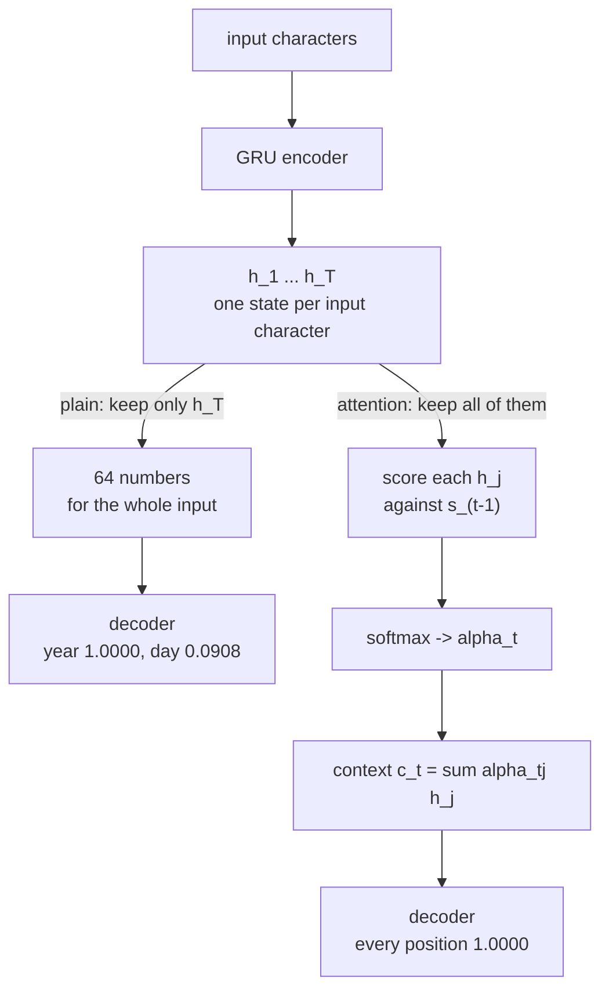

Attention did not arrive with the transformer. It arrived four years earlier as a patch to
a specific, measurable failure in recurrent encoder–decoders, and understanding that failure
is what makes the transformer's design look inevitable rather than arbitrary.

This page builds the patch: **additive attention**, the mechanism from Bahdanau et al.
(2014), on a task where the correct alignment is known in advance so the attention weights
can be checked rather than admired.

## What you'll learn

- Why a fixed-size encoder state is a **bottleneck**, and what specifically it drops.
- Additive attention derived and implemented — scores, softmax, context vector.
- The measured gap: **0.0017 exact matches against 1.0000** on the same task.
- Why alignment maps are evidence only when you already know the right alignment.
- What the transformer changed, and what it kept.

## The task

**Date normalisation.** A date written the way a person writes it goes in; ISO format
comes out.

| Input | Output |
| --- | --- |
| `19/3/1994` | `1994-03-19` |
| `wednesday 19 september 1977` | `1977-09-19` |
| `the 4 of august, 2003` | `2003-08-04` |

Six input formats, 6,000 training strings, 1,200 held out, characters in and characters
out. This task is chosen deliberately: it is **synthetic**, so no corpus is downloaded;
it is **hard for a bottleneck**, because the output must reorder its input; and the true
alignment is **known** — the `1977` in the output comes from the `1977` in the input and
nowhere else — which makes the attention weights checkable.

## The bottleneck

A plain encoder–decoder reads the whole input, produces one final state $\mathbf{h}_T$,
and hands that single vector to the decoder:

$$
\mathbf{h}_t = \mathrm{GRU}(\mathbf{x}_t, \mathbf{h}_{t-1}), \qquad
\mathbf{s}_0 = \mathbf{h}_T
$$

Every character of the answer is then produced from $\mathbf{s}$, which descends from
$\mathbf{h}_T$. At 64 units that is **64 floating-point numbers** carrying a 27-character
input. Everything the decoder will ever know about the input has to fit there.

The prediction is that widening the encoder should help the plain model a great deal and
the attention model very little, because attention does not have to fit anything into a
fixed budget — it can look back at the encoder's per-timestep outputs:

<Figure
  src="/images/dl/phase-04-sequences/attention-before-transformers/bottleneck"
  alt="Grouped bars of exact-match accuracy at four encoder widths. The plain encoder-decoder is at or near zero for all four — 0.0000, 0.0000, 0.0008 and 0.0017. The attention model rises from 0.0000 at 8 units to 0.0133 at 16, 0.9042 at 32 and 1.0000 at 64."
  title="Date normalisation, 1,200 held-out strings, 12 epochs each"
  caption="The plain model never produces a single fully correct date at any width tested — 0.0017 at 64 units means two strings out of 1,200. The attention model is also width-sensitive, and sharply so: 0.0133 at 16 units, 0.9042 at 32, 1.0000 at 64. So width matters to both; what changes is where the ceiling is. Note the cost: attention took 83.5 s against 43.6 s at 64 units and added 20,544 parameters."
/>

| Encoder width | Plain, exact | Attention, exact | Plain, per character | Attention, per character |
| --- | --- | --- | --- | --- |
| 8 | 0.0000 | 0.0000 | 0.1432 | 0.4995 |
| 16 | 0.0000 | 0.0133 | 0.5524 | 0.7450 |
| 32 | 0.0008 | 0.9042 | 0.6467 | 0.9871 |
| 64 | **0.0017** | **1.0000** | 0.7277 | 1.0000 |

Exact match is a harsh metric on a ten-character output — one wrong digit fails the whole
string — so the per-character columns are there to show that the plain model is not
producing noise. At 64 units it gets **72.77%** of output characters right while getting
essentially no complete date right.

## What the bottleneck actually drops

That combination — most characters right, almost no strings right — is only interesting
if you look at *which* characters:

<Figure
  src="/images/dl/phase-04-sequences/attention-before-transformers/by-position"
  alt="Grouped bars of accuracy at each of the ten output positions. The plain model is at 1.0000 for the four year digits and both dashes, drops to 0.7467 and 0.1108 for the two month digits, and 0.3658 and 0.0908 for the two day digits. The attention model is at 1.0000 everywhere."
  title="Both models at 64 units, 1,200 held-out strings"
  caption="The plain model's 0.7277 is not spread evenly at all. It has perfectly learned the two dashes (they are in the same place every time) and the year, which appears last in every input format and is therefore freshest in the final state. It then degrades along exactly the axis the bottleneck predicts: month first digit 0.7467, month second digit 0.1108, day first digit 0.3658, day second digit 0.0908."
/>

| Output position | Plain | Attention |
| --- | --- | --- |
| `Y` `Y` `Y` | 1.0000 | 1.0000 |
| `Y` (4th) | 0.9625 | 1.0000 |
| `-` (both) | 1.0000 | 1.0000 |
| `M` (1st) | 0.7467 | 1.0000 |
| `M` (2nd) | **0.1108** | 1.0000 |
| `D` (1st) | 0.3658 | 1.0000 |
| `D` (2nd) | **0.0908** | 1.0000 |

Read the plain column as a memory decay curve. The **dashes** are free — they are at
fixed positions and need no input at all. The **year** is perfect because it appears last
in every one of the six input formats, so it is the most recent thing the encoder saw.
The **month** is partially recoverable. The **day**, which appears earliest, is almost
gone: 0.0908 on its second digit is close to the 0.10 you get by guessing a digit
uniformly.

:::note[Bucketing by length showed nothing]
The obvious experiment is to bucket by input length, on the theory that longer inputs
overflow the state further. It was run: the plain model scored 0.7300, 0.7211, 0.7386 and
0.7086 across four length buckets — a spread of **0.0300**, with no trend. Input length
is not the axis that matters here; **distance from the end of the input** is. The
figure above replaced the length figure for that reason.
:::

## Additive attention

The fix is to stop discarding the encoder's intermediate states. Keep all of them —
$\mathbf{h}_1 \dots \mathbf{h}_T$ — and let the decoder build a fresh summary at every
output step, weighted toward whichever inputs are relevant right now.

At decoder step $t$, with previous decoder state $\mathbf{s}_{t-1}$:

$$
e_{tj} = \mathbf{v}^\top \tanh\!\left(\mathbf{W}_{\!e}\,\mathbf{h}_j + \mathbf{W}_{\!d}\,\mathbf{s}_{t-1}\right)
$$

$$
\alpha_{tj} = \frac{\exp(e_{tj})}{\sum_{k=1}^{T} \exp(e_{tk})}, \qquad
\mathbf{c}_t = \sum_{j=1}^{T} \alpha_{tj}\,\mathbf{h}_j
$$

Three pieces, and each earns its place:

- $\mathbf{W}_{\!e}\mathbf{h}_j + \mathbf{W}_{\!d}\mathbf{s}_{t-1}$ — the **additive**
  part, and the reason for the name. Query and key are projected and *summed*, then
  squashed. Scaled dot-product attention replaces this whole expression with
  $\mathbf{q}^\top\mathbf{k}/\sqrt{d_k}$, which has no parameters and is one matrix
  multiply.
- The **softmax** makes the weights a distribution — they sum to 1 across input
  positions, so the context vector is a weighted average of real encoder states rather
  than an arbitrary combination.
- $\mathbf{c}_t$ is **recomputed every step**. That is the whole difference from the
  plain model, which computes its summary once.

The context vector is then concatenated with the embedded previous output token and fed
to the decoder cell:

```python
query = self.state_projection(state)[:, None, :]      # W_d s_{t-1}
scores = self.score(tf.nn.tanh(projected + query))[..., 0]
alpha = tf.nn.softmax(scores, axis=1)                 # over input positions
context = tf.reduce_sum(alpha[..., None] * encoded, axis=1)
cell_input = tf.concat([embedded[:, step, :], context], axis=-1)
output, [state] = self.cell(cell_input, [state])
```

At 64 units this costs **20,544 extra parameters** (36,893 → 57,437) and roughly double
the wall clock, 43.6 s → 83.5 s. It buys exact-match accuracy of 1.0000 against 0.0017.



## Reading the alignment

Attention produces a weight for every (output position, input position) pair, which
plots as a matrix. This is the part that gets over-interpreted, so the task was chosen so
the correct answer is known before looking.

<Figure
  src="/images/dl/phase-04-sequences/attention-before-transformers/alignment"
  alt="A heat map with ten output characters down the vertical axis and the input string 'wednesday 19 september 1977' along the horizontal. Bright cells cluster near the end of the string for the year digits, in the middle of the word september for the month digit, and near the '19' for the day digits."
  title="One decoded example, weights taken from the trained model"
  caption="The output is 1977-09-19 and the input is 'wednesday 19 september 1977'. The year digits peak at input position 25 — inside '1977'. The month digit 9 peaks at position 15, which is inside 'september'. The day digits peak at position 11, which is the '9' of '19'. The model is not reading left to right; it jumps to whichever span of the input it needs."
/>

The measured peaks, character by character:

| Output | Peak input position | Character there |
| --- | --- | --- |
| `1` `9` `7` | 25 | `7` (inside `1977`) |
| `7` | 22 | space before `1977` |
| `-` | 22 | space |
| `0` | 21 | `r` (end of `september`) |
| `9` | 15 | `p` (inside `september`) |
| `-` | 22 | space |
| `1` `9` | 11 | `9` (inside `19`) |

The three groups land on the three spans that carry the answer, and they land out of
order — the year first, then the month word, then the day. That is what "the decoder
chooses where to look" means concretely.

:::caution[An alignment map is not an explanation]
It is very easy to look at a heat map and narrate a story. Two guards make it evidence
instead. First, **know the right answer in advance** — here the alignment is determined
by the task, so a wrong map would be visible. Second, notice that the year digits peak on
a *space* and the month digit on the letter `p`. The model is attending to positions
whose encoder states are informative, not to the characters a human would point at.
Encoder states are contextual; position 22's state has already absorbed the year that
follows it.
:::

## What the transformer kept and what it changed

Every piece of this mechanism survives into the transformer, with two substitutions.

| Bahdanau, 2014 | Transformer, 2017 |
| --- | --- |
| score = $\mathbf{v}^\top\tanh(\mathbf{W}_{\!e}\mathbf{h} + \mathbf{W}_{\!d}\mathbf{s})$ | score = $\mathbf{q}^\top\mathbf{k}/\sqrt{d_k}$ |
| query is the **decoder's recurrent state** | query is a **projection of a token**, no recurrence |
| one attention head | many heads in parallel |
| encoder is a GRU, so steps are sequential | encoder is attention, so steps are parallel |
| context concatenated into the recurrent cell | context is the residual stream itself |

The important change is the second row. Bahdanau's query comes from a recurrent state, so
the decoder still runs one step at a time and the encoder still walks the input
sequentially. Removing recurrence — replacing the query source with a projection of the
token itself — is what makes the whole sequence computable in parallel, and that is the
transformer's actual contribution. The scoring function got simpler along the way, but
that was a bonus, not the point.

```p5 title="Where the decoder looks" desc="Click an output character. The bars show the measured attention weight peak for that character over the input string - the three groups land on three different spans." height="360"
let picked = 0;
const SOURCE = "wednesday 19 september 1977";
const OUTPUT = "1977-09-19";
const PEAKS = [25, 25, 25, 22, 22, 21, 15, 22, 11, 11];
const WHY = [
  "the year - last in the input, so freshest",
  "the year", "the year", "the year",
  "a separator - needs no input at all",
  "end of 'september'", "inside 'september'",
  "a separator",
  "the '19' - earliest in the input",
  "the '19'",
];
function setup() {
  createCanvas(620, 360);
  textFont("monospace");
}
function draw() {
  background(13, 17, 23);
  noStroke();
  fill(230);
  textSize(12);
  textAlign(LEFT, TOP);
  text("output: " + OUTPUT, 26, 18);
  for (let i = 0; i < OUTPUT.length; i++) {
    const x = 26 + i * 40;
    if (i === picked) { fill(255, 211, 67); } else { fill(48, 56, 68); }
    rect(x, 44, 34, 30, 4);
    if (i === picked) { fill(13, 17, 23); } else { fill(190); }
    textSize(14);
    textAlign(CENTER, CENTER);
    text(OUTPUT[i], x + 17, 59);
    textAlign(LEFT, TOP);
  }
  fill(150);
  textSize(10);
  text("input, with the attended position highlighted:", 26, 96);
  const cw = 20;
  for (let i = 0; i < SOURCE.length; i++) {
    const x = 26 + i * cw;
    const hit = i === PEAKS[picked];
    if (hit) { fill(255, 211, 67); } else { fill(34, 40, 50); }
    rect(x, 120, cw - 2, 30, 3);
    if (hit) { fill(13, 17, 23); } else { fill(140); }
    textSize(12);
    textAlign(CENTER, CENTER);
    text(SOURCE[i] === " " ? "_" : SOURCE[i], x + cw / 2 - 1, 135);
    textAlign(LEFT, TOP);
  }
  fill(200);
  textSize(11);
  text("peak at input position " + PEAKS[picked], 26, 172);
  fill(150);
  textSize(10);
  text(WHY[picked], 26, 194);
  fill(110);
  textSize(9);
  text("the plain encoder-decoder scores each of these positions:", 26, 232);
  const PLAIN = [1.0, 1.0, 1.0, 0.9625, 1.0, 0.7467, 0.1108, 1.0, 0.3658, 0.0908];
  const value = PLAIN[picked];
  fill(40, 47, 58);
  rect(26, 252, 420, 22, 3);
  if (value > 0.9) { fill(126, 192, 143); }
  else if (value > 0.5) { fill(255, 211, 67); }
  else { fill(224, 108, 117); }
  rect(26, 252, value * 420, 22, 3);
  fill(235);
  textSize(10);
  text(value.toFixed(4), 456, 257);
  fill(150);
  textSize(9);
  text("with attention every position scores 1.0000. The plain model's", 26, 290);
  text("errors are not random - they track how far the needed span sits", 26, 304);
  text("from the END of the input, which is what a single final state", 26, 318);
  text("remembers best.", 26, 332);
}
function mousePressed() {
  for (let i = 0; i < OUTPUT.length; i++) {
    const x = 26 + i * 40;
    if (mouseX > x && mouseX < x + 34 && mouseY > 44 && mouseY < 74) {
      picked = i;
    }
  }
}
```

```p5 title="The measured table, ranked" desc="Click a column to rank every row by it. The bars are that column's values and the highest and lowest are computed from the numbers, not written in." height="332"
let metric = 0;
const COLUMNS = ["Plain"];
const ROWS = [
  ["Y Y Y", 1],
  ["Y (4th)", 0.9625],
  ["- (both)", 1],
  ["M (1st)", 0.7467],
  ["M (2nd)", 0.1108],
  ["D (1st)", 0.3658],
  ["D (2nd)", 0.0908]
];
function setup() {
  createCanvas(620, 332);
  textFont("monospace");
}
function fmt(v) {
  if (v === 0) { return "0"; }
  const a = Math.abs(v);
  if (a >= 1000 || a < 0.001) { return v.toExponential(2); }
  if (a >= 100) { return v.toFixed(1); }
  return v.toFixed(4);
}
function draw() {
  background(13, 17, 23);
  noStroke();
  fill(230);
  textSize(12);
  textAlign(LEFT, TOP);
  text("Attention Before Transformers (Add", 26, 16);
  let x = 26;
  for (let i = 0; i < COLUMNS.length; i++) {
    const w = COLUMNS[i].length * 6.6 + 16;
    if (i === metric) { fill(255, 211, 67); } else { fill(48, 56, 68); }
    rect(x, 40, w, 22, 4);
    if (i === metric) { fill(13, 17, 23); } else { fill(180); }
    textSize(9);
    text(COLUMNS[i], x + 8, 47);
    x += w + 6;
    if (x > 500) { break; }
  }
  const values = ROWS.map((r) => r[metric + 1]);
  const lo = Math.min(...values);
  const hi = Math.max(...values);
  const span = hi - lo === 0 ? 1 : hi - lo;
  const order = ROWS.slice().sort((a, b) => b[metric + 1] - a[metric + 1]);
  for (let i = 0; i < order.length; i++) {
    const y = 78 + i * 26;
    const v = order[i][metric + 1];
    fill(160);
    textSize(9);
    text(order[i][0], 26, y + 5);
    fill(34, 40, 50);
    rect(230, y, 280, 18, 3);
    const frac = (v - lo) / span;
    if (v === hi) { fill(126, 192, 143); }
    else if (v === lo) { fill(224, 108, 117); }
    else { fill(107, 169, 221); }
    rect(230, y, Math.max(frac * 280, 3), 18, 3);
    fill(225);
    textSize(9);
    text(fmt(v), 518, y + 5);
  }
  const top = order[0];
  const bottom = order[order.length - 1];
  fill(150);
  textSize(9);
  const base = 78 + order.length * 26 + 8;
  text("highest " + COLUMNS[metric] + ": " + top[0] + " at " + fmt(top[1]),
       26, base);
  text("lowest  " + COLUMNS[metric] + ": " + bottom[0] + " at "
       + fmt(bottom[1]), 26, base + 14);
  text("bars are scaled within the chosen column - lowest is not zero", 26,
       base + 30);
}
function mousePressed() {
  let x = 26;
  for (let i = 0; i < COLUMNS.length; i++) {
    const w = COLUMNS[i].length * 6.6 + 16;
    if (mouseX > x && mouseX < x + w && mouseY > 40 && mouseY < 62) {
      metric = i;
    }
    x += w + 6;
  }
}
```

## Pitfalls

- **Concluding "attention beats recurrence".** Attention here is *added to* a recurrent
  encoder–decoder. Both models are recurrent; only one has a bottleneck.
- **Reading exact match alone.** 0.0017 against 1.0000 suggests the plain model learned
  nothing. Per character it reached 0.7277, and the per-position split is where the
  actual finding is.
- **Assuming longer inputs are the problem.** Measured spread across length buckets:
  0.0300, no trend. Distance from the end of the input is the axis that matters.
- **Narrating an alignment map without knowing the answer.** The year digits peak on a
  space. Encoder states are contextual, so the bright cell is not always where a human
  would point.
- **Forgetting the cost.** 20,544 extra parameters and 1.9× the wall clock, and the
  context vector is recomputed at every output step, so attention costs
  $O(T_{\text{in}} \times T_{\text{out}})$ score evaluations where the bottleneck costs a
  constant number.
- **Comparing at one encoder width.** At 8 units both models score 0.0000 exact. A
  single-width comparison could have shown attention making no difference at all.

## Recap

- A plain encoder–decoder passes the entire input through **one fixed-size vector**; at
  64 units that is 64 numbers for a 27-character string.
- On date normalisation the plain model reached **0.0017** exact match against attention's
  **1.0000**, and per character 0.7277 against 1.0000.
- The per-position split shows what the bottleneck drops: year and separators 1.0000, day
  second digit **0.0908** — the failure tracks distance from the end of the input, not
  input length (spread across length buckets: 0.0300).
- **Additive attention** scores every encoder state against the previous decoder state,
  softmaxes, and averages — one context vector per output step instead of one per
  sequence.
- The measured alignment jumps between three spans out of order, and peaks on positions
  whose *states* are informative rather than on the characters a human would choose.
- The transformer keeps the score-softmax-average structure and replaces the recurrent
  query with a token projection, which is what removes the sequential dependency.

## Next

Phase 5 takes the mechanism on this page, removes the recurrence around it, and asks what
is left: [Attention from Scratch (Queries, Keys and Values)](/deep-learning/phase-05---nlp--transformers/attention-from-scratch-queries-keys-and-values/).

<Quiz
  questions={[
    {
      q: "The plain encoder–decoder scored 1.0000 on all four year digits and 0.0908 on the day's second digit. What explains the pattern?",
      options: [
        "Year digits are easier to predict than day digits",
        "The year appears last in every input format, so it is the most recent thing the fixed-size final state absorbed; the day appears earliest and has been overwritten",
        "The model was only trained on years",
        "Day digits have higher entropy"
      ],
      answer: 1,
      explanation: "The whole input has to fit in one 64-number vector, and a recurrent state retains recent input best. The error profile is a memory-decay curve read along the input, not a difficulty ranking."
    },
    {
      q: "Bucketing the same results by input length gave 0.7300, 0.7211, 0.7386 and 0.7086 — a spread of 0.0300 with no trend. Why report a null result?",
      options: [
        "To fill space",
        "Because it rules out the obvious explanation: the bottleneck is not about how long the input is but about how far the needed information sits from its end",
        "Because the buckets were too small",
        "Because length always matters eventually"
      ],
      answer: 1,
      explanation: "Without it, a reader would reasonably assume the plain model degrades with length. The measurement says otherwise and points at the axis that does explain the failure."
    },
    {
      q: "In additive attention, what makes the mechanism 'additive'?",
      options: [
        "The context vector is added to the decoder output",
        "The encoder and decoder projections are summed inside a tanh before scoring — W_e h + W_d s — rather than multiplied as a dot product",
        "The attention weights add up to one",
        "Multiple heads are added together"
      ],
      answer: 1,
      explanation: "Scaled dot-product attention replaces that whole expression with q·k/sqrt(d_k), which has no learned parameters. The softmax normalisation is present in both and is not what the name refers to."
    },
    {
      q: "For the input 'wednesday 19 september 1977', the year digits peaked at input position 22 and 25 — one of which is a space. Is the alignment wrong?",
      options: [
        "Yes, it should peak on the digits themselves",
        "No — the model attends to encoder STATES, and a GRU state at position 22 has already absorbed the characters around it, so it can be the most informative place to look",
        "Yes, the model is guessing",
        "No, spaces are the most important token"
      ],
      answer: 1,
      explanation: "This is the reason an alignment map needs a known ground truth to be evidence. Positions are informative because of what their states encode, which is not the same as what character sits there."
    },
    {
      q: "What did the transformer actually change relative to this mechanism?",
      options: [
        "It introduced attention",
        "It replaced the recurrent decoder state as the query source with a projection of the token itself, which removes the sequential dependency and lets the whole sequence be computed in parallel",
        "It made attention weights sum to one",
        "It removed the softmax"
      ],
      answer: 1,
      explanation: "Attention already existed here, and the softmax-weighted average is unchanged. Simplifying the score to a scaled dot product was a bonus; removing recurrence is what made the architecture parallel."
    },
    {
      q: "At 8 encoder units both models scored 0.0000 exact match. What would a single-width comparison have concluded?",
      options: [
        "The correct thing — both models are equivalent",
        "That attention makes no difference, which the 32- and 64-unit columns refute (0.9042 and 1.0000 against 0.0008 and 0.0017)",
        "That the task is impossible",
        "That 8 units is the right width"
      ],
      answer: 1,
      explanation: "A mechanism can need enough capacity to express itself before it shows any benefit. Sweeping the width is what separates 'this does not help' from 'this does not help yet'."
    }
  ]}
/>

## 🧪 Try It Yourself

<DataCampExercise
  lang="python"
  hint={`Sum the two projections, squash with tanh, project to a scalar, then softmax over the input positions.`}
  code={`# Task: Exercise 1 - Additive attention in nine lines of NumPy
import numpy as np

rng = np.random.default_rng(0)
TIMESTEPS, UNITS = 6, 4

encoder = rng.normal(0, 1, (TIMESTEPS, UNITS))   # h_1 ... h_T
state = rng.normal(0, 1, UNITS)                  # s_{t-1}
W_enc = rng.normal(0, 0.5, (UNITS, UNITS))
W_dec = rng.normal(0, 0.5, (UNITS, UNITS))
v = rng.normal(0, 0.5, UNITS)

scores = np.tanh(encoder @ W_enc + state @ W_dec) @ v
alpha = np.exp(scores - scores.max())
alpha = alpha / alpha.___()                      # replace ___ with sum
context = alpha @ encoder

print(f"{'position':>9} {'score':>9} {'weight':>9}")
for index, (score, weight) in enumerate(zip(scores, alpha)):
    print(f"{index:9d} {score:9.4f} {weight:9.4f}")
print(f"\\nweights sum to {alpha.sum():.6f}")
print(f"context vector: {np.round(context, 4)}")
print(f"most attended position: {int(alpha.argmax())}")

# The context is a weighted average of real encoder states, so it can never
# leave their convex hull - check that against the largest single state.
print(f"\\nlargest |h_j|:   {np.abs(encoder).max():.4f}")
print(f"largest |context|: {np.abs(context).max():.4f}")`}
  solution={`import numpy as np

rng = np.random.default_rng(0)
TIMESTEPS, UNITS = 6, 4

encoder = rng.normal(0, 1, (TIMESTEPS, UNITS))
state = rng.normal(0, 1, UNITS)
W_enc = rng.normal(0, 0.5, (UNITS, UNITS))
W_dec = rng.normal(0, 0.5, (UNITS, UNITS))
v = rng.normal(0, 0.5, UNITS)

scores = np.tanh(encoder @ W_enc + state @ W_dec) @ v
alpha = np.exp(scores - scores.max())
alpha = alpha / alpha.sum()
context = alpha @ encoder

print(f"{'position':>9} {'score':>9} {'weight':>9}")
for index, (score, weight) in enumerate(zip(scores, alpha)):
    print(f"{index:9d} {score:9.4f} {weight:9.4f}")
print(f"\\nweights sum to {alpha.sum():.6f}")
print(f"context vector: {np.round(context, 4)}")
print(f"most attended position: {int(alpha.argmax())}")

print(f"\\nlargest |h_j|:   {np.abs(encoder).max():.4f}")
print(f"largest |context|: {np.abs(context).max():.4f}")`}
  sct={`test_output_contains("weights sum to 1.000000", pattern=False)
test_output_contains("most attended position: 3", pattern=False)
success_msg("Attention turns six scores into weights that sum to one, and the context vector is the weighted average of the encoder states.")`}
  height={460}
/>

<DataCampExercise
  lang="python"
  hint={`Count how many numbers the decoder receives in each design: one vector, or one vector per input step.`}
  code={`# Task: Exercise 2 - How much can a fixed state carry?
import numpy as np

CHARS = 27          # the longest input on this page
WIDTHS = (8, 16, 32, 64, 256)

print(f"{'units':>7} {'bottleneck':>12} {'attention sees':>16} "
      f"{'ratio':>8} {'numbers per input char':>24}")
for units in WIDTHS:
    bottleneck = units                      # only h_T survives
    with_attention = units * ___            # replace ___ with CHARS
    print(f"{units:7d} {bottleneck:12,} {with_attention:16,} "
          f"{with_attention / bottleneck:8.0f} {bottleneck / CHARS:24.2f}")

print("\\nat 64 units the decoder in the plain model gets 2.37 numbers per")
print("input character - and it has to reorder them. The measured result is")
print("0.0017 exact matches; per character it still reaches 0.7277, because")
print("the separators and the year are recoverable from a small summary")`}
  solution={`import numpy as np

CHARS = 27
WIDTHS = (8, 16, 32, 64, 256)

print(f"{'units':>7} {'bottleneck':>12} {'attention sees':>16} "
      f"{'ratio':>8} {'numbers per input char':>24}")
for units in WIDTHS:
    bottleneck = units
    with_attention = units * CHARS
    print(f"{units:7d} {bottleneck:12,} {with_attention:16,} "
          f"{with_attention / bottleneck:8.0f} {bottleneck / CHARS:24.2f}")

print("\\nat 64 units the decoder in the plain model gets 2.37 numbers per")
print("input character - and it has to reorder them. The measured result is")
print("0.0017 exact matches; per character it still reaches 0.7277, because")
print("the separators and the year are recoverable from a small summary")`}
  sct={`test_output_contains("0.30", pattern=False)
test_output_contains("9.48", pattern=False)
success_msg("A fixed-size bottleneck gives the decoder a small fraction of a number per input character, while attention sees every encoder state.")`}
  height={346}
/>

<DataCampExercise
  lang="python"
  hint={`Softmax is shift-invariant but not scale-invariant: multiplying the scores sharpens the distribution.`}
  code={`# Task: Exercise 3 - What the softmax does to the scores
import numpy as np


def softmax(z):
    shifted = np.exp(z - z.max())
    return shifted / shifted.sum()


scores = np.array([2.0, 1.6, 1.2, 0.4, -0.8])
print(f"{'scale':>7} {'largest weight':>16} {'entropy':>9} {'effective spread':>18}")
for scale in (0.25, 0.5, 1.0, 2.0, 8.0):
    weights = softmax(scores * ___)          # replace ___ with scale
    entropy = -float((weights * np.log(weights + 1e-12)).sum())
    print(f"{scale:7.2f} {weights.max():16.4f} {entropy:9.4f} "
          f"{np.exp(entropy):18.4f}")

print("\\nthe scores are identical every time - only their scale changes.")
print("At 0.25 the attention is nearly uniform over all five positions; at")
print("8.0 it has collapsed onto one. This is exactly why the transformer")
print("divides its dot products by sqrt(d_k): the raw products grow with")
print("dimension, and a saturated softmax has almost no gradient")`}
  solution={`import numpy as np


def softmax(z):
    shifted = np.exp(z - z.max())
    return shifted / shifted.sum()


scores = np.array([2.0, 1.6, 1.2, 0.4, -0.8])
print(f"{'scale':>7} {'largest weight':>16} {'entropy':>9} {'effective spread':>18}")
for scale in (0.25, 0.5, 1.0, 2.0, 8.0):
    weights = softmax(scores * scale)
    entropy = -float((weights * np.log(weights + 1e-12)).sum())
    print(f"{scale:7.2f} {weights.max():16.4f} {entropy:9.4f} "
          f"{np.exp(entropy):18.4f}")

print("\\nthe scores are identical every time - only their scale changes.")
print("At 0.25 the attention is nearly uniform over all five positions; at")
print("8.0 it has collapsed onto one. This is exactly why the transformer")
print("divides its dot products by sqrt(d_k): the raw products grow with")
print("dimension, and a saturated softmax has almost no gradient")`}
  sct={`test_output_contains("0.9593", pattern=False)
test_output_contains("4.8654", pattern=False)
success_msg("The scores never change, only their scale: at a small scale attention is nearly uniform and at a large one it collapses onto a single position.")`}
  height={414}
/>

<DataCampExercise
  lang="python"
  hint={`Additive attention learns three matrices; dot-product attention learns none inside the score itself.`}
  code={`# Task: Exercise 4 - What each scoring function costs
import numpy as np

print(f"{'units':>7} {'additive':>10} {'dot product':>13} {'ratio':>8}")
for units in (8, 16, 32, 64, 256, 512):
    # W_enc (u x u), W_dec (u x u), v (u)
    additive = 2 * units * units + ___          # replace ___ with units
    dot = 0                                      # q . k has no parameters
    print(f"{units:7d} {additive:10,} {dot:13,} "
          f"{'infinite' if dot == 0 else additive / dot:>8}")

print("\\nadditive attention grows quadratically in the hidden size and the")
print("dot product does not grow at all - it has no parameters inside the")
print("score. On this page the attention model added 20,544 parameters over")
print("the plain one at 64 units (36,893 -> 57,437), and most of that is the")
print("scoring network rather than the wider decoder input")`}
  solution={`import numpy as np

print(f"{'units':>7} {'additive':>10} {'dot product':>13} {'ratio':>8}")
for units in (8, 16, 32, 64, 256, 512):
    additive = 2 * units * units + units
    dot = 0
    print(f"{units:7d} {additive:10,} {dot:13,} "
          f"{'infinite' if dot == 0 else additive / dot:>8}")

print("\\nadditive attention grows quadratically in the hidden size and the")
print("dot product does not grow at all - it has no parameters inside the")
print("score. On this page the attention model added 20,544 parameters over")
print("the plain one at 64 units (36,893 -> 57,437), and most of that is the")
print("scoring network rather than the wider decoder input")`}
  sct={`test_output_contains("131,328", pattern=False)
test_output_contains("524,800", pattern=False)
success_msg("Additive attention has a scoring network whose size grows quadratically with the hidden size, and a dot product has no parameters at all.")`}
  height={312}
/>

<DataCampExercise
  lang="python"
  hint={`Build the six formats, then check where in the string each part of the answer lives.`}
  code={`# Task: Exercise 5 - Where does each part of the answer sit?
import numpy as np

rng = np.random.default_rng(0)
MONTHS = ("january", "february", "march", "april", "may", "june", "july",
          "august", "september", "october", "november", "december")
DAYS = ("monday", "tuesday", "wednesday", "thursday", "friday", "saturday",
        "sunday")

positions = {"year": [], "month": [], "day": []}
for _ in range(2000):
    year = int(rng.integers(1970, 2030))
    month = int(rng.integers(1, 13))
    day = int(rng.integers(1, 29))
    name = MONTHS[month - 1]
    weekday = DAYS[rng.integers(0, len(DAYS))]
    options = (f"{day}/{month}/{year}", f"{day} {name} {year}",
               f"{name} {day}, {year}", f"{weekday} {day} {name} {year}",
               f"the {day} of {name}, {year}", f"{day}-{month:02d}-{year}")
    text = options[rng.integers(0, len(options))]
    positions["year"].append(1 - text.index(str(year)) / len(text))
    month_at = text.index(name) if name in text else text.index(str(month))
    positions["month"].append(1 - month_at / len(text))
    positions["day"].append(1 - text.index(str(day)) / len(text))

print(f"{'part':>7} {'mean distance from the END':>28} {'measured accuracy':>19}")
MEASURED = {"year": 0.9906, "month": 0.4288, "day": 0.2283}
for part in ("year", "month", "day"):
    nearness = float(np.mean(positions[___]))    # replace ___ with part
    print(f"{part:>7} {nearness:28.4f} {MEASURED[part]:19.4f}")

print("\\nthe two columns run in opposite directions, which is the point.")
print("The year starts on average 0.3015 of the way back from the end and")
print("scores 0.9906; the day starts 0.8298 of the way back and scores")
print("0.2283. The further from the end a fact sits, the less survives")`}
  solution={`import numpy as np

rng = np.random.default_rng(0)
MONTHS = ("january", "february", "march", "april", "may", "june", "july",
          "august", "september", "october", "november", "december")
DAYS = ("monday", "tuesday", "wednesday", "thursday", "friday", "saturday",
        "sunday")

positions = {"year": [], "month": [], "day": []}
for _ in range(2000):
    year = int(rng.integers(1970, 2030))
    month = int(rng.integers(1, 13))
    day = int(rng.integers(1, 29))
    name = MONTHS[month - 1]
    weekday = DAYS[rng.integers(0, len(DAYS))]
    options = (f"{day}/{month}/{year}", f"{day} {name} {year}",
               f"{name} {day}, {year}", f"{weekday} {day} {name} {year}",
               f"the {day} of {name}, {year}", f"{day}-{month:02d}-{year}")
    text = options[rng.integers(0, len(options))]
    positions["year"].append(1 - text.index(str(year)) / len(text))
    month_at = text.index(name) if name in text else text.index(str(month))
    positions["month"].append(1 - month_at / len(text))
    positions["day"].append(1 - text.index(str(day)) / len(text))

print(f"{'part':>7} {'mean distance from the END':>28} {'measured accuracy':>19}")
MEASURED = {"year": 0.9906, "month": 0.4288, "day": 0.2283}
for part in ("year", "month", "day"):
    nearness = float(np.mean(positions[part]))
    print(f"{part:>7} {nearness:28.4f} {MEASURED[part]:19.4f}")

print("\\nthe two columns run in opposite directions, which is the point.")
print("The year starts on average 0.3015 of the way back from the end and")
print("scores 0.9906; the day starts 0.8298 of the way back and scores")
print("0.2283. The further from the end a fact sits, the less survives")`}
  sct={`test_output_contains("0.9906", pattern=False)
test_output_contains("0.2283", pattern=False)
success_msg("Distance from the end and accuracy run in opposite directions: the further back a fact sits, the less of it survives a fixed-size summary.")`}
  height={460}
/>

<DataCampExercise
  lang="python"
  hint={`Exact match multiplies per-character accuracies when the errors are independent; measure how badly that assumption holds.`}
  code={`# Task: Exercise 6 - Why exact match collapses
import numpy as np

# Measured per-position accuracy for the plain encoder-decoder.
PLAIN = np.array([1.0, 1.0, 1.0, 0.9625, 1.0, 0.7467, 0.1108, 1.0,
                  0.3658, 0.0908])
ATTENTION = np.ones(10)

for name, row in (("plain", PLAIN), ("attention", ATTENTION)):
    per_character = float(row.mean())
    independent = float(np.prod(___))          # replace ___ with row
    print(f"{name:10s} per character {per_character:.4f}, "
          f"exact match if errors were independent {independent:.4f}")

print(f"\\nthe measured exact match was 0.0017 for the plain model against")
print(f"{float(np.prod(PLAIN)):.4f} predicted by multiplying the positions.")
print("They are close, which tells you the errors are close to independent -")
print("the model is not failing on a few hopeless strings, it is missing a")
print("digit somewhere in almost every one")`}
  solution={`import numpy as np

PLAIN = np.array([1.0, 1.0, 1.0, 0.9625, 1.0, 0.7467, 0.1108, 1.0,
                  0.3658, 0.0908])
ATTENTION = np.ones(10)

for name, row in (("plain", PLAIN), ("attention", ATTENTION)):
    per_character = float(row.mean())
    independent = float(np.prod(row))
    print(f"{name:10s} per character {per_character:.4f}, "
          f"exact match if errors were independent {independent:.4f}")

print(f"\\nthe measured exact match was 0.0017 for the plain model against")
print(f"{float(np.prod(PLAIN)):.4f} predicted by multiplying the positions.")
print("They are close, which tells you the errors are close to independent -")
print("the model is not failing on a few hopeless strings, it is missing a")
print("digit somewhere in almost every one")`}
  sct={`test_output_contains("per character 0.7277", pattern=False)
test_output_contains("per character 1.0000", pattern=False)
success_msg("A model that misses one character in four almost never gets a whole string right, and attention removes that bottleneck.")`}
  height={363}
/>
