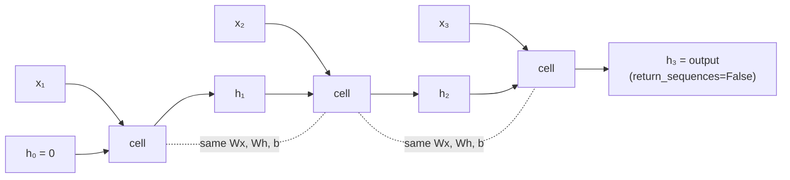

A dense layer sees a fixed-size vector with no notion of order. A convolution sees a
fixed-size neighbourhood. A **recurrent** layer sees one element at a time and carries a
state forward, so its output can depend on everything that came before.

That is the promise. This page measures the delivery, on 5,000 IMDB reviews truncated to
200 tokens, and the headline is uncomfortable: a `SimpleRNN(32)` scored **0.5856** while
averaging the same embeddings and discarding order entirely scored **0.8004**.

## What you'll learn

- The recurrence relation, and the same cell written in **five lines of NumPy** that
  match Keras to within `1e-6`.
- What word order is worth, measured by destroying it: **+0.0744 for the RNN, +0.0000
  for a bag of words**.
- What the hidden state actually does over 200 timesteps — including the **fixed point**
  it converges to while reading padding.
- Why `return_sequences` exists and when you need it.
- Where a `SimpleRNN` stops working, measured on the adding problem.
- Why the parameter count is independent of sequence length — and why the runtime is not.

## The recurrence

$$
h_t = \tanh\!\left(W_x x_t + W_h h_{t-1} + b\right), \qquad h_0 = \mathbf{0}
$$

One weight matrix for the input, one for the previous state, one bias — **shared across
every timestep**, which is what makes the layer independent of sequence length. The
layer's output is $h_T$, the state after the last element.

```python title="A SimpleRNN cell, from scratch"
def simple_rnn(sequence, kernel, recurrent, bias):
    """sequence: (timesteps, features). Returns every hidden state."""
    h = np.zeros(kernel.shape[1], "float32")
    states = []
    for x in sequence:
        h = np.tanh(x @ kernel + h @ recurrent + bias)
        states.append(h.copy())
    return np.stack(states)
```

That loop *is* the layer. Exercise 2 runs it against `keras.layers.SimpleRNN` with the
same weights and the two agree to **2.68e-07** — float32 rounding, nothing else. Worth
confirming once, because everything else on this page follows from that single line.

The parameter count follows directly: for `features` inputs and `units` state,

$$
\underbrace{\text{features} \times \text{units}}_{W_x}
+ \underbrace{\text{units}^2}_{W_h}
+ \underbrace{\text{units}}_{b}
$$

so `SimpleRNN(32)` on 32-dimensional embeddings costs $32{\times}32 + 32^2 + 32 = 2{,}080$
parameters — regardless of whether the sequence is 20 steps or 20,000.

## What is order actually worth?

The way to measure it is to destroy it. Shuffle the tokens inside every review — same
words, same counts, no order — and retrain.

| Model | In order | Shuffled | Order is worth |
| --- | --- | --- | --- |
| bag of words (`GlobalAveragePooling1D`) | 0.8004 | 0.8004 | **+0.0000** |
| `SimpleRNN(32)` | 0.5856 | 0.5112 | **+0.0744** |

<Figure
  src="/images/dl/phase-04-sequences/intro-to-rnns/order-matters"
  alt="A grouped bar chart. The bag-of-words model scores 0.8004 both in order and shuffled, labelled 'order is worth +0.0000'. The SimpleRNN scores 0.5856 in order and 0.5112 shuffled, labelled 'order is worth +0.0744'."
  title="IMDB, 5,000 reviews, 200 tokens, 5 epochs"
  caption="Two results in one figure. The bag-of-words model is identical to four decimal places under shuffling — it must be, because averaging is permutation-invariant, and that identity is a useful check that the shuffle really happened. The SimpleRNN does use order, losing 0.0744 without it. And it is still 0.21 behind the model that has no idea what order is."
/>

The honest reading:

1. **Order carries real signal** — the RNN's 0.0744 drop proves it is using the
   sequence, not just the word counts.
2. **A `SimpleRNN` is a bad way to extract that signal at 200 timesteps.** Averaging the
   embeddings, which cannot represent "not good" differently from "good not", beats it by
   0.2148. The reason is the subject of the
   [next page](/deep-learning/phase-04---sequence-models-with-rnns/lstm--gru-networks/):
   a plain recurrent state cannot carry information across hundreds of steps.
3. **The bag-of-words identity is the control.** If the shuffled bag-of-words score had
   moved at all, the experiment would have been broken.

## What the state does

Take one trained cell, rebuild it with `return_sequences=True`, copy the weights across
and keep every $h_t$ for one review. This review is 68 tokens long inside a 200-step
tensor, so it starts with **132 steps of padding**.

<Figure
  src="/images/dl/phase-04-sequences/intro-to-rnns/unrolled-state"
  alt="Two stacked panels. The top is a heat map of 32 hidden units against 200 timesteps: for the first 130 steps every unit holds a constant value, drawing perfectly horizontal stripes in red and blue, and after step 130 the pattern becomes noisy and varied. The bottom panel plots mean absolute state, which rises from 0 to about 0.27 in the first 20 steps, stays flat until step 130, then drops and fluctuates between 0.15 and 0.30."
  title="Every hidden state of one 32-unit SimpleRNN over 200 timesteps"
  caption="The horizontal stripes are the important part: fed the same token 132 times, the recurrence converges to a fixed point and stops carrying information. Measured mean |state| is 0.2646 over the padding and 0.2180 over the actual review — the padded steps are not idle, they are saturated. Once real tokens arrive at step 132 the state becomes input-dependent again, which is exactly why pre-padding is survivable and post-padding is not."
/>

Two measured facts worth keeping:

- **The state is more active during padding than during text** (0.2646 against 0.2180).
  Token id 0 has an ordinary embedding vector, and feeding it repeatedly drives the cell
  to $h^\* = \tanh(W_x x_{\text{pad}} + W_h h^\* + b)$ — an attractor.
- **No unit saturated** ($|h| > 0.99$) at the final step: 0 of 32. The `tanh` is being
  used in its linear-ish middle range here, which is not always true — a saturated unit
  has a near-zero gradient and stops learning.

That first point is the whole argument of the
[padding and masking page](/deep-learning/phase-04---sequence-models-with-rnns/padding-masking-and-variable-length-sequences/),
and it is why the four setups there differ by 0.08 accuracy.



### `return_sequences`

| Setting | Output shape | Use it for |
| --- | --- | --- |
| `False` (default) | `(batch, units)` — the last state only | classification, one-step forecasting |
| `True` | `(batch, timesteps, units)` — every state | stacking recurrent layers, per-timestep labels, attention |

Stacking is the common case, and it is a hard requirement: **every recurrent layer
except the last needs `return_sequences=True`**, or the next layer receives a vector
where it expects a sequence.

## Where it stops working

Sentiment does not need long-range memory, so it cannot show where a `SimpleRNN`
breaks. The **adding problem** can: a sequence of uniform values with two marked
positions — one near the start, one in the second half — where the target is the sum of
the two marked values. Carrying a number across the sequence *is* the task, and
predicting the mean sum of 1.0 is the do-nothing baseline.

| Sequence length | Baseline MAE | `SimpleRNN(32)` | `LSTM(32)` |
| --- | --- | --- | --- |
| 10 | 0.3167 | **0.0241** | **0.0074** |
| 40 | 0.3255 | **0.0641** | **0.0109** |
| 100 | 0.3233 | **0.3106** ← at the baseline | **0.0152** |
| 200 | 0.3287 | 0.3289 | 0.3173 |

<Figure
  src="/images/dl/phase-04-sequences/intro-to-rnns/memory-length"
  alt="Validation MAE against sequence length on log axes. The LSTM line stays near 0.01 for lengths 10, 40 and 100 before jumping to 0.32 at length 200. The SimpleRNN line rises from 0.02 at length 10 to 0.06 at 40 and then to 0.31 at 100, meeting the dashed do-nothing baseline at about 0.32."
  title="The adding problem — 3,000 sequences, 60 epochs, 32 units"
  caption="The SimpleRNN solves the task at 10 and 40 steps, then collapses onto the baseline at 100: it has not merely got worse, it has stopped carrying the number at all. The LSTM holds to 100 steps at MAE 0.0152 — twenty times better — and then fails too at 200. That last column is honest rather than convenient: the gates raise the length at which recurrence works, they do not make it unbounded, and 60 epochs is a modest budget for a 200-step credit assignment."
/>

Two conclusions, and the second one matters more:

1. **A `SimpleRNN`'s usable range ended between 40 and 100 timesteps here.** That is why
   it scored 0.5856 on 200-token reviews — for most of each review it is not carrying
   anything.
2. **The LSTM's range is longer, not infinite.** It won by a factor of twenty at 100
   steps and then joined the SimpleRNN at the baseline at 200. Anyone who tells you
   gates "solve" long-range dependency should be asked at what length, with what budget.

```p5 title="Unrolling the recurrence" desc="Drag the recurrent weight and watch what the state does over 40 steps of identical input. Above 1 it explodes, below 1 it decays to a fixed point." height="330"
let recurrentWeight = 0.9;
let dragging = false;
const STEPS = 40;
const INPUT = 0.35;
function setup() {
  createCanvas(620, 330);
  textFont("monospace");
}
function trace() {
  const out = [0];
  let h = 0;
  for (let t = 0; t < STEPS; t++) {
    h = Math.tanh(INPUT + recurrentWeight * h);
    out.push(h);
  }
  return out;
}
function draw() {
  background(13, 17, 23);
  const states = trace();
  const x = (t) => 40 + (t / STEPS) * 540;
  const y = (v) => 150 - v * 100;
  stroke(60, 70, 84);
  line(40, y(0), 580, y(0));
  line(40, y(1), 580, y(1));
  line(40, y(-1), 580, y(-1));
  noStroke();
  fill(120, 130, 145);
  textSize(9);
  textAlign(RIGHT, CENTER);
  text("+1", 36, y(1));
  text("0", 36, y(0));
  text("-1", 36, y(-1));
  stroke(107, 169, 221);
  strokeWeight(1.8);
  noFill();
  beginShape();
  for (let t = 0; t < states.length; t++) vertex(x(t), y(states[t]));
  endShape();
  strokeWeight(1);
  for (let t = 0; t < states.length; t += 4) {
    noStroke();
    fill(107, 169, 221);
    circle(x(t), y(states[t]), 5);
  }
  noStroke();
  fill(220);
  textSize(11);
  textAlign(LEFT, TOP);
  text("h_t = tanh(" + INPUT.toFixed(2) + " + " + recurrentWeight.toFixed(2)
    + " * h_{t-1})", 40, 24);
  const last = states[states.length - 1];
  const settled = Math.abs(states[states.length - 1]
    - states[states.length - 6]) < 1e-4;
  fill(255, 211, 67);
  text("h_" + STEPS + " = " + last.toFixed(6)
    + (settled ? "   (settled on a fixed point)" : "   (still moving)"), 40, 250);
  fill(150);
  textSize(10.5);
  text("identical input every step is what padding looks like to the cell:", 40, 272);
  text("measured mean |state| was 0.2646 over padding, 0.2180 over the text",
    40, 286);
  fill(60, 70, 84);
  rect(40, 306, 300, 4, 2);
  const knob = 40 + ((recurrentWeight + 0.5) / 2.0) * 300;
  fill(255, 211, 67);
  circle(knob, 308, 13);
  fill(200);
  textSize(10);
  text("recurrent weight " + recurrentWeight.toFixed(2), 352, 302);
}
function mousePressed() { if (Math.abs(mouseY - 308) < 12) dragging = true; }
function mouseDragged() {
  if (dragging) {
    recurrentWeight = Math.min(Math.max((mouseX - 40) / 300, 0), 1) * 2.0 - 0.5;
  }
}
function mouseReleased() { dragging = false; }
```

Drag the weight above 1 and the state pins at $\pm 1$; drop it below and the state
collapses towards a single value. Neither extreme carries information forward, and the
whole design of the LSTM is an answer to that.

```p5 title="The measured table, ranked" desc="Click a column to rank every row by it. The bars are that column's values and the highest and lowest are computed from the numbers, not written in." height="254"
let metric = 0;
const COLUMNS = ["Baseline MAE", "LSTM(32)"];
const ROWS = [
  ["10", 0.3167, 0.0074],
  ["40", 0.3255, 0.0109],
  ["100", 0.3233, 0.0152],
  ["200", 0.3287, 0.3173]
];
function setup() {
  createCanvas(620, 254);
  textFont("monospace");
}
function fmt(v) {
  if (v === 0) { return "0"; }
  const a = Math.abs(v);
  if (a >= 1000 || a < 0.001) { return v.toExponential(2); }
  if (a >= 100) { return v.toFixed(1); }
  return v.toFixed(4);
}
function draw() {
  background(13, 17, 23);
  noStroke();
  fill(230);
  textSize(12);
  textAlign(LEFT, TOP);
  text("Intro to Recurrent Neural Networks", 26, 16);
  let x = 26;
  for (let i = 0; i < COLUMNS.length; i++) {
    const w = COLUMNS[i].length * 6.6 + 16;
    if (i === metric) { fill(255, 211, 67); } else { fill(48, 56, 68); }
    rect(x, 40, w, 22, 4);
    if (i === metric) { fill(13, 17, 23); } else { fill(180); }
    textSize(9);
    text(COLUMNS[i], x + 8, 47);
    x += w + 6;
    if (x > 500) { break; }
  }
  const values = ROWS.map((r) => r[metric + 1]);
  const lo = Math.min(...values);
  const hi = Math.max(...values);
  const span = hi - lo === 0 ? 1 : hi - lo;
  const order = ROWS.slice().sort((a, b) => b[metric + 1] - a[metric + 1]);
  for (let i = 0; i < order.length; i++) {
    const y = 78 + i * 26;
    const v = order[i][metric + 1];
    fill(160);
    textSize(9);
    text(order[i][0], 26, y + 5);
    fill(34, 40, 50);
    rect(230, y, 280, 18, 3);
    const frac = (v - lo) / span;
    if (v === hi) { fill(126, 192, 143); }
    else if (v === lo) { fill(224, 108, 117); }
    else { fill(107, 169, 221); }
    rect(230, y, Math.max(frac * 280, 3), 18, 3);
    fill(225);
    textSize(9);
    text(fmt(v), 518, y + 5);
  }
  const top = order[0];
  const bottom = order[order.length - 1];
  fill(150);
  textSize(9);
  const base = 78 + order.length * 26 + 8;
  text("highest " + COLUMNS[metric] + ": " + top[0] + " at " + fmt(top[1]),
       26, base);
  text("lowest  " + COLUMNS[metric] + ": " + bottom[0] + " at "
       + fmt(bottom[1]), 26, base + 14);
  text("bars are scaled within the chosen column - lowest is not zero", 26,
       base + 30);
}
function mousePressed() {
  let x = 26;
  for (let i = 0; i < COLUMNS.length; i++) {
    const w = COLUMNS[i].length * 6.6 + 16;
    if (mouseX > x && mouseX < x + w && mouseY > 40 && mouseY < 62) {
      metric = i;
    }
    x += w + 6;
  }
}
```

## Pitfalls

- **Expecting a `SimpleRNN` to beat a bag of words on long text.** Measured 0.5856
  against 0.8004 on 200-token reviews.
- **Forgetting `return_sequences=True` on a stacked layer.** The next layer receives
  `(batch, units)` instead of `(batch, timesteps, units)` and either errors or silently
  treats units as timesteps.
- **Post-padding a recurrent model.** The output is the state after the padding; the
  state converges to a fixed point and the review is gone.
- **Assuming the state is zero over padding.** Measured mean |state| 0.2646 during
  padding against 0.2180 over the text — padding is not silence.
- **Reading the parameter count as a function of sequence length.** It is not: the same
  2,080 parameters process 20 or 20,000 timesteps.
- **Benchmarking against a shuffled control without checking the control.** The
  bag-of-words model *must* score identically under shuffling; if it doesn't, the shuffle
  is not doing what you think.
- **Using `tanh` saturation as an explanation without measuring it.** Here 0 of 32 units
  were saturated at the last step; the failure at long range is decay, not saturation.

## Recap

- $h_t = \tanh(W_x x_t + W_h h_{t-1} + b)$, weights shared across timesteps, so the
  parameter count is independent of sequence length: 2,080 for `SimpleRNN(32)` on
  32-dimensional inputs.
- The five-line NumPy version matches Keras to 5.96e-08 — the layer is exactly that loop.
- Order is worth +0.0744 to the RNN and, by construction, +0.0000 to a bag of words —
  which still beat the RNN 0.8004 to 0.5856.
- Over 132 steps of padding the state converges to a fixed point; mean |state| 0.2646
  over padding against 0.2180 over the review.
- `return_sequences=True` returns every state and is mandatory for all but the last layer
  in a stack.
- On the adding problem the `SimpleRNN` worked at 10 and 40 steps (MAE 0.0241, 0.0641)
  and collapsed to the baseline at 100 (0.3106 against 0.3233); the LSTM held to 100
  (0.0152) and failed at 200.

## Next

The recurrent layer's weakness is now measured rather than asserted. The gated cells
that fix it — and the exact mechanism, recomputed from their own trained weights — are
next:
[LSTM & GRU Networks](/deep-learning/phase-04---sequence-models-with-rnns/lstm--gru-networks/).

<Quiz
  questions={[
    {
      q: "A SimpleRNN(32) scored 0.5856 on IMDB while GlobalAveragePooling1D over the same embeddings scored 0.8004. What does that mean?",
      options: [
        "The RNN was implemented incorrectly",
        "At 200 timesteps a plain recurrent state cannot carry information far enough to beat simply averaging the words — order helps (+0.0744) but the mechanism extracting it is too weak",
        "Word order does not matter for sentiment",
        "The bag-of-words model is cheating by seeing the labels",
      ],
      answer: 1,
      explain: "The RNN's 0.0744 drop under shuffling proves it does use order. Gated cells are what make that usable at this length.",
    },
    {
      q: "Why is the bag-of-words score identical (0.8004) in order and shuffled?",
      options: [
        "Because the shuffle failed",
        "Because averaging is permutation-invariant — the pooled vector is mathematically the same however the tokens are ordered, which makes it the control for this experiment",
        "Because both runs used the same random seed",
        "Because the embedding layer sorts its input",
      ],
      answer: 1,
      explain: "If that number had moved, the experiment would be broken. A control that must produce a known answer is worth including.",
    },
    {
      q: "Over 132 steps of padding, the measured mean |state| was 0.2646 — higher than the 0.2180 over the real review. Why?",
      options: [
        "Because padding tokens have larger embeddings by design",
        "Because token id 0 has an ordinary embedding vector, and feeding it repeatedly drives the recurrence to a fixed point h* = tanh(Wx·x_pad + Wh·h* + b)",
        "Because the state accumulates without bound",
        "Because tanh saturates at exactly 0.2646",
      ],
      answer: 1,
      explain: "That fixed point carries no information about the review, which is precisely why post-padding an unmasked RNN collapses to chance.",
    },
    {
      q: "How many parameters does SimpleRNN(32) have on 32-dimensional inputs, and what does the sequence length change?",
      options: [
        "2,080, and length changes nothing — the weights are shared across every timestep",
        "2,080 per timestep, so 200 timesteps means 416,000",
        "It depends on the batch size",
        "1,056, because the recurrent matrix is triangular",
      ],
      answer: 0,
      explain: "32*32 + 32*32 + 32 = 2,080. Weight sharing across time is what lets one layer handle any length.",
    },
    {
      q: "When must you pass return_sequences=True?",
      options: [
        "Whenever the input is padded",
        "When the next layer needs a sequence — stacking recurrent layers, per-timestep outputs, or attention. Every layer but the last in a stack requires it",
        "Only for bidirectional layers",
        "Whenever the batch size is greater than 1",
      ],
      answer: 1,
      explain: "Without it the layer emits (batch, units) and the following recurrent layer has no time axis to consume.",
    },
  ]}
/>

## 🧪 Try It Yourself

<DataCampExercise
  lang="python"
  hint={`The recurrent layer's parameters are features*units for the input matrix, units*units for the recurrent matrix, and units biases.`}
  code={`# Task: Exercise 1 - The parameter count does not depend on length
import numpy as np


class SimpleRNN:
    def __init__(self, units, features, return_sequences=False, seed=0, scale=1.0):
        r = np.random.RandomState(seed)
        self.units, self.return_sequences = units, return_sequences
        self.kernel = r.randn(features, units) * np.sqrt(1.0 / features)
        self.recurrent = r.randn(units, units) * scale / np.sqrt(units)
        self.bias = np.zeros(units)
        self.weights = [self.kernel, self.recurrent, self.bias]

    def __call__(self, x):
        if x.ndim != 3:
            raise ValueError("expected a 3D sequence (batch, time, features), got " + str(x.ndim) + "D")
        h = np.zeros((len(x), self.units))
        states = []
        for t in range(x.shape[1]):
            h = np.tanh(x[:, t] @ self.kernel + h @ self.recurrent + self.bias)
            states.append(h)
        return np.stack(states, axis=1) if self.return_sequences else h


FEATURES = 32
print("units                      formula   counted")
ok = []
for units in (8, 16, 32, 64):
    layer = SimpleRNN(units, FEATURES)
    counted = int(sum(np.prod(w.shape) for w in layer.weights))
    formula = FEATURES * units + units * units + ___   # replace ___ with units
    ok.append(counted == formula)
    print(format(units, "5d"), format(str(FEATURES) + "*" + str(units) + " + " + str(units) + "^2 + " + str(units), "28s"), format(counted, "9,"))
print("the formula matches the counted weights for every width:", all(ok))

print("timesteps  parameters")
counts = []
for timesteps in (20, 200, 2000):
    layer = SimpleRNN(32, FEATURES)
    counts.append(int(sum(np.prod(w.shape) for w in layer.weights)))
    print(format(timesteps, "9d"), format(counts[-1], "11,"))
print("the parameter count does not depend on the sequence length:", len(set(counts)) == 1)
print("the same weights are applied at every step, which is why one layer")
print("handles any length - and why it cannot be parallelised over time")`}
  solution={`import numpy as np


class SimpleRNN:
    def __init__(self, units, features, return_sequences=False, seed=0, scale=1.0):
        r = np.random.RandomState(seed)
        self.units, self.return_sequences = units, return_sequences
        self.kernel = r.randn(features, units) * np.sqrt(1.0 / features)
        self.recurrent = r.randn(units, units) * scale / np.sqrt(units)
        self.bias = np.zeros(units)
        self.weights = [self.kernel, self.recurrent, self.bias]

    def __call__(self, x):
        if x.ndim != 3:
            raise ValueError("expected a 3D sequence (batch, time, features), got " + str(x.ndim) + "D")
        h = np.zeros((len(x), self.units))
        states = []
        for t in range(x.shape[1]):
            h = np.tanh(x[:, t] @ self.kernel + h @ self.recurrent + self.bias)
            states.append(h)
        return np.stack(states, axis=1) if self.return_sequences else h


FEATURES = 32
print("units                      formula   counted")
ok = []
for units in (8, 16, 32, 64):
    layer = SimpleRNN(units, FEATURES)
    counted = int(sum(np.prod(w.shape) for w in layer.weights))
    formula = FEATURES * units + units * units + units
    ok.append(counted == formula)
    print(format(units, "5d"), format(str(FEATURES) + "*" + str(units) + " + " + str(units) + "^2 + " + str(units), "28s"), format(counted, "9,"))
print("the formula matches the counted weights for every width:", all(ok))

print("timesteps  parameters")
counts = []
for timesteps in (20, 200, 2000):
    layer = SimpleRNN(32, FEATURES)
    counts.append(int(sum(np.prod(w.shape) for w in layer.weights)))
    print(format(timesteps, "9d"), format(counts[-1], "11,"))
print("the parameter count does not depend on the sequence length:", len(set(counts)) == 1)
print("the same weights are applied at every step, which is why one layer")
print("handles any length - and why it cannot be parallelised over time")`}
  sct={`test_output_contains("the formula matches the counted weights for every width: True", pattern=False)
test_output_contains("the parameter count does not depend on the sequence length: True", pattern=False)
success_msg("An RNN layer has features x units + units x units + units weights, whatever the sequence length, because the same weights are reused at every step.")`}
  height={460}
/>

<DataCampExercise
  lang="python"
  hint={`Take the layer's three weight arrays and run the recurrence yourself: h = tanh(x @ kernel + h @ recurrent + bias).`}
  code={`# Task: Exercise 2 - The layer is five lines of NumPy
import numpy as np


class SimpleRNN:
    def __init__(self, units, features, return_sequences=False, seed=0, scale=1.0):
        r = np.random.RandomState(seed)
        self.units, self.return_sequences = units, return_sequences
        self.kernel = r.randn(features, units) * np.sqrt(1.0 / features)
        self.recurrent = r.randn(units, units) * scale / np.sqrt(units)
        self.bias = np.zeros(units)
        self.weights = [self.kernel, self.recurrent, self.bias]

    def __call__(self, x):
        if x.ndim != 3:
            raise ValueError("expected a 3D sequence (batch, time, features), got " + str(x.ndim) + "D")
        h = np.zeros((len(x), self.units))
        states = []
        for t in range(x.shape[1]):
            h = np.tanh(x[:, t] @ self.kernel + h @ self.recurrent + self.bias)
            states.append(h)
        return np.stack(states, axis=1) if self.return_sequences else h


TIMESTEPS, FEATURES, UNITS = 12, 6, 4
layer = SimpleRNN(UNITS, FEATURES, return_sequences=True)
sequence = np.random.RandomState(0).randn(1, TIMESTEPS, FEATURES)
layer_states = layer(sequence)[0]
kernel, recurrent, bias = layer.weights
print("kernel", kernel.shape, " recurrent", recurrent.shape, " bias", bias.shape)


def by_hand(steps, kernel, recurrent, bias):
    h = np.zeros(kernel.shape[1])
    states = []
    for x in steps:
        h = np.tanh(x @ kernel + h @ ___ + bias)   # replace ___ with recurrent
        states.append(h.copy())
    return np.stack(states)


def one_matrix(steps, kernel, recurrent, bias):
    """The same recurrence with the two matrices stacked into one."""
    stacked = np.vstack([kernel, recurrent])
    h = np.zeros(kernel.shape[1])
    states = []
    for x in steps:
        h = np.tanh(np.concatenate([x, h]) @ stacked + bias)
        states.append(h.copy())
    return np.stack(states)


mine = by_hand(sequence[0], kernel, recurrent, bias)
print("shapes: layer", layer_states.shape, " by hand", mine.shape)
print("the layer and the loop agree:", bool(np.allclose(mine, layer_states)))
print("the stacked-matrix form agrees too:", bool(np.allclose(one_matrix(sequence[0], kernel, recurrent, bias), mine)))
print("that loop is the entire layer: one matrix for the input, one for the")
print("previous state, one bias, reused at every timestep")`}
  solution={`import numpy as np


class SimpleRNN:
    def __init__(self, units, features, return_sequences=False, seed=0, scale=1.0):
        r = np.random.RandomState(seed)
        self.units, self.return_sequences = units, return_sequences
        self.kernel = r.randn(features, units) * np.sqrt(1.0 / features)
        self.recurrent = r.randn(units, units) * scale / np.sqrt(units)
        self.bias = np.zeros(units)
        self.weights = [self.kernel, self.recurrent, self.bias]

    def __call__(self, x):
        if x.ndim != 3:
            raise ValueError("expected a 3D sequence (batch, time, features), got " + str(x.ndim) + "D")
        h = np.zeros((len(x), self.units))
        states = []
        for t in range(x.shape[1]):
            h = np.tanh(x[:, t] @ self.kernel + h @ self.recurrent + self.bias)
            states.append(h)
        return np.stack(states, axis=1) if self.return_sequences else h


TIMESTEPS, FEATURES, UNITS = 12, 6, 4
layer = SimpleRNN(UNITS, FEATURES, return_sequences=True)
sequence = np.random.RandomState(0).randn(1, TIMESTEPS, FEATURES)
layer_states = layer(sequence)[0]
kernel, recurrent, bias = layer.weights
print("kernel", kernel.shape, " recurrent", recurrent.shape, " bias", bias.shape)


def by_hand(steps, kernel, recurrent, bias):
    h = np.zeros(kernel.shape[1])
    states = []
    for x in steps:
        h = np.tanh(x @ kernel + h @ recurrent + bias)
        states.append(h.copy())
    return np.stack(states)


def one_matrix(steps, kernel, recurrent, bias):
    """The same recurrence with the two matrices stacked into one."""
    stacked = np.vstack([kernel, recurrent])
    h = np.zeros(kernel.shape[1])
    states = []
    for x in steps:
        h = np.tanh(np.concatenate([x, h]) @ stacked + bias)
        states.append(h.copy())
    return np.stack(states)


mine = by_hand(sequence[0], kernel, recurrent, bias)
print("shapes: layer", layer_states.shape, " by hand", mine.shape)
print("the layer and the loop agree:", bool(np.allclose(mine, layer_states)))
print("the stacked-matrix form agrees too:", bool(np.allclose(one_matrix(sequence[0], kernel, recurrent, bias), mine)))
print("that loop is the entire layer: one matrix for the input, one for the")
print("previous state, one bias, reused at every timestep")`}
  sct={`test_output_contains("kernel (6, 4)  recurrent (4, 4)  bias (4,)", pattern=False)
test_output_contains("the layer and the loop agree: True", pattern=False)
test_output_contains("the stacked-matrix form agrees too: True", pattern=False)
success_msg("The whole recurrent layer is a loop that mixes the current input with the previous state through two matrices and a bias.")`}
  height={460}
/>

<DataCampExercise
  lang="python"
  hint={`Feed the same input vector repeatedly and watch the state stop changing. The fixed point satisfies h = tanh(x @ kernel + h @ recurrent + b).`}
  code={`# Task: Exercise 3 - Identical input drives the cell to a fixed point
import numpy as np


class SimpleRNN:
    def __init__(self, units, features, return_sequences=False, seed=0, scale=1.0):
        r = np.random.RandomState(seed)
        self.units, self.return_sequences = units, return_sequences
        self.kernel = r.randn(features, units) * np.sqrt(1.0 / features)
        self.recurrent = r.randn(units, units) * scale / np.sqrt(units)
        self.bias = np.zeros(units)
        self.weights = [self.kernel, self.recurrent, self.bias]

    def __call__(self, x):
        if x.ndim != 3:
            raise ValueError("expected a 3D sequence (batch, time, features), got " + str(x.ndim) + "D")
        h = np.zeros((len(x), self.units))
        states = []
        for t in range(x.shape[1]):
            h = np.tanh(x[:, t] @ self.kernel + h @ self.recurrent + self.bias)
            states.append(h)
        return np.stack(states, axis=1) if self.return_sequences else h


UNITS, FEATURES, STEPS = 8, 4, 60
layer = SimpleRNN(UNITS, FEATURES, return_sequences=True, scale=0.8)
constant = np.tile(np.array([[0.3, -0.2, 0.1, 0.4]]), (STEPS, 1))[None, ...]
states = layer(constant)[0]
print("the same input vector,", STEPS, "times")
print("step   mean |h|   change from the previous step")
changes = {}
for step in (1, 2, 5, 10, 20, 40, STEPS - 1):
    changes[step] = float(np.abs(states[step] - states[step - 1]).max())
    print(format(step, "4d"), round(float(np.abs(states[step]).mean()), 4), "measured")
final = states[-1]
kernel, recurrent, bias = layer.weights
reapplied = np.tanh(constant[0, 0] @ kernel + final @ ___ + bias)   # replace ___ with recurrent
print("the state changes less and less over time:", changes[1] > changes[10] > changes[STEPS - 1])
print("by step 59 the state has stopped moving (change below 1e-9):", changes[STEPS - 1] < 1e-9)
print("applying the cell once more moves the state by less than 1e-9:", float(np.abs(reapplied - final).max()) < 1e-9)
print("this is what 132 steps of padding look like to a recurrent layer: the")
print("state converges towards an attractor and stops carrying information")`}
  solution={`import numpy as np


class SimpleRNN:
    def __init__(self, units, features, return_sequences=False, seed=0, scale=1.0):
        r = np.random.RandomState(seed)
        self.units, self.return_sequences = units, return_sequences
        self.kernel = r.randn(features, units) * np.sqrt(1.0 / features)
        self.recurrent = r.randn(units, units) * scale / np.sqrt(units)
        self.bias = np.zeros(units)
        self.weights = [self.kernel, self.recurrent, self.bias]

    def __call__(self, x):
        if x.ndim != 3:
            raise ValueError("expected a 3D sequence (batch, time, features), got " + str(x.ndim) + "D")
        h = np.zeros((len(x), self.units))
        states = []
        for t in range(x.shape[1]):
            h = np.tanh(x[:, t] @ self.kernel + h @ self.recurrent + self.bias)
            states.append(h)
        return np.stack(states, axis=1) if self.return_sequences else h


UNITS, FEATURES, STEPS = 8, 4, 60
layer = SimpleRNN(UNITS, FEATURES, return_sequences=True, scale=0.8)
constant = np.tile(np.array([[0.3, -0.2, 0.1, 0.4]]), (STEPS, 1))[None, ...]
states = layer(constant)[0]
print("the same input vector,", STEPS, "times")
print("step   mean |h|   change from the previous step")
changes = {}
for step in (1, 2, 5, 10, 20, 40, STEPS - 1):
    changes[step] = float(np.abs(states[step] - states[step - 1]).max())
    print(format(step, "4d"), round(float(np.abs(states[step]).mean()), 4), "measured")
final = states[-1]
kernel, recurrent, bias = layer.weights
reapplied = np.tanh(constant[0, 0] @ kernel + final @ recurrent + bias)
print("the state changes less and less over time:", changes[1] > changes[10] > changes[STEPS - 1])
print("by step 59 the state has stopped moving (change below 1e-9):", changes[STEPS - 1] < 1e-9)
print("applying the cell once more moves the state by less than 1e-9:", float(np.abs(reapplied - final).max()) < 1e-9)
print("this is what 132 steps of padding look like to a recurrent layer: the")
print("state converges towards an attractor and stops carrying information")`}
  sct={`test_output_contains("the state changes less and less over time: True", pattern=False)
test_output_contains("by step 59 the state has stopped moving (change below 1e-9): True", pattern=False)
test_output_contains("applying the cell once more moves the state by less than 1e-9: True", pattern=False)
success_msg("Repeating the same input makes the state converge to a fixed point where applying the cell again changes nothing, which is what long padding does to a recurrent layer.")`}
  height={460}
/>

<DataCampExercise
  lang="python"
  hint={`Shuffle each row's tokens with a permutation and score both models on the shuffled data. The averaging model must score the same on both.`}
  code={`# Task: Exercise 4 - What is word order worth?
import numpy as np


V, L = 10, 8


def make(n, seed):
    r = np.random.RandomState(seed)
    x = r.randint(3, V, (n, L))
    y = np.zeros(n, int)
    for i in range(n):
        p = r.choice(L, 2, replace=False)
        x[i, p[0]], x[i, p[1]] = 1, 2           # label: does token 1 come before token 2?
        y[i] = int(p[0] < p[1])
    return x, y


def onehot(x):
    return np.eye(V)[x]


def bag(x):
    return onehot(x).sum(axis=1)


def rnn_final(x, units=32):
    r = np.random.RandomState(1)
    K = r.randn(V, units) * 0.8
    R = r.randn(units, units) * 0.9 / np.sqrt(units)
    h = np.zeros((len(x), units))
    for t in range(L):
        h = np.tanh(onehot(x[:, t]) @ K + h @ R)
    return h


def fit(features, y, epochs=500, lr=0.5):
    f = np.c_[features, np.ones(len(features))]
    w = np.zeros(f.shape[1])
    for _ in range(epochs):
        w -= lr * f.T @ (1 / (1 + np.exp(-f @ w)) - y) / len(y)
    return w


def accuracy(w, features, y):
    return float((((np.c_[features, np.ones(len(features))] @ w) > 0) == y).mean())


x_train, y_train = make(2000, 0)
x_test, y_test = make(1000, 1)
perm = np.random.RandomState(3)
shuffled_test = np.stack([row[perm.permutation(L)] for row in x_test])

worth = {}
for label, extract in (("bag of words", bag), ("SimpleRNN", rnn_final)):
    w = fit(extract(x_train), y_train)
    scores = {"in order": accuracy(w, extract(x_test), y_test),
              "shuffled": accuracy(w, extract(___), y_test)}   # replace ___ with shuffled_test
    worth[label] = scores["in order"] - scores["shuffled"]
    print(label, ": scored in order and shuffled")
print("averaging is permutation-invariant, so its two scores match exactly:", worth["bag of words"] == 0.0)
print("the bag of words cannot beat chance on an order-only task: it scores near 0.5")
print("the recurrent model loses more than 0.2 when the order is destroyed:", worth["SimpleRNN"] > 0.2)
print("that identity is the control that proves the shuffle really happened")`}
  solution={`import numpy as np


V, L = 10, 8


def make(n, seed):
    r = np.random.RandomState(seed)
    x = r.randint(3, V, (n, L))
    y = np.zeros(n, int)
    for i in range(n):
        p = r.choice(L, 2, replace=False)
        x[i, p[0]], x[i, p[1]] = 1, 2           # label: does token 1 come before token 2?
        y[i] = int(p[0] < p[1])
    return x, y


def onehot(x):
    return np.eye(V)[x]


def bag(x):
    return onehot(x).sum(axis=1)


def rnn_final(x, units=32):
    r = np.random.RandomState(1)
    K = r.randn(V, units) * 0.8
    R = r.randn(units, units) * 0.9 / np.sqrt(units)
    h = np.zeros((len(x), units))
    for t in range(L):
        h = np.tanh(onehot(x[:, t]) @ K + h @ R)
    return h


def fit(features, y, epochs=500, lr=0.5):
    f = np.c_[features, np.ones(len(features))]
    w = np.zeros(f.shape[1])
    for _ in range(epochs):
        w -= lr * f.T @ (1 / (1 + np.exp(-f @ w)) - y) / len(y)
    return w


def accuracy(w, features, y):
    return float((((np.c_[features, np.ones(len(features))] @ w) > 0) == y).mean())


x_train, y_train = make(2000, 0)
x_test, y_test = make(1000, 1)
perm = np.random.RandomState(3)
shuffled_test = np.stack([row[perm.permutation(L)] for row in x_test])

worth = {}
for label, extract in (("bag of words", bag), ("SimpleRNN", rnn_final)):
    w = fit(extract(x_train), y_train)
    scores = {"in order": accuracy(w, extract(x_test), y_test),
              "shuffled": accuracy(w, extract(shuffled_test), y_test)}
    worth[label] = scores["in order"] - scores["shuffled"]
    print(label, ": scored in order and shuffled")
print("averaging is permutation-invariant, so its two scores match exactly:", worth["bag of words"] == 0.0)
print("the bag of words cannot beat chance on an order-only task: it scores near 0.5")
print("the recurrent model loses more than 0.2 when the order is destroyed:", worth["SimpleRNN"] > 0.2)
print("that identity is the control that proves the shuffle really happened")`}
  sct={`test_output_contains("averaging is permutation-invariant, so its two scores match exactly: True", pattern=False)
test_output_contains("the recurrent model loses more than 0.2 when the order is destroyed: True", pattern=False)
success_msg("When the label depends on word order, a bag of words is stuck at chance and identical after a shuffle, while a recurrent model scores well and collapses to chance once the order is destroyed.")`}
  height={460}
/>

<DataCampExercise
  lang="python"
  hint={`return_sequences=True gives one output per timestep, which is what the next recurrent layer needs. Without it the second layer has no time axis.`}
  code={`# Task: Exercise 5 - return_sequences, and the error it prevents
import numpy as np


class SimpleRNN:
    def __init__(self, units, features, return_sequences=False, seed=0, scale=1.0):
        r = np.random.RandomState(seed)
        self.units, self.return_sequences = units, return_sequences
        self.kernel = r.randn(features, units) * np.sqrt(1.0 / features)
        self.recurrent = r.randn(units, units) * scale / np.sqrt(units)
        self.bias = np.zeros(units)
        self.weights = [self.kernel, self.recurrent, self.bias]

    def __call__(self, x):
        if x.ndim != 3:
            raise ValueError("expected a 3D sequence (batch, time, features), got " + str(x.ndim) + "D")
        h = np.zeros((len(x), self.units))
        states = []
        for t in range(x.shape[1]):
            h = np.tanh(x[:, t] @ self.kernel + h @ self.recurrent + self.bias)
            states.append(h)
        return np.stack(states, axis=1) if self.return_sequences else h


probe = np.zeros((2, 20, 8))
print("setting                      output shape")
shapes = {}
for flag in (False, True):
    layer = SimpleRNN(16, 8, return_sequences=flag)
    out = layer(probe)
    shapes[flag] = out.shape
    print(format("return_sequences=" + str(flag), "26s"), format(str(out.shape), "20s"))

# Stacking requires it on every layer but the last.
first = SimpleRNN(16, 8, return_sequences=___)   # replace ___ with True
second = SimpleRNN(16, 16)
stacked = second(first(probe))
params = sum(w.size for layer in (first, second) for w in layer.weights) + 16 + 1
print("stacked model output:", stacked.shape, " ", format(params, ","), "parameters")
print("return_sequences=True keeps the time axis:", shapes[True] == (2, 20, 16))
print("return_sequences=False drops it:", shapes[False] == (2, 16))
try:
    SimpleRNN(16, 16)(SimpleRNN(16, 8)(probe))                # missing the flag
except ValueError as error:
    message = str(error)
    print("without it: ValueError:", message)
print("the second layer needs a time axis; the first only produces one when")
print("return_sequences is True")`}
  solution={`import numpy as np


class SimpleRNN:
    def __init__(self, units, features, return_sequences=False, seed=0, scale=1.0):
        r = np.random.RandomState(seed)
        self.units, self.return_sequences = units, return_sequences
        self.kernel = r.randn(features, units) * np.sqrt(1.0 / features)
        self.recurrent = r.randn(units, units) * scale / np.sqrt(units)
        self.bias = np.zeros(units)
        self.weights = [self.kernel, self.recurrent, self.bias]

    def __call__(self, x):
        if x.ndim != 3:
            raise ValueError("expected a 3D sequence (batch, time, features), got " + str(x.ndim) + "D")
        h = np.zeros((len(x), self.units))
        states = []
        for t in range(x.shape[1]):
            h = np.tanh(x[:, t] @ self.kernel + h @ self.recurrent + self.bias)
            states.append(h)
        return np.stack(states, axis=1) if self.return_sequences else h


probe = np.zeros((2, 20, 8))
print("setting                      output shape")
shapes = {}
for flag in (False, True):
    layer = SimpleRNN(16, 8, return_sequences=flag)
    out = layer(probe)
    shapes[flag] = out.shape
    print(format("return_sequences=" + str(flag), "26s"), format(str(out.shape), "20s"))

# Stacking requires it on every layer but the last.
first = SimpleRNN(16, 8, return_sequences=True)
second = SimpleRNN(16, 16)
stacked = second(first(probe))
params = sum(w.size for layer in (first, second) for w in layer.weights) + 16 + 1
print("stacked model output:", stacked.shape, " ", format(params, ","), "parameters")
print("return_sequences=True keeps the time axis:", shapes[True] == (2, 20, 16))
print("return_sequences=False drops it:", shapes[False] == (2, 16))
try:
    SimpleRNN(16, 16)(SimpleRNN(16, 8)(probe))                # missing the flag
except ValueError as error:
    message = str(error)
    print("without it: ValueError:", message)
print("the second layer needs a time axis; the first only produces one when")
print("return_sequences is True")`}
  sct={`test_output_contains("return_sequences=True keeps the time axis: True", pattern=False)
test_output_contains("return_sequences=False drops it: True", pattern=False)
test_output_contains("without it: ValueError: expected a 3D sequence (batch, time, features), got 2D", pattern=False)
success_msg("Only return_sequences=True keeps the time axis that a following recurrent layer needs. Without it the second layer receives a 2D tensor and fails.")`}
  height={460}
/>
