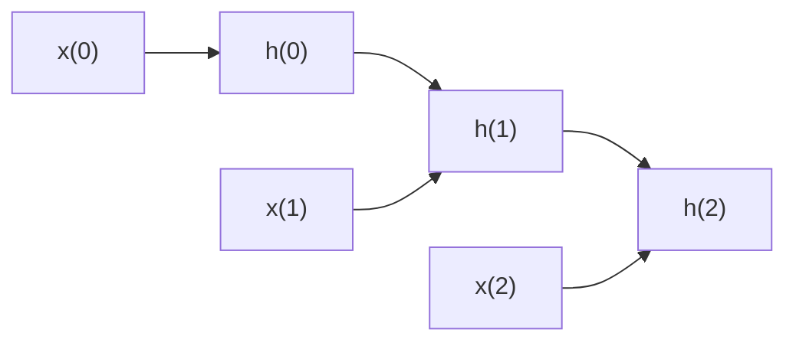
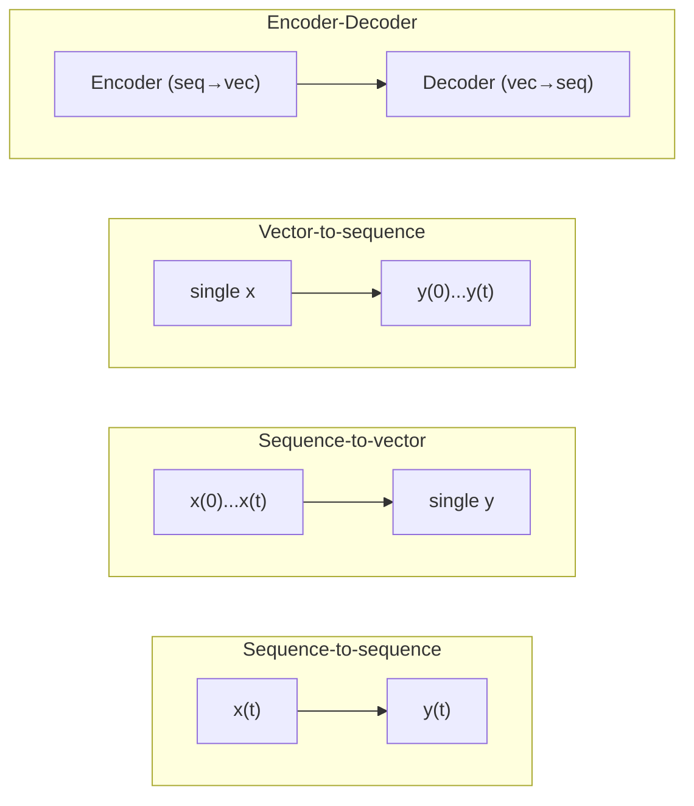

## Why RNNs exist

Many problems are sequential — the **order** of the data carries meaning:

- text (a sentence read word by word)
- time series (a stock price read day by day)
- audio (a waveform read sample by sample)

A regular feedforward network (MLP, CNN) expects a single fixed-size input and has
no notion of "what came before." An RNN processes a sequence **one step at a time**
and carries a hidden state forward, so it can use what it has already seen to
interpret what comes next.



## Recurrent neurons

The simplest possible RNN is a single neuron that receives an input, produces an
output, and **feeds that output back to itself** at the next time step. At time
step `t`, the neuron receives both the current input `x(t)` and its own previous
output `y(t-1)`. Since there's no previous output at `t = 0`, that value is usually
just set to 0.

If you draw this same tiny network once per time step, laid out left to right
against a time axis, you get an **unrolled** view of the network — this is the
mermaid diagram above. It's still the *same* neuron and the *same* weights; we're
just visualizing it once per step.

For a whole layer of recurrent neurons, every neuron receives the full input
vector `x(t)` **and** the whole layer's output vector from the previous step
`y(t-1)`. In matrix form, for a mini-batch:

`Y(t) = φ(X(t)·Wx + Y(t-1)·Wy + b)`

- `Wx` — weights for the current inputs
- `Wy` — weights for the previous outputs (the recurrent connections)
- `b` — bias vector
- `φ` — activation function (RNNs typically default to `tanh`)

## Memory cells

Because the output of a recurrent neuron at step `t` is a function of every input
that came before it, it has a form of **memory**. Any part of a network that
preserves state across time steps is called a **memory cell** (or just a "cell").

A single recurrent neuron, or a basic layer of them, can only learn fairly short
patterns — typically around 10 steps, though this varies by task. Later pages in
this phase cover cells built specifically to remember much longer patterns:
**LSTM** and **GRU**.

Note that a cell's **hidden state** `h(t)` and its **output** `y(t)` aren't
necessarily the same thing. In the simplest RNN cell they're equal, but in more
advanced cells (like LSTM) the state carries more information than what actually
gets output at that step.

## Seeing the recurrence in plain NumPy

*Deep Learning with Python* (Chollet) makes the same idea concrete with a bare
NumPy loop and no framework at all: an RNN is really nothing more than a `for`
loop that reuses the output of its previous iteration as extra input to the
current one.

```python title="naive_rnn_numpy.py" showLineNumbers{1}
import numpy as np

timesteps = 100        # steps in the input sequence
input_features = 32    # size of each input vector
output_features = 64   # size of the hidden state / output vector

inputs = np.random.random((timesteps, input_features))
state_t = np.zeros((output_features,))          # initial state: all zeros

Wx = np.random.random((output_features, input_features))
Wy = np.random.random((output_features, output_features))
b = np.random.random((output_features,))

successive_outputs = []
for input_t in inputs:
    output_t = np.tanh(np.dot(Wx, input_t) + np.dot(Wy, state_t) + b)
    successive_outputs.append(output_t)
    state_t = output_t                          # this step's output becomes next step's state

final_output_sequence = np.stack(successive_outputs, axis=0)
print(final_output_sequence.shape)   # (100, 64) - one 64-d output per time step
```

This is exactly the matrix formula from the previous section — `Wx` is the book's
`W`, `Wy` is `U` — just written out as a loop you can run and inspect. Nothing
here is Keras-specific; `keras.layers.SimpleRNN` does this same loop internally,
batched and on the GPU.

:::tip[From the book]
*Deep Learning with Python* (Chollet) sums up an RNN in one line: "a for loop
that reuses quantities computed during the previous iteration of the loop,
nothing more." Every variant covered in this phase — LSTM, GRU, stacked and
bidirectional RNNs — is still that same loop, just with a fancier step function.
:::

## Input and output sequence shapes

Not every RNN needs to consume a sequence *and* produce a sequence — the book
describes four common shapes:



- **Sequence-to-sequence** — feed in `N` values, get `N` values out. Good for
  forecasting: feed the last `N` days of prices, get tomorrow's prices for each
  of those days shifted by one.
- **Sequence-to-vector** — feed in a whole sequence, keep only the *last* output.
  Good for sentiment analysis: feed in a movie review word by word, output one
  score at the end.
- **Vector-to-sequence** — feed the *same* input at every step, get a sequence
  out. Good for image captioning: feed an image's feature vector repeatedly,
  output a caption one word at a time.
- **Encoder-Decoder** — a sequence-to-vector "encoder" feeds its final vector
  into a vector-to-sequence "decoder." Used for translation: encode the whole
  sentence first, *then* decode it into another language, since the last words
  of the input can change the first words of the translation.

## Training RNNs: backpropagation through time

To train an RNN, you unroll it through time (as above) and then run ordinary
backpropagation on the unrolled graph. This is called **backpropagation through
time (BPTT)**. A forward pass computes every output; a cost function evaluates
some or all of those outputs; and gradients flow backward through every output
that fed into the cost, then sum up across time steps because the same weights
`Wx`, `Wy`, and `b` are reused at every step. tf.keras handles all of this for you.

Because the same weights are reused at every step, an unrolled RNN behaves like
an extremely deep feedforward network — which means it can run into the same
**unstable gradients** problem covered for deep nets in general: gradients that
shrink toward zero (vanishing) as they're pushed back through many time steps,
or blow up (exploding) and send training to `NaN`. If training loss barely
moves, or swings wildly instead of settling down, that's the symptom to look
for. A quick lever is **gradient clipping** — passing `clipnorm` or `clipvalue`
to the optimizer caps how large a single gradient update can be. The **Advanced
Recurrent Layers** page later in this phase covers a more targeted fix built for
recurrent nets specifically — layer normalization — alongside recurrent dropout
and stacking.

## A tiny RNN in tf.keras

```python title="simple_rnn.py" showLineNumbers{1}
import numpy as np
import tensorflow as tf
from tensorflow import keras

# Toy sequence: 4 samples, 5 time steps, 1 feature per step
X = np.array([
    [[0.0], [0.1], [0.2], [0.3], [0.4]],
    [[0.1], [0.2], [0.3], [0.4], [0.5]],
    [[0.2], [0.3], [0.4], [0.5], [0.6]],
    [[0.3], [0.4], [0.5], [0.6], [0.7]],
], dtype="float32")
y = np.array([0.5, 0.6, 0.7, 0.8], dtype="float32")  # next value in the pattern

model = keras.models.Sequential([
    keras.layers.SimpleRNN(1, input_shape=[None, 1]),
])

model.compile(loss="mse", optimizer="adam")
model.fit(X, y, epochs=200, verbose=0)

print("Predictions:", model.predict(X, verbose=0).ravel())
```

`input_shape=[None, 1]` means "any number of time steps, 1 feature per step." An
RNN layer doesn't need to know the sequence length in advance — that's one of its
biggest advantages over a plain `Dense` layer.

### Picking a shape with `return_sequences`

Every recurrent layer in tf.keras can run in two modes, controlled by the
`return_sequences` argument — this is the code-level switch for the
sequence-to-vector vs. sequence-to-sequence choice described above:

- `return_sequences=False` (the **default**) — keep only the *last* time step's
  output: shape `(batch_size, units)`. Good for sequence-to-vector tasks.
- `return_sequences=True` — keep *every* time step's output: shape
  `(batch_size, timesteps, units)`. Needed whenever the next layer is also
  recurrent (see the deep RNN on the next page), or for sequence-to-sequence
  tasks.

```python title="return_sequences_shapes.py" showLineNumbers{1}
from tensorflow import keras

inputs = keras.Input(shape=(120, 14))
last_only = keras.layers.SimpleRNN(16)(inputs)                       # (None, 16)
full_sequence = keras.layers.SimpleRNN(16, return_sequences=True)(inputs)  # (None, 120, 16)

print(last_only.shape)
print(full_sequence.shape)
```

## Mini-checkpoint

What kind of data is best suited for RNN-like architectures?

- sequences where **order matters** and the length can vary.

:::tip[From the book]
*Hands-On Machine Learning* (Géron) points out that a single recurrent neuron
with just one hidden unit has only **3 parameters total** (one weight for the
input, one for the previous output, one bias) — yet it can already do better
than a "naive" forecast that just repeats the last value. That's the whole
appeal of recurrence: a tiny number of shared weights, reused at every time step,
lets the model see arbitrarily long sequences without the parameter count
exploding.
:::

## Visualize it

Watch a single recurrent neuron process a sequence one step at a time. At each
step it combines the new input with the hidden state carried over from the
previous step — the glowing line shows that state flowing forward:

```p5 title="RNN unrolled through time" desc="Each box is the same recurrent neuron at a different time step; the glowing pulse is the hidden state flowing forward from step to step." height="260"
let t = 0;
const steps = 5;
const stepDur = 55;   // frames for the pulse to travel one box -> the next
const holdDur = 45;   // frames to hold at the last box before looping
const cycleLen = (steps - 1) * stepDur + holdDur;

function setup() {
  createCanvas(600, 260);
  textFont("monospace");
  textAlign(CENTER, CENTER);
}
function boxX(i) { return 70 + i * ((width - 140) / (steps - 1)); }
function smoothstep(x) {
  x = constrain(x, 0, 1);
  return x * x * (3 - 2 * x);
}
function draw() {
  background(13, 17, 23);
  const cy = 150, boxY = 90, r = 26;

  const cyclePos = t % cycleLen;
  // fade near the loop seam so the restart from box 0 is invisible
  const fade = min(smoothstep(cyclePos / 18), smoothstep((cycleLen - cyclePos) / 18));

  // continuous 0..(steps-1) position of the hidden state as it travels forward
  const travel = constrain(cyclePos / stepDur, 0, steps - 1);
  const fromBox = floor(min(travel, steps - 2));
  const localP = smoothstep(travel - fromBox);

  // connection lines glow as the pulse crosses each one
  for (let i = 0; i < steps - 1; i++) {
    const glowAmt = constrain(1 - abs(travel - (i + 0.5)) * 2, 0, 1);
    stroke(lerpColor(color(60, 70, 84), color(255, 211, 67), glowAmt));
    strokeWeight(lerp(1.5, 3, glowAmt));
    line(boxX(i) + r, boxY, boxX(i + 1) - r, boxY);
  }

  // boxes glow as the hidden state passes through them
  for (let i = 0; i < steps; i++) {
    const glow = constrain(1 - abs(travel - i), 0, 1);

    stroke(lerpColor(color(60, 70, 84), color(107, 169, 221), glow));
    strokeWeight(lerp(1.5, 2.5, glow));
    line(boxX(i), cy + 30, boxX(i), boxY + r);

    noStroke();
    fill(lerpColor(color(75, 139, 190), color(255, 211, 67), glow));
    ellipse(boxX(i), boxY, r * 2 + glow * 8, r * 2 + glow * 8);
    fill(20);
    textSize(11);
    text("h(" + i + ")", boxX(i), boxY);
    fill(150);
    textSize(11);
    text("x(" + i + ")", boxX(i), cy + 42);
  }

  // the traveling hidden-state pulse itself, riding the active connection
  if (fromBox < steps - 1) {
    const pulseX = lerp(boxX(fromBox), boxX(fromBox + 1), localP);
    noStroke();
    fill(255, 211, 67);
    ellipse(pulseX, boxY, 10, 10);
  }

  fill(107, 169, 221);
  textSize(13);
  text("step t = " + floor(min(travel, steps - 1)) + "  —  hidden state carries forward →", width / 2, 220);

  // dim to background right at the loop seam so the restart is invisible
  noStroke();
  fill(13, 17, 23, (1 - fade) * 255);
  rect(0, 0, width, height);

  t++;
}
```

import DataCampExercise from "../../../../components/DataCampExercise.astro";

## 🧪 Try It Yourself

### Exercise 1 – Build a SimpleRNN Layer

<DataCampExercise
  lang="python"
  hint={`Use \`keras.layers.SimpleRNN(units, input_shape=[None, 1])\` as the only layer.`}
  code={`# Task: Exercise 1 – Build a SimpleRNN Layer
from tensorflow import keras

model = keras.models.Sequential([
    keras.layers.___(1, input_shape=[None, 1])   # replace ___ with SimpleRNN
])
model.compile(loss="mse", optimizer="adam")
print(model.layers[0].__class__.__name__)

# ── Expected Output ───────────────────────────────────────────
# SimpleRNN
# ──────────────────────────────────────────────────────────────`}
  solution={`from tensorflow import keras

model = keras.models.Sequential([
    keras.layers.SimpleRNN(1, input_shape=[None, 1])
])
model.compile(loss="mse", optimizer="adam")
print(model.layers[0].__class__.__name__)`}
  sct={`test_output_contains("SimpleRNN")
success_msg("You built your first recurrent layer!")`}
  height={148}
/>

### Exercise 2 – Shape a Sequence for an RNN

<DataCampExercise
  lang="python"
  hint={`RNN inputs need shape [batch_size, time_steps, features]. Use \`.reshape(4, 5, 1)\`.`}
  code={`# Task: Exercise 2 – Shape a Sequence for an RNN
import numpy as np

flat = np.arange(20)                 # 20 numbers
X = flat.___(4, 5, 1)                # replace ___ with reshape
print("Shape:", X.shape)

# ── Expected Output ───────────────────────────────────────────
# Shape: (4, 5, 1)
# ──────────────────────────────────────────────────────────────`}
  solution={`import numpy as np

flat = np.arange(20)
X = flat.reshape(4, 5, 1)
print("Shape:", X.shape)`}
  sct={`test_output_contains("Shape: (4, 5, 1)")
success_msg("That's [batch_size, time_steps, features] — exactly what an RNN expects!")`}
  height={138}
/>

### Exercise 3 – Sequence-to-Vector Prediction

<DataCampExercise
  lang="python"
  hint={`A sequence-to-vector RNN keeps only the last output — call \`model.predict(X)\` and check the output shape.`}
  code={`# Task: Exercise 3 – Sequence-to-Vector Prediction
import numpy as np
from tensorflow import keras

X = np.random.rand(3, 5, 1).astype("float32")

model = keras.models.Sequential([
    keras.layers.SimpleRNN(4, input_shape=[None, 1]),
    keras.layers.___(1)     # replace ___ with Dense
])
model.compile(loss="mse", optimizer="adam")
preds = model.predict(X, verbose=0)
print("Output shape:", preds.shape)

# ── Expected Output ───────────────────────────────────────────
# Output shape: (3, 1)
# ──────────────────────────────────────────────────────────────`}
  solution={`import numpy as np
from tensorflow import keras

X = np.random.rand(3, 5, 1).astype("float32")

model = keras.models.Sequential([
    keras.layers.SimpleRNN(4, input_shape=[None, 1]),
    keras.layers.Dense(1)
])
model.compile(loss="mse", optimizer="adam")
preds = model.predict(X, verbose=0)
print("Output shape:", preds.shape)`}
  sct={`test_output_contains("Output shape: (3, 1)")
success_msg("One vector per sequence — that's sequence-to-vector!")`}
  height={158}
/>

## Next

Continue to **LSTM & GRU Networks** — see how gated cells solve the short-term
memory problem that plain recurrent neurons run into on longer sequences.
