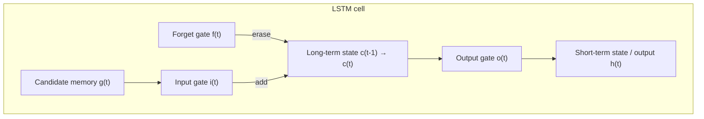
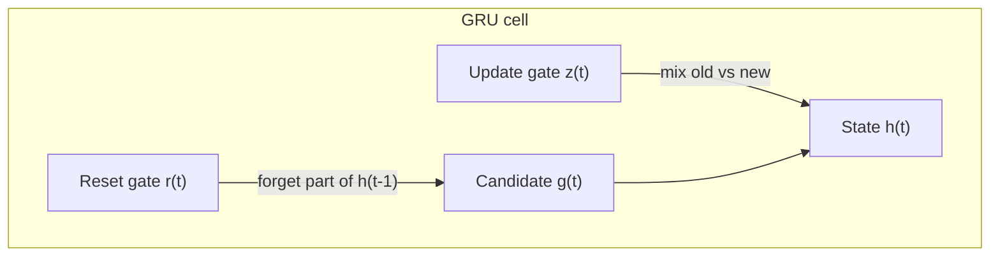

## The short-term memory problem

Every time data passes through a plain RNN cell, some information gets lost. By
the time the network has read a long sequence, its hidden state barely remembers
the earliest inputs — imagine trying to translate a long sentence but forgetting
how it started by the time you reach the end. Plain (`SimpleRNN`) cells are
usually only good for patterns spanning around 10 steps.

To fix this, researchers introduced cells with an explicit **long-term memory**
alongside the usual short-term state. These cells have been so successful that
plain RNN cells are rarely used anymore. The most popular is the **LSTM cell**.

## LSTM: Long Short-Term Memory

An LSTM cell looks like a regular cell from the outside, but its state is split
into two vectors:

- **`h(t)`** — the short-term state (like a regular RNN's hidden state)
- **`c(t)`** — the long-term state (the "cell" state — hence LSTM)

Internally, the network learns **what to store**, **what to forget**, and **what
to read** from the long-term state, using three gates:



- **Forget gate `f(t)`** — controls which parts of the long-term state get erased.
- **Input gate `i(t)`** — controls which parts of the new candidate memory `g(t)`
  get added to the long-term state.
- **Output gate `o(t)`** — controls which parts of the (updated) long-term state
  get read out as this step's short-term state / output.

All three gates use a **sigmoid** activation, so their outputs range from 0 to 1
— think of them as "how much to let through," multiplied element-wise against the
state. A gate outputting near 0 closes; near 1 it opens.

In short: the input gate decides what's worth remembering, the forget gate
decides what to let go of, and the output gate decides what's relevant *right
now*. That's what lets an LSTM carry information across far more time steps than
a plain RNN cell.

:::tip[From the book]
*Deep Learning with Python* (Chollet) pictures the long-term state `c(t)` as a
conveyor belt running parallel to the sequence: information can hop onto the
belt at any timestep, ride along untouched, and hop off later exactly when it's
needed. That's the whole point of the extra carry track — it stops older
signals from gradually washing out the way they do in a plain `SimpleRNN`.
:::

In tf.keras, swapping a `SimpleRNN` for an `LSTM` is a one-line change:

```python title="lstm_swap.py" showLineNumbers{1}
from tensorflow import keras

model = keras.models.Sequential([
    keras.layers.LSTM(20, return_sequences=True, input_shape=[None, 1]),
    keras.layers.LSTM(20, return_sequences=True),
    keras.layers.TimeDistributed(keras.layers.Dense(10)),
])
model.compile(loss="mse", optimizer="adam")
model.summary()
```

Keras also lets you build cells manually with `keras.layers.RNN`, e.g.
`keras.layers.RNN(keras.layers.LSTMCell(20), ...)` — useful when you want a
custom cell, but for standard use the `LSTM` layer is preferred since it uses an
optimized implementation on GPU.

## GRU: Gated Recurrent Unit

The **Gated Recurrent Unit (GRU)** cell is a simplified LSTM that tends to
perform just as well, which is part of why it's popular:

- the short-term and long-term states are **merged into a single vector `h(t)`**
- a **single gate controller `z(t)`** handles both forgetting and remembering:
  wherever it opens the input gate, it closes the forget gate, and vice versa —
  a memory slot gets erased right before it's overwritten
- there's **no output gate** — the full state is output at every time step
- a new **reset gate `r(t)`** controls how much of the previous state is shown to
  the main "candidate memory" layer



Switching to a GRU is, again, just a layer swap:

```python title="gru_swap.py" showLineNumbers{1}
from tensorflow import keras

model = keras.models.Sequential([
    keras.layers.GRU(20, return_sequences=True, input_shape=[None, 1]),
    keras.layers.GRU(20, return_sequences=True),
    keras.layers.TimeDistributed(keras.layers.Dense(10)),
])
model.compile(loss="mse", optimizer="adam")
model.summary()
```

## LSTM vs. GRU vs. SimpleRNN

| Cell | State | Gates | Typical use |
| --- | --- | --- | --- |
| `SimpleRNN` | single `h(t)` | none | short sequences, quick baselines |
| `LSTM` | `h(t)` + `c(t)` | forget, input, output | long sequences, most reliable default |
| `GRU` | single `h(t)` | update, reset | similar accuracy to LSTM, fewer parameters |

Both LSTM and GRU still struggle with *very* long sequences (100+ steps, like raw
audio) — for those, later architectures mix in 1D convolutions or, ultimately,
Transformers.

:::note
On a GPU, `LSTM`/`GRU` layers with default arguments automatically use NVIDIA's
highly-optimized cuDNN kernel — fast, but inflexible. Settings like
`recurrent_dropout` or `unroll=True` (see the next page) aren't supported by
that kernel, so adding them forces TensorFlow to fall back to a slower,
non-cuDNN implementation. In practice, small recurrent models like the ones in
this phase are often *faster on a multicore CPU* anyway, since their matrix
multiplications are tiny and the timestep loop doesn't parallelize well on GPU.
:::

## Mini-checkpoint

Why does an LSTM need both a forget gate and an input gate instead of just one?

- because forgetting old information and adding new information are separate
  decisions — you might want to keep everything *and* add something new, or
  clear space *without* adding anything yet.

:::tip[From the book]
*Hands-On Machine Learning* (Géron) sums up the LSTM cell as learning three
things at once: **recognize** an important input (the input gate's job), **store**
it in the long-term state, **preserve** it for as long as it's needed (the forget
gate's job), and **extract** it whenever it's needed (the output gate's job).
That's exactly why LSTM cells are so good at capturing long-term patterns in time
series, long texts, and audio.
:::

## Visualize it

Watch the three LSTM gates act on the long-term state `c(t)` as it flows left to
right. The forget gate trims the incoming memory, the input gate blends in new
information, and the output gate decides how much of the result becomes this
step's output:

```p5 title="LSTM gate flow" desc="The blue packet is the long-term state c(t) flowing left to right; it shrinks or grows as the forget and input gates open and close, and h(t) trickles out through the output gate." height="280"
let t = 0;
function setup() {
  createCanvas(600, 280);
  textFont("monospace");
  textAlign(CENTER, CENTER);
}
function gateOpen(phase, offset) {
  return 0.5 + 0.5 * sin(phase * TWO_PI + offset);
}
function smoothstep(x) {
  x = constrain(x, 0, 1);
  return x * x * (3 - 2 * x);
}
function draw() {
  background(13, 17, 23);
  const cy = 140;
  const phase = (t % 300) / 300;

  // long-term state line
  stroke(90, 100, 114);
  strokeWeight(2);
  line(56, cy, width - 56, cy);

  const gates = [
    { x: 160, label: "forget f(t)", offset: 0 },
    { x: 320, label: "input i(t)", offset: 1.4 },
    { x: 480, label: "output o(t)", offset: 2.8 },
  ];
  const opens = gates.map((g) => gateOpen(phase, g.offset));

  // the long-term state c(t), continuously flowing left -> right
  const framePos = t % 240;
  const travelPhase = framePos / 240;
  const packetX = lerp(56, width - 56, travelPhase);
  // fade the packet in/out right at the loop seam so its reset is invisible
  const packetFade = min(smoothstep(framePos / 15), smoothstep((240 - framePos) / 15));

  let packetSize = 24;
  for (let i = 0; i < gates.length; i++) {
    if (i === 2) continue; // the output gate reads state, it doesn't resize it
    const dist = abs(packetX - gates[i].x);
    const influence = constrain(1 - dist / 55, 0, 1);
    const target = i === 0 ? lerp(10, 24, opens[i]) : lerp(packetSize, packetSize + 16, opens[i]);
    packetSize = lerp(packetSize, target, influence);
  }

  for (const g of gates) {
    const open = gateOpen(phase, g.offset);
    noStroke();
    fill(lerpColor(color(90, 40, 40), color(255, 211, 67), open));
    rectMode(CENTER);
    rect(g.x, cy, 46, 46, 8);
    fill(20);
    textSize(10);
    text(nf(open, 1, 2), g.x, cy);
    fill(200);
    textSize(11);
    text(g.label, g.x, cy + 46);
  }

  // draw the flowing state packet on top of / between the gates
  noStroke();
  fill(75, 139, 190, 235 * packetFade);
  ellipse(packetX, cy, packetSize, packetSize);

  // h(t) trickles out through the output gate whenever it's open
  const outOpen = opens[2];
  stroke(255, 211, 67, outOpen * 220);
  strokeWeight(2);
  line(gates[2].x, cy + 23, gates[2].x, cy + 80);
  noStroke();
  fill(255, 211, 67, outOpen * 255);
  ellipse(gates[2].x, cy + 80, 8 + outOpen * 6, 8 + outOpen * 6);
  fill(150);
  textSize(10);
  text("h(t) out", gates[2].x, cy + 96);

  fill(107, 169, 221);
  noStroke();
  ellipse(56, cy, 14, 14);
  ellipse(width - 56, cy, 14, 14);
  textSize(11);
  fill(150);
  text("c(t-1)", 56, cy - 26);
  text("c(t)", width - 56, cy - 26);

  fill(107, 169, 221);
  textSize(13);
  text("blue packet = long-term state c(t) flowing through the gates", width / 2, 30);
  t++;
}
```

import DataCampExercise from "../../../../components/DataCampExercise.astro";

## 🧪 Try It Yourself

### Exercise 1 – Build an LSTM Layer

<DataCampExercise
  lang="python"
  hint={`Use \`keras.layers.LSTM(units, return_sequences=True, input_shape=[None, 1])\`.`}
  code={`# Task: Exercise 1 – Build an LSTM Layer
from tensorflow import keras

model = keras.models.Sequential([
    keras.layers.___(20, return_sequences=True, input_shape=[None, 1])  # replace ___ with LSTM
])
model.compile(loss="mse", optimizer="adam")
print(model.layers[0].__class__.__name__)

# ── Expected Output ───────────────────────────────────────────
# LSTM
# ──────────────────────────────────────────────────────────────`}
  solution={`from tensorflow import keras

model = keras.models.Sequential([
    keras.layers.LSTM(20, return_sequences=True, input_shape=[None, 1])
])
model.compile(loss="mse", optimizer="adam")
print(model.layers[0].__class__.__name__)`}
  sct={`test_output_contains("LSTM")
success_msg("LSTM layer built - it now has a long-term and short-term state!")`}
  height={148}
/>

### Exercise 2 – Swap in a GRU

<DataCampExercise
  lang="python"
  hint={`GRU is a drop-in replacement for LSTM/SimpleRNN: \`keras.layers.GRU(units, ...)\`.`}
  code={`# Task: Exercise 2 – Swap in a GRU
from tensorflow import keras

model = keras.models.Sequential([
    keras.layers.___(20, return_sequences=True, input_shape=[None, 1]),  # replace ___ with GRU
    keras.layers.___(20),                                                # replace ___ with GRU
])
model.compile(loss="mse", optimizer="adam")
print([layer.__class__.__name__ for layer in model.layers])

# ── Expected Output ───────────────────────────────────────────
# ['GRU', 'GRU']
# ──────────────────────────────────────────────────────────────`}
  solution={`from tensorflow import keras

model = keras.models.Sequential([
    keras.layers.GRU(20, return_sequences=True, input_shape=[None, 1]),
    keras.layers.GRU(20),
])
model.compile(loss="mse", optimizer="adam")
print([layer.__class__.__name__ for layer in model.layers])`}
  sct={`test_output_contains("['GRU', 'GRU']")
success_msg("Two stacked GRU layers - a simplified alternative to LSTM!")`}
  height={158}
/>

### Exercise 3 – Count Cell Parameters

<DataCampExercise
  lang="python"
  hint={`Build the model, then call \`model.count_params()\` to see how many weights the gates add.`}
  code={`# Task: Exercise 3 – Count Cell Parameters
from tensorflow import keras

model = keras.models.Sequential([
    keras.layers.LSTM(4, input_shape=[None, 1]),
])
model.build()
total = model.___()   # replace ___ with count_params
print("Total params:", total)

# ── Expected Output ───────────────────────────────────────────
# Total params: 96
# ──────────────────────────────────────────────────────────────`}
  solution={`from tensorflow import keras

model = keras.models.Sequential([
    keras.layers.LSTM(4, input_shape=[None, 1]),
])
model.build()
total = model.count_params()
print("Total params:", total)`}
  sct={`test_output_contains("Total params: 96")
success_msg("An LSTM cell has 4x the parameters of a SimpleRNN cell - one set per gate!")`}
  height={158}
/>

## Next

Continue to **Time Series Forecasting with RNNs** — put LSTM and GRU cells to
work forecasting real sequences, and see how they compare against simple
baselines.
