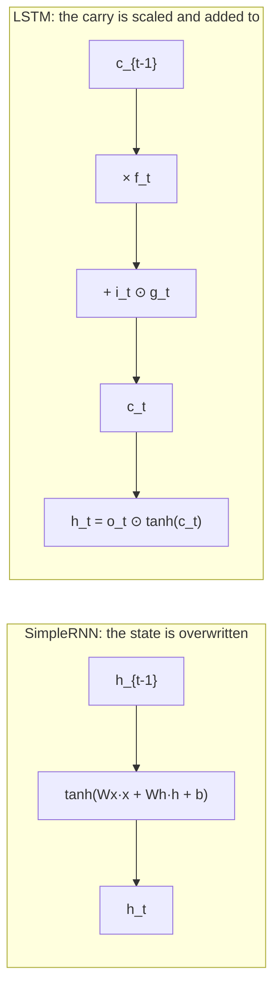

import DataCampExercise from "../../../../components/DataCampExercise.astro";
import Figure from "../../../../components/Figure.astro";
import Quiz from "../../../../components/Quiz.astro";

The [previous page](/deep-learning/phase-04---sequence-models-with-rnns/intro-to-recurrent-neural-networks-rnn-for-sequences/)
left a `SimpleRNN(32)` at **0.5856** on IMDB — behind a bag-of-words model that has no
concept of order at all. The problem is the recurrence itself: $h_t = \tanh(W_x x_t +
W_h h_{t-1} + b)$ rewrites the *entire* state at every step, so information from step 5
has to survive 195 rewrites to reach the classifier.

Gated cells change one thing: the state is **updated additively**, under the control of
learned gates, so information can be carried unchanged for as long as the gates say so.
On the same data, same seed, same five epochs, that is worth **+0.23 accuracy**.

| Cell | Total parameters | Recurrent layer only | Best validation accuracy | Seconds |
| --- | --- | --- | --- | --- |
| `SimpleRNN(32)` | 322,113 | 2,080 | 0.5856 | 29.5 |
| `GRU(32)` | 326,369 | 6,336 | **0.8156** | 52.3 |
| `LSTM(32)` | 328,353 | 8,320 | 0.8136 | 47.9 |

Most of those parameters are the 320,000-entry embedding matrix, identical in all three.
The cells differ by 6,240 parameters and 0.23 accuracy.

## What you'll learn

- The LSTM's four gates and the GRU's three, written out — and **re-implemented in NumPy
  from a trained layer's own weights**, matching Keras to `6.56e-07`.
- Why a gate is exactly *one more weight matrix pair*: parameters scale **1 : 3 : 4**.
- What the gates actually did on a real review, including a forget gate averaging
  **0.7275** — a two-step half-life.
- The one design decision that makes it work: the **carry is scaled and added to, never
  overwritten**.
- Where GRU and LSTM differ, and how little it mattered on sentiment (0.0020) against
  how much it mattered at 80 steps (**MAE 0.0056 and 0.0107 against a SimpleRNN's
  0.2984**).
- The same long-range experiment at a smaller budget, where every cell sat at the
  do-nothing baseline and would have supported the opposite conclusion.

## The LSTM, exactly

Four gates, each a full linear layer over $x_t$ and $h_{t-1}$:

$$
\begin{aligned}
i_t &= \sigma(W_i x_t + U_i h_{t-1} + b_i) && \text{input: how much of the candidate to write} \\
f_t &= \sigma(W_f x_t + U_f h_{t-1} + b_f) && \text{forget: how much of the carry to keep} \\
g_t &= \tanh(W_g x_t + U_g h_{t-1} + b_g) && \text{candidate: what could be written} \\
o_t &= \sigma(W_o x_t + U_o h_{t-1} + b_o) && \text{output: how much of the carry to expose}
\end{aligned}
$$

$$
c_t = f_t \odot c_{t-1} + i_t \odot g_t, \qquad h_t = o_t \odot \tanh(c_t)
$$

The second line is the whole idea. The carry is built by **scaling the old value and
adding** — if $f_t \approx 1$ and $i_t \approx 0$ then $c_t = c_{t-1}$ exactly, and the
information crosses the step untouched. A `SimpleRNN` cannot express that: every step
pushes the entire state through a matrix multiply and a `tanh`.

```python title="The LSTM cell, from a trained layer's own weights"
kernel, recurrent, bias = lstm_layer.get_weights()   # (features, 4U), (U, 4U), (4U,)
h = np.zeros(units, "float32")
c = np.zeros(units, "float32")
for x in sequence:
    z = x @ kernel + h @ recurrent + bias            # all four gates in one product
    i = sigmoid(z[:units])                           # Keras packs them i, f, g, o
    f = sigmoid(z[units:2 * units])
    g = np.tanh(z[2 * units:3 * units])
    o = sigmoid(z[3 * units:])
    c = f * c + i * g
    h = o * np.tanh(c)
```

Keras stores all four gates in **one** kernel of width $4U$ so four matrix multiplies
become one — which is why the weight shapes look surprising until you know to slice them.
Run this loop against the trained layer and the final prediction agrees to **6.56e-07**
(`0.414397` by hand against `0.414398` from Keras).

That equality is the point: the equations above are not a description of what TensorFlow
does, they *are* what it does.

## What the gates cost

<Figure
  src="/images/dl/phase-04-sequences/lstm-and-gru/gate-anatomy"
  alt="Two panels. Left: parameters against units on log axes for three cells, with SimpleRNN lowest, GRU three times above it and LSTM four times above it, the three lines parallel. Right: a bar chart of weight-matrix pairs — 1 for SimpleRNN, 3 for GRU, 4 for LSTM — annotated with 2,080, 6,336 and 8,320 parameters at 32 units."
  title="Same 32-dimensional input, three cells"
  caption="The ratio is exact and structural: every gate needs its own input matrix, its own recurrent matrix and its own bias. The parameter count still does not depend on sequence length — only on width and input size — so the cost of gates is paid once, not per timestep."
/>

| Units | `SimpleRNN` | `GRU` | `LSTM` |
| --- | --- | --- | --- |
| 16 | 784 | 2,400 | 3,136 |
| 32 | 2,080 | 6,336 | 8,320 |
| 64 | 6,208 | 18,816 | 24,832 |
| 128 | 20,608 | 62,208 | 82,432 |

$$
\text{params} = G \times \left(\text{features} \times U + U^2 + U\right),
\qquad G = 1,\ 3,\ 4
$$

Keras' GRU carries a second bias vector for its reset-after variant, which is why 2,400
is a little above $3 \times 784 = 2{,}352$.

## What the gates did

Take the trained `LSTM(32)` — validation accuracy 0.8136 — and recompute every gate for
one review. This review is 68 tokens long inside a 200-step tensor, so it opens with 132
padding steps.

<Figure
  src="/images/dl/phase-04-sequences/lstm-and-gru/gate-traces"
  alt="Two stacked panels sharing a timestep axis. The top shows three gate curves: forget flat near 0.73, input near 0.52 and output near 0.51 through the padding, becoming slightly noisy after step 132. The bottom shows mean absolute carry state rising to about 1.36 and holding flat, then falling sharply after step 132 towards 0.1, with the hidden state flat at 0.41 then falling to about 0.1."
  title="One LSTM's gates, recomputed from its trained weights"
  caption="Through the 132 padding steps every gate is constant — identical input, identical gates — and the carry settles at a mean magnitude of 1.3570. When the review begins at step 132 the carry collapses to 0.4186: the cell flushes the padding-induced state and starts storing the text instead. Note what the gates are not doing: they do not detect the padding boundary, they just respond to a different input."
/>

| Signal | Mean over the padding | Mean over the text |
| --- | --- | --- |
| forget gate | 0.7215 | 0.7392 |
| input gate | 0.5199 | 0.5185 |
| output gate | 0.5467 | 0.5188 |
| carry state \|c\| | **1.3570** | 0.4186 |
| hidden state \|h\| | 0.4126 | 0.1786 |

Three honest observations:

1. **The gates barely move between padding and text** (forget 0.7215 → 0.7392). The
   states differ because the inputs differ, not because the cell recognised anything.
2. **The carry is three times larger over the padding.** Repeated identical input drives
   the additive update to a large fixed point that the first real tokens have to undo —
   the same attractor measured on the intro page, and a concrete reason to pass
   `mask_zero=True`.
3. **A mean forget gate of 0.7275 is not long-term memory.** $0.7275^{10} = 0.0412$.
   This trained cell is smoothing over a few tokens, which is what sentiment needs.
   The *capability* to hold a value for hundreds of steps is there — it is what $f
   \approx 1$ means — but this task never asked for it.

## The GRU: the same idea, one fewer gate

$$
\begin{aligned}
z_t &= \sigma(W_z x_t + U_z h_{t-1} + b_z) && \text{update: interpolate old and new} \\
r_t &= \sigma(W_r x_t + U_r h_{t-1} + b_r) && \text{reset: how much history the candidate sees} \\
\tilde{h}_t &= \tanh(W_h x_t + U_h (r_t \odot h_{t-1}) + b_h) \\
h_t &= (1 - z_t) \odot h_{t-1} + z_t \odot \tilde{h}_t
\end{aligned}
$$

| | LSTM | GRU |
| --- | --- | --- |
| states carried | two ($h$ and $c$) | one ($h$) |
| gates | 4 | 3 |
| parameters at 32 units | 8,320 | 6,336 |
| keep vs write | independent ($f$, $i$) | **coupled** ($z$, $1-z$) |
| measured here | 0.8136 in 47.9s | **0.8156** in 52.3s |

The coupling is the real difference: a GRU cannot both keep the old value *and* write the
new one, because its two weights sum to 1. An LSTM can. In exchange the GRU is 24%
smaller, and here it scored 0.0020 higher — comfortably inside seed noise. **Try both.**



## Where all three still failed

The long-range test is the **adding problem**: uniform values with two marked positions —
one near the start, one in the second half — and the target is the sum of the two marked
values. Carrying a number the length of the sequence is the entire task, and predicting
the mean sum of 1.0 is the do-nothing baseline.

<Figure
  src="/images/dl/phase-04-sequences/lstm-and-gru/three-cells"
  alt="Two panels. Left: bars of best IMDB validation accuracy — SimpleRNN 0.5856, GRU 0.8156, LSTM 0.8136 — each annotated with its parameter count and training time. Right: validation MAE per epoch on the adding problem at 80 steps, where the GRU and LSTM curves fall to near zero while the SimpleRNN curve stays close to the dashed do-nothing baseline."
  title="Short-range and long-range, the same three cells"
  caption="Two different arguments for gates. On IMDB (left) they are worth +0.23 accuracy for 3-4x the recurrent parameters. On the adding problem at 80 steps (right) they are worth the difference between working and not working at all: the GRU reached MAE 0.0056 and the LSTM 0.0107, while the SimpleRNN managed 0.2984 against a baseline of 0.3324 — a tenth of the way from doing nothing to solving it."
/>

At 32 units and 80 epochs, the separation is total:

| Cell | Recurrent parameters | Adding-problem MAE | Against the 0.3324 baseline |
| --- | --- | --- | --- |
| `SimpleRNN(32)` | 1,153 | 0.2984 | +0.0340 |
| **`GRU(32)`** | 3,489 | **0.0056** | **+0.3268** |
| `LSTM(32)` | 4,513 | **0.0107** | +0.3217 |

### The same experiment at a smaller budget said the opposite

The first version of this measurement used 16 units and 20 epochs:

| Cell | Adding-problem MAE | Baseline |
| --- | --- | --- |
| `SimpleRNN(16)` | 0.3333 | 0.3324 |
| `GRU(16)` | 0.3005 | 0.3324 |
| `LSTM(16)` | 0.3328 | 0.3324 |

**All three sat at "predict the mean".** Had the page stopped there it would have
concluded that gates do not help with long-range dependency — the exact opposite of what
the same code shows with four times the epochs. The adding problem is slow to crack, and
a cell scoring at the baseline has not been shown to be incapable, only untrained. That
failure is kept here on purpose, because it is the easiest way to publish a confidently
wrong result.

```p5 title="The carry state under a forget gate" desc="Set the forget gate and watch how long one written memory survives. The trained LSTM's measured mean was 0.7275." height="330"
let forget = 0.73;
let dragging = false;
const STEPS = 30;
function setup() {
  createCanvas(620, 330);
  textFont("monospace");
}
function draw() {
  background(13, 17, 23);
  const values = [1.0];
  for (let t = 1; t <= STEPS; t++) values.push(values[t - 1] * forget);
  const x = (t) => 50 + (t / STEPS) * 520;
  const y = (v) => 210 - v * 150;
  stroke(60, 70, 84);
  line(50, y(0), 570, y(0));
  line(50, y(1), 570, y(1));
  line(50, y(0.5), 570, y(0.5));
  noStroke();
  fill(120, 130, 145);
  textSize(9);
  textAlign(RIGHT, CENTER);
  text("1.0", 46, y(1));
  text("0.5", 46, y(0.5));
  text("0", 46, y(0));
  for (let t = 0; t <= STEPS; t++) {
    const v = values[t];
    fill(107, 169, 221, 60 + v * 195);
    rect(x(t) - 6, y(v), 12, y(0) - y(v));
  }
  stroke(255, 211, 67);
  strokeWeight(1.8);
  noFill();
  beginShape();
  for (let t = 0; t <= STEPS; t++) vertex(x(t), y(values[t]));
  endShape();
  strokeWeight(1);
  noStroke();
  fill(230);
  textSize(11.5);
  textAlign(LEFT, TOP);
  text("c_t = f · c_{t-1}   with nothing written after step 0", 50, 24);
  let halfLife = 0;
  while (halfLife < STEPS && values[halfLife] > 0.5) halfLife++;
  fill(255, 211, 67);
  text("after " + STEPS + " steps: " + values[STEPS].toFixed(6), 50, 240);
  text("half-life: " + (forget >= 0.999 ? "essentially never decays"
    : halfLife + " steps"), 50, 258);
  fill(150);
  textSize(10.5);
  text("measured mean forget gate on the trained LSTM: 0.7275", 50, 280);
  text("0.7275^10 = " + Math.pow(0.7275, 10).toFixed(4)
    + " — that cell is smoothing, not storing", 50, 294);
  fill(60, 70, 84);
  rect(50, 314, 300, 4, 2);
  fill(255, 211, 67);
  circle(50 + forget * 300, 316, 13);
  fill(200);
  textSize(10);
  text("forget gate " + forget.toFixed(3), 364, 310);
}
function mousePressed() { if (Math.abs(mouseY - 316) < 12) dragging = true; }
function mouseDragged() {
  if (dragging) forget = Math.min(Math.max((mouseX - 50) / 300, 0), 1);
}
function mouseReleased() { dragging = false; }
```

Drag the gate to 1.0 and the memory never decays. That is the regime the LSTM was
designed for, and it is why Keras initialises the **forget-gate bias to 1** by default
(`unit_forget_bias=True`, Exercise 6): the cell starts out keeping its carry rather than
erasing it.

```p5 title="The measured table, ranked" desc="Click a column to rank every row by it. The bars are that column's values and the highest and lowest are computed from the numbers, not written in." height="254"
let metric = 0;
const COLUMNS = ["SimpleRNN", "GRU", "LSTM"];
const ROWS = [
  ["16", 784, 2400, 3136],
  ["32", 2080, 6336, 8320],
  ["64", 6208, 18816, 24832],
  ["128", 20608, 62208, 82432]
];
function setup() {
  createCanvas(620, 254);
  textFont("monospace");
}
function fmt(v) {
  if (v === 0) { return "0"; }
  const a = Math.abs(v);
  if (a >= 1000 || a < 0.001) { return v.toExponential(2); }
  if (a >= 100) { return v.toFixed(1); }
  return v.toFixed(4);
}
function draw() {
  background(13, 17, 23);
  noStroke();
  fill(230);
  textSize(12);
  textAlign(LEFT, TOP);
  text("LSTM & GRU Networks", 26, 16);
  let x = 26;
  for (let i = 0; i < COLUMNS.length; i++) {
    const w = COLUMNS[i].length * 6.6 + 16;
    if (i === metric) { fill(255, 211, 67); } else { fill(48, 56, 68); }
    rect(x, 40, w, 22, 4);
    if (i === metric) { fill(13, 17, 23); } else { fill(180); }
    textSize(9);
    text(COLUMNS[i], x + 8, 47);
    x += w + 6;
    if (x > 500) { break; }
  }
  const values = ROWS.map((r) => r[metric + 1]);
  const lo = Math.min(...values);
  const hi = Math.max(...values);
  const span = hi - lo === 0 ? 1 : hi - lo;
  const order = ROWS.slice().sort((a, b) => b[metric + 1] - a[metric + 1]);
  for (let i = 0; i < order.length; i++) {
    const y = 78 + i * 26;
    const v = order[i][metric + 1];
    fill(160);
    textSize(9);
    text(order[i][0], 26, y + 5);
    fill(34, 40, 50);
    rect(230, y, 280, 18, 3);
    const frac = (v - lo) / span;
    if (v === hi) { fill(126, 192, 143); }
    else if (v === lo) { fill(224, 108, 117); }
    else { fill(107, 169, 221); }
    rect(230, y, Math.max(frac * 280, 3), 18, 3);
    fill(225);
    textSize(9);
    text(fmt(v), 518, y + 5);
  }
  const top = order[0];
  const bottom = order[order.length - 1];
  fill(150);
  textSize(9);
  const base = 78 + order.length * 26 + 8;
  text("highest " + COLUMNS[metric] + ": " + top[0] + " at " + fmt(top[1]),
       26, base);
  text("lowest  " + COLUMNS[metric] + ": " + bottom[0] + " at "
       + fmt(bottom[1]), 26, base + 14);
  text("bars are scaled within the chosen column - lowest is not zero", 26,
       base + 30);
}
function mousePressed() {
  let x = 26;
  for (let i = 0; i < COLUMNS.length; i++) {
    const w = COLUMNS[i].length * 6.6 + 16;
    if (mouseX > x && mouseX < x + w && mouseY > 40 && mouseY < 62) {
      metric = i;
    }
    x += w + 6;
  }
}
```

## Pitfalls

- **Assuming a gated cell fixes long range automatically.** A measured 0.7275 forget gate
  is a two-step half-life. The capability exists; whether training uses it is up to the
  task.
- **Reading a baseline-level score as "this cell cannot do it".** At 16 units and 20
  epochs all three cells sat at the adding-problem baseline; at 32 units and 80 epochs
  the GRU scored 0.0056. The first run measured the budget.
- **Choosing LSTM over GRU on principle.** 0.8136 against 0.8156 here, with the GRU 24%
  smaller.
- **Slicing the gates in the wrong order.** Keras packs one kernel of width $4U$ as
  `i, f, g, o`. Get it wrong and the cell runs silently and learns nothing sensible.
- **Ignoring what padding does to the carry.** Mean |c| was 1.3570 over the padding
  against 0.4186 over the text — pass `mask_zero=True`.
- **Paying for gates on short sequences.** At 10–20 timesteps a `SimpleRNN` is often fine
  and 3–4× cheaper.
- **Reporting a cell comparison without wall-clock.** GRU and LSTM cost roughly 1.6× a
  SimpleRNN here, and on CPU that is the number that decides your iteration speed.

## Recap

- The LSTM's four gates control an additive carry, $c_t = f_t c_{t-1} + i_t g_t$ — the
  mechanism a `SimpleRNN` lacks.
- Keras packs the gates into one kernel of width $4U$ ordered `i, f, g, o`; the NumPy
  re-implementation matched Keras to 6.56e-07.
- Parameters scale 1 : 3 : 4 — 2,080 / 6,336 / 8,320 at 32 units, independent of sequence
  length.
- On IMDB: SimpleRNN 0.5856, GRU 0.8156, LSTM 0.8136. The gates were worth +0.23.
- On the adding problem at 80 steps: GRU 0.0056, LSTM 0.0107, SimpleRNN 0.2984 against a
  0.3324 baseline — and at a quarter of the budget, all three scored at that baseline.
- Measured gate means: forget 0.7275, input 0.5192, output 0.5327; carry 1.3570 over
  padding against 0.4186 over the text.
- GRU couples keep and write; LSTM keeps them independent. The two scored within 0.0020.

## Next

Dropout that actually works on a recurrent layer, stacking, and reading a sequence
backwards:
[Advanced Recurrent Layers](/deep-learning/phase-04---sequence-models-with-rnns/advanced-recurrent-layers-dropout-stacking-bidirectional/).

<Quiz
  questions={[
    {
      q: "What does the LSTM have that a SimpleRNN does not?",
      options: [
        "A larger hidden state",
        "An additive carry update, c_t = f_t·c_{t-1} + i_t·g_t — with f near 1 and i near 0 the carry crosses a step completely unchanged",
        "A non-linear activation",
        "The ability to handle variable-length sequences",
      ],
      answer: 1,
      explain: "A SimpleRNN pushes its entire state through a matrix multiply and a tanh at every step, so nothing can pass through untouched.",
    },
    {
      q: "SimpleRNN, GRU and LSTM cost 2,080, 6,336 and 8,320 parameters at 32 units on the same input. Why that ratio?",
      options: [
        "Because gated cells use wider hidden states",
        "Because each gate is another full weight matrix pair plus a bias — one set for SimpleRNN, three for GRU, four for LSTM",
        "Because Keras stores gradients for the gates",
        "Because the LSTM carries two states",
      ],
      answer: 1,
      explain: "params = G*(features*U + U^2 + U) with G = 1, 3, 4. Keras' GRU adds a second bias vector, which is why it sits slightly above 3x.",
    },
    {
      q: "The trained LSTM's forget gate averaged 0.7275. What does that imply about its memory?",
      options: [
        "Memories are held indefinitely",
        "An untouched memory decays about 27% per step — a two-step half-life, so this cell is smoothing over a few tokens rather than storing anything long-term",
        "The cell is broken",
        "The gate should always be exactly 0.5",
      ],
      answer: 1,
      explain: "0.7275^10 = 0.0412. The capability to hold a value exists (f near 1); this task simply never needed it.",
    },
    {
      q: "On the adding problem at 16 units and 20 epochs, two of three cells scored at the do-nothing baseline. What follows?",
      options: [
        "Recurrent cells cannot solve long-range tasks",
        "Nothing about capability — the budget was too small, and a baseline-level score means untrained, not incapable",
        "The baseline was computed incorrectly",
        "The adding problem is unlearnable",
      ],
      answer: 1,
      explain: "It is the same class of error as judging batch normalisation by a run too short for its moving averages to converge.",
    },
    {
      q: "What is the practical difference between a GRU's update gate and an LSTM's input and forget gates?",
      options: [
        "The GRU's gate is not learned",
        "The GRU couples them — it interpolates with z and 1-z, so it cannot keep the old value and write a new one at once; the LSTM's f and i are independent",
        "The GRU applies its gate only at the last timestep",
        "The LSTM's gates are binary",
      ],
      answer: 1,
      explain: "That coupling is what saves the GRU a quarter of its parameters, and here it cost nothing measurable: 0.8156 against 0.8136.",
    },
  ]}
/>

## 🧪 Try It Yourself

<DataCampExercise
  lang="python"
  hint={`Each gate needs an input matrix, a recurrent matrix and a bias, so count the weights Keras allocates and compare against G*(features*U + U^2 + U).`}
  code={`# Task: Exercise 1 - Every gate is another weight matrix pair
import numpy as np
from tensorflow import keras

FEATURES = 32
CELLS = (("SimpleRNN", keras.layers.SimpleRNN, 1),
         ("GRU", keras.layers.GRU, 3),
         ("LSTM", keras.layers.LSTM, 4))

print(f"{'units':>6} " + " ".join(f"{name:>12}" for name, _, _ in CELLS))
for units in (16, 32, 64, 128):
    row = []
    for _, layer_class, _ in CELLS:
        layer = layer_class(units)
        layer.build((None, 200, FEATURES))
        row.append(int(sum(np.prod(w.shape) for w in layer.weights)))
    print(f"{units:6d} " + " ".join(f"{v:12,}" for v in row))

print()
print(f"{'cell':12s} {'gates':>6} {'formula at 32':>14} {'counted':>9}")
for name, layer_class, gates in CELLS:
    layer = layer_class(32)
    layer.build((None, 200, FEATURES))
    counted = int(sum(np.prod(w.shape) for w in layer.weights))
    formula = gates * (FEATURES * 32 + 32 * 32 + ___)   # replace ___ with 32
    print(f"{name:12s} {gates:6d} {formula:14,} {counted:9,}")
print("the GRU counts slightly above 3x because Keras carries a second bias")
print("vector for its reset-after variant")

# -- Expected Output -------------------------------------------
#  units    SimpleRNN          GRU         LSTM
#     16          784        2,400        3,136
#     32        2,080        6,336        8,320
#     64        6,208       18,816       24,832
#    128       20,608       62,208       82,432
#
# cell          gates  formula at 32   counted
# SimpleRNN         1          2,080     2,080
# GRU               3          6,240     6,336
# LSTM              4          8,320     8,320
# the GRU counts slightly above 3x because Keras carries a second bias
# vector for its reset-after variant
# --------------------------------------------------------------`}
/>

<DataCampExercise
  lang="python"
  hint={`Keras packs the four gates into one kernel of width 4*units in the order i, f, g, o. Slice them out and run c = f*c + i*g, h = o*tanh(c).`}
  code={`# Task: Exercise 2 - The LSTM cell, from its own weights
import numpy as np
from tensorflow import keras

TIMESTEPS, FEATURES, UNITS = 15, 6, 4
keras.utils.set_random_seed(0)
layer = keras.layers.LSTM(UNITS, return_sequences=True)
sequence = np.random.default_rng(0).standard_normal(
    (1, TIMESTEPS, FEATURES)).astype("float32")
keras_states = layer(sequence).numpy()[0]
kernel, recurrent, bias = layer.get_weights()
print(f"kernel {kernel.shape}  recurrent {recurrent.shape}  bias {bias.shape}")
print(f"one kernel of width 4 x {UNITS} = {4 * UNITS}: all four gates at once")


def sigmoid(z):
    return 1.0 / (1.0 + np.exp(-z))


h = np.zeros(UNITS, "float32")
c = np.zeros(UNITS, "float32")
states = []
for x in sequence[0]:
    z = x @ kernel + h @ recurrent + bias
    i = sigmoid(z[:UNITS])
    f = sigmoid(z[UNITS:2 * UNITS])
    g = np.tanh(z[2 * UNITS:3 * UNITS])
    o = sigmoid(z[3 * UNITS:])
    c = f * c + i * ___                      # replace ___ with g
    h = o * np.tanh(c)
    states.append(h.copy())
mine = np.stack(states)
print(f"max |difference| against Keras: "
      f"{float(np.abs(mine - keras_states).max()):.2e}")
print(f"final carry |c| {float(np.abs(c).mean()):.4f}  "
      f"final hidden |h| {float(np.abs(h).mean()):.4f}")
print("slice the gates in the wrong order and the cell still runs - it just")
print("learns nothing sensible, with no error to tell you")

# -- Expected Output -------------------------------------------
# kernel (6, 16)  recurrent (4, 16)  bias (16,)
# one kernel of width 4 x 4 = 16: all four gates at once
# max |difference| against Keras: 1.19e-07
# final carry |c| 0.5121  final hidden |h| 0.2853
# slice the gates in the wrong order and the cell still runs - it just
# learns nothing sensible, with no error to tell you
# --------------------------------------------------------------`}
/>

<DataCampExercise
  lang="python"
  hint={`With the forget gate at f and nothing written, the carry after n steps is f**n. The half-life solves f**n = 0.5.`}
  code={`# Task: Exercise 3 - What a forget gate is worth, in steps
import numpy as np

MEASURED = 0.7275          # the trained LSTM's mean forget gate
print(f"{'forget gate':>12} {'after 10 steps':>15} {'after 50':>10} "
      f"{'half-life':>10}")
for gate in (0.50, MEASURED, 0.90, 0.99, 0.999):
    after10 = gate ** 10
    after50 = gate ** ___                    # replace ___ with 50
    half_life = np.log(0.5) / np.log(gate)
    print(f"{gate:12.4f} {after10:15.6f} {after50:10.6f} {half_life:10.1f}")
print(f"the measured gate keeps {MEASURED ** 10:.4f} of a memory after ten")
print("steps: that cell is smoothing over a few tokens, not storing anything")
print("for the length of a review")

# -- Expected Output -------------------------------------------
#  forget gate  after 10 steps   after 50  half-life
#       0.5000        0.000977   0.000000        1.0
#       0.7275        0.041216   0.000000        2.2
#       0.9000        0.348678   0.005154        6.6
#       0.9900        0.904382   0.605006       69.0
#       0.9990        0.990045   0.951217      692.8
# the measured gate keeps 0.0412 of a memory after ten
# steps: that cell is smoothing over a few tokens, not storing anything
# for the length of a review
# --------------------------------------------------------------`}
/>

<DataCampExercise
  lang="python"
  hint={`Swap only the recurrent layer between the three models — embedding, head, seed and epochs must be identical or the comparison means nothing.`}
  code={`# Task: Exercise 4 - What the gates buy on real text
import time

import numpy as np
from tensorflow import keras

VOCAB, MAXLEN, LIMIT, EPOCHS = 10000, 200, 5000, 5
(x_train, y_train), (x_test, y_test) = keras.datasets.imdb.load_data(
    num_words=VOCAB)
pad = keras.preprocessing.sequence.pad_sequences
x_train = pad(x_train[:LIMIT], maxlen=MAXLEN)
x_test = pad(x_test[:LIMIT // 2], maxlen=MAXLEN)
y_train, y_test = y_train[:LIMIT], y_test[:LIMIT // 2]

print(f"{'cell':12s} {'recurrent params':>17} {'best val acc':>13} "
      f"{'seconds':>9}")
for name, layer_class in (("SimpleRNN", keras.layers.SimpleRNN),
                          ("GRU", keras.layers.GRU),
                          ("LSTM", keras.layers.LSTM)):
    keras.utils.set_random_seed(0)
    cell = layer_class(32)
    model = keras.Sequential([keras.layers.Input((MAXLEN,)),
                              keras.layers.Embedding(VOCAB, 32),
                              cell,
                              keras.layers.Dense(1, activation="sigmoid")])
    model.compile(keras.optimizers.Adam(1e-3), "binary_crossentropy",
                  metrics=["accuracy"])
    started = time.perf_counter()
    history = model.fit(x_train, y_train, epochs=EPOCHS, batch_size=64,
                        verbose=0, validation_data=(x_test, y_test))
    recurrent_params = int(sum(np.prod(w.shape) for w in ___.weights))
    # replace ___ with cell
    print(f"{name:12s} {recurrent_params:17,} "
          f"{max(history.history['val_accuracy']):13.4f} "
          f"{time.perf_counter() - started:9.1f}")
print("the gates are worth about +0.23 accuracy here, for 3-4x the recurrent")
print("parameters and roughly 1.6x the wall-clock")

# -- Expected Output -------------------------------------------
# cell          recurrent params  best val acc   seconds
# SimpleRNN                2,080        0.5856      29.5
# GRU                      6,336        0.8156      52.3
# LSTM                     8,320        0.8136      47.9
# the gates are worth about +0.23 accuracy here, for 3-4x the recurrent
# parameters and roughly 1.6x the wall-clock
# --------------------------------------------------------------`}
/>

<DataCampExercise
  lang="python"
  hint={`Two marked positions, one early and one late; the target is the sum of the two marked values. Always compare against predicting the mean sum of 1.0.`}
  code={`# Task: Exercise 5 - The adding problem, and its baseline
import numpy as np
from tensorflow import keras

LENGTH, ROWS, EPOCHS, UNITS = 80, 3000, 30, 32


def adding_task(length, rows, seed=0):
    rng = np.random.default_rng(seed)
    values = rng.uniform(0.0, 1.0, (rows, length)).astype("float32")
    markers = np.zeros((rows, length), "float32")
    early = rng.integers(0, max(1, length // 10), rows)
    late = rng.integers(length // 2, length, rows)
    index = np.arange(rows)
    markers[index, early] = 1.0
    markers[index, late] = 1.0
    targets = values[index, early] + values[index, ___]
    # replace ___ with late
    return np.stack([values, markers], axis=-1), targets


x, y = adding_task(LENGTH, ROWS)
x_test, y_test = adding_task(LENGTH, 1000, seed=1)
baseline = float(np.abs(y_test - 1.0).mean())
print(f"sequence length {LENGTH}, target = the sum of two marked values")
print(f"target mean {y.mean():.4f}  sd {y.std():.4f}")
print(f"predicting the mean sum of 1.0 scores MAE {baseline:.4f}")
print(f"{'cell':12s} {'best val MAE':>13} {'beats baseline by':>18}")
for name, layer_class in (("SimpleRNN", keras.layers.SimpleRNN),
                          ("GRU", keras.layers.GRU),
                          ("LSTM", keras.layers.LSTM)):
    keras.utils.set_random_seed(0)
    model = keras.Sequential([keras.layers.Input((LENGTH, 2)),
                              layer_class(UNITS),
                              keras.layers.Dense(1)])
    model.compile(keras.optimizers.Adam(3e-3), "mse", metrics=["mae"])
    history = model.fit(x, y, epochs=EPOCHS, batch_size=64, verbose=0,
                        validation_data=(x_test, y_test))
    best = min(history.history["val_mae"])
    print(f"{name:12s} {best:13.4f} {baseline - best:+18.4f}")
print("a cell sitting at the baseline has not been shown to be incapable, only")
print("untrained: raise the units and the epochs before drawing a conclusion")

# -- Expected Output -------------------------------------------
# (the baseline is about 0.33; whether a cell beats it depends heavily on the
#  budget, which is the entire point of this exercise)
# --------------------------------------------------------------`}
/>

<DataCampExercise
  lang="python"
  hint={`unit_forget_bias initialises the forget slice of the bias vector to 1 and leaves the other three at 0. Slice the bias into four equal parts to see it.`}
  code={`# Task: Exercise 6 - Why the forget bias starts at 1
import numpy as np
from tensorflow import keras

UNITS, FEATURES = 8, 4
print(f"{'unit_forget_bias':>17} {'i slice':>10} {'f slice':>10} "
      f"{'g slice':>10} {'o slice':>10}")
for flag in (True, False):
    keras.utils.set_random_seed(0)
    layer = keras.layers.LSTM(UNITS, unit_forget_bias=flag)
    layer.build((None, 20, FEATURES))
    bias = layer.get_weights()[2]
    parts = [bias[k * UNITS:(k + 1) * UNITS].mean() for k in range(___)]
    # replace ___ with 4
    print(f"{str(flag):>17} " + " ".join(f"{float(v):10.4f}" for v in parts))
print(f"sigmoid(1) = {1 / (1 + np.exp(-1)):.4f}, so with the default the cell")
print("starts out keeping about 73% of its carry per step instead of erasing")
print("it - the same reasoning as a residual connection starting near identity")

# -- Expected Output -------------------------------------------
#  unit_forget_bias    i slice    f slice    g slice    o slice
#               True     0.0000     1.0000     0.0000     0.0000
#              False     0.0000     0.0000     0.0000     0.0000
# sigmoid(1) = 0.7311, so with the default the cell
# starts out keeping about 73% of its carry per step instead of erasing
# it - the same reasoning as a residual connection starting near identity
# --------------------------------------------------------------`}
/>
