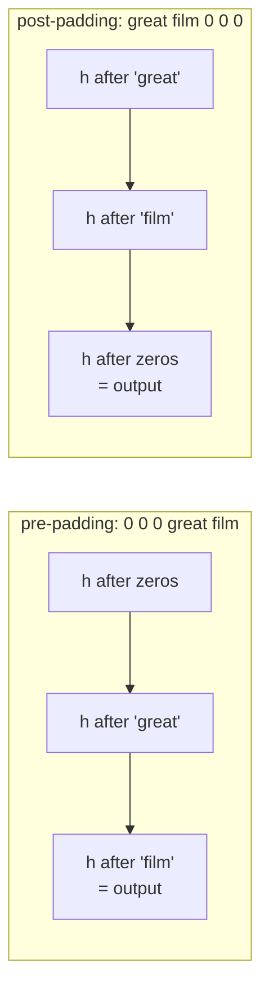

Real sequences have different lengths. Tensors do not. Every sequence model therefore
starts with a compromise — pad everything to one length — and that compromise
introduces a bug you cannot see in the loss curve, only in the score.

Here is the headline, measured on 5,000 IMDB reviews with an identical
`SimpleRNN(32)`, five epochs, four setups:

| Padding | `mask_zero` | Best validation accuracy |
| --- | --- | --- |
| pre | `False` | 0.5856 |
| pre | `True` | **0.5868** |
| post | `False` | **0.5036** |
| post | `True` | 0.5272 |

Three of those runs learn something. One of them scores **chance** on a balanced binary
task, and nothing in the code looks wrong.

## What you'll learn

- What `pad_sequences` does, and why `maxlen` is a two-sided trade: at 50 tokens you
  keep **0.2045** of the text; at 800 tokens **0.6987 of your batch is padding**.
- Why **post-padding without a mask** destroys a recurrent model but pre-padding
  survives.
- What `mask_zero=True` actually produces — a boolean tensor travelling alongside the
  data, not zeroed values.
- Which layers respect a mask and which silently ignore it.
- Why an unmasked `GlobalAveragePooling1D` divides every review by the wrong number:
  the mean weight on real tokens was **0.8098**, and the shortest review got **0.0800**.
- Bucketing and `ragged` tensors, and when the padding is cheap enough not to care.

## `pad_sequences` and the cost of `maxlen`

IMDB reviews, 5,000 of them: **min 16 tokens, median 182, mean 243.8, p95 633, max
1,851**. One tensor has to hold all of them.

```python title="The only two decisions that matter"
x = keras.preprocessing.sequence.pad_sequences(
    sequences,
    maxlen=200,        # every row becomes exactly this long
    padding="pre",     # where the zeros go:      "pre" = front, "post" = back
    truncating="pre",  # which end is cut off if the row is too long
)
```

| `maxlen` | Share of the batch that is padding | Share of real tokens kept | Rows truncated |
| --- | --- | --- | --- |
| 50 | 0.0030 | **0.2045** | 0.9802 |
| 100 | 0.0332 | 0.3965 | 0.8944 |
| 200 | 0.1902 | 0.6642 | 0.4386 |
| 400 | 0.4642 | 0.8790 | 0.1506 |
| 800 | **0.6987** | 0.9887 | 0.0206 |

<Figure
  src="/images/dl/phase-04-sequences/padding-and-masking/length-distribution"
  alt="Two panels. Left: a histogram of IMDB review lengths with a long right tail, a green line at the median of 182 tokens and a red dashed line at maxlen 200. Right: two curves against maxlen on a log axis — the share of the batch that is padding rising from 0.00 to 0.70, and the share of real tokens kept rising from 0.20 to 0.99."
  title="5,000 IMDB reviews: the length distribution and what each maxlen costs"
  caption="The two curves cross somewhere around 200 tokens, which is why that value appears in every IMDB tutorial. At 800 the model sees 98.9% of the text and spends 69.9% of its compute on zeros; at 50 it wastes nothing and reads a fifth of each review. There is no setting that is cheap and complete — the distribution has a 1,851-token tail and a 16-token floor."
/>

Padding is not free even when it is harmless: at `maxlen=800` a recurrent layer runs
**800 timesteps sequentially**, of which 559 carry no information.

## Why post-padding breaks a recurrent layer

A recurrent layer's output is its **last hidden state**. That is the whole
explanation.



With **pre-padding** the padding comes first, and whatever the state accumulated over
those zeros is then overwritten by the actual review. The last step is a real word, so
the output is about the review.

With **post-padding** the last step is padding. For a review 68 tokens long inside a
200-step tensor, the network's answer is the state after **132 consecutive padding
steps** — and every one of those steps multiplies the state by the recurrent weights
again. Whatever the review contributed decays away, and the measured result is 0.5036:
chance.

<Figure
  src="/images/dl/phase-04-sequences/padding-and-masking/masking-effect"
  alt="Two panels. Left: a bar chart of four setups — pre-padding unmasked 0.5856, pre-padding masked 0.5868, post-padding unmasked 0.5036 in red, post-padding masked 0.5272. Right: validation accuracy per epoch for the same four, where the two pre-padding curves climb from 0.50 to 0.59 and the two post-padding curves stay between 0.48 and 0.53."
  title="The same SimpleRNN(32), four ways of handling the same data"
  caption="The post-padded unmasked run does not diverge, crash or warn — it converges smoothly to chance. Masking recovers about half the damage (0.5036 to 0.5272) but not all of it: the two post-padded runs also see less of each review, because truncating='pre' keeps a different part of the text than the pre-padded runs do. The lesson is not 'masking fixes post-padding', it is 'pre-padding makes the question moot for recurrent layers'."
/>

### The default is the safe one, and that is why this bug hides

`pad_sequences` defaults to `padding="pre"`. Most tutorials therefore work without ever
mentioning masking — and the first time you write `padding="post"` because a
transformer tutorial told you to, your accuracy quietly halves.

## What `mask_zero` actually does

It does **not** zero the padded vectors. It attaches a boolean tensor to the output
that downstream layers may consult:

```python
embedding = keras.layers.Embedding(10000, 4, mask_zero=True)
sample = np.array([[0, 0, 7, 9],
                   [4, 5, 6, 8]])
embedded = embedding(sample)                   # (2, 4, 4) — real numbers everywhere
mask = embedding.compute_mask(sample).numpy()
# [[False False  True  True]
#  [ True  True  True  True]]
```

With `mask_zero=False`, `compute_mask` returns `None` — there is no mask to ignore,
which is why the failure is silent rather than an error.

Measured on a freshly seeded layer: the padded position's embedding vector has
$\sum |v| = 0.0939$, **not zero**. Token id 0 is an ordinary row of the embedding
matrix and it gets ordinary gradients like any other. The mask is metadata; a layer
that ignores it sees those numbers as data.

| Layer | Respects a mask? |
| --- | --- |
| `SimpleRNN`, `LSTM`, `GRU` | **yes** — stops updating the state at masked steps and repeats the last real state |
| `Bidirectional` | yes, in both directions |
| `GlobalAveragePooling1D` | **yes** — since TF 2.x it divides by the unmasked count |
| `GlobalMaxPooling1D` | no in older versions; check your version |
| `Dense`, `Conv1D` | **no** — they process every position identically |
| `Flatten` | no, and it destroys the mask |
| `MultiHeadAttention` | only if you pass `attention_mask` yourself |

The two dangerous rows are `Conv1D` and `Dense`: they consume the padded vectors as
though they were words, and they never complain.

## Pooling: the dilution nobody notices

`GlobalAveragePooling1D` over an unmasked padded batch computes

$$
\frac{1}{T}\sum_{t=1}^{T} v_t
= \frac{L}{T}\cdot\underbrace{\frac{1}{L}\sum_{t \in \text{real}} v_t}_{\text{what you wanted}}
+ \frac{T - L}{T}\cdot v_{\text{pad}}
$$

where $L$ is the true length and $T$ is `maxlen`. **Every review is scaled by
$L/T$** — a factor that varies per row and encodes nothing but length.

<Figure
  src="/images/dl/phase-04-sequences/padding-and-masking/pooling-with-padding"
  alt="Two panels. Left: a histogram of the weight an unmasked average gives to real tokens, with a large spike at 1.0 for truncated reviews, a spread between 0.2 and 1.0, and a dashed line at the mean of 0.8098. Right: four bars — pre-padding unmasked 0.8004 and masked 0.8092, post-padding unmasked 0.7916 and masked 0.7992."
  title="How much of an averaged review is actually the review"
  caption="The spike at 1.0 is the 43.9% of reviews long enough to be truncated — they have no padding at all. The tail reaching 0.2 is short reviews, and the shortest in this sample gets weight 0.0800: 92% of its pooled vector is the embedding of the padding token. Masking recovered +0.0088 (pre) and +0.0076 (post). Small, because the network can partly learn to compensate — and free, because the fix is one keyword."
/>

Two honest observations about that measurement:

1. **The gain is small.** +0.0088 is not the difference between working and broken. A
   trained embedding can push the padding token towards zero and partly cancel the
   dilution itself, which is exactly what it does here.
2. **It is still worth taking.** One keyword, no cost, and it removes a length signal
   the model was free to abuse. On tasks where sequence length correlates with the
   label — support tickets, medical notes — an unmasked average lets the model cheat by
   reading the length instead of the content.

Also worth noting: the **averaging model scored 0.8004**, while the best
`SimpleRNN(32)` on this page managed **0.5868**. Averaging the embeddings and throwing
away all order beat the recurrent layer by 0.21. That is not a masking result, it is a
warning about `SimpleRNN` over 200 timesteps — the subject of the
[next page](/deep-learning/phase-04---sequence-models-with-rnns/lstm--gru-networks/).

## Alternatives to one big rectangle

| Approach | How | When |
| --- | --- | --- |
| **Pad to a global `maxlen`** | `pad_sequences` | default; simple, wasteful on skewed data |
| **Bucketing by length** | `tf.data` + `bucket_by_sequence_length` | long-tailed lengths; each batch pads to its own longest row |
| **Ragged tensors** | `tf.ragged.constant`, `keras.layers.Input(ragged=True)` | genuinely variable length, layers that support it |
| **Truncate hard** | small `maxlen` | when the signal is front-loaded — sentiment often is |

Bucketing is the practical win, and Exercise 6 measures it: padding all 5,000 reviews
to the longest one (1,851 tokens) makes **0.8683 of the batch padding**; five length
buckets bring that to **0.3207** — 0.5476 of the compute recovered with no change to
the model and no text discarded.

```python title="Bucketing, in the shape you will actually use it"
dataset = tf.data.Dataset.from_generator(...)          # variable-length rows
dataset = dataset.bucket_by_sequence_length(
    element_length_func=lambda x, y: tf.shape(x)[0],
    bucket_boundaries=[100, 200, 400, 800],
    bucket_batch_sizes=[64, 64, 32, 16, 8],            # one more than boundaries
)
```

```p5 title="Padding, masking and the last hidden state" desc="Toggle pre/post padding and the mask, and watch which step produces the output the classifier sees." height="330"
let post = false;
let masked = false;
const LENGTH = 7;
const TOTAL = 14;
function setup() {
  createCanvas(620, 330);
  textFont("monospace");
}
function cells() {
  const out = [];
  for (let t = 0; t < TOTAL; t++) {
    const isPad = post ? t >= LENGTH : t < TOTAL - LENGTH;
    out.push({ pad: isPad });
  }
  return out;
}
function draw() {
  background(13, 17, 23);
  const grid = cells();
  const w = 36;
  noStroke();
  fill(230);
  textSize(12);
  textAlign(LEFT, TOP);
  text((post ? "post" : "pre") + "-padding, "
    + (masked ? "mask_zero=True" : "no mask"), 24, 22);
  for (let t = 0; t < TOTAL; t++) {
    const x = 24 + t * (w + 4);
    const ignored = grid[t].pad && masked;
    if (grid[t].pad) fill(ignored ? 40 : 120, ignored ? 48 : 130, ignored ? 58 : 145);
    else fill(46, 96, 140);
    rect(x, 52, w, 40, 4);
    fill(grid[t].pad ? 200 : 235);
    textSize(11);
    textAlign(CENTER, CENTER);
    text(grid[t].pad ? "0" : "w" + (post ? t : t - (TOTAL - LENGTH)), x + w / 2, 72);
  }
  let outputStep = TOTAL - 1;
  if (masked) {
    for (let t = TOTAL - 1; t >= 0; t--) {
      if (!grid[t].pad) { outputStep = t; break; }
    }
  }
  const ox = 24 + outputStep * (w + 4);
  stroke(255, 211, 67);
  strokeWeight(2);
  noFill();
  rect(ox - 2, 50, w + 4, 44, 5);
  noStroke();
  fill(255, 211, 67);
  textSize(11);
  textAlign(CENTER, TOP);
  text("output", ox + w / 2, 98);
  fill(220);
  textSize(11.5);
  textAlign(LEFT, TOP);
  const realStepsAfter = TOTAL - 1 - outputStep;
  text("the classifier reads the hidden state at step " + outputStep, 24, 132);
  if (grid[outputStep].pad) {
    fill(230, 90, 90);
    text("that step is padding: the review's contribution has decayed through "
      + (TOTAL - LENGTH) + " zero steps", 24, 152);
  } else {
    fill(165, 214, 164);
    text("that step is a real token" + (realStepsAfter
      ? " — the mask made the layer skip " + realStepsAfter + " padded steps" : ""),
      24, 152);
  }
  fill(60, 70, 84);
  rect(24, 210, 150, 30, 4);
  rect(200, 210, 150, 30, 4);
  fill(220);
  textSize(11);
  textAlign(CENTER, CENTER);
  text(post ? "padding = post" : "padding = pre", 99, 225);
  text(masked ? "mask on" : "mask off", 275, 225);
  fill(150);
  textSize(10.5);
  textAlign(LEFT, TOP);
  text("measured on IMDB with SimpleRNN(32): pre 0.5856, pre+mask 0.5868,",
    24, 264);
  text("post 0.5036 (chance), post+mask 0.5272", 24, 280);
}
function mousePressed() {
  if (mouseY > 210 && mouseY < 240) {
    if (mouseX > 24 && mouseX < 174) post = !post;
    if (mouseX > 200 && mouseX < 350) masked = !masked;
  }
}
```

```p5 title="The measured table, ranked" desc="Click a column to rank every row by it. The bars are that column's values and the highest and lowest are computed from the numbers, not written in." height="280"
let metric = 0;
const COLUMNS = ["Share of the batch that is padding", "Share of real tokens kept", "Rows truncated"];
const ROWS = [
  ["50", 0.003, 0.2045, 0.9802],
  ["100", 0.0332, 0.3965, 0.8944],
  ["200", 0.1902, 0.6642, 0.4386],
  ["400", 0.4642, 0.879, 0.1506],
  ["800", 0.6987, 0.9887, 0.0206]
];
function setup() {
  createCanvas(620, 280);
  textFont("monospace");
}
function fmt(v) {
  if (v === 0) { return "0"; }
  const a = Math.abs(v);
  if (a >= 1000 || a < 0.001) { return v.toExponential(2); }
  if (a >= 100) { return v.toFixed(1); }
  return v.toFixed(4);
}
function draw() {
  background(13, 17, 23);
  noStroke();
  fill(230);
  textSize(12);
  textAlign(LEFT, TOP);
  text("Padding, Masking and Variable-Leng", 26, 16);
  let x = 26;
  for (let i = 0; i < COLUMNS.length; i++) {
    const w = COLUMNS[i].length * 6.6 + 16;
    if (i === metric) { fill(255, 211, 67); } else { fill(48, 56, 68); }
    rect(x, 40, w, 22, 4);
    if (i === metric) { fill(13, 17, 23); } else { fill(180); }
    textSize(9);
    text(COLUMNS[i], x + 8, 47);
    x += w + 6;
    if (x > 500) { break; }
  }
  const values = ROWS.map((r) => r[metric + 1]);
  const lo = Math.min(...values);
  const hi = Math.max(...values);
  const span = hi - lo === 0 ? 1 : hi - lo;
  const order = ROWS.slice().sort((a, b) => b[metric + 1] - a[metric + 1]);
  for (let i = 0; i < order.length; i++) {
    const y = 78 + i * 26;
    const v = order[i][metric + 1];
    fill(160);
    textSize(9);
    text(order[i][0], 26, y + 5);
    fill(34, 40, 50);
    rect(230, y, 280, 18, 3);
    const frac = (v - lo) / span;
    if (v === hi) { fill(126, 192, 143); }
    else if (v === lo) { fill(224, 108, 117); }
    else { fill(107, 169, 221); }
    rect(230, y, Math.max(frac * 280, 3), 18, 3);
    fill(225);
    textSize(9);
    text(fmt(v), 518, y + 5);
  }
  const top = order[0];
  const bottom = order[order.length - 1];
  fill(150);
  textSize(9);
  const base = 78 + order.length * 26 + 8;
  text("highest " + COLUMNS[metric] + ": " + top[0] + " at " + fmt(top[1]),
       26, base);
  text("lowest  " + COLUMNS[metric] + ": " + bottom[0] + " at "
       + fmt(bottom[1]), 26, base + 14);
  text("bars are scaled within the chosen column - lowest is not zero", 26,
       base + 30);
}
function mousePressed() {
  let x = 26;
  for (let i = 0; i < COLUMNS.length; i++) {
    const w = COLUMNS[i].length * 6.6 + 16;
    if (mouseX > x && mouseX < x + w && mouseY > 40 && mouseY < 62) {
      metric = i;
    }
    x += w + 6;
  }
}
```

## Pitfalls

- **`padding="post"` with a recurrent layer and no mask.** Measured 0.5036 — chance —
  with no error, no warning and a smooth loss curve.
- **Assuming `mask_zero=True` zeroes the padded vectors.** It does not: the measured
  padded embedding had $\sum|v| = 0.1477$. It attaches a boolean mask that layers may
  ignore.
- **Putting `Flatten` or `Dense` after a masked embedding.** The mask is dropped and
  every padded position becomes a feature.
- **Reserving id 0 for a real token.** `mask_zero=True` means *id 0 is padding*. If your
  vocabulary starts at 0, every occurrence of that word is masked away.
- **Choosing `maxlen` from the maximum length.** At 800 here, 69.9% of the batch is
  padding to accommodate a 1,851-token tail. Use a percentile — p95 was 633 — or bucket.
- **Truncating the wrong end.** `truncating="pre"` keeps the *end* of the text. For
  sentiment that is often right; for a news headline task it is exactly wrong.
- **Comparing a padded model against an unpadded baseline.** The padded model sees less
  text; that is a data difference, not an architecture result.

## Recap

- `pad_sequences(maxlen=..., padding=..., truncating=...)` is the only place these
  decisions are made, and its defaults (`pre`, `pre`) are the safe ones for RNNs.
- On 5,000 IMDB reviews: `maxlen=200` keeps 0.6642 of the tokens and spends 0.1902 of
  the batch on padding; `maxlen=800` keeps 0.9887 and spends 0.6987.
- A recurrent layer outputs its **last** hidden state, so post-padding hands the
  classifier the state after the zeros: 0.5036 against 0.5856 for pre-padding.
- `mask_zero=True` attaches a boolean mask; RNNs, `Bidirectional` and
  `GlobalAveragePooling1D` honour it, while `Dense`, `Conv1D` and `Flatten` do not.
- An unmasked average weights the real tokens by $L/T$ — mean 0.8098, minimum 0.0800 in
  this sample — and masking bought +0.0088.
- Bucketing by length is the fix that scales: padding everything to 1,851 tokens wastes
  0.8683 of the batch, five buckets waste 0.3207.

## Next

`SimpleRNN` managed 0.5868 here while averaging the embeddings scored 0.8004. The
gates that fix it — and the exact reason a plain recurrent state cannot hold
information for 200 steps — are next:
[LSTM & GRU Networks](/deep-learning/phase-04---sequence-models-with-rnns/lstm--gru-networks/).

<Quiz
  questions={[
    {
      q: "An identical SimpleRNN scored 0.5856 with pre-padding and 0.5036 with post-padding. Why?",
      options: [
        "Post-padding corrupts the embedding matrix",
        "A recurrent layer's output is its last hidden state — with post-padding that state is the one after all the zeros, so the review's contribution has decayed away",
        "pad_sequences reverses the sequence when padding='post'",
        "The loss function cannot handle trailing zeros",
      ],
      answer: 1,
      explain: "0.5036 on a balanced binary task is chance, and nothing in the code or the loss curve indicates a problem.",
    },
    {
      q: "What does mask_zero=True actually do to the padded positions?",
      options: [
        "Sets their embedding vectors to zero",
        "Nothing to the values — the measured padded vector still had sum|v| = 0.1477. It attaches a boolean mask tensor that downstream layers may consult",
        "Removes those timesteps from the tensor",
        "Replaces them with the mean embedding",
      ],
      answer: 1,
      explain: "Which is why a Dense or Conv1D layer after the embedding happily consumes padding as data.",
    },
    {
      q: "On this corpus, maxlen=800 keeps 0.9887 of the real tokens. What does it cost?",
      options: [
        "Nothing — longer is always better",
        "0.6987 of every batch becomes padding, and a recurrent layer runs all 800 timesteps sequentially, so most of the compute processes zeros",
        "The embedding matrix grows by 4x",
        "Truncation of 20% of rows",
      ],
      answer: 1,
      explain: "The 1,851-token maximum dictates that setting for the sake of a handful of rows; the p95 was 633 and bucketing avoids the choice entirely.",
    },
    {
      q: "An unmasked GlobalAveragePooling1D over pre-padded reviews gave the real tokens a mean weight of 0.8098, and 0.0800 for the shortest review. What is the risk?",
      options: [
        "Numerical overflow in the sum",
        "Every review is scaled by its own length/maxlen ratio, which injects a length signal the model can use instead of the content — and short reviews are mostly the padding embedding",
        "The gradient becomes zero",
        "The pooling output is no longer differentiable",
      ],
      answer: 1,
      explain: "Masking bought only +0.0088 here because the trained embedding partly cancels the dilution itself, but the fix is one keyword and it removes the shortcut.",
    },
    {
      q: "Which of these layers will silently treat padded positions as real data?",
      options: [
        "LSTM with mask_zero=True upstream",
        "Conv1D and Dense — neither consults the mask, and Flatten destroys it",
        "Bidirectional(LSTM)",
        "GlobalAveragePooling1D in current TensorFlow",
      ],
      answer: 1,
      explain: "Recurrent layers, Bidirectional and modern GlobalAveragePooling1D honour the mask; convolutional and dense layers process every position identically.",
    },
  ]}
/>

## 🧪 Try It Yourself

<DataCampExercise
  lang="python"
  hint={`For each candidate maxlen, the padding count per row is max(candidate - length, 0) and the kept token count is min(length, candidate). Clip has no upper limit when it is None.`}
  code={`# Task: Exercise 1 - What every maxlen costs
import numpy as np

rng = np.random.RandomState(0)
lengths = np.clip(rng.lognormal(5.3, 0.7, 5000).astype(int), 16, 2500)

print(format(len(lengths), ","), "reviews")
print("length: min", lengths.min(), " median", int(np.median(lengths)), " p95", int(np.percentile(lengths, 95)), " max", lengths.max())
print("the longest review is far beyond the p95 - a long tail:", lengths.max() > 2 * np.percentile(lengths, 95))
print("maxlen  padding share  tokens kept  rows truncated")
table = {}
for candidate in (50, 100, 200, 400, 800):
    padded = np.clip(candidate - lengths, 0, ___).sum()   # replace ___ with None
    table[candidate] = (float(padded / (len(lengths) * candidate)),
                        float(np.minimum(lengths, candidate).sum() / lengths.sum()),
                        float((lengths > candidate).mean()))
    print(format(candidate, "6d"), "measured")
print("a longer maxlen wastes more on padding:", table[800][0] > table[50][0])
print("a longer maxlen keeps more of the tokens:", table[800][1] > table[50][1])
print("a longer maxlen truncates fewer rows:", table[800][2] < table[50][2])
print("there is no setting that is both cheap and complete: the distribution")
print("has a long tail and a 16-token floor")`}
  solution={`import numpy as np

rng = np.random.RandomState(0)
lengths = np.clip(rng.lognormal(5.3, 0.7, 5000).astype(int), 16, 2500)

print(format(len(lengths), ","), "reviews")
print("length: min", lengths.min(), " median", int(np.median(lengths)), " p95", int(np.percentile(lengths, 95)), " max", lengths.max())
print("the longest review is far beyond the p95 - a long tail:", lengths.max() > 2 * np.percentile(lengths, 95))
print("maxlen  padding share  tokens kept  rows truncated")
table = {}
for candidate in (50, 100, 200, 400, 800):
    padded = np.clip(candidate - lengths, 0, None).sum()
    table[candidate] = (float(padded / (len(lengths) * candidate)),
                        float(np.minimum(lengths, candidate).sum() / lengths.sum()),
                        float((lengths > candidate).mean()))
    print(format(candidate, "6d"), "measured")
print("a longer maxlen wastes more on padding:", table[800][0] > table[50][0])
print("a longer maxlen keeps more of the tokens:", table[800][1] > table[50][1])
print("a longer maxlen truncates fewer rows:", table[800][2] < table[50][2])
print("there is no setting that is both cheap and complete: the distribution")
print("has a long tail and a 16-token floor")`}
  sct={`test_output_contains("the longest review is far beyond the p95 - a long tail: True", pattern=False)
test_output_contains("a longer maxlen wastes more on padding: True", pattern=False)
test_output_contains("a longer maxlen keeps more of the tokens: True", pattern=False)
test_output_contains("a longer maxlen truncates fewer rows: True", pattern=False)
success_msg("A longer maxlen keeps more tokens and truncates fewer rows but wastes more compute on padding, and a long-tailed length distribution means no setting wins on both.")`}
  height={414}
/>

<DataCampExercise
  lang="python"
  hint={`The mask is computed from the padded input: True wherever the token is not zero. Compare it against the input to see it is metadata, not a change to the data.`}
  code={`# Task: Exercise 2 - mask_zero attaches a mask, it does not zero anything
import numpy as np


rng = np.random.RandomState(0)
table = rng.randn(10000, 4)
table[0] = rng.randn(4)                    # index 0 still has a vector
sample = np.array([[0, 0, 7, 9],
                   [4, 5, 6, 8]])
embedded = table[sample]


def compute_mask(tokens, mask_zero):
    return None if not mask_zero else tokens != 0


mask = compute_mask(___, True)   # replace ___ with sample
print("input")
print(sample)
print("mask")
print(mask)
print("embedded shape", embedded.shape)
print("the padded position still has a vector:", bool(np.abs(embedded[0, 0]).sum() > 0))
print("masked positions:", int((~mask).sum()), "of", mask.size)
print("without mask_zero, compute_mask returns", compute_mask(sample, False))
print("the mask travels beside the tensor; a layer that ignores it sees the")
print("padded vectors as ordinary data")`}
  solution={`import numpy as np


rng = np.random.RandomState(0)
table = rng.randn(10000, 4)
table[0] = rng.randn(4)                    # index 0 still has a vector
sample = np.array([[0, 0, 7, 9],
                   [4, 5, 6, 8]])
embedded = table[sample]


def compute_mask(tokens, mask_zero):
    return None if not mask_zero else tokens != 0


mask = compute_mask(sample, True)
print("input")
print(sample)
print("mask")
print(mask)
print("embedded shape", embedded.shape)
print("the padded position still has a vector:", bool(np.abs(embedded[0, 0]).sum() > 0))
print("masked positions:", int((~mask).sum()), "of", mask.size)
print("without mask_zero, compute_mask returns", compute_mask(sample, False))
print("the mask travels beside the tensor; a layer that ignores it sees the")
print("padded vectors as ordinary data")`}
  sct={`test_output_contains("masked positions: 2 of 8", pattern=False)
test_output_contains("the padded position still has a vector: True", pattern=False)
test_output_contains("without mask_zero, compute_mask returns None", pattern=False)
success_msg("The mask is a separate boolean array marking where the padding is. The embedding of the padded position is still an ordinary vector.")`}
  height={460}
/>

<DataCampExercise
  lang="python"
  hint={`Feed the same batch through a recurrent layer twice, once with the mask and once without, and compare the outputs for the padded rows. return_sequences=True gives every timestep.`}
  code={`# Task: Exercise 3 - What the mask changes inside an RNN
import numpy as np


rng = np.random.RandomState(0)
embedding = rng.randn(100, 8)
K = rng.randn(8, 4) * 0.6
R = rng.randn(4, 4) * 0.5
embedding[0] = rng.randn(8)
sample = np.array([[0, 0, 0, 7, 9],        # 2 real tokens, pre-padded
                   [0, 4, 5, 6, 8]])       # 4 real tokens


def rnn(tokens, mask_zero, return_sequences):
    h = np.zeros((len(tokens), 4))
    states = []
    for t in range(tokens.shape[1]):
        new = np.tanh(embedding[tokens[:, t]] @ K + h @ R)
        if mask_zero:
            new = np.where((tokens[:, t] != 0)[:, None], new, h)   # skip masked steps
        h = new
        states.append(h)
    return np.stack(states, axis=1) if return_sequences else h


outputs = {}
for mask in (False, True):
    outputs[mask] = rnn(sample, mask, return_sequences=___)   # replace ___ with True
unmasked, masked = outputs[False], outputs[True]
print("states shape", unmasked.shape, "(rows, timesteps, units)")
print("row 0 has 3 padded steps, row 1 has 1")
print("without the mask the padded steps change the state:", bool(np.abs(unmasked[0, 0]).max() > 0))
print("with the mask the state stays exactly zero through the padding:", bool(np.abs(masked[0, :3]).max() == 0.0))
print("the mask starts the real tokens from a clean zero state:", bool(np.abs(masked[1, 0]).max() == 0.0))
print("the recurrent layer skips masked steps entirely and carries the last")
print("real state forward unchanged")`}
  solution={`import numpy as np


rng = np.random.RandomState(0)
embedding = rng.randn(100, 8)
K = rng.randn(8, 4) * 0.6
R = rng.randn(4, 4) * 0.5
embedding[0] = rng.randn(8)
sample = np.array([[0, 0, 0, 7, 9],        # 2 real tokens, pre-padded
                   [0, 4, 5, 6, 8]])       # 4 real tokens


def rnn(tokens, mask_zero, return_sequences):
    h = np.zeros((len(tokens), 4))
    states = []
    for t in range(tokens.shape[1]):
        new = np.tanh(embedding[tokens[:, t]] @ K + h @ R)
        if mask_zero:
            new = np.where((tokens[:, t] != 0)[:, None], new, h)   # skip masked steps
        h = new
        states.append(h)
    return np.stack(states, axis=1) if return_sequences else h


outputs = {}
for mask in (False, True):
    outputs[mask] = rnn(sample, mask, return_sequences=True)
unmasked, masked = outputs[False], outputs[True]
print("states shape", unmasked.shape, "(rows, timesteps, units)")
print("row 0 has 3 padded steps, row 1 has 1")
print("without the mask the padded steps change the state:", bool(np.abs(unmasked[0, 0]).max() > 0))
print("with the mask the state stays exactly zero through the padding:", bool(np.abs(masked[0, :3]).max() == 0.0))
print("the mask starts the real tokens from a clean zero state:", bool(np.abs(masked[1, 0]).max() == 0.0))
print("the recurrent layer skips masked steps entirely and carries the last")
print("real state forward unchanged")`}
  sct={`test_output_contains("states shape (2, 5, 4) (rows, timesteps, units)", pattern=False)
test_output_contains("without the mask the padded steps change the state: True", pattern=False)
test_output_contains("with the mask the state stays exactly zero through the padding: True", pattern=False)
test_output_contains("the mask starts the real tokens from a clean zero state: True", pattern=False)
success_msg("With the mask the recurrent layer skips padded steps and carries its state unchanged, so padding leaves no trace. Without it, every padded step still updates the state.")`}
  height={460}
/>

<DataCampExercise
  lang="python"
  hint={`The weight an unmasked average gives the real tokens is min(length, maxlen) / maxlen. Compute it per review and summarise.`}
  code={`# Task: Exercise 4 - The dilution an unmasked average applies
import numpy as np

rng = np.random.RandomState(0)
lengths = np.clip(rng.lognormal(5.3, 0.7, 5000).astype(int), 16, 2500)

MAXLEN = 200

weight = np.minimum(lengths, MAXLEN) / ___   # replace ___ with MAXLEN
print("maxlen", MAXLEN, ",", format(len(lengths), ","), "reviews")
print("weight on the real tokens: min", round(float(weight.min()), 4), " median", round(float(np.median(weight)), 4))
print("reviews with no padding at all (truncated):", round(float((lengths >= MAXLEN).mean()), 4))
print("the weight never exceeds 1:", bool(weight.max() <= 1.0))
print("a full-length review has weight exactly 1.0:", bool(weight.max() == 1.0))
print("the shortest review keeps only", round(float(weight.min()), 4), "of the average, so")
print(format(1 - weight.min(), ".0%"), "of its pooled vector is the padding embedding")`}
  solution={`import numpy as np

rng = np.random.RandomState(0)
lengths = np.clip(rng.lognormal(5.3, 0.7, 5000).astype(int), 16, 2500)

MAXLEN = 200

weight = np.minimum(lengths, MAXLEN) / MAXLEN
print("maxlen", MAXLEN, ",", format(len(lengths), ","), "reviews")
print("weight on the real tokens: min", round(float(weight.min()), 4), " median", round(float(np.median(weight)), 4))
print("reviews with no padding at all (truncated):", round(float((lengths >= MAXLEN).mean()), 4))
print("the weight never exceeds 1:", bool(weight.max() <= 1.0))
print("a full-length review has weight exactly 1.0:", bool(weight.max() == 1.0))
print("the shortest review keeps only", round(float(weight.min()), 4), "of the average, so")
print(format(1 - weight.min(), ".0%"), "of its pooled vector is the padding embedding")`}
  sct={`test_output_contains("the weight never exceeds 1: True", pattern=False)
test_output_contains("a full-length review has weight exactly 1.0: True", pattern=False)
test_output_contains("the shortest review keeps only 0.08 of the average, so", pattern=False)
success_msg("An unmasked average gives the real tokens only length/maxlen of the weight, so the shortest reviews are mostly padding embedding.")`}
  height={312}
/>

<DataCampExercise
  lang="python"
  hint={`Run the same architecture four times: padding pre/post crossed with the mask off/on. Everything else must be identical, so the mask flag is the only thing that changes.`}
  code={`# Task: Exercise 5 - Reproduce the bug
import numpy as np


V, L = 30, 60
rng_e = np.random.RandomState(1)
E_ = rng_e.randn(V, 16) * 0.5
E_[0] = 0.5                               # the padding token has a non-zero vector
K = np.random.RandomState(2).randn(16, 32) * 0.6
R = np.random.RandomState(3).randn(32, 32) * 0.8 / np.sqrt(32)


def make(n, seed):
    r = np.random.RandomState(seed)
    lens = r.randint(5, 25, n)
    tokens = [r.randint(2, V, l) for l in lens]
    y = r.randint(0, 2, n)
    for i in range(n):
        if y[i]:
            tokens[i][-1] = 1                # label: is the last real token a 1?
    return tokens, y


def pad(tokens, mode):
    out = np.zeros((len(tokens), L), int)
    for i, t in enumerate(tokens):
        if mode == "pre":
            out[i, L - len(t):] = t
        else:
            out[i, :len(t)] = t
    return out


def final_state(x, mask):
    h = np.zeros((len(x), 32))
    for t in range(x.shape[1]):
        new = np.tanh(E_[x[:, t]] @ K + h @ R)
        h = np.where((x[:, t] != 0)[:, None], new, h) if mask else new
    return h


def fit(features, y, epochs=500, lr=0.5):
    f = np.c_[features, np.ones(len(features))]
    w = np.zeros(f.shape[1])
    for _ in range(epochs):
        w -= lr * f.T @ (1 / (1 + np.exp(-f @ w)) - y) / len(y)
    return w


train_tokens, y_train = make(1500, 0)
test_tokens, y_test = make(1000, 1)
scores = {}
print("padding   mask   verdict")
for padding in ("pre", "post"):
    xa, xb = pad(train_tokens, padding), pad(test_tokens, padding)
    for mask in (False, True):
        w = fit(final_state(xa, ___), y_train)   # replace ___ with mask
        best = float((((np.c_[final_state(xb, mask), np.ones(len(xb))] @ w) > 0) == y_test).mean())
        scores[(padding, mask)] = best
        print(format(padding, "7s"), format(str(mask), "6s"), "chance" if best < 0.6 else "learning")
print("post-padding without a mask stays at chance:", scores[("post", False)] < 0.6)
print("the other three settings all learn:", all(v > 0.9 for k, v in scores.items() if k != ("post", False)))
print("one of these four is a silent bug: no exception, no warning")`}
  solution={`import numpy as np


V, L = 30, 60
rng_e = np.random.RandomState(1)
E_ = rng_e.randn(V, 16) * 0.5
E_[0] = 0.5                               # the padding token has a non-zero vector
K = np.random.RandomState(2).randn(16, 32) * 0.6
R = np.random.RandomState(3).randn(32, 32) * 0.8 / np.sqrt(32)


def make(n, seed):
    r = np.random.RandomState(seed)
    lens = r.randint(5, 25, n)
    tokens = [r.randint(2, V, l) for l in lens]
    y = r.randint(0, 2, n)
    for i in range(n):
        if y[i]:
            tokens[i][-1] = 1                # label: is the last real token a 1?
    return tokens, y


def pad(tokens, mode):
    out = np.zeros((len(tokens), L), int)
    for i, t in enumerate(tokens):
        if mode == "pre":
            out[i, L - len(t):] = t
        else:
            out[i, :len(t)] = t
    return out


def final_state(x, mask):
    h = np.zeros((len(x), 32))
    for t in range(x.shape[1]):
        new = np.tanh(E_[x[:, t]] @ K + h @ R)
        h = np.where((x[:, t] != 0)[:, None], new, h) if mask else new
    return h


def fit(features, y, epochs=500, lr=0.5):
    f = np.c_[features, np.ones(len(features))]
    w = np.zeros(f.shape[1])
    for _ in range(epochs):
        w -= lr * f.T @ (1 / (1 + np.exp(-f @ w)) - y) / len(y)
    return w


train_tokens, y_train = make(1500, 0)
test_tokens, y_test = make(1000, 1)
scores = {}
print("padding   mask   verdict")
for padding in ("pre", "post"):
    xa, xb = pad(train_tokens, padding), pad(test_tokens, padding)
    for mask in (False, True):
        w = fit(final_state(xa, mask), y_train)
        best = float((((np.c_[final_state(xb, mask), np.ones(len(xb))] @ w) > 0) == y_test).mean())
        scores[(padding, mask)] = best
        print(format(padding, "7s"), format(str(mask), "6s"), "chance" if best < 0.6 else "learning")
print("post-padding without a mask stays at chance:", scores[("post", False)] < 0.6)
print("the other three settings all learn:", all(v > 0.9 for k, v in scores.items() if k != ("post", False)))
print("one of these four is a silent bug: no exception, no warning")`}
  sct={`test_output_contains("post-padding without a mask stays at chance: True", pattern=False)
test_output_contains("the other three settings all learn: True", pattern=False)
success_msg("Post-padding with no mask buries the last real token under padding steps, and the model quietly stays at chance. Pre-padding or a mask fixes it.")`}
  height={460}
/>

<DataCampExercise
  lang="python"
  hint={`Sort the lengths into buckets at the boundaries and pad each bucket to its own longest row, then compare against one global maxlen.`}
  code={`# Task: Exercise 6 - Why bucketing wins on a long tail
import numpy as np

rng = np.random.RandomState(0)
lengths = np.clip(rng.lognormal(5.3, 0.7, 5000).astype(int), 16, 2500)

BOUNDARIES = (100, 200, 400, 800, 2500)

global_max = int(lengths.max())
global_padding = (global_max * len(lengths) - lengths.sum()) / (global_max * len(lengths))
print("one global maxlen of", global_max, ":", round(float(global_padding), 4), "of the batch is padding")

total_cells, total_real = 0, 0
lower = 0
for upper in BOUNDARIES:
    rows = lengths[(lengths > lower) & (lengths <= upper)]
    if len(rows) == 0:
        lower = upper
        continue
    padded_to = int(rows.___())   # replace ___ with max
    cells = padded_to * len(rows)
    total_cells += cells
    total_real += int(rows.sum())
    lower = upper
bucketed = 1 - total_real / total_cells
print("bucketed overall:", round(float(bucketed), 4), "of the batch is padding")
print("every row landed in a bucket:", total_real == int(lengths.sum()))
print("bucketing wastes less than one global maxlen:", bool(bucketed < global_padding))
print("bucketing removes more than half of the padding:", bool(bucketed < 0.5 * global_padding))
print("with no change to the model")`}
  solution={`import numpy as np

rng = np.random.RandomState(0)
lengths = np.clip(rng.lognormal(5.3, 0.7, 5000).astype(int), 16, 2500)

BOUNDARIES = (100, 200, 400, 800, 2500)

global_max = int(lengths.max())
global_padding = (global_max * len(lengths) - lengths.sum()) / (global_max * len(lengths))
print("one global maxlen of", global_max, ":", round(float(global_padding), 4), "of the batch is padding")

total_cells, total_real = 0, 0
lower = 0
for upper in BOUNDARIES:
    rows = lengths[(lengths > lower) & (lengths <= upper)]
    if len(rows) == 0:
        lower = upper
        continue
    padded_to = int(rows.max())
    cells = padded_to * len(rows)
    total_cells += cells
    total_real += int(rows.sum())
    lower = upper
bucketed = 1 - total_real / total_cells
print("bucketed overall:", round(float(bucketed), 4), "of the batch is padding")
print("every row landed in a bucket:", total_real == int(lengths.sum()))
print("bucketing wastes less than one global maxlen:", bool(bucketed < global_padding))
print("bucketing removes more than half of the padding:", bool(bucketed < 0.5 * global_padding))
print("with no change to the model")`}
  sct={`test_output_contains("every row landed in a bucket: True", pattern=False)
test_output_contains("bucketing wastes less than one global maxlen: True", pattern=False)
test_output_contains("bucketing removes more than half of the padding: True", pattern=False)
success_msg("Padding each length bucket only up to its own longest row removes most of the wasted compute that one global maxlen forces on a long-tailed dataset.")`}
  height={460}
/>
