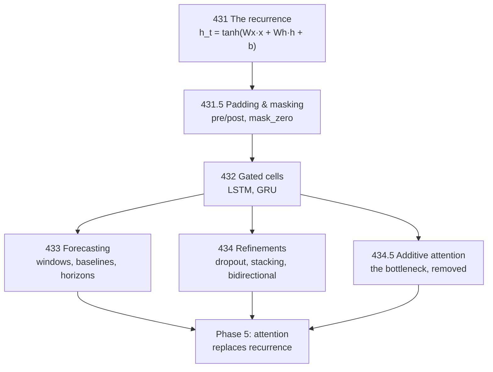

Everything before this phase assumed a fixed-size input. Sequences break that twice
over: their **order** carries meaning, and their **length varies**. A recurrent layer
handles both by walking the sequence one element at a time and carrying a state forward —
so its parameter count is independent of length (`SimpleRNN(32)` is 2,080 parameters for
20 timesteps or 20,000).

The measurements in this phase are unusually blunt about what that buys. On 5,000 IMDB
reviews, a `SimpleRNN(32)` scored **0.5856** while averaging the same embeddings and
throwing away order entirely scored **0.8004**. Gated cells then took it to **0.8156**.
Sequence modelling is a story about a mechanism that does not work until it is fixed
twice.

## The pages

| # | Page | The measured headline |
| --- | --- | --- |
| 431 | [Intro to RNNs](/deep-learning/phase-04---sequence-models-with-rnns/intro-to-recurrent-neural-networks-rnn-for-sequences/) | the cell in five lines of NumPy, matching Keras at 2.68e-07; order is worth **+0.0744** to the RNN and **+0.0000** to a bag of words — which still won |
| 431.5 | [Padding, Masking and Variable-Length Sequences](/deep-learning/phase-04---sequence-models-with-rnns/padding-masking-and-variable-length-sequences/) | post-padding without a mask scores **0.5036** — chance — with no error and a falling loss curve |
| 432 | [LSTM & GRU Networks](/deep-learning/phase-04---sequence-models-with-rnns/lstm--gru-networks/) | gates re-derived in NumPy to 6.56e-07; **+0.23 accuracy** over a SimpleRNN, and at 80 steps **MAE 0.0056 against 0.2984** |
| 433 | [Time Series Forecasting](/deep-learning/phase-04---sequence-models-with-rnns/time-series-forecasting-with-rnns/) | persistence 0.3253, noise floor 0.0965, **Dense 0.1210 against GRU 0.1146** at a quarter of the cost |
| 434 | [Advanced Recurrent Layers](/deep-learning/phase-04---sequence-models-with-rnns/advanced-recurrent-layers-dropout-stacking-bidirectional/) | of three refinements only `dropout` helped (+0.0104); `recurrent_dropout` cost **2.0× the wall-clock** to lose 0.0080; stacking lost at every depth; `Bidirectional`'s +0.0188 fell to **+0.0024** at matched width |
| 434.5 | [Attention Before Transformers](/deep-learning/phase-04---sequence-models-with-rnns/attention-before-transformers-additive-and-bahdanau/) | the fixed-state bottleneck, measured: **0.0017 exact matches against 1.0000**, and a per-position split showing the year at 1.0000 and the day's last digit at **0.0908** |



<Figure
  src="/images/dl/phase-04-sequences/intro-to-rnns/memory-length"
  alt="Validation MAE against sequence length on log axes. The LSTM line stays near 0.01 for lengths 10, 40 and 100 before jumping to 0.32 at length 200. The SimpleRNN line rises from 0.02 at length 10 to 0.06 at 40 and then to 0.31 at 100, meeting the dashed do-nothing baseline at about 0.32."
  title="The adding problem — 3,000 sequences, 60 epochs, 32 units"
  caption="The SimpleRNN solves the task at 10 and 40 steps, then collapses onto the baseline at 100: it has not merely got worse, it has stopped carrying the number at all. The LSTM holds to 100 steps at MAE 0.0152 — twenty times better — and then fails too at 200. That last column is honest rather than convenient: the gates raise the length at which recurrence works, they do not make it unbounded, and 60 epochs is a modest budget for a 200-step credit assignment."
/>

<Figure
  src="/images/dl/phase-04-sequences/time-series-forecasting/baseline-against-models"
  alt="Two panels. Left: bars of test MAE for naive 0.3253, dense 0.1210, conv1d 0.2203 and GRU 0.1146, with a red dashed persistence line and an amber dotted irreducible-noise line near 0.096. Right: validation MAE per epoch, where dense drops below the persistence line within two epochs and flattens near 0.12, GRU crosses at epoch four and ends lowest, and conv1d is still descending at 0.22 after 25 epochs."
  title="One-step forecast: 4,000 windows, 25 epochs"
  caption="The GRU wins by 0.0064 over a flattened Dense layer while costing 4.3x the wall-clock and twice the parameters — and both sit close to the 0.0965 noise floor, so there was very little left to win. The Conv1D stack is the interesting failure: 5,377 parameters, still improving at epoch 25, and beaten by a single Dense layer. Its two pooling and convolution stages blur exactly the recent detail a one-step forecast depends on."
/>

<Figure
  src="/images/dl/overviews/phase-summaries/phase-4"
  alt="Horizontal bars, one per page in the phase, each labelled with the claim it tested and coloured by the verdict: green where the standard story held, amber where it held at a price, red where the measurement contradicted it. 4 of 6 claims contradicted, 2 held at a price, 0 held."
  title="Every claim this phase set out to test"
  caption="Collected from the runs behind each page's own figures rather than measured afresh, so every bar is traceable to the page it names. Bar length is the log of the effect size, because the effects span from 0.0014 to 5,376 — the number that matters is printed on each bar. Across all nine phases, 34 of 54 claims were contradicted outright, 11 held at a cost that was worth stating, and 9 held as advertised."
/>

## Three things this phase measures that most treatments assert

1. **A `SimpleRNN` is not a working sequence model at 200 timesteps.** It lost to
   embedding-averaging by 0.2148. The gap is not a tuning failure — it is the
   vanishing-signal problem that gated cells were invented for, and the phase measures it
   before fixing it.
2. **The padding bug is silent.** Identical code with `padding="post"` and no mask
   converged smoothly to 0.5036 on a balanced binary task. Nothing warns you; the loss
   curve looks healthy; only the accuracy tells you, and only if you know what chance is.
3. **A flattened `Dense` layer is a serious forecasting baseline.** It scored 0.1210
   against the GRU's 0.1146 in a quarter of the wall-clock, with the irreducible noise
   floor at 0.0965. Recurrence pays when the useful information is far back and
   order-dependent — not merely because the data has a time axis.

```p5 title="How far back can it remember?" desc="Drag the slider to set the sequence length. The bars are measured MAE on the adding problem for a SimpleRNN and an LSTM, against the do-nothing baseline." height="350"
let index = 0;
const LENGTHS = [10, 40, 100, 200];
const SIMPLE = [0.02, 0.06, 0.31, 0.32];
const LSTM = [0.01, 0.01, 0.0152, 0.32];
const BASELINE = 0.32;
function setup() {
  createCanvas(620, 350);
  textFont("monospace");
}
function draw() {
  background(13, 17, 23);
  noStroke();
  fill(230);
  textSize(12);
  textAlign(LEFT, TOP);
  text("the adding problem - 3,000 sequences, 60 epochs, 32 units", 26, 18);
  fill(150);
  textSize(10);
  text("sequence length: " + LENGTHS[index] + " steps", 26, 44);
  fill(48, 56, 68);
  rect(26, 66, 400, 5, 2);
  for (let i = 0; i < LENGTHS.length; i++) {
    const x = 26 + (i / (LENGTHS.length - 1)) * 400;
    if (i === index) { fill(255, 211, 67); } else { fill(90, 102, 118); }
    circle(x, 68, i === index ? 14 : 9);
  }
  const rows = [["SimpleRNN", SIMPLE[index]], ["LSTM", LSTM[index]]];
  for (let i = 0; i < 2; i++) {
    const y = 110 + i * 62;
    fill(200);
    textSize(11);
    text(rows[i][0], 26, y);
    const value = rows[i][1];
    fill(40, 47, 58);
    rect(26, y + 18, 440, 22, 3);
    const dead = value >= BASELINE * 0.9;
    if (dead) { fill(224, 108, 117); } else { fill(126, 192, 143); }
    rect(26, y + 18, Math.min(value / 0.35, 1) * 440, 22, 3);
    fill(235);
    textSize(10);
    text(value.toFixed(4), 476, y + 24);
  }
  stroke(255, 211, 67);
  strokeWeight(1.5);
  const bx = 26 + (BASELINE / 0.35) * 440;
  line(bx, 122, bx, 236);
  noStroke();
  fill(255, 211, 67);
  textSize(9);
  text("do nothing: " + BASELINE, bx - 92, 244);
  fill(150);
  textSize(9.5);
  if (index < 2) {
    text("both cells solve it. Nothing here distinguishes them.", 26, 274);
  } else if (index === 2) {
    text("the SimpleRNN has landed ON the baseline - it is no longer", 26, 274);
    text("carrying the number at all. The LSTM is 20x better.", 26, 288);
  } else {
    text("both are on the baseline. Gates raise the length at which", 26, 274);
    text("recurrence works; they do not make it unbounded.", 26, 288);
  }
}
function mousePressed() { mouseDragged(); }
function mouseDragged() {
  if (mouseY < 50 || mouseY > 90) { return; }
  const t = Math.min(Math.max((mouseX - 26) / 400, 0), 1);
  index = Math.round(t * (LENGTHS.length - 1));
}
```

## The habit this phase is really teaching

Every page here compares against something that costs nothing:

| Task | The do-nothing baseline | What it exposed |
| --- | --- | --- |
| sentiment | average the embeddings (0.8004) | the `SimpleRNN` was not working |
| masking | chance on a balanced task (0.5000) | post-padding scored 0.5036 |
| long-range recall | predict the mean sum (0.3324) | the SimpleRNN reached 0.2984 — a tenth of the way — while the GRU reached 0.0056 |
| forecasting | persistence (0.3253), noise floor (0.0965) | the GRU's win over `Dense` was 0.0064 |
| date normalisation | the same model without attention (0.0017) | attention reached 1.0000 exact match |

A sequence model that has not been compared against one of these has not been measured.
That is why the same discipline reappears in Phase 5, where the baseline for a
transformer is often a bag of words, and in Phase 6, where the baseline for a generative
model is the training data itself.

```p5 title="How often the standard story survived" desc="Step through the phases. Each bar splits the claims that phase tested into contradicted, held at a price, and held as advertised - the totals are summed live." height="400"
let picked = 0;
const PHASES = [
  [1, "Neural Network Foundations", 3, 0, 3, "a single neuron cannot do XOR - 0 of 40,401 weight pairs"],
  [2, "Training Deep Networks", 2, 2, 2, "146x the parameters bought 0.0150 accuracy"],
  [3, "Computer Vision", 4, 1, 1, "augmentation cost 0.1855 clean, bought 0.1105 rotated"],
  [4, "Sequence Models", 4, 2, 0, "a fixed state scored 0.0017 against attention's 1.0000"],
  [5, "NLP & Transformers", 4, 1, 1, "TF-IDF 0.8632 beat a transformer's 0.8462, 55x cheaper"],
  [6, "Generative", 3, 1, 2, "copying 200 real images scored FID 5.027 against real 9.605"],
  [7, "Reinforcement Learning", 4, 2, 0, "replay and target nets: 144.20 together, 53.45 either alone"],
  [8, "Scaling & Deployment", 5, 1, 0, "mixed precision measured 40.65x SLOWER on this CPU"],
  [9, "Capstones", 5, 1, 0, "a memoriser beat the VAE on Frechet distance"]
];
function setup() {
  createCanvas(620, 400);
  textFont("monospace");
}
function draw() {
  background(13, 17, 23);
  noStroke();
  fill(230);
  textSize(12);
  textAlign(LEFT, TOP);
  text("54 claims, 9 phases, every one tested by a measurement", 26, 16);
  let broke = 0;
  let cost = 0;
  let held = 0;
  for (let i = 0; i < PHASES.length; i++) {
    broke += PHASES[i][2];
    cost += PHASES[i][3];
    held += PHASES[i][4];
  }
  for (let i = 0; i < PHASES.length; i++) {
    const y = 48 + i * 26;
    const row = PHASES[i];
    const chosen = i === picked;
    fill(chosen ? 255 : 130, chosen ? 211 : 140, chosen ? 67 : 155);
    textSize(9);
    text("Phase " + row[0] + "  " + row[1], 26, y + 5);
    let x = 250;
    const unit = 34;
    fill(224, 108, 117);
    rect(x, y, row[2] * unit, 17, 2);
    x += row[2] * unit;
    fill(255, 211, 67);
    rect(x, y, row[3] * unit, 17, 2);
    x += row[3] * unit;
    fill(126, 192, 143);
    rect(x, y, row[4] * unit, 17, 2);
    if (chosen) {
      noFill();
      stroke(255, 211, 67);
      strokeWeight(1.5);
      rect(248, y - 2, 6 * unit + 4, 21, 3);
      noStroke();
    }
  }
  const row = PHASES[picked];
  fill(200);
  textSize(10);
  text("Phase " + row[0] + " headline:", 26, 300);
  fill(255, 211, 67);
  textSize(10);
  text(row[5], 26, 318);
  fill(150);
  textSize(9);
  text("contradicted " + row[2] + "   held at a price " + row[3]
       + "   held " + row[4], 26, 340);
  fill(224, 108, 117);
  rect(26, 360, 12, 12, 2);
  fill(150);
  textSize(9);
  text("contradicted  " + broke + " of 54", 44, 362);
  fill(255, 211, 67);
  rect(210, 360, 12, 12, 2);
  fill(150);
  text("held at a price  " + cost, 228, 362);
  fill(126, 192, 143);
  rect(400, 360, 12, 12, 2);
  fill(150);
  text("held  " + held, 418, 362);
  fill(110);
  textSize(8.5);
  text("click a row. Collected from each page's own measured run.", 26, 382);
}
function mousePressed() {
  for (let i = 0; i < PHASES.length; i++) {
    const y = 48 + i * 26;
    if (mouseY > y && mouseY < y + 20) { picked = i; }
  }
}
```

## What carries forward

| Idea from this phase | Where it comes back |
| --- | --- |
| padding, masks, and which layers honour them | attention masks in every transformer |
| additive state updates under a gate | residual streams, gated MLPs |
| `return_sequences` and per-timestep outputs | seq2seq decoders, per-token losses |
| layer normalisation over features, not batch | every transformer block |
| chronological splits and leakage | any temporal evaluation, including RL |

:::tip[From the book]
*Hands-On Machine Learning* frames an RNN as a chain that can be **unrolled** into a very
deep feedforward network — one copy per timestep, all sharing weights — and trained with
backpropagation through time. Page 431 makes that literal: the five-line NumPy loop *is*
the layer, matched against Keras to 2.68e-07, and the 200-step state trace shows what
"very deep" costs when 132 of those steps are padding.
:::

:::tip[From the book]
Chollet's advice on sequences is to start with a common-sense baseline and only then add
machinery. Page 433 takes that seriously enough to compute the **irreducible error**:
with noise of $\sigma = 0.12$, no forecaster can beat MAE $\sigma\sqrt{2/\pi} = 0.0958$,
and the best model here reached 0.1146. Knowing that number is the difference between
"tune further" and "stop".
:::


<Quiz
  questions={[
    {
      q: "A `SimpleRNN(32)` scored 0.5856 on IMDB while averaging the same embeddings - discarding order entirely - scored 0.8004. What does the gap show?",
      options: [
        "That word order is irrelevant to sentiment",
        "That the SimpleRNN is not functioning as a sequence model at 200 timesteps: it is losing signal across the chain faster than it gains from order",
        "That the embeddings were badly initialised",
        "That the baseline was computed incorrectly"
      ],
      answer: 1,
      explanation: "Order is worth +0.0744 to the RNN, so it is using order - it is just starting from a far worse representation. Gated cells then close most of the gap, which is the phase's argument for them."
    },
    {
      q: "Identical code with `padding=\"post\"` and no mask converged smoothly to 0.5036 on a balanced binary task. Why is this the most dangerous bug in the phase?",
      options: [
        "Because it crashes at inference time",
        "Because nothing signals it - no error, no warning, and a healthy-looking falling loss curve - so it is only visible if you know what chance-level accuracy is for your task",
        "Because it corrupts the training data",
        "Because it only happens with LSTMs"
      ],
      answer: 1,
      explanation: "The final state after post-padding is the state after processing zeros. The model trains, the loss falls, and the score is chance. Knowing the chance baseline is what catches it."
    },
    {
      q: "A flattened `Dense` layer scored 0.1210 on forecasting against the GRU's 0.1146, with the irreducible noise floor at 0.0965. What does the noise floor add?",
      options: [
        "Nothing - only the model comparison matters",
        "It converts a 0.0064 gap into a judgement: both models are close to the best achievable score, so there is very little left to win and 4.3x the wall-clock buys almost none of it",
        "It proves the GRU is overfitting",
        "It sets the learning rate"
      ],
      answer: 1,
      explanation: "With noise of sigma = 0.12, no forecaster can beat MAE 0.0958. Knowing that number is the difference between 'tune further' and 'stop'."
    },
    {
      q: "Of three refinements, `recurrent_dropout` cost 2.0x the wall clock to LOSE 0.0080, and `Bidirectional`'s +0.0188 fell to +0.0024 once width was matched. What does the width-matching change?",
      options: [
        "Nothing, it is a formality",
        "A bidirectional layer doubles the parameters, so the naive comparison credits attention-to-both-directions for a gain that is mostly extra capacity",
        "It makes the model slower",
        "It changes the masking behaviour"
      ],
      answer: 1,
      explanation: "Comparing a mechanism means holding capacity fixed. Otherwise every mechanism that adds parameters looks effective."
    },
    {
      q: "The LSTM held MAE 0.0152 at 100 timesteps but failed at 200, landing on the do-nothing baseline. Why report the failure column?",
      options: [
        "To fill out the table",
        "Because it bounds the claim: gates raise the length at which recurrence works rather than removing the limit, and the reader needs to know where the limit sits",
        "Because the LSTM was broken",
        "Because 200 steps is unrealistic"
      ],
      answer: 1,
      explanation: "A table that stopped at 100 steps would support 'LSTMs solve long-range dependencies'. The 200-step column turns that into the accurate, more useful claim - and it is the gap that motivates attention in Phase 5."
    }
  ]}
/>
