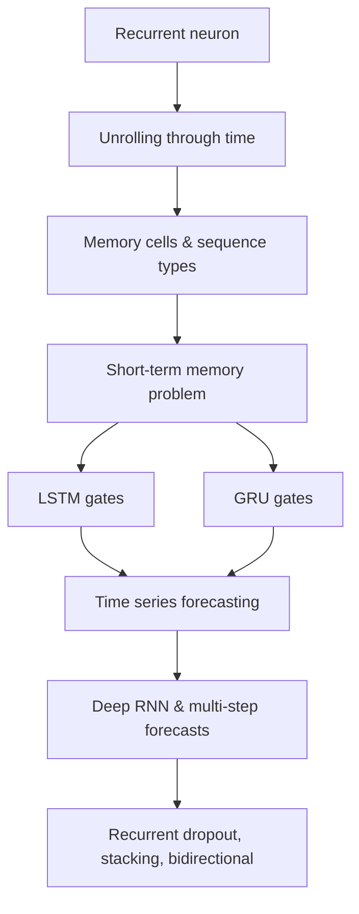

## Why this phase exists

Everything up to now (MLPs, CNNs) assumed a **fixed-size** input: one image, one
row of features. But a lot of real data is **sequential** — its order matters and
its length varies:

- stock prices and sensor readings (time series)
- sentences and documents (text)
- audio waveforms

A **Recurrent Neural Network (RNN)** is built for exactly this: it walks through a
sequence one step at a time and carries a **hidden state** forward, so step `t`
"remembers" what happened at steps before it.

In this phase, you'll learn:

- how a recurrent neuron works, and what it means to "unroll" it through time
- memory cells, and the difference between sequence-to-sequence, sequence-to-vector,
  and vector-to-sequence architectures
- why plain RNNs forget quickly (the short-term memory problem), and how **LSTM**
  and **GRU** cells fix it with gates
- how to forecast a time series with tf.keras — from a naive baseline all the way
  to a deep RNN that predicts many steps ahead at once
- how to refine those RNNs further with **recurrent dropout**, **stacked**
  recurrent layers, and **bidirectional** wrappers — and when each one actually
  helps

## Phase 4 flow

## Suggested practice dataset

A good first dataset for this phase is a **synthetic time series** — two sine
waves of random frequency/phase plus a bit of noise (exactly what the book uses).
It's cheap to generate, has no messy real-world quirks, and lets you focus purely
on the RNN mechanics before moving on to real data like stock prices or weather
readings.

:::tip[From the book]
*Hands-On Machine Learning* (Géron) frames RNNs around one core idea: a recurrent
neuron feeds its own output back to itself at the next time step, so the network
can be **"unrolled"** into a chain that looks like a very deep feedforward net —
one copy per time step, all sharing the same weights. Training that unrolled chain
with ordinary backpropagation is called **backpropagation through time (BPTT)**.
Everything else in this phase — LSTM gates, GRU cells, deep RNNs, multi-step
forecasting — is really about giving that chain a better memory.
:::
