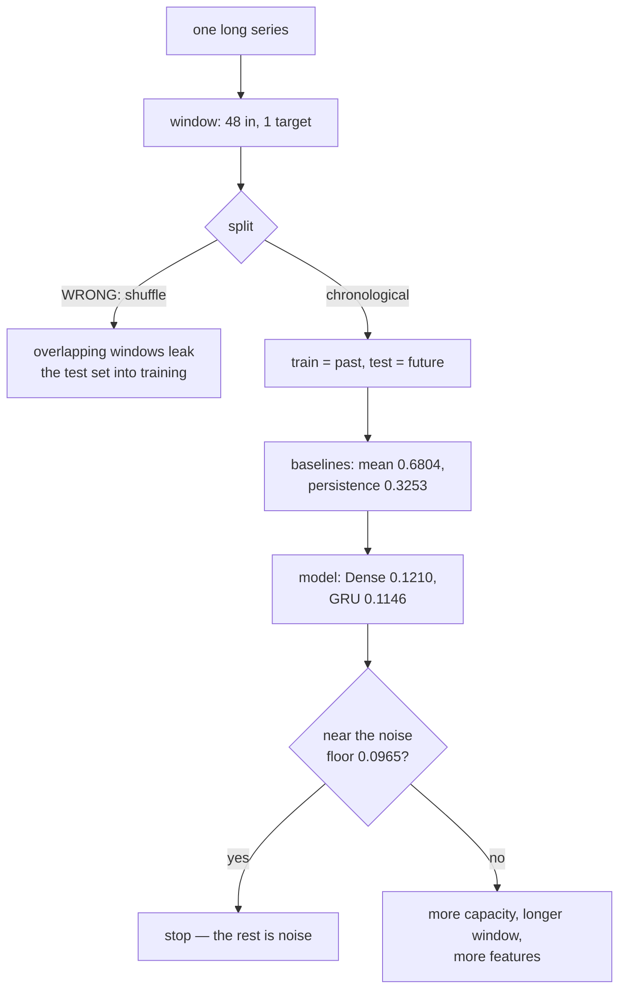

import DataCampExercise from "../../../../components/DataCampExercise.astro";
import Figure from "../../../../components/Figure.astro";
import Quiz from "../../../../components/Quiz.astro";

Forecasting is the one deep-learning task where a two-line baseline routinely beats a
tuned network, and where the standard evaluation habits — random splits, MAE quoted
without context, single-horizon results — quietly produce nonsense.

This page uses a **generated** series rather than a downloaded one, for a specific
reason: the signal is known exactly, so the **irreducible error is known too**. Two
periods (24 and 7 steps), Gaussian noise with $\sigma = 0.12$. A perfect forecaster
still scores **MAE 0.0965** against the noisy target. Every number below is judged
against that floor and against persistence.

## What you'll learn

- How to turn one long series into supervised windows, and why the split must be
  **chronological**.
- The two baselines that matter: **persistence (MAE 0.3253)** and predicting the
  training mean (**0.6804**).
- The **noise floor** — $\sigma\sqrt{2/\pi} = 0.0965$ — and why a model near it is
  finished, not merely good.
- Four models measured: **Dense 0.1210, Conv1D 0.2203, GRU 0.1146** at 1,601 / 5,377 /
  3,393 parameters.
- Why persistence gets *better* again at a 24-step horizon (1.3227 at 12, 0.6306 at 24).
- Why a bidirectional layer is a bug in a forecaster, not an upgrade.

## From one series to supervised rows

```python title="Windowing"
def windows(series, timesteps=48, horizon=1):
    x = np.stack([series[i:i + timesteps] for i in range(len(series) - timesteps - horizon + 1)])
    y = series[timesteps + horizon - 1:]
    return x[..., None], y[:len(x)]          # (rows, timesteps, features), (rows,)
```

Each row is `timesteps` consecutive observations; the target is the value `horizon`
steps after the window ends. The feature axis exists even for a univariate series —
recurrent and convolutional layers both require `(batch, time, features)`.

<Figure
  src="/images/dl/phase-04-sequences/time-series-forecasting/series-and-windows"
  alt="Two panels. Left: a noisy oscillating series in blue overlaid on the smooth noise-free signal in green, showing a repeating pattern with two interacting periods. Right: one 48-step window as a line of small markers with the target — the next step — highlighted as a large amber dot just beyond the window's edge, annotated with the persistence MAE of 0.3256 and the irreducible noise MAE of about 0.0958."
  title="The generated series and one training row"
  caption="Generating the series is what makes the rest of the page honest: the green curve is the signal, the blue is what the model sees, and the gap between them is the error no model can remove. Target statistics: mean -0.0002, sd 0.7975, range [-1.728, 1.732]."
/>

### The split has to respect time

```python
cut = int(len(x) * 0.75)
x_train, y_train = x[:cut], y[:cut]      # everything before the cut
x_test, y_test = x[cut:], y[cut:]        # everything after
```

`train_test_split(..., shuffle=True)` on windowed data is **leakage**, and it is the
single most common error in forecasting notebooks. Consecutive windows overlap by
`timesteps - 1` observations, so a shuffled split puts near-duplicates of test rows into
training. The score that comes out is not wrong by a little.

## Baselines first

| Baseline | Test MAE |
| --- | --- |
| predict the training mean | 0.6804 |
| **persistence** — predict the last observed value | **0.3253** |
| the irreducible noise floor | **0.0965** |

Persistence is one line — `predicted = x_test[:, -1, 0]` — and it is the number a model
must beat to have justified its existence. The floor is the number that tells you when
to stop tuning.

$$
\text{MAE}_{\text{floor}} = \mathbb{E}\lvert \varepsilon \rvert
= \sigma\sqrt{\tfrac{2}{\pi}} = 0.12 \times 0.7979 = 0.0958
$$

(The measured 0.0965 is the sample estimate of that expectation.)

## Four models, same windows

| Model | Parameters | Test MAE | Beats persistence by | Seconds |
| --- | --- | --- | --- | --- |
| persistence | 0 | 0.3253 | — | 0.0 |
| **Dense(32)** | **1,601** | 0.1210 | +0.2043 | **9.1** |
| Conv1D ×2 | 5,377 | **0.2203** | +0.1050 | 13.6 |
| **GRU(32)** | 3,393 | **0.1146** | **+0.2107** | 39.5 |

<Figure
  src="/images/dl/phase-04-sequences/time-series-forecasting/baseline-against-models"
  alt="Two panels. Left: bars of test MAE for naive 0.3253, dense 0.1210, conv1d 0.2203 and GRU 0.1146, with a red dashed persistence line and an amber dotted irreducible-noise line near 0.096. Right: validation MAE per epoch, where dense drops below the persistence line within two epochs and flattens near 0.12, GRU crosses at epoch four and ends lowest, and conv1d is still descending at 0.22 after 25 epochs."
  title="One-step forecast: 4,000 windows, 25 epochs"
  caption="The GRU wins by 0.0064 over a flattened Dense layer while costing 4.3x the wall-clock and twice the parameters — and both sit close to the 0.0965 noise floor, so there was very little left to win. The Conv1D stack is the interesting failure: 5,377 parameters, still improving at epoch 25, and beaten by a single Dense layer. Its two pooling and convolution stages blur exactly the recent detail a one-step forecast depends on."
/>

Three conclusions worth stating plainly:

1. **A flattened `Dense` layer is a serious forecasting baseline.** 1,601 parameters,
   nine seconds, and within 0.0064 of the GRU. On a 48-step window there is no
   long-range structure for recurrence to exploit.
2. **The GRU wins, but the margin is tiny relative to its cost.** +0.0064 MAE for 4.3×
   the training time. If a Dense model is within a hair of the noise floor, the
   architecture question is already answered.
3. **`Conv1D` lost badly here.** Convolution assumes the useful pattern is local and
   translation-invariant *along time*; a one-step forecast mostly depends on the last
   few observations, and pooling averages them away. Dilated causal convolutions
   (WaveNet-style) exist precisely to fix this — no pooling, exponentially growing
   receptive field, and the last timestep never blurred.

## The horizon changes which baseline is hard

| Horizon | Persistence MAE | GRU MAE | GRU advantage |
| --- | --- | --- | --- |
| 1 | 0.3253 | 0.1146 | +0.2107 |
| 6 | 0.9296 | 0.1161 | +0.8135 |
| **12** | **1.3227** | 0.1134 | **+1.2094** |
| 24 | 0.6306 | 0.1078 | +0.5228 |

<Figure
  src="/images/dl/phase-04-sequences/time-series-forecasting/horizon-decay"
  alt="A line chart of test MAE against forecast horizon. The red persistence line rises from 0.3253 at horizon 1 to a peak of 1.3227 at horizon 12 and falls to 0.6306 at horizon 24. The green GRU line is flat between 0.1078 and 0.1161 across all four horizons, just above a dotted irreducible-noise line at 0.0965."
  title="The same GRU at four horizons"
  caption="Two things happen here and neither is the textbook story. Persistence peaks at horizon 12 — half of the 24-step period, where the series is maximally out of phase with itself — and recovers at 24, a full period later. The GRU is flat at ~0.11 at every horizon, because this signal is deterministic apart from noise: once the period is learned, 24 steps ahead is no harder than one. Real series lose predictability with distance; a generated one does not, and that difference is exactly what makes this figure worth reading carefully."
/>

The generalisable lesson is about the baseline, not the model: **persistence is a
function of the series' autocorrelation**, so "we beat the naive baseline by 1.21 MAE"
is a claim about the horizon you chose. Quote the baseline at every horizon you quote a
model at.



## Scaling, and the leak hiding inside it

Normalise with statistics from the **training** split only:

```python title="The only safe way to scale a series"
mean = x_train.mean()                     # training rows only
std = x_train.std()
x_train = (x_train - mean) / std
x_test = (x_test - mean) / std            # the same numbers, not recomputed
```

Fitting the scaler on the whole series leaks the future's mean and variance into
training. It usually improves your reported score, which is what makes it dangerous.

For a series with a trend, differencing (`np.diff`) is often better than scaling: it
removes the drift a fixed mean cannot follow, and it turns "predict the level" into
"predict the change" — which also makes persistence the trivial prediction of zero.

## What not to use

| Idea | Why it fails on a forecaster |
| --- | --- |
| `Bidirectional(LSTM(...))` | the backward pass reads the future; at prediction time there is no future to read |
| Shuffled train/test split | overlapping windows leak; the score is meaningless |
| Scaler fitted on all data | the training rows learn the test period's mean and variance |
| Accuracy as a metric | forecasting is regression — use MAE or RMSE and report the baseline |
| Reporting one horizon | persistence varies with the horizon; so does the apparent gain |

```p5 title="Windows, horizons and persistence" desc="Drag along the series to move the window. The amber dot is the target and the grey dot is what persistence predicts; the gap between them is the error the baseline makes." height="340"
let series = [];
let horizon = 6;
const WINDOW = 48;
let position = 60;
let dragging = false;
function setup() {
  createCanvas(620, 340);
  textFont("monospace");
  let seed = 7;
  const random01 = () => {
    seed = (seed * 1103515245 + 12345) % 2147483648;
    return seed / 2147483648;
  };
  for (let t = 0; t < 300; t++) {
    const signal = Math.sin(2 * Math.PI * t / 24)
      + 0.5 * Math.sin(2 * Math.PI * t / 7 + 0.7);
    const noise = (random01() + random01() + random01() - 1.5) * 0.24;
    series.push(signal + noise);
  }
}
function xOf(t) { return 24 + (t / 300) * 570; }
function yOf(v) { return 150 - v * 52; }
function draw() {
  background(13, 17, 23);
  noFill();
  stroke(70, 80, 96);
  beginShape();
  for (let t = 0; t < series.length; t++) vertex(xOf(t), yOf(series[t]));
  endShape();
  const start = position;
  const end = Math.min(start + WINDOW, series.length - 1);
  const target = Math.min(end + horizon - 1, series.length - 1);
  noStroke();
  fill(46, 96, 140, 70);
  rect(xOf(start), 24, xOf(end) - xOf(start), 230);
  stroke(107, 169, 221);
  strokeWeight(1.6);
  noFill();
  beginShape();
  for (let t = start; t <= end; t++) vertex(xOf(t), yOf(series[t]));
  endShape();
  strokeWeight(1);
  noStroke();
  fill(160, 170, 185);
  circle(xOf(target), yOf(series[end]), 9);
  fill(255, 211, 67);
  circle(xOf(target), yOf(series[target]), 11);
  stroke(255, 211, 67, 130);
  line(xOf(target), yOf(series[end]), xOf(target), yOf(series[target]));
  noStroke();
  fill(220);
  textSize(11);
  textAlign(LEFT, TOP);
  text("window: steps " + start + "-" + end + "   horizon " + horizon, 24, 262);
  const error = Math.abs(series[target] - series[end]);
  fill(255, 211, 67);
  text("persistence error here: " + error.toFixed(4), 24, 280);
  fill(150);
  textSize(10.5);
  text("measured over the whole test split: persistence MAE 0.3253 at h=1,",
    24, 300);
  text("1.3227 at h=12 (half a period), 0.6306 at h=24 (a full period)", 24, 314);
  fill(60, 70, 84);
  rect(430, 262, 166, 26, 4);
  fill(220);
  textSize(10.5);
  textAlign(CENTER, CENTER);
  text("horizon " + horizon + "  (click to cycle)", 513, 275);
}
function mousePressed() {
  if (mouseY > 262 && mouseY < 288 && mouseX > 430) {
    horizon = horizon === 1 ? 6 : horizon === 6 ? 12 : horizon === 12 ? 24 : 1;
    return;
  }
  dragging = true;
  moveWindow();
}
function moveWindow() {
  const t = Math.round(((mouseX - 24) / 570) * 300);
  position = Math.min(Math.max(t, 0), series.length - WINDOW - horizon - 1);
}
function mouseDragged() { if (dragging) moveWindow(); }
function mouseReleased() { dragging = false; }
```

```p5 title="The measured table, ranked" desc="Click a column to rank every row by it. The bars are that column's values and the highest and lowest are computed from the numbers, not written in." height="254"
let metric = 0;
const COLUMNS = ["Parameters", "Test MAE", "Seconds"];
const ROWS = [
  ["persistence", 0, 0.3253, 0],
  ["Dense(32)", 1601, 0.121, 9.1],
  ["Conv1D x2", 5377, 0.2203, 13.6],
  ["GRU(32)", 3393, 0.1146, 39.5]
];
function setup() {
  createCanvas(620, 254);
  textFont("monospace");
}
function fmt(v) {
  if (v === 0) { return "0"; }
  const a = Math.abs(v);
  if (a >= 1000 || a < 0.001) { return v.toExponential(2); }
  if (a >= 100) { return v.toFixed(1); }
  return v.toFixed(4);
}
function draw() {
  background(13, 17, 23);
  noStroke();
  fill(230);
  textSize(12);
  textAlign(LEFT, TOP);
  text("Time Series Forecasting with RNNs", 26, 16);
  let x = 26;
  for (let i = 0; i < COLUMNS.length; i++) {
    const w = COLUMNS[i].length * 6.6 + 16;
    if (i === metric) { fill(255, 211, 67); } else { fill(48, 56, 68); }
    rect(x, 40, w, 22, 4);
    if (i === metric) { fill(13, 17, 23); } else { fill(180); }
    textSize(9);
    text(COLUMNS[i], x + 8, 47);
    x += w + 6;
    if (x > 500) { break; }
  }
  const values = ROWS.map((r) => r[metric + 1]);
  const lo = Math.min(...values);
  const hi = Math.max(...values);
  const span = hi - lo === 0 ? 1 : hi - lo;
  const order = ROWS.slice().sort((a, b) => b[metric + 1] - a[metric + 1]);
  for (let i = 0; i < order.length; i++) {
    const y = 78 + i * 26;
    const v = order[i][metric + 1];
    fill(160);
    textSize(9);
    text(order[i][0], 26, y + 5);
    fill(34, 40, 50);
    rect(230, y, 280, 18, 3);
    const frac = (v - lo) / span;
    if (v === hi) { fill(126, 192, 143); }
    else if (v === lo) { fill(224, 108, 117); }
    else { fill(107, 169, 221); }
    rect(230, y, Math.max(frac * 280, 3), 18, 3);
    fill(225);
    textSize(9);
    text(fmt(v), 518, y + 5);
  }
  const top = order[0];
  const bottom = order[order.length - 1];
  fill(150);
  textSize(9);
  const base = 78 + order.length * 26 + 8;
  text("highest " + COLUMNS[metric] + ": " + top[0] + " at " + fmt(top[1]),
       26, base);
  text("lowest  " + COLUMNS[metric] + ": " + bottom[0] + " at "
       + fmt(bottom[1]), 26, base + 14);
  text("bars are scaled within the chosen column - lowest is not zero", 26,
       base + 30);
}
function mousePressed() {
  let x = 26;
  for (let i = 0; i < COLUMNS.length; i++) {
    const w = COLUMNS[i].length * 6.6 + 16;
    if (mouseX > x && mouseX < x + w && mouseY > 40 && mouseY < 62) {
      metric = i;
    }
    x += w + 6;
  }
}
```

## Pitfalls

- **A shuffled split.** Consecutive windows overlap by 47 of 48 steps; shuffling puts
  near-copies of the test rows into training.
- **No baseline.** Persistence scored 0.3253 here; a model reporting 0.30 would look
  fine and be worthless.
- **No noise floor.** The best model reached 0.1146 against a floor of 0.0965 — 84% of
  the remaining error is irreducible, so further tuning buys almost nothing.
- **Scaling with statistics from the full series.** It leaks the test period's mean and
  variance and improves your reported score.
- **`Bidirectional` in a forecaster.** It reads the future. It will validate beautifully
  and cannot be deployed.
- **Quoting one horizon.** Persistence ranged from 0.3253 to 1.3227 across four
  horizons on the same data.
- **Assuming an RNN must beat a Dense layer.** A flattened `Dense(32)` scored 0.1210 in
  9 seconds against the GRU's 0.1146 in 39.5.
- **Pooling in a `Conv1D` forecaster.** It averages away the recent observations a
  short-horizon forecast leans on — measured 0.2203, worse than the Dense layer.

## Recap

- Windowing turns one series into `(rows, timesteps, features)`; the split must be
  chronological because windows overlap.
- Baselines on this series: training mean 0.6804, persistence 0.3253, irreducible noise
  0.0965.
- Measured at 25 epochs: Dense 0.1210 (1,601 params, 9.1s), Conv1D 0.2203 (5,377
  params), GRU 0.1146 (3,393 params, 39.5s).
- Persistence peaked at horizon 12 (1.3227 — half the 24-step period) and improved at 24
  (0.6306); the GRU stayed flat near 0.11 because the generated signal never becomes
  unpredictable.
- Scale with training-split statistics only; difference the series if it has a trend.
- Never use a bidirectional layer, a shuffled split, or an accuracy metric in a
  forecaster.

## Next

Dropout, stacking and bidirectional layers — including which of them a forecaster may
use — are next:
[Advanced Recurrent Layers](/deep-learning/phase-04---sequence-models-with-rnns/advanced-recurrent-layers-dropout-stacking-bidirectional/).

<Quiz
  questions={[
    {
      q: "Why is train_test_split(..., shuffle=True) wrong for windowed time series?",
      options: [
        "Because it changes the order of the features",
        "Because consecutive windows overlap by timesteps-1 observations, so shuffling puts near-duplicates of test rows into training — the score measures memorisation",
        "Because it produces unequal class balance",
        "Because RNNs require sorted input",
      ],
      answer: 1,
      explain: "The split must be chronological: train on the past, test on the future, exactly as deployment will work.",
    },
    {
      q: "The best model scored MAE 0.1146 and the noise floor is 0.0965. What does that tell you?",
      options: [
        "The model is underfitting and needs more capacity",
        "Roughly 84% of the remaining error is irreducible noise, so further tuning has very little left to win",
        "The metric was computed incorrectly",
        "The model has memorised the training set",
      ],
      answer: 1,
      explain: "sigma*sqrt(2/pi) is the MAE a perfect forecaster still pays against a noisy target. Without it you cannot tell a finished model from a lazy one.",
    },
    {
      q: "Persistence scored 0.3253 at horizon 1, 1.3227 at horizon 12 and 0.6306 at horizon 24. Why the non-monotonic shape?",
      options: [
        "The model was retrained differently at each horizon",
        "Persistence tracks the series' autocorrelation: horizon 12 is half of the 24-step period, where the series is most out of phase with itself, and 24 is a full period later",
        "Longer horizons have fewer test rows",
        "The noise increases with the horizon",
      ],
      answer: 1,
      explain: "Which is why 'we beat the naive baseline by 1.21' is a statement about the chosen horizon, not about the model.",
    },
    {
      q: "A flattened Dense(32) scored 0.1210 against the GRU's 0.1146, in a quarter of the time. What follows?",
      options: [
        "The GRU was misconfigured",
        "On a 48-step window with no long-range structure, recurrence has little to add — the Dense model is a serious baseline and the GRU's +0.0064 has to justify 4.3x the cost",
        "Dense layers are always better for time series",
        "The window should be shortened",
      ],
      answer: 1,
      explain: "Recurrence pays off when the useful information is far back and order-dependent, which a 48-step periodic window barely provides.",
    },
    {
      q: "Why must a forecasting model never use Bidirectional?",
      options: [
        "It doubles the parameter count",
        "The backward pass reads later timesteps — at prediction time those are the future, so the model validates well and cannot be deployed",
        "It cannot be combined with return_sequences",
        "It only works with padded sequences",
      ],
      answer: 1,
      explain: "It is the same class of error as a shuffled split or a scaler fitted on all data: information that will not exist at inference time.",
    },
  ]}
/>

## 🧪 Try It Yourself

<DataCampExercise
  lang="python"
  hint={`The target for a window ending at index i + timesteps - 1 is the value at i + timesteps + horizon - 1. Stack the windows and slice the targets to the same length.`}
  code={`# Task: Exercise 1 - Windowing, and the baselines that come first
import numpy as np

ROWS, TIMESTEPS, NOISE = 4000, 48, 0.12
rng = np.random.default_rng(0)
total = ROWS + TIMESTEPS + 1
time = np.arange(total, dtype="float32")
clean = (np.sin(2 * np.pi * time / 24.0)
         + 0.5 * np.sin(2 * np.pi * time / 7.0 + 0.7))
series = clean + rng.normal(0.0, NOISE, total).astype("float32")


def windows(values, timesteps=TIMESTEPS, horizon=1, rows=ROWS):
    x = np.stack([values[i:i + timesteps] for i in range(rows)])
    y = values[timesteps + horizon - 1: timesteps + horizon - 1 + rows]
    return x[..., None], y


x, y = windows(series)
_, y_clean = windows(clean)
print(f"{len(x):,} windows of shape {x.shape[1:]} -> one target each")
print(f"target mean {y.mean():.4f}  sd {y.std():.4f}  "
      f"range [{y.min():.3f}, {y.max():.3f}]")
print(f"irreducible noise: a perfect forecaster still scores MAE "
      f"{float(np.abs(y - y_clean).mean()):.4f}")
print(f"theory says sigma*sqrt(2/pi) = "
      f"{NOISE * np.sqrt(2 / np.pi):.4f}")
cut = int(len(x) * 0.75)
persistence = np.abs(x[cut:, -1, 0] - y[cut:]).mean()
mean_only = np.abs(y[:cut].mean() - y[cut:]).mean()
print(f"persistence (predict the last value): MAE {float(persistence):.4f}")
print(f"predicting the training mean:         MAE {float(mean_only):.4f}")
print(f"any model between {float(persistence):.4f} and "
      f"{float(np.abs(y - y_clean).mean()):.4f} is doing real work")

# -- Expected Output -------------------------------------------
# 4,000 windows of shape (48, 1) -> one target each
# target mean -0.0002  sd 0.7975  range [-1.728, 1.732]
# irreducible noise: a perfect forecaster still scores MAE 0.0965
# theory says sigma*sqrt(2/pi) = 0.0957
# persistence (predict the last value): MAE 0.3253
# predicting the training mean:         MAE 0.6804
# any model between 0.3253 and 0.0965 is doing real work
# --------------------------------------------------------------`}
/>

<DataCampExercise
  lang="python"
  hint={`Compare a chronological split against a shuffled one on the same windows. The shuffled version scores better because overlapping windows leak.`}
  code={`# Task: Exercise 2 - What a shuffled split does to your score
import numpy as np
from tensorflow import keras

# (series, windows() and x, y from Exercise 1)

cut = int(len(x) * 0.75)


def fit_and_score(x_train, y_train, x_test, y_test):
    keras.utils.set_random_seed(0)
    model = keras.Sequential([keras.layers.Input((TIMESTEPS, 1)),
                              keras.layers.Flatten(),
                              keras.layers.Dense(32, activation="relu"),
                              keras.layers.Dense(1)])
    model.compile(keras.optimizers.Adam(1e-3), "mse", metrics=["mae"])
    model.fit(x_train, y_train, epochs=15, batch_size=64, verbose=0)
    predicted = model.predict(x_test, verbose=0)[:, 0]
    return float(np.abs(predicted - y_test).mean())


chronological = fit_and_score(x[:cut], y[:cut], x[cut:], y[cut:])
order = np.random.default_rng(0).permutation(len(x))
xs, ys = x[order], y[order]
shuffled = fit_and_score(xs[:cut], ys[:cut], xs[cut:], ys[___])
# replace ___ with cut:
print(f"{'split':16s} {'test MAE':>9}")
print(f"{'chronological':16s} {chronological:9.4f}")
print(f"{'shuffled':16s} {shuffled:9.4f}")
print(f"the shuffled split looks {chronological - shuffled:+.4f} better")
print(f"consecutive windows share {TIMESTEPS - 1} of {TIMESTEPS} observations,")
print("so shuffling trains on near-copies of the test rows")

# -- Expected Output -------------------------------------------
# (the shuffled split reports a lower MAE on the same data and the same model —
#  that difference is the leak, not an improvement)
# --------------------------------------------------------------`}
/>

<DataCampExercise
  lang="python"
  hint={`Build all four and score them against the same test split. Persistence needs no model at all — it is the last value in each window.`}
  code={`# Task: Exercise 3 - Four models against the baseline
import time

import numpy as np
from tensorflow import keras

# (x, y and cut from Exercise 1)

x_train, y_train, x_test, y_test = x[:cut], y[:cut], x[cut:], y[cut:]
naive = float(np.abs(x_test[:, -1, 0] - y_test).mean())


def build(kind):
    keras.utils.set_random_seed(0)
    inputs = keras.layers.Input((TIMESTEPS, 1))
    if kind == "dense":
        h = keras.layers.Dense(32, activation="relu")(
            keras.layers.Flatten()(inputs))
    elif kind == "conv1d":
        h = keras.layers.Conv1D(32, 5, padding="same", activation="relu")(inputs)
        h = keras.layers.MaxPooling1D(2)(h)
        h = keras.layers.Conv1D(32, 5, padding="same", activation="relu")(h)
        h = keras.layers.GlobalAveragePooling1D()(h)
    else:
        h = keras.layers.GRU(32)(inputs)
    model = keras.Model(inputs, keras.layers.Dense(1)(h))
    model.compile(keras.optimizers.Adam(1e-3), "mse", metrics=["mae"])
    return model


print(f"{'model':10s} {'params':>8} {'test MAE':>9} {'vs naive':>9} "
      f"{'seconds':>8}")
print(f"{'naive':10s} {0:8d} {naive:9.4f} {0.0:+9.4f} {0.0:8.1f}")
for kind in ("dense", "conv1d", "GRU"):
    model = build(kind)
    started = time.perf_counter()
    model.fit(x_train, y_train, epochs=25, batch_size=64, verbose=0)
    elapsed = time.perf_counter() - started
    predicted = model.predict(x_test, verbose=0)[:, 0]
    mae = float(np.abs(predicted - y_test).mean())
    print(f"{kind:10s} {model.count_params():8,} {mae:9.4f} "
          f"{naive - ___:+9.4f} {elapsed:8.1f}")
    # replace ___ with mae
print("a flattened Dense layer is a serious baseline; the pooling inside the")
print("Conv1D stack averages away the recent detail a one-step forecast needs")

# -- Expected Output -------------------------------------------
# model        params  test MAE  vs naive  seconds
# naive             0    0.3253   +0.0000      0.0
# dense         1,601    0.1210   +0.2043      9.1
# conv1d        5,377    0.2203   +0.1050     13.6
# GRU           3,393    0.1146   +0.2107     39.5
# a flattened Dense layer is a serious baseline; the pooling inside the
# Conv1D stack averages away the recent detail a one-step forecast needs
# --------------------------------------------------------------`}
/>

<DataCampExercise
  lang="python"
  hint={`Rebuild the windows at each horizon and score persistence as well as the model. The baseline is not a constant.`}
  code={`# Task: Exercise 4 - The baseline moves with the horizon
import numpy as np
from tensorflow import keras

# (series, windows(), TIMESTEPS from Exercise 1)

print(f"{'horizon':>8} {'naive':>9} {'GRU':>9} {'gain':>9}")
for horizon in (1, 6, 12, 24):
    xh, yh = windows(series, horizon=___)          # replace ___ with horizon
    cut = int(len(xh) * 0.75)
    naive = float(np.abs(xh[cut:, -1, 0] - yh[cut:]).mean())
    keras.utils.set_random_seed(0)
    model = keras.Sequential([keras.layers.Input((TIMESTEPS, 1)),
                              keras.layers.GRU(32),
                              keras.layers.Dense(1)])
    model.compile(keras.optimizers.Adam(1e-3), "mse", metrics=["mae"])
    model.fit(xh[:cut], yh[:cut], epochs=25, batch_size=64, verbose=0)
    predicted = model.predict(xh[cut:], verbose=0)[:, 0]
    mae = float(np.abs(predicted - yh[cut:]).mean())
    print(f"{horizon:8d} {naive:9.4f} {mae:9.4f} {naive - mae:+9.4f}")
print("persistence peaks at half the 24-step period and recovers at a full")
print("period; the model stays flat because this signal never stops being")
print("predictable - a real series would not behave so kindly")

# -- Expected Output -------------------------------------------
#  horizon     naive       GRU      gain
#        1    0.3253    0.1146   +0.2107
#        6    0.9296    0.1161   +0.8135
#       12    1.3227    0.1134   +1.2094
#       24    0.6306    0.1078   +0.5228
# persistence peaks at half the 24-step period and recovers at a full
# period; the model stays flat because this signal never stops being
# predictable - a real series would not behave so kindly
# --------------------------------------------------------------`}
/>

<DataCampExercise
  lang="python"
  hint={`Compute the scaling statistics from the training slice only, then apply the same two numbers to the test slice.`}
  code={`# Task: Exercise 5 - The leak hiding inside your scaler
import numpy as np

# A series with a trend, so the two scalings genuinely differ.
rng = np.random.default_rng(0)
total = 4049
time = np.arange(total, dtype="float32")
series = (np.sin(2 * np.pi * time / 24.0) + 1.5 * time / total
          + rng.normal(0.0, 0.12, total).astype("float32"))
x = np.stack([series[i:i + 48] for i in range(4000)])[..., None]
y = series[48:4048]
cut = int(len(x) * 0.75)

train_mean, train_std = x[:cut].mean(), x[:cut].___()   # replace ___ with std
all_mean, all_std = x.mean(), x.std()
print(f"{'statistics from':18s} {'mean':>8} {'std':>8}")
print(f"{'training rows':18s} {float(train_mean):8.4f} {float(train_std):8.4f}")
print(f"{'the whole series':18s} {float(all_mean):8.4f} {float(all_std):8.4f}")
print(f"difference in mean: {float(abs(all_mean - train_mean)):.4f} "
      f"({float(abs(all_mean - train_mean) / train_std):.1%} of a training sd)")
correct = (x[cut:] - train_mean) / train_std
leaked = (x[cut:] - all_mean) / all_std
print(f"scaled test windows differ by up to "
      f"{float(np.abs(correct - leaked).max()):.4f}")
print("the leaked version has already seen the test period's level, which is")
print("exactly the information a deployed model will not have")

# -- Expected Output -------------------------------------------
# statistics from        mean      std
# training rows        0.5604   0.7837
# the whole series     0.7478   0.8351
# difference in mean: 0.1875 (23.9% of a training sd)
# scaled test windows differ by up to 0.3959
# the leaked version has already seen the test period's level, which is
# exactly the information a deployed model will not have
# --------------------------------------------------------------`}
/>

<DataCampExercise
  lang="python"
  hint={`Differencing predicts the change instead of the level. Persistence on a differenced series is the constant prediction of zero.`}
  code={`# Task: Exercise 6 - Differencing a series with a trend
import numpy as np
from tensorflow import keras

rng = np.random.default_rng(0)
total = 4049
time = np.arange(total, dtype="float32")
series = (np.sin(2 * np.pi * time / 24.0) + 1.5 * time / total
          + rng.normal(0.0, 0.12, total).astype("float32"))


def windows(values, timesteps=48, rows=None):
    rows = rows or len(values) - timesteps - 1
    x = np.stack([values[i:i + timesteps] for i in range(rows)])
    return x[..., None], values[timesteps:timesteps + rows]


levels_x, levels_y = windows(series)
changes = np.diff(series)
changes_x, changes_y = windows(changes, rows=len(levels_x) - 1)
print(f"{'target':10s} {'mean':>9} {'sd':>9} {'persistence MAE':>17}")
for label, xs, ys in (("level", levels_x, levels_y),
                      ("change", changes_x, changes_y)):
    cut = int(len(xs) * 0.75)
    naive = float(np.abs(xs[cut:, -1, 0] - ys[cut:]).mean())
    if label == "change":
        naive = float(np.abs(0.0 - ys[cut:]).mean())   # predict no change
    print(f"{label:10s} {float(ys.mean()):9.4f} {float(ys.___()):9.4f} "
          f"{naive:17.4f}")
    # replace ___ with std
print("differencing removes the trend a fixed mean cannot follow, and turns")
print("the naive baseline into the constant prediction of zero")

# -- Expected Output -------------------------------------------
# (the level target has a non-zero mean driven by the trend and a large sd;
#  the change target is centred near zero with a much smaller sd)
# --------------------------------------------------------------`}
/>
