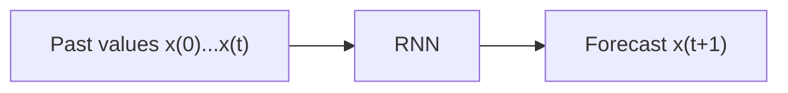
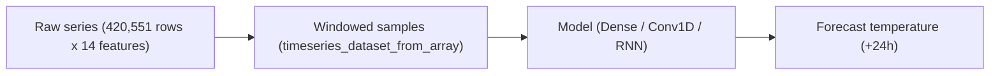

## What a time series is

A **time series** is a sequence of one or more values recorded over time — active
users per hour, daily temperature, quarterly revenue. If there's a single value
per time step it's **univariate**; if there are several (revenue, debt, and so on)
it's **multivariate**. The main task is **forecasting**: predicting future values.
A related task is **imputation**: filling in missing values from the past.



## Generating a toy time series

The book generates a synthetic univariate series — the sum of two sine waves
with random frequency and phase, plus a little noise — so you can focus on the
model instead of data cleaning:

```python title="generate_series.py" showLineNumbers{1}
import numpy as np

def generate_time_series(batch_size, n_steps):
    freq1, freq2, offsets1, offsets2 = np.random.rand(4, batch_size, 1)
    time = np.linspace(0, 1, n_steps)
    series = 0.5 * np.sin((time - offsets1) * (freq1 * 10 + 10))       # wave 1
    series += 0.2 * np.sin((time - offsets2) * (freq2 * 20 + 20))      # + wave 2
    series += 0.1 * (np.random.rand(batch_size, n_steps) - 0.5)        # + noise
    return series[..., np.newaxis].astype(np.float32)

n_steps = 50
series = generate_time_series(10000, n_steps + 1)
X_train, y_train = series[:7000, :n_steps], series[:7000, -1]
X_valid, y_valid = series[7000:9000, :n_steps], series[7000:9000, -1]
X_test, y_test = series[9000:, :n_steps], series[9000:, -1]

print(X_train.shape, y_train.shape)   # (7000, 50, 1) (7000, 1)
```

Notice the shape: RNN inputs are always `[batch_size, time_steps, dimensionality]`
— `dimensionality` is 1 for a univariate series, more for a multivariate one.

## Baseline metrics first

Before reaching for an RNN, always check a couple of simple baselines — otherwise
you might think a fancy model works great when it's actually worse than doing
almost nothing.

**Naive forecasting** — just predict that the series repeats its last value:

```python title="naive_baseline.py" showLineNumbers{1}
import numpy as np
from tensorflow import keras

y_pred_naive = X_valid[:, -1]
mse_naive = np.mean(keras.losses.mean_squared_error(y_valid, y_pred_naive))
print("Naive MSE:", mse_naive)   # ~0.020
```

**A plain linear model** (a `Dense` layer on the flattened input) does noticeably
better:

```python title="linear_baseline.py" showLineNumbers{1}
from tensorflow import keras

model = keras.models.Sequential([
    keras.layers.Flatten(input_shape=[50, 1]),
    keras.layers.Dense(1),
])
model.compile(loss="mse", optimizer="adam")
model.fit(X_train, y_train, epochs=20,
          validation_data=(X_valid, y_valid), verbose=0)
print("Linear MSE:", model.evaluate(X_valid, y_valid, verbose=0))   # ~0.004
```

That linear model is your target to beat with an RNN.

## A simple RNN

```python title="simple_rnn_forecast.py" showLineNumbers{1}
from tensorflow import keras

model = keras.models.Sequential([
    keras.layers.SimpleRNN(1, input_shape=[None, 1]),
])
model.compile(loss="mse", optimizer="adam")
model.fit(X_train, y_train, epochs=20,
          validation_data=(X_valid, y_valid), verbose=0)
print("SimpleRNN MSE:", model.evaluate(X_valid, y_valid, verbose=0))   # ~0.014
```

A single-neuron `SimpleRNN` beats the naive baseline but **doesn't** beat the
linear model — it only has 3 parameters total, which just isn't much capacity.

## Deep RNN

Stacking recurrent layers gives the model more capacity — this is called a
**deep RNN**. The key rule: every recurrent layer feeding another recurrent
layer needs `return_sequences=True`, so it hands over a full 3D sequence instead
of just the last step's output:

```python title="deep_rnn.py" showLineNumbers{1}
from tensorflow import keras

model = keras.models.Sequential([
    keras.layers.SimpleRNN(20, return_sequences=True, input_shape=[None, 1]),
    keras.layers.SimpleRNN(20),
    keras.layers.Dense(1),   # a Dense output layer (not the last recurrent layer)
])
model.compile(loss="mse", optimizer="adam")
model.fit(X_train, y_train, epochs=20,
          validation_data=(X_valid, y_valid), verbose=0)
print("Deep RNN MSE:", model.evaluate(X_valid, y_valid, verbose=0))   # ~0.003
```

Using a `Dense(1)` output instead of ending on `SimpleRNN(1)` is usually better:
it trains a little faster, performs about the same, and lets you pick any output
activation — a final recurrent layer with only 1 unit is stuck with a tiny hidden
state and (by default) a `tanh` output squeezed into `[-1, 1]`.

## Forecasting several steps ahead

What if you need the next **10** values, not just the next one? There are two
common strategies.

**Strategy 1 — repeat one-step forecasts.** Predict the next value, append it to
the input, predict again, and so on:

```python title="iterative_forecast.py" showLineNumbers{1}
import numpy as np

series = generate_time_series(1, n_steps + 10)
X_new, Y_new = series[:, :n_steps], series[:, n_steps:]
X = X_new
for step_ahead in range(10):
    y_pred_one = model.predict(X[:, step_ahead:], verbose=0)[:, np.newaxis, :]
    X = np.concatenate([X, y_pred_one], axis=1)

Y_pred = X[:, n_steps:]
```

Errors accumulate with each extra step, so this works best when you only need a
handful of steps ahead.

**Strategy 2 — predict all 10 steps at once.** Change the targets to be 10-value
vectors and give the output layer 10 units:

```python title="multi_step_forecast.py" showLineNumbers{1}
from tensorflow import keras

series = generate_time_series(10000, n_steps + 10)
X_train, Y_train = series[:7000, :n_steps], series[:7000, -10:, 0]
X_valid, Y_valid = series[7000:9000, :n_steps], series[7000:9000, -10:, 0]
X_test, Y_test = series[9000:, :n_steps], series[9000:, -10:, 0]

model = keras.models.Sequential([
    keras.layers.SimpleRNN(20, return_sequences=True, input_shape=[None, 1]),
    keras.layers.SimpleRNN(20),
    keras.layers.Dense(10),
])
model.compile(loss="mse", optimizer="adam")
model.fit(X_train, Y_train, epochs=20,
          validation_data=(X_valid, Y_valid), verbose=0)
```

This is more accurate than the iterative approach, but it only trains on the
error at the *last* time step. Better still: turn it into a true
**sequence-to-sequence** model, forecasting the next 10 values at *every* time
step (not only the last one) with `return_sequences=True` on every recurrent
layer and a `TimeDistributed(Dense(10))` output. This feeds far more error
gradients through the network — and stabilizes and speeds up training:

```python title="seq_to_seq_forecast.py" showLineNumbers{1}
import numpy as np
from tensorflow import keras

Y = np.empty((10000, n_steps, 10))
for step_ahead in range(1, 11):
    Y[:, :, step_ahead - 1] = series[:, step_ahead:step_ahead + n_steps, 0]
Y_train, Y_valid, Y_test = Y[:7000], Y[7000:9000], Y[9000:]

model = keras.models.Sequential([
    keras.layers.SimpleRNN(20, return_sequences=True, input_shape=[None, 1]),
    keras.layers.SimpleRNN(20, return_sequences=True),
    keras.layers.TimeDistributed(keras.layers.Dense(10)),
])

def last_time_step_mse(Y_true, Y_pred):
    return keras.metrics.mean_squared_error(Y_true[:, -1], Y_pred[:, -1])

model.compile(loss="mse", optimizer=keras.optimizers.Adam(learning_rate=0.01),
              metrics=[last_time_step_mse])
model.fit(X_train, Y_train, epochs=20, validation_data=(X_valid, Y_valid), verbose=0)
```

All outputs are used for the training loss, but only the last time step matters
for evaluation — hence the custom `last_time_step_mse` metric. `TimeDistributed`
applies its wrapped layer (here, `Dense(10)`) independently to every time step.

## Comparing the approaches

| Model | Approx. MSE (1-step) | Notes |
| --- | --- | --- |
| Naive (repeat last value) | 0.020 | free, always compute this first |
| Linear (`Flatten` + `Dense`) | 0.004 | strong, cheap baseline |
| `SimpleRNN(1)` | 0.014 | worse than linear — too little capacity |
| Deep RNN (3 `SimpleRNN` layers) | 0.003 | finally beats the linear model |

For 10-step-ahead forecasts, sequence-to-vector (~0.008 MSE) beats the iterative
one-step-at-a-time approach (~0.029 MSE), and a full sequence-to-sequence model
(~0.006 MSE) beats both.

## A real-world example: the Jena temperature dataset (Chollet)

The synthetic sine-wave series above is great for learning the mechanics, but
real sensor data is messier. *Deep Learning with Python* (Chollet) walks through
a concrete problem: given hourly weather measurements — temperature, pressure,
humidity, and 11 other quantities — from the past 5 days, predict the
temperature **24 hours from now**. The raw file has 420,551 rows (one every 10
minutes, from 2009-2016) and 14 columns.



### Windowing data with `timeseries_dataset_from_array`

Instead of writing your own generator for overlapping windows, Keras ships a
utility that slices a raw array into fixed-length sequences (and lines up a
matching target for each one) on the fly, without duplicating the data in
memory. A tiny example makes the idea concrete — feed in the numbers 0-9, ask
for windows of length 3, and target each window with the value 3 steps ahead:

```python title="windowing_demo.py" showLineNumbers{1}
import numpy as np
from tensorflow import keras

int_sequence = np.arange(10)
dummy_dataset = keras.utils.timeseries_dataset_from_array(
    data=int_sequence[:-3],
    targets=int_sequence[3:],
    sequence_length=3,
    batch_size=2,
)
for inputs, targets in dummy_dataset:
    for i in range(inputs.shape[0]):
        print([int(x) for x in inputs[i]], int(targets[i]))

# ── Output ───────────────────────────
# [0, 1, 2] 3
# [1, 2, 3] 4
# [2, 3, 4] 5
# [3, 4, 5] 6
# [4, 5, 6] 7
# ─────────────────────────────────────
```

For the real temperature task, the book uses `sampling_rate=6` (keep one point
per hour instead of every 10 minutes), `sequence_length=120` (5 days of hourly
data), and `delay = sampling_rate * (sequence_length + 24 - 1)` (so each target
lands exactly 24 hours past the end of its window):

```python title="jena_windows.py" showLineNumbers{1}
from tensorflow import keras

sampling_rate = 6
sequence_length = 120
delay = sampling_rate * (sequence_length + 24 - 1)
batch_size = 256

train_dataset = keras.utils.timeseries_dataset_from_array(
    raw_data[:-delay],
    targets=temperature[delay:],
    sampling_rate=sampling_rate,
    sequence_length=sequence_length,
    shuffle=True,
    batch_size=batch_size,
    start_index=0,
    end_index=num_train_samples,
)
# val_dataset / test_dataset follow the same call with shifted start/end_index

for samples, targets in train_dataset:
    print("samples shape:", samples.shape)   # (256, 120, 14)
    print("targets shape:", targets.shape)   # (256,)
    break
```

### A common-sense baseline (before touching a neural net)

Chollet's rule: always write down the dumbest possible heuristic and measure it
before reaching for deep learning. Here, temperature is both continuous and
roughly periodic day-to-day, so a reasonable guess is "24 hours from now, the
temperature will be about the same as it is right now":

```python title="common_sense_baseline.py" showLineNumbers{1}
import numpy as np

def evaluate_naive_method(dataset, temperature_mean, temperature_std):
    total_abs_err = 0.0
    samples_seen = 0
    for samples, targets in dataset:
        # column 1 is temperature; un-normalize it back to degrees Celsius
        preds = samples[:, -1, 1] * temperature_std + temperature_mean
        total_abs_err += np.sum(np.abs(preds - targets))
        samples_seen += samples.shape[0]
    return total_abs_err / samples_seen

# Validation MAE: 2.44 degrees Celsius
# Test MAE:       2.62 degrees Celsius
```

This uses **mean absolute error (MAE)** rather than MSE, since MAE stays in the
original units (degrees) and is easy to reason about: "off by 2.44 degrees on
average."

### Dense and Conv1D models don't beat the baseline

It's tempting to assume "more complex = better," so it's worth checking a plain
`Dense` model and a `Conv1D` model against that 2.44-degree baseline first:

```python title="dense_vs_conv_jena.py" showLineNumbers{1}
from tensorflow import keras
from tensorflow.keras import layers

# A flattened, densely-connected model
inputs = keras.Input(shape=(sequence_length, 14))
x = layers.Flatten()(inputs)
x = layers.Dense(16, activation="relu")(x)
outputs = layers.Dense(1)(x)
dense_model = keras.Model(inputs, outputs)

# A 1D convnet
inputs = keras.Input(shape=(sequence_length, 14))
x = layers.Conv1D(8, 24, activation="relu")(inputs)
x = layers.MaxPooling1D(2)(x)
x = layers.Conv1D(8, 12, activation="relu")(x)
x = layers.MaxPooling1D(2)(x)
x = layers.Conv1D(8, 6, activation="relu")(x)
x = layers.GlobalAveragePooling1D()(x)
outputs = layers.Dense(1)(x)
conv_model = keras.Model(inputs, outputs)
```

| Model | Val MAE | vs. baseline (2.44) |
| --- | --- | --- |
| Common-sense baseline | 2.44 | — |
| `Flatten` + `Dense` | ~2.5-3.0 | rarely beats it — flattening throws away the notion of time |
| `Conv1D` + pooling | ~2.9 | worse — pooling destroys order, and weather isn't shift-invariant across a day |
| `LSTM(16)` | 2.36 | finally beats the baseline |

Flattening the window into one long vector destroys any notion of "before" and
"after." A `Conv1D` at least respects local order within its window, but pooling
still throws away *where in the day* a pattern happened — morning weather
behaves differently than evening weather, so the "same pattern anywhere in the
window" assumption behind convolutions doesn't hold as well as it does for
images. An RNN, which walks through the sequence in order and never destroys
that order, is the natural fit — exactly the deep RNNs built earlier on this
page.

:::tip[From the book]
*Deep Learning with Python* (Chollet) frames baselines as a search problem: your
model can only pick from the "hypothesis space" you gave it (here, two-layer
`Dense` networks, or a stack of `Conv1D` + pooling). Even if a good solution
technically exists somewhere in that space, gradient descent isn't guaranteed to
find it — so an architecture that structurally matches your data (an RNN, for
ordered sequences) beats a more powerful-looking one that doesn't.
:::

### Watch a window slide across the raw series

Every sample an RNN sees is a fixed-length **window** cut from the raw series.
As the window slides forward one step at a time, the point it's predicting
(24 hours past the window's end) slides forward with it:

```p5 title="Sliding window over a temperature series" desc="The amber box is one training window (past values), sliding across the series; the connected blue dot is its 24-hour-ahead target." height="260"
let t = 0;
const total = 140;
const winLen = 30;
const gap = 14;
function trueVal(i) {
  return 0.4 * sin(i * 0.09) + 0.15 * sin(i * 0.21 + 1.2);
}
function setup() {
  createCanvas(600, 260);
  textFont("monospace");
}
function px(i) { return 40 + (i / total) * (width - 80); }
function py(v) { return 140 - v * 90; }
function smoothstep(x) {
  x = constrain(x, 0, 1);
  return x * x * (3 - 2 * x);
}
function draw() {
  background(13, 17, 23);

  stroke(60, 70, 84);
  strokeWeight(1);
  line(40, 140, width - 40, 140);

  stroke(90, 100, 114);
  strokeWeight(2);
  noFill();
  beginShape();
  for (let i = 0; i <= total; i++) vertex(px(i), py(trueVal(i)));
  endShape();

  const range = total - winLen - gap;
  const start = t % range;
  // fade the moving pieces right at the loop seam so the jump-back is invisible
  const fade = min(smoothstep(start / 6), smoothstep((range - start) / 6));
  const winEnd = start + winLen;
  const targetX = winEnd + gap;

  noFill();
  stroke(255, 211, 67, 255 * fade);
  strokeWeight(2);
  rect(px(start), 30, px(winEnd) - px(start), 190, 4);

  stroke(120, 90, 40, 255 * fade);
  strokeWeight(1.5);
  drawingContext.setLineDash([4, 4]);
  line(px(winEnd), py(trueVal(winEnd)), px(targetX), py(trueVal(targetX)));
  drawingContext.setLineDash([]);

  noStroke();
  fill(75, 139, 190, 255 * fade);
  ellipse(px(targetX), py(trueVal(targetX)), 10, 10);

  fill(200, 160, 90, 255 * fade);
  textSize(11);
  textAlign(CENTER, TOP);
  text("window (past 5 days)", (px(start) + px(winEnd)) / 2, 14);

  fill(107, 169, 221, 255 * fade);
  textAlign(LEFT, TOP);
  text("target (+24h)", px(targetX) + 8, py(trueVal(targetX)) - 20);

  fill(150);
  textAlign(CENTER, CENTER);
  textSize(11);
  text("amber = one training window   blue = the value it predicts", width / 2, 235);

  t += 0.6;
}
```

## Mini-checkpoint

Why must you set `return_sequences=True` on every recurrent layer except
possibly the last one, when stacking recurrent layers?

- because each layer needs to receive a full 3D sequence `[batch, time, features]`
  as input, not just the 2D output of the previous layer's last time step.

:::tip[From the book]
*Hands-On Machine Learning* (Géron) stresses that baselines matter: a naive
forecast (about 0.020 MSE) and a simple linear model (about 0.004 MSE) already
beat a single-neuron `SimpleRNN` (about 0.014 MSE). It takes a **deep** RNN with
several recurrent layers to finally outperform the linear model — a good
reminder that "using an RNN" isn't automatically better than a simpler model; the
architecture still has to earn it.
:::

## Visualize it

Watch a noisy signal (blue, the actual values) and a forecast curve (amber, what
the model predicts) — the forecast tracks the true signal for the steps it has
already seen, then keeps extrapolating for the future steps marked past the
dashed line:

```p5 title="Time series forecast" desc="The blue curve is the true signal, traced out over time; the amber curve is the model's forecast, which stays close for known steps and drifts a little past the forecast boundary." height="280"
let t = 0;
const total = 90, splitAt = 62;
const holdFrames = 90; // frames to hold the finished curve before looping
function trueVal(i) {
  return 0.5 * sin(i * 0.14) + 0.2 * sin(i * 0.05 + 1) ;
}
function setup() {
  createCanvas(600, 280);
  textFont("monospace");
}
function px(i) { return 40 + (i / total) * (width - 80); }
function py(v) { return height / 2 - v * 90; }
function smoothstep(x) {
  x = constrain(x, 0, 1);
  return x * x * (3 - 2 * x);
}
function draw() {
  const cycleLen = total * 4 + holdFrames;
  const cyclePos = t % cycleLen;
  // fade near the loop seam so restarting the trace is invisible
  const fade = min(smoothstep(cyclePos / 20), smoothstep((cycleLen - cyclePos) / 20));

  background(13, 17, 23);
  stroke(60, 70, 84);
  strokeWeight(1);
  line(40, height / 2, width - 40, height / 2);

  // forecast boundary
  stroke(120, 90, 40);
  strokeWeight(1.5);
  drawingContext.setLineDash([5, 5]);
  line(px(splitAt), 20, px(splitAt), height - 30);
  drawingContext.setLineDash([]);

  const reveal = min(cyclePos / 4, total);

  stroke(75, 139, 190);
  strokeWeight(2.5);
  noFill();
  beginShape();
  for (let i = 0; i <= min(reveal, total); i++) vertex(px(i), py(trueVal(i)));
  endShape();

  if (reveal > splitAt) {
    stroke(255, 211, 67);
    strokeWeight(2.5);
    noFill();
    beginShape();
    for (let i = splitAt; i <= reveal; i++) {
      const noiseTerm = 0.06 * sin(i * 1.7 + 2) * ((i - splitAt) / (total - splitAt));
      vertex(px(i), py(trueVal(i) + noiseTerm));
    }
    endShape();
  }

  noStroke();
  fill(150);
  textSize(11);
  textAlign(LEFT, TOP);
  text("known history", 44, 24);
  fill(200, 160, 90);
  text("forecast →", px(splitAt) + 8, 24);

  fill(107, 169, 221);
  textAlign(CENTER, CENTER);
  textSize(12);
  text("blue = true signal   amber = model forecast", width / 2, height - 14);

  // dim to background right at the loop seam so the reset is invisible
  noStroke();
  fill(13, 17, 23, (1 - fade) * 255);
  rect(0, 0, width, height);

  t++;
}
```

import DataCampExercise from "../../../../components/DataCampExercise.astro";

## 🧪 Try It Yourself

### Exercise 1 – Compute a Naive Baseline

<DataCampExercise
  lang="python"
  hint={`Naive forecasting predicts the next value equals the last value: use \`X_valid[:, -1]\`.`}
  code={`# Task: Exercise 1 – Compute a Naive Baseline
import numpy as np

X_valid = np.array([[[0.1], [0.2], [0.3]], [[0.4], [0.5], [0.6]]])
y_valid = np.array([[0.35], [0.65]])

y_pred_naive = X_valid[:, ___]   # replace ___ with -1
mse = np.mean((y_valid - y_pred_naive) ** 2)
print(f"Naive MSE: {mse:.4f}")

# ── Expected Output ───────────────────────────────────────────
# Naive MSE: 0.0025
# ──────────────────────────────────────────────────────────────`}
  solution={`import numpy as np

X_valid = np.array([[[0.1], [0.2], [0.3]], [[0.4], [0.5], [0.6]]])
y_valid = np.array([[0.35], [0.65]])

y_pred_naive = X_valid[:, -1]
mse = np.mean((y_valid - y_pred_naive) ** 2)
print(f"Naive MSE: {mse:.4f}")`}
  sct={`test_output_contains("Naive MSE: 0.0025")
success_msg("That's the naive forecasting baseline - always check this first!")`}
  height={158}
/>

### Exercise 2 – Stack a Deep RNN

<DataCampExercise
  lang="python"
  hint={`Every recurrent layer feeding another recurrent layer needs \`return_sequences=True\`.`}
  code={`# Task: Exercise 2 – Stack a Deep RNN
from tensorflow import keras

model = keras.models.Sequential([
    keras.layers.SimpleRNN(20, return_sequences=___, input_shape=[None, 1]),  # replace ___ with True
    keras.layers.SimpleRNN(20),
    keras.layers.Dense(1),
])
model.compile(loss="mse", optimizer="adam")
print("Layers:", len(model.layers))

# ── Expected Output ───────────────────────────────────────────
# Layers: 3
# ──────────────────────────────────────────────────────────────`}
  solution={`from tensorflow import keras

model = keras.models.Sequential([
    keras.layers.SimpleRNN(20, return_sequences=True, input_shape=[None, 1]),
    keras.layers.SimpleRNN(20),
    keras.layers.Dense(1),
])
model.compile(loss="mse", optimizer="adam")
print("Layers:", len(model.layers))`}
  sct={`test_output_contains("Layers: 3")
success_msg("A deep RNN - three layers stacked, with return_sequences chaining them together!")`}
  height={158}
/>

### Exercise 3 – Prepare Multi-Step Targets

<DataCampExercise
  lang="python"
  hint={`For 10-step-ahead forecasts, slice the last 10 values of each series: \`series[:, -10:, 0]\`.`}
  code={`# Task: Exercise 3 – Prepare Multi-Step Targets
import numpy as np

series = np.random.rand(5, 60, 1).astype("float32")

Y = series[:, ___:, 0]   # replace ___ with -10
print("Targets shape:", Y.shape)

# ── Expected Output ───────────────────────────────────────────
# Targets shape: (5, 10)
# ──────────────────────────────────────────────────────────────`}
  solution={`import numpy as np

series = np.random.rand(5, 60, 1).astype("float32")

Y = series[:, -10:, 0]
print("Targets shape:", Y.shape)`}
  sct={`test_output_contains("Targets shape: (5, 10)")
success_msg("One 10-value target vector per series - ready for a multi-output Dense(10) layer!")`}
  height={148}
/>

### Exercise 4 – Window a Series with timeseries_dataset_from_array

<DataCampExercise
  lang="python"
  hint={`Pass \`data\`, \`targets\`, and \`sequence_length\` to \`keras.utils.timeseries_dataset_from_array\`; the target for a window starting at index N is \`int_sequence[N + sequence_length]\`.`}
  code={`# Task: Exercise 4 – Window a Series with timeseries_dataset_from_array
import numpy as np
from tensorflow import keras

int_sequence = np.arange(10)
dataset = keras.utils.timeseries_dataset_from_array(
    data=int_sequence[:-3],
    targets=int_sequence[___:],   # replace ___ with 3
    sequence_length=3,
    batch_size=5,
)
for inputs, targets in dataset:
    print("First window:", [int(x) for x in inputs[0]], "-> target", int(targets[0]))
    break

# ── Expected Output ───────────────────────────────────────────
# First window: [0, 1, 2] -> target 3
# ──────────────────────────────────────────────────────────────`}
  solution={`import numpy as np
from tensorflow import keras

int_sequence = np.arange(10)
dataset = keras.utils.timeseries_dataset_from_array(
    data=int_sequence[:-3],
    targets=int_sequence[3:],
    sequence_length=3,
    batch_size=5,
)
for inputs, targets in dataset:
    print("First window:", [int(x) for x in inputs[0]], "-> target", int(targets[0]))
    break`}
  sct={`test_output_contains("First window: [0, 1, 2] -> target 3")
success_msg("That's exactly how Keras turns a raw series into (window, target) pairs for training!")`}
  height={168}
/>

## Next

Continue to **Advanced Recurrent Layers (Dropout, Stacking, Bidirectional)** —
refine these RNNs with recurrent dropout, deeper stacks, and bidirectional
wrappers before moving on to text data in Phase 5.
