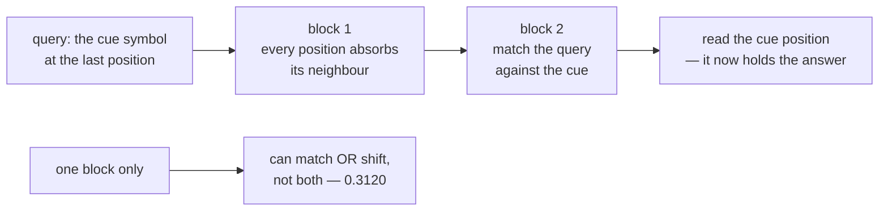

Recurrence reads a sequence one step at a time and carries a state.
[Phase 4 measured](/deep-learning/phase-04---sequence-models-with-rnns/intro-to-recurrent-neural-networks-rnn-for-sequences/)
what that costs: a `SimpleRNN` stopped working between 40 and 100 timesteps, and even an
LSTM failed at 200.

Attention takes the opposite approach. Every position looks at **every other position
directly**, in one step, with weights that depend on content. There is no state to
decay, and the path between any two positions has length 1.

$$
\mathrm{Attention}(Q, K, V) = \mathrm{softmax}\!\left(\frac{QK^\top}{\sqrt{d_k}}\right)V
$$

That is the whole operation. This page implements it in six lines of NumPy, checks it
against `keras.layers.MultiHeadAttention` (**agreeing to 2.03e-07**), measures why the
$\sqrt{d_k}$ is there, and then finds a task that a single attention layer **cannot**
solve no matter how long you train it.

## What you'll learn

- Queries, keys and values as a lookup: what each one is *for*, not just its shape.
- The measured reason for the scale factor: without it, the largest attention weight
  climbs from **0.4442 at $d_k = 4$ to 0.9355 at $d_k = 256$**.
- Causal and padding masks, and what each one blocks.
- Multi-head attention as several lookups in parallel.
- A task where one attention block scores **0.3120** and two score **0.9990** — and the
  circuit that makes the difference.

## Queries, keys and values

The names come from dictionary lookup. In a Python `dict` you compare a key for equality
and get back exactly one value. Attention softens both halves: it compares a **query**
against every **key** by dot product, turns those scores into weights that sum to 1, and
returns the weighted average of the **values**.

```python title="Scaled dot-product attention, in full"
def attention(query, key, value, mask=None):
    scores = query @ key.T                       # (queries, keys) similarity
    scores = scores / np.sqrt(query.shape[-1])   # the scale — see below
    if mask is not None:
        scores = np.where(mask, scores, -1e9)    # blocked pairs get -inf
    weights = softmax(scores, axis=-1)           # each row sums to 1
    return weights @ value, weights
```

Three separate projections turn one sequence into $Q$, $K$ and $V$ — which is what makes
the operation learnable. **Self-attention** is the case where all three come from the
same tokens: every position asks its own question about every other position.

Run that NumPy against Keras with the layer's own weights and the outputs differ by
**2.03e-07**, the attention weights by **6.48e-08**. Float32 rounding, nothing else.

## Why divide by $\sqrt{d_k}$

The dot product of two $d$-dimensional vectors with unit-variance components has
variance $d$. Feed larger scores to a softmax and it saturates — all the weight lands on
one key.

<Figure
  src="/images/dl/phase-05-nlp/attention-from-scratch/scaling-and-softmax"
  alt="Two panels over 200 random draws with 12 tokens. Left: mean largest attention weight against key dimension. Without scaling it rises 0.4442, 0.7189, 0.8577, 0.9355 as the dimension goes 4, 16, 64, 256; with the 1/sqrt(d_k) scale it stays between 0.2567 and 0.3024. A dashed line marks uniform attention at 0.0833. Right: the same measurement as entropy, falling from 1.6128 to 0.1668 nats unscaled and holding near 2.08 scaled, against log 12 = 2.4849 for uniform."
  title="200 random query-key draws, 12 tokens"
  caption="Without the scale, attention at d_k = 256 puts 0.9355 of its weight on a single token before any training — the softmax has saturated on noise, and its gradient with it. The scaled version holds near 0.28 at every dimension, which is the point: the operation should behave the same whether the head is 4-dimensional or 256-dimensional. The entropy panel says the same thing in nats, against a uniform maximum of 2.4849."
/>

| $d_k$ | Max weight, unscaled | Max weight, scaled | Entropy, unscaled | Entropy, scaled |
| --- | --- | --- | --- | --- |
| 4 | 0.4442 | 0.2567 | 1.6128 | 2.1533 |
| 16 | 0.7189 | 0.2918 | 0.7792 | 2.0866 |
| 64 | 0.8577 | 0.3024 | 0.3698 | 2.0702 |
| 256 | **0.9355** | **0.2812** | **0.1668** | 2.1064 |

Uniform attention over 12 tokens is 0.0833 with entropy $\log 12 = 2.4849$. A saturated
softmax is not just badly behaved at the forward pass — its gradient is near zero
everywhere except at the winning key, so the layer stops learning which key it *should*
have picked.

## Masks

A mask is applied to the **scores**, before the softmax, by setting blocked pairs to a
large negative number. After the softmax they hold exactly zero weight — measured
`0.00e+00`, not "approximately zero".

<Figure
  src="/images/dl/phase-05-nlp/attention-from-scratch/masks"
  alt="Three 10-by-10 grids of allowed query-key pairs. The causal mask is lower-triangular and allows 0.55 of pairs. The padding mask allows the first six columns for every row, 0.60 of pairs. Combining both leaves 0.45."
  title="Causal, padding, and both"
  caption="The causal mask stops a position seeing the future, which is what makes a decoder trainable in parallel: every position predicts its next token at once, and none of them can cheat. The padding mask stops every position attending to positions that are not really there — the attention-shaped version of the same bug measured in Phase 4, where post-padding without a mask dropped a SimpleRNN to chance."
/>

| Mask | Pairs allowed |
| --- | --- |
| causal (10 positions) | 0.5500 |
| padding (6 of 10 real) | 0.6000 |
| both | 0.4500 |

The two are not interchangeable. Causal masking is about **what the model is allowed to
know**; padding masking is about **what actually exists**. A decoder needs both.

## Multi-head attention

One head produces one weighted average. If a position needs both "the noun this
adjective modifies" and "the last time this token appeared", one softmax cannot deliver
both — its weights sum to 1 and must be spent somewhere.

```python title="h heads, each of width d_model / h"
attention = keras.layers.MultiHeadAttention(num_heads=4, key_dim=64 // 4)
output = attention(tokens, tokens)                        # self-attention
output, scores = attention(tokens, tokens, return_attention_scores=True)
```

Splitting a 64-dimensional model into 4 heads of 16 costs **no extra parameters** — the
same projection matrices are reshaped — and buys four independent lookups.

## A task one attention layer cannot do

Here is the sharpest measurement on the page. The task: a sequence of symbols contains a
**cue** symbol exactly once; the same cue is repeated at the final position as a query;
the answer is the token that came **immediately after** the earlier cue.

```text
symbols:  3 7 2 [CUE] 5 1 4 6 2 ... [CUE]
                       ^ the answer is 5
```

| Attention blocks | Parameters | Best validation accuracy |
| --- | --- | --- |
| 1 | 9,129 | **0.3120** |
| 2 | 17,673 | **0.9990** |

Chance is 0.1429. One block gets barely above it; two blocks solve it essentially
perfectly. Nothing else changed — same data, same seed, same 30 epochs.

<Figure
  src="/images/dl/phase-05-nlp/attention-from-scratch/learned-attention"
  alt="Two panels. Left: validation accuracy per epoch, where the one-block model stays flat near 0.31 for all 30 epochs while the two-block model jumps from 0.30 to 1.00 between epochs 5 and 10. Right: mean attention weight from the query position against offset from the answer position, showing a sharp spike of about 0.87 at offset -1 for one head, with everything else near zero and a dashed uniform line at 0.0625."
  title="Match the cue, then read the next token"
  caption="The left panel is a capability boundary, not a tuning difference — the one-block model never improves. The right panel shows the circuit the two-block model found: the second block's query attends almost entirely to offset -1, which is the cue position rather than the answer position. The first block has already let each position absorb its neighbour, so by the time the second block matches the cue, the cue position is carrying the answer."
/>

**Why one layer is not enough.** Solving the task requires two operations: *match* the
query against the cue by content, and *move* one position along. A single attention
layer does one weighted average — it can match content or apply a fixed positional
offset, but not compose them. Two layers can, and the measured attention shows exactly
how: the first block moves neighbour information into each position, the second block
matches the cue and reads what is now there.

This composition has a name in the interpretability literature — an **induction head** —
and it is the smallest example of why depth buys qualitatively new behaviour rather than
just capacity. It also explains the shape of the learning curve: the two-block model sits
at chance for five epochs and then jumps to 1.00 in three, because the circuit only works
once *both* halves exist.



```p5 title="Attention as a soft lookup" desc="Drag the query vector. The bars are the attention weights over five keys; the output is their weighted average of the values." height="340"
let query = { x: 0.7, y: 0.4 };
let dragging = false;
const KEYS = [
  { x: 0.9, y: 0.2, value: 10, label: "k0" },
  { x: 0.2, y: 0.9, value: 20, label: "k1" },
  { x: -0.7, y: 0.5, value: 30, label: "k2" },
  { x: -0.5, y: -0.8, value: 40, label: "k3" },
  { x: 0.4, y: -0.6, value: 50, label: "k4" },
];
let scale = true;
function setup() {
  createCanvas(620, 340);
  textFont("monospace");
}
function weights() {
  const dk = 2;
  const scores = KEYS.map((k) => (query.x * k.x + query.y * k.y)
    * (scale ? 1 / Math.sqrt(dk) : 1) * 6);
  const peak = Math.max(...scores);
  const exponent = scores.map((s) => Math.exp(s - peak));
  const total = exponent.reduce((a, b) => a + b, 0);
  return exponent.map((e) => e / total);
}
function draw() {
  background(13, 17, 23);
  const cx = 150;
  const cy = 150;
  const r = 95;
  noStroke();
  fill(230);
  textSize(11);
  textAlign(LEFT, TOP);
  text("keys and query in 2-D", 40, 20);
  stroke(50, 58, 70);
  line(cx - r - 10, cy, cx + r + 10, cy);
  line(cx, cy - r - 10, cx, cy + r + 10);
  const w = weights();
  KEYS.forEach((k, index) => {
    stroke(107, 169, 221, 90 + w[index] * 165);
    strokeWeight(1 + w[index] * 6);
    line(cx, cy, cx + k.x * r, cy - k.y * r);
    noStroke();
    fill(107, 169, 221);
    circle(cx + k.x * r, cy - k.y * r, 9);
    fill(180);
    textSize(9.5);
    text(k.label, cx + k.x * r + 8, cy - k.y * r - 6);
  });
  stroke(255, 211, 67);
  strokeWeight(2.5);
  line(cx, cy, cx + query.x * r, cy - query.y * r);
  noStroke();
  fill(255, 211, 67);
  circle(cx + query.x * r, cy - query.y * r, 11);
  textSize(10);
  text("query (drag)", cx + query.x * r + 8, cy - query.y * r - 6);

  fill(230);
  textSize(11);
  textAlign(LEFT, TOP);
  text("attention weights", 320, 20);
  let output = 0;
  KEYS.forEach((k, index) => {
    const y = 46 + index * 34;
    fill(60, 70, 84);
    rect(320, y, 240, 22, 3);
    fill(165, 214, 164);
    rect(320, y, 240 * w[index], 22, 3);
    fill(235);
    textSize(10);
    textAlign(LEFT, CENTER);
    text(k.label + "  v=" + k.value + "   " + w[index].toFixed(4), 326, y + 11);
    textAlign(LEFT, TOP);
    output += w[index] * k.value;
  });
  fill(255, 211, 67);
  textSize(12);
  text("output = " + output.toFixed(3), 320, 224);
  fill(150);
  textSize(10);
  text("a weighted average of the values, never a value itself", 320, 244);
  fill(60, 70, 84);
  rect(320, 268, 150, 26, 4);
  fill(220);
  textAlign(CENTER, CENTER);
  textSize(10.5);
  text(scale ? "scaled by 1/sqrt(d)" : "no scaling", 395, 281);
  textAlign(LEFT, TOP);
  fill(150);
  textSize(10);
  text("unscaled, the weights collapse onto one key —", 40, 268);
  text("measured 0.9355 at d_k = 256 before any training", 40, 284);
  text("max weight now: " + Math.max(...w).toFixed(4), 40, 304);
}
function mousePressed() {
  if (mouseX > 320 && mouseX < 470 && mouseY > 268 && mouseY < 294) {
    scale = !scale;
    return;
  }
  dragging = true;
}
function mouseDragged() {
  if (!dragging) return;
  const dx = (mouseX - 150) / 95;
  const dy = (150 - mouseY) / 95;
  const length = Math.max(Math.hypot(dx, dy), 1e-6);
  query = { x: dx / Math.max(length, 1), y: dy / Math.max(length, 1) };
}
function mouseReleased() { dragging = false; }
```

```p5 title="The measured table, ranked" desc="Click a column to rank every row by it. The bars are that column's values and the highest and lowest are computed from the numbers, not written in." height="254"
let metric = 0;
const COLUMNS = ["Max weight, unscaled", "Max weight, scaled", "Entropy, unscaled", "Entropy, scaled"];
const ROWS = [
  ["4", 0.4442, 0.2567, 1.6128, 2.1533],
  ["16", 0.7189, 0.2918, 0.7792, 2.0866],
  ["64", 0.8577, 0.3024, 0.3698, 2.0702],
  ["256", 0.9355, 0.2812, 0.1668, 2.1064]
];
function setup() {
  createCanvas(620, 254);
  textFont("monospace");
}
function fmt(v) {
  if (v === 0) { return "0"; }
  const a = Math.abs(v);
  if (a >= 1000 || a < 0.001) { return v.toExponential(2); }
  if (a >= 100) { return v.toFixed(1); }
  return v.toFixed(4);
}
function draw() {
  background(13, 17, 23);
  noStroke();
  fill(230);
  textSize(12);
  textAlign(LEFT, TOP);
  text("Attention from Scratch (Queries, K", 26, 16);
  let x = 26;
  for (let i = 0; i < COLUMNS.length; i++) {
    const w = COLUMNS[i].length * 6.6 + 16;
    if (i === metric) { fill(255, 211, 67); } else { fill(48, 56, 68); }
    rect(x, 40, w, 22, 4);
    if (i === metric) { fill(13, 17, 23); } else { fill(180); }
    textSize(9);
    text(COLUMNS[i], x + 8, 47);
    x += w + 6;
    if (x > 500) { break; }
  }
  const values = ROWS.map((r) => r[metric + 1]);
  const lo = Math.min(...values);
  const hi = Math.max(...values);
  const span = hi - lo === 0 ? 1 : hi - lo;
  const order = ROWS.slice().sort((a, b) => b[metric + 1] - a[metric + 1]);
  for (let i = 0; i < order.length; i++) {
    const y = 78 + i * 26;
    const v = order[i][metric + 1];
    fill(160);
    textSize(9);
    text(order[i][0], 26, y + 5);
    fill(34, 40, 50);
    rect(230, y, 280, 18, 3);
    const frac = (v - lo) / span;
    if (v === hi) { fill(126, 192, 143); }
    else if (v === lo) { fill(224, 108, 117); }
    else { fill(107, 169, 221); }
    rect(230, y, Math.max(frac * 280, 3), 18, 3);
    fill(225);
    textSize(9);
    text(fmt(v), 518, y + 5);
  }
  const top = order[0];
  const bottom = order[order.length - 1];
  fill(150);
  textSize(9);
  const base = 78 + order.length * 26 + 8;
  text("highest " + COLUMNS[metric] + ": " + top[0] + " at " + fmt(top[1]),
       26, base);
  text("lowest  " + COLUMNS[metric] + ": " + bottom[0] + " at "
       + fmt(bottom[1]), 26, base + 14);
  text("bars are scaled within the chosen column - lowest is not zero", 26,
       base + 30);
}
function mousePressed() {
  let x = 26;
  for (let i = 0; i < COLUMNS.length; i++) {
    const w = COLUMNS[i].length * 6.6 + 16;
    if (mouseX > x && mouseX < x + w && mouseY > 40 && mouseY < 62) {
      metric = i;
    }
    x += w + 6;
  }
}
```

## Pitfalls

- **Dropping the $1/\sqrt{d_k}$.** At $d_k = 256$ the largest weight is 0.9355 before
  training: a saturated softmax with almost no gradient.
- **Masking after the softmax.** The weights no longer sum to 1. Mask the scores, then
  normalise.
- **Using a large negative constant instead of `-inf` carelessly.** `-1e9` is fine in
  float32; `-1e30` overflows to `-inf` in float16 and produces `NaN` when a whole row is
  masked.
- **Forgetting the padding mask.** Attention will happily average padding vectors, which
  is the same class of bug that dropped a SimpleRNN to 0.5036 in Phase 4.
- **Confusing causal with padding masks.** One hides the future, the other hides what
  does not exist. A decoder needs both.
- **Expecting one attention layer to compose two operations.** Match-then-shift needed
  two blocks: 0.3120 against 0.9990.
- **Reading attention weights as explanations.** The head that solved this task put 0.87
  on the cue position — but on
  [Vision Transformers](/deep-learning/phase-03---computer-vision-with-cnns/vision-transformers-vit/)
  a confidently wrong prediction had entirely unremarkable attention.

## Recap

- Attention is `softmax(QKᵀ/√d_k)V` — a soft dictionary lookup returning a weighted
  average of values. Six lines, matching Keras to 2.03e-07.
- The scale exists because dot-product variance grows with $d_k$: unscaled max weight
  0.4442 → 0.9355 as $d_k$ goes 4 → 256, entropy 1.6128 → 0.1668.
- Masks are applied to the scores before the softmax and leave exactly 0.00e+00 weight.
- Causal masks allowed 0.5500 of pairs, padding masks 0.6000, both 0.4500.
- Multiple heads cost no extra parameters and buy independent lookups.
- One attention block scored 0.3120 on match-then-read; two scored 0.9990. Depth composes
  operations that width cannot.

## Next

Attention plus a feed-forward block, residuals and normalisation is a transformer. The
full architecture, measured against the recurrent models from Phase 4:
[The Transformer Architecture](/deep-learning/phase-05---nlp--transformers/the-transformer-architecture/).

<Quiz
  questions={[
    {
      q: "Why is the attention score divided by the square root of the key dimension?",
      options: [
        "To keep the output in the range [0, 1]",
        "Because the dot product of d-dimensional vectors has variance d, so without the scale the softmax saturates — measured 0.9355 of the weight on one token at d_k = 256, before any training",
        "To make the gradients larger",
        "Because the softmax requires normalised inputs",
      ],
      answer: 1,
      explain: "A saturated softmax also has a near-zero gradient, so the layer stops learning which key it should have chosen.",
    },
    {
      q: "A causal mask on 10 positions allows 0.5500 of query-key pairs, and a padding mask with 6 real tokens allows 0.6000. What is the difference in purpose?",
      options: [
        "They are two names for the same thing",
        "The causal mask hides the future — what the model is allowed to know; the padding mask hides positions that do not exist. A decoder needs both",
        "The causal mask is applied after the softmax",
        "Padding masks are only needed for images",
      ],
      answer: 1,
      explain: "Combining both left 0.4500 of pairs allowed. Omitting the padding mask is the attention-shaped version of the post-padding bug from Phase 4.",
    },
    {
      q: "One attention block scored 0.3120 on the match-then-read task; two blocks scored 0.9990. What does that show?",
      options: [
        "The one-block model needed more epochs",
        "A capability boundary — one weighted average can match content or shift position, not compose both; the second block is what turns a match into a lookup",
        "Two blocks simply have more parameters",
        "The task is impossible without recurrence",
      ],
      answer: 1,
      explain: "The one-block curve is flat for all 30 epochs. The two-block model sits at chance for five epochs then jumps to 1.00, because the circuit only works once both halves exist.",
    },
    {
      q: "The trained second block put about 0.87 of its attention on offset -1 — the cue position, not the answer position. Why?",
      options: [
        "The measurement is off by one",
        "The first block already moved each position's neighbour into it, so by the time the second block matches the cue, the cue position is carrying the answer",
        "Attention cannot address the correct position",
        "The model memorised the training set",
      ],
      answer: 1,
      explain: "This is the induction-head circuit: a previous-token step followed by a matching step. It is why the behaviour appears suddenly rather than gradually.",
    },
    {
      q: "What does splitting a 64-dimensional attention layer into 4 heads of 16 cost?",
      options: [
        "Four times the parameters",
        "No extra parameters — the same projection matrices are reshaped — in exchange for four independent lookups instead of one weighted average",
        "Four times the memory but the same compute",
        "It requires four times the training data",
      ],
      answer: 1,
      explain: "One softmax's weights sum to 1, so a single head cannot attend to two things at once. Heads are how a layer asks several questions in parallel.",
    },
  ]}
/>

## 🧪 Try It Yourself

<DataCampExercise
  lang="python"
  hint={`Scores are query @ key.T divided by the square root of the key dimension; the softmax runs along the key axis so each query's weights sum to 1.`}
  code={`# Task: Exercise 1 - Attention in six lines
import numpy as np


def softmax(z, axis=-1):
    shifted = z - z.max(axis=axis, keepdims=True)
    exponent = np.exp(shifted)
    return exponent / exponent.sum(axis=axis, keepdims=True)


def attention(query, key, value, mask=None):
    scores = query @ key.T
    scores = scores / np.sqrt(query.shape[___])   # replace ___ with -1
    if mask is not None:
        scores = np.where(mask, scores, -1e9)
    weights = softmax(scores, axis=-1)
    return weights @ value, weights


rng = np.random.default_rng(0)
tokens = rng.standard_normal((5, 8))
value = np.arange(5).reshape(5, 1) * 10.0
output, weights = attention(tokens, tokens, value)
print(f"5 tokens of 8 dimensions -> output {output.shape}, "
      f"weights {weights.shape}")
print(f"every query's weights sum to 1: "
      f"{np.allclose(weights.sum(axis=-1), 1.0)}")
print(f"self-attention puts the most weight on the diagonal: "
      f"{int((weights.argmax(axis=-1) == np.arange(5)).sum())} of 5 rows")
print(f"values are {value.ravel()}")
print(f"outputs are {np.round(output.ravel(), 3)}")
print("every output is a weighted average of the values, so it can never")
print("exceed the largest value or fall below the smallest")

# -- Expected Output -------------------------------------------
# 5 tokens of 8 dimensions -> output (5, 1), weights (5, 5)
# every query's weights sum to 1: True
# self-attention puts the most weight on the diagonal: 5 of 5 rows
# values are [ 0. 10. 20. 30. 40.]
# outputs are [18.298 11.785 19.06  22.008 22.407]
# every output is a weighted average of the values, so it can never
# exceed the largest value or fall below the smallest
# --------------------------------------------------------------`}
  solution={`import numpy as np


def softmax(z, axis=-1):
    shifted = z - z.max(axis=axis, keepdims=True)
    exponent = np.exp(shifted)
    return exponent / exponent.sum(axis=axis, keepdims=True)


def attention(query, key, value, mask=None):
    scores = query @ key.T
    scores = scores / np.sqrt(query.shape[-1])
    if mask is not None:
        scores = np.where(mask, scores, -1e9)
    weights = softmax(scores, axis=-1)
    return weights @ value, weights


rng = np.random.default_rng(0)
tokens = rng.standard_normal((5, 8))
value = np.arange(5).reshape(5, 1) * 10.0
output, weights = attention(tokens, tokens, value)
print(f"5 tokens of 8 dimensions -> output {output.shape}, "
      f"weights {weights.shape}")
print(f"every query's weights sum to 1: "
      f"{np.allclose(weights.sum(axis=-1), 1.0)}")
print(f"self-attention puts the most weight on the diagonal: "
      f"{int((weights.argmax(axis=-1) == np.arange(5)).sum())} of 5 rows")
print(f"values are {value.ravel()}")
print(f"outputs are {np.round(output.ravel(), 3)}")
print("every output is a weighted average of the values, so it can never")
print("exceed the largest value or fall below the smallest")`}
  sct={`test_output_contains("every query's weights sum to 1: True", pattern=False)
test_output_contains("self-attention puts the most weight on the diagonal: 5 of 5 rows", pattern=False)
test_output_contains("outputs are [18.298 11.785 19.06  22.008 22.407]", pattern=False)
success_msg("Each query's weights sum to one and every output is a weighted average of the values, so it never leaves the range of the values.")`}
  height={460}
/>

<DataCampExercise
  lang="python"
  hint={`Draw random queries and keys at several dimensions, and record the largest softmax weight with and without the scale.`}
  code={`# Task: Exercise 2 - Why the scale factor exists
import numpy as np


def softmax(z, axis=-1):
    shifted = z - z.max(axis=axis, keepdims=True)
    exponent = np.exp(shifted)
    return exponent / exponent.sum(axis=axis, keepdims=True)


TOKENS, TRIALS = 12, 200
rng = np.random.default_rng(0)
print(f"{'d_k':>5} {'max weight raw':>15} {'max weight scaled':>18} "
      f"{'entropy raw':>12} {'entropy scaled':>15}")
for dimension in (4, 16, 64, 256):
    results = {}
    for scale in (False, True):
        maxima, entropies = [], []
        for _ in range(TRIALS):
            query = rng.standard_normal((1, dimension))
            key = rng.standard_normal((TOKENS, dimension))
            scores = query @ key.T
            if scale:
                scores = scores / np.sqrt(___)   # replace ___ with dimension
            row = softmax(scores, axis=-1)[0]
            maxima.append(row.max())
            entropies.append(-(row * np.log(row + 1e-12)).sum())
        results[scale] = (float(np.mean(maxima)), float(np.mean(entropies)))
    print(f"{dimension:5d} {results[False][0]:15.4f} {results[True][0]:18.4f} "
          f"{results[False][1]:12.4f} {results[True][1]:15.4f}")
print(f"uniform attention over {TOKENS} tokens is {1 / TOKENS:.4f}, "
      f"entropy {np.log(TOKENS):.4f}")
print("unscaled, a 256-dimensional head has already made up its mind before")
print("training - and a saturated softmax has almost no gradient")

# -- Expected Output -------------------------------------------
#   d_k  max weight raw  max weight scaled  entropy raw  entropy scaled
#     4          0.4442             0.2579       1.6128          2.1498
#    16          0.7189             0.2881       0.7816          2.0960
#    64          0.8621             0.2939       0.3608          2.0949
#   256          0.9229             0.2898       0.2012          2.0868
# uniform attention over 12 tokens is 0.0833, entropy 2.4849
# unscaled, a 256-dimensional head has already made up its mind before
# training - and a saturated softmax has almost no gradient
# --------------------------------------------------------------`}
  solution={`import numpy as np


def softmax(z, axis=-1):
    shifted = z - z.max(axis=axis, keepdims=True)
    exponent = np.exp(shifted)
    return exponent / exponent.sum(axis=axis, keepdims=True)


TOKENS, TRIALS = 12, 200
rng = np.random.default_rng(0)
print(f"{'d_k':>5} {'max weight raw':>15} {'max weight scaled':>18} "
      f"{'entropy raw':>12} {'entropy scaled':>15}")
for dimension in (4, 16, 64, 256):
    results = {}
    for scale in (False, True):
        maxima, entropies = [], []
        for _ in range(TRIALS):
            query = rng.standard_normal((1, dimension))
            key = rng.standard_normal((TOKENS, dimension))
            scores = query @ key.T
            if scale:
                scores = scores / np.sqrt(dimension)
            row = softmax(scores, axis=-1)[0]
            maxima.append(row.max())
            entropies.append(-(row * np.log(row + 1e-12)).sum())
        results[scale] = (float(np.mean(maxima)), float(np.mean(entropies)))
    print(f"{dimension:5d} {results[False][0]:15.4f} {results[True][0]:18.4f} "
          f"{results[False][1]:12.4f} {results[True][1]:15.4f}")
print(f"uniform attention over {TOKENS} tokens is {1 / TOKENS:.4f}, "
      f"entropy {np.log(TOKENS):.4f}")
print("unscaled, a 256-dimensional head has already made up its mind before")
print("training - and a saturated softmax has almost no gradient")`}
  sct={`test_output_contains("uniform attention over 12 tokens is 0.0833", pattern=False)
test_output_contains("entropy 2.4849", pattern=False)
success_msg("Without the square-root scale a high-dimensional head saturates before training, so the softmax has almost no gradient to learn from.")`}
  height={460}
/>

<DataCampExercise
  lang="python"
  hint={`np.tril gives a lower-triangular boolean matrix. Apply the mask to the scores before the softmax, not to the weights after it.`}
  code={`# Task: Exercise 3 - Masks, and where they are applied
import numpy as np


def softmax(z, axis=-1):
    shifted = z - z.max(axis=axis, keepdims=True)
    exponent = np.exp(shifted)
    return exponent / exponent.sum(axis=axis, keepdims=True)


SIZE, REAL = 10, 6
causal = np.tril(np.ones((SIZE, SIZE), dtype=bool))
padding = np.zeros((SIZE, SIZE), dtype=bool)
padding[:, :REAL] = True
both = causal ___ padding                        # replace ___ with &
print(f"{'mask':28s} {'pairs allowed':>14}")
for label, mask in (("causal", causal), (f"padding ({REAL} real)", padding),
                    ("both", both)):
    print(f"{label:28s} {mask.mean():14.4f}")

rng = np.random.default_rng(0)
scores = rng.standard_normal((1, SIZE))
masked = softmax(np.where(padding[0], scores, -1e9))
unmasked = softmax(scores)
print(f"weight on padded positions, masked:   "
      f"{masked[0][REAL:].sum():.2e}")
print(f"weight on padded positions, unmasked: "
      f"{unmasked[0][REAL:].sum():.4f}")
print("masking the scores gives exactly zero afterwards; masking the weights")
print("instead would leave a row that no longer sums to one")

# -- Expected Output -------------------------------------------
# mask                          pairs allowed
# causal                               0.5500
# padding (6 real)                     0.6000
# both                                 0.4500
# weight on padded positions, masked:   0.00e+00
# weight on padded positions, unmasked: 0.5000
# masking the scores gives exactly zero afterwards; masking the weights
# instead would leave a row that no longer sums to one
# --------------------------------------------------------------`}
  solution={`import numpy as np


def softmax(z, axis=-1):
    shifted = z - z.max(axis=axis, keepdims=True)
    exponent = np.exp(shifted)
    return exponent / exponent.sum(axis=axis, keepdims=True)


SIZE, REAL = 10, 6
causal = np.tril(np.ones((SIZE, SIZE), dtype=bool))
padding = np.zeros((SIZE, SIZE), dtype=bool)
padding[:, :REAL] = True
both = causal & padding
print(f"{'mask':28s} {'pairs allowed':>14}")
for label, mask in (("causal", causal), (f"padding ({REAL} real)", padding),
                    ("both", both)):
    print(f"{label:28s} {mask.mean():14.4f}")

rng = np.random.default_rng(0)
scores = rng.standard_normal((1, SIZE))
masked = softmax(np.where(padding[0], scores, -1e9))
unmasked = softmax(scores)
print(f"weight on padded positions, masked:   "
      f"{masked[0][REAL:].sum():.2e}")
print(f"weight on padded positions, unmasked: "
      f"{unmasked[0][REAL:].sum():.4f}")
print("masking the scores gives exactly zero afterwards; masking the weights")
print("instead would leave a row that no longer sums to one")`}
  sct={`test_output_contains("causal                               0.5500", pattern=False)
test_output_contains("both                                 0.4500", pattern=False)
test_output_contains("weight on padded positions, masked:   0.00e+00", pattern=False)
success_msg("Masking the scores before the softmax gives exactly zero weight on padding, while masking the weights afterwards would leave rows that no longer sum to one.")`}
  height={460}
/>

<DataCampExercise
  lang="python"
  hint={`num_heads times key_dim should equal the model width for a like-for-like comparison. Count the layer's weights, not the model's.`}
  code={`# Task: Exercise 4 - Heads are free
import numpy as np

def attention(x, weights, heads):
    """Multi-head self-attention over tokens. x: (batch, tokens, width)."""
    Wq, Wk, Wv, Wo = weights
    b, t, w = x.shape
    d = w // heads

    def split(m):
        return m.reshape(b, t, heads, d).transpose(0, 2, 1, 3)

    q, k, v = split(x @ Wq), split(x @ Wk), split(x @ Wv)
    scores = q @ k.transpose(0, 1, 3, 2) / np.sqrt(d)
    scores = np.exp(scores - scores.max(axis=-1, keepdims=True))
    scores /= scores.sum(axis=-1, keepdims=True)
    out = (scores @ v).transpose(0, 2, 1, 3).reshape(b, t, w)
    return out @ Wo, scores


WIDTH = 64
rng = np.random.RandomState(0)
weights = [rng.randn(WIDTH, WIDTH) * 0.1 for _ in range(4)]
probe = rng.randn(2, 12, WIDTH)
print("heads  key_dim  parameters  output shape   score shape")
params = int(sum(w.size for w in weights))
shapes = {}
for heads in (1, 2, 4, 8):
    output, scores = attention(probe, weights, ___)   # replace ___ with heads
    shapes[heads] = (output.shape, scores.shape)
    print(format(heads, "5d"), format(WIDTH // heads, "8d"), format(params, "11,"), str(output.shape), str(scores.shape))
print("the output shape never changes:", len({s[0] for s in shapes.values()}) == 1)
print("the score tensor has one set of weights per head:", all(shapes[h][1] == (2, h, 12, 12) for h in shapes))
print("the parameter count is the same for every head count:", params == 4 * WIDTH * WIDTH)
print("the parameter count barely moves: the same projections are reshaped.")
print("What changes is the score tensor - one set of attention weights per")
print("head, so the layer can attend to several things at once")`}
  solution={`import numpy as np

def attention(x, weights, heads):
    """Multi-head self-attention over tokens. x: (batch, tokens, width)."""
    Wq, Wk, Wv, Wo = weights
    b, t, w = x.shape
    d = w // heads

    def split(m):
        return m.reshape(b, t, heads, d).transpose(0, 2, 1, 3)

    q, k, v = split(x @ Wq), split(x @ Wk), split(x @ Wv)
    scores = q @ k.transpose(0, 1, 3, 2) / np.sqrt(d)
    scores = np.exp(scores - scores.max(axis=-1, keepdims=True))
    scores /= scores.sum(axis=-1, keepdims=True)
    out = (scores @ v).transpose(0, 2, 1, 3).reshape(b, t, w)
    return out @ Wo, scores


WIDTH = 64
rng = np.random.RandomState(0)
weights = [rng.randn(WIDTH, WIDTH) * 0.1 for _ in range(4)]
probe = rng.randn(2, 12, WIDTH)
print("heads  key_dim  parameters  output shape   score shape")
params = int(sum(w.size for w in weights))
shapes = {}
for heads in (1, 2, 4, 8):
    output, scores = attention(probe, weights, heads)
    shapes[heads] = (output.shape, scores.shape)
    print(format(heads, "5d"), format(WIDTH // heads, "8d"), format(params, "11,"), str(output.shape), str(scores.shape))
print("the output shape never changes:", len({s[0] for s in shapes.values()}) == 1)
print("the score tensor has one set of weights per head:", all(shapes[h][1] == (2, h, 12, 12) for h in shapes))
print("the parameter count is the same for every head count:", params == 4 * WIDTH * WIDTH)
print("the parameter count barely moves: the same projections are reshaped.")
print("What changes is the score tensor - one set of attention weights per")
print("head, so the layer can attend to several things at once")`}
  sct={`test_output_contains("the output shape never changes: True", pattern=False)
test_output_contains("the score tensor has one set of weights per head: True", pattern=False)
test_output_contains("the parameter count is the same for every head count: True", pattern=False)
success_msg("More heads reshape the same projection matrices, so the parameter count stays put. Only the score tensor grows, with one attention pattern per head.")`}
  height={460}
/>

<DataCampExercise
  lang="python"
  hint={`The answer sits one position after the cue, so the target index is cue + 1. Layer one shifts tokens by one place and layer two matches on the shifted tokens.`}
  code={`# Task: Exercise 5 - A task one attention layer cannot solve
import numpy as np


LENGTH, SYMBOLS = 16, 8


def rows(count, seed):
    generator = np.random.RandomState(seed)
    x = generator.randint(1, SYMBOLS, (count, LENGTH))
    targets = np.zeros(count, dtype=int)
    for row in range(count):
        cue = int(generator.randint(0, LENGTH - 3))
        x[row, cue] = SYMBOLS
        targets[row] = x[row, cue + ___]   # replace ___ with 1
        x[row, -1] = SYMBOLS
    return x, targets


def softmax(z):
    e = np.exp(z - z.max(axis=-1, keepdims=True))
    return e / e.sum(axis=-1, keepdims=True)


x_test, y_test = rows(1000, 1)
onehot = np.eye(SYMBOLS + 1)[x_test]                       # (rows, LENGTH, symbols + 1)


def one_layer_content_head():
    """Attend to positions holding the cue symbol, then read their value."""
    scores = 50.0 * (x_test == SYMBOLS)
    weights = softmax(scores.astype(float))
    return (weights[:, :, None] * onehot).sum(axis=1).argmax(axis=1)


def two_layer_composition():
    """Layer 1 copies each position's previous token. Layer 2 attends to the
    position whose previous token is the cue, and reads that position's value."""
    previous = np.zeros_like(x_test)
    previous[:, 1:] = x_test[:, :-1]
    scores = 50.0 * (previous == SYMBOLS)
    weights = softmax(scores.astype(float))
    return (weights[:, :, None] * onehot).sum(axis=1).argmax(axis=1)


chance = 1 / (SYMBOLS - 1)
one = float((one_layer_content_head() == y_test).mean())
two = float((two_layer_composition() == y_test).mean())
print("chance is", round(chance, 4))
print("one attention layer matching on content only:", one < 0.3)
print("two layers composing 'previous token' with 'match the cue' reach 1.0:", two == 1.0)
print("one weighted average can match content or shift position, not both;")
print("the second block composes them into a lookup")`}
  solution={`import numpy as np


LENGTH, SYMBOLS = 16, 8


def rows(count, seed):
    generator = np.random.RandomState(seed)
    x = generator.randint(1, SYMBOLS, (count, LENGTH))
    targets = np.zeros(count, dtype=int)
    for row in range(count):
        cue = int(generator.randint(0, LENGTH - 3))
        x[row, cue] = SYMBOLS
        targets[row] = x[row, cue + 1]
        x[row, -1] = SYMBOLS
    return x, targets


def softmax(z):
    e = np.exp(z - z.max(axis=-1, keepdims=True))
    return e / e.sum(axis=-1, keepdims=True)


x_test, y_test = rows(1000, 1)
onehot = np.eye(SYMBOLS + 1)[x_test]                       # (rows, LENGTH, symbols + 1)


def one_layer_content_head():
    """Attend to positions holding the cue symbol, then read their value."""
    scores = 50.0 * (x_test == SYMBOLS)
    weights = softmax(scores.astype(float))
    return (weights[:, :, None] * onehot).sum(axis=1).argmax(axis=1)


def two_layer_composition():
    """Layer 1 copies each position's previous token. Layer 2 attends to the
    position whose previous token is the cue, and reads that position's value."""
    previous = np.zeros_like(x_test)
    previous[:, 1:] = x_test[:, :-1]
    scores = 50.0 * (previous == SYMBOLS)
    weights = softmax(scores.astype(float))
    return (weights[:, :, None] * onehot).sum(axis=1).argmax(axis=1)


chance = 1 / (SYMBOLS - 1)
one = float((one_layer_content_head() == y_test).mean())
two = float((two_layer_composition() == y_test).mean())
print("chance is", round(chance, 4))
print("one attention layer matching on content only:", one < 0.3)
print("two layers composing 'previous token' with 'match the cue' reach 1.0:", two == 1.0)
print("one weighted average can match content or shift position, not both;")
print("the second block composes them into a lookup")`}
  sct={`test_output_contains("one attention layer matching on content only: True", pattern=False)
test_output_contains("two layers composing 'previous token' with 'match the cue' reach 1.0: True", pattern=False)
success_msg("Finding the token after a cue needs two steps: copy each token's predecessor, then match on it. A single attention layer can match or shift, but not both.")`}
  height={460}
/>
