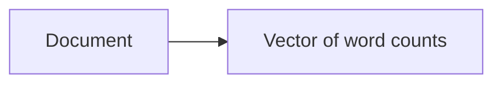
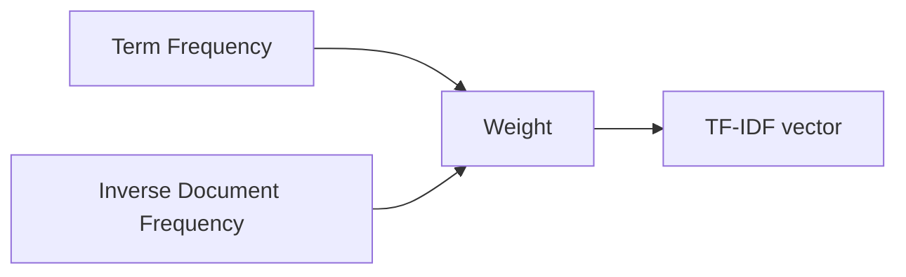

## In plain words

Once text is tokenized, a model still can't use it directly — a word like `"python"`
isn't a number. Bag of Words and TF-IDF are the two simplest ways to turn a pile of
tokens into a **vector**: BoW just counts words, while TF-IDF counts them *and*
downweights the boring, everywhere words so the interesting ones stand out.

## Bag of Words (BoW)

BoW represents a document by:

- counting how many times each word appears

Key idea:

- word order is ignored



Pros:

- simple and fast
- strong baseline

Cons:

- ignores word order and context
- common words dominate

## TF-IDF

TF-IDF reduces the impact of very common words by weighting them lower.

Intuition:

- words common in **this doc** but rare across **all docs** are informative



## Scikit-learn examples

```python title="BoW with CountVectorizer" showLineNumbers{1}
from sklearn.feature_extraction.text import CountVectorizer

vec = CountVectorizer()
X = vec.fit_transform(["i love python", "python is great"])
```

```python title="TF-IDF with TfidfVectorizer" showLineNumbers{1}
from sklearn.feature_extraction.text import TfidfVectorizer

docs = ["i love python", "python is great", "i love great libraries"]
vec = TfidfVectorizer()
X = vec.fit_transform(docs)

print("Vocabulary:", vec.get_feature_names_out())
print("TF-IDF matrix:\n", X.toarray().round(2))
```

```
Vocabulary: ['great' 'is' 'libraries' 'love' 'python']
TF-IDF matrix:
 [[0.   0.   0.   0.71 0.71]
 [0.52 0.68 0.   0.   0.52]
 [0.52 0.   0.68 0.52 0.  ]]
```

Notice `"great"` gets a lower weight than `"libraries"` in the third document —
`"great"` shows up in two of the three documents (less discriminative), while
`"libraries"` only appears once (more discriminative).

:::tip[From the book]
The book builds its own mini vocabulary the same way, just without a library. For
the IMDb sentiment dataset, it tokenizes every review and feeds the words into a
`collections.Counter`:

```python
from collections import Counter
vocabulary = Counter()
for review in reviews:
    vocabulary.update(review)
```

Then it keeps only the **10,000 most common words** as the model's vocabulary — the
same "term frequency" idea `CountVectorizer` and `TfidfVectorizer` automate for you,
plus the IDF weighting on top.
:::

## Visualize it

TF-IDF gives every term in a document its own weight. Click a document to see how
its term weights compare — common words across the corpus (like "python" here) get
pushed down, while rarer, document-specific words get pushed up.

```p5 title="TF-IDF term weights" desc="Bars grow in as the demo auto-cycles through documents; term weights are re-weighted live. Click to jump ahead." height="280"
let docs = [
  { label: "doc 1", terms: ["love", "python"], weights: [0.71, 0.71] },
  { label: "doc 2", terms: ["great", "is", "python"], weights: [0.52, 0.68, 0.52] },
  { label: "doc 3", terms: ["great", "libraries", "love"], weights: [0.52, 0.68, 0.52] },
];
let active = 0;
let lastSwitch = 0;
const CYCLE = 200; // frames spent on each document before auto-advancing

function setup() {
  createCanvas(600, 280);
  textFont("monospace");
  textAlign(CENTER, CENTER);
}

function easeOutCubic(t) {
  return 1 - Math.pow(1 - t, 3);
}

function draw() {
  background(13, 17, 23);

  // auto-cycle through documents over time; clicking jumps ahead manually
  const cycleIndex = floor(frameCount / CYCLE) % docs.length;
  if (cycleIndex !== active) {
    active = cycleIndex;
    lastSwitch = frameCount;
  }

  const doc = docs[active];
  const n = doc.terms.length;
  const barW = (width - 100) / n;
  const growth = easeOutCubic(constrain((frameCount - lastSwitch) / 30, 0, 1));
  const pulse = 0.5 + 0.5 * sin(frameCount * 0.05);

  fill(107, 169 + pulse * 20, 221);
  textSize(14);
  text("TF-IDF weights — " + doc.label + " (click to jump ahead)", width / 2, 24);

  for (let i = 0; i < n; i++) {
    const x = 60 + i * barW;
    const h = doc.weights[i] * 170 * growth;
    const y = height - 40 - h;
    fill(75, 139, 190);
    noStroke();
    rect(x + barW * 0.15, y, barW * 0.7, h, 4);
    fill(255, 211, 67);
    textSize(12);
    text(doc.terms[i], x + barW / 2, height - 22);
    fill(230, 230, 230);
    text((doc.weights[i] * growth).toFixed(2), x + barW / 2, y - 12);
  }
}

function mousePressed() {
  active = (active + 1) % docs.length;
  lastSwitch = frameCount;
}
```

## The same idea with Keras's TextVectorization layer

`CountVectorizer` and `TfidfVectorizer` are scikit-learn's tools for this, but
Keras's `TextVectorization` layer can produce the exact same kind of vectors
directly inside a model, just by changing its `output_mode`:

```python title="BoW and TF-IDF via TextVectorization" showLineNumbers{1}
from tensorflow.keras.layers import TextVectorization

docs = ["i love python", "python is great", "i love great libraries"]

# multi_hot: a 0/1 flag per word -- did this word appear at all?
binary_vectorizer = TextVectorization(max_tokens=20, output_mode="multi_hot")
binary_vectorizer.adapt(docs)

# tf_idf: built-in term-frequency / inverse-document-frequency weighting
tfidf_vectorizer = TextVectorization(max_tokens=20, output_mode="tf_idf")
tfidf_vectorizer.adapt(docs)

print("Vocabulary:", binary_vectorizer.get_vocabulary())
```

Pass `ngrams=2` to either vectorizer and it will index bigrams instead of
single words — the exact same "reinject a bit of local word order" trick that
`CountVectorizer(ngram_range=(1, 2))` performs above.

## Bag-of-words or sequence model? A rule of thumb

Bag-of-words throws away word order entirely, which raises an obvious
question: when is that actually fine, and when do you need a model that reads
words in order (an RNN or a Transformer)? Chollet's team ran a systematic
study across many text-classification datasets and found a surprisingly
reliable heuristic — look at the **ratio between your number of training
samples and the average number of words per sample**:

| Samples ÷ mean words per sample | Best approach |
| -------------------------------- | ------------- |
| less than ~1,500                 | bag-of-bigrams (fast, and usually wins!) |
| more than ~1,500                 | a sequence model (RNN or Transformer) |

The intuition: a bag-of-words feature space is simple, so a small dataset is
enough to fit it well. A sequence model has to learn a much richer space —
which order and *how much* text matters in — so it only pays off once you have
plenty of data to fill that space with.

:::tip[From the book]
Chollet's rule of thumb is "just a rule of thumb, rather than a scientific
law" — it was measured specifically for text *classification*. For sequence-
to-sequence tasks like machine translation, the book notes that Transformers
pull ahead of bag-of-words approaches even on shorter, smaller datasets,
because there word order isn't optional — it's the entire point.
:::

## Mini-checkpoint

Why is TF-IDF often better than raw counts?

- it downweights words that aren’t discriminative across the corpus.

import DataCampExercise from "../../../../components/DataCampExercise.astro";

## 🧪 Try It Yourself

### Exercise 1 – Build a Bag of Words

<DataCampExercise
  lang="python"
  hint={`Call \`.fit_transform(docs)\` on a \`CountVectorizer\` instance.`}
  code={`# Task: Exercise 1 – Build a Bag of Words
from sklearn.feature_extraction.text import CountVectorizer

docs = ["cats chase mice", "dogs chase cats"]
vec = CountVectorizer()
X = vec.___(docs)   # replace ___ with fit_transform

print("Vocabulary:", sorted(vec.vocabulary_.keys()))
print("Shape:", X.shape)

# ── Expected Output ───────────────────────────────────────────
# Vocabulary: ['cats', 'chase', 'dogs', 'mice']
# Shape: (2, 4)
# ──────────────────────────────────────────────────────────────`}
  solution={`from sklearn.feature_extraction.text import CountVectorizer

docs = ["cats chase mice", "dogs chase cats"]
vec = CountVectorizer()
X = vec.fit_transform(docs)
print("Vocabulary:", sorted(vec.vocabulary_.keys()))
print("Shape:", X.shape)`}
  sct={`test_output_contains("Vocabulary:")
test_output_contains("Shape: (2, 4)")
success_msg("Bag of Words vector built!")`}
  height={150}
/>

### Exercise 2 – Weight Terms with TF-IDF

<DataCampExercise
  lang="python"
  hint={`\`TfidfVectorizer\` has the exact same \`.fit_transform()\` interface as \`CountVectorizer\`.`}
  code={`# Task: Exercise 2 – Weight Terms with TF-IDF
from sklearn.feature_extraction.text import TfidfVectorizer

docs = ["python is great", "java is great", "python is fun"]
vec = TfidfVectorizer()
X = vec.fit_transform(docs)

# "is" and "great" appear in more docs, so they should get LOWER weight than "fun"
row = X.toarray()[2]
fun_weight = row[vec.vocabulary_["___"]]   # replace ___ with fun
print(f"'fun' weight: {fun_weight:.2f}")

# ── Expected Output ───────────────────────────────────────────
# 'fun' weight: 0.72
# ──────────────────────────────────────────────────────────────`}
  solution={`from sklearn.feature_extraction.text import TfidfVectorizer

docs = ["python is great", "java is great", "python is fun"]
vec = TfidfVectorizer()
X = vec.fit_transform(docs)
row = X.toarray()[2]
fun_weight = row[vec.vocabulary_["fun"]]
print(f"'fun' weight: {fun_weight:.2f}")`}
  sct={`test_output_contains("'fun' weight:")
success_msg("You computed a TF-IDF weight by hand!")`}
  height={160}
/>

### Exercise 3 – Count Words Like the Book Does

<DataCampExercise
  lang="python"
  hint={`\`Counter\` has a \`.most_common(n)\` method that returns the n most frequent items.`}
  code={`# Task: Exercise 3 – Count Words Like the Book Does
from collections import Counter

review = "the movie was great the acting was great too".split()
vocabulary = Counter(review)

top_2 = vocabulary.___(2)   # replace ___ with most_common
print("Top 2 words:", top_2)

# ── Expected Output ───────────────────────────────────────────
# Top 2 words: [('the', 2), ('was', 2)]
# ──────────────────────────────────────────────────────────────`}
  solution={`from collections import Counter

review = "the movie was great the acting was great too".split()
vocabulary = Counter(review)
top_2 = vocabulary.most_common(2)
print("Top 2 words:", top_2)`}
  sct={`test_output_contains("Top 2 words:")
success_msg("Vocabulary counted, just like Chapter 16's IMDb pipeline!")`}
  height={150}
/>

## Next

Continue to **Word Embeddings (Word2Vec, GloVe)** — instead of sparse counts, give
every word a small, dense vector that captures meaning.
