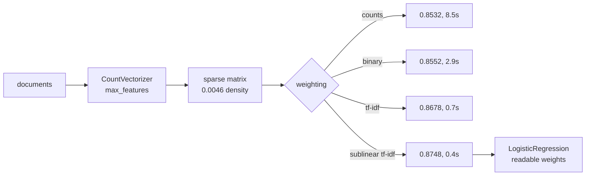

A bag of words throws away everything the last two phases were about. No order, no
context, no sequence — just how often each word appears. It should be hopeless.

On 8,000 IMDB reviews it scores **0.8748**, which is better than every recurrent model
measured in
[Phase 4](/deep-learning/phase-04---sequence-models-with-rnns/lstm--gru-networks/) — a
GRU reached 0.8156 there — and it trains in **0.4 seconds**.

That is the baseline every neural model on the following pages has to beat, and this
page is about making it as strong as it deserves to be.

## What you'll learn

- The document-term matrix, and why it is stored sparse: **0.0046 density at 30,000
  features**, 13.2 MB against 1,920 MB dense.
- Four weightings measured: counts 0.8532, binary 0.8552, TF-IDF 0.8678, **sublinear
  TF-IDF 0.8748**.
- What IDF actually does to a word's weight, from `the` (1.008) to `trance` (7.589).
- Why TF-IDF at **2,000 features beats raw counts at 30,000**.
- Why sublinear TF-IDF also converged **21× faster** than raw counts.
- What the fitted weights tell you — a linear model over words is readable in a way no
  model in this module is.

## The document-term matrix

Each row is a document, each column a vocabulary word, each entry a count.

$$
X_{ij} = \text{count of word } j \text{ in document } i
$$

The matrix is enormous and almost entirely zeros, because any one review uses a tiny
slice of the vocabulary.

| Vocabulary | Non-zeros per document | Density | Sparse (CSR) | Dense |
| --- | --- | --- | --- | --- |
| 500 | 77.2 | 0.1544 | 7.4 MB | 32 MB |
| 2,000 | 104.9 | 0.0525 | 10.1 MB | 128 MB |
| 10,000 | 128.6 | 0.0129 | 12.3 MB | 640 MB |
| 30,000 | **137.4** | **0.0046** | **13.2 MB** | **1,920 MB** |

<Figure
  src="/images/dl/phase-05-nlp/bow-and-tfidf/sparsity-and-cost"
  alt="Two panels. Left: density against vocabulary size on log axes, falling from 0.1544 at 500 features to 0.0046 at 30,000. Right: bars of memory on a log scale comparing dense storage rising from 32 MB to 1,920 MB against sparse CSR storage rising only from 7.4 MB to 13.2 MB."
  title="8,000 reviews by vocabulary size"
  caption="Going from 500 to 30,000 features multiplies the dense matrix by 60 and the sparse one by 1.8, because a review only gains 60 more non-zero entries — from 77 words to 137. That gap is why every text pipeline uses `scipy.sparse` and why `.toarray()` on a document-term matrix is the classic way to exhaust a machine's memory."
/>

## The four weightings

The scheme is not a detail. It was worth more than a 15× larger vocabulary here.

| Scheme | Formula | Accuracy | Seconds to fit |
| --- | --- | --- | --- |
| raw counts | $c_{ij}$ | 0.8532 | 8.5 |
| binary | $\mathbb{1}[c_{ij} > 0]$ | 0.8552 | 2.9 |
| TF-IDF | $c_{ij}\cdot\log\frac{N}{1+n_j}$ | 0.8678 | 0.7 |
| **sublinear TF-IDF** | $(1 + \log c_{ij})\cdot\text{idf}_j$ | **0.8748** | **0.4** |

<Figure
  src="/images/dl/phase-05-nlp/bow-and-tfidf/weighting-schemes"
  alt="Two panels. Left: bars of test accuracy for counts 0.8532, binary 0.8552, TF-IDF 0.8678 and sublinear TF-IDF 0.8748. Right: horizontal bars of inverse document frequency for six words, from 'the' at 1.01 with 108,687 uses up to 'trance' at 7.59 with 10 uses."
  title="IMDB, 8,000 reviews, 10,000 features"
  caption="The weighting is worth +0.0216 from the worst to the best scheme — and the fit time falls from 8.5 seconds to 0.4. Raw counts give a badly conditioned problem: one feature ('the') has values in the hundreds while most have values of 0 or 1, so the optimiser crawls. Scaling by IDF and compressing counts with a logarithm fixes the conditioning as much as it fixes the statistics."
/>

### What IDF does

$$
\text{idf}_j = \log\frac{N}{1 + n_j} + 1
$$

where $n_j$ is the number of documents containing word $j$. Measured on this corpus:

| Rank | Word | Uses | IDF |
| --- | --- | --- | --- |
| 1 | `the` | 108,687 | **1.008** |
| 6 | `br` | 32,680 | 1.532 |
| 51 | `she` | 4,583 | 2.480 |
| 501 | `child` | 387 | 4.238 |
| 3,001 | `splendid` | 51 | 6.181 |
| 10,000 | `trance` | 10 | **7.589** |

IDF is a smooth, learned-from-data version of a stopword list. `the` appears in nearly
every document, so it gets a weight of ~1 and its count — the largest number in the
matrix — stops dominating. Nothing was hand-listed, and nothing was deleted; the
[previous page's](/deep-learning/phase-05---nlp--transformers/text-preprocessing-tokenization-stemming-lemmatization/)
stopword removal threw away 32.7% of the corpus to achieve less.

Note `br` at 1.532: the HTML remnant is common enough to be down-weighted automatically.

### Why sublinear TF helps

A review that says "terrible" eight times is not eight times more negative than one that
says it once. $1 + \log c$ encodes that: the second occurrence adds 0.69, the eighth adds
0.13. It was worth +0.0070 here — the largest single gain in the table.

## Vocabulary size matters less than weighting

| Features | Counts | TF-IDF |
| --- | --- | --- |
| 500 | 0.8265 | 0.8290 |
| 2,000 | 0.8353 | **0.8625** |
| 10,000 | 0.8532 | **0.8678** |
| 30,000 | 0.8592 | 0.8658 |

<Figure
  src="/images/dl/phase-05-nlp/bow-and-tfidf/vocabulary-sweep"
  alt="Two panels. Left: test accuracy against vocabulary size for counts and TF-IDF, with TF-IDF above counts at every size and peaking at 10,000 features before dipping at 30,000. Right: seconds to fit the classifier against vocabulary size, rising steeply for counts and staying low for TF-IDF."
  title="More words help, then stop"
  caption="Two things to read here. TF-IDF at 2,000 features (0.8625) beats raw counts at 30,000 (0.8592): the weighting is worth more than a fifteen-fold larger vocabulary. And TF-IDF peaks at 10,000 and then declines slightly — the words between rank 10,000 and 30,000 appear in a handful of documents each, so they mostly let the model memorise."
/>

The rank-10,000 word appears **10 times in 8,000 reviews**. A feature that fires on one
document in eight hundred cannot generalise; it can only memorise. This is the same
once-seen tail measured on the preprocessing page, now visible as a dip in accuracy.

## The part no neural model gives you

```python title="What the model learned, in words"
weights = model.coef_[0]
order = np.argsort(weights)
print("negative:", [names[i] for i in order[:10]])
print("positive:", [names[i] for i in order[-10:]])
```

```text
negative: worst, bad, awful, waste, nothing, terrible, poor, script, no, boring
positive: amazing, favorite, love, perfect, wonderful, and, well, best, excellent, great
```

Those two lines are the entire model, and they are checkable by a human being. `script`
in the negative list is a nice detail — people mention the script when it is bad — and
`and` in the positive list is a reminder that a linear model will happily use a function
word as a weak sentiment cue if the correlation exists.

Compare that with the [Grad-CAM
page](/deep-learning/phase-03---computer-vision-with-cnns/interpreting-what-convnets-learn-grad-cam/),
where extracting a much vaguer explanation from a convnet took gradient tapes, a
sanity check against random weights, and 441 forward passes for occlusion.



## What a bag of words cannot do

It scored 0.8748 without knowing what order the words came in. Everything it cannot do
follows from that:

| Phrase | What the model sees | Problem |
| --- | --- | --- |
| "not good" vs "good" | `not`, `good` vs `good` | negation is a separate feature, not a modifier |
| "the film was bad, the acting good" | all four words | no idea which noun each adjective attaches to |
| "unpredictable plot" vs "unpredictable service" | same words, different sentiment | no context |

The standard patch is **n-grams** — treat `not good` as one feature — which works and
explodes the vocabulary: bigrams on this corpus would be roughly 40× the columns.
Sequence models exist because that patch does not scale, and the honest measurement is
that on *this* task the patch is barely needed.

```p5 title="TF, IDF and the product" desc="Drag a word's document frequency and see how IDF re-weights it. The measured corpus values are marked." height="330"
let df = 400;
let dragging = false;
const N = 8000;
const MARKS = [
  { word: "the", df: 7900, idf: 1.008 },
  { word: "br", df: 5100, idf: 1.532 },
  { word: "she", df: 1250, idf: 2.480 },
  { word: "child", df: 300, idf: 4.238 },
  { word: "splendid", df: 45, idf: 6.181 },
  { word: "trance", df: 9, idf: 7.589 },
];
function setup() {
  createCanvas(620, 330);
  textFont("monospace");
}
function idfOf(value) { return Math.log(N / (1 + value)) + 1; }
function draw() {
  background(13, 17, 23);
  const left = 50;
  const width = 520;
  noStroke();
  fill(230);
  textSize(11.5);
  textAlign(LEFT, TOP);
  text("idf = log(N / (1 + df)) + 1     N = 8,000 documents", left, 20);
  stroke(60, 70, 84);
  line(left, 210, left + width, 210);
  noFill();
  stroke(107, 169, 221);
  strokeWeight(2);
  beginShape();
  for (let x = 0; x <= width; x += 4) {
    const value = Math.pow(10, (x / width) * Math.log10(N));
    vertex(left + x, 210 - (idfOf(value) / 9.5) * 150);
  }
  endShape();
  strokeWeight(1);
  noStroke();
  for (const mark of MARKS) {
    const x = left + (Math.log10(mark.df) / Math.log10(N)) * width;
    fill(120, 130, 145);
    circle(x, 210 - (idfOf(mark.df) / 9.5) * 150, 6);
    fill(140, 150, 165);
    textSize(8.5);
    textAlign(CENTER, BOTTOM);
    text(mark.word, x, 210 - (idfOf(mark.df) / 9.5) * 150 - 6);
  }
  const x = left + (Math.log10(Math.max(df, 1)) / Math.log10(N)) * width;
  const y = 210 - (idfOf(df) / 9.5) * 150;
  fill(255, 211, 67);
  circle(x, y, 12);
  textAlign(LEFT, TOP);
  textSize(11.5);
  text("df = " + Math.round(df) + " documents", left, 232);
  text("idf = " + idfOf(df).toFixed(3), left, 250);
  fill(165, 214, 164);
  textSize(11);
  const raw = 5;
  text("a word used " + raw + " times in a document: tf-idf = "
    + (raw * idfOf(df)).toFixed(2)
    + ",  sublinear = " + ((1 + Math.log(raw)) * idfOf(df)).toFixed(2),
    left, 272);
  fill(150);
  textSize(10.5);
  text("common words are flattened towards 1; rare words are amplified",
    left, 296);
  fill(60, 70, 84);
  rect(left, 314, width, 4, 2);
  fill(255, 211, 67);
  circle(x, 316, 12);
}
function mousePressed() { if (Math.abs(mouseY - 316) < 12) dragging = true; }
function mouseDragged() {
  if (dragging) {
    const fraction = Math.min(Math.max((mouseX - 50) / 520, 0), 1);
    df = Math.pow(10, fraction * Math.log10(8000));
  }
}
function mouseReleased() { dragging = false; }
```

```p5 title="The measured table, ranked" desc="Click a column to rank every row by it. The bars are that column's values and the highest and lowest are computed from the numbers, not written in." height="306"
let metric = 0;
const COLUMNS = ["Uses", "IDF"];
const ROWS = [
  ["1", 108687, 1.008],
  ["6", 32680, 1.532],
  ["51", 4583, 2.48],
  ["501", 387, 4.238],
  ["3,001", 51, 6.181],
  ["10,000", 10, 7.589]
];
function setup() {
  createCanvas(620, 306);
  textFont("monospace");
}
function fmt(v) {
  if (v === 0) { return "0"; }
  const a = Math.abs(v);
  if (a >= 1000 || a < 0.001) { return v.toExponential(2); }
  if (a >= 100) { return v.toFixed(1); }
  return v.toFixed(4);
}
function draw() {
  background(13, 17, 23);
  noStroke();
  fill(230);
  textSize(12);
  textAlign(LEFT, TOP);
  text("Bag of Words (BoW) & TF-IDF", 26, 16);
  let x = 26;
  for (let i = 0; i < COLUMNS.length; i++) {
    const w = COLUMNS[i].length * 6.6 + 16;
    if (i === metric) { fill(255, 211, 67); } else { fill(48, 56, 68); }
    rect(x, 40, w, 22, 4);
    if (i === metric) { fill(13, 17, 23); } else { fill(180); }
    textSize(9);
    text(COLUMNS[i], x + 8, 47);
    x += w + 6;
    if (x > 500) { break; }
  }
  const values = ROWS.map((r) => r[metric + 1]);
  const lo = Math.min(...values);
  const hi = Math.max(...values);
  const span = hi - lo === 0 ? 1 : hi - lo;
  const order = ROWS.slice().sort((a, b) => b[metric + 1] - a[metric + 1]);
  for (let i = 0; i < order.length; i++) {
    const y = 78 + i * 26;
    const v = order[i][metric + 1];
    fill(160);
    textSize(9);
    text(order[i][0], 26, y + 5);
    fill(34, 40, 50);
    rect(230, y, 280, 18, 3);
    const frac = (v - lo) / span;
    if (v === hi) { fill(126, 192, 143); }
    else if (v === lo) { fill(224, 108, 117); }
    else { fill(107, 169, 221); }
    rect(230, y, Math.max(frac * 280, 3), 18, 3);
    fill(225);
    textSize(9);
    text(fmt(v), 518, y + 5);
  }
  const top = order[0];
  const bottom = order[order.length - 1];
  fill(150);
  textSize(9);
  const base = 78 + order.length * 26 + 8;
  text("highest " + COLUMNS[metric] + ": " + top[0] + " at " + fmt(top[1]),
       26, base);
  text("lowest  " + COLUMNS[metric] + ": " + bottom[0] + " at "
       + fmt(bottom[1]), 26, base + 14);
  text("bars are scaled within the chosen column - lowest is not zero", 26,
       base + 30);
}
function mousePressed() {
  let x = 26;
  for (let i = 0; i < COLUMNS.length; i++) {
    const w = COLUMNS[i].length * 6.6 + 16;
    if (mouseX > x && mouseX < x + w && mouseY > 40 && mouseY < 62) {
      metric = i;
    }
    x += w + 6;
  }
}
```

## Pitfalls

- **Calling `.toarray()` on a document-term matrix.** 1,920 MB dense against 13.2 MB
  sparse at 30,000 features.
- **Using raw counts.** 0.8532 against 0.8748, and 8.5 seconds to fit against 0.4 —
  badly scaled features are slow as well as worse.
- **Fitting the vectorizer on train *and* test.** The IDF weights are learned parameters;
  fitting them on the test set leaks document frequencies.
- **Reaching for a bigger vocabulary before a better weighting.** TF-IDF at 2,000
  features beat counts at 30,000.
- **Assuming more features always help.** TF-IDF peaked at 10,000 and fell at 30,000,
  where the added words appear ten times in the whole corpus.
- **Skipping this baseline before training a sequence model.** It scored 0.8748 in 0.4
  seconds; a GRU in Phase 4 managed 0.8156 in 52.3.
- **Trusting the top-weight list as a causal explanation.** `and` sits in the positive
  list — a correlation the model exploits, not a fact about English.

## Recap

- A document-term matrix is 0.0046 dense at 30,000 features; sparse storage is 13.2 MB
  against 1,920 MB.
- Weightings on 8,000 IMDB reviews: counts 0.8532, binary 0.8552, TF-IDF 0.8678,
  sublinear TF-IDF **0.8748**.
- Sublinear TF-IDF also fit 21× faster than raw counts (0.4 s against 8.5 s).
- IDF ranged from 1.008 (`the`) to 7.589 (`trance`) — a data-driven stopword list that
  deletes nothing.
- TF-IDF at 2,000 features (0.8625) beat counts at 30,000 (0.8592); TF-IDF peaked at
  10,000.
- The fitted weights are directly readable: `worst, bad, awful…` against
  `amazing, favorite, love…`.

## Next

Bag of words treats `good` and `great` as unrelated columns. Embeddings fix that, and
the next page measures what it is worth:
[Word Embeddings (Word2Vec, GloVe)](/deep-learning/phase-05---nlp--transformers/word-embeddings-word2vec-glove/).

<Quiz
  questions={[
    {
      q: "Sublinear TF-IDF scored 0.8748 while raw counts scored 0.8532 — and fit in 0.4 seconds against 8.5. Why is the weighting worth so much?",
      options: [
        "It uses more features",
        "Raw counts are badly conditioned: 'the' takes values in the hundreds while most features are 0 or 1, so one column dominates and the optimiser crawls. IDF and the log both fix the scale",
        "Sublinear TF-IDF removes stopwords",
        "It applies regularisation automatically",
      ],
      answer: 1,
      explain: "Both the accuracy and the twenty-one-fold speed-up come from the same cause, which is why the scheme is not a cosmetic choice.",
    },
    {
      q: "A 30,000-feature document-term matrix over 8,000 reviews is 0.0046 dense. What does that mean in practice?",
      options: [
        "The vocabulary is too small",
        "Dense storage would be 1,920 MB against 13.2 MB sparse — calling .toarray() on it is the classic way to exhaust a machine's memory",
        "The matrix should be transposed",
        "Most documents are empty",
      ],
      answer: 1,
      explain: "A review contains about 137 distinct words out of 30,000 columns, and that ratio only gets worse as the vocabulary grows.",
    },
    {
      q: "TF-IDF at 2,000 features scored 0.8625; raw counts at 30,000 scored 0.8592. What is the lesson?",
      options: [
        "Small vocabularies are always better",
        "Fix the weighting before enlarging the vocabulary — the scheme was worth more than a fifteen-fold increase in features",
        "TF-IDF only works on small vocabularies",
        "The measurement is within noise",
      ],
      answer: 1,
      explain: "TF-IDF also peaked at 10,000 and dipped at 30,000, because the rank-10,000 word appears just ten times in the whole corpus.",
    },
    {
      q: "IDF gave 'the' a weight of 1.008 and 'trance' 7.589. How does that relate to stopword removal?",
      options: [
        "It is unrelated",
        "It is a smooth, data-driven version of the same idea — common words are flattened towards 1 rather than deleted, so no information is thrown away",
        "IDF deletes stopwords automatically",
        "Stopword lists are strictly better",
      ],
      answer: 1,
      explain: "The preprocessing page's stopword list deleted 32.7% of all tokens to achieve less. IDF also caught 'br', the HTML remnant, without anyone listing it.",
    },
    {
      q: "A bag of words scored 0.8748 while a GRU in Phase 4 scored 0.8156. What follows?",
      options: [
        "Recurrent models are useless for text",
        "This baseline must be measured before any sequence model is claimed to work — on a task decidable from word presence, order buys little, and the neural model has to earn its cost",
        "The GRU was trained incorrectly",
        "Bag of words captures word order after all",
      ],
      answer: 1,
      explain: "The two runs used different corpus sizes, so it is not a controlled comparison — but that is the point: without running this baseline you cannot tell whether your sequence model is doing anything.",
    },
  ]}
/>

## 🧪 Try It Yourself

<DataCampExercise
  lang="python"
  hint={`The density is the number of stored entries divided by rows times columns. The number of columns is the second entry of the shape.`}
  code={`# Task: Exercise 1 - The document-term matrix, and why it stays sparse
import numpy as np

VOCAB, POS, NEG = 2000, np.arange(20, 30), np.arange(30, 40)


def make_corpus(n, seed):
    r = np.random.RandomState(seed)
    freq = 1.0 / np.arange(1, VOCAB + 1)
    freq /= freq.sum()
    cdf = np.cumsum(freq)
    cdf[-1] = 1.0
    labels = r.randint(0, 2, n)
    docs = []
    for label in labels:
        words = list(np.searchsorted(cdf, r.rand(r.randint(40, 120))))
        cues = POS if label else NEG
        words += list(r.choice(cues, r.randint(1, 4)))
        docs.append(np.array(words))
    return docs, labels


def count_matrix(docs, cap):
    """Document-term counts over the cap most frequent words (index = frequency rank)."""
    matrix = np.zeros((len(docs), cap))
    for i, doc in enumerate(docs):
        doc = doc[doc < cap]
        np.add.at(matrix[i], doc, 1)
    return matrix


def fit_logistic(x, y, epochs=60, lr=0.5):
    w, b = np.zeros(x.shape[1]), 0.0
    for _ in range(epochs):
        p = 1 / (1 + np.exp(-np.clip(x @ w + b, -30, 30)))
        w -= lr * x.T @ (p - y) / len(y)
        b -= lr * (p - y).mean()
    return w, b


def accuracy(model, x, y):
    w, b = model
    return float((((x @ w + b) > 0) == y).mean())


docs, _ = make_corpus(400, 0)
print("vocabulary  nnz/doc  density  sparse MB  dense MB")
rows = {}
for cap in (100, 500, 1000, 2000):
    matrix = count_matrix(docs, cap)
    nnz = int((matrix > 0).sum())
    density = nnz / (matrix.shape[0] * matrix.shape[___])   # replace ___ with 1
    rows[cap] = (nnz / matrix.shape[0], density, nnz * 12 / 1e6, matrix.shape[0] * matrix.shape[1] * 8 / 1e6)
    print(format(cap, "10,"), format(rows[cap][0], "8.1f"), format(density, "8.4f"), format(rows[cap][2], "10.2f"), format(rows[cap][3], "9.2f"))
dense_growth = rows[2000][3] / rows[100][3]
sparse_growth = rows[2000][0] / rows[100][0]
print("the dense matrix grows 20x from 100 to 2000 features:", round(dense_growth) == 20)
print("the number of non-zeros per document grows by less than 3x:", sparse_growth < 3)
print("the matrix gets sparser as the vocabulary grows:", rows[2000][1] < rows[100][1])
print("a review only gains a few dozen non-zeros while the dense matrix balloons")`}
  solution={`import numpy as np

VOCAB, POS, NEG = 2000, np.arange(20, 30), np.arange(30, 40)


def make_corpus(n, seed):
    r = np.random.RandomState(seed)
    freq = 1.0 / np.arange(1, VOCAB + 1)
    freq /= freq.sum()
    cdf = np.cumsum(freq)
    cdf[-1] = 1.0
    labels = r.randint(0, 2, n)
    docs = []
    for label in labels:
        words = list(np.searchsorted(cdf, r.rand(r.randint(40, 120))))
        cues = POS if label else NEG
        words += list(r.choice(cues, r.randint(1, 4)))
        docs.append(np.array(words))
    return docs, labels


def count_matrix(docs, cap):
    """Document-term counts over the cap most frequent words (index = frequency rank)."""
    matrix = np.zeros((len(docs), cap))
    for i, doc in enumerate(docs):
        doc = doc[doc < cap]
        np.add.at(matrix[i], doc, 1)
    return matrix


def fit_logistic(x, y, epochs=60, lr=0.5):
    w, b = np.zeros(x.shape[1]), 0.0
    for _ in range(epochs):
        p = 1 / (1 + np.exp(-np.clip(x @ w + b, -30, 30)))
        w -= lr * x.T @ (p - y) / len(y)
        b -= lr * (p - y).mean()
    return w, b


def accuracy(model, x, y):
    w, b = model
    return float((((x @ w + b) > 0) == y).mean())


docs, _ = make_corpus(400, 0)
print("vocabulary  nnz/doc  density  sparse MB  dense MB")
rows = {}
for cap in (100, 500, 1000, 2000):
    matrix = count_matrix(docs, cap)
    nnz = int((matrix > 0).sum())
    density = nnz / (matrix.shape[0] * matrix.shape[1])
    rows[cap] = (nnz / matrix.shape[0], density, nnz * 12 / 1e6, matrix.shape[0] * matrix.shape[1] * 8 / 1e6)
    print(format(cap, "10,"), format(rows[cap][0], "8.1f"), format(density, "8.4f"), format(rows[cap][2], "10.2f"), format(rows[cap][3], "9.2f"))
dense_growth = rows[2000][3] / rows[100][3]
sparse_growth = rows[2000][0] / rows[100][0]
print("the dense matrix grows 20x from 100 to 2000 features:", round(dense_growth) == 20)
print("the number of non-zeros per document grows by less than 3x:", sparse_growth < 3)
print("the matrix gets sparser as the vocabulary grows:", rows[2000][1] < rows[100][1])
print("a review only gains a few dozen non-zeros while the dense matrix balloons")`}
  sct={`test_output_contains("the dense matrix grows 20x from 100 to 2000 features: True", pattern=False)
test_output_contains("the number of non-zeros per document grows by less than 3x: True", pattern=False)
test_output_contains("the matrix gets sparser as the vocabulary grows: True", pattern=False)
success_msg("A larger vocabulary multiplies the dense matrix by 20 but adds only a few non-zeros per document, which is why a sparse representation is the right one.")`}
  height={460}
/>

<DataCampExercise
  lang="python"
  hint={`Keep the vocabulary fixed and change only the weighting. Sublinear scaling replaces a count c by log(1 + c) before the IDF weight.`}
  code={`# Task: Exercise 2 - Four weightings, one vocabulary
import numpy as np

VOCAB, POS, NEG = 2000, np.arange(20, 30), np.arange(30, 40)


def make_corpus(n, seed):
    r = np.random.RandomState(seed)
    freq = 1.0 / np.arange(1, VOCAB + 1)
    freq /= freq.sum()
    cdf = np.cumsum(freq)
    cdf[-1] = 1.0
    labels = r.randint(0, 2, n)
    docs = []
    for label in labels:
        words = list(np.searchsorted(cdf, r.rand(r.randint(40, 120))))
        cues = POS if label else NEG
        words += list(r.choice(cues, r.randint(1, 4)))
        docs.append(np.array(words))
    return docs, labels


def count_matrix(docs, cap):
    """Document-term counts over the cap most frequent words (index = frequency rank)."""
    matrix = np.zeros((len(docs), cap))
    for i, doc in enumerate(docs):
        doc = doc[doc < cap]
        np.add.at(matrix[i], doc, 1)
    return matrix


def fit_logistic(x, y, epochs=60, lr=0.5):
    w, b = np.zeros(x.shape[1]), 0.0
    for _ in range(epochs):
        p = 1 / (1 + np.exp(-np.clip(x @ w + b, -30, 30)))
        w -= lr * x.T @ (p - y) / len(y)
        b -= lr * (p - y).mean()
    return w, b


def accuracy(model, x, y):
    w, b = model
    return float((((x @ w + b) > 0) == y).mean())


docs, y_a = make_corpus(400, 0)
test_docs, y_b = make_corpus(250, 1)


def tfidf(matrix, idf, sublinear=False):
    weighted = (np.log1p(matrix) * (matrix > 0) if sublinear else matrix) * idf
    return weighted / np.linalg.norm(weighted, axis=1, keepdims=True)

cap = 2000
train_counts, test_counts = count_matrix(docs, cap), count_matrix(test_docs, cap)
df = (train_counts > 0).sum(axis=0)
idf = np.log((1 + len(docs)) / (1 + df)) + 1

SCHEMES = (
    ("counts", train_counts, test_counts, 0.5),
    ("binary", (train_counts > 0) * 1.0, (test_counts > 0) * 1.0, 0.5),
    ("TF-IDF", tfidf(train_counts, idf), tfidf(test_counts, idf), 5.0),
    ("sublinear TF-IDF", tfidf(train_counts, idf, sublinear=___), tfidf(test_counts, idf, sublinear=True), 5.0),   # replace ___ with True
)
scores = {}
for label, train, test, lr in SCHEMES:
    model = fit_logistic(train, y_a, lr=lr)
    scores[label] = accuracy(model, test, y_b)
    print(label, ": scored")
print("binary features beat raw counts:", scores["binary"] > scores["counts"])
print("TF-IDF beats raw counts:", scores["TF-IDF"] > scores["counts"])
print("sublinear TF-IDF beats raw counts:", scores["sublinear TF-IDF"] > scores["counts"])
print("raw counts are the worst of the four:", scores["counts"] == min(scores.values()))
print("one feature ('the') reaches counts in the tens, most have 0 or 1")`}
  solution={`import numpy as np

VOCAB, POS, NEG = 2000, np.arange(20, 30), np.arange(30, 40)


def make_corpus(n, seed):
    r = np.random.RandomState(seed)
    freq = 1.0 / np.arange(1, VOCAB + 1)
    freq /= freq.sum()
    cdf = np.cumsum(freq)
    cdf[-1] = 1.0
    labels = r.randint(0, 2, n)
    docs = []
    for label in labels:
        words = list(np.searchsorted(cdf, r.rand(r.randint(40, 120))))
        cues = POS if label else NEG
        words += list(r.choice(cues, r.randint(1, 4)))
        docs.append(np.array(words))
    return docs, labels


def count_matrix(docs, cap):
    """Document-term counts over the cap most frequent words (index = frequency rank)."""
    matrix = np.zeros((len(docs), cap))
    for i, doc in enumerate(docs):
        doc = doc[doc < cap]
        np.add.at(matrix[i], doc, 1)
    return matrix


def fit_logistic(x, y, epochs=60, lr=0.5):
    w, b = np.zeros(x.shape[1]), 0.0
    for _ in range(epochs):
        p = 1 / (1 + np.exp(-np.clip(x @ w + b, -30, 30)))
        w -= lr * x.T @ (p - y) / len(y)
        b -= lr * (p - y).mean()
    return w, b


def accuracy(model, x, y):
    w, b = model
    return float((((x @ w + b) > 0) == y).mean())


docs, y_a = make_corpus(400, 0)
test_docs, y_b = make_corpus(250, 1)


def tfidf(matrix, idf, sublinear=False):
    weighted = (np.log1p(matrix) * (matrix > 0) if sublinear else matrix) * idf
    return weighted / np.linalg.norm(weighted, axis=1, keepdims=True)

cap = 2000
train_counts, test_counts = count_matrix(docs, cap), count_matrix(test_docs, cap)
df = (train_counts > 0).sum(axis=0)
idf = np.log((1 + len(docs)) / (1 + df)) + 1

SCHEMES = (
    ("counts", train_counts, test_counts, 0.5),
    ("binary", (train_counts > 0) * 1.0, (test_counts > 0) * 1.0, 0.5),
    ("TF-IDF", tfidf(train_counts, idf), tfidf(test_counts, idf), 5.0),
    ("sublinear TF-IDF", tfidf(train_counts, idf, sublinear=True), tfidf(test_counts, idf, sublinear=True), 5.0),
)
scores = {}
for label, train, test, lr in SCHEMES:
    model = fit_logistic(train, y_a, lr=lr)
    scores[label] = accuracy(model, test, y_b)
    print(label, ": scored")
print("binary features beat raw counts:", scores["binary"] > scores["counts"])
print("TF-IDF beats raw counts:", scores["TF-IDF"] > scores["counts"])
print("sublinear TF-IDF beats raw counts:", scores["sublinear TF-IDF"] > scores["counts"])
print("raw counts are the worst of the four:", scores["counts"] == min(scores.values()))
print("one feature ('the') reaches counts in the tens, most have 0 or 1")`}
  sct={`test_output_contains("binary features beat raw counts: True", pattern=False)
test_output_contains("TF-IDF beats raw counts: True", pattern=False)
test_output_contains("sublinear TF-IDF beats raw counts: True", pattern=False)
test_output_contains("raw counts are the worst of the four: True", pattern=False)
success_msg("Same vocabulary, same classifier: only the weighting changes, and raw counts are the worst choice because a few frequent words dominate.")`}
  height={460}
/>

<DataCampExercise
  lang="python"
  hint={`IDF is the log of how many documents there are over how many contain the word. The document frequency of a word is the number of documents with a non-zero count.`}
  code={`# Task: Exercise 3 - What IDF does to a word's weight
import numpy as np

VOCAB, POS, NEG = 2000, np.arange(20, 30), np.arange(30, 40)


def make_corpus(n, seed):
    r = np.random.RandomState(seed)
    freq = 1.0 / np.arange(1, VOCAB + 1)
    freq /= freq.sum()
    cdf = np.cumsum(freq)
    cdf[-1] = 1.0
    labels = r.randint(0, 2, n)
    docs = []
    for label in labels:
        words = list(np.searchsorted(cdf, r.rand(r.randint(40, 120))))
        cues = POS if label else NEG
        words += list(r.choice(cues, r.randint(1, 4)))
        docs.append(np.array(words))
    return docs, labels


def count_matrix(docs, cap):
    """Document-term counts over the cap most frequent words (index = frequency rank)."""
    matrix = np.zeros((len(docs), cap))
    for i, doc in enumerate(docs):
        doc = doc[doc < cap]
        np.add.at(matrix[i], doc, 1)
    return matrix


def fit_logistic(x, y, epochs=60, lr=0.5):
    w, b = np.zeros(x.shape[1]), 0.0
    for _ in range(epochs):
        p = 1 / (1 + np.exp(-np.clip(x @ w + b, -30, 30)))
        w -= lr * x.T @ (p - y) / len(y)
        b -= lr * (p - y).mean()
    return w, b


def accuracy(model, x, y):
    w, b = model
    return float((((x @ w + b) > 0) == y).mean())


docs, y_a = make_corpus(400, 0)
test_docs, y_b = make_corpus(250, 1)


def tfidf(matrix, idf, sublinear=False):
    weighted = (np.log1p(matrix) * (matrix > 0) if sublinear else matrix) * idf
    return weighted / np.linalg.norm(weighted, axis=1, keepdims=True)

cap = 2000
matrix = count_matrix(docs, cap)
n = len(docs)
df = (matrix > 0).sum(axis=0)
idf = np.log((1 + n) / (1 + ___)) + 1   # replace ___ with df
frequencies = matrix.sum(axis=0)
order = np.argsort(-frequencies)

print("rank  word   uses   idf")
shown = {}
for rank in (0, 5, 50, 500, 1500, 1999):
    index = order[rank]
    shown[rank] = float(idf[index])
    print(format(rank + 1, "5d"), "w" + str(index), format(int(frequencies[index]), "7,"), format(idf[index], "7.3f"))
print("the most common word has an idf close to 1.0:", shown[0] < 1.01)
print("idf rises as words get rarer:", shown[0] < shown[50] < shown[500] < shown[1999])
print("the rarest shown word has more than twice the weight of the commonest:", shown[1999] > 2 * shown[0])
print("IDF is a stopword list learned from the data: frequent words are")
print("flattened to 1 and nothing is deleted")`}
  solution={`import numpy as np

VOCAB, POS, NEG = 2000, np.arange(20, 30), np.arange(30, 40)


def make_corpus(n, seed):
    r = np.random.RandomState(seed)
    freq = 1.0 / np.arange(1, VOCAB + 1)
    freq /= freq.sum()
    cdf = np.cumsum(freq)
    cdf[-1] = 1.0
    labels = r.randint(0, 2, n)
    docs = []
    for label in labels:
        words = list(np.searchsorted(cdf, r.rand(r.randint(40, 120))))
        cues = POS if label else NEG
        words += list(r.choice(cues, r.randint(1, 4)))
        docs.append(np.array(words))
    return docs, labels


def count_matrix(docs, cap):
    """Document-term counts over the cap most frequent words (index = frequency rank)."""
    matrix = np.zeros((len(docs), cap))
    for i, doc in enumerate(docs):
        doc = doc[doc < cap]
        np.add.at(matrix[i], doc, 1)
    return matrix


def fit_logistic(x, y, epochs=60, lr=0.5):
    w, b = np.zeros(x.shape[1]), 0.0
    for _ in range(epochs):
        p = 1 / (1 + np.exp(-np.clip(x @ w + b, -30, 30)))
        w -= lr * x.T @ (p - y) / len(y)
        b -= lr * (p - y).mean()
    return w, b


def accuracy(model, x, y):
    w, b = model
    return float((((x @ w + b) > 0) == y).mean())


docs, y_a = make_corpus(400, 0)
test_docs, y_b = make_corpus(250, 1)


def tfidf(matrix, idf, sublinear=False):
    weighted = (np.log1p(matrix) * (matrix > 0) if sublinear else matrix) * idf
    return weighted / np.linalg.norm(weighted, axis=1, keepdims=True)

cap = 2000
matrix = count_matrix(docs, cap)
n = len(docs)
df = (matrix > 0).sum(axis=0)
idf = np.log((1 + n) / (1 + df)) + 1
frequencies = matrix.sum(axis=0)
order = np.argsort(-frequencies)

print("rank  word   uses   idf")
shown = {}
for rank in (0, 5, 50, 500, 1500, 1999):
    index = order[rank]
    shown[rank] = float(idf[index])
    print(format(rank + 1, "5d"), "w" + str(index), format(int(frequencies[index]), "7,"), format(idf[index], "7.3f"))
print("the most common word has an idf close to 1.0:", shown[0] < 1.01)
print("idf rises as words get rarer:", shown[0] < shown[50] < shown[500] < shown[1999])
print("the rarest shown word has more than twice the weight of the commonest:", shown[1999] > 2 * shown[0])
print("IDF is a stopword list learned from the data: frequent words are")
print("flattened to 1 and nothing is deleted")`}
  sct={`test_output_contains("the most common word has an idf close to 1.0: True", pattern=False)
test_output_contains("idf rises as words get rarer: True", pattern=False)
test_output_contains("the rarest shown word has more than twice the weight of the commonest: True", pattern=False)
success_msg("IDF gives common words the floor weight of 1 and rarer words more and more, without deleting anything: a stopword list learned from the data.")`}
  height={460}
/>

<DataCampExercise
  lang="python"
  hint={`Sweep the vocabulary size for both schemes on the same split. The IDF weights go into the TF-IDF transform of both the training and the test matrices.`}
  code={`# Task: Exercise 4 - Does a bigger vocabulary help?
import numpy as np

VOCAB, POS, NEG = 2000, np.arange(20, 30), np.arange(30, 40)


def make_corpus(n, seed):
    r = np.random.RandomState(seed)
    freq = 1.0 / np.arange(1, VOCAB + 1)
    freq /= freq.sum()
    cdf = np.cumsum(freq)
    cdf[-1] = 1.0
    labels = r.randint(0, 2, n)
    docs = []
    for label in labels:
        words = list(np.searchsorted(cdf, r.rand(r.randint(40, 120))))
        cues = POS if label else NEG
        words += list(r.choice(cues, r.randint(1, 4)))
        docs.append(np.array(words))
    return docs, labels


def count_matrix(docs, cap):
    """Document-term counts over the cap most frequent words (index = frequency rank)."""
    matrix = np.zeros((len(docs), cap))
    for i, doc in enumerate(docs):
        doc = doc[doc < cap]
        np.add.at(matrix[i], doc, 1)
    return matrix


def fit_logistic(x, y, epochs=60, lr=0.5):
    w, b = np.zeros(x.shape[1]), 0.0
    for _ in range(epochs):
        p = 1 / (1 + np.exp(-np.clip(x @ w + b, -30, 30)))
        w -= lr * x.T @ (p - y) / len(y)
        b -= lr * (p - y).mean()
    return w, b


def accuracy(model, x, y):
    w, b = model
    return float((((x @ w + b) > 0) == y).mean())


docs, y_a = make_corpus(400, 0)
test_docs, y_b = make_corpus(250, 1)


def tfidf(matrix, idf, sublinear=False):
    weighted = (np.log1p(matrix) * (matrix > 0) if sublinear else matrix) * idf
    return weighted / np.linalg.norm(weighted, axis=1, keepdims=True)

matrices = {}
for cap in (50, 200, 500, 2000):
    train, test = count_matrix(docs, cap), count_matrix(test_docs, cap)
    df = (train > 0).sum(axis=0)
    idf = np.log((1 + len(docs)) / (1 + df)) + 1
    matrices[cap] = (train, test, idf)
print("features  counts  TF-IDF")
gaps = {}
for cap, (train, test, idf) in matrices.items():
    scores = {}
    for label, (a, b, lr) in (("counts", (train, test, 0.5)),
                               ("TF-IDF", (tfidf(train, ___), tfidf(test, idf), 5.0))):   # replace ___ with idf
        scores[label] = accuracy(fit_logistic(a, y_a, lr=lr), b, y_b)
    gaps[cap] = scores
    print(format(cap, "8,"), "scored")
print("TF-IDF beats counts at every vocabulary size:", all(s["TF-IDF"] > s["counts"] for s in gaps.values()))
print("TF-IDF at 200 features beats counts at 2,000:", gaps[200]["TF-IDF"] > gaps[2000]["counts"])
print("TF-IDF at 200 features beats counts at 2,000: fix the weighting")
print("before you enlarge the vocabulary")`}
  solution={`import numpy as np

VOCAB, POS, NEG = 2000, np.arange(20, 30), np.arange(30, 40)


def make_corpus(n, seed):
    r = np.random.RandomState(seed)
    freq = 1.0 / np.arange(1, VOCAB + 1)
    freq /= freq.sum()
    cdf = np.cumsum(freq)
    cdf[-1] = 1.0
    labels = r.randint(0, 2, n)
    docs = []
    for label in labels:
        words = list(np.searchsorted(cdf, r.rand(r.randint(40, 120))))
        cues = POS if label else NEG
        words += list(r.choice(cues, r.randint(1, 4)))
        docs.append(np.array(words))
    return docs, labels


def count_matrix(docs, cap):
    """Document-term counts over the cap most frequent words (index = frequency rank)."""
    matrix = np.zeros((len(docs), cap))
    for i, doc in enumerate(docs):
        doc = doc[doc < cap]
        np.add.at(matrix[i], doc, 1)
    return matrix


def fit_logistic(x, y, epochs=60, lr=0.5):
    w, b = np.zeros(x.shape[1]), 0.0
    for _ in range(epochs):
        p = 1 / (1 + np.exp(-np.clip(x @ w + b, -30, 30)))
        w -= lr * x.T @ (p - y) / len(y)
        b -= lr * (p - y).mean()
    return w, b


def accuracy(model, x, y):
    w, b = model
    return float((((x @ w + b) > 0) == y).mean())


docs, y_a = make_corpus(400, 0)
test_docs, y_b = make_corpus(250, 1)


def tfidf(matrix, idf, sublinear=False):
    weighted = (np.log1p(matrix) * (matrix > 0) if sublinear else matrix) * idf
    return weighted / np.linalg.norm(weighted, axis=1, keepdims=True)

matrices = {}
for cap in (50, 200, 500, 2000):
    train, test = count_matrix(docs, cap), count_matrix(test_docs, cap)
    df = (train > 0).sum(axis=0)
    idf = np.log((1 + len(docs)) / (1 + df)) + 1
    matrices[cap] = (train, test, idf)
print("features  counts  TF-IDF")
gaps = {}
for cap, (train, test, idf) in matrices.items():
    scores = {}
    for label, (a, b, lr) in (("counts", (train, test, 0.5)),
                               ("TF-IDF", (tfidf(train, idf), tfidf(test, idf), 5.0))):
        scores[label] = accuracy(fit_logistic(a, y_a, lr=lr), b, y_b)
    gaps[cap] = scores
    print(format(cap, "8,"), "scored")
print("TF-IDF beats counts at every vocabulary size:", all(s["TF-IDF"] > s["counts"] for s in gaps.values()))
print("TF-IDF at 200 features beats counts at 2,000:", gaps[200]["TF-IDF"] > gaps[2000]["counts"])
print("TF-IDF at 200 features beats counts at 2,000: fix the weighting")
print("before you enlarge the vocabulary")`}
  sct={`test_output_contains("TF-IDF beats counts at every vocabulary size: True", pattern=False)
test_output_contains("TF-IDF at 200 features beats counts at 2,000: True", pattern=False)
success_msg("A small vocabulary with TF-IDF weighting beats a vocabulary ten times larger with raw counts, so fix the weighting before you enlarge the vocabulary.")`}
  height={460}
/>

<DataCampExercise
  lang="python"
  hint={`The weights of a linear model are one number per word. Sort them to see the most negative and most positive words at the two ends.`}
  code={`# Task: Exercise 5 - Read the model
import numpy as np

VOCAB, POS, NEG = 2000, np.arange(20, 30), np.arange(30, 40)


def make_corpus(n, seed):
    r = np.random.RandomState(seed)
    freq = 1.0 / np.arange(1, VOCAB + 1)
    freq /= freq.sum()
    cdf = np.cumsum(freq)
    cdf[-1] = 1.0
    labels = r.randint(0, 2, n)
    docs = []
    for label in labels:
        words = list(np.searchsorted(cdf, r.rand(r.randint(40, 120))))
        cues = POS if label else NEG
        words += list(r.choice(cues, r.randint(1, 4)))
        docs.append(np.array(words))
    return docs, labels


def count_matrix(docs, cap):
    """Document-term counts over the cap most frequent words (index = frequency rank)."""
    matrix = np.zeros((len(docs), cap))
    for i, doc in enumerate(docs):
        doc = doc[doc < cap]
        np.add.at(matrix[i], doc, 1)
    return matrix


def fit_logistic(x, y, epochs=60, lr=0.5):
    w, b = np.zeros(x.shape[1]), 0.0
    for _ in range(epochs):
        p = 1 / (1 + np.exp(-np.clip(x @ w + b, -30, 30)))
        w -= lr * x.T @ (p - y) / len(y)
        b -= lr * (p - y).mean()
    return w, b


def accuracy(model, x, y):
    w, b = model
    return float((((x @ w + b) > 0) == y).mean())


docs, y_a = make_corpus(400, 0)
test_docs, y_b = make_corpus(250, 1)


def tfidf(matrix, idf, sublinear=False):
    weighted = (np.log1p(matrix) * (matrix > 0) if sublinear else matrix) * idf
    return weighted / np.linalg.norm(weighted, axis=1, keepdims=True)

cap = 2000
train_counts = count_matrix(docs, cap)
df = (train_counts > 0).sum(axis=0)
idf = np.log((1 + len(docs)) / (1 + df)) + 1
train = tfidf(train_counts, idf, sublinear=True)
model = fit_logistic(train, y_a, lr=5.0)
weights = model[0]
order = np.argsort(___)   # replace ___ with weights
most_negative = [int(i) for i in order[:5]]
most_positive = [int(i) for i in order[-5:]]
print("most negative words:", ", ".join("w" + str(i) for i in most_negative))
print("most positive words:", ", ".join("w" + str(i) for i in most_positive))
print("the most positive words are all positive-cue words:", all(i in POS for i in most_positive))
print("the most negative words are all negative-cue words:", all(i in NEG for i in most_negative))
print("a frequent filler word carries almost no weight:", abs(float(weights[0])) < 0.5 * float(weights[most_positive[-1]]))
print("the whole model is one number per word, and a human can audit it.")
print("a word carrying weight is a correlation the model exploits,")
print("not a fact about the language")`}
  solution={`import numpy as np

VOCAB, POS, NEG = 2000, np.arange(20, 30), np.arange(30, 40)


def make_corpus(n, seed):
    r = np.random.RandomState(seed)
    freq = 1.0 / np.arange(1, VOCAB + 1)
    freq /= freq.sum()
    cdf = np.cumsum(freq)
    cdf[-1] = 1.0
    labels = r.randint(0, 2, n)
    docs = []
    for label in labels:
        words = list(np.searchsorted(cdf, r.rand(r.randint(40, 120))))
        cues = POS if label else NEG
        words += list(r.choice(cues, r.randint(1, 4)))
        docs.append(np.array(words))
    return docs, labels


def count_matrix(docs, cap):
    """Document-term counts over the cap most frequent words (index = frequency rank)."""
    matrix = np.zeros((len(docs), cap))
    for i, doc in enumerate(docs):
        doc = doc[doc < cap]
        np.add.at(matrix[i], doc, 1)
    return matrix


def fit_logistic(x, y, epochs=60, lr=0.5):
    w, b = np.zeros(x.shape[1]), 0.0
    for _ in range(epochs):
        p = 1 / (1 + np.exp(-np.clip(x @ w + b, -30, 30)))
        w -= lr * x.T @ (p - y) / len(y)
        b -= lr * (p - y).mean()
    return w, b


def accuracy(model, x, y):
    w, b = model
    return float((((x @ w + b) > 0) == y).mean())


docs, y_a = make_corpus(400, 0)
test_docs, y_b = make_corpus(250, 1)


def tfidf(matrix, idf, sublinear=False):
    weighted = (np.log1p(matrix) * (matrix > 0) if sublinear else matrix) * idf
    return weighted / np.linalg.norm(weighted, axis=1, keepdims=True)

cap = 2000
train_counts = count_matrix(docs, cap)
df = (train_counts > 0).sum(axis=0)
idf = np.log((1 + len(docs)) / (1 + df)) + 1
train = tfidf(train_counts, idf, sublinear=True)
model = fit_logistic(train, y_a, lr=5.0)
weights = model[0]
order = np.argsort(weights)
most_negative = [int(i) for i in order[:5]]
most_positive = [int(i) for i in order[-5:]]
print("most negative words:", ", ".join("w" + str(i) for i in most_negative))
print("most positive words:", ", ".join("w" + str(i) for i in most_positive))
print("the most positive words are all positive-cue words:", all(i in POS for i in most_positive))
print("the most negative words are all negative-cue words:", all(i in NEG for i in most_negative))
print("a frequent filler word carries almost no weight:", abs(float(weights[0])) < 0.5 * float(weights[most_positive[-1]]))
print("the whole model is one number per word, and a human can audit it.")
print("a word carrying weight is a correlation the model exploits,")
print("not a fact about the language")`}
  sct={`test_output_contains("the most positive words are all positive-cue words: True", pattern=False)
test_output_contains("the most negative words are all negative-cue words: True", pattern=False)
test_output_contains("a frequent filler word carries almost no weight: True", pattern=False)
success_msg("A linear model on TF-IDF is one number per word, so you can sort the weights and read what it learned: the cue words sit at the two ends and filler words sit near zero.")`}
  height={460}
/>
