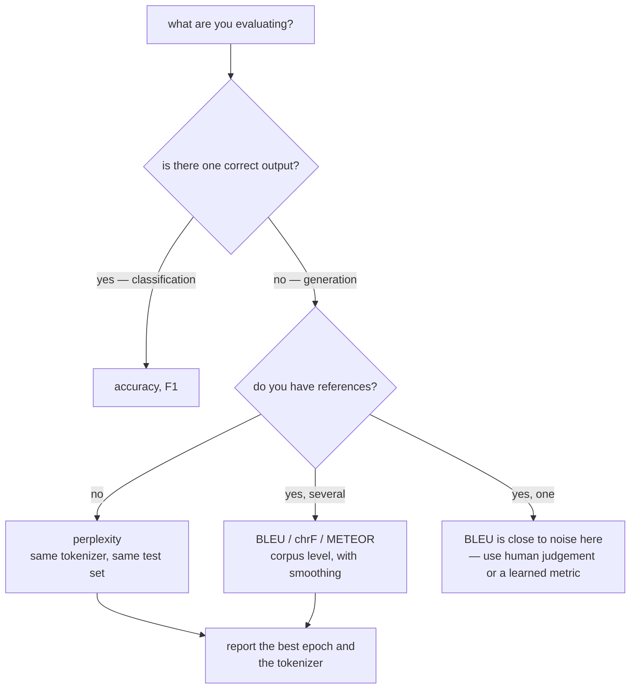

Every model in this phase has been scored with accuracy, which works because the answer
was one of two labels. Generation has no such luxury: there are many acceptable outputs,
most of them never written down, and the metric has to cope.

Two metrics dominate, and both are routinely misread. This page implements both, and the
implementation is the point — perplexity gets compared across incomparable test sets, and
BLEU gets quoted without the properties that make it fail.

## What you'll learn

- Perplexity as **exponentiated cross-entropy**, and why uniform perplexity equals the
  vocabulary size.
- The ladder on one shared test set: **uniform 4,997 → unigram 408.05 → bigram 226.47 →
  neural 189.81**.
- Why perplexity numbers from two papers are usually **not comparable**.
- Why BLEU gives a correct reordering and a correct paraphrase **0.0000**.
- The brevity penalty, alone, in a table.
- What sampling temperature does to diversity and to likelihood — in opposite directions.

## Perplexity

$$
\text{PP} = \exp\!\left(-\frac{1}{N}\sum_{i=1}^{N} \log P(w_i \mid w_{<i})\right)
$$

It is the exponential of the average negative log-likelihood, and it has a clean reading:
**the effective number of equally-likely choices the model faces at each step**. A model
with perplexity 200 is as uncertain as someone rolling a fair 200-sided die.

That reading gives a free sanity check. A model that has learned nothing assigns every
word probability $1/V$, so its perplexity is exactly $V$ — measured **4,997.00** on a
4,997-word vocabulary.

| Model | Held-out perplexity | Tokens scored |
| --- | --- | --- |
| uniform | 4,997.00 | 30,000 |
| unigram (add-0.1) | 408.05 | 30,000 |
| bigram (add-0.1) | 226.47 | 30,000 |
| **neural (8-token context)** | **189.81** | 30,000 |

<Figure
  src="/images/dl/phase-05-nlp/evaluating-language-models/perplexity-ladder"
  alt="Two panels. Left: bars of held-out perplexity on a log scale — uniform 4,997.0, unigram 408.1, bigram 226.5 and neural 189.8. Right: the neural model's per-epoch validation perplexity, falling steeply to a minimum of 189.81 at epoch 5 and then rising to 256.49 by epoch 14, crossing back above the dashed bigram line."
  title="4,000 train / 1,000 test reviews, vocabulary 4,997"
  caption="The right panel is why the left panel says 189.81 rather than 256.49: this model's minimum is at epoch 5 of 14, and by the end it has overfitted past the bigram it beats. Reporting the final epoch instead of the best one — which an earlier version of this page did — turned a win into a loss of 4,062 perplexity."
/>

### The two ways this measurement goes wrong

Both happened here before the numbers above were trustworthy.

1. **Scoring different test sets.** The first run scored the n-gram models on all 231,210
   held-out tokens and the neural model on 30,000 windows, then printed them in one
   table. Perplexity is an average over whatever you scored, so that comparison was
   meaningless. Every model above sees the identical windows.
2. **Reporting the final epoch.** With 1,030,085 parameters — most of them in the output
   layer — the model overfits hard. Final-epoch perplexity was **4,062.44** in one
   configuration; the minimum was far lower.

And a third that cannot be fixed by being careful, only by disclosure: **perplexity
depends on the tokenizer**. A model over 2,070 BPE pieces and a model over 39,563 words
are averaging over different units, so their perplexities are not on the same scale.
Comparing them is like comparing prices without saying which currency.

## BLEU

BLEU compares an output against one or more references by counting matching n-grams:

$$
\text{BLEU} = \underbrace{\text{BP}}_{\text{brevity penalty}} \cdot
\exp\!\left(\frac{1}{N}\sum_{n=1}^{N} \log p_n\right),
\qquad
\text{BP} = \min\!\left(1,\ e^{1 - r/c}\right)
$$

where $p_n$ is the clipped precision of $n$-grams and $r/c$ is the reference length over
the candidate length. Measured against the reference `'the cat sat on the mat'`:

| Candidate | BLEU-4 | BP | $p_1$ | $p_2$ | $p_3$ | $p_4$ |
| --- | --- | --- | --- | --- | --- | --- |
| exact match | 1.0000 | 1.000 | 1.000 | 1.000 | 1.000 | 1.000 |
| one word changed | 0.5373 | 1.000 | 0.833 | 0.600 | 0.500 | 0.333 |
| **reordered** | **0.0000** | 1.000 | **1.000** | 0.800 | 0.500 | **0.000** |
| **shorter but correct** | **0.0000** | **0.368** | 1.000 | 1.000 | 1.000 | **0.000** |
| synonym | 0.5373 | 1.000 | 0.833 | 0.600 | 0.500 | 0.333 |
| padded with repeats | 0.6804 | 1.000 | 0.750 | 0.714 | 0.667 | 0.600 |

<Figure
  src="/images/dl/phase-05-nlp/evaluating-language-models/bleu-anatomy"
  alt="Two panels. Left: horizontal bars of BLEU-4 for six candidate sentences against one reference, with exact match at 1.0, one-word-changed and synonym at 0.5373, padded-with-repeats at 0.6804, and both reordered and shorter-but-correct at zero. Right: BLEU against maximum n-gram order for three candidates, where the reordered sentence scores well at order 1 and collapses to zero at order 4."
  title="One reference, six candidates"
  caption="Two zeros to explain. 'On the mat the cat sat' contains every reference unigram — p1 is a perfect 1.000 — and still scores 0.0000, because the geometric mean over precisions is zero as soon as any one of them is, and no 4-gram survives the reordering. 'The cat sat' has perfect precision at every order and is destroyed by a brevity penalty of 0.368. Meanwhile 'the cat sat on the mat mat mat' — padded with nonsense — scores 0.6804, higher than either."
/>

Read that last row again: **a sentence padded with repeated words outscored a correct
shorter one by 0.68**. BLEU is a precision-based metric with a length hack bolted on, and
its failures are structural rather than incidental:

- **It compares surface strings.** `feline` for `cat` scores exactly as badly as a wrong
  word.
- **A single zero precision zeroes everything**, because the combination is a geometric
  mean. Real implementations apply smoothing for this reason — usually add-1 on the
  counts.
- **The brevity penalty is the only thing preventing degenerate short outputs**, and it
  is asymmetric: too long is free, too short is punished exponentially.

| Candidate length | Reference length | BP |
| --- | --- | --- |
| 3 | 6 | **0.3679** |
| 4 | 6 | 0.6065 |
| 5 | 6 | 0.8187 |
| 6 | 6 | 1.0000 |
| 7 | 6 | 1.0000 |
| 12 | 6 | **1.0000** |

BLEU is still used because on *corpus-level* translation with multiple references it
correlates reasonably with human judgement. On single sentences with one reference — the
way it is quoted in most blog posts — it is close to noise.

## Temperature: diversity against likelihood

Sampling divides the logits by a temperature before the softmax. Measured on 2,000
predictions from the trained model:

| Temperature | Distinct tokens | Mean top probability | Entropy | Perplexity |
| --- | --- | --- | --- | --- |
| 0.2 | 69 | 0.8420 | 0.4265 | **98,041.8** |
| 0.5 | 174 | 0.5845 | 1.5489 | 1,162.6 |
| 0.8 | 493 | 0.3016 | 3.5904 | 283.5 |
| **1.0** | 714 | 0.1788 | 4.7475 | **225.5** |
| 1.5 | 1,044 | 0.0580 | 6.3151 | 243.6 |

<Figure
  src="/images/dl/phase-05-nlp/evaluating-language-models/length-and-temperature"
  alt="Two panels. Left: distinct tokens produced against sampling temperature, rising from 69 at 0.2 to 1,044 at 1.5. Right: perplexity of the reweighted distribution on a log scale, falling from 98,041.8 at temperature 0.2 to a minimum of 225.5 at 1.0 and rising slightly to 243.6 at 1.5."
  title="2,000 predictions from the trained model"
  caption="The perplexity minimum sits at temperature 1.0, which is not a coincidence: that is the distribution the model was trained to produce, and any reweighting makes it a worse predictor of the actual next token. Sharpening to 0.2 raises perplexity by a factor of 435 while cutting the vocabulary in use from 714 tokens to 69 — the numerical signature of repetitive output."
/>

Which is the honest limitation of perplexity for generation: **it is minimised at
temperature 1.0, but almost nobody generates at temperature 1.0**, because samples from
the raw distribution wander. The setting people actually ship — 0.7–0.9, or top-*p*
sampling — is a setting perplexity says is worse.



```p5 title="Perplexity as effective choices" desc="Move the probability the model assigns to the true next word and watch perplexity. Perplexity is the size of the fair die that would be equally uncertain." height="330"
let probability = 0.05;
let dragging = false;
function setup() {
  createCanvas(620, 330);
  textFont("monospace");
}
function draw() {
  background(13, 17, 23);
  const perplexity = 1 / probability;
  noStroke();
  fill(230);
  textSize(12);
  textAlign(LEFT, TOP);
  text("if the model gives the true next word probability p on every step:",
    30, 22);
  fill(255, 211, 67);
  textSize(22);
  text("p = " + probability.toFixed(4) + "     perplexity = "
    + perplexity.toFixed(1), 30, 50);
  fill(200);
  textSize(11);
  const sides = Math.max(Math.round(perplexity), 1);
  text("as uncertain as a fair " + sides + "-sided die", 30, 92);
  // Draw a bar for the true word and a few competitors.
  const rest = (1 - probability) / 6;
  const bars = [probability, rest, rest, rest, rest, rest, rest];
  for (let i = 0; i < bars.length; i++) {
    const x = 30 + i * 78;
    const h = bars[i] * 150;
    fill(i === 0 ? 165 : 70, i === 0 ? 214 : 80, i === 0 ? 164 : 96);
    rect(x, 250 - h, 62, h, 3);
    fill(i === 0 ? 165 : 140, i === 0 ? 214 : 150, i === 0 ? 164 : 165);
    textSize(9.5);
    textAlign(CENTER, TOP);
    text(bars[i].toFixed(3), x + 31, 254);
    text(i === 0 ? "true" : "other", x + 31, 268);
    textAlign(LEFT, TOP);
  }
  fill(150);
  textSize(10.5);
  text("measured on this page: uniform 4,997.0 (a model that learned nothing),",
    30, 290);
  text("bigram 226.5, neural 189.8 — all on the same 30,000 windows", 30, 306);
  fill(60, 70, 84);
  rect(30, 232, 540, 4, 2);
  fill(255, 211, 67);
  circle(30 + Math.pow(probability, 0.35) * 540, 234, 12);
}
function mousePressed() { if (Math.abs(mouseY - 234) < 12) dragging = true; }
function mouseDragged() {
  if (dragging) {
    const fraction = Math.min(Math.max((mouseX - 30) / 540, 0.001), 1);
    probability = Math.pow(fraction, 1 / 0.35);
  }
}
function mouseReleased() { dragging = false; }
```

```p5 title="The measured table, ranked" desc="Click a column to rank every row by it. The bars are that column's values and the highest and lowest are computed from the numbers, not written in." height="306"
let metric = 0;
const COLUMNS = ["BLEU-4", "BP", "p1", "p2"];
const ROWS = [
  ["exact match", 1, 1, 1, 1],
  ["one word changed", 0.5373, 1, 0.833, 0.6],
  ["reordered", 0, 1, 1, 0.8],
  ["shorter but correct", 0, 0.368, 1, 1],
  ["synonym", 0.5373, 1, 0.833, 0.6],
  ["padded with repeats", 0.6804, 1, 0.75, 0.714]
];
function setup() {
  createCanvas(620, 306);
  textFont("monospace");
}
function fmt(v) {
  if (v === 0) { return "0"; }
  const a = Math.abs(v);
  if (a >= 1000 || a < 0.001) { return v.toExponential(2); }
  if (a >= 100) { return v.toFixed(1); }
  return v.toFixed(4);
}
function draw() {
  background(13, 17, 23);
  noStroke();
  fill(230);
  textSize(12);
  textAlign(LEFT, TOP);
  text("Evaluating Language Models (Perple", 26, 16);
  let x = 26;
  for (let i = 0; i < COLUMNS.length; i++) {
    const w = COLUMNS[i].length * 6.6 + 16;
    if (i === metric) { fill(255, 211, 67); } else { fill(48, 56, 68); }
    rect(x, 40, w, 22, 4);
    if (i === metric) { fill(13, 17, 23); } else { fill(180); }
    textSize(9);
    text(COLUMNS[i], x + 8, 47);
    x += w + 6;
    if (x > 500) { break; }
  }
  const values = ROWS.map((r) => r[metric + 1]);
  const lo = Math.min(...values);
  const hi = Math.max(...values);
  const span = hi - lo === 0 ? 1 : hi - lo;
  const order = ROWS.slice().sort((a, b) => b[metric + 1] - a[metric + 1]);
  for (let i = 0; i < order.length; i++) {
    const y = 78 + i * 26;
    const v = order[i][metric + 1];
    fill(160);
    textSize(9);
    text(order[i][0], 26, y + 5);
    fill(34, 40, 50);
    rect(230, y, 280, 18, 3);
    const frac = (v - lo) / span;
    if (v === hi) { fill(126, 192, 143); }
    else if (v === lo) { fill(224, 108, 117); }
    else { fill(107, 169, 221); }
    rect(230, y, Math.max(frac * 280, 3), 18, 3);
    fill(225);
    textSize(9);
    text(fmt(v), 518, y + 5);
  }
  const top = order[0];
  const bottom = order[order.length - 1];
  fill(150);
  textSize(9);
  const base = 78 + order.length * 26 + 8;
  text("highest " + COLUMNS[metric] + ": " + top[0] + " at " + fmt(top[1]),
       26, base);
  text("lowest  " + COLUMNS[metric] + ": " + bottom[0] + " at "
       + fmt(bottom[1]), 26, base + 14);
  text("bars are scaled within the chosen column - lowest is not zero", 26,
       base + 30);
}
function mousePressed() {
  let x = 26;
  for (let i = 0; i < COLUMNS.length; i++) {
    const w = COLUMNS[i].length * 6.6 + 16;
    if (mouseX > x && mouseX < x + w && mouseY > 40 && mouseY < 62) {
      metric = i;
    }
    x += w + 6;
  }
}
```

## Pitfalls

- **Comparing perplexities across tokenizers.** 2,070 BPE pieces and 39,563 words are
  different units; the numbers are not on one scale.
- **Comparing perplexities across test sets.** Scoring 231,210 tokens against 30,000
  windows produced a table that meant nothing.
- **Reporting the final epoch.** The neural model's best was 189.81 at epoch 5 and 256.49
  at epoch 14 — and 4,062.44 in an unregularised configuration.
- **Quoting BLEU on single sentences with one reference.** A correct reordering scores
  0.0000 and a padded sentence scores 0.6804.
- **Using BLEU-4 without smoothing.** One zero precision zeroes the whole score.
- **Forgetting the brevity penalty is asymmetric.** Twelve tokens against six is free;
  three against six costs a factor of 0.368.
- **Treating a perplexity win as a generation win.** Perplexity is minimised at
  temperature 1.0, which is not the temperature anyone generates at.

## Recap

- Perplexity is exponentiated cross-entropy — the effective number of equally-likely
  choices per step — and a model that learned nothing scores exactly the vocabulary size
  (4,997.00).
- On one shared 30,000-window test set: unigram 408.05, bigram 226.47, neural **189.81**.
- The neural model's minimum was at epoch 5 of 14 (256.49 at the end): report the best
  epoch.
- BLEU gives a correct reordering 0.0000 and a correct paraphrase 0.5373, while a
  repeat-padded sentence scores 0.6804.
- The brevity penalty runs 0.3679 at half length and 1.0000 at any length above the
  reference.
- Temperature 0.2 cut distinct tokens from 714 to 69 and raised perplexity 435×;
  perplexity is minimised at exactly 1.0.

## Next

That closes the NLP phase. Generation moves from measuring text to producing images and
sound:
[Phase 6 — Generative Deep Learning](/deep-learning/phase-06---generative-deep-learning/phase-6---generative-deep-learning/).

<Quiz
  questions={[
    {
      q: "A model with a 4,997-word vocabulary that has learned nothing scores perplexity 4,997.00. Why exactly the vocabulary size?",
      options: [
        "Coincidence of this dataset",
        "It assigns every word probability 1/V, so exponentiated cross-entropy is exactly V — perplexity is the effective number of equally-likely choices per step",
        "Because the test set has 4,997 tokens",
        "Because perplexity is undefined for uniform models",
      ],
      answer: 1,
      explain: "That gives a free sanity check: any perplexity at or above the vocabulary size means the model has learned nothing usable.",
    },
    {
      q: "The neural model scored perplexity 189.81 at epoch 5 and 256.49 at epoch 14. Which do you report, and why does it matter?",
      options: [
        "The final epoch, because training finished",
        "The best epoch — with 1,030,085 parameters the model overfits, and an earlier unregularised run reported 4,062.44 at the final epoch while its minimum was far lower",
        "The average across epochs",
        "Either; the difference is noise",
      ],
      answer: 1,
      explain: "Reporting the final epoch turned a win over the bigram into an apparent loss of thousands of perplexity points.",
    },
    {
      q: "'On the mat the cat sat' contains every unigram of 'the cat sat on the mat' and scores BLEU-4 = 0.0000. Why?",
      options: [
        "The brevity penalty",
        "BLEU combines n-gram precisions with a geometric mean, so a single zero — here p4, since no 4-gram survives the reordering — zeroes the whole score",
        "Because word order is weighted most heavily",
        "Because the candidate is too long",
      ],
      answer: 1,
      explain: "This is why real implementations smooth the counts. The same table shows a repeat-padded sentence scoring 0.6804 — higher than a correct shorter one.",
    },
    {
      q: "Why are two published perplexity numbers usually not comparable?",
      options: [
        "Because different papers use different hardware",
        "Because perplexity is an average per token, so it depends on the tokenizer and on the test set — a model over BPE pieces and one over whole words are averaging different units",
        "Because perplexity is not deterministic",
        "Because they use different random seeds",
      ],
      answer: 1,
      explain: "The subword page measured 2,070 pieces against 39,563 words on the same corpus — the same text, very different token counts.",
    },
    {
      q: "Perplexity of the reweighted distribution was minimised at temperature 1.0 (225.5) and rose to 98,041.8 at 0.2. What does that tell you about using perplexity to tune generation?",
      options: [
        "Temperature 1.0 is always the right choice",
        "Perplexity is minimised at exactly the distribution the model was trained on, so it cannot recommend the sharper settings people actually ship — it measures prediction, not sample quality",
        "Low temperature is always better",
        "Perplexity is broken for neural models",
      ],
      answer: 1,
      explain: "Sharpening to 0.2 cut the vocabulary in use from 714 tokens to 69 — the numerical signature of repetition, which perplexity registers only as 'worse'.",
    },
  ]}
/>

## 🧪 Try It Yourself

<DataCampExercise
  lang="python"
  hint={`Perplexity is the exponential of the mean negative log-likelihood. A uniform model assigns 1/V to every token.`}
  code={`# Task: Exercise 1 - Perplexity from first principles
import math

import numpy as np

VOCAB = 4997
rng = np.random.default_rng(0)


def perplexity(probabilities):
    """probabilities: the model's probability for each true next token."""
    log_probability = np.log(np.clip(probabilities, 1e-12, None)).mean()
    return math.exp(-___)                        # replace ___ with log_probability


uniform = np.full(30000, 1.0 / VOCAB)
print(f"uniform model over {VOCAB:,} words: perplexity "
      f"{perplexity(uniform):,.2f}")
print(f"the vocabulary size is {VOCAB:,} - a model that learned nothing is")
print(f"'as confused as' a fair {VOCAB:,}-sided die")
print(f"{'true-token probability':>24} {'perplexity':>12}")
for p in (1.0, 0.5, 0.1, 0.01, 1.0 / VOCAB):
    print(f"{p:24.5f} {perplexity(np.full(1000, p)):12,.2f}")
print("perplexity is 1/p for a constant p: it counts effective choices")

# -- Expected Output -------------------------------------------
# uniform model over 4,997 words: perplexity 4,997.00
# the vocabulary size is 4,997 - a model that learned nothing is
# 'as confused as' a fair 4,997-sided die
#   true-token probability   perplexity
#                  1.00000         1.00
#                  0.50000         2.00
#                  0.10000        10.00
#                  0.01000       100.00
#                  0.00020     4,997.00
# perplexity is 1/p for a constant p: it counts effective choices
# --------------------------------------------------------------`}
  solution={`# Task: Exercise 1 - Perplexity from first principles
import math

import numpy as np

VOCAB = 4997
rng = np.random.default_rng(0)


def perplexity(probabilities):
    """probabilities: the model's probability for each true next token."""
    log_probability = np.log(np.clip(probabilities, 1e-12, None)).mean()
    return math.exp(-log_probability)


uniform = np.full(30000, 1.0 / VOCAB)
print(f"uniform model over {VOCAB:,} words: perplexity "
      f"{perplexity(uniform):,.2f}")
print(f"the vocabulary size is {VOCAB:,} - a model that learned nothing is")
print(f"'as confused as' a fair {VOCAB:,}-sided die")
print(f"{'true-token probability':>24} {'perplexity':>12}")
for p in (1.0, 0.5, 0.1, 0.01, 1.0 / VOCAB):
    print(f"{p:24.5f} {perplexity(np.full(1000, p)):12,.2f}")
print("perplexity is 1/p for a constant p: it counts effective choices")

# -- Expected Output -------------------------------------------
# uniform model over 4,997 words: perplexity 4,997.00
# the vocabulary size is 4,997 - a model that learned nothing is
# 'as confused as' a fair 4,997-sided die
#   true-token probability   perplexity
#                  1.00000         1.00
#                  0.50000         2.00
#                  0.10000        10.00
#                  0.01000       100.00
#                  0.00020     4,997.00
# perplexity is 1/p for a constant p: it counts effective choices
# --------------------------------------------------------------`}
  sct={`test_output_contains("uniform model over 4,997 words: perplexity 4,997.00", pattern=False)
test_output_contains("0.10000        10.00", pattern=False)
success_msg("Perplexity is exp of the mean negative log-likelihood: a constant probability p gives exactly 1/p, so a model that learned nothing scores the vocabulary size.")`}
  height={400}
/>

<DataCampExercise
  lang="python"
  hint={`Count unigrams and bigrams on the training half, then score the held-out half. Add-k smoothing keeps unseen pairs from giving zero probability.`}
  code={`# Task: Exercise 2 - An n-gram ladder on one test set
import math
from collections import Counter, defaultdict

text = ("the cat sat on the mat . the dog sat on the rug . the cat saw the dog . "
        "the dog saw the cat . a cat sat on a mat . a dog sat on a rug . ") * 20
tokens = text.split()
cut = int(len(tokens) * 0.8)
train, test = tokens[:cut], tokens[cut:]
known = set(train)
size = len(known)

unigram, bigram = Counter(train), defaultdict(Counter)
for a, b in zip(train, train[1:]):
    bigram[a][b] += 1
total, k = sum(unigram.values()), 0.1

pairs = [(a, b) for a, b in zip(test, test[1:]) if a in known and b in known]
print(f"vocabulary {size}, scoring {len(pairs)} (context, target) pairs")


def score(name, function):
    log_probability = sum(math.log(function(a, b)) for a, b in pairs)
    value = math.exp(-log_probability / len(pairs))
    print(f"{name:10s} {value:8.2f}")
    return value


uniform = score("uniform", lambda a, b: 1 / size)
unigram_pp = score("unigram", lambda a, b: (unigram[b] + k) / (total + k * size))
bigram_pp = score("bigram", lambda a, b: ((bigram[a][b] + k)
                                          / (sum(bigram[a].values()) + k * ___)))
print("bigram beats unigram beats uniform:", bigram_pp < unigram_pp < uniform)`}
  solution={`# Task: Exercise 2 - An n-gram ladder on one test set
import math
from collections import Counter, defaultdict

text = ("the cat sat on the mat . the dog sat on the rug . the cat saw the dog . "
        "the dog saw the cat . a cat sat on a mat . a dog sat on a rug . ") * 20
tokens = text.split()
cut = int(len(tokens) * 0.8)
train, test = tokens[:cut], tokens[cut:]
known = set(train)
size = len(known)

unigram, bigram = Counter(train), defaultdict(Counter)
for a, b in zip(train, train[1:]):
    bigram[a][b] += 1
total, k = sum(unigram.values()), 0.1

pairs = [(a, b) for a, b in zip(test, test[1:]) if a in known and b in known]
print(f"vocabulary {size}, scoring {len(pairs)} (context, target) pairs")


def score(name, function):
    log_probability = sum(math.log(function(a, b)) for a, b in pairs)
    value = math.exp(-log_probability / len(pairs))
    print(f"{name:10s} {value:8.2f}")
    return value


uniform = score("uniform", lambda a, b: 1 / size)
unigram_pp = score("unigram", lambda a, b: (unigram[b] + k) / (total + k * size))
bigram_pp = score("bigram", lambda a, b: ((bigram[a][b] + k)
                                          / (sum(bigram[a].values()) + k * size)))
print("bigram beats unigram beats uniform:", bigram_pp < unigram_pp < uniform)`}
  sct={`test_output_contains("bigram beats unigram beats uniform: True", pattern=False)
success_msg("Every model scored the identical pairs, and each extra bit of context lowers perplexity: uniform, then unigram, then bigram.")`}
  height={400}
/>

<DataCampExercise
  lang="python"
  hint={`Clip each candidate n-gram count by the maximum count in any reference, then combine the precisions with a geometric mean and multiply by the brevity penalty.`}
  code={`# Task: Exercise 3 - BLEU, and the cases where it fails
import math
from collections import Counter


def bleu(candidate, references, order=4):
    precisions = []
    for n in range(1, order + 1):
        counts = Counter(tuple(candidate[i:i + n])
                         for i in range(len(candidate) - n + 1))
        if not counts:
            precisions.append(0.0)
            continue
        best = Counter()
        for reference in references:
            reference_counts = Counter(tuple(reference[i:i + n])
                                       for i in range(len(reference) - n + 1))
            for gram, count in reference_counts.items():
                best[gram] = max(best[gram], count)
        clipped = sum(min(count, best[gram]) for gram, count in counts.items())
        precisions.append(clipped / sum(counts.values()))
    if min(precisions) == 0:
        geometric = 0.0
    else:
        geometric = math.exp(sum(math.log(v) for v in precisions)
                             / len(precisions))
    reference_length = len(references[0])
    penalty = (1.0 if len(candidate) > reference_length
               else math.exp(1 - reference_length / max(len(candidate), ___)))
    # replace ___ with 1
    return penalty * geometric, precisions, penalty


REFERENCE = "the cat sat on the mat".split()
CASES = (("exact match", "the cat sat on the mat"),
         ("one word changed", "the cat sat on a mat"),
         ("reordered", "on the mat the cat sat"),
         ("shorter but correct", "the cat sat"),
         ("synonym", "the feline sat on the mat"),
         ("padded with repeats", "the cat sat on the mat mat mat"))
print(f"{'case':22s} {'BLEU-4':>8} {'BP':>7} {'p1':>6} {'p2':>6} {'p3':>6} "
      f"{'p4':>6}")
for label, text in CASES:
    value, precisions, penalty = bleu(text.split(), [REFERENCE])
    print(f"{label:22s} {value:8.4f} {penalty:7.3f} "
          + " ".join(f"{p:6.3f}" for p in precisions))
print("a padded sentence outscores a correct shorter one by 0.68: BLEU is a")
print("precision metric with a length hack, and both halves show here")

# -- Expected Output -------------------------------------------
# case                     BLEU-4      BP     p1     p2     p3     p4
# exact match              1.0000   1.000  1.000  1.000  1.000  1.000
# one word changed         0.5373   1.000  0.833  0.600  0.500  0.333
# reordered                0.0000   1.000  1.000  0.800  0.500  0.000
# shorter but correct      0.0000   0.368  1.000  1.000  1.000  0.000
# synonym                  0.5373   1.000  0.833  0.600  0.500  0.333
# padded with repeats      0.6804   1.000  0.750  0.714  0.667  0.600
# a padded sentence outscores a correct shorter one by 0.68: BLEU is a
# precision metric with a length hack, and both halves show here
# --------------------------------------------------------------`}
  solution={`# Task: Exercise 3 - BLEU, and the cases where it fails
import math
from collections import Counter


def bleu(candidate, references, order=4):
    precisions = []
    for n in range(1, order + 1):
        counts = Counter(tuple(candidate[i:i + n])
                         for i in range(len(candidate) - n + 1))
        if not counts:
            precisions.append(0.0)
            continue
        best = Counter()
        for reference in references:
            reference_counts = Counter(tuple(reference[i:i + n])
                                       for i in range(len(reference) - n + 1))
            for gram, count in reference_counts.items():
                best[gram] = max(best[gram], count)
        clipped = sum(min(count, best[gram]) for gram, count in counts.items())
        precisions.append(clipped / sum(counts.values()))
    if min(precisions) == 0:
        geometric = 0.0
    else:
        geometric = math.exp(sum(math.log(v) for v in precisions)
                             / len(precisions))
    reference_length = len(references[0])
    penalty = (1.0 if len(candidate) > reference_length
               else math.exp(1 - reference_length / max(len(candidate), 1)))
    return penalty * geometric, precisions, penalty


REFERENCE = "the cat sat on the mat".split()
CASES = (("exact match", "the cat sat on the mat"),
         ("one word changed", "the cat sat on a mat"),
         ("reordered", "on the mat the cat sat"),
         ("shorter but correct", "the cat sat"),
         ("synonym", "the feline sat on the mat"),
         ("padded with repeats", "the cat sat on the mat mat mat"))
print(f"{'case':22s} {'BLEU-4':>8} {'BP':>7} {'p1':>6} {'p2':>6} {'p3':>6} "
      f"{'p4':>6}")
for label, text in CASES:
    value, precisions, penalty = bleu(text.split(), [REFERENCE])
    print(f"{label:22s} {value:8.4f} {penalty:7.3f} "
          + " ".join(f"{p:6.3f}" for p in precisions))
print("a padded sentence outscores a correct shorter one by 0.68: BLEU is a")
print("precision metric with a length hack, and both halves show here")

# -- Expected Output -------------------------------------------
# case                     BLEU-4      BP     p1     p2     p3     p4
# exact match              1.0000   1.000  1.000  1.000  1.000  1.000
# one word changed         0.5373   1.000  0.833  0.600  0.500  0.333
# reordered                0.0000   1.000  1.000  0.800  0.500  0.000
# shorter but correct      0.0000   0.368  1.000  1.000  1.000  0.000
# synonym                  0.5373   1.000  0.833  0.600  0.500  0.333
# padded with repeats      0.6804   1.000  0.750  0.714  0.667  0.600
# a padded sentence outscores a correct shorter one by 0.68: BLEU is a
# precision metric with a length hack, and both halves show here
# --------------------------------------------------------------`}
  sct={`test_output_contains("0.0000   0.368", pattern=False)
test_output_contains("exact match              1.0000", pattern=False)
success_msg("A correct reordering and a correct shorter sentence both score 0.0000, while padding with repeats scores higher: BLEU is precision plus a length hack.")`}
  height={400}
/>

<DataCampExercise
  lang="python"
  hint={`Add 1 to both the clipped count and the total for each order. Then no precision can be exactly zero.`}
  code={`# Task: Exercise 4 - Why BLEU implementations smooth
import math
from collections import Counter


def bleu(candidate, reference, order=4, smooth=0):
    logs = []
    for n in range(1, order + 1):
        cand = Counter(tuple(candidate[i:i + n])
                       for i in range(len(candidate) - n + 1))
        ref = Counter(tuple(reference[i:i + n])
                      for i in range(len(reference) - n + 1))
        clipped = sum(min(count, ref[gram]) for gram, count in cand.items())
        total = sum(cand.values())
        numerator = clipped + smooth
        denominator = total + ___          # add the same smoothing constant
        if numerator == 0:
            return 0.0
        logs.append(math.log(numerator / denominator))
    penalty = (1.0 if len(candidate) > len(reference)
               else math.exp(1 - len(reference) / max(len(candidate), 1)))
    return penalty * math.exp(sum(logs) / len(logs))


REFERENCE = "the cat sat on the mat".split()
print(f"{'case':22s} {'raw BLEU-4':>11} {'smoothed':>10}")
for label, text in (("reordered", "on the mat the cat sat"),
                    ("shorter but correct", "the cat sat"),
                    ("one word changed", "the cat sat on a mat")):
    raw = bleu(text.split(), REFERENCE)
    smoothed = bleu(text.split(), REFERENCE, smooth=1)
    print(f"{label:22s} {raw:11.4f} {smoothed:10.4f}")
print("smoothing turns a hard zero into a small number")`}
  solution={`# Task: Exercise 4 - Why BLEU implementations smooth
import math
from collections import Counter


def bleu(candidate, reference, order=4, smooth=0):
    logs = []
    for n in range(1, order + 1):
        cand = Counter(tuple(candidate[i:i + n])
                       for i in range(len(candidate) - n + 1))
        ref = Counter(tuple(reference[i:i + n])
                      for i in range(len(reference) - n + 1))
        clipped = sum(min(count, ref[gram]) for gram, count in cand.items())
        total = sum(cand.values())
        numerator = clipped + smooth
        denominator = total + smooth       # add the same smoothing constant
        if numerator == 0:
            return 0.0
        logs.append(math.log(numerator / denominator))
    penalty = (1.0 if len(candidate) > len(reference)
               else math.exp(1 - len(reference) / max(len(candidate), 1)))
    return penalty * math.exp(sum(logs) / len(logs))


REFERENCE = "the cat sat on the mat".split()
print(f"{'case':22s} {'raw BLEU-4':>11} {'smoothed':>10}")
for label, text in (("reordered", "on the mat the cat sat"),
                    ("shorter but correct", "the cat sat"),
                    ("one word changed", "the cat sat on a mat")):
    raw = bleu(text.split(), REFERENCE)
    smoothed = bleu(text.split(), REFERENCE, smooth=1)
    print(f"{label:22s} {raw:11.4f} {smoothed:10.4f}")
print("smoothing turns a hard zero into a small number")`}
  sct={`test_output_contains("reordered                   0.0000     0.5946", pattern=False)
test_output_contains("one word changed            0.5373     0.6435", pattern=False)
success_msg("Add-1 smoothing turns the hard zeros into small positive scores, which is what makes sentence-level BLEU usable.")`}
  height={400}
/>

<DataCampExercise
  lang="python"
  hint={`Divide the log-probabilities by the temperature and renormalise. Then count how many distinct tokens sampling produces.`}
  code={`# Task: Exercise 5 - Temperature: diversity against likelihood
import numpy as np

rng = np.random.default_rng(0)
base = rng.dirichlet(np.full(500, 0.15), size=2000)
truth = rng.integers(0, 500, 2000)

print(f"{'temperature':>12} {'distinct':>9} {'mean top p':>11} "
      f"{'entropy':>9} {'perplexity':>12}")
perplexities = {}
for temperature in (0.2, 0.5, 0.8, 1.0, 1.5):
    logits = np.log(np.clip(base, 1e-9, None)) / ___   # divide by the temperature
    shifted = logits - logits.max(axis=1, keepdims=True)
    scaled = np.exp(shifted)
    scaled /= scaled.sum(axis=1, keepdims=True)
    picks = rng.choice(500, size=300, p=scaled[0])   # 300 samples from one context
    likelihood = scaled[np.arange(len(truth)), truth]
    perplexity = float(np.exp(-np.log(np.clip(likelihood, 1e-9,
                                              None)).mean()))
    perplexities[temperature] = perplexity
    entropy = float(-(scaled * np.log(scaled + 1e-12)).sum(axis=1).mean())
    print(f"{temperature:12.1f} {len(set(picks.tolist())):9d} "
          f"{float(scaled.max(axis=1).mean()):11.4f} {entropy:9.4f} "
          f"{perplexity:12,.1f}")
print("sharpening buys repetition and costs likelihood")
print("perplexity at 0.2 is higher than at 1.0:",
      perplexities[0.2] > perplexities[1.0])`}
  solution={`# Task: Exercise 5 - Temperature: diversity against likelihood
import numpy as np

rng = np.random.default_rng(0)
base = rng.dirichlet(np.full(500, 0.15), size=2000)
truth = rng.integers(0, 500, 2000)

print(f"{'temperature':>12} {'distinct':>9} {'mean top p':>11} "
      f"{'entropy':>9} {'perplexity':>12}")
perplexities = {}
for temperature in (0.2, 0.5, 0.8, 1.0, 1.5):
    logits = np.log(np.clip(base, 1e-9, None)) / temperature   # divide by the temperature
    shifted = logits - logits.max(axis=1, keepdims=True)
    scaled = np.exp(shifted)
    scaled /= scaled.sum(axis=1, keepdims=True)
    picks = rng.choice(500, size=300, p=scaled[0])   # 300 samples from one context
    likelihood = scaled[np.arange(len(truth)), truth]
    perplexity = float(np.exp(-np.log(np.clip(likelihood, 1e-9,
                                              None)).mean()))
    perplexities[temperature] = perplexity
    entropy = float(-(scaled * np.log(scaled + 1e-12)).sum(axis=1).mean())
    print(f"{temperature:12.1f} {len(set(picks.tolist())):9d} "
          f"{float(scaled.max(axis=1).mean()):11.4f} {entropy:9.4f} "
          f"{perplexity:12,.1f}")
print("sharpening buys repetition and costs likelihood")
print("perplexity at 0.2 is higher than at 1.0:",
      perplexities[0.2] > perplexities[1.0])`}
  sct={`test_output_contains("perplexity at 0.2 is higher than at 1.0: True", pattern=False)
success_msg("Dividing the logits by a low temperature sharpens the distribution, which repeats tokens and costs likelihood.")`}
  height={400}
/>
