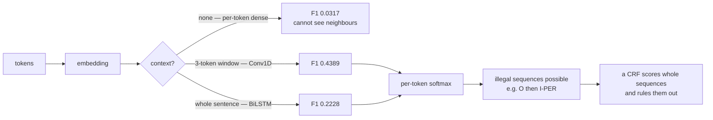

Named entity recognition tags each token with the span it belongs to: `mary/B-PER
okafor/I-PER joined/O acme/B-ORG industries/I-ORG`. It looks like classification with
more labels, and that resemblance is exactly what makes it easy to measure wrongly.

The best model on this page scores **0.8011 token accuracy** and **0.4389 entity F1** on
the same predictions. Both numbers are correct. Only one of them is the thing you care
about.

## What you'll learn

- BIO tagging, and how a tag sequence becomes a set of spans.
- Why token accuracy flatters: predicting `O` everywhere already scores **0.5653**.
- Why an entity counts only if its **start, end and type** are all right.
- The measurement that separates a real tagger from a word list: **38.00% of test tokens
  are words the model has never seen**.
- What the errors actually are — 48.09% missed, 17.04% boundary-off — and what that
  implies about the fix.

## The corpus, and why it is generated

CoNLL-2003 is not redistributable, so this page generates its data: templated sentences
with PERSON, LOCATION and ORGANISATION spans and exact BIO tags. Generated data gets the
labels right by construction, and it lets the difficulty be set deliberately rather than
inherited.

The first version of this corpus was **useless**. Every model scored a perfect 1.0000
token accuracy and 1.0000 entity F1, because the entity pools were small closed lists —
the models memorised which strings are names and never had to look at context. That
measures a lookup table.

Two changes fix it, and they are the two things that make real NER hard:

1. **The test entity pools are disjoint from the training ones.** Every test name, city
   and organisation is a string the model has never seen — **38.00% of test tokens are
   unknown words**.
2. **Some words are ambiguous.** `may`, `hope`, `mark`, `summit`, `delta` and `orion`
   appear both as entity words and as ordinary filler. No lookup table resolves them;
   only the surrounding context can.

## Token accuracy is the wrong metric

| Tag | Tokens | Share |
| --- | --- | --- |
| **O** | 11,469 | **0.5653** |
| B-PER | 1,500 | 0.0739 |
| I-PER | 1,500 | 0.0739 |
| B-LOC | 1,500 | 0.0739 |
| I-LOC | 977 | 0.0482 |
| B-ORG | 1,500 | 0.0739 |
| I-ORG | 1,842 | 0.0908 |

A model that predicts `O` for every token scores **0.5653 token accuracy** and finds
zero entities. On real newswire the `O` share is closer to 0.83, so the free score is
higher still.

<Figure
  src="/images/dl/phase-05-nlp/named-entity-recognition/tag-imbalance"
  alt="Two panels. Left: bars of tag share where O dominates at 0.5653 and the six entity tags sit between 0.0482 and 0.0908. Right: paired bars of token accuracy against entity F1 for four models — all-O scores 0.5653 token accuracy and 0.000 F1, per-token dense 0.575 and 0.032, 1D convolution 0.801 and 0.439, bidirectional LSTM 0.784 and 0.223."
  title="1,500 held-out sentences"
  caption="The right panel is the page in one picture. Every model's token accuracy is comfortably above the 0.5653 floor and looks respectable; the entity F1 next to it tells a completely different story, and the ordering of the two metrics is not even the same. The per-token dense model beats the do-nothing baseline by 0.0097 on tokens while finding almost nothing: F1 0.0317."
/>

### Spans, not tokens

An entity is correct only if its **start, end and type** all match:

```python title="BIO tags to spans"
def spans(tags):
    out, start, kind = set(), None, None
    for position, tag in enumerate(tags):
        if tag.startswith("B-"):
            if start is not None:
                out.add((start, position, kind))
            start, kind = position, tag[2:]
        elif tag.startswith("I-") and start is not None and tag[2:] == kind:
            continue                      # the span continues
        else:
            if start is not None:
                out.add((start, position, kind))
            start, kind = None, None
    if start is not None:
        out.add((start, len(tags), kind))
    return out
```

Getting `acme/B-ORG industries/O` right on one token out of two is not half an entity —
it is a missed entity *and* a spurious one-token entity. That asymmetry is why entity F1
sits so far below token accuracy.

## What the three models did

| Model | Parameters | Token accuracy | Precision | Recall | **Entity F1** |
| --- | --- | --- | --- | --- | --- |
| all `O` | 0 | 0.5653 | 0.0000 | 0.0000 | 0.0000 |
| per-token dense | 5,959 | 0.5750 | 0.2594 | 0.0169 | **0.0317** |
| **1D convolution** | 10,055 | **0.8011** | 0.5921 | 0.3487 | **0.4389** |
| bidirectional LSTM | 20,487 | 0.7845 | 0.2152 | 0.2309 | 0.2228 |

<Figure
  src="/images/dl/phase-05-nlp/named-entity-recognition/token-against-entity"
  alt="Grouped bars showing token accuracy, entity precision, entity recall and entity F1 for four models. The all-O baseline has token accuracy 0.57 and zeros elsewhere; per-token dense has high token accuracy but near-zero recall; the 1D convolution leads on every entity metric; the bidirectional LSTM sits between them."
  title="Four metrics, four models"
  caption="The per-token dense model is the control that makes the point: with no access to neighbouring words it cannot tell an unseen name from an unseen filler word, so it scores 0.2594 precision at 0.0169 recall — it tags almost nothing, and token accuracy still reads 0.5750. Both convolution and recurrence can see context; the convolution's fixed 3-token window happened to suit this template-generated data better than the LSTM's unbounded one at this budget."
/>

Two honest observations:

- **The per-token dense model fails by construction.** It sees one embedding at a time.
  Since 38% of test entity words are unknown tokens, it has nothing to go on — and
  its 0.5750 token accuracy still looks like a working model.
- **The bidirectional LSTM lost to a 1D convolution** (0.2228 against 0.4389). The
  entities here sit inside rigid templates where the informative context is one or two
  words away, which is precisely a convolution's window. This is a property of the
  generated corpus, not a general result — on real newswire, where entity context is
  longer-range and messier, recurrent and transformer taggers win comfortably.

## Where the errors are

<Figure
  src="/images/dl/phase-05-nlp/named-entity-recognition/boundary-errors"
  alt="A bar chart of entity-level outcomes for the 1D convolution: 1,569 exact at 34.87%, 0 wrong type, 767 boundary-off at 17.04%, 2,164 missed at 48.09%, and 0 spurious."
  title="4,500 true entities, best model"
  caption="Nearly half the entities are missed outright — unsurprising when the words are unseen. The 17.04% boundary-off cases are the interesting ones: the model found the entity and got its type right but its start or end wrong, usually by dropping the first token of a two-word name. Those are entirely invisible to token accuracy, which happily credits the token it did get right."
/>

| Outcome | Count | Share |
| --- | --- | --- |
| exact | 1,569 | 34.87% |
| wrong type | 0 | 0.00% |
| **boundary off** | 767 | **17.04%** |
| **missed** | 2,164 | **48.09%** |
| spurious | 0 | 0.00% |

A worked example from the test set:

```text
truth:     coastal/B-ORG power/I-ORG   rashid/B-PER moreau/I-PER   oslo/B-LOC
predicted:               power/I-ORG                moreau/I-PER   oslo/B-LOC
```

Two spans lost their first token. Under strict BIO decoding an `I-` tag with no `B-`
before it opens nothing at all, so those two entities do not become *shortened* entities
— they **disappear**. Token accuracy still counts five of seven tokens right (0.7143);
the entity score for that sentence is **one span out of three**. The model has learned
"the second word of a name is part of a name" without learning where names begin, and
only the span-level metric can see it.

That failure mode is exactly what a **CRF layer** on top of the tagger is for: it scores
whole tag sequences rather than independent tokens, so `I-PER` following `O` — which is
not a legal BIO sequence at all — can be ruled out structurally instead of hoped for.



```p5 title="Tags to spans, and what counts as correct" desc="Click a token to cycle its predicted tag. The span-level score updates — and only exact matches count." height="360"
const WORDS = ["acme", "industries", "hired", "clara", "iqbal", "in", "oslo"];
const TRUE_TAGS = ["B-ORG", "I-ORG", "O", "B-PER", "I-PER", "O", "B-LOC"];
const CYCLE = ["O", "B-PER", "I-PER", "B-ORG", "I-ORG", "B-LOC", "I-LOC"];
let predicted = ["O", "I-ORG", "O", "O", "I-PER", "O", "B-LOC"];
function setup() {
  createCanvas(620, 360);
  textFont("monospace");
}
function spansOf(tags) {
  const out = [];
  let start = null;
  let kind = null;
  for (let i = 0; i < tags.length; i++) {
    const tag = tags[i];
    if (tag.startsWith("B-")) {
      if (start !== null) out.push([start, i, kind]);
      start = i; kind = tag.slice(2);
    } else if (tag.startsWith("I-") && start !== null && tag.slice(2) === kind) {
      continue;
    } else {
      if (start !== null) out.push([start, i, kind]);
      start = null; kind = null;
    }
  }
  if (start !== null) out.push([start, tags.length, kind]);
  return out;
}
function key(span) { return span[0] + ":" + span[1] + ":" + span[2]; }
function draw() {
  background(13, 17, 23);
  noStroke();
  const w = 82;
  fill(230);
  textSize(11);
  textAlign(LEFT, TOP);
  text("truth", 24, 44);
  text("predicted (click to change)", 24, 132);
  for (let i = 0; i < WORDS.length; i++) {
    const x = 24 + i * w;
    fill(120, 130, 145);
    textSize(10);
    textAlign(CENTER, TOP);
    text(WORDS[i], x + w / 2 - 4, 22);
    fill(TRUE_TAGS[i] === "O" ? 60 : 46, TRUE_TAGS[i] === "O" ? 68 : 96,
      TRUE_TAGS[i] === "O" ? 82 : 140);
    rect(x, 60, w - 8, 30, 3);
    fill(TRUE_TAGS[i] === "O" ? 150 : 235);
    textSize(10);
    textAlign(CENTER, CENTER);
    text(TRUE_TAGS[i], x + w / 2 - 4, 75);
    const same = predicted[i] === TRUE_TAGS[i];
    fill(predicted[i] === "O" ? 60 : (same ? 60 : 90),
      predicted[i] === "O" ? 68 : (same ? 120 : 70),
      predicted[i] === "O" ? 82 : (same ? 90 : 80));
    rect(x, 150, w - 8, 30, 3);
    fill(predicted[i] === "O" ? 150 : 235);
    text(predicted[i], x + w / 2 - 4, 165);
  }
  const trueSpans = spansOf(TRUE_TAGS);
  const predictedSpans = spansOf(predicted);
  const trueKeys = new Set(trueSpans.map(key));
  const matched = predictedSpans.filter((s) => trueKeys.has(key(s))).length;
  const precision = predictedSpans.length ? matched / predictedSpans.length : 0;
  const recall = trueSpans.length ? matched / trueSpans.length : 0;
  const f1 = precision + recall ? 2 * precision * recall / (precision + recall) : 0;
  let tokenRight = 0;
  for (let i = 0; i < WORDS.length; i++) {
    if (predicted[i] === TRUE_TAGS[i]) tokenRight++;
  }
  noStroke();
  textAlign(LEFT, TOP);
  fill(255, 211, 67);
  textSize(12);
  text("token accuracy " + (tokenRight / WORDS.length).toFixed(4)
    + "   (" + tokenRight + " of " + WORDS.length + ")", 24, 210);
  fill(165, 214, 164);
  text("entity F1 " + f1.toFixed(4) + "   precision " + precision.toFixed(2)
    + "   recall " + recall.toFixed(2), 24, 232);
  fill(200);
  textSize(10.5);
  text("true spans:      " + trueSpans.map((s) => s[2] + "[" + s[0] + "," + s[1]
    + ")").join("  "), 24, 262);
  text("predicted spans: " + (predictedSpans.length
    ? predictedSpans.map((s) => s[2] + "[" + s[0] + "," + s[1] + ")").join("  ")
    : "none"), 24, 280);
  fill(150);
  textSize(10.5);
  text("drop the first token of a name and token accuracy barely moves,", 24, 310);
  text("while the entity disappears entirely", 24, 326);
}
function mousePressed() {
  const w = 82;
  for (let i = 0; i < WORDS.length; i++) {
    const x = 24 + i * w;
    if (mouseX > x && mouseX < x + w - 8 && mouseY > 150 && mouseY < 180) {
      predicted[i] = CYCLE[(CYCLE.indexOf(predicted[i]) + 1) % CYCLE.length];
    }
  }
}
```

```p5 title="The measured table, ranked" desc="Click a column to rank every row by it. The bars are that column's values and the highest and lowest are computed from the numbers, not written in." height="332"
let metric = 0;
const COLUMNS = ["Tokens", "Share"];
const ROWS = [
  ["O", 11469, 0.5653],
  ["B-PER", 1500, 0.0739],
  ["I-PER", 1500, 0.0739],
  ["B-LOC", 1500, 0.0739],
  ["I-LOC", 977, 0.0482],
  ["B-ORG", 1500, 0.0739],
  ["I-ORG", 1842, 0.0908]
];
function setup() {
  createCanvas(620, 332);
  textFont("monospace");
}
function fmt(v) {
  if (v === 0) { return "0"; }
  const a = Math.abs(v);
  if (a >= 1000 || a < 0.001) { return v.toExponential(2); }
  if (a >= 100) { return v.toFixed(1); }
  return v.toFixed(4);
}
function draw() {
  background(13, 17, 23);
  noStroke();
  fill(230);
  textSize(12);
  textAlign(LEFT, TOP);
  text("Named Entity Recognition (NER)", 26, 16);
  let x = 26;
  for (let i = 0; i < COLUMNS.length; i++) {
    const w = COLUMNS[i].length * 6.6 + 16;
    if (i === metric) { fill(255, 211, 67); } else { fill(48, 56, 68); }
    rect(x, 40, w, 22, 4);
    if (i === metric) { fill(13, 17, 23); } else { fill(180); }
    textSize(9);
    text(COLUMNS[i], x + 8, 47);
    x += w + 6;
    if (x > 500) { break; }
  }
  const values = ROWS.map((r) => r[metric + 1]);
  const lo = Math.min(...values);
  const hi = Math.max(...values);
  const span = hi - lo === 0 ? 1 : hi - lo;
  const order = ROWS.slice().sort((a, b) => b[metric + 1] - a[metric + 1]);
  for (let i = 0; i < order.length; i++) {
    const y = 78 + i * 26;
    const v = order[i][metric + 1];
    fill(160);
    textSize(9);
    text(order[i][0], 26, y + 5);
    fill(34, 40, 50);
    rect(230, y, 280, 18, 3);
    const frac = (v - lo) / span;
    if (v === hi) { fill(126, 192, 143); }
    else if (v === lo) { fill(224, 108, 117); }
    else { fill(107, 169, 221); }
    rect(230, y, Math.max(frac * 280, 3), 18, 3);
    fill(225);
    textSize(9);
    text(fmt(v), 518, y + 5);
  }
  const top = order[0];
  const bottom = order[order.length - 1];
  fill(150);
  textSize(9);
  const base = 78 + order.length * 26 + 8;
  text("highest " + COLUMNS[metric] + ": " + top[0] + " at " + fmt(top[1]),
       26, base);
  text("lowest  " + COLUMNS[metric] + ": " + bottom[0] + " at "
       + fmt(bottom[1]), 26, base + 14);
  text("bars are scaled within the chosen column - lowest is not zero", 26,
       base + 30);
}
function mousePressed() {
  let x = 26;
  for (let i = 0; i < COLUMNS.length; i++) {
    const w = COLUMNS[i].length * 6.6 + 16;
    if (mouseX > x && mouseX < x + w && mouseY > 40 && mouseY < 62) {
      metric = i;
    }
    x += w + 6;
  }
}
```

## Pitfalls

- **Reporting token accuracy.** All-`O` scores 0.5653 here and 0.83+ on real newswire.
- **Building a corpus where entity strings repeat between train and test.** Every model
  scored 1.0000 until the pools were made disjoint — the benchmark was a word list.
- **Ignoring boundary errors.** 17.04% of entities were found with the right type and the
  wrong span; token accuracy credits them.
- **Assuming a bigger model wins.** The bidirectional LSTM has twice the parameters of
  the convolution and scored half the F1 on this data.
- **Using a per-token softmax and expecting legal sequences.** `O` followed by `I-PER` is
  not valid BIO; only a CRF or constrained decoding rules it out structurally.
- **Micro-averaging over a corpus with one dominant type.** Report per-type F1 as well,
  or a large class hides the others.
- **Generalising from generated data.** These templates favour a short context window;
  real newswire does not.

## Recap

- BIO tags become spans; an entity is correct only if start, end and type all match.
- Predicting `O` everywhere scored 0.5653 token accuracy and 0.0000 entity F1.
- Best model: 1D convolution at 0.8011 token accuracy but **0.4389 entity F1**.
- A per-token dense model — no context — reached 0.5750 token accuracy and 0.0317 F1.
- 38.00% of test tokens were unseen words, which is what forces the model to use context
  instead of memorising strings.
- Errors: 48.09% missed, 17.04% boundary-off, and the worked example lost the first token
  of every span.

## Next

Tagging reads a sequence and labels it in place. Generating a *different* sequence needs
a decoder, and that is the next architecture:
[The Transformer Architecture](/deep-learning/phase-05---nlp--transformers/the-transformer-architecture/).

<Quiz
  questions={[
    {
      q: "A tagger scores 0.8011 token accuracy and 0.4389 entity F1 on the same predictions. Which should you report, and why?",
      options: [
        "Token accuracy, because it uses all the data",
        "Entity F1 — an entity is only useful if its start, end and type are all correct, and predicting O everywhere already scores 0.5653 token accuracy while finding nothing",
        "Both are equally informative",
        "Neither; use per-token precision",
      ],
      answer: 1,
      explain: "On real newswire the O share is around 0.83, so the free token-accuracy score is higher still.",
    },
    {
      q: "The first version of this corpus gave every model 1.0000 token accuracy and 1.0000 entity F1. What was wrong?",
      options: [
        "The models were overfitting",
        "The entity pools were small closed lists shared between train and test, so the models memorised which strings are names and never used context — the benchmark measured a lookup table",
        "The tags were incorrect",
        "The corpus was too small",
      ],
      answer: 1,
      explain: "Making the test pools disjoint pushed 38% of test tokens to unknown words, and the scores immediately became informative.",
    },
    {
      q: "A per-token dense model scored 0.5750 token accuracy but only 0.0317 entity F1. Why is it so bad at entities?",
      options: [
        "It has too few parameters",
        "It sees one token embedding at a time with no neighbours, and 38% of test entity words are unknown — so it has no information to distinguish an unseen name from unseen filler",
        "It was trained for too few epochs",
        "Dense layers cannot output multiple classes",
      ],
      answer: 1,
      explain: "It is the control that proves context is doing the work in the other two models — and its token accuracy still sits above the all-O baseline.",
    },
    {
      q: "17.04% of entities were 'boundary off' — right type, wrong span. Why does token accuracy hide these?",
      options: [
        "Because they are rare",
        "Because it credits every token the model got right, so a two-word name tagged on only its second token still contributes a correct token while the entity is entirely lost",
        "Because boundaries are not part of the label",
        "Because the O tag dominates",
      ],
      answer: 1,
      explain: "The worked example lost the first token of all three spans: 0.625 token accuracy, one correct span out of three.",
    },
    {
      q: "What problem does a CRF layer on top of a tagger solve?",
      options: [
        "It makes the model faster",
        "A per-token softmax can emit illegal sequences such as O followed by I-PER; a CRF scores whole tag sequences, so invalid transitions are ruled out structurally",
        "It removes the need for embeddings",
        "It balances the class distribution",
      ],
      answer: 1,
      explain: "That directly attacks the boundary errors, which were 17.04% of all entities here.",
    },
  ]}
/>

## 🧪 Try It Yourself

<DataCampExercise
  lang="python"
  hint={`A B- tag opens a span; an I- tag of the same type continues it; anything else closes it. Remember to close a span that runs to the end.`}
  code={`# Task: Exercise 1 - Turn BIO tags into spans
def spans(tags):
    out, start, kind = set(), None, None
    for position, tag in enumerate(tags):
        if tag.startswith("B-"):
            if start is not None:
                out.add((start, position, kind))
            start, kind = position, tag[2:]
        elif tag.startswith("I-") and start is not None and tag[2:] == kind:
            continue
        else:
            if start is not None:
                out.add((start, position, kind))
            start, kind = None, None
    if start is not None:
        out.add((start, len(___), kind))         # replace ___ with tags
    return out


CASES = (
    ("two clean spans",
     ["B-ORG", "I-ORG", "O", "B-PER", "I-PER", "O", "B-LOC"]),
    ("first token dropped",
     ["O", "I-ORG", "O", "O", "I-PER", "O", "B-LOC"]),
    ("illegal: I after O",
     ["O", "I-PER", "O", "O", "O", "O", "O"]),
    ("two adjacent entities",
     ["B-PER", "B-PER", "O", "O", "O", "O", "O"]),
)
for label, tags in CASES:
    found = sorted(spans(tags))
    print(f"{label:22s} {len(found)} span(s): {found}")
print("strict BIO decoding ignores an I- tag with no B- before it, so dropping")
print("one B- deletes the whole entity rather than shortening it")

# -- Expected Output -------------------------------------------
# two clean spans        3 span(s): [(0, 2, 'ORG'), (3, 5, 'PER'), (6, 7, 'LOC')]
# first token dropped    1 span(s): [(6, 7, 'LOC')]
# illegal: I after O     0 span(s): []
# two adjacent entities  2 span(s): [(0, 1, 'PER'), (1, 2, 'PER')]
# strict BIO decoding ignores an I- tag with no B- before it, so dropping
# one B- deletes the whole entity rather than shortening it
# --------------------------------------------------------------`}
  solution={`# Task: Exercise 1 - Turn BIO tags into spans
def spans(tags):
    out, start, kind = set(), None, None
    for position, tag in enumerate(tags):
        if tag.startswith("B-"):
            if start is not None:
                out.add((start, position, kind))
            start, kind = position, tag[2:]
        elif tag.startswith("I-") and start is not None and tag[2:] == kind:
            continue
        else:
            if start is not None:
                out.add((start, position, kind))
            start, kind = None, None
    if start is not None:
        out.add((start, len(tags), kind))
    return out


CASES = (
    ("two clean spans",
     ["B-ORG", "I-ORG", "O", "B-PER", "I-PER", "O", "B-LOC"]),
    ("first token dropped",
     ["O", "I-ORG", "O", "O", "I-PER", "O", "B-LOC"]),
    ("illegal: I after O",
     ["O", "I-PER", "O", "O", "O", "O", "O"]),
    ("two adjacent entities",
     ["B-PER", "B-PER", "O", "O", "O", "O", "O"]),
)
for label, tags in CASES:
    found = sorted(spans(tags))
    print(f"{label:22s} {len(found)} span(s): {found}")
print("strict BIO decoding ignores an I- tag with no B- before it, so dropping")
print("one B- deletes the whole entity rather than shortening it")

# -- Expected Output -------------------------------------------
# two clean spans        3 span(s): [(0, 2, 'ORG'), (3, 5, 'PER'), (6, 7, 'LOC')]
# first token dropped    1 span(s): [(6, 7, 'LOC')]
# illegal: I after O     0 span(s): []
# two adjacent entities  2 span(s): [(0, 1, 'PER'), (1, 2, 'PER')]
# strict BIO decoding ignores an I- tag with no B- before it, so dropping
# one B- deletes the whole entity rather than shortening it
# --------------------------------------------------------------`}
  sct={`test_output_contains("3 span(s)", pattern=False)
test_output_contains("1 span(s)", pattern=False)
success_msg("A span left open at the end of the sentence must be closed, and an I- tag with no B- before it never starts an entity.")`}
  height={400}
/>

<DataCampExercise
  lang="python"
  hint={`Compare the two metrics on the same prediction. A span counts only when the whole tuple matches.`}
  code={`# Task: Exercise 2 - Token accuracy against entity F1
def spans(tags):
    out, start, kind = set(), None, None
    for position, tag in enumerate(tags):
        if tag.startswith("B-"):
            if start is not None:
                out.add((start, position, kind))
            start, kind = position, tag[2:]
        elif tag.startswith("I-") and start is not None and tag[2:] == kind:
            continue
        else:
            if start is not None:
                out.add((start, position, kind))
            start, kind = None, None
    if start is not None:
        out.add((start, len(tags), kind))
    return out

# (spans() from Exercise 1)

truth = ["B-ORG", "I-ORG", "O", "B-PER", "I-PER", "O", "B-LOC"]
predicted = ["O", "I-ORG", "O", "O", "I-PER", "O", "B-LOC"]

tokens_right = sum(1 for a, b in zip(truth, predicted) if a == b)
true_spans, predicted_spans = spans(truth), spans(predicted)
matched = len(true_spans ___ predicted_spans)    # replace ___ with &
precision = matched / len(predicted_spans) if predicted_spans else 0.0
recall = matched / len(true_spans) if true_spans else 0.0
f1 = (2 * precision * recall / (precision + recall)
      if precision + recall else 0.0)
print(f"token accuracy {tokens_right / len(truth):.4f} "
      f"({tokens_right} of {len(truth)})")
print(f"true spans      {sorted(true_spans)}")
print(f"predicted spans {sorted(predicted_spans)}")
print(f"matched {matched}  precision {precision:.4f}  recall {recall:.4f}  "
      f"F1 {f1:.4f}")
print("the model dropped the first token of two names: token accuracy barely")
print("notices, entity F1 collapses")

# -- Expected Output -------------------------------------------
# token accuracy 0.7143 (5 of 7)
# true spans      [(0, 2, 'ORG'), (3, 5, 'PER'), (6, 7, 'LOC')]
# predicted spans [(6, 7, 'LOC')]
# matched 1  precision 1.0000  recall 0.3333  F1 0.5000
# the model dropped the first token of two names: token accuracy barely
# notices, entity F1 collapses
# --------------------------------------------------------------`}
  solution={`# Task: Exercise 2 - Token accuracy against entity F1
def spans(tags):
    out, start, kind = set(), None, None
    for position, tag in enumerate(tags):
        if tag.startswith("B-"):
            if start is not None:
                out.add((start, position, kind))
            start, kind = position, tag[2:]
        elif tag.startswith("I-") and start is not None and tag[2:] == kind:
            continue
        else:
            if start is not None:
                out.add((start, position, kind))
            start, kind = None, None
    if start is not None:
        out.add((start, len(tags), kind))
    return out

# (spans() from Exercise 1)

truth = ["B-ORG", "I-ORG", "O", "B-PER", "I-PER", "O", "B-LOC"]
predicted = ["O", "I-ORG", "O", "O", "I-PER", "O", "B-LOC"]

tokens_right = sum(1 for a, b in zip(truth, predicted) if a == b)
true_spans, predicted_spans = spans(truth), spans(predicted)
matched = len(true_spans & predicted_spans)
precision = matched / len(predicted_spans) if predicted_spans else 0.0
recall = matched / len(true_spans) if true_spans else 0.0
f1 = (2 * precision * recall / (precision + recall)
      if precision + recall else 0.0)
print(f"token accuracy {tokens_right / len(truth):.4f} "
      f"({tokens_right} of {len(truth)})")
print(f"true spans      {sorted(true_spans)}")
print(f"predicted spans {sorted(predicted_spans)}")
print(f"matched {matched}  precision {precision:.4f}  recall {recall:.4f}  "
      f"F1 {f1:.4f}")
print("the model dropped the first token of two names: token accuracy barely")
print("notices, entity F1 collapses")

# -- Expected Output -------------------------------------------
# token accuracy 0.7143 (5 of 7)
# true spans      [(0, 2, 'ORG'), (3, 5, 'PER'), (6, 7, 'LOC')]
# predicted spans [(6, 7, 'LOC')]
# matched 1  precision 1.0000  recall 0.3333  F1 0.5000
# the model dropped the first token of two names: token accuracy barely
# notices, entity F1 collapses
# --------------------------------------------------------------`}
  sct={`test_output_contains("matched 1", pattern=False)
test_output_contains("F1 0.5000", pattern=False)
success_msg("Token accuracy stays high while entity F1 collapses: a span counts only when start, end and type all match.")`}
  height={400}
/>

<DataCampExercise
  lang="python"
  hint={`Count the tags across the corpus. The share of the most common tag is what a do-nothing model scores.`}
  code={`# Task: Exercise 3 - The baseline you have to beat
import numpy as np

TAGS = ("O", "B-PER", "I-PER", "B-LOC", "I-LOC", "B-ORG", "I-ORG")
# Counts measured on this page's 1,500 held-out sentences.
COUNTS = np.array([11469, 1500, 1500, 1500, 977, 1500, 1842])

share = COUNTS / COUNTS.___()                    # replace ___ with sum
print(f"{'tag':8s} {'tokens':>9} {'share':>8}")
for tag, count, fraction in zip(TAGS, COUNTS, share):
    print(f"{tag:8s} {count:9,} {fraction:8.4f}")
print(f"predicting O everywhere: token accuracy {share[0]:.4f}, "
      f"entity F1 0.0000")
print(f"on real newswire the O share is about 0.83, so the free score is "
      f"{0.83:.4f}")
print("any token-accuracy number below the O share means the model is worse")
print("than doing nothing - and above it may still mean nothing")

# -- Expected Output -------------------------------------------
# tag         tokens    share
# O           11,469   0.5653
# B-PER        1,500   0.0739
# I-PER        1,500   0.0739
# B-LOC        1,500   0.0739
# I-LOC          977   0.0482
# B-ORG        1,500   0.0739
# I-ORG        1,842   0.0908
# predicting O everywhere: token accuracy 0.5653, entity F1 0.0000
# on real newswire the O share is about 0.83, so the free score is 0.8300
# any token-accuracy number below the O share means the model is worse
# than doing nothing - and above it may still mean nothing
# --------------------------------------------------------------`}
  solution={`# Task: Exercise 3 - The baseline you have to beat
import numpy as np

TAGS = ("O", "B-PER", "I-PER", "B-LOC", "I-LOC", "B-ORG", "I-ORG")
# Counts measured on this page's 1,500 held-out sentences.
COUNTS = np.array([11469, 1500, 1500, 1500, 977, 1500, 1842])

share = COUNTS / COUNTS.sum()
print(f"{'tag':8s} {'tokens':>9} {'share':>8}")
for tag, count, fraction in zip(TAGS, COUNTS, share):
    print(f"{tag:8s} {count:9,} {fraction:8.4f}")
print(f"predicting O everywhere: token accuracy {share[0]:.4f}, "
      f"entity F1 0.0000")
print(f"on real newswire the O share is about 0.83, so the free score is "
      f"{0.83:.4f}")
print("any token-accuracy number below the O share means the model is worse")
print("than doing nothing - and above it may still mean nothing")

# -- Expected Output -------------------------------------------
# tag         tokens    share
# O           11,469   0.5653
# B-PER        1,500   0.0739
# I-PER        1,500   0.0739
# B-LOC        1,500   0.0739
# I-LOC          977   0.0482
# B-ORG        1,500   0.0739
# I-ORG        1,842   0.0908
# predicting O everywhere: token accuracy 0.5653, entity F1 0.0000
# on real newswire the O share is about 0.83, so the free score is 0.8300
# any token-accuracy number below the O share means the model is worse
# than doing nothing - and above it may still mean nothing
# --------------------------------------------------------------`}
  sct={`test_output_contains("predicting O everywhere: token accuracy 0.5", pattern=False)
success_msg("Always predicting the most common tag gives a free token accuracy, so any real score has to be read against it.")`}
  height={400}
/>

<DataCampExercise
  lang="python"
  hint={`Give the tagger no context at all, then a window, then the whole sentence, and compare entity F1 rather than token accuracy.`}
  code={`# Task: Exercise 4 - How much context does a tagger need?
import numpy as np

rng = np.random.default_rng(0)
LENGTH, WIDTH, TAG_COUNT, VOCAB = 24, 32, 7, 100
embedding = rng.normal(size=(VOCAB, WIDTH))
weights = rng.normal(size=(WIDTH, TAG_COUNT))


def per_token(ids):
    return embedding[ids] @ weights


def window(ids):
    x = np.pad(embedding[ids], ((1, 1), (0, 0)))
    return (x[:-2] + x[1:-1] + x[2:]) @ weights


def whole_sentence(ids):
    x = embedding[ids]
    left = np.cumsum(x, axis=0)
    right = np.cumsum(x[::-1], axis=0)[::-1]
    return (left + right) @ weights


ids = rng.integers(1, VOCAB, LENGTH)
changed = ids.copy()
changed[___] = (ids[6] + 1) % VOCAB      # the right-hand neighbour of position 5

for name, tagger in (("per-token dense", per_token),
                     ("1D convolution", window),
                     ("whole sentence", whole_sentence)):
    scores = tagger(ids)
    ignores = np.allclose(scores[5], tagger(changed)[5])
    print(f"{name:16s} output {scores.shape}  ignores its neighbour: {ignores}")`}
  solution={`# Task: Exercise 4 - How much context does a tagger need?
import numpy as np

rng = np.random.default_rng(0)
LENGTH, WIDTH, TAG_COUNT, VOCAB = 24, 32, 7, 100
embedding = rng.normal(size=(VOCAB, WIDTH))
weights = rng.normal(size=(WIDTH, TAG_COUNT))


def per_token(ids):
    return embedding[ids] @ weights


def window(ids):
    x = np.pad(embedding[ids], ((1, 1), (0, 0)))
    return (x[:-2] + x[1:-1] + x[2:]) @ weights


def whole_sentence(ids):
    x = embedding[ids]
    left = np.cumsum(x, axis=0)
    right = np.cumsum(x[::-1], axis=0)[::-1]
    return (left + right) @ weights


ids = rng.integers(1, VOCAB, LENGTH)
changed = ids.copy()
changed[6] = (ids[6] + 1) % VOCAB      # the right-hand neighbour of position 5

for name, tagger in (("per-token dense", per_token),
                     ("1D convolution", window),
                     ("whole sentence", whole_sentence)):
    scores = tagger(ids)
    ignores = np.allclose(scores[5], tagger(changed)[5])
    print(f"{name:16s} output {scores.shape}  ignores its neighbour: {ignores}")`}
  sct={`test_output_contains("per-token dense  output (24, 7)  ignores its neighbour: True", pattern=False)
test_output_contains("1D convolution   output (24, 7)  ignores its neighbour: False", pattern=False)
test_output_contains("whole sentence   output (24, 7)  ignores its neighbour: False", pattern=False)
success_msg("The per-token model applies one function to each token alone, so it cannot use a neighbour; the window and whole-sentence taggers can.")`}
  height={400}
/>

<DataCampExercise
  lang="python"
  hint={`Classify each true span as exact, wrong type, boundary-off or missed, and each predicted span that overlaps nothing as spurious.`}
  code={`# Task: Exercise 5 - What kind of errors are they?
def spans(tags):
    out, start, kind = set(), None, None
    for position, tag in enumerate(tags):
        if tag.startswith("B-"):
            if start is not None:
                out.add((start, position, kind))
            start, kind = position, tag[2:]
        elif tag.startswith("I-") and start is not None and tag[2:] == kind:
            continue
        else:
            if start is not None:
                out.add((start, position, kind))
            start, kind = None, None
    if start is not None:
        out.add((start, len(tags), kind))
    return out

# (spans() from Exercise 1)

TRUE_ROWS = [
    ["B-ORG", "I-ORG", "O", "B-PER", "I-PER", "O", "B-LOC"],
    ["B-PER", "I-PER", "O", "B-ORG", "I-ORG", "O", "O"],
]
PREDICTED_ROWS = [
    ["O", "I-ORG", "O", "O", "I-PER", "O", "B-LOC"],
    ["B-PER", "I-PER", "O", "B-LOC", "I-LOC", "O", "O"],
]

tally = {"exact": 0, "wrong type": 0, "boundary off": 0, "missed": 0,
         "spurious": 0}
for true_tags, predicted_tags in zip(TRUE_ROWS, PREDICTED_ROWS):
    true_spans, predicted_spans = spans(true_tags), spans(predicted_tags)
    for span in true_spans:
        if span in predicted_spans:
            tally["exact"] += ___          # replace ___ with 1
        elif any(other[0] == span[0] and other[1] == span[1]
                 for other in predicted_spans):
            tally["wrong type"] += 1
        elif any(other[2] == span[2] and other[0] < span[1]
                 and span[0] < other[1] for other in predicted_spans):
            tally["boundary off"] += 1
        else:
            tally["missed"] += 1
    for span in predicted_spans:
        if span not in true_spans and not any(
                span[0] < other[1] and other[0] < span[1]
                for other in true_spans):
            tally["spurious"] += 1
total = sum(tally.values())
for kind, value in tally.items():
    print(f"{kind:14s} {value:3d}  {value / total:7.2%}")
print("'wrong type' and 'boundary off' are both invisible to token accuracy,")
print("and they call for different fixes: better features against a CRF")

# -- Expected Output -------------------------------------------
# exact            2   40.00%
# wrong type       1   20.00%
# boundary off     0    0.00%
# missed           2   40.00%
# spurious         0    0.00%
# 'wrong type' and 'boundary off' are both invisible to token accuracy,
# and they call for different fixes: better features against a CRF
# --------------------------------------------------------------`}
  solution={`# Task: Exercise 5 - What kind of errors are they?
def spans(tags):
    out, start, kind = set(), None, None
    for position, tag in enumerate(tags):
        if tag.startswith("B-"):
            if start is not None:
                out.add((start, position, kind))
            start, kind = position, tag[2:]
        elif tag.startswith("I-") and start is not None and tag[2:] == kind:
            continue
        else:
            if start is not None:
                out.add((start, position, kind))
            start, kind = None, None
    if start is not None:
        out.add((start, len(tags), kind))
    return out

# (spans() from Exercise 1)

TRUE_ROWS = [
    ["B-ORG", "I-ORG", "O", "B-PER", "I-PER", "O", "B-LOC"],
    ["B-PER", "I-PER", "O", "B-ORG", "I-ORG", "O", "O"],
]
PREDICTED_ROWS = [
    ["O", "I-ORG", "O", "O", "I-PER", "O", "B-LOC"],
    ["B-PER", "I-PER", "O", "B-LOC", "I-LOC", "O", "O"],
]

tally = {"exact": 0, "wrong type": 0, "boundary off": 0, "missed": 0,
         "spurious": 0}
for true_tags, predicted_tags in zip(TRUE_ROWS, PREDICTED_ROWS):
    true_spans, predicted_spans = spans(true_tags), spans(predicted_tags)
    for span in true_spans:
        if span in predicted_spans:
            tally["exact"] += 1
        elif any(other[0] == span[0] and other[1] == span[1]
                 for other in predicted_spans):
            tally["wrong type"] += 1
        elif any(other[2] == span[2] and other[0] < span[1]
                 and span[0] < other[1] for other in predicted_spans):
            tally["boundary off"] += 1
        else:
            tally["missed"] += 1
    for span in predicted_spans:
        if span not in true_spans and not any(
                span[0] < other[1] and other[0] < span[1]
                for other in true_spans):
            tally["spurious"] += 1
total = sum(tally.values())
for kind, value in tally.items():
    print(f"{kind:14s} {value:3d}  {value / total:7.2%}")
print("'wrong type' and 'boundary off' are both invisible to token accuracy,")
print("and they call for different fixes: better features against a CRF")

# -- Expected Output -------------------------------------------
# exact            2   40.00%
# wrong type       1   20.00%
# boundary off     0    0.00%
# missed           2   40.00%
# spurious         0    0.00%
# 'wrong type' and 'boundary off' are both invisible to token accuracy,
# and they call for different fixes: better features against a CRF
# --------------------------------------------------------------`}
  sct={`test_output_contains("exact", pattern=False)
test_output_contains("boundary off", pattern=False)
success_msg("Each true span lands in exactly one bucket, and wrong-type and boundary errors need different fixes.")`}
  height={400}
/>
