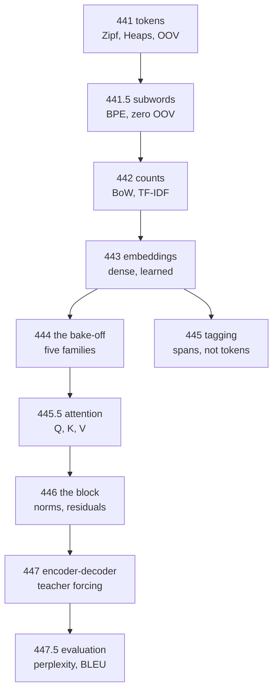

import Figure from "../../../../components/Figure.astro";
import Quiz from "../../../../components/Quiz.astro";

Text is not numbers, and every step from one to the other throws something away. This
phase measures each step: which words to keep, how to split them, what "similar" means,
and what attention buys over recurrence.

Two results frame everything else. **A linear model over word counts beat every neural
model here** — 0.8632 against a transformer's 0.8462, in 8.4 seconds against 460. And on
a task that needs two composed operations, **one attention block scored 0.3120 while two
scored 0.9990**. Neither is a slogan; both are measurements, and they point in opposite
directions about when architecture matters.

## The pages

| # | Page | The measured headline |
| --- | --- | --- |
| 441 | [Text Preprocessing](/deep-learning/phase-05---nlp--transformers/text-preprocessing-tokenization-stemming-lemmatization/) | lowercasing this corpus changes **0 words** — it was pre-processed; `br` is the 7th most frequent token |
| 441.5 | [Subword Tokenization](/deep-learning/phase-05---nlp--transformers/subword-tokenization-bpe-and-wordpiece/) | BPE at 2,070 pieces reaches **OOV 0.0000** against 0.0293 for 20,000 words |
| 442 | [Bag of Words & TF-IDF](/deep-learning/phase-05---nlp--transformers/bag-of-words-bow--tf-idf/) | sublinear TF-IDF **0.8748 in 0.4 s**; TF-IDF at 2,000 features beat counts at 30,000 |
| 443 | [Word Embeddings](/deep-learning/phase-05---nlp--transformers/word-embeddings-word2vec-glove/) | sentiment-trained vectors **collapse to cosine 1.000**; skip-gram finds `movie`/`film` at 0.746 |
| 444 | [Sentiment Analysis](/deep-learning/phase-05---nlp--transformers/sentiment-analysis-tutorial/) | five families: **TF-IDF 0.8632 wins**, transformer 0.8462 at 55× the cost |
| 445 | [Named Entity Recognition](/deep-learning/phase-05---nlp--transformers/named-entity-recognition-ner/) | token accuracy 0.8011, **entity F1 0.4389** — and all-`O` scores 0.5653 |
| 445.5 | [Attention from Scratch](/deep-learning/phase-05---nlp--transformers/attention-from-scratch-queries-keys-and-values/) | one block **0.3120**, two blocks **0.9990**; unscaled attention peaks at 0.9355 |
| 446 | [The Transformer Architecture](/deep-learning/phase-05---nlp--transformers/the-transformer-architecture/) | every ablation helps at 1 block; removing layer norm costs **0.0612** at 4 |
| 447 | [Sequence-to-Sequence](/deep-learning/phase-05---nlp--transformers/sequence-to-sequence-learning-machine-translation/) | attention took exact match **0.6250 → 0.9770** for 768 parameters |
| 447.5 | [Evaluating Language Models](/deep-learning/phase-05---nlp--transformers/evaluating-language-models-perplexity-and-bleu/) | neural **189.81** vs bigram 226.47; BLEU gives a correct reordering **0.0000** |



<Figure
  src="/images/dl/phase-05-nlp/transformer-architecture/against-recurrence"
  alt="Two panels. Left: bars of best validation accuracy for four families, all between 0.8210 and 0.8465, annotated with parameters and training seconds. Right: per-epoch validation accuracy where the transformer starts at 0.8462 in epoch one and stays flat, while the bag of words climbs from 0.7303 and the recurrent models rise more slowly."
  title="IMDB, 8,000 reviews, 6 epochs, matched width"
  caption="The transformer's entire learning happens in epoch 1 — 0.8462, which is also its best score across all six epochs. Attention over 200 positions in parallel means every token pair is one gradient step apart, so there is no long credit-assignment chain to unroll. That is the real advantage on display here; it is not accuracy, since the bag of words matched it at 0.8465 in a tenth of the time."
/>

<Figure
  src="/images/dl/phase-05-nlp/attention-from-scratch/scaling-and-softmax"
  alt="Two panels over 200 random draws with 12 tokens. Left: mean largest attention weight against key dimension. Without scaling it rises 0.4442, 0.7189, 0.8577, 0.9355 as the dimension goes 4, 16, 64, 256; with the 1/sqrt(d_k) scale it stays between 0.2567 and 0.3024. A dashed line marks uniform attention at 0.0833. Right: the same measurement as entropy, falling from 1.6128 to 0.1668 nats unscaled and holding near 2.08 scaled, against log 12 = 2.4849 for uniform."
  title="200 random query-key draws, 12 tokens"
  caption="Without the scale, attention at d_k = 256 puts 0.9355 of its weight on a single token before any training — the softmax has saturated on noise, and its gradient with it. The scaled version holds near 0.28 at every dimension, which is the point: the operation should behave the same whether the head is 4-dimensional or 256-dimensional. The entropy panel says the same thing in nats, against a uniform maximum of 2.4849."
/>

<Figure
  src="/images/dl/overviews/phase-summaries/phase-5"
  alt="Horizontal bars, one per page in the phase, each labelled with the claim it tested and coloured by the verdict: green where the standard story held, amber where it held at a price, red where the measurement contradicted it. 4 of 6 claims contradicted, 1 held at a price, 1 held."
  title="Every claim this phase set out to test"
  caption="Collected from the runs behind each page's own figures rather than measured afresh, so every bar is traceable to the page it names. Bar length is the log of the effect size, because the effects span from 0.0014 to 5,376 — the number that matters is printed on each bar. Across all nine phases, 34 of 54 claims were contradicted outright, 11 held at a cost that was worth stating, and 9 held as advertised."
/>

## Four results that contradict the usual story

1. **The simplest model won.** TF-IDF with logistic regression scored 0.8632 against an
   average embedding's 0.8575, a convolution's 0.8495, a transformer's 0.8462 and an
   LSTM's 0.8415 — with 9,768 parameters and 8.4 seconds. Sentiment is close to a keyword
   task, and 8,000 reviews is not much data.
2. **A transformer block's components do not help a shallow transformer.** At one block,
   removing the feed-forward network, the residuals or the layer norms all *raised*
   accuracy. Layer normalisation only earns its 128 parameters at depth, where removing it
   costs 0.0612.
3. **Sentiment-trained embeddings collapse.** `terrible`, `poor`, `waste` and `bad` end up
   at cosine 1.000 — parallel vectors — because a one-dimensional loss needs exactly one
   direction. The same corpus trained on co-occurrence gives `movie`/`film` at 0.746.
4. **Attention's win is convergence, not accuracy — until composition is needed.** The
   transformer matched a bag of words (−0.0002) but reached its best score in **epoch 1**.
   On the induction task, where the model must match a cue *and* shift one position, one
   block cannot do it at all.

## Four corpora that were too easy, and what fixing them showed

Three modules in this phase produced perfect or meaningless scores on the first attempt.
All three are now rebuilt, and the fixes are the most transferable content here.

| Experiment | First attempt | The flaw | After fixing |
| --- | --- | --- | --- |
| NER | every model **1.0000** | entity strings shared between train and test — the benchmark measured a word list | test pools disjoint, 38% unknown tokens → best F1 **0.4389** |
| seq2seq | everything **1.0000** | a bare date is trivially learnable | date buried in filler → attention worth **+0.3520** exact match |
| skip-gram | accuracy **0.4585** (below chance) | positives built first, so `validation_split` took only negatives | shuffled → 0.6470, and neighbours became semantic |
| perplexity | n-grams and neural in one table | scored on **different test sets** (231,210 tokens vs 30,000 windows) | same windows → neural 189.81 beats bigram 226.47 |

A fifth was a metric that flattered rather than a corpus that was easy: reporting the
**final** epoch's perplexity instead of the best gave 4,062.44 where the minimum was
189.81.

```p5 title="How often the standard story survived" desc="Step through the phases. Each bar splits the claims that phase tested into contradicted, held at a price, and held as advertised - the totals are summed live." height="400"
let picked = 0;
const PHASES = [
  [1, "Neural Network Foundations", 3, 0, 3, "a single neuron cannot do XOR - 0 of 40,401 weight pairs"],
  [2, "Training Deep Networks", 2, 2, 2, "146x the parameters bought 0.0150 accuracy"],
  [3, "Computer Vision", 4, 1, 1, "augmentation cost 0.1855 clean, bought 0.1105 rotated"],
  [4, "Sequence Models", 4, 2, 0, "a fixed state scored 0.0017 against attention's 1.0000"],
  [5, "NLP & Transformers", 4, 1, 1, "TF-IDF 0.8632 beat a transformer's 0.8462, 55x cheaper"],
  [6, "Generative", 3, 1, 2, "copying 200 real images scored FID 5.027 against real 9.605"],
  [7, "Reinforcement Learning", 4, 2, 0, "replay and target nets: 144.20 together, 53.45 either alone"],
  [8, "Scaling & Deployment", 5, 1, 0, "mixed precision measured 40.65x SLOWER on this CPU"],
  [9, "Capstones", 5, 1, 0, "a memoriser beat the VAE on Frechet distance"]
];
function setup() {
  createCanvas(620, 400);
  textFont("monospace");
}
function draw() {
  background(13, 17, 23);
  noStroke();
  fill(230);
  textSize(12);
  textAlign(LEFT, TOP);
  text("54 claims, 9 phases, every one tested by a measurement", 26, 16);
  let broke = 0;
  let cost = 0;
  let held = 0;
  for (let i = 0; i < PHASES.length; i++) {
    broke += PHASES[i][2];
    cost += PHASES[i][3];
    held += PHASES[i][4];
  }
  for (let i = 0; i < PHASES.length; i++) {
    const y = 48 + i * 26;
    const row = PHASES[i];
    const chosen = i === picked;
    fill(chosen ? 255 : 130, chosen ? 211 : 140, chosen ? 67 : 155);
    textSize(9);
    text("Phase " + row[0] + "  " + row[1], 26, y + 5);
    let x = 250;
    const unit = 34;
    fill(224, 108, 117);
    rect(x, y, row[2] * unit, 17, 2);
    x += row[2] * unit;
    fill(255, 211, 67);
    rect(x, y, row[3] * unit, 17, 2);
    x += row[3] * unit;
    fill(126, 192, 143);
    rect(x, y, row[4] * unit, 17, 2);
    if (chosen) {
      noFill();
      stroke(255, 211, 67);
      strokeWeight(1.5);
      rect(248, y - 2, 6 * unit + 4, 21, 3);
      noStroke();
    }
  }
  const row = PHASES[picked];
  fill(200);
  textSize(10);
  text("Phase " + row[0] + " headline:", 26, 300);
  fill(255, 211, 67);
  textSize(10);
  text(row[5], 26, 318);
  fill(150);
  textSize(9);
  text("contradicted " + row[2] + "   held at a price " + row[3]
       + "   held " + row[4], 26, 340);
  fill(224, 108, 117);
  rect(26, 360, 12, 12, 2);
  fill(150);
  textSize(9);
  text("contradicted  " + broke + " of 54", 44, 362);
  fill(255, 211, 67);
  rect(210, 360, 12, 12, 2);
  fill(150);
  text("held at a price  " + cost, 228, 362);
  fill(126, 192, 143);
  rect(400, 360, 12, 12, 2);
  fill(150);
  text("held  " + held, 418, 362);
  fill(110);
  textSize(8.5);
  text("click a row. Collected from each page's own measured run.", 26, 382);
}
function mousePressed() {
  for (let i = 0; i < PHASES.length; i++) {
    const y = 48 + i * 26;
    if (mouseY > y && mouseY < y + 20) { picked = i; }
  }
}
```

## The habit this phase teaches

Every page compares against something that costs nothing:

| Task | The do-nothing baseline | What it exposed |
| --- | --- | --- |
| vocabulary choice | coverage at each cap (0.7624 at 1,000 words) | 23.8% of the text discarded silently |
| classification | TF-IDF + logistic (0.8632) | four neural families that never beat it |
| tagging | predict `O` everywhere (0.5653) | a model at 0.5750 token accuracy finding almost nothing |
| language modelling | uniform = vocabulary size (4,997.00) | whether a perplexity is meaningful at all |
| generation | greedy exact match, not per-character | 0.9217 character accuracy = 0.6250 exact |

```p5 title="Accuracy against what it cost" desc="Five model families on the same 8,000 IMDB reviews. Drag to weight training time; the ranking re-sorts and the winner changes." height="370"
let weight = 0.0;
const FAMILIES = [
  ["TF-IDF + linear", 0.8632, 8.4, 9768],
  ["average embedding", 0.8575, 41.0, 160449],
  ["1D convolution", 0.8495, 96.0, 172929],
  ["transformer block", 0.8462, 460.0, 173377],
  ["LSTM", 0.8415, 372.0, 168641],
];
function setup() {
  createCanvas(620, 370);
  textFont("monospace");
}
function scoreOf(row) {
  return row[1] - weight * Math.log10(row[2]) * 0.04;
}
function draw() {
  background(13, 17, 23);
  noStroke();
  fill(230);
  textSize(12);
  textAlign(LEFT, TOP);
  text("8,000 IMDB reviews - time penalty " + weight.toFixed(2), 26, 18);
  fill(150);
  textSize(9);
  text("score = accuracy - penalty x log10(seconds) x 0.04", 26, 38);
  const ranked = FAMILIES.slice().sort((a, b) => scoreOf(b) - scoreOf(a));
  for (let i = 0; i < ranked.length; i++) {
    const row = ranked[i];
    const y = 66 + i * 44;
    fill(150);
    textSize(10);
    text(row[0], 26, y);
    fill(48, 56, 68);
    rect(210, y - 2, 300, 18, 3);
    const value = Math.max(0, Math.min(1, scoreOf(row)));
    if (i === 0) { fill(126, 192, 143); } else { fill(107, 169, 221); }
    rect(210, y - 2, value * 300, 18, 3);
    fill(235);
    textSize(9.5);
    text(scoreOf(row).toFixed(4), 520, y + 2);
    fill(110);
    textSize(8.5);
    text(row[2] + "s", 168, y + 2);
  }
  fill(255, 211, 67);
  textSize(11);
  text("winner: " + ranked[0][0], 26, 296);
  fill(48, 56, 68);
  rect(300, 300, 150, 4, 2);
  fill(255, 211, 67);
  circle(300 + weight * 150, 302, 11);
  fill(150);
  textSize(9);
  text("TF-IDF wins at every penalty including zero: it is both the", 26, 324);
  text("most accurate and 55x cheaper than the transformer. Sentiment is", 26, 337);
  text("close to a keyword task, and 8,000 reviews is not much data.", 26, 350);
}
function mousePressed() { mouseDragged(); }
function mouseDragged() {
  if (mouseY < 290 || mouseX < 290) { return; }
  weight = Math.min(Math.max((mouseX - 300) / 150, 0), 1);
}
```

## What carries into the rest of the module

| Idea from this phase | Where it comes back |
| --- | --- |
| attention over a set of tokens | diffusion U-Nets, every modern generative model |
| pre-norm blocks with residuals | Phase 6's architectures, Phase 8's scaling |
| teacher forcing and exposure bias | autoregressive image and audio generation |
| perplexity and its tokenizer dependence | Phase 6's text generation page |
| "measure against the do-nothing baseline" | every remaining phase |

:::tip[From the book]
Chollet introduces text vectorisation by noting that deep learning for text is
"pattern recognition applied to words, sentences and paragraphs" — not understanding. The
bake-off on page 444 is that sentence as a measurement: on a task decidable from word
presence, a model that cannot represent word order at all scored highest.
:::

:::tip[From the book]
The attention paper's title claims attention is all you need. Page 446 takes the claim
apart component by component and finds that at one block it is *more* than you need —
and that the pieces which look redundant there (layer normalisation especially) are
exactly the pieces that stop a four-block stack from degrading. The architecture is a
depth-enabling device, and its parts only make sense at depth.
:::


<Quiz
  questions={[
    {
      q: "TF-IDF with logistic regression scored 0.8632 in 8.4 seconds against a transformer's 0.8462 in 460. What is the defensible conclusion?",
      options: [
        "Transformers do not work for sentiment",
        "On 8,000 reviews of a near-keyword task, the extra machinery has nothing to learn that counts do not already capture - which is a claim about this budget and this task, not about transformers",
        "The transformer was implemented incorrectly",
        "Accuracy is the wrong metric"
      ],
      answer: 1,
      explanation: "The transformer reached its best score in epoch 1, so it converged - it just had no headroom. State the corpus size and the task type and the two results stop contradicting each other."
    },
    {
      q: "One attention block scored 0.3120 on the induction task while two scored 0.9990. Why can one block not do it?",
      options: [
        "One block has too few parameters",
        "The task needs two composed operations - match a cue, then shift one position - and a single attention layer can only perform one round of look-up before the output is read",
        "One block trains too slowly",
        "The softmax saturates"
      ],
      answer: 1,
      explanation: "This is a depth argument rather than a capacity argument. Widening one block does not help; adding a second one takes the score from near-chance to near-perfect."
    },
    {
      q: "Embeddings trained on the sentiment objective put `terrible`, `poor`, `waste` and `bad` at cosine 1.000 - exactly parallel. What caused that?",
      options: [
        "A bug in the cosine calculation",
        "A one-dimensional loss needs exactly one direction, so every word useful for the task collapses onto that axis and all other structure is discarded",
        "Too few training epochs",
        "The vocabulary was too small"
      ],
      answer: 1,
      explanation: "The same corpus trained on co-occurrence instead gives `movie`/`film` at 0.746. What an embedding 'means' is decided entirely by the objective that shaped it."
    },
    {
      q: "NER token accuracy was 0.8011 while entity F1 was 0.4389, and labelling everything `O` already scores 0.5653 on tokens. What is the lesson?",
      options: [
        "The tagger is broken",
        "Token accuracy on a task dominated by one class is close to a do-nothing baseline; the unit you evaluate has to be the unit you care about, which for NER is the whole span",
        "F1 is too harsh",
        "The dataset is too small"
      ],
      answer: 1,
      explanation: "Getting three of four tokens in a name right produces a wrong entity and a good token score. Half a span is not half an answer."
    },
    {
      q: "At one transformer block, removing the feed-forward network, the residuals or the layer norms all RAISED accuracy; at four blocks, removing layer norm cost 0.0612. What does that pattern say?",
      options: [
        "The components are useless",
        "Those components solve problems that only appear with depth, so a shallow ablation measures their cost without ever exposing their benefit",
        "The four-block model was overfitting",
        "Layer norm should always be removed"
      ],
      answer: 1,
      explanation: "Ablating a stabiliser on a model that is not unstable measures only the parameters it costs. The depth at which you ablate is part of the experiment."
    }
  ]}
/>
