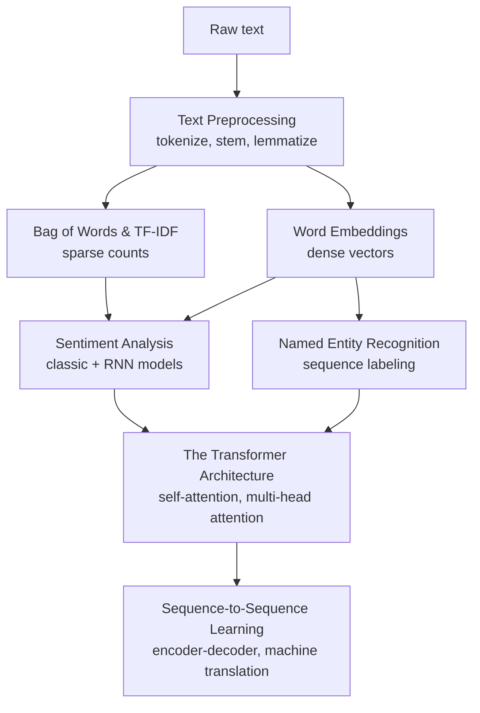

## What this phase covers

**Natural Language Processing (NLP)** is about teaching a model to read, understand,
and generate human language. Chapter 16 of *Hands-On Machine Learning* frames this
as a journey: start with raw text, turn it into numbers a neural network can use,
feed those numbers through a sequence model, and — eventually — replace the sequence
model entirely with **attention**.

This phase follows that same arc:

## Phase 5 topics

1. Text Preprocessing (Tokenization, Stemming, Lemmatization)
2. Bag of Words (BoW) & TF-IDF
3. Word Embeddings (Word2Vec, GloVe)
4. Sentiment Analysis Tutorial
5. Named Entity Recognition (NER)
6. The Transformer Architecture
7. Sequence-to-Sequence Learning (Machine Translation)

## Why this phase matters

Every large language model you use today — GPT, BERT, and their descendants — traces
back to the ideas in this phase:

- text has to become **numbers** before a model can touch it (preprocessing, BoW/TF-IDF, embeddings)
- sequence models (RNNs) were the first serious attempt at "understanding" text in order
- **attention** let models look directly at any word instead of squeezing everything
  through a single hidden state — and that single idea unlocked the Transformer,
  BERT, and GPT

By the end of this phase you'll understand not just *how* to call
`TfidfVectorizer` or a Hugging Face model, but *why* each step in the pipeline exists.
